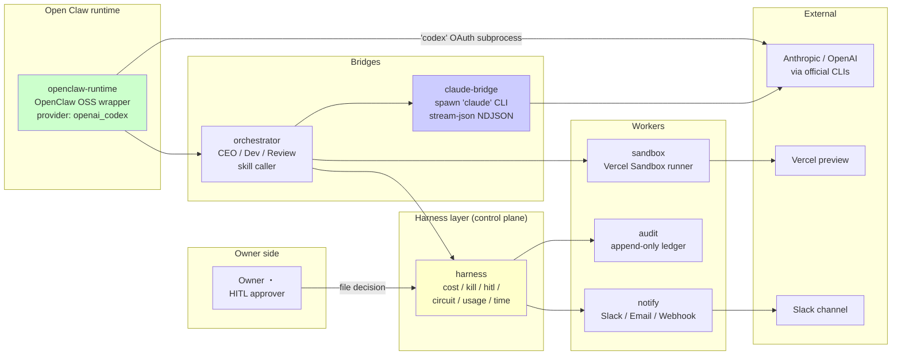
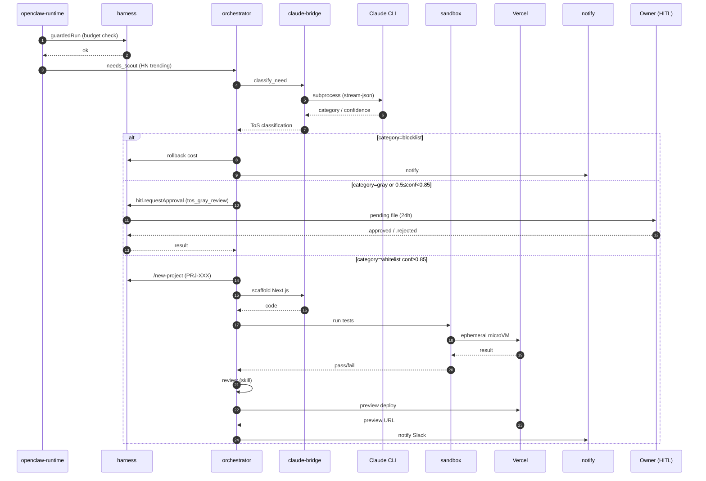

# Clawbridge — W0 アーキテクチャドラフト

- 案件: PRJ-019 Clawbridge (Open Claw 駆動の Owner-in-the-loop 透明 AI 組織ハーネス)
- フェーズ: W0-Week2 (2026-05-09〜05-15) ブートストラップ準備
- 作成: 2026-05-03 / Dev 部門
- v2 更新: 2026-05-03 (DEC-019-033 + DEC-020-003 同居実装方針反映、Pre-Phase 1 scaffold 配置と整合)
- 上位: `projects/PRJ-019/reports/pm-architecture-v2-and-phase1-plan.md` §2 / §3.2 (WBS 正本)
- skeleton: `../../reports/dev-architecture-w0-skeleton.md` (5/26 frozen 候補)
- 兄弟: `./security-w0.md` / `../README.md` / `../../reports/dev-openclaw-runtime-wrapper.md`

## §0 v2 追補 — DEC-019-033 + DEC-020-003 反映

Pre-Phase 1 scaffold 配置 (本コミット) で以下を Web 層に追加:

- `app/web/` (Next.js 15 App Router) — 透明性ダッシュボード + 権限管理 UI + 提案承認 UI の単一統合フロント
- `app/supabase/migrations/` — 8 テーブル DDL (hitl_requests / audit_log / policy_versions / policy_audit_log / proposals / cost_ledger / runtime_wrapper_state / knowledge_extraction_queue)
- `app/supabase/policies/` — 各テーブル RLS policy (tenant 隔離 + role 別 SELECT/UPDATE/INSERT)
- `app/policies/casbin/` — `model.conf` + `policy.csv` (RBAC + 7 category × deny envelope)
- `app/web/src/types/hitl.ts` — HITL 11 種 TS interface (discriminated union + SLA テーブル)
- `app/web/src/lib/openclaw-wrapper/` — RuntimeWrapper / FeatureFlag / VersionPin / CircuitBreaker
- `app/web/src/lib/audit/hash-chain.ts` — SHA-256 hash chain verify ライブラリ
- `app/clawdialog/` — PRJ-020 同居 placeholder (DEC-020-003)

priviledge escalation 4 層防御 (DEC-019-033 §⑤) との対応:

| 層 | 実体 | 本 scaffold での所在 |
|----|------|---------------------|
| L1 Static Policy | `policies/casbin/policy.csv` の deny envelope | `app/policies/casbin/policy.csv` |
| L2 Runtime FeatureFlag | RuntimeWrapper 内 FeatureFlagStore | `app/web/src/lib/openclaw-wrapper/` |
| L3 HITL 10 permission_change_review | `hitl_requests` + Owner UI | `app/web/src/types/hitl.ts` + 移行 SQL |
| L4 Audit + Anomaly Detection | `audit_log` SHA-256 hash chain | `app/supabase/migrations/20260503000002_audit_log.sql` + `app/web/src/lib/audit/hash-chain.ts` |


## §1 概要 — Phase 1 アーキテクチャ全体図

Clawbridge は **7 workspace + 1 統合テストベンチ**の TypeScript pnpm monorepo として構成し、各 workspace は明示的な依存方向を保つ。Open Claw 本体は personal AI assistant 化したため、本案件は連携プラグイン (Enderfga/openclaw-claude-code) を中心に **parts only** で利用する。



データフローの基本則:

1. Open Claw からのすべての outbound コマンドは harness 経由で予算 / kill / HITL を通過する。
2. Anthropic への呼び出しは **claude-bridge subprocess (公式 `claude` CLI) のみ**。Open Claw 本体は Anthropic API key も OAuth トークンも触れない (G-V2-11)。
3. 外部 outbound は notify (Slack) / sandbox (Vercel) のみ。第三者 API 直叩きは circuit-breaker で遮断する。

## §2 W0 完了範囲 vs W1+ 範囲

```mermaid
flowchart TB
    subgraph W0["W0 (5/2-5/18)"]
        W0a[harness 9 controls 実装]
        W0b[claude-bridge spawn + stream-json]
        W0c[mock-claude 5 シナリオ]
        W0d[hitl tos_gray_review 第6種]
        W0e[openclaw-runtime skeleton + Mock]
        W0f[architecture-w0.md / security-w0.md]
    end

    subgraph W1["W1 (5/19-5/25)"]
        W1a[orchestrator: CEO/Dev/Review caller]
        W1b[sandbox: Vercel Sandbox PoC]
        W1c[notify: Slack 1 channel]
        W1d[RealOpenclawRuntime 着手]
    end

    subgraph W2["W2 (5/26-6/1)"]
        W2a[ToS classifier prompt 実装]
        W2b[DoD 3 分岐 wiring]
        W2c[BAN drill #2 (Sumi 同居)]
    end

    subgraph W3["W3 (6/2-6/8)"]
        W3a[E2E HN trending → preview deploy]
        W3b[FN-Black 1 回目評価 (60 件)]
    end

    subgraph W4["W4 (6/9-6/13)"]
        W4a[Phase 1 DoD 完了判定]
        W4b[FN-Black 2 回目評価]
        W4c[verify-zero-side-effect 月次]
    end

    W0 --> W1 --> W2 --> W3 --> W4

    style W0 fill:#ccffcc
    style W4 fill:#ffcccc
```

## §3 各 workspace の責務

| workspace | 責務 | W0 完了状況 | W1+ 残作業 |
|---|---|---|---|
| `harness/` | コスト / kill / HITL / circuit / usage / time の制御層 | 完成 (9 modules, 11 tests/55 cases) | G-09 監査基盤接続 |
| `claude-bridge/` | 公式 `claude` CLI subprocess spawn + stream-json NDJSON parse | 完成 (3 modules, 29 cases) | live integration test (W2 後半) |
| `openclaw-runtime/` | OpenClaw OSS ラッパ (OpenClaw → orchestrator 連携) | Mock + skeleton (6 cases) | RealOpenclawRuntime (W1) |
| `orchestrator/` | CEO/Dev/Review 等 skill の呼び出し IF | package.json のみ | 全実装 (W1) |
| `sandbox/` | Vercel Sandbox 連携 (生成コード隔離実行) | package.json のみ | 実装 + PoC (W1) |
| `audit/` | Supabase append-only 監査ログ | package.json のみ | G-09 実装 (W2) |
| `notify/` | Slack / Email / Webhook 通知 | package.json のみ | Slack 1 channel (W1) |
| `tests/integration/` | mock-claude + シナリオ統合テスト | mock-claude 5 シナリオ完成 | E2E (W3) |

## §4 データフロー (Phase 1 DoD 自動化)



## §5 接続方式 P-D 改の核

W0 で物理レベルに焼き込んだ 5 つの不変条件 (DEC-019-002 / review v2 §6 行 #5):

1. **Anthropic API は絶対に直接叩かない**。`harness/` `claude-bridge/` `openclaw-runtime/` のいかなるモジュールも `@anthropic-ai/sdk` / `https://api.anthropic.com` を import / fetch しない。
2. **Claude 関連はすべて公式 `claude` CLI (subprocess) 経由**。`claude-bridge/src/spawn.ts` が `child_process.spawn('claude', ...)` でしか起動しない (引数固定 + env allow-list)。
3. **OAuth トークンは env / config から直接読まない**。`auth-detector.ts` が `~/.claude/credentials.json` の存在のみを `fs.stat()` で確認し、ファイル中身を読み出す経路を物理的に持たない。
4. **Open Claw は Anthropic OAuth トークンに到達できない**。`OpenclawConfig.envAllowList` に `ANTHROPIC_API_KEY` / `CLAUDE_CODE_OAUTH_TOKEN` を含めない (型レベル + lint + runtime の 3 重保護)。
5. **メイン業務用 Anthropic アカウントとは分離した別アカウントで PoC** (review v2 §5、CB-D-W0-05)。

## §6 W0-Week1 で実装したハードガード 9 項目

| ID | 名称 | 実装位置 | テスト |
|---|---|---|---|
| G-01 | コスト上限ハードキャップ | `harness/src/cost-tracker.ts:FileCostTracker.checkBudget` | `__tests__/cost-tracker.test.ts` (12 cases) |
| G-02 | 緊急停止 | `harness/src/kill-switch.ts:FileKillSwitch` (`~/.clawbridge/STOP` 物理 + API) | `__tests__/kill-switch.test.ts` (8 cases) |
| G-04 | HITL ゲート (5 種 + tos_gray_review 第 6 種を W0-Week2 で追加) | `harness/src/hitl-gate.ts:FileHitlGate.requestApproval` | `__tests__/hitl-gate.test.ts` (11 cases、うち 6 は W0-Week2 追加) |
| G-05 | サーキットブレーカ | `harness/src/circuit-breaker.ts:CircuitBreaker` | `__tests__/circuit-breaker.test.ts` (8 cases) |
| G-06 / G-V2-08 | レート異常検知 → kill | `harness/src/usage-monitor.ts:FileUsageMonitor` (60s 窓 5 件閾値) | `__tests__/usage-monitor.test.ts` (5 cases) |
| G-08 | 連続稼働 12h 上限 (NG-3 予防) | `harness/src/usage-monitor.ts:startRuntimeWatch` | `__tests__/time-source.test.ts` (11 cases、libfaketime 代替) |
| G-V2-03 | 起動元偽装 / OAuth 直 spawn 全面禁止 | `claude-bridge/src/spawn.ts` (`child_process.spawn('claude', ...)` 固定) | `__tests__/spawn.test.ts` (10 cases) |
| G-V2-11 | OAuth トークン到達禁止 (FS/env 隔離) | `claude-bridge/src/auth-detector.ts` (`fs.stat()` のみ、credentials.json は読まない) + spawn env allow-list | `__tests__/auth-detector.test.ts` (6 cases) + spawn ANTHROPIC_API_KEY 漏洩テスト |

control-evidence への詳細リンクは `projects/PRJ-019/reports/control-evidence/index.md` 参照。

## §7 W0-Week2 持越項目

| 項目 | 目標 | ステータス |
|---|---|---|
| HITL 第 6 種 `tos_gray_review` 実装 | DEC-019-018 着手必須要件 | 完了 (本書と同 commit) |
| `openclaw-runtime` skeleton + Mock | 5 case test、`RealOpenclawRuntime` は not-implemented スタブ | 完了 (本書と同 commit) |
| docs/architecture-w0.md / security-w0.md / README.md 更新 | Mermaid 3 枚以上 | 完了 (本書) |
| Live test (`claude --version` 実機 OAuth 確認) | CB-D-W0-06 | 未着手 (W0-Week2 中盤) |
| notify Slack 1 channel 雛形 | webhook URL 経由のみ、HITL 連携なし | 未着手 (W0-Week2 後半) |
| `verify-zero-side-effect.sh` 完成 | git log + Vercel deploy + Supabase 行差分監視 | 未着手 (W0-Week2 末) |
| BAN drill #1 立会 | 2026-05-13 シナリオ実施 (DEC-019-019) | スケジュール済 |

---

**v1**: 2026-05-03 (W0-Week2 ブートストラップ) ／ **次回更新**: W1 開始時点 (orchestrator / sandbox 実装直前)
