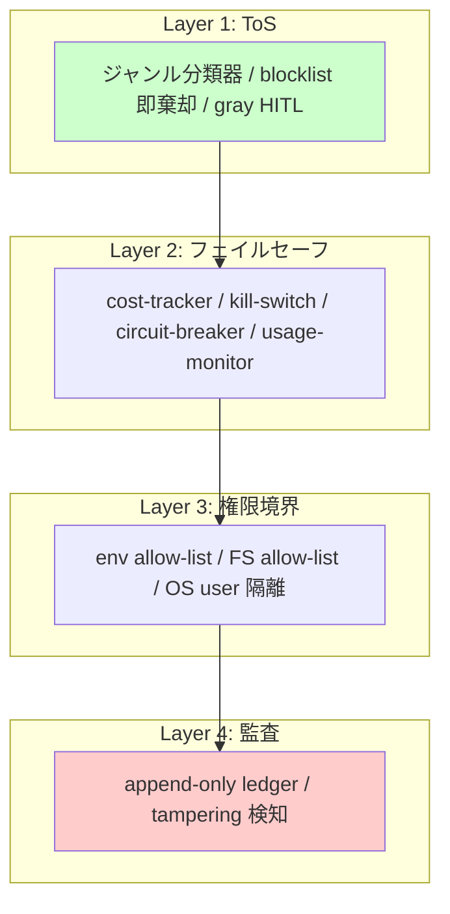
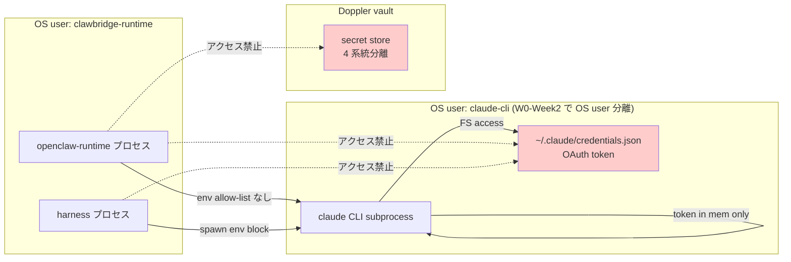
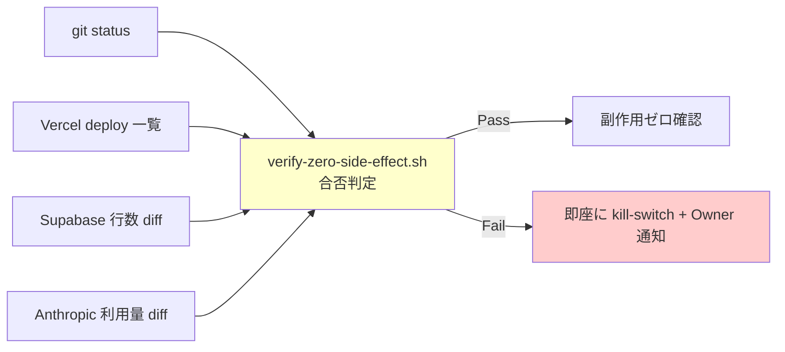

# Clawbridge — W0 セキュリティドラフト

- 案件: PRJ-019 Clawbridge
- フェーズ: W0-Week2 ブートストラップ準備
- 作成: 2026-05-03 / Dev 部門
- v2 更新: 2026-05-03 (DEC-019-033 + DEC-020-003 反映 / Pre-Phase 1 scaffold 配置時)
- skeleton: `../../reports/dev-security-w0-skeleton.md` (5/26 frozen 候補)
- 兄弟: `./architecture-w0.md` / `../../reports/dev-tos-gray-review-gate-skeleton.md`

## §0 v2 追補 — DEC-019-033 priviledge escalation 4 層防御

Pre-Phase 1 で以下の物理防止策を実装:

1. **policy_versions write は Owner UI のみ**: RLS で `auth.jwt() ->> 'role' = 'owner'` を WITH CHECK に強制 (`app/supabase/policies/03_policy_versions.sql`)
2. **service_role key を subprocess に渡さない**: `.env.example` で明文化、Web の API route のみで参照 (`app/.env.example`)
3. **open_claw_restricted DB role は SELECT only**: `policy_versions` への INSERT/UPDATE/DELETE は revoke、Casbin policy fetch だけが許可
4. **13 prohibited domains は永遠 deny envelope**: `app/policies/casbin/policy.csv` にハードコード、Owner UI でも解除不可 (genre:adult / gambling / weapons / drugs / hate_speech / self_harm / csam / malware / phishing / bioweapon / election_interference / dox / non_consensual)
5. **audit_log SHA-256 hash chain**: Postgres trigger + Node 側 verify ライブラリ (`app/web/src/lib/audit/hash-chain.ts`) で改ざん検知

HITL 11 種は `pm-v4-hitl-gates-9-10-11-wbs.md` §1.2 で正式化、本 scaffold で TS interface (`app/web/src/types/hitl.ts`) と DB 層 CHECK constraint (`app/supabase/migrations/20260503000001_hitl_requests.sql`) の両端で型整合を強制。

---

- 上位: `projects/PRJ-019/reports/review-v2-subscription-risk-and-fallback.md` §6 / §7 (必須コントロール正本)、`projects/PRJ-019/reports/review-ban-drill-1-scenario.md` (BAN drill #1)

## §1 セキュリティ基本方針 (4 層防御)

優先順位:

1. **ToS 違反予防**を最優先 (Phase 1 DoD 失敗より、ToS 違反の方が事業継続不能リスクが大)
2. **権限境界**を物理レベルで保つ (型 / lint / runtime / OS の 4 重保護)
3. **フェイルセーフ**は false-positive 寄り (10% 過剰停止は許容、漏れ 0% を目標)
4. **監査ログ**は append-only、5 年保持、月次 tampering 検査

## §2 G-01〜G-V2-11 9 コントロールの実装エビデンス

| ID | 名称 | エビデンス | 検証 |
|---|---|---|---|
| G-01 | コスト上限ハードキャップ | `harness/src/cost-tracker.ts` (4 層: session/project/day/month) | [G-01-evidence.md](../../reports/control-evidence/G-01-evidence.md) |
| G-02 | 緊急停止 | `harness/src/kill-switch.ts` (`~/.clawbridge/STOP` 物理 + API) | (W0-Week2 で control-evidence/G-02-evidence.md 作成) |
| G-04 | HITL ゲート (6 種、tos_gray_review 含む) | `harness/src/hitl-gate.ts` | [G-04-evidence.md](../../reports/control-evidence/G-04-evidence.md) |
| G-05 | サーキットブレーカ | `harness/src/circuit-breaker.ts` (5 連続失敗で 30s open) | [G-05-evidence.md](../../reports/control-evidence/G-05-evidence.md) |
| G-06 | レート異常検知 → kill | `harness/src/usage-monitor.ts` (60s 窓 5 件閾値) | [G-06-evidence.md](../../reports/control-evidence/G-06-evidence.md) |
| G-08 | 連続稼働 12h 上限 | `harness/src/usage-monitor.ts:startRuntimeWatch` + `time-source.ts` | [G-08-evidence.md](../../reports/control-evidence/G-08-evidence.md) |
| G-V2-03 | 起動元偽装 / OAuth 直 spawn 全面禁止 | `claude-bridge/src/spawn.ts` (`child_process.spawn('claude', ...)` 引数固定) | [G-V2-03-evidence.md](../../reports/control-evidence/G-V2-03-evidence.md) |
| G-V2-08 | 401/403/429 連続検知 → kill | (= G-06) | (G-06 と統合) |
| G-V2-11 | OAuth トークン到達禁止 (FS/env 隔離) | `claude-bridge/src/auth-detector.ts` (`fs.stat()` のみ) + spawn env allow-list | [G-V2-11-evidence.md](../../reports/control-evidence/G-V2-11-evidence.md) |

## §3 BAN フォールバック手順 5 ステップ

DEC-019-019 (BAN drill #1、2026-05-13 実施) の 5 SLA:

| # | ステップ | SLA | 検証 |
|---|---|---|---|
| 1 | 検知 | < 1 分 | Anthropic 警告メールを `notify` でモニタ、または `usage-monitor` の 401/403 連続検知 |
| 2 | 通知 | < 5 分 | Slack `#clawbridge-incidents` + Owner Email |
| 3 | 退避 | < 30 分 | `kill-switch` 全停止、`~/.clawbridge/STOP` 物理 touch、子プロセス強制終了 |
| 4 | secret rotate | < 60 分 | Doppler / 1Password から該当 secret revoke + 新規発行 |
| 5 | 代替起動 (P-E フォールバック) | < 4 時間 | 第 2 Anthropic アカウントへの切替、`auth-detector` で OAuth 再確認 |

詳細シナリオ: `projects/PRJ-019/reports/review-ban-drill-1-scenario.md` §1〜§8。

## §4 OAuth トークン到達禁止 (G-V2-11) の物理レベル分離

- `auth-detector.ts` は `credentials.json` の **`fs.stat()` のみ**実行し、中身を読まない (テストで実証、`auth-detector.test.ts` 参照)。
- `spawn.ts` の env allow-list は `ANTHROPIC_API_KEY` / `OPENAI_API_KEY` / `*secret*` をブロック (テストで実証)。
- OS user / Doppler レベル隔離は **C-A-05 (W0-Week2 着手)**: clawbridge-runtime user に `~/.claude/` への read 権限を持たせない、または別 home dir を使う。

## §5 副作用ゼロ原則

既存 PRJ-001〜018 への副作用ゼロを以下の 4 経路で確認:

`scripts/verify-zero-side-effect.sh` (W0-Week2 末で完成):

- `git log --since="$LAST_RUN" -- projects/PRJ-001 ... PRJ-018` で commit 0 件確認
- `vercel list --json` で PRJ-019 以外の deploy が増えていないこと
- Supabase: 既存 PRJ プロジェクトの table 行数 baseline 比較
- Anthropic 利用量: 別アカウントに分離済 (CB-D-W0-05) のため main アカウントは触らない

## §6 secret 取扱

| 系統 | 用途 | 保管先 | コードに含めるか |
|---|---|---|---|
| Anthropic OAuth | claude-bridge subprocess | `~/.claude/credentials.json` (CLI 自身が管理) | **絶対 NG** |
| OpenAI Codex Pro OAuth | openclaw-runtime | `~/.openclaw/openclaw.json` (CLI 自身が管理) | **絶対 NG** |
| Slack webhook URL | notify | Doppler / 1Password vault | dev/staging は dummy URL のみ |
| Supabase service role key | audit | Doppler / 1Password vault | コードからは `process.env` 経由のみ、env allow-list で notify/audit のみ通す |

dummy 値ルール:

- テストで使う Slack webhook URL は `https://hooks.slack.test/dummy/...` のように **必ず `.test` TLD**
- Supabase URL は `https://test.supabase.test/...`
- 本物の secret はコード / テスト / log / commit / PR にも含めない

## §7 監査ログ (G-09)

W0-Week2 着手予定:

- Supabase append-only テーブル (`audit_log`)
- 各レコード: `created_at` / `actor` / `action_kind` / `payload_hash` / `prev_hash` (chain)
- 月次で `prev_hash` chain を検証 (tampering 検知)
- 5 年保持 (Anthropic ToS / GDPR 双方の最長要件)

## §8 W0-Week2 着手予定の追加コントロール

| ID | 名称 | 着手目標 |
|---|---|---|
| G-02 | CLI 統合 (kill-switch を CLI から touch する owner UX) | W0-Week2 前半 |
| G-07 | secret 隔離 microVM (env 引き渡しを type level で allow-list 化) | W0-Week2 中盤 |
| G-09 | 監査ログ Supabase 接続 | W0-Week2 後半 |
| G-10 | 通知 Slack 1 channel (HITL 連携あり) | W0-Week2 後半 |
| G-V2-08 | 401/403/429 連続検知 (G-06 と統合済、CLI 統合のみ残) | W0-Week2 前半 |
| C-A-01 | アカウント分離 (メイン業務 Anthropic と別アカウント) | CB-D-W0-05 (W0-Week1 で着手済、W0-Week2 で確認) |
| C-A-02 | dual control (kill-switch trigger に 2 経路) | W0-Week2 中盤 |
| C-A-03 | secret rotation 月次 | W0-Week2 末 |
| C-A-04 | 監査 chain 検証 | G-09 と同時 |
| C-A-05 | OS user 隔離 (clawbridge-runtime user) | W0-Week2 中盤 |

---

**v1**: 2026-05-03 (W0-Week2 ブートストラップ) ／ **次回更新**: BAN drill #1 (5/13) 結果を反映、または W1 開始時点
