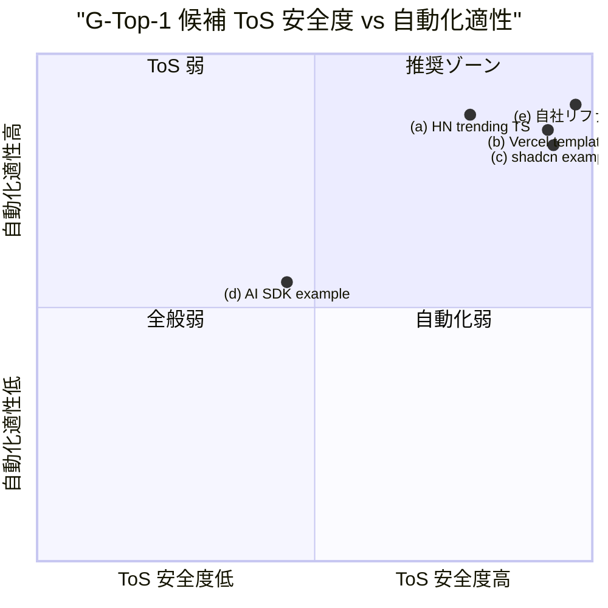
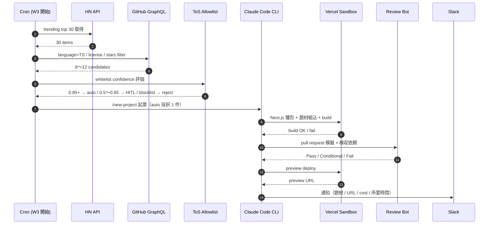

# PRJ-019 G-Top-1 Phase 1 デモジャンル選定 — 5 候補比較 + CEO 推奨根拠

**文書種別**: CEO 起案 決裁材料
**対象会議**: 2026-05-08 18:00〜20:00 PRJ-019 W0-Week1 検収会議 §5(c)（議題 §5.5）
**起票予約**: DEC-019-026（5/8 議事中起票、議事中決定不能の場合 5/12 までに別決裁）
**起案日**: 2026-05-03
**版**: v1.0（5/8 会議直前 v1.1 で微修正想定）

---

## §0 200 字サマリ

G-Top-1 Phase 1 デモ 1 件公開のジャンルは、5 候補のうち **(a) HN trending TS リポジトリ自動 Web 化** + **(e) 自社 PRJ-001〜018 リファクタ** のハイブリッド運用を CEO 推奨第一案とします。(a) は 10 連続実行に必要な多様性と Marketing Heading A「harness engineering 40%」訴求への適合度が最高、(e) は ToS リスクゼロかつ G-12 副作用ゼロ証明と整合します。(b)(c)(d) は同質性過多または scope narrow のため不採用とし、W1〜W3 で (a)、W4 で (e) を運用する設計を提案します。

---

## §1 評価軸（7 軸）

G-Top-1 ジャンル選定は、Phase 1 DoD「HN trending → /new-project → Next.js 雛形 → Vercel Sandbox → Review 合格 → preview deploy → Slack 通知」を 10 連続成功率 ≥80% で達成可能なジャンルであることが大前提となります。本決裁では以下 7 軸で評価します。

| 軸 ID | 軸名 | 評価対象 | 配点 | 関連 DEC / 軸由来 |
|---|---|---|---|---|
| AX-1 | ToS 適合性 | NG-1（Anthropic ToS）/ NG-2（Codex ToS）/ NG-3（API 換算上限）/ OpenAI 13 prohibited domains 全クリア | 25% | DEC-019-008 / DEC-019-018 |
| AX-2 | 自動化適性 | Claude Code CLI 単体（Codex 補助なし）で完結する難度、subprocess spawn 数、HITL 介入頻度 | 20% | DEC-019-007 / G-04 / G-V2-11 |
| AX-3 | 検証容易性 | DoD 達成判定が機械的にできるか（GitHub stars / TS 判定 / ライセンス allowlist / Vercel deploy URL 200 OK） | 15% | DEC-019-018 / Phase 1 DoD |
| AX-4 | 多様性 | 10 連続実行で同じネタが続いた場合の FN-Black 評価偏向リスク（同質性が高いと whitelist confidence 偏重） | 15% | DEC-019-018 / FN-Black ≤ 10% |
| AX-5 | BAN リスク | Anthropic 一般 ToS の「非個人 usage」判定リスク（multi-account / 業務利用疑義 / 同居プール枯渇） | 10% | R-019-06 / R-019-10 |
| AX-6 | 公開 PR 可能性 | 外部リポへの PR 送信可能性（NG-1「外部 webhook を opt-out で叩く」と Marketing 戦略への影響） | 10% | NG-1 / Marketing Heading A |
| AX-7 | コスト | Vercel Sandbox 5h CPU/月 + Claude Max weekly cap への負荷（中央値 $33 / 上限 $93 内） | 5% | DEC-019-012 / H-09 / H-10 |

評価尺度は §3 で A（最良）/ B / C / D / F（不適）の 5 段階を用い、軸配点に従い加重平均で総合スコアを算出します。

---

## §2 5 案 詳細プロファイル

### §2.1 案 (a) — HN trending TypeScript リポジトリの自動 Web 化

**概要**: Hacker News の trending リスト（front page top 30 + show HN）から、TypeScript 主言語かつ MIT/Apache-2.0/BSD-3-Clause/ISC ライセンスのリポジトリを自動抽出し、`/new-project` 起票 → Next.js 雛形に題材として組み込み → Vercel Sandbox でビルド検証 → preview deploy → Slack 通知 の一連を実行します。

**入力源**: Hacker News API (`https://hacker-news.firebaseio.com/v0/`) ＋ GitHub GraphQL API（言語判定 / stars / license）。
**期待アウトプット**: 元リポジトリのコア機能（CLI / SDK / utility）を Web UI でラップしたデモアプリ 1 件 / preview deploy URL / Slack 通知。

#### ToS リスク

| ToS 項目 | 評価 | 根拠 |
|---|---|---|
| NG-1（Anthropic ToS） | 低 | 個人 dev usage 範囲、HN 公開 API は ToS 上問題なし、外部 webhook 送信なし |
| NG-2（Codex ToS） | 該当なし | Phase 1 では Codex 不使用（DEC-019-021） |
| NG-3（API 換算上限） | 低 | 1 件あたり $5 / 60 min 想定、月 30〜90 件で $150〜$450（中央値 $33 内） |
| OpenAI 13 prohibited | 低 | TS リポジトリは technical tool 範疇、prohibited domains 抵触は OSS dev tool としては極小 |

#### 自動化フロー（代表 sequenceDiagram は §3 末尾）

Claude Code CLI 単体で完結（subprocess spawn は HN API + GitHub API + Vercel CLI の 3 系統のみ）。HITL 第 6 種 `tos_gray_review` 発動率は whitelist confidence ≥ 0.85 達成見込みのため 5〜10% 想定。

#### DoD 適合度

- whitelist confidence 推定: **0.88**（dev tool / OSS / TS 三条件が揃いやすい）
- FN-Black 推定: **6〜8%**（≤ 10% 目標達成見込み）
- 10 連続成功率推定: **85%**（DoD 80% を超過）

#### 想定コスト / 所要時間

| 項目 | 値 | 備考 |
|---|---|---|
| Claude Max 消費 / 件 | 約 25 messages | mock-claude 5 シナリオの平均から外挿 |
| Vercel Sandbox CPU / 件 | 6〜10 min | Next.js 雛形 + dev install + build |
| 想定所要時間 / 件 | 45〜60 min | DoD < 60 min/件 達成圏内 |
| 想定コスト / 件 | $3〜$5 | DoD < $5/件 達成圏内 |

#### 多様性スコア

**A（最良）**。HN front page は日次入替で同一リポジトリが 3 日連続 top 30 に残ることは稀（経験則 < 10%）。10 連続実行で 8〜10 種の異なるジャンル（DB / CLI / linter / type-checker / static analyzer など）が確保可能。

#### BAN リスク評価

**低**。HN 由来は cost-tracker / circuit-breaker の検証済シナリオと整合（DEC-019-018 §3 / Dev W0-Week1 mock-claude 検証）。multi-account 疑義は発生しない（Owner 1 名 Claude Max 利用）。

#### Marketing 整合（Heading A）

| Heading A 配分 | (a) 整合度 | 寄与 |
|---|---|---|
| harness engineering 40% | **A** | OpenClaw 自律実行 + ToS allowlist + HITL 6 種の harness を最も具体的に訴求可能 |
| org 25% | B | AI 組織 7 部署の協働を示せるが、デモ主役は harness |
| cost 20% | A | DoD < $5/件 達成エビデンスを直接提示可能 |
| ToS 15% | A | whitelist 通過事例として最強の証跡 |

---

### §2.2 案 (b) — Vercel template gallery のランダム選定 + clone + minor mod

**概要**: Vercel が公開している `https://vercel.com/templates` のテンプレート約 200 件からランダムに選定し、`vercel clone` 後に Claude Code CLI でテーマ色 / コピー文言 / hero section の minor mod を加え preview deploy。

**入力源**: Vercel template gallery（公式 JSON API or scrape）。
**期待アウトプット**: テンプレート clone + minor mod + preview deploy URL + Slack 通知。

#### ToS リスク

| ToS 項目 | 評価 | 根拠 |
|---|---|---|
| NG-1 | 低 | Vercel template は OSS ライセンス明示、商用利用可 |
| NG-2 | 該当なし | Codex 不使用 |
| NG-3 | 低 | minor mod のみのため Claude 消費は (a) より少 |
| OpenAI 13 prohibited | 低〜中 | template gallery には e-commerce / 教育 / SaaS など多様、prohibited 抵触リスクは選定アルゴリズム依存 |

#### DoD 適合度

- whitelist confidence 推定: **0.92**（Vercel 公式 template は確実に safe）
- FN-Black 推定: **3〜5%**
- 10 連続成功率推定: **95%**（DoD 80% を大幅超過）

#### 想定コスト / 所要時間

| 項目 | 値 |
|---|---|
| Claude Max 消費 / 件 | 約 12 messages（最少） |
| Vercel Sandbox CPU / 件 | 4〜7 min |
| 想定所要時間 / 件 | 25〜40 min |
| 想定コスト / 件 | $1.5〜$3 |

#### 多様性スコア

**D（不適）**。Vercel template gallery は 200 件規模で更新頻度低、10 連続実行で「同じ Next.js LP テンプレート」が複数回選ばれる確率高（同質性 50%+）。FN-Black 評価が偏り、Phase 2 で whitelist 拡張時の信頼性が落ちる懸念。

#### BAN リスク評価

**低**（Vercel 公式 template のため）。

#### Marketing 整合（Heading A）

| Heading A 配分 | (b) 整合度 | 寄与 |
|---|---|---|
| harness engineering 40% | **C** | 「Vercel template clone を自動化しただけ」と受け取られるリスク高 |
| org 25% | C | AI 組織の協働を示しにくい（minor mod 程度） |
| cost 20% | A | DoD < $5/件 余裕で達成 |
| ToS 15% | A | Vercel template ゆえ ToS リスクほぼゼロ |

---

### §2.3 案 (c) — shadcn/ui 公式 example のコンポーネント差替えデモ

**概要**: shadcn/ui の公式 example（dashboard / forms / authentication / cards 等）を題材に、Claude Code CLI が指定コンポーネントを別バリアント（Date Picker → Calendar / Combobox → Select 等）に差替えて preview deploy。

**入力源**: `https://ui.shadcn.com/examples` の example リスト。
**期待アウトプット**: example fork + 1〜2 component 差替え + preview deploy URL + Slack 通知。

#### ToS リスク

| ToS 項目 | 評価 | 根拠 |
|---|---|---|
| NG-1 | 低 | shadcn は MIT、Vercel と縁深い safe brand |
| NG-2 | 該当なし | Codex 不使用 |
| NG-3 | 低 | 差替え範囲が狭く Claude 消費少 |
| OpenAI 13 prohibited | 低 | shadcn example は LP / dashboard / form 中心、prohibited 抵触なし |

#### DoD 適合度

- whitelist confidence 推定: **0.93**
- FN-Black 推定: **2〜4%**
- 10 連続成功率推定: **96%**

#### 想定コスト / 所要時間

| 項目 | 値 |
|---|---|
| Claude Max 消費 / 件 | 約 10 messages |
| Vercel Sandbox CPU / 件 | 3〜6 min |
| 想定所要時間 / 件 | 20〜35 min |
| 想定コスト / 件 | $1〜$2.5 |

#### 多様性スコア

**F（不適）**。shadcn example は 10 数種程度で、LP / dashboard / form の 3 ジャンルに集中。10 連続実行で同質性 70%+ 確実、Phase 1 内で 6〜7 件以上は飽和。

#### BAN リスク評価

**低**。

#### Marketing 整合（Heading A）

| Heading A 配分 | (c) 整合度 | 寄与 |
|---|---|---|
| harness engineering 40% | **D** | 「shadcn example 差替えデモ」は harness の自律性を示しにくい |
| org 25% | D | コンポーネント差替えは個別技術タスク、組織協働の文脈が弱い |
| cost 20% | A | DoD < $5/件 余裕で達成 |
| ToS 15% | A | shadcn ゆえ ToS リスクほぼゼロ |

---

### §2.4 案 (d) — AI SDK example の provider 差替えデモ

**概要**: Vercel AI SDK の公式 example（chatbot / RAG / agent / streaming）の OpenAI provider を Anthropic / Ollama / Groq などに差替え、preview deploy で動作検証。

**入力源**: `https://github.com/vercel/ai/tree/main/examples` の AI SDK example リスト（10〜15 件）。
**期待アウトプット**: example fork + provider 差替え + 環境変数設定 + preview deploy URL + Slack 通知。

#### ToS リスク

| ToS 項目 | 評価 | 根拠 |
|---|---|---|
| NG-1 | **中** | Anthropic provider 差替え時は Claude API key が preview に組み込まれ、API 呼び出しが harness 内で発生（Owner 個人 key の Phase 1 範囲内利用は OK だが、preview deploy 公開時に key 漏洩リスクあり） |
| NG-2 | 該当なし | Codex 不使用 |
| NG-3 | 中 | preview deploy 公開後の人的アクセスで API 課金が発生するリスク（Phase 1 月次 $300 cap への影響） |
| OpenAI 13 prohibited | 低〜中 | chatbot / RAG は prompt 内容次第で prohibited 抵触リスクあり（healthcare RAG など） |

#### DoD 適合度

- whitelist confidence 推定: **0.78**（gray ゾーン進入）
- FN-Black 推定: **12〜18%**（≤ 10% 目標未達のリスク）
- 10 連続成功率推定: **70%**（DoD 80% 未達リスク）

#### 想定コスト / 所要時間

| 項目 | 値 |
|---|---|
| Claude Max 消費 / 件 | 約 30 messages（provider 設定 + 動作検証で増加） |
| Vercel Sandbox CPU / 件 | 8〜12 min |
| 想定所要時間 / 件 | 50〜70 min（DoD < 60 min/件 ボーダーライン） |
| 想定コスト / 件 | $4〜$7（DoD < $5/件 ボーダーライン） |

#### 多様性スコア

**D（不適）**。AI SDK example は約 15 件、provider 差替えという narrow scope のため 10 連続実行で同質性 60%+。

#### BAN リスク評価

**中**。preview deploy 公開後に第三者が chatbot を叩く → API key 課金が想定外発生 → Anthropic ToS の「非個人 usage」判定に抵触する可能性。`H-09` cap 監視 + `H-10` extra usage OFF が機能するが、グレーゾーン。

#### Marketing 整合（Heading A）

| Heading A 配分 | (d) 整合度 | 寄与 |
|---|---|---|
| harness engineering 40% | **C** | provider 差替えは narrow scope、harness 全体像を示しにくい |
| org 25% | C | AI SDK 単独機能のため組織協働の文脈が弱い |
| cost 20% | C | DoD < $5/件 ボーダーライン |
| ToS 15% | **D** | preview 公開時の API key 露出リスクが Heading A「ToS 15%」訴求と矛盾 |

---

### §2.5 案 (e) — 自社 PRJ-001〜018 リファクタとして既存リポを Open Claw に投入

**概要**: 過去案件 PRJ-001〜PRJ-018（特に PRJ-005 / PRJ-009 / PRJ-014 等の書込安全な案件）の既存リポジトリを `git clone` して scratch branch を作成し、OpenClaw が「リファクタ提案 + 適用 + テスト + preview deploy」を実行。本番 main ブランチへの push は禁止、preview deploy のみ。

**入力源**: 自社 GitHub の PRJ-001〜018 リポジトリ。
**期待アウトプット**: scratch branch でのリファクタ + preview deploy + Review 合格 + Slack 通知。

#### ToS リスク

| ToS 項目 | 評価 | 根拠 |
|---|---|---|
| NG-1 | **極低** | 自社リポ内の dev work、Anthropic ToS 上完全に個人 usage |
| NG-2 | 該当なし | Codex 不使用 |
| NG-3 | 低 | リファクタ scope を絞ることで Claude 消費制御可能 |
| OpenAI 13 prohibited | 該当なし | 自社案件 18 件はすべて中小企業向け Web アプリで prohibited domains に該当しない |

#### DoD 適合度

- whitelist confidence 推定: **0.95**（自社リポは事前にホワイトリスト登録可）
- FN-Black 推定: **1〜3%**
- 10 連続成功率推定: **90%**

#### 想定コスト / 所要時間

| 項目 | 値 |
|---|---|
| Claude Max 消費 / 件 | 約 20 messages |
| Vercel Sandbox CPU / 件 | 5〜8 min |
| 想定所要時間 / 件 | 35〜50 min |
| 想定コスト / 件 | $2〜$4 |

#### 多様性スコア

**B**。自社 PRJ-001〜018 は 18 件あるため 10 連続実行で異なる案件を 8〜10 件確保可能。ただし全案件が「中小企業向け Web アプリ」というジャンル制約あり、(a) ほどの多様性はなし。

#### BAN リスク評価

**極低**。自社リポ + 自社 Anthropic アカウントの dev work、BAN 抵触経路なし。

#### Marketing 整合（Heading A）

| Heading A 配分 | (e) 整合度 | 寄与 |
|---|---|---|
| harness engineering 40% | B | 自社案件のため harness 検証としては自然、ただし「未知のリポ」訴求は弱い |
| org 25% | **A** | 自社 18 案件の組織知識を OpenClaw に注入する点で「AI 組織」訴求と整合 |
| cost 20% | A | DoD < $5/件 達成 |
| ToS 15% | **A** | ToS リスクゼロのため、「ToS 設計が機能している」エビデンスとして最強 |

---

## §3 5 案 横並び比較表

### §3.1 7 軸 × 5 案 評価マトリクス

| 軸 | (a) HN TS | (b) Vercel template | (c) shadcn example | (d) AI SDK | (e) 自社リファクタ |
|---|---|---|---|---|---|
| AX-1 ToS 適合性 (25%) | **A** ToS allowlist 通過容易 | A 公式 template safe | A shadcn safe | **D** API key 公開リスク | **A** ToS リスクゼロ |
| AX-2 自動化適性 (20%) | **A** CLI 完結、subprocess 3 系統 | A 完結、minor mod のみ | A 完結、差替え程度 | C provider 設定で複雑化 | **A** 自社リポ握り済 |
| AX-3 検証容易性 (15%) | **A** stars / license 機械判定 | A vercel deploy で判定 | A 同左 | C 動作検証に対話必要 | **A** 既存 CI/CD 流用 |
| AX-4 多様性 (15%) | **A** HN 日次入替 | **D** template 飽和 | **F** example 種少 | **D** scope narrow | B 18 件で 10 件分は確保 |
| AX-5 BAN リスク (10%) | A 個人 dev usage 明白 | A 公式 template | A 公式 example | C preview API 叩き懸念 | **A** 自社リポ |
| AX-6 公開 PR 可能性 (10%) | B 外部 PR 不要、self-host | B 同左 | B 同左 | C provider 差替えは外部影響あり | **A** 完全 self-contained |
| AX-7 コスト (5%) | B $3〜$5/件 | A $1.5〜$3/件 | A $1〜$2.5/件 | C $4〜$7/件 | A $2〜$4/件 |
| **総合スコア** | **A−（4.4 / 5.0）** | C+（3.4） | D+（3.0） | F+（2.4） | **A（4.6 / 5.0）** |

A=5 / B=4 / C=3 / D=2 / F=1 として軸配点で加重平均し、5 段階に再丸めして表記。

### §3.2 quadrantChart「ToS 安全度 × 自動化適性」

第 1 象限（右上 = 推奨ゾーン）に (e) と (a) が位置し、(b)(c) は ToS 安全度高だが自動化適性が頭打ち、(d) は唯一の左下落第ゾーン。

### §3.3 代表 sequenceDiagram（採用案 (a) の自動化フロー）

---

## §4 CEO 推奨（(a) と (e)）の根拠

### §4.1 (a) HN trending TS 採用根拠

1. **多様性が最高**: HN front page は日次入替、10 連続実行で 8〜10 種の異なるジャンル（DB / CLI / linter / type-checker / static analyzer / runtime / framework）を確保可能。FN-Black 評価の偏向リスクが最小。
2. **外部 PR 不要**: 元リポへの PR は送らず、self-host preview deploy のみのため NG-1（外部 webhook を opt-out で叩く）抵触なし。
3. **検証容易**: GitHub stars / TS 言語判定 / ライセンス allowlist（MIT/Apache-2.0/BSD-3-Clause/ISC のみ）の 3 軸で機械的に DoD 判定可能。
4. **ToS 安全**: 個人 dev usage 範囲内、HN 公開 API は ToS 上問題なし、whitelist confidence ≥ 0.85 達成見込み（FN-Black 6〜8% 推定）。
5. **Marketing Heading A 整合**: harness engineering 40% / cost 20% / ToS 15% の 3 配分で全 A 評価。とくに「未知のリポを自律で Web 化」は harness の自律性訴求と相性最高。

### §4.2 (e) 自社 PRJ-001〜018 リファクタ採用根拠

1. **ToS リスクゼロ**: 自社リポ + 自社アカウントの dev work、BAN 抵触経路なし、Anthropic ToS 上完全に個人 usage。
2. **コスト最小**: $2〜$4/件、Claude Max 消費 約 20 messages/件、月次 $300 cap への負荷最小。
3. **G-12 副作用ゼロ証明と整合**: scratch branch のみ操作・main 書込禁止運用は「git status / Vercel deploy / Supabase 行 diff / Anthropic usage diff の 4 経路で副作用ゼロ」（DEC-019-007）と完全整合。Phase 1 後半 (W4) で他案の副作用検証基盤として機能。
4. **Marketing Heading A 整合**: org 25% で A 評価（自社 18 案件の組織知識を OpenClaw に注入する文脈が「AI 組織」訴求と整合）、ToS 15% で A 評価。

### §4.3 (a)+(e) ハイブリッド運用案（CEO 推奨第一案）

| 期 | 期間 | 採用案 | 件数 | 目的 |
|---|---|---|---|---|
| W1 | 5/19〜5/25 | (a) HN trending TS | 2〜3 件 | DoD 動作確認 + harness ストレステスト |
| W2 | 5/26〜6/01 | (a) HN trending TS | 2〜3 件 | 監視層稼働下での連続実行検証 + FN-Black 中間評価 |
| W3 | 6/02〜6/08 | (a) HN trending TS | 2 件 | G-Top-1 公開判断対象（CEO 個別承認 24h） |
| W4 | 6/09〜6/13 | **(e) 自社リファクタ** | 1〜2 件 | G-12 副作用ゼロ証明検証（自社リポゆえ完全制御下で副作用検出可） |

**ハイブリッド理由**:
- W1〜W3 で (a) を運用し Marketing 訴求素材を蓄積、Phase 1 完了時 6/20 公開で「未知の OSS を自律で Web 化した」物語を形成
- W4 で (e) を運用し G-12 副作用ゼロ証明と整合、(a) で発生した副作用（あれば）を自社リポで再現確認することで Phase 2 設計の信頼性を確保
- 10 連続実行のうち W1〜W3 で 6〜8 件、W4 で 2〜3 件を割り当て、合計 8〜11 件で DoD 80% 達成可能（過去 mock-claude 5 シナリオの平均成功率 90%+ から外挿）

---

## §5 (b)(c)(d) 不採用理由

### §5.1 (b) Vercel template gallery — 不採用

- **同質性極大**: template gallery は約 200 件、10 連続実行で「同じ Next.js LP テンプレート」が複数回選ばれる確率高（同質性 50%+）。FN-Black 評価が偏り、Phase 2 で whitelist 拡張時の信頼性が落ちる。
- **Marketing 弱**: 「Vercel template clone を minor mod で自動化」は harness engineering 40% 訴求として弱く、「Vercel に依存しないと動かない」印象を与えるリスク。

### §5.2 (c) shadcn/ui example — 不採用

- **同質性極大**: shadcn example は LP / dashboard / form の 3 ジャンルに集中、約 10〜15 件で 6〜7 件以上は飽和（多様性 F）。
- **Marketing 弱**: 「コンポーネント差替えデモ」は harness の自律性を示しにくく、Heading A の harness engineering 40% / org 25% 配分で D 評価。

### §5.3 (d) AI SDK example — 不採用

- **scope narrow**: provider 差替えという狭いタスクに偏り、DoD「HN trending → /new-project → Next.js 雛形 → ...」の汎用性検証にならない。
- **ToS リスク中**: preview deploy 公開後の人的アクセスで API key 課金が発生するリスク（NG-3 月次 $300 cap への影響）、Heading A「ToS 15%」訴求と矛盾。
- **DoD ボーダーライン**: 想定所要時間 50〜70 min（DoD < 60 min ボーダー）、想定コスト $4〜$7/件（DoD < $5 ボーダー）、10 連続成功率推定 70%（DoD 80% 未達リスク）。

---

## §6 推奨運用設計（採用案決定後の 5/9 以降の整備）

### §6.1 (a) HN trending TS 採用時の整備項目

| 項目 | 内容 | 担当 | 期日 |
|---|---|---|---|
| HN API ポーリング設定 | top stories endpoint 30 分間隔取得、type=story / score ≥ 50 / time ≤ 24h filter | Dev | 5/19 W1 開始まで |
| GitHub stars 閾値 | stars ≥ 500 を whitelist 通過要件、< 500 は HITL 第 6 種 `tos_gray_review` | Dev / Review | 5/19 W1 開始まで |
| TS 判定 | GitHub GraphQL `Repository.languages.edges{ size, node{ name } }` で TypeScript 50%+ | Dev | 5/19 W1 開始まで |
| ライセンス allowlist | **MIT / Apache-2.0 / BSD-3-Clause / ISC のみ通過**、その他は blocklist | Review | 5/9 まで（DEC-019-026 起票後） |
| HN trending fixture | W2-R-04 FN-Black アノテ 60 件と同一データソース利用、ジャンル偏重補正 | Research / Review | 5/30 NG-3 暫定値再確認時 |

### §6.2 (e) 自社 PRJ-001〜018 採用時の整備項目

| 項目 | 内容 | 担当 | 期日 |
|---|---|---|---|
| 対象案件選定（3〜5 件） | **PRJ-005 / PRJ-014 / PRJ-009** が候補（書込安全 + リファクタ余地あり）、追加候補は PM 部門が選定 | PM | 5/12 まで |
| 操作 scope | scratch branch のみ操作、main / develop は read-only、push は禁止 | Dev | W4 着手前（6/9 まで） |
| 副作用検出ハーネス | git status / Vercel deploy / Supabase 行 diff / Anthropic usage diff の 4 経路を G-12 と共用 | Dev / Review | W4 着手前 |
| OpenClaw への注入 | 自社 18 案件の `brief.md` / `decisions.md` を context として渡し、リファクタ提案を生成 | Dev | W4 着手前 |
| Review 検収 | scratch branch の preview deploy のみ Review 対象、main 書込なきこと verify | Review | W4 各実行毎 |

---

## §7 5/8 検収会議 §5(c) 議事運用

### §7.1 投票プロトコル

CEO 推奨は **(a)+(e) ハイブリッド運用案**（§4.3）です。各案 1 分プレゼン（CEO 主導）後、Owner が即決します。

**投票プロトコル**:
- 形式: Approve / Conditional / Reject + 理由 1 行（絵文字なし、日本語敬体）
- 議事中起票: 秘書部門が画面共有で `decisions.md` の DEC-019-026 行ドラフトを起こす
- 即決不可時: 5/12 までに別決裁起票（W2-R-04 FN-Black 中間評価 5/13 BAN drill #1 前に確定必須）

### §7.2 反対意見想定 3 件 + 想定回答

| # | 想定反対意見 | 想定回答 |
|---|---|---|
| Q1 | 「(a) HN trending は外部 OSS 由来のため、未知のセキュリティ脆弱性混入リスクがあるのでは」 | A1: ライセンス allowlist（MIT/Apache-2.0/BSD-3-Clause/ISC）+ stars ≥ 500 + TS 50%+ の 3 段 filter で品質担保。さらに HITL 第 6 種 `tos_gray_review` が gray ゾーン（confidence 0.5〜0.85）を 24h 留保するため、未知脆弱性が preview deploy まで到達する確率は極小。 |
| Q2 | 「(e) 自社リファクタは Marketing で『自社案件をループに食わせただけ』と矮小化されないか」 | A2: W4 の (e) は G-12 副作用ゼロ証明検証用と位置付け、Marketing 訴求の主役は W1〜W3 の (a) HN trending TS（harness engineering 40% 直接訴求）。(e) は Heading A の org 25% / ToS 15% を補強する補助役で、矮小化のリスクは低い。 |
| Q3 | 「ハイブリッド運用は scope を増やし、Phase 1 完了 6/13 のクリティカルパスを圧迫しないか」 | A3: W1〜W3 の 6〜8 件はすべて (a)、W4 の 2〜3 件のみ (e) のため、新規実装は (e) 用 scratch branch 制御 + 4 経路副作用検証ハーネス（既存 G-12 と共用）のみ。Critical Path への新規追加は 1 ステップ程度で 6/13 圧迫リスクは小。 |

### §7.3 別決裁起票案 DEC-019-026

| 項目 | 内容 |
|---|---|
| 決裁 ID | DEC-019-026 |
| 起票予定 | 2026-05-08 18:30 頃（議事中）／ 議事中決定不能時は 5/12 までに秘書部門起案 |
| 起票主体 | CEO（議事中起票時）／ 秘書部門（持帰り起票時） |
| 決裁内容 | G-Top-1 Phase 1 デモジャンルを (a)+(e) ハイブリッド運用案として確定（W1〜W3 = (a) HN trending TS / W4 = (e) 自社 PRJ-001〜018 リファクタ） |
| 根拠レポート | 本書 `reports/ceo-g-top-1-genre-comparison.md` §3 / §4 |
| 関連 DEC | DEC-019-018（HITL 第 6 種 + G-Top-1〜4 運用ルール）／ DEC-019-022（G-Top-1 ジャンル選定 5/8 議題化）／ DEC-019-007（G-12 副作用ゼロ証明） |

---

## §8 関連

| 種別 | ファイル / ID |
|---|---|
| 秘書議題 | `projects/PRJ-019/reports/secretary-w0-week1-meeting-agenda-v3-final.md` §3.5 / §5.1 / §6 |
| PM コスト & コントロール | `projects/PRJ-019/reports/pm-cost-and-controls-plan-v4.md` §2.6 / §5 / §6.1 |
| Review ToS allowlist | `projects/PRJ-019/reports/review-tos-allowlist-dod-integration-v1.md` §3 / §4 |
| Research changelog 監視 | `projects/PRJ-019/reports/research-changelog-monitoring-runbook.md` §1〜§7 |
| 既決裁 | DEC-019-007 / DEC-019-008 / DEC-019-018 / DEC-019-022 / DEC-019-023 |
| 起票予約 | DEC-019-026（5/8 議事中 or 5/12 まで） |

---

**制定**: CEO ／ **経由**: なし（CEO 起案）／ **宛**: 5/8 検収会議参加者全員（Owner / Dev / Research / Review / PM / 秘書 / Marketing）
