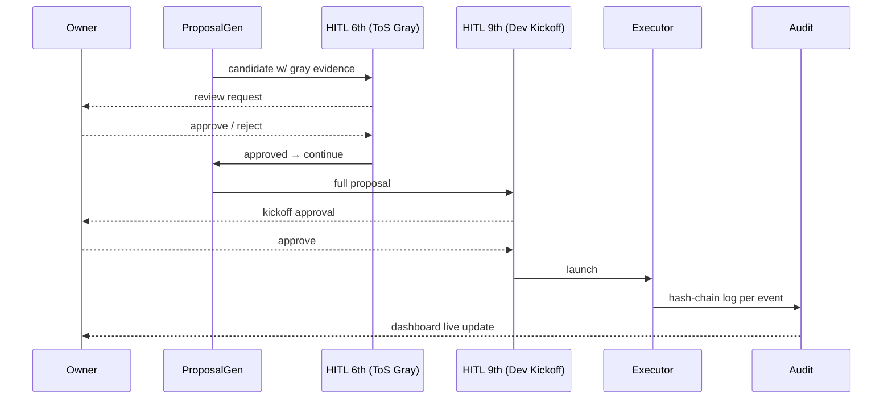

最終更新日: 2026-05-03 / 起案: Dev Department

# PRJ-019 W0 Architecture Skeleton (`architecture-w0.md` ドラフト目次)

## 0. 位置づけ

本書は Phase 1 開始（5/26）までに `projects/PRJ-019/architecture-w0.md` として正式版を確定するための **目次 + 主要セクション skeleton**。W0-Week2（5/12〜5/18）中に Dev 部門が初稿、5/19〜5/25 buffer 期間で Research / Review 部門と同期 review、5/26 Phase 1 kickoff 時点で frozen 化する。DEC-019-033 §⑤（PRJ-020 同居）は cross-reference のみ扱い、本書は PRJ-019 単体の論理アーキテクチャを記述する。

---

## 1. 目次（Frozen 候補）

| §  | タイトル                                  | 目的                                           | 主要図 |
|----|-------------------------------------------|------------------------------------------------|--------|
| §1 | Context (C4 Level 1)                      | Owner / Operator / 外部 API との境界提示       | C4-L1  |
| §2 | Containers (C4 Level 2)                   | harness / claude-bridge / openclaw-runtime / orchestrator / sandbox / audit / notify の 7 container | C4-L2  |
| §3 | Components (C4 Level 3)                   | 各 container 内部 module（HitlGate / ProposalGen / Dashboard / PolicyLoader 等） | C4-L3  |
| §4 | Component Interaction                     | 主要 module 間 call graph                      | dep graph |
| §5 | Data Flow                                 | 提案生成 → HITL → 実行 → audit の end-to-end   | sequence |
| §6 | P-D 改 Invariants                         | 不変条件 5 つ                                   | 表     |
| §7 | Deployment Topology                       | dev / staging / prod / drill 環境              | infra  |
| §8 | PRJ-020 Cross-Reference                   | DEC-019-033 §⑤ 同居要件 cross-ref のみ        | —      |
| §9 | W0 vs Phase 1 Scope                       | 何を W0 で確定し、何を W1〜W4 で実装するか     | 表     |

---

## 2. §1 Context (C4 Level 1) — 主要セクション

```
┌─────────┐         ┌──────────────┐         ┌────────────────┐
│ Owner   │─────────│  Clawbridge  │─────────│ Anthropic CLI  │
│ (人間)  │ approve │  (PRJ-019)   │ subproc │ (Claude Code)  │
└─────────┘         │              │         └────────────────┘
                    │              │         ┌────────────────┐
┌─────────┐         │              │─────────│ Open Claw OSS  │
│Operator │─────────│              │ subproc └────────────────┘
│ (人間)  │ monitor │              │         ┌────────────────┐
└─────────┘         │              │─────────│ Supabase       │
                    │              │  RLS    │ (Auth/DB/Stor) │
                    └──────────────┘         └────────────────┘
```

外部 actor: Owner（最終承認 / dashboard 閲覧）、Operator（HITL 1st〜10th gate 担当）、Anthropic Claude Code CLI（subprocess）、Open Claw OSS（subprocess）、Supabase（DB/Auth/Storage、RLS 強制）、Slack（notify）、4 系統 changelog 上流。本層では **harness そのものは黒箱**として描写し、§2 で展開する。

---

## 3. §2 Containers (C4 Level 2) — 主要セクション

7 workspace を container として配置:

| container | 責務 | 技術 |
|-----------|------|------|
| `harness` | エントリポイント、環境検証、orchestrator 起動 | Node 24 / TS |
| `claude-bridge` | Claude Code CLI subprocess wrapper、stdin/stdout JSON ipc | TS |
| `openclaw-runtime` | Open Claw OSS wrapper（dev-openclaw-runtime-wrapper.md 参照） | TS |
| `orchestrator` | 提案生成 / HITL gate / 実行調停 | TS |
| `sandbox` | 実行隔離、tmpdir / resource limit | TS + posix |
| `audit` | hash-chain audit log 永続化 | TS + Supabase |
| `notify` | Slack / dashboard event 配信 | TS + Supabase Realtime |

**container 間契約**: すべて TypeScript interface + zod schema、direct import 禁止（DI コンテナ経由）、process boundary は `harness` ↔ `claude-bridge` / `openclaw-runtime` の 2 箇所のみ。

---

## 4. §3 Components (C4 Level 3) — 主要セクション

`orchestrator` 内部展開（最重要 container）:

```
orchestrator/
├─ ProposalGen      ← DEC-019-033 §① 提案生成
├─ HitlGate         ← 10 種 gate 統合 dispatcher
│  ├─ ToolsAllowlist (1st)
│  ├─ FsAllowlist (2nd)
│  ├─ NetAllowlist (3rd)
│  ├─ SecretsScan (4th)
│  ├─ ToS Whitelist (5th)
│  ├─ ToS Gray Review (6th, dev-tos-gray-review-gate-skeleton.md 参照)
│  ├─ Changelog External API (7th)
│  ├─ Owner Input Review (8th, DEC-020-003)
│  ├─ Dev Kickoff Approval (9th, DEC-019-033)
│  └─ Permission Change Review (10th, DEC-019-033)
├─ PolicyLoader     ← hot-reload (DEC-019-033 §⑤)
├─ Dashboard        ← 6 view (DEC-019-033 §②)
└─ KnowledgeStore   ← retrieval (DEC-019-033 §④)
```

§4 Component Interaction では `ProposalGen → HitlGate(6th) → ProposalGen 続行 → HitlGate(9th) → Executor → audit` の serial flow を依存図として明記する。

---

## 5. §5 Data Flow — 主要セクション（sequence 抜粋）



---

## 6. §6 P-D 改 Invariants（5 不変条件、必ず守る）

1. **Serial Flow Guarantee**: 同一 candidate に対し HITL 6th → 9th は直列実行、並行発火禁止
2. **Audit Hash Chain**: すべての state 遷移は `audit_events` に記録、prev_hash で連鎖（PostgreSQL pgcrypto digest trigger）
3. **Fail-Closed**: PolicyLoader / FeatureFlag / CircuitBreaker いずれも未確定時は拒否側に倒す
4. **Owner-Final**: 7 category（DEC-019-033）の権限変更は必ず Owner が最終承認、自動承認禁止
5. **Single-Tenant**: 1 harness instance = 1 owner = 1 supabase project、cross-tenant データ流出を構造的に不可能に

---

## 7. §7 Deployment Topology（W0 草案）

| 環境 | 用途 | infra | secrets |
|------|------|-------|---------|
| dev | 個人開発 | localhost + Supabase free tier | .env.local |
| staging | 統合検証 | Vercel preview + Supabase project | Vercel Env Vars |
| prod | Owner 運用 | Vercel prod + Supabase pro | Vercel Env Vars + Vault |
| drill | BAN drill #1 (5/13) | localhost + isolated supabase | rotation-test.env |

---

## 8. §8 PRJ-020 Cross-Reference（DEC-019-033 §⑤）

PRJ-020 同居要件は **本 PRJ-019 のスコープ外**。同居時に競合し得る 3 リソース（file lock / port / Supabase project）を §8 で列挙のみ行い、副作用検討は PRJ-020 W0 で行う。本書では「PRJ-019 は PRJ-020 を knowledge / runtime いずれにも依存しない」を明文化。

---

## 9. §9 W0 vs Phase 1 Scope

| 項目 | W0-W2（〜5/18） | Buffer（5/19〜5/25） | Phase 1 W1〜W4（5/26〜6/20） |
|------|------|------|------|
| 7 container 確定 | done | review | frozen |
| 10 HITL gate skeleton | 5/6/9/10 草案 | review | 全 10 件実装 |
| Audit hash chain | スキーマ草案 | review | trigger + verify script |
| Dashboard 6 view | wireframe | review | 全 6 view 実装 |
| Knowledge retrieval | TOC のみ | — | W4 で実装 |

---

## 10. Open Issues

- **ARCH-01**: orchestrator 内 DI 戦略未確定（手書き factory vs `tsyringe` vs `awilix`）→ W2 中に確定
- **ARCH-02**: harness 起動時の secrets 解決順序（env > vault > prompt）が未文書化 → §7 で確定
- **ARCH-03**: drill 環境の Supabase project は本番と分離するが、BAN drill #1（5/13）当日の rotation 動線が未確定 → security-w0.md §9 と二重記述で整合確認

---

以上、`architecture-w0.md` の skeleton。本書は 5/19〜5/25 buffer で Review 部門の構造レビューを通過させ、5/26 Phase 1 kickoff 時点で正式版へ昇格する。
