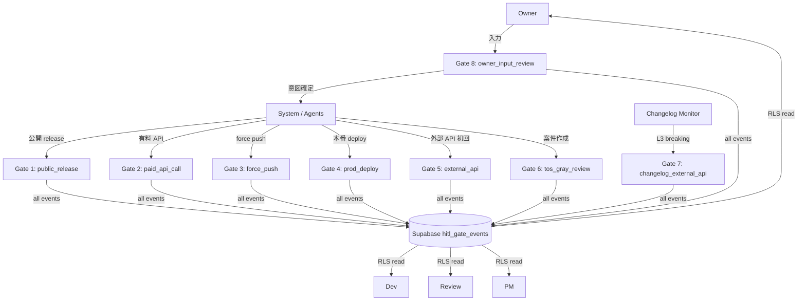
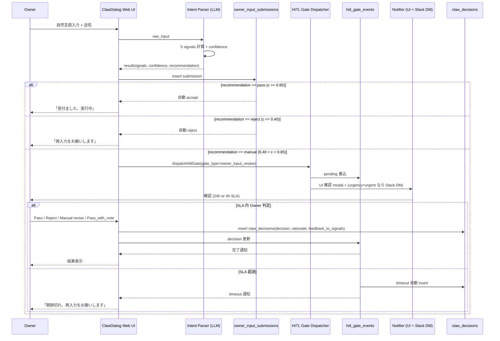
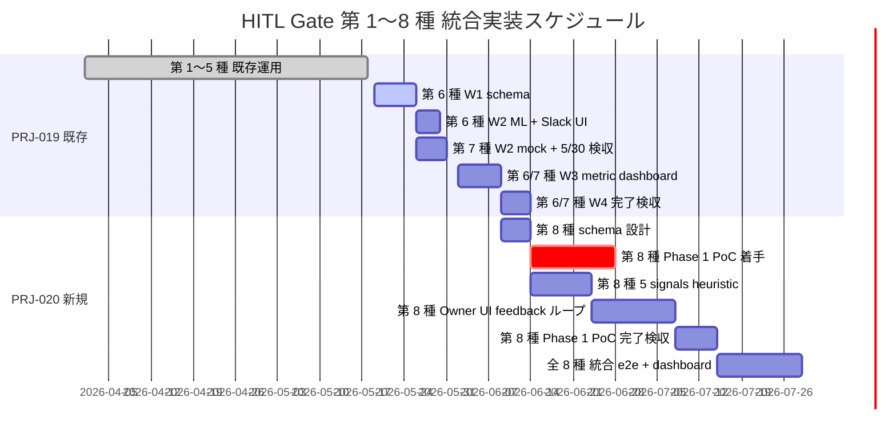

# Dev HITL Gate 第1〜8種 完全統合運用 SOP

制定日: 2026-05-03
担当: Dev 部門
対象 Phase: PRJ-019 Phase 1 (W0-Week2 〜 W4) + PRJ-020 Phase 1 PoC (W6-W10)
関連決定: DEC-019-018 / DEC-019-022 / DEC-020-001
前 SOP: `dev-hitl-gate-6th-7th-operations-sop.md` (442 行、第 6/7 種限定)

---

## §0 200 字サマリ

本 SOP は PRJ-019 Clawbridge と PRJ-020 ClawDialog を貫く HITL gate 第 1〜8 種を一本化した完全版運用手順書です。既存 5 種 (`public_release` / `paid_api_call` / `force_push` / `prod_deploy` / `external_api`) に加え、DEC-019-018 第 6 種 `tos_gray_review`、DEC-019-022 第 7 種 `changelog_external_api`、DEC-020-001 第 8 種 `owner_input_review` を統合管理します。Supabase `hitl_gate_events` enum 8 種拡張、`owner_input_submissions` / `claw_decisions` 新表追加、TypeScript generic `HitlGateRequest<T>` 共通化、SLA / RLS / 7 年監査保管 / Spend Cap 統合を物理整備します。

---

## §1 HITL Gate 全 8 種一覧

### §1.1 サマリ表

| # | gate_type | 用途 | 主トリガー | SLA (Owner) | 起票主体 | 判定主体 | 決定根拠 |
|---|---|---|---|---|---|---|---|
| 1 | `public_release` | 公開リリース許可 | semver minor/major bump + GitHub release tag | 48h (通常) / 24h (hotfix) | Dev / CI | Owner | 既存 |
| 2 | `paid_api_call` | 有料 API 呼出許可 | Spend Cap > $10/req or 月予算 80% 到達 | 12h | System (preflight) | Owner | 既存 |
| 3 | `force_push` | force push 防止 | `git push --force` 検出 (pre-push hook) | 即時 (≤ 1h) | Dev | Owner / Review | 既存 |
| 4 | `prod_deploy` | 本番デプロイ承認 | Vercel production deployment / EAS Submit | 24h | Dev / CI | Owner | 既存 |
| 5 | `external_api` | MCP / 外部 API クライアント全般初回利用 | 新規 API endpoint 検出 (registry diff) | 24h | System | Owner | 既存 |
| 6 | `tos_gray_review` | grey zone (0.5 < c < 0.85) 案件 Owner 判断 | confidence 計算 grey zone 判定 | 24h | System (heuristic/ML) | Owner | DEC-019-018 |
| 7 | `changelog_external_api` | 4 系統 changelog L3 (breaking 3+ signals) → 24h pause | breaking heuristic 評価 | 24h | Monitor | Owner | DEC-019-022 |
| 8 | `owner_input_review` | ClawDialog Owner 入力の意図確認 | 5 signals (情報密度 / 矛盾 / 緊急度等) heuristic | 24h (通常) / 4h (緊急) | ClawDialog UI | Owner | DEC-020-001 |

### §1.2 8 種関係 mermaid 図



### §1.3 8 種統合の判断根拠

第 6/7 種 SOP (442 行) では Phase 1 W4 までの整備を扱っていましたが、PRJ-020 Phase 1 PoC で第 8 種 `owner_input_review` が DEC-020-001 で承認されたため、`hitl_gate_events.gate_type` enum を 7 → 8 に拡張し、共通基盤 (Supabase スキーマ / RLS / 監査保管 / metric 集計 / Slack / Web UI) を統一します。第 8 種は ClawDialog Web UI 経由の判定で、Slack 投稿は補助通知のみ (Owner 判定は UI 必須) です。

---

## §2 Supabase スキーマ完全 SQL

### §2.1 `hitl_gate_events` 表 (gate_type enum 8 種拡張)

```sql
-- migration: 2026-05-W6 hitl_gate_events 表 8 種拡張 (PRJ-020 統合)

-- 既存 7 種 CHECK 制約を 8 種に拡張 (drop + recreate)
ALTER TABLE hitl_gate_events DROP CONSTRAINT IF EXISTS hitl_gate_events_gate_type_check;

ALTER TABLE hitl_gate_events
  ADD CONSTRAINT hitl_gate_events_gate_type_check
  CHECK (gate_type IN (
    'public_release',
    'paid_api_call',
    'force_push',
    'prod_deploy',
    'external_api',
    'tos_gray_review',
    'changelog_external_api',
    'owner_input_review'
  ));

-- urgency 列追加 (第 8 種 緊急 4h SLA 用、他種は NULL OK)
ALTER TABLE hitl_gate_events
  ADD COLUMN IF NOT EXISTS urgency TEXT CHECK (urgency IN ('normal', 'urgent', 'critical'));

-- sla_deadline 列追加 (gate_type 別 SLA を一律管理)
ALTER TABLE hitl_gate_events
  ADD COLUMN IF NOT EXISTS sla_deadline TIMESTAMPTZ;

-- created_by / source_module 列追加 (起票主体トレース)
ALTER TABLE hitl_gate_events
  ADD COLUMN IF NOT EXISTS created_by TEXT NOT NULL DEFAULT 'system';
ALTER TABLE hitl_gate_events
  ADD COLUMN IF NOT EXISTS source_module TEXT;

-- 第 8 種専用 partial index
CREATE INDEX IF NOT EXISTS idx_hitl_gate_owner_input_pending
  ON hitl_gate_events (gate_type, urgency, created_at DESC)
  WHERE gate_type = 'owner_input_review' AND (decision IS NULL OR decision = 'pending');

-- SLA 期限切れ alert 用 partial index
CREATE INDEX IF NOT EXISTS idx_hitl_gate_sla_deadline
  ON hitl_gate_events (sla_deadline)
  WHERE decision IS NULL OR decision = 'pending';
```

### §2.2 `owner_input_submissions` 表 (PRJ-020 新規)

```sql
-- migration: 2026-05-W6 owner_input_submissions 表作成

CREATE TABLE owner_input_submissions (
  id UUID PRIMARY KEY DEFAULT gen_random_uuid(),
  owner_id UUID NOT NULL,
  raw_input TEXT NOT NULL,                   -- Owner 自然言語入力 raw
  parsed_intent JSONB,                       -- 解析後 intent (LLM 抽出)
  signals JSONB NOT NULL,                    -- 5 signals (§4.5.2)
  confidence NUMERIC(4,3) NOT NULL,          -- 0.000〜1.000
  recommendation TEXT NOT NULL CHECK (recommendation IN ('pass', 'reject', 'manual')),
  urgency TEXT NOT NULL DEFAULT 'normal' CHECK (urgency IN ('normal', 'urgent', 'critical')),
  hitl_gate_event_id UUID REFERENCES hitl_gate_events(id),
  feedback_round INT NOT NULL DEFAULT 0,     -- Owner UI feedback ループ回数
  created_at TIMESTAMPTZ NOT NULL DEFAULT NOW(),
  updated_at TIMESTAMPTZ NOT NULL DEFAULT NOW()
);

CREATE INDEX idx_owner_input_owner_created
  ON owner_input_submissions (owner_id, created_at DESC);
CREATE INDEX idx_owner_input_recommendation
  ON owner_input_submissions (recommendation, urgency);

-- updated_at 自動更新トリガー
CREATE OR REPLACE FUNCTION update_owner_input_updated_at()
RETURNS TRIGGER AS $$
BEGIN
  NEW.updated_at = NOW();
  RETURN NEW;
END;
$$ LANGUAGE plpgsql;

CREATE TRIGGER trg_owner_input_updated_at
  BEFORE UPDATE ON owner_input_submissions
  FOR EACH ROW EXECUTE FUNCTION update_owner_input_updated_at();
```

### §2.3 `claw_decisions` 表 (PRJ-020 新規)

```sql
-- migration: 2026-05-W6 claw_decisions 表作成 (ClawDialog 判定履歴)

CREATE TABLE claw_decisions (
  id UUID PRIMARY KEY DEFAULT gen_random_uuid(),
  submission_id UUID NOT NULL REFERENCES owner_input_submissions(id) ON DELETE CASCADE,
  decision TEXT NOT NULL CHECK (decision IN ('pass', 'reject', 'manual_revise', 'pass_with_note', 'timeout')),
  reviewer_id UUID,                          -- Owner UUID (timeout 時 NULL)
  reviewed_at TIMESTAMPTZ,
  rationale TEXT,                            -- Owner 判定理由
  revised_payload JSONB,                     -- manual_revise 時の修正後 payload
  feedback_to_signals JSONB,                 -- 5 signals 別の Owner feedback (再学習用)
  decision_latency_seconds INT,              -- 起票〜判定までの秒数
  created_at TIMESTAMPTZ NOT NULL DEFAULT NOW()
);

CREATE INDEX idx_claw_decisions_submission ON claw_decisions (submission_id, created_at DESC);
CREATE INDEX idx_claw_decisions_decision ON claw_decisions (decision, created_at DESC);
```

### §2.4 RLS 4 ロール (owner / dev / review / pm)

```sql
-- RLS 共通 4 ロール ポリシー (Phase 2 整備、第 8 種統合時に 4 ロールへ拡張)

-- hitl_gate_events RLS
ALTER TABLE hitl_gate_events ENABLE ROW LEVEL SECURITY;

DROP POLICY IF EXISTS hitl_gate_read ON hitl_gate_events;
CREATE POLICY hitl_gate_read_4role ON hitl_gate_events FOR SELECT
  USING (auth.role() IN ('owner', 'dev', 'review', 'pm'));

DROP POLICY IF EXISTS hitl_gate_write ON hitl_gate_events;
CREATE POLICY hitl_gate_write_4role ON hitl_gate_events FOR INSERT
  WITH CHECK (auth.role() IN ('system', 'dev', 'pm'));

CREATE POLICY hitl_gate_update_owner ON hitl_gate_events FOR UPDATE
  USING (auth.role() = 'owner' AND decision IS NULL)
  WITH CHECK (auth.role() = 'owner');

-- owner_input_submissions RLS
ALTER TABLE owner_input_submissions ENABLE ROW LEVEL SECURITY;

CREATE POLICY owner_input_read_self_or_dev ON owner_input_submissions FOR SELECT
  USING (
    auth.role() IN ('dev', 'review', 'pm')
    OR (auth.role() = 'owner' AND owner_id = auth.uid())
  );

CREATE POLICY owner_input_write_self ON owner_input_submissions FOR INSERT
  WITH CHECK (auth.role() IN ('owner', 'system') AND owner_id = auth.uid());

-- claw_decisions RLS (Owner のみ INSERT 可、全 4 ロール SELECT 可)
ALTER TABLE claw_decisions ENABLE ROW LEVEL SECURITY;

CREATE POLICY claw_decisions_read_4role ON claw_decisions FOR SELECT
  USING (auth.role() IN ('owner', 'dev', 'review', 'pm'));

CREATE POLICY claw_decisions_write_owner ON claw_decisions FOR INSERT
  WITH CHECK (auth.role() = 'owner' AND reviewer_id = auth.uid());
```

### §2.5 7 年監査保管 partition

```sql
-- 7 年保管 (SOX 相当) のための yearly partition (Phase 2 で適用)

CREATE TABLE hitl_gate_events_archive (
  LIKE hitl_gate_events INCLUDING ALL
) PARTITION BY RANGE (created_at);

CREATE TABLE hitl_gate_events_2026 PARTITION OF hitl_gate_events_archive
  FOR VALUES FROM ('2026-01-01') TO ('2027-01-01');
CREATE TABLE hitl_gate_events_2027 PARTITION OF hitl_gate_events_archive
  FOR VALUES FROM ('2027-01-01') TO ('2028-01-01');

-- 改ざん耐性: hash chain 列 (Phase 2 拡張)
ALTER TABLE hitl_gate_events
  ADD COLUMN IF NOT EXISTS prev_hash TEXT,
  ADD COLUMN IF NOT EXISTS row_hash TEXT;
```

---

## §3 TypeScript 共通インターフェース

### §3.1 generic `HitlGateRequest<T>` / `HitlGateResponse`

```typescript
// app/packages/harness/src/hitl-gate-types.ts

export type GateType =
  | 'public_release'
  | 'paid_api_call'
  | 'force_push'
  | 'prod_deploy'
  | 'external_api'
  | 'tos_gray_review'
  | 'changelog_external_api'
  | 'owner_input_review';

export type Urgency = 'normal' | 'urgent' | 'critical';

export type Decision =
  | 'pass'
  | 'reject'
  | 'pass_with_note'
  | 'manual_revise'
  | 'timeout'
  | 'pending';

export interface HitlGateRequest<T> {
  gate_type: GateType;
  payload: T;
  urgency: Urgency;
  source_module: string;     // e.g. 'clawbridge.tos-allowlist', 'clawdialog.intent-parser'
  created_by: string;        // 'system' | dev_user_id | 'monitor'
  sla_deadline?: string;     // ISO 8601 (omit → gate_type 既定値)
  dedup_key?: string;        // 同一 key の 30d 内重複は dedup
}

export interface HitlGateResponse {
  event_id: string;
  decision: Decision;
  reviewer_id?: string;
  reviewed_at?: string;
  rationale?: string;
  expires_at?: string;
}
```

### §3.2 各 gate_type ごとの payload 型

```typescript
// app/packages/harness/src/hitl-gate-payloads.ts

// 第 1 種
export interface PublicReleasePayload {
  release_tag: string;        // e.g. v1.43.0
  changelog_url: string;
  bump_kind: 'major' | 'minor' | 'patch';
  has_breaking: boolean;
}

// 第 2 種
export interface PaidApiCallPayload {
  provider: 'openai' | 'anthropic' | 'replicate' | string;
  estimated_cost_usd: number;
  monthly_budget_used_pct: number;
  endpoint: string;
}

// 第 3 種
export interface ForcePushPayload {
  branch: string;
  remote: string;
  pusher: string;
  reason: string;
}

// 第 4 種
export interface ProdDeployPayload {
  project_id: string;
  commit_sha: string;
  vercel_deploy_url?: string;
  eas_build_id?: string;
}

// 第 5 種
export interface ExternalApiPayload {
  endpoint_url: string;
  http_method: string;
  first_use: boolean;
  schema_hash: string;
}

// 第 6 種
export interface TosGrayReviewPayload {
  candidate_id: string;
  url: string;
  confidence: number;         // 0.5 < c < 0.85
  signals: Array<{ type: string; value: string; weight: number }>;
  recommendation: 'pass' | 'reject' | 'manual';
}

// 第 7 種
export interface ChangelogExternalApiPayload {
  source: 'anthropic_cli' | 'openai_codex_cli' | 'openclaw_upstream' | 'enderfga_plugin';
  old_version: string;
  new_version: string;
  signals_hit: string[];      // 5 heuristic から 3+ 検出
  diff_url: string;
}

// 第 8 種 (PRJ-020)
export interface OwnerInputReviewPayload {
  submission_id: string;
  raw_input: string;
  parsed_intent: Record<string, unknown>;
  signals: {
    info_density: number;        // 0.0〜1.0
    contradiction_score: number; // 0.0〜1.0 (高いほど矛盾あり)
    urgency_score: number;       // 0.0〜1.0
    domain_specificity: number;  // 0.0〜1.0
    actionability: number;       // 0.0〜1.0
  };
  confidence: number;
  recommendation: 'pass' | 'reject' | 'manual';
  feedback_round: number;
}
```

### §3.3 共通 dispatcher 関数

```typescript
// app/packages/harness/src/hitl-gate-dispatcher.ts

import type {
  HitlGateRequest,
  HitlGateResponse,
  GateType,
} from './hitl-gate-types';

const SLA_DEFAULTS_HOURS: Record<GateType, { normal: number; urgent: number }> = {
  public_release:           { normal: 48, urgent: 24 },
  paid_api_call:            { normal: 12, urgent: 4  },
  force_push:               { normal: 1,  urgent: 1  },
  prod_deploy:              { normal: 24, urgent: 8  },
  external_api:             { normal: 24, urgent: 8  },
  tos_gray_review:          { normal: 24, urgent: 8  },
  changelog_external_api:   { normal: 24, urgent: 4  },
  owner_input_review:       { normal: 24, urgent: 4  },
};

export async function dispatchHitlGate<T>(
  req: HitlGateRequest<T>,
): Promise<HitlGateResponse> {
  // 1. SLA deadline 計算 (req.sla_deadline 未指定なら gate_type/urgency から既定)
  const slaHours = SLA_DEFAULTS_HOURS[req.gate_type][req.urgency === 'normal' ? 'normal' : 'urgent'];
  const deadline = req.sla_deadline ?? new Date(Date.now() + slaHours * 3600 * 1000).toISOString();

  // 2. dedup check (dedup_key + 30d 内)
  if (req.dedup_key) {
    const dup = await findDuplicateRequest(req.gate_type, req.dedup_key, 30);
    if (dup) return dup;
  }

  // 3. audit log write (pending)
  const event = await writeAuditEvent({
    gate_type: req.gate_type,
    request_payload: req.payload,
    urgency: req.urgency,
    sla_deadline: deadline,
    created_by: req.created_by,
    source_module: req.source_module,
    decision: 'pending',
  });

  // 4. 通知配線 (gate_type ごとに分岐)
  await notifyByGateType(req.gate_type, event.id, req);

  // 5. Owner 判断待機
  return await awaitOwnerDecision(event.id, deadline);
}

declare function findDuplicateRequest(
  gateType: GateType, dedupKey: string, days: number,
): Promise<HitlGateResponse | null>;
declare function writeAuditEvent(input: Record<string, unknown>): Promise<{ id: string }>;
declare function notifyByGateType<T>(
  gateType: GateType, eventId: string, req: HitlGateRequest<T>,
): Promise<void>;
declare function awaitOwnerDecision(
  eventId: string, deadline: string,
): Promise<HitlGateResponse>;
```

### §3.4 第 8 種専用 ClawDialog 連動関数

```typescript
// app/packages/clawdialog/src/owner-input-gate.ts

import type { OwnerInputReviewPayload } from '@harness/hitl-gate-payloads';
import { dispatchHitlGate } from '@harness/hitl-gate-dispatcher';

export interface ClawDialogIntentResult {
  submission_id: string;
  parsed_intent: Record<string, unknown>;
  signals: OwnerInputReviewPayload['signals'];
  confidence: number;
}

const PASS_THRESHOLD = 0.85;
const REJECT_THRESHOLD = 0.40;

export async function gateOwnerInput(
  rawInput: string,
  ownerId: string,
  feedbackRound = 0,
): Promise<{ accepted: boolean; submissionId: string; rationale?: string }> {
  // 1. LLM intent 抽出 + 5 signals 計算
  const result = await parseIntentAndSignals(rawInput);

  // 2. recommendation 自動分類
  let recommendation: 'pass' | 'reject' | 'manual';
  if (result.confidence >= PASS_THRESHOLD) recommendation = 'pass';
  else if (result.confidence <= REJECT_THRESHOLD) recommendation = 'reject';
  else recommendation = 'manual';

  // 3. urgency 推定 (signals.urgency_score >= 0.7 なら 'urgent')
  const urgency = result.signals.urgency_score >= 0.7 ? 'urgent' : 'normal';

  // 4. owner_input_submissions 表へ insert
  const submission = await insertSubmission({
    owner_id: ownerId,
    raw_input: rawInput,
    parsed_intent: result.parsed_intent,
    signals: result.signals,
    confidence: result.confidence,
    recommendation,
    urgency,
    feedback_round: feedbackRound,
  });

  // 5. recommendation 別動作
  if (recommendation === 'pass') {
    return { accepted: true, submissionId: submission.id };
  }
  if (recommendation === 'reject') {
    return {
      accepted: false,
      submissionId: submission.id,
      rationale: 'auto_reject_low_confidence',
    };
  }

  // manual: HITL gate 起票
  const response = await dispatchHitlGate<OwnerInputReviewPayload>({
    gate_type: 'owner_input_review',
    payload: {
      submission_id: submission.id,
      raw_input: rawInput,
      parsed_intent: result.parsed_intent,
      signals: result.signals,
      confidence: result.confidence,
      recommendation: 'manual',
      feedback_round: feedbackRound,
    },
    urgency,
    source_module: 'clawdialog.intent-parser',
    created_by: 'system',
    dedup_key: `owner-input-${ownerId}-${hashInput(rawInput)}`,
  });

  return {
    accepted: response.decision === 'pass' || response.decision === 'pass_with_note',
    submissionId: submission.id,
    rationale: response.rationale,
  };
}

declare function parseIntentAndSignals(rawInput: string): Promise<ClawDialogIntentResult>;
declare function insertSubmission(input: Record<string, unknown>): Promise<{ id: string }>;
declare function hashInput(s: string): string;
```

---

## §4 各種類の運用フロー詳細

### §4.1 第 1〜4 種 (既存) 簡潔まとめ

| # | gate_type | 起票時点 | Owner 判断 UI | 失敗時挙動 | 監査記録 |
|---|---|---|---|---|---|
| 1 | `public_release` | GitHub Release tag push 検出 | Slack `#releases` interactive | release pause + Owner 通知再送 | `hitl_gate_events` + GitHub release link |
| 2 | `paid_api_call` | preflight (estimated_cost > $10 or budget 80%) | Slack DM + Web UI 確認 | API call abort + retry pending | `hitl_gate_events` + cost/provider 記録 |
| 3 | `force_push` | pre-push hook 検出 | Slack `#alerts` 即時 + Email | push abort、`git push` exit 1 | `hitl_gate_events` + branch/remote 記録 |
| 4 | `prod_deploy` | Vercel / EAS Submit 検出 | Slack `#deploys` interactive | deploy pending、自動 rollback | `hitl_gate_events` + commit_sha 記録 |

### §4.2 第 5 種 `external_api` フロー

```typescript
// app/packages/harness/src/external-api-gate.ts

export async function preflightExternalApi(
  endpointUrl: string,
  method: string,
): Promise<{ allowed: boolean; rationale: string }> {
  // 1. registry にこの endpoint が登録済みか
  const known = await isRegisteredEndpoint(endpointUrl, method);
  if (known) return { allowed: true, rationale: 'registered' };

  // 2. schema hash 計算
  const schemaHash = await computeSchemaHash(endpointUrl);

  // 3. HITL gate 第 5 種起票
  const response = await dispatchHitlGate<ExternalApiPayload>({
    gate_type: 'external_api',
    payload: {
      endpoint_url: endpointUrl,
      http_method: method,
      first_use: true,
      schema_hash: schemaHash,
    },
    urgency: 'normal',
    source_module: 'harness.external-api-preflight',
    created_by: 'system',
    dedup_key: `${method}:${endpointUrl}`,
  });

  if (response.decision === 'pass' || response.decision === 'pass_with_note') {
    await registerEndpoint(endpointUrl, method, schemaHash);
    return { allowed: true, rationale: response.rationale ?? 'owner_pass' };
  }
  return { allowed: false, rationale: response.rationale ?? 'owner_reject' };
}

declare function isRegisteredEndpoint(url: string, method: string): Promise<boolean>;
declare function computeSchemaHash(url: string): Promise<string>;
declare function registerEndpoint(url: string, method: string, hash: string): Promise<void>;
import type { ExternalApiPayload } from './hitl-gate-payloads';
import { dispatchHitlGate } from './hitl-gate-dispatcher';
```

### §4.3 第 6 種 `tos_gray_review` (DEC-019-018) — 既存 §2 圧縮

#### §4.3.1 トリガー

confidence 計算結果が grey zone (0.5 < c < 0.85) に入った candidate URL を起票。confidence は 4 シグナル加重和 (license / url_pattern / keyword / structural)。Phase 1 W2 までは heuristic、W2 後半から ML 分類器 (training data 100 件) へ移行。

#### §4.3.2 SLA / dedup

- Owner 判断期限: 24h
- 24h 超過: 自動 reject (`rejection_reason=timeout`)
- 同 URL + 30d 内 dedup
- rejection_reason 6 値: `blocklist_hit` / `confidence_too_low` / `duplicate_request` / `timeout` / `owner_reject` / `audit_failure`

#### §4.3.3 Slack 4 ボタン

| ボタン | action_id | 効果 |
|---|---|---|
| Pass | `tos_pass` | decision=pass, expires_at=NOW+30d |
| Reject | `tos_reject` | decision=reject, rationale 必須 |
| Pass_with_note | `tos_pass_note` | decision=pass_with_note, rationale 必須 |
| Defer | `tos_defer` | 24h 後再通知 |

詳細は前 SOP `dev-hitl-gate-6th-7th-operations-sop.md` §2 参照。

### §4.4 第 7 種 `changelog_external_api` (DEC-019-022) — 既存 §3 圧縮

#### §4.4.1 5 breaking heuristic

| # | heuristic | 検出方法 |
|---|---|---|
| 1 | semver major version 上昇 | 旧 vs 新 major 比較 |
| 2 | "BREAKING" 単語含有 | changelog 本文 grep |
| 3 | `feat!:` / `BREAKING CHANGE:` | conventional commits 解析 |
| 4 | README ToS / license 変更 | diff 検出 |
| 5 | peer dependency major 変更 | package.json diff |

3 件以上で L3 (Slack + Email + 24h pause)、2 件で L2 (Slack のみ)、1 件で L1 (audit log のみ)。

#### §4.4.2 4 系統別代替

| 系統 | L3 発動時の代替 |
|---|---|
| Anthropic Claude Code CLI | fork mirror (latest stable) |
| OpenAI Codex CLI | Codex 停止、Claude のみ fallback |
| OpenClaw upstream | C-OC-01 fork mirror |
| Enderfga plugin | plugin 停止、core engine のみ継続 |

#### §4.4.3 解除フロー

Owner Slack 4 ボタン (継続 OK / fork mirror / Phase 後ろ倒し / 詳細を見る) → Dev config 切替 → Review smoke test 5 件 → audit log 記録。詳細は前 SOP §3 参照。

### §4.5 第 8 種 `owner_input_review` (DEC-020-001) — 新規詳細

#### §4.5.1 トリガー条件

ClawDialog Web UI で Owner が自然言語入力を送信した時点で、LLM intent parser が以下を実行:

1. raw_input → parsed_intent 抽出 (LLM)
2. 5 signals 計算 (§4.5.2)
3. confidence = signals 加重和 (重み: w1..w5)
4. recommendation 分類 (pass / reject / manual)

`recommendation === 'manual'` の場合のみ HITL gate 第 8 種を起票します。`pass` (confidence ≥ 0.85) / `reject` (confidence ≤ 0.40) は自動処理 (audit log のみ)。

#### §4.5.2 5 signals 詳細

| signal | 範囲 | 説明 | 高い場合の意味 |
|---|---|---|---|
| `info_density` | 0.0〜1.0 | 入力に含まれる固有名詞 / 数値 / 日付の密度 | 具体的な指示 (pass 寄り) |
| `contradiction_score` | 0.0〜1.0 | 過去 30d 入力との矛盾度 (embedding 比較) | 矛盾あり (manual 寄り) |
| `urgency_score` | 0.0〜1.0 | "至急" / "今すぐ" / 期限表現の検出強度 | 緊急 (urgent 4h SLA) |
| `domain_specificity` | 0.0〜1.0 | tech/PRJ ID/ファイルパス 含有度 | 専門的 (pass 寄り) |
| `actionability` | 0.0〜1.0 | 動詞 + 目的語が明確で実行可能か | 実行可能 (pass 寄り) |

confidence 計算式:

```
confidence = 0.25 * info_density
           + 0.25 * (1 - contradiction_score)
           + 0.10 * urgency_score
           + 0.20 * domain_specificity
           + 0.20 * actionability
```

#### §4.5.3 pass / reject / manual 判定閾値

| 区分 | confidence 範囲 | 動作 |
|---|---|---|
| pass | ≥ 0.85 | 自動 accept、`owner_input_submissions` に記録のみ |
| manual | 0.40 < c < 0.85 | HITL gate 第 8 種起票 (24h or 4h SLA) |
| reject | ≤ 0.40 | 自動 reject、Owner UI に「再入力をお願いします」表示 |

#### §4.5.4 SLA (通常 24h / 緊急 4h)

| 区分 | 判定 | SLA | 24h/4h 超過時 |
|---|---|---|---|
| 通常 | `urgency_score < 0.7` | 24h | 自動 reject (`timeout`) + Owner UI 再入力促進 |
| 緊急 | `urgency_score >= 0.7` | 4h | 自動 reject + Owner Slack DM 緊急通知 |
| 超緊急 | Owner 明示の `[critical]` prefix | 1h | 即時 Owner Slack DM + Email + Web UI 強制 modal |

#### §4.5.5 Owner UI feedback ループ

ClawDialog Web UI の判定画面では以下 5 アクション:

| アクション | claw_decisions.decision | 副作用 |
|---|---|---|
| Pass (このまま実行) | `pass` | submission 即時実行、feedback_to_signals 任意記録 |
| Reject (取り消し) | `reject` | 実行せず、Owner に「破棄しました」表示 |
| Manual revise (修正して再実行) | `manual_revise` | revised_payload で再実行、feedback_round++ |
| Pass with note (注釈付き実行) | `pass_with_note` | rationale 必須、submission 実行 |
| Timeout (放置) | `timeout` | SLA 超過後 cron が自動付与 |

feedback_to_signals は再学習用 ground truth として使用 (Phase 2 で ML 分類器再訓練)。

#### §4.5.6 sequenceDiagram (第 8 種挙動)



---

## §5 監査ログ要件 (全 8 種共通)

### §5.1 7 年保管

- Phase 1 (W4 完了時点) は `hitl_gate_events` 単一表に 90d 保管
- Phase 2 (W12 以降) で yearly partition (`hitl_gate_events_2026` 〜 `hitl_gate_events_2032`) に移行
- 7 年保管根拠: SOX 相当の意思決定 audit (公開リリース / 本番デプロイ / 有料 API / Owner 入力すべて)
- archive partition は `pg_dump` で月次 S3 export (Vercel Blob 経由)

### §5.2 改ざん耐性 (hash chain)

```sql
-- Phase 2 拡張: hash chain で改ざん検出

-- prev_hash + row_hash 自動計算 trigger
CREATE OR REPLACE FUNCTION compute_hitl_event_hash()
RETURNS TRIGGER AS $$
DECLARE
  prev_h TEXT;
  payload TEXT;
BEGIN
  SELECT row_hash INTO prev_h
  FROM hitl_gate_events
  WHERE created_at < NEW.created_at
  ORDER BY created_at DESC
  LIMIT 1;

  NEW.prev_hash := COALESCE(prev_h, 'GENESIS');
  payload := NEW.id::text || NEW.gate_type || NEW.created_at::text
             || COALESCE(NEW.decision, '') || NEW.prev_hash;
  NEW.row_hash := encode(digest(payload, 'sha256'), 'hex');

  RETURN NEW;
END;
$$ LANGUAGE plpgsql;

CREATE TRIGGER trg_hitl_event_hash
  BEFORE INSERT ON hitl_gate_events
  FOR EACH ROW EXECUTE FUNCTION compute_hitl_event_hash();
```

### §5.3 RLS 4 ロール

| role | hitl_gate_events | owner_input_submissions | claw_decisions |
|---|---|---|---|
| owner | SELECT (自分の決定 + 全 audit) / UPDATE pending → 判定 | SELECT (own) / INSERT (own) | SELECT all / INSERT (reviewer_id=self) |
| dev | SELECT all / INSERT | SELECT all | SELECT all |
| review | SELECT all | SELECT all | SELECT all |
| pm | SELECT all / INSERT (gate 起票) | SELECT all | SELECT all |
| system (service role) | SELECT all / INSERT / UPDATE | SELECT all / INSERT | INSERT (timeout のみ) |

### §5.4 監査閲覧 SQL 例

```sql
-- 過去 30d の 8 種別 timeout 率
SELECT
  gate_type,
  COUNT(*) FILTER (WHERE decision = 'reject' AND rationale ILIKE '%timeout%') AS timeouts,
  COUNT(*) AS total,
  ROUND(
    100.0 * COUNT(*) FILTER (WHERE decision = 'reject' AND rationale ILIKE '%timeout%')
    / NULLIF(COUNT(*), 0), 2
  ) AS timeout_pct
FROM hitl_gate_events
WHERE created_at > NOW() - INTERVAL '30 days'
GROUP BY gate_type
ORDER BY timeout_pct DESC;

-- 第 8 種 manual 判定の Owner P50/P95 latency
SELECT
  PERCENTILE_CONT(0.50) WITHIN GROUP (ORDER BY decision_latency_seconds) AS p50,
  PERCENTILE_CONT(0.95) WITHIN GROUP (ORDER BY decision_latency_seconds) AS p95,
  COUNT(*) AS n
FROM claw_decisions
WHERE decision IN ('pass', 'reject', 'manual_revise', 'pass_with_note')
  AND created_at > NOW() - INTERVAL '7 days';

-- hash chain 整合性検証 (改ざん検出)
WITH chain AS (
  SELECT id, prev_hash, row_hash,
         LAG(row_hash) OVER (ORDER BY created_at) AS expected_prev
  FROM hitl_gate_events
)
SELECT id, prev_hash, expected_prev
FROM chain
WHERE prev_hash != COALESCE(expected_prev, 'GENESIS');
```

---

## §6 統合実装スケジュール

### §6.1 全体タイムライン



### §6.2 マイルストーン表

| 期間 | gate | タスク | DoD |
|---|---|---|---|
| W1 (5/19〜5/25) | 第 6 種 | Supabase スキーマ整備 + audit log write | `hitl_gate_events` 表作成、dedup 10 ケース |
| W2 前半 (5/26〜5/29) | 第 6 種 | ML 分類器 + Slack UI | 100 件 grey 候補 ラベル、4 ボタン動作 |
| W2 中盤 (5/26〜5/30) | 第 7 種 | mock L3 trigger + 5/30 検収 | 4 系統 mock 全 Pass、Owner UI 4 ボタン |
| W3 (6/2〜6/8) | 6/7 種 | 統合テスト + metric dashboard | 5 metrics weekly 集計、警告閾値 alert |
| W4 (6/9〜6/13) | 6/7 種 | Phase 1 完了検収 | hitl-gate.test.ts 130+ tests 全緑 |
| W6 (6/14 着手) | **第 8 種** | **Phase 1 PoC 着手** | enum 8 種拡張、`owner_input_submissions` / `claw_decisions` 表作成、5 signals heuristic 実装、Owner UI feedback ループ動作 |
| W8 (6/24〜) | 第 8 種 | Owner UI feedback 連動 | UI から 5 アクション → claw_decisions insert 動作 |
| W10 (7/8〜7/14) | 第 8 種 | Phase 1 PoC 完了検収 | 30 件 mock owner input で manual 判定動作、SLA timeout 動作確認 |
| W12〜 (7/15〜) | 全 8 種 | 統合 e2e + dashboard 統一 | 8 種統合 dashboard、Spend Cap 連動、hash chain Phase 2 拡張 |

---

## §7 テスト計画

### §7.1 単体テスト (vitest)

```typescript
// app/packages/harness/test/hitl-gate-dispatcher.test.ts

import { describe, it, expect, vi } from 'vitest';
import { dispatchHitlGate } from '../src/hitl-gate-dispatcher';

describe('dispatchHitlGate (8 種共通)', () => {
  it('第 1 種 public_release: SLA 既定 48h (normal)', async () => {
    const res = await dispatchHitlGate({
      gate_type: 'public_release',
      payload: { release_tag: 'v1.43.0', changelog_url: 'x', bump_kind: 'minor', has_breaking: false },
      urgency: 'normal',
      source_module: 'test',
      created_by: 'test-user',
    });
    expect(res.event_id).toBeDefined();
  });

  it('第 8 種 owner_input_review: urgent で SLA 4h', async () => {
    const res = await dispatchHitlGate({
      gate_type: 'owner_input_review',
      payload: {
        submission_id: 'sub-1', raw_input: '至急、PRJ-020 PoC 開始',
        parsed_intent: { action: 'start_poc' },
        signals: { info_density: 0.8, contradiction_score: 0.1, urgency_score: 0.9, domain_specificity: 0.7, actionability: 0.85 },
        confidence: 0.78, recommendation: 'manual', feedback_round: 0,
      },
      urgency: 'urgent',
      source_module: 'clawdialog.test',
      created_by: 'system',
    });
    expect(res.event_id).toBeDefined();
  });

  it('dedup_key 同一は前回判定継承', async () => {
    const dedupKey = 'test-dedup-001';
    const r1 = await dispatchHitlGate({ /* ... */ } as any);
    const r2 = await dispatchHitlGate({ /* ... */ } as any);
    expect(r2.event_id).toBe(r1.event_id);
  });
});
```

### §7.2 第 8 種 5 signals heuristic 単体テスト

```typescript
// app/packages/clawdialog/test/intent-signals.test.ts

import { describe, it, expect } from 'vitest';
import { computeSignals } from '../src/intent-signals';

describe('owner_input_review 5 signals', () => {
  it.each([
    ['具体的な指示',     'PRJ-019 W4 検収を 6/13 までに完遂', { info_density: 0.85, actionability: 0.9 }],
    ['緊急表現',         '至急、本番停止お願いします',           { urgency_score: 0.95 }],
    ['矛盾入力',         'PRJ-012 を停止して、同時に Phase 2 開始', { contradiction_score: 0.7 }],
    ['抽象的入力',       'なんとなくいい感じに',                  { info_density: 0.1, actionability: 0.05 }],
    ['ドメイン特化',     'Supabase RLS の policy を 4 ロール化',    { domain_specificity: 0.9 }],
  ])('%s: %s → 期待 signals', async (_name, input, expected) => {
    const signals = await computeSignals(input);
    for (const [k, v] of Object.entries(expected)) {
      expect(signals[k as keyof typeof signals]).toBeGreaterThan((v as number) - 0.15);
    }
  });

  it('confidence 加重和が 0.0〜1.0 範囲内', async () => {
    const signals = await computeSignals('PRJ-019 W2 で第 6 種 schema 整備');
    const confidence = 0.25 * signals.info_density
      + 0.25 * (1 - signals.contradiction_score)
      + 0.10 * signals.urgency_score
      + 0.20 * signals.domain_specificity
      + 0.20 * signals.actionability;
    expect(confidence).toBeGreaterThanOrEqual(0);
    expect(confidence).toBeLessThanOrEqual(1);
  });
});
```

### §7.3 e2e テスト (Playwright)

```typescript
// app/e2e/hitl-gate-owner-input.spec.ts

import { test, expect } from '@playwright/test';

test.describe('第 8 種 owner_input_review e2e (ClawDialog UI)', () => {
  test('manual 判定 → Owner Pass → 受付完了', async ({ page }) => {
    await page.goto('/clawdialog');
    await page.fill('[data-testid=owner-input]', 'PRJ-020 で第 8 種 PoC を着手して、6/14 開始');
    await page.click('[data-testid=submit-input]');

    // intent parser が manual と判定 → 確認 modal 表示
    await expect(page.locator('[data-testid=hitl-confirm-modal]')).toBeVisible();
    await page.click('[data-testid=hitl-pass]');

    // 受付完了表示
    await expect(page.locator('[data-testid=submission-status]')).toContainText('受付');
  });

  test('reject 自動 → 再入力促進', async ({ page }) => {
    await page.goto('/clawdialog');
    await page.fill('[data-testid=owner-input]', 'aaa'); // 低 confidence
    await page.click('[data-testid=submit-input]');
    await expect(page.locator('[data-testid=submission-status]')).toContainText('再入力');
  });

  test('urgent 入力 → 4h SLA 表示', async ({ page }) => {
    await page.goto('/clawdialog');
    await page.fill('[data-testid=owner-input]', '至急、本番 deploy を停止してください');
    await page.click('[data-testid=submit-input]');
    await expect(page.locator('[data-testid=sla-deadline]')).toContainText('4h');
  });
});
```

### §7.4 第 7 種 changelog 監視 e2e

```typescript
// app/e2e/hitl-gate-changelog.spec.ts

import { test, expect } from '@playwright/test';

test('第 7 種 mock L3 trigger → Slack + Email + 24h pause', async ({ request }) => {
  const res = await request.post('/api/test/changelog-mock', {
    data: {
      source: 'anthropic_cli',
      old_version: '1.0.0',
      new_version: '2.0.0',
      changelog_body: 'BREAKING CHANGE: removed legacy API',
    },
  });
  expect(res.status()).toBe(200);
  const body = await res.json();
  expect(body.signals_hit).toEqual(expect.arrayContaining(['semver_major', 'breaking_keyword']));
  expect(body.gate_type).toBe('changelog_external_api');
  expect(body.paused).toBe(true);
});
```

### §7.5 テスト件数目標

| 層 | 種類 | 件数目標 (W10 完了時) |
|---|---|---|
| 単体 (vitest) | 1〜5 種 共通 dispatcher | 25 |
| 単体 (vitest) | 6 種 grey heuristic | 30 |
| 単体 (vitest) | 7 種 5 breaking heuristic | 25 |
| 単体 (vitest) | 8 種 5 signals + 閾値分岐 | 35 |
| e2e (Playwright) | 各種類 happy + sad path | 8 種 × 3 = 24 |
| 監査 SQL 検証 | hash chain / RLS / dedup | 15 |
| **合計** | | **154** |

---

## §8 Spend Cap 影響まとめ

### §8.1 各種類 Spend Cap 寄与

| 種類 | 直接コスト | 間接コスト | Spend Cap 反映 |
|---|---|---|---|
| 1 `public_release` | $0 | $0 | なし |
| 2 `paid_api_call` | API 課金 | $0 | **直接反映** (estimated_cost_usd) |
| 3 `force_push` | $0 | $0 | なし |
| 4 `prod_deploy` | Vercel / EAS 課金 | $0 | 月次 Vercel 請求 |
| 5 `external_api` | 初回 schema fetch | $0 | 微小 |
| 6 `tos_gray_review` | LLM ML 分類器 | $0 | $0.001/req × 月 1000 req = $1/月 |
| 7 `changelog_external_api` | 監視 LLM | $0 | $0.005/diff × 月 200 diff = $1/月 |
| 8 `owner_input_review` | LLM intent parser | $0 | **$0.01〜$0.05/input** × 月 500 input = **$5〜$25/月** |

### §8.2 第 8 種 Spend Cap 詳細試算

```typescript
// 試算根拠

const monthlyOwnerInputs = 500;          // PRJ-020 Phase 1 PoC 想定
const llmCostPerInput = 0.025;           // GPT-4o-mini 平均 (~5k tokens)
const monthlyCost = monthlyOwnerInputs * llmCostPerInput;
// = $12.5/月 (基準ケース)

const peakCost = monthlyOwnerInputs * 0.05;  // GPT-4 promote 時
// = $25/月

// Spend Cap 月次予算 (PRJ-020) = $50/月 で現状余裕あり
// W12 Phase 2 移行時に再見積 (本格運用 1500 input/月想定 → $37.5〜$75/月)
```

### §8.3 全 8 種合計月次コスト想定

| Phase | 合計月次コスト | Spend Cap 残予算 (月 $200 想定) |
|---|---|---|
| Phase 1 PoC (W6〜W10) | $14〜$27 | $173〜$186 |
| Phase 1 完了 (W12) | $40〜$80 | $120〜$160 |
| Phase 2 本格運用 | $80〜$150 | $50〜$120 |

第 2 種 `paid_api_call` の Spend Cap (月 $100) と第 8 種 `owner_input_review` の LLM 課金が Phase 2 で競合する可能性があるため、W12 で Spend Cap policy 再見直し (DEC-019-XXX or DEC-020-XXX で再承認予定)。

---

## §9 関連ファイル

### §9.1 PRJ-019 関連

- `decisions.md` (DEC-019-018 第 6 種承認 / DEC-019-022 第 7 種承認)
- `dev-hitl-gate-6th-7th-operations-sop.md` (前 SOP、本 SOP §4.3 / §4.4 で圧縮参照)
- `dev-hitl-gate-w0-w2-skeleton.md` (W0-Week2 雛形成果)
- `pm-cost-and-controls-plan-v4.md` (HITL gate 全体コスト計画)
- `research-changelog-monitoring-runbook.md` (4 系統 changelog 監視 → 第 7 種連動)
- `app/packages/harness/src/hitl-gate.ts` (実装ファイル、第 1〜7 種)
- `app/packages/harness/test/hitl-gate.test.ts` (テスト、95 tests 全緑)

### §9.2 PRJ-020 関連 (新規)

- `decisions.md` (DEC-020-001 第 8 種承認)
- `app/packages/clawdialog/src/owner-input-gate.ts` (本 SOP §3.4 で定義)
- `app/packages/clawdialog/src/intent-signals.ts` (5 signals heuristic)
- `app/packages/clawdialog/test/intent-signals.test.ts` (本 SOP §7.2)
- `app/e2e/hitl-gate-owner-input.spec.ts` (本 SOP §7.3)
- `db/migrations/2026-05-W6-hitl-gate-8type-extension.sql` (本 SOP §2.1〜§2.5)

### §9.3 共通 (PRJ-019 / PRJ-020 共有)

- `app/packages/harness/src/hitl-gate-types.ts` (本 SOP §3.1)
- `app/packages/harness/src/hitl-gate-payloads.ts` (本 SOP §3.2)
- `app/packages/harness/src/hitl-gate-dispatcher.ts` (本 SOP §3.3)
- `app/packages/harness/test/hitl-gate-dispatcher.test.ts` (本 SOP §7.1)
- `organization/rules/quality-gates.md` (Phase 移行品質ゲート)
- `organization/rules/testing-policy.md` (テスト方針)
- `organization/rules/tech-stack.md` (Supabase / Next.js / TypeScript 標準)

---

制定: Dev 部門 / 経由: CEO / 宛: PM 部門 + Review 部門 + Owner / 統合対象: PRJ-019 Phase 1 W4 + PRJ-020 Phase 1 PoC W10 / 完了予定: 2026-07-14 (W10) / 次回更新: W12 Spend Cap 再見直し時
