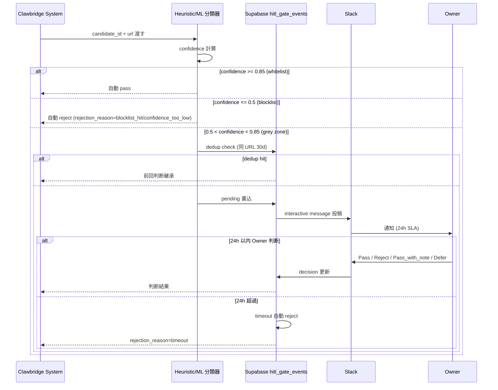
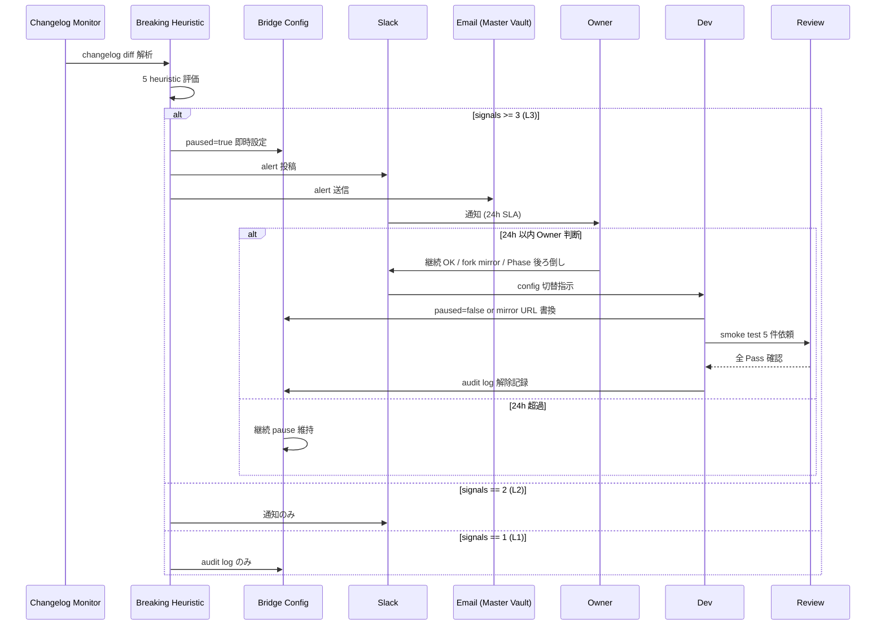

# Dev HITL Gate 第6種 `tos_gray_review` + 第7種 changelog `external_api` 実装+運用 SOP

制定日: 2026-05-03
担当: Dev 部門
対象 Phase: PRJ-019 Phase 1 (W0-Week2 〜 W4)
関連決定: DEC-019-018 (第6種承認) / DEC-019-022 (第7種承認)

---

## §0 200字サマリ

本 SOP は PRJ-019 Clawbridge において新規承認された HITL gate 第6種 `tos_gray_review` (DEC-019-018) と第7種 changelog `external_api` (DEC-019-022) の実装インターフェース、Owner 判断 SLA、audit log スキーマ、metric 集計、Slack interactive message 設計、5/26 本番運用開始および 5/30 検収項目を物理整備します。Dev 部門 W0-Week2 雛形 (11 ケーステスト) を出発点に、W4 完了検収まで 6 期間で段階展開します。

---

## §1 背景

### §1.1 DEC-019-018 経緯 (第6種 `tos_gray_review`)

ToS allowlist DoD 統合検討の中で、URL/案件 candidate に対する許諾 confidence が 0.5〜0.85 の grey zone (license 不明確 / robots.txt 例外 / AI 生成物 / competitive intelligence など) を Owner 判断に委ねる必要が判明し、第6種 HITL gate として承認されました。whitelist (≥0.85) は preview deploy 自動公開、blocklist (≤0.5) は即時 reject、grey zone (0.5 < c < 0.85) のみ HITL gate を経由します。

### §1.2 DEC-019-022 経緯 (第7種 changelog `external_api`)

`research-changelog-monitoring-runbook.md` で整理された 4 系統 changelog 監視 (Anthropic Claude Code CLI / OpenAI Codex CLI / OpenClaw upstream / Enderfga plugin) において、L3 通知 (breaking heuristic 3+ signals) 検知時に即時 Slack + メール通知し 24h 自動 pause する gate を、既存 `external_api` (MCP / API クライアント全般) と区別して新規承認しました。本 SOP では DEC-019-022 を「第7種 changelog `external_api`」と呼称します。

### §1.3 7 種 HITL gate 全体像

| 番号 | gate_type | 役割 | 承認元 |
|---|---|---|---|
| 1 | `public_release` | 公開リリース許可 | 既存 |
| 2 | `paid_api_call` | 有料 API 呼出許可 | 既存 |
| 3 | `force_push` | force push 防止 | 既存 |
| 4 | `prod_deploy` | 本番デプロイ承認 | 既存 |
| 5 | `external_api` | MCP / API クライアント全般 | 既存 |
| 6 | `tos_gray_review` | grey zone 案件 Owner 判断 | DEC-019-018 |
| 7 | `changelog_external_api` | changelog L3 通知 → 24h pause | DEC-019-022 |

---

## §2 第6種 `tos_gray_review` 詳細

### §2.1 トリガー条件

ToS allowlist DoD 統合における confidence 計算結果が grey zone (0.5 < c < 0.85) に入った場合に発動します。confidence の閾値判定は次の 3 区分です。

| 区分 | confidence 範囲 | 動作 |
|---|---|---|
| whitelist | ≥ 0.85 | preview deploy 自動公開 (HITL 不要) |
| grey zone | 0.5 < c < 0.85 | `tos_gray_review` HITL gate 発動 |
| blocklist | ≤ 0.5 | 即時 reject (HITL 不要) |

評価対象は次の 3 系統合計 23 件のドメイン/ポリシーです。

- OpenAI 個別禁止 13 NG ドメイン (生成 AI 内部活動制約)
- Anthropic Acceptable Use Policy NG-1/NG-2/NG-3 (3 件)
- 自社追加 7 件 (PII / competitive intelligence / AI 生成権利関係 等)

confidence 計算は次の 4 シグナルの加重和です。Phase 1 W2 までは heuristic 版 (keyword + URL pattern + license check の AND/OR ロジック) で運用し、W2 後半に ML 分類器 (training data 100 件 grey 候補ラベル付け) へ移行します。

```
confidence = w1 * license_score
           + w2 * url_pattern_score
           + w3 * keyword_score
           + w4 * structural_score
```

### §2.2 grey zone 例 (10 件)

| # | 案件種類 | 想定 confidence | 判定理由 | Owner 判断 |
|---|---|---|---|---|
| 1 | HN trending TS で license が UNLICENSED | 0.60 | license 不明確、commercial use 不可性あり | Owner: Reject 推奨 |
| 2 | HN trending TS で stars 100 未満 | 0.70 | 著作権者明確だが影響範囲過小 | Owner: Pass + 注釈 |
| 3 | HN trending TS で robots.txt クロール禁止 | 0.55 | 公開リポでもクロール禁止意図あり | Owner: Reject 推奨 |
| 4 | 自社 PRJ で OSS dependency が GPL-3.0 | 0.70 | copyleft 影響あり | Owner: Pass + 影響範囲確認 |
| 5 | 自社 PRJ で API キー含有疑惑 | 0.40 | blocklist 寄り | (即時 reject、HITL 不要) |
| 6 | 自社 PRJ で ToS 例文 + 個人情報想定 | 0.60 | 個人情報含有可能性 | Owner: Reject 推奨 |
| 7 | 自社 PRJ で AI 生成 license 注釈なし | 0.65 | AI 生成物の権利関係 | Owner: Pass + 注釈推奨 |
| 8 | 自社 PRJ で competitive intelligence | 0.50 | NG-1 該当境界 | Owner: Reject 推奨 |
| 9 | 公式 example で provider 情報 ≠ 自社 | 0.75 | upstream 互換性 | Owner: Pass |
| 10 | Vercel template で fork 禁止表記 | 0.60 | 自動 fork 不可 | Owner: Reject |

注: # 5 は confidence 0.40 で blocklist 区分のため HITL gate を経由せず即時 reject となります (参考事例として併記)。

### §2.3 実装インターフェース (TypeScript)

```typescript
// app/packages/harness/src/hitl-gate.ts

export interface TosGrayReviewRequest {
  candidate_id: string;
  url: string;
  confidence: number; // 0.5 ≤ x < 0.85
  signals: Array<{
    type: 'license' | 'stars' | 'robots_txt' | 'tos_keyword' | 'pii' | 'ai_generated' | 'competitive';
    value: string;
    weight: number;
  }>;
  recommendation: 'pass' | 'reject' | 'manual';
}

export interface TosGrayReviewResponse {
  decision: 'pass' | 'reject' | 'pass_with_note';
  reviewer_id: string; // Owner ID
  reviewed_at: string; // ISO 8601 timestamp
  rationale: string; // Owner 判断理由 1-3 文
  expires_at?: string; // pass の場合の expire (default 30d)
}

export async function requestTosGrayReview(
  req: TosGrayReviewRequest,
): Promise<TosGrayReviewResponse> {
  // 1. confidence 範囲バリデーション
  if (req.confidence < 0.5 || req.confidence >= 0.85) {
    throw new Error(`confidence ${req.confidence} out of grey zone`);
  }

  // 2. dedup check (同 URL + 30d 以内)
  const dup = await findDuplicateRequest(req.url, 30);
  if (dup) return dup;

  // 3. audit log write (pending)
  const event = await writeAuditEvent({
    gate_type: 'tos_gray_review',
    request_payload: req,
    decision: 'pending',
  });

  // 4. Slack interactive message 投稿
  await postSlackInteractive(event.id, req);

  // 5. 24h 待機 + Owner 判断 or timeout
  return await awaitOwnerDecision(event.id, 24 * 3600);
}
```

### §2.4 Owner 判断 SLA

| 項目 | 値 |
|---|---|
| Owner 判断期限 | request 発生から 24h |
| 24h 超過時動作 | 自動 reject (DEC-019-018 デフォルト) |
| Owner unavailability 代行 | Phase 1 期間中は無代行 (24h 超過 reject) |
| 再 request 条件 | 30d 経過 or 別 candidate_id |

### §2.5 audit log + dedup

- 全 grey zone request は Supabase `hitl_gate_events` 表 (§4.1) に記録
- 同 URL + 30d 以内の重複 request は dedup し、前回判断 (decision / rationale / expires_at) を継承
- audit log 保存期間: Phase 1 = 90d / Phase 2 = 365d (DEC-019-XX で確定予定)
- dedup 判定 SQL 例:

```sql
SELECT * FROM hitl_gate_events
WHERE gate_type = 'tos_gray_review'
  AND request_payload->>'url' = $1
  AND created_at > NOW() - INTERVAL '30 days'
  AND decision IN ('pass', 'reject', 'pass_with_note')
ORDER BY created_at DESC
LIMIT 1;
```

### §2.6 rejection_reason 6 値

| reason | 説明 | 自動 vs HITL |
|---|---|---|
| `blocklist_hit` | 13 NG ドメイン or Anthropic NG-1/2/3 該当 | 自動 |
| `confidence_too_low` | confidence < 0.5 | 自動 |
| `duplicate_request` | 30d 以内の dedup | 自動 |
| `timeout` | 24h Owner 判断なし | 自動 |
| `owner_reject` | Owner が Reject 決定 | HITL |
| `audit_failure` | audit log write 失敗 | 自動 |

### §2.7 5/26 本番運用開始までの整備項目

| 項目 | 担当 | 期限 | DoD |
|---|---|---|---|
| ML 分類器 training data | Dev | W2 (5/29) | 100 件 grey 候補 ラベル付け完了 |
| Owner UI (Slack interactive) | Dev | W2 (5/26) | 4 ボタン動作 (§4.3.1) |
| audit log Supabase スキーマ | Dev | W1 (5/25) | `hitl_gate_events` 表作成 + write/read 動作 |
| dedup ロジック実装 + テスト | Dev | W1 (5/25) | 10 ケーステスト 全緑 |

### §2.8 sequenceDiagram (第6種挙動)



---

## §3 第7種 changelog `external_api` 詳細

### §3.1 トリガー条件

`research-changelog-monitoring-runbook.md` で監視する 4 系統 changelog のいずれかで L3 通知 (breaking heuristic 3+ signals 検知) が発動した場合にトリガーします。breaking heuristic は次の 5 種です (DEC-019-022)。

| # | heuristic | 検出方法 |
|---|---|---|
| 1 | semver major version 上昇 | 旧 vs 新の major 比較 |
| 2 | "BREAKING" 単語含有 | changelog 本文 grep |
| 3 | `feat!:` prefix or `BREAKING CHANGE:` footer | conventional commits 解析 |
| 4 | README ToS / license 変更 | diff 検出 |
| 5 | peer dependency major 変更 | package.json diff |

3 件以上同時検出で L3、2 件で L2 (Slack のみ通知)、1 件で L1 (audit log のみ) となります。

### §3.2 L3 通知発動時の挙動

#### §3.2.1 即時 Slack 投稿
- channel: `#clawbridge-alerts` (専用、CEO + Dev + Review + PM 必須参加)
- message format: 系統名 / 旧→新 version / 検出 heuristic 3+ / 影響範囲 / 解除候補ボタン

#### §3.2.2 即時 Email 送信
- 送信先: Master Vault 登録メール (`ai-lab@improver.jp`)
- Subject: `[Clawbridge L3] {系統名} {旧 ver}→{新 ver}`
- Body: Slack message と同内容 + 解除手順 link

#### §3.2.3 24h 自動 pause
- changelog 該当系統の使用を即時停止 (config flag を `paused: true` に切替)
- harness 側の preflight check が `paused` を検出した時点で execution abort
- 影響範囲は §3.4 系統別 4 系統で異なる

#### §3.2.4 Owner 確認 → pause 解除 / 継続 pause / Phase 後ろ倒し
- Owner Slack interactive message で 4 ボタン (§4.3.2) から選択
- 選択結果に応じて config flag 更新 + audit log 記録

### §3.3 Owner 確認 SLA

| 項目 | 値 |
|---|---|
| Owner 確認期限 | L3 発動から 24h |
| 24h 超過時動作 | 継続 pause (DEC-019-022 デフォルト) |
| 解除条件 | Owner が Slack interactive message で「継続 OK」or「fork mirror に切替」or「Phase 後ろ倒し」を選択 |
| 詳細を見る | Web UI への deep link を提供 |

### §3.4 系統別の対応 (4 系統)

| 系統 | L3 発動時の代替 | 影響範囲 |
|---|---|---|
| Anthropic Claude Code CLI | fork mirror (latest stable) に切替 | P-D 改 stack core |
| OpenAI Codex CLI | Codex CLI 使用停止、fallback で Claude のみ | PRJ-018 連動 |
| OpenClaw upstream | C-OC-01 fork mirror に切替 | driver |
| Enderfga plugin | plugin 機能停止、core engine のみで継続 | tooling |

### §3.5 解除手順

#### §3.5.1 Owner Slack interactive message 操作
- ボタン押下 (継続 OK / fork mirror 切替 / Phase 後ろ倒し / 詳細を見る) → backend webhook → audit log write

#### §3.5.2 Dev 部門が config 切替
- claude-bridge config の `paused` flag を `false` に戻す or fork mirror URL に書換
- monitoring 設定で fork mirror への切替を反映

#### §3.5.3 Review 部門が動作確認
- smoke test 5 件 (該当系統の最小機能) 全 Pass を確認
- 失敗時は再 pause + Owner 再通知

#### §3.5.4 audit log に解除理由記録
- `hitl_gate_events.rationale` に Owner 判断理由 + Dev config 切替先 + Review smoke 結果を JSON で記録

### §3.6 5/30 検収項目

| 項目 | DoD |
|---|---|
| 4 系統 mock L3 trigger 発動 | Slack + Email + pause 全完遂 |
| mock 解除フロー | Dev config 切替 → Review smoke test → audit log 記録 全完遂 |
| Owner Slack interactive UI | 4 ボタン全動作確認 (継続 OK / fork mirror / Phase 後ろ倒し / 詳細を見る) |
| 24h timeout 動作 | mock で 24h 経過後の継続 pause 自動移行確認 |

### §3.7 sequenceDiagram (第7種挙動)



---

## §4 第6種 + 第7種 共通基盤

### §4.1 audit log Supabase スキーマ

```sql
-- migration: 2026-05-W1 hitl_gate_events 表作成

CREATE TABLE hitl_gate_events (
  id UUID PRIMARY KEY DEFAULT gen_random_uuid(),
  gate_type TEXT NOT NULL CHECK (gate_type IN (
    'public_release', 'paid_api_call', 'force_push',
    'prod_deploy', 'external_api',
    'tos_gray_review', 'changelog_external_api'
  )),
  request_payload JSONB NOT NULL,
  decision TEXT, -- pass / reject / timeout / pending / pass_with_note
  reviewer_id UUID,
  reviewed_at TIMESTAMPTZ,
  rationale TEXT,
  created_at TIMESTAMPTZ NOT NULL DEFAULT NOW(),
  expires_at TIMESTAMPTZ
);

CREATE INDEX idx_hitl_gate_type_created ON hitl_gate_events (gate_type, created_at DESC);
CREATE INDEX idx_hitl_gate_pending ON hitl_gate_events (gate_type, decision)
  WHERE decision IS NULL OR decision = 'pending';

-- RLS (Phase 1 は Owner + Dev + Review のみ read 可)
ALTER TABLE hitl_gate_events ENABLE ROW LEVEL SECURITY;
CREATE POLICY hitl_gate_read ON hitl_gate_events FOR SELECT
  USING (auth.role() IN ('owner', 'dev', 'review'));
CREATE POLICY hitl_gate_write ON hitl_gate_events FOR INSERT
  WITH CHECK (auth.role() IN ('system', 'dev'));
```

### §4.2 metric 集計

| metric | 集計頻度 | 警告閾値 |
|---|---|---|
| 6 種 request 件数/日 | daily | > 50 件 (CEO 警告) |
| 6 種 timeout 率 | weekly | > 10% (Owner 確認) |
| 6 種 Owner 判断時間 P95 | weekly | > 12h (workflow 改善) |
| 7 種 L3 発動回数/月 | monthly | > 3 件 (Phase 後ろ倒し検討) |
| 7 種 解除時間 P95 | monthly | > 6h (Owner availability 改善) |

集計クエリ例 (6 種 timeout 率):

```sql
SELECT
  DATE_TRUNC('week', created_at) AS week,
  COUNT(*) FILTER (WHERE decision = 'reject' AND rationale LIKE '%timeout%')::float
    / NULLIF(COUNT(*), 0) AS timeout_rate
FROM hitl_gate_events
WHERE gate_type = 'tos_gray_review'
GROUP BY 1
ORDER BY 1 DESC;
```

### §4.3 Slack interactive message 設計

#### §4.3.1 第6種 (`tos_gray_review`) 4 ボタン

| ボタン | action_id | 効果 |
|---|---|---|
| Pass | `tos_pass` | decision=pass, expires_at=NOW+30d |
| Reject | `tos_reject` | decision=reject, rationale 必須 |
| Pass_with_note | `tos_pass_note` | decision=pass_with_note, rationale 必須 |
| Defer | `tos_defer` | 24h 後再通知 (decision pending 維持) |

#### §4.3.2 第7種 (`changelog_external_api`) 4 ボタン

| ボタン | action_id | 効果 |
|---|---|---|
| 継続 OK | `chlog_continue` | paused=false, 該当系統使用再開 |
| fork mirror 切替 | `chlog_mirror` | mirror URL 書換 + paused=false |
| Phase 後ろ倒し | `chlog_postpone` | paused 維持 + PM 部門に Phase 調整 issue 起票 |
| 詳細を見る | `chlog_detail` | Web UI deep link (audit log 詳細) |

---

## §5 実装スケジュール

| 期間 | タスク | DoD |
|---|---|---|
| W0-Week2 (5/3 完了済) | 雛形 + 11 ケーステスト | hitl-gate.test.ts 95 tests 全緑、rejection_reason 6 値拡張 |
| W1 (5/19〜5/25) | Supabase スキーマ整備 + audit log write 実装 | `hitl_gate_events` 表作成 + write/read 動作 + dedup ロジック 10 ケース |
| W2 前半 (5/26〜5/29) | tos_gray_review ML 分類器 (heuristic 版) + Owner Slack UI | 100 件 grey 候補 ラベル + Slack interactive message 動作 |
| W2 中盤 (5/26 着手 5/30 検収) | changelog external_api 実装 + 5/30 検収 | 4 系統 mock L3 trigger 全 Pass + Owner UI 4 ボタン動作 |
| W3 (6/2〜6/8) | 統合テスト + metric 集計 dashboard | 5 metrics weekly 集計動作 + 警告閾値 alert 配線 |
| W4 (6/9〜6/13) | Phase 1 完了検収 + 副作用 0 行 G-12 | hitl-gate.test.ts 130+ tests 全緑、副作用 0 行 |

---

## §6 関連

- `decisions.md` (DEC-019-018 第6種承認 / DEC-019-022 第7種承認)
- `pm-cost-and-controls-plan-v4.md` (HITL gate 全体コスト計画)
- `research-changelog-monitoring-runbook.md` (4 系統 changelog 監視 → 第7種連動)
- `dev-hitl-gate-w0-w2-skeleton.md` (W0-Week2 雛形成果、参照のみ)
- `app/packages/harness/src/hitl-gate.ts` (実装ファイル)
- `app/packages/harness/test/hitl-gate.test.ts` (テストファイル、95 tests 全緑)

---

制定: Dev 部門 / 経由: CEO / 宛: PM 部門 + Review 部門 + Owner / 実装期間: W0-Week2〜Phase 1 W4 / 5/30 第7種検収予定
