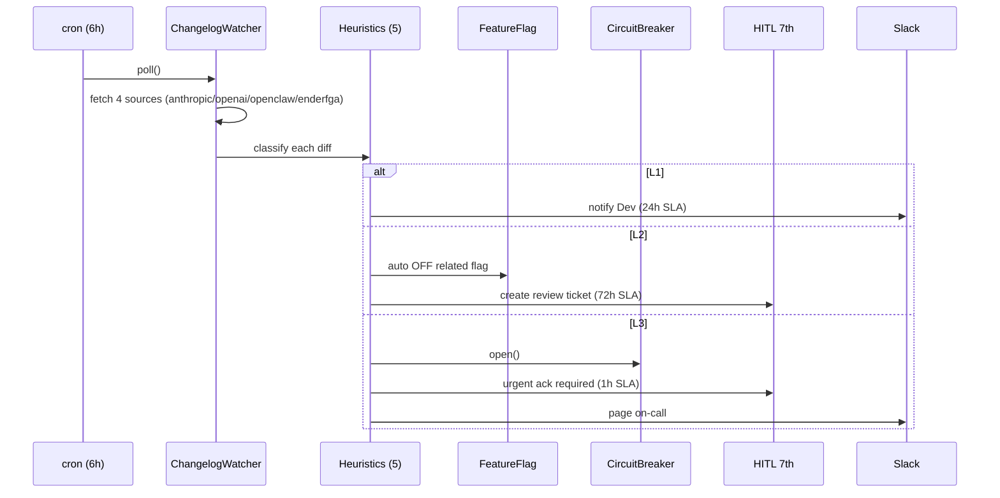

最終更新日: 2026-05-03 / 起案: Dev Department

# PRJ-019 W0-Week2 — openclaw-runtime Wrapper Skeleton

## 0. 目的・スコープ

PRJ-019 Clawbridge は Open Claw OSS と Claude Code CLI subprocess（P-D 改）を harness 上で同居させるが、**両 upstream は独立した release cycle を持ち、breaking change が頻発するリスク（R-019-12-A: red、R-019-12-B: yellow、DEC-019-021）** を抱える。本書は W0-Week2 で構築する `openclaw-runtime` wrapper の責務・interface・breaking change 防御戦略を確定し、Phase 1 W1〜W4 で安定運用に乗せるための skeleton 設計書である。

W0-Week2 では **Mock+RealStub の 2 層実装まで** を完了させ、Phase 1 W1 以降で実 OSS 接続版へ段階移行する。本書は DEC-019-033 §⑤（PRJ-020 同居）を cross-reference のみとし、PRJ-020 への副作用は Phase 1 完遂後の検討対象とする。

---

## 1. 上流 OSS 調査サマリ

| 上流 | URL | 監視粒度 | 現行 pin | 備考 |
|------|-----|----------|----------|------|
| Anthropic Claude Code CLI | https://github.com/anthropics/claude-code | release tag + CHANGELOG.md + breaking section | `>=0.x.y, <0.(x+1).0` | subprocess 実行のみ、stdin/stdout JSON ipc に依存。`--output-format json-events` の event スキーマが breaking 候補 |
| OpenAI Codex CLI | https://github.com/openai/codex | release tag のみ | 未採用（DEC-081 トリガー条件未到達） | DEC-081 再検討トリガー (HITL 拒否率 30% 超 / Claude API down 24h 超 / コスト 1.5 倍超) を満たすまで監視のみ |
| OpenClaw OSS | （Phase 1 W1 で URL 確定） | release tag + Issue label `breaking` | semver pin（W1 で確定） | harness 内 process として spawn、SIGTERM grace period が contract 候補 |
| Enderfga plugin | （PRJ-020 共有想定） | release tag のみ | 未 pin | PRJ-020 同居要件（DEC-019-033 §⑤ cross-ref）、本 PRJ では監視のみで取り込みは Phase 2 以降検討 |

**4 系統 changelog 監視**は DEC-019-022 で正式化済（5 ヒューリスティック / L1-L2-L3 重大度）。本 wrapper は L1 検知時に circuit breaker open、L2 で feature flag 自動 OFF、L3 で人間レビュー HITL 7th `changelog_external_api` を起票する。

---

## 2. P-D 改 Wrapper 層責務

```
┌─────────────────────────────────────────────────────┐
│ orchestrator (harness)                              │
│  └─ proposal-gen / hitl-gate / audit                │
└──────────────┬──────────────────────────────────────┘
               │ stable internal IF (この境界が wrapper)
┌──────────────▼──────────────────────────────────────┐
│ openclaw-runtime (本書スコープ)                     │
│  ├─ Adapter (上流 API 形状差を吸収)                 │
│  ├─ FeatureFlag (機能単位の ON/OFF)                 │
│  ├─ VersionPin (semver lock + drift 検知)           │
│  ├─ CircuitBreaker (連続失敗で自動 OFF)             │
│  └─ ChangelogWatcher (4 系統 cron polling)          │
└──────────────┬──────────────────────────────────────┘
               │ unstable upstream API
┌──────────────▼──────────────────────────────────────┐
│ Claude Code CLI subprocess / Open Claw OSS          │
└─────────────────────────────────────────────────────┘
```

**5 つの責務:**

1. **Adapter** — 上流 API（CLI flag / event JSON / exit code）を内部の安定 IF（`OpenclawRuntime` interface）に正規化。上流 breaking 時は Adapter のみ修正で済む構造。
2. **FeatureFlag** — `tools_search / web_fetch / file_write` 等の機能を個別に ON/OFF。L2 changelog 検知で該当 flag を自動 OFF（fail-closed）。
3. **VersionPin** — `package.json` semver + `runtime-version.lock` の 2 重 pin。起動時に上流 `--version` と照合、drift 検知で fail-closed 起動拒否。
4. **CircuitBreaker** — N 回連続 spawn 失敗 / timeout / exit code 非 0 で `open` 状態に遷移、cool-down 後 `half-open` で 1 件試行。`open` 中は HITL 7th 通知。
5. **ChangelogWatcher** — Anthropic / OpenAI / OpenClaw / Enderfga の 4 系統を 6h cron で polling、5 ヒューリスティック（規定 keyword 検索 / semver major bump / breaking section 出現 / API endpoint 削除 / config 形式変更）で重大度判定。

---

## 3. TypeScript Interface（W0-Week2 確定版）

```ts
// packages/openclaw-runtime/src/interfaces.ts

export interface OpenclawConfig {
  version: string;              // semver pin (e.g., "0.7.x")
  binaryPath: string;           // 解決済み絶対パス
  features: FeatureFlags;       // ON/OFF 状態
  timeout: { spawn: number; idle: number; total: number };
  circuitBreaker: { threshold: number; cooldownMs: number };
}

export interface FeatureFlags {
  toolsSearch: boolean;
  webFetch: boolean;
  fileWrite: boolean;
  shellExec: boolean;
  // ...拡張は Phase 1 W2 以降
}

export interface BreakingNotice {
  source: 'anthropic' | 'openai' | 'openclaw' | 'enderfga';
  severity: 'L1' | 'L2' | 'L3';
  detectedAt: string;           // ISO 8601
  evidence: { url: string; excerpt: string; heuristic: string };
  recommendedAction: 'circuit_open' | 'flag_off' | 'hitl_7th';
}

export interface CompatibilityResult {
  compatible: boolean;
  upstreamVersion: string;
  pinnedVersion: string;
  drift: 'none' | 'patch' | 'minor' | 'major';
  blockers: string[];
}

export interface OpenclawRuntime {
  init(config: OpenclawConfig): Promise<void>;
  checkCompatibility(): Promise<CompatibilityResult>;
  spawn(req: SpawnRequest): Promise<SpawnHandle>;
  getCircuitState(): 'closed' | 'open' | 'half-open';
  onBreakingNotice(handler: (notice: BreakingNotice) => void): void;
  shutdown(graceMs: number): Promise<void>;
}

export interface SpawnRequest {
  prompt: string;
  features: Partial<FeatureFlags>;  // request 単位の override（FeatureFlag と AND 演算）
  hitlContext: { proposalId: string; category: string };
}

export interface SpawnHandle {
  pid: number;
  events: AsyncIterable<RuntimeEvent>;
  cancel(reason: string): Promise<void>;
}

export type RuntimeEvent =
  | { type: 'started'; ts: string }
  | { type: 'progress'; ts: string; payload: unknown }
  | { type: 'tool_call'; ts: string; tool: string; args: unknown }
  | { type: 'completed'; ts: string; exitCode: number }
  | { type: 'error'; ts: string; message: string; recoverable: boolean };
```

---

## 4. Upstream Breaking Change 防御戦略

### 4-A. 4 層 Decoupling

| 層 | 役割 | 失敗時の挙動 |
|----|------|-------------|
| Adapter | API 形状差吸収 | 不明 event 型は `error{recoverable:false}` で握り潰さず ChannelWatcher へ |
| FeatureFlag | 機能単位の動的 OFF | L2 検知時に該当 flag のみ OFF、他機能は継続 |
| VersionPin | semver lock | drift major 検知で起動拒否（fail-closed） |
| CircuitBreaker | 連続失敗で全停止 | open 中は spawn 即 reject、HITL 7th 通知 |

### 4-B. Version Freeze SLA

- **L1（規定 keyword 検出のみ）**: 監視継続、Dev に Slack 通知（24h 以内 review）
- **L2（semver minor 以上 / breaking section 出現）**: FeatureFlag 自動 OFF、HITL 7th 起票（72h 以内 review）
- **L3（major bump / API 削除 / config 形式変更）**: CircuitBreaker open + 全 spawn 停止、HITL 7th 即時通知（1h 以内 ack 必須）

### 4-C. Fallback Strategy

CircuitBreaker `open` 状態では以下を実行:

1. spawn 要求は即時 `RuntimeError(code: CIRCUIT_OPEN)` で reject
2. orchestrator は proposal-gen を一時停止、既存 proposal の HITL 9th 承認のみ継続
3. cool-down（既定 15 分）後 `half-open` に遷移、1 件のみ試行 → 成功で `closed` 復帰、失敗で再 `open`
4. 連続 3 サイクル `open` で「永続障害」判定、Owner に dashboard 経由で通知（DEC-019-033 §② transparency dashboard 連携）

---

## 5. Phase 1 API Surface（W1〜W4 で実装する公開 API）

| # | API | 責務 | 着手週 |
|---|-----|------|--------|
| 1 | `OpenclawRuntime.init()` | config 検証 + binary 解決 + version drift check | W1 |
| 2 | `OpenclawRuntime.checkCompatibility()` | 起動時自動実行 + cron 6h 定期実行 | W1 |
| 3 | `OpenclawRuntime.spawn()` | subprocess 起動 + event stream 返却 | W1 |
| 4 | `OpenclawRuntime.getCircuitState()` | dashboard 表示用 | W2 |
| 5 | `OpenclawRuntime.onBreakingNotice()` | ChangelogWatcher との接続 | W2 |
| 6 | `OpenclawRuntime.shutdown()` | grace period 内に SIGTERM → SIGKILL | W2 |
| 7 | `ChangelogWatcher.poll()` | 6h cron entry point | W3 |

---

## 6. Issue / Changelog 監視 Workflow



**Research / Dev 役割分担:**

| 役割 | 担当 | 頻度 |
|------|------|------|
| L1 evidence 精読 + 影響範囲 1 次評価 | Research 部門 | 24h SLA |
| L2 / L3 検知時の wrapper 修正 PR | Dev 部門 | L2: 72h, L3: 24h |
| HITL 7th 承認後の deploy | Dev 部門 + Review 部門 二重承認 | — |
| 月次 changelog 監視レビュー | Research 主導 + Dev 同席 | 月 1 |

---

## 7. W0-Week2 で確定する DoD

- [x] `packages/openclaw-runtime/` workspace 作成（5/3 prep 済）
- [x] Mock + RealStub 2 層実装（5/3 prep 済、95 tests 内 18 test 該当）
- [ ] 本書記載の 5 interface 確定 + zod schema 化（W2 中）
- [ ] CircuitBreaker / FeatureFlag の単体実装 + 12 tests（W2 中）
- [ ] ChangelogWatcher の cron entry point + 4 source モック fetch + 5 heuristic 単体（W2 中）
- [ ] L1/L2/L3 分岐のシナリオテスト 6 件（W2 中）

---

## 8. Open Issues

- **OSS-01**: OpenClaw OSS の正式 URL / license / release cadence 未確定 → Research 部門 W2 中に確定依頼
- **OSS-02**: Anthropic CLI `--output-format json-events` の event schema が semver 対象外（実験的）→ Adapter で吸収するが、breaking 頻度高い前提で監視重点化
- **OSS-03**: PRJ-020 同居時の Enderfga plugin との runtime 競合（同一プロセス空間 / 共有 file lock）→ DEC-019-033 §⑤ cross-ref のみ、本 PRJ では検討対象外
- **OSS-04**: Codex CLI 採用判断は DEC-081 トリガー条件次第（HITL 拒否率 30%+ / Claude down 24h+ / コスト 1.5x+）→ 本 wrapper の Adapter 層は Codex 形状を想定した abstract に留める

---

## 9. Cross-Reference

- DEC-019-018: HITL 6th `tos_gray_review` 追加
- DEC-019-021: R-019-12 split (A: red breaking, B: yellow silent failure)
- DEC-019-022: 4 系統 changelog 監視 + 5 heuristic + L1/L2/L3
- DEC-019-033 §⑤: PRJ-020 同居要件（cross-ref のみ）
- DEC-081: Codex CLI 採用再検討トリガー
- BAN drill #1（2026-05-13）: CircuitBreaker open + 全 spawn 停止のドリル想定と整合

---

以上、`openclaw-runtime` wrapper W0-Week2 skeleton。Phase 1 W1 開始時点で本書 §3 interface を frozen 扱いとし、変更は decisions.md DEC 起票必須とする。
