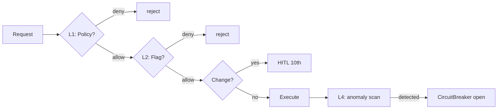

最終更新日: 2026-05-03 / 起案: Dev Department

# PRJ-019 W0 Security Skeleton (`security-w0.md` ドラフト目次)

## 0. 位置づけ

本書は Phase 1 開始（5/26）までに `projects/PRJ-019/security-w0.md` として正式化するための **目次 + 主要セクション skeleton**。STRIDE 脅威モデル / R-019-01〜16 リスク mapping / 50 controls roadmap / DEC-019-033 priviledge escalation 4 層防御 を W0-Week2 中に Dev 部門が初稿、5/19〜5/25 buffer で Review / Research と相互レビュー、5/26 Phase 1 kickoff 時に frozen。BAN drill #1（2026-05-13）の運用と齟齬がない構造であることを §9 で再確認する。DEC-019-033 §⑤ は cross-reference のみ。

---

## 1. 目次（Frozen 候補）

| §  | タイトル                                    | 主要成果物 |
|----|---------------------------------------------|-----------|
| §1 | Scope and Trust Boundaries                  | 信頼境界図 |
| §2 | STRIDE 脅威モデル                            | 脅威表 6 カテゴリ |
| §3 | R-019-01〜16 Risk Mapping                    | risk × control matrix |
| §4 | 50 Controls Roadmap                          | W0-W4 実装計画 |
| §5 | Audit Log（hash chain）                      | schema + 検証 script |
| §6 | RLS / IAM 設計                               | Supabase RLS policy |
| §7 | Secrets Management                           | env / vault / rotation |
| §8 | Priv Escalation 4 層防御（DEC-019-033）      | 4 層 + flow |
| §9 | BAN Drill #1 整合確認                         | 5 SLA × control |
| §10 | Zero-Side-Effect 原則                        | dry-run / rollback |

---

## 2. §2 STRIDE 脅威モデル（主要セクション）

| 脅威 | 例 | PRJ-019 該当 control |
|------|------|---------------------|
| **S**poofing | Owner 偽装で HITL 9th 承認偽造 | G-04 (auth), V2-08 (session bind), magic link + IP allowlist |
| **T**ampering | audit log 改ざん | hash chain trigger（§5）+ Supabase RLS append-only |
| **R**epudiation | Owner が承認否認 | hash-chained audit + Slack 二重記録 + dashboard 履歴 |
| **I**nformation Disclosure | API key / PII / proposal 内容流出 | G-01 secrets scan, V2-11 PII redaction, Vault, RLS |
| **D**enial of Service | subprocess fork bomb / resource exhaust | sandbox resource limit, CircuitBreaker, rate limit |
| **E**levation of Priv | tools_search → file_write → shell の連鎖昇格 | §8 4 層防御（核心） |

---

## 3. §3 R-019-01〜16 Risk Mapping（抜粋、最終版は §3 表で全 16 件）

| Risk | 内容 | 等級 | 主 control |
|------|------|------|-----------|
| R-019-01 | Owner 鍵漏洩 | red | G-01 + Vault rotation |
| R-019-04 | sandbox escape | red | sandbox + Linux namespace + seccomp |
| R-019-08 | audit log 改ざん | red | hash chain trigger |
| R-019-12-A | 上流 OSS breaking change（DEC-019-021 split A） | red | CircuitBreaker + VersionPin + L3 検知 |
| R-019-12-B | 上流 silent failure（同 split B） | yellow | event schema 妥当性検査 + 6h cron |
| R-019-15 | 提案生成プロンプト injection | red | system prompt 固定 + zod 出力検証 |
| R-019-16 | priv escalation（DEC-019-033 で再評価） | red | §8 4 層 |

W0-W1 で **9 controls 実装済**: G-01 / G-02 / G-04 / G-05 / G-06 / G-08 / V2-03 / V2-08 / V2-11（5/3 prep 済）。残 41 controls を W0-Week2 〜 Phase 1 W4 で順次実装。

---

## 4. §4 50 Controls Roadmap（W0-W4 振り分け、各週 8〜13 件）

| Week | 重点領域 | 対象 controls 例 |
|------|---------|------------------|
| W0-W2（〜5/18） | HITL 6th / Audit Hash | G-09, V2-12, V2-13（gray review evidence + audit chain trigger + verify script） |
| Buffer（5/19〜5/25） | review only | — |
| Phase 1 W1（5/26〜） | Auth / Session 強化 | V2-04 〜 V2-07（MFA / session timeout / IP allowlist / device fingerprint） |
| W2 | Secrets / Vault | V2-14〜V2-18（rotation / scoped token / least priv） |
| W3 | Sandbox 強化 | V2-19〜V2-25（namespace / seccomp / rlimit / readonly fs） |
| W4 | Knowledge / PII | V2-26〜V2-30（PII auto-redact / retrieval ACL / quarantine） |

各 control は `organization/rules/quality-gates.md` の DoD と連動、Review 部門が個別 sign-off。

---

## 5. §5 Audit Log Hash Chain（主要セクション）

`audit_events` table に `prev_hash` / `curr_hash` 列を持たせ、PostgreSQL pgcrypto `digest()` trigger で記録時に連鎖。検証 script は `pnpm audit:verify` で全 chain を線形 scan、breakage 検出時は exit 1。詳細スキーマは `dev-tos-gray-review-gate-skeleton.md` §6 参照。本書では:

- chain 起点（genesis row）の生成手順
- chain 分岐禁止（同一 prev_hash を参照する 2 行は constraint で拒否）
- chain 末尾の dashboard 表示（DEC-019-033 §② transparency）

を §5 で明文化。

---

## 6. §6 RLS / IAM 設計（主要セクション）

Supabase RLS policy 設計原則:

1. **Single-Tenant Hard Isolation**: `tenant_id = auth.jwt()->>'tenant_id'` を全 table に適用、未設定 row は select 不可
2. **Append-Only Tables**: `audit_events`, `policy_audit_log`, `dashboard_events` は `INSERT` only、`UPDATE`/`DELETE` 禁止 policy
3. **HITL Pending Visibility**: `hitl_requests` は status=pending を Operator role 全員可視、approved/rejected は Owner + 担当者のみ
4. **7 Category Permission Boundary**: DEC-019-033 §③ 7 カテゴリ毎に独立 RLS policy（tools / fs / net / secrets / hitl / knowledge / runtime）

---

## 7. §7 Secrets Management（主要セクション）

3 層解決: `process.env > Vault(supabase.secrets) > 起動時 prompt`。本番では 2 層目のみ（prompt 禁止）。rotation policy は API key 90 日 / Vault token 30 日 / session 24h。BAN drill #1 で「< 60 分 rotation 完了」を実測確認。

---

## 8. §8 Priv Escalation 4 層防御（DEC-019-033 核心）

DEC-019-033 で正式化された priviledge escalation 防御の 4 層:

| 層 | 名称 | 役割 | 失敗時挙動 |
|----|------|------|-----------|
| **L1** | Static Policy | 7 category 毎の最大権限を policy YAML で固定 | 起動時違反 → 起動拒否 |
| **L2** | Runtime FeatureFlag | request 単位で AND 演算、policy ⊇ flag 必須 | 超過 request → 即 reject |
| **L3** | HITL 10th `permission_change_review` | policy 変更要求は必ず人間レビュー | timeout → 自動 deny |
| **L4** | Audit + Anomaly Detection | 連鎖実行（tools_search→file_write→shell）検知 | dashboard alert + CircuitBreaker open |

**核心原則**: L1 のみ静的、L2-L4 は動的。連鎖実行は L4 でのみ検知可能なため、audit log 即時解析が必須。

---

## 9. §9 BAN Drill #1（2026-05-13）整合確認

5 SLA × 関連 control:

| SLA | 目標 | 関連 control | 検証手段 |
|-----|------|-------------|---------|
| detect | < 1 min | L4 anomaly scan + dashboard | drill 用 inject script |
| notify | < 5 min | Slack notify + on-call page | drill 用 fake Slack webhook |
| evacuate | < 30 min | CircuitBreaker open + sandbox kill | manual playbook |
| secret rotate | < 60 min | Vault rotation script | rotation-test.env で実測 |
| fallback | < 4 h | dev → drill 環境切替 | runbook 手順 |

drill #1 当日に 5 SLA 全項目を計測、未達は decisions.md に DEC として記録、Phase 1 W1 に修正計画を組み込む。

---

## 10. §10 Zero-Side-Effect 原則

すべての破壊的操作（file_write / network_post / db_mutate）は:

1. **dry-run 必須**: 実行前に diff を audit に記録
2. **rollback 可能**: snapshot / transaction / backup 済を確認後実行
3. **HITL 通過必須**: 該当 category の HITL gate を通らない限り実行禁止

W0 期間中は **すべての操作を dry-run** とし、Phase 1 W1 開始時に initial enable list を Owner 承認で決定する。

---

## 11. Open Issues

- **SEC-01**: L4 anomaly detection ルール（連鎖検知 heuristic）が未確定 → W2 中に Research 部門と協議
- **SEC-02**: Vault rotation 自動化スクリプト未実装、BAN drill #1 で手動実測予定 → drill 後 W1 で自動化 PR
- **SEC-03**: 7 category permission policy YAML の schema 仮確定（DEC-019-033 §③）、最終版は W2 review 後 frozen
- **SEC-04**: HITL 10th `permission_change_review` の UI 設計が dashboard と未統合 → architecture-w0.md §3 と同期確認

---

## 12. Cross-Reference

- DEC-019-018 / 019 / 021 / 022 / 031 / 033
- DEC-020-003: HITL 8th `owner_input_review`
- DEC-019-033 §⑤: PRJ-020 同居（cross-ref のみ、本書では副作用検討せず）
- BAN drill #1 (2026-05-13): §9 で実測整合
- `dev-tos-gray-review-gate-skeleton.md` §6: audit hash chain 実装詳細
- `dev-openclaw-runtime-wrapper.md` §4: CircuitBreaker / FeatureFlag

---

以上、`security-w0.md` の skeleton。本書は STRIDE / R-019 / 50 controls / 4 層防御 / BAN drill 整合 を骨格として、5/26 Phase 1 kickoff 時に frozen 化する。
