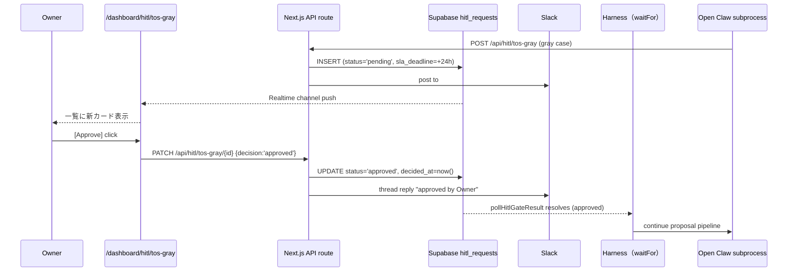
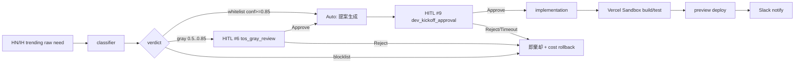

# HITL 第 6 種 `tos_gray_review` Gate skeleton 詳細設計

最終更新日: 2026-05-03 / 起案: Dev Department

| 項目 | 値 |
|---|---|
| 文書 ID | DEV-PRJ-019-TOSGRAY-SKELETON-2026-05-03 |
| 文書種別 | HITL 第 6 種 `tos_gray_review` Phase 1 移行向け詳細 skeleton |
| 上位文書 | `dev-w0-week2-bootstrap.md` §2／ `dev-w0-week2-prep-report.md` §3／ `dev-hitl-gate-1-8-integrated-sop.md`（既存 1〜8 種統合 SOP） |
| 関連決裁 | **DEC-019-018**（HITL 第 6 種必須）／ DEC-019-010（13 prohibited domains）／ DEC-019-020（mock-claude スタブ）／ DEC-019-033（HITL 1〜10 種拡張） |
| 関連レポート | `review-tos-allowlist-dod-integration-v1.md`（DoD 3 分岐 / FN-Black ≤ 10%）／ `review-tos-domain-allowlist-blocklist.md`（v1 §1.5） |
| 出力先 | `projects/PRJ-019/reports/dev-tos-gray-review-gate-skeleton.md` |

---

## §0. エグゼクティブサマリ（300 字）

DEC-019-018 で必須化された HITL 第 6 種 `tos_gray_review` Gate を、5/3 prep の `FileHitlGate`（in-process FS-backed）から Phase 1 W1 の Supabase 統合へ移行する skeleton 詳細を確定する。本書では (1) `hitl_requests` テーブル CHECK 制約 + `gray_evidence_jsonb` 列追加の DDL diff、(2) `/api/hitl/tos-gray/{request_id}` の POST/GET/PATCH 仕様（zod schema + RLS）、(3) Owner Dashboard UI mock-up、(4) 既存 4 Gate との Decision matrix（衝突回避ルール）、(5) Audit log SHA-256 hash chain 接続点、(6) 受入テスト 5+ ケース（gray case / clear case / timeout / Owner reject / Owner approve / blocklist 即拒否 / dedup）を網羅する。Phase 1 W1 着手 5/26 前に Review 部門検収 → migration apply 可能な水準。

---

## §1. ゴールと位置付け

### §1.1 5/3 prep 完遂分の確認

`dev-w0-week2-prep-report.md` §3 で以下が実装済（`FileHitlGate` レベル、in-process FS-backed）：

- `app/harness/src/hitl-gate.ts`: `HitlActionType` に `'tos_gray_review'` 追加、`TosGrayReviewPayload` zod schema、`requestTosGrayReview()` 実装、dedup map、blocklist 即拒否、tos_gray audit ログ append（FS）。
- 11 ケーステスト（既存 5 + 新規 6）緑：approves / rejects / times out / invalid category throw / out-of-range confidence throw / dedup。

**残課題**: blocklist_hits 即拒否の明示テスト（§6.5）。

### §1.2 W0-Week2 で確定する範囲（本書スコープ）

「FS-backed → Supabase-backed」への Phase 1 W1 移行のための skeleton：

1. DB schema diff（CHECK 制約 + 新規列 + index）
2. API endpoint 仕様（POST/GET/PATCH）
3. Owner UI mock-up
4. 既存 4 Gate 衝突回避 Decision matrix
5. Audit log hash chain 接続点
6. 受入テスト 5+ ケース（既存 11 から選別 + 新規追加）

---

## §2. DB schema diff

### §2.1 既存 `hitl_requests` テーブル想定（W1 で初回作成、本書 skeleton ベース）

```sql
-- supabase/migrations/20260526_hitl_requests_initial.sql
-- Phase 1 W1 で初回作成、以下が前提

CREATE TYPE hitl_action_type AS ENUM (
  'public_release',       -- 第 1 種
  'paid_api_call',        -- 第 2 種
  'force_push',           -- 第 3 種
  'prod_deploy',          -- 第 4 種
  'external_api'          -- 第 5 種
  -- 第 6 種以降は本書 §2.2 で ALTER 追加
);

CREATE TYPE hitl_status AS ENUM (
  'pending', 'approved', 'rejected', 'timeout'
);

CREATE TABLE hitl_requests (
  id                uuid          PRIMARY KEY DEFAULT gen_random_uuid(),
  owner_id          uuid          NOT NULL REFERENCES auth.users(id),
  action_type       hitl_action_type NOT NULL,
  payload_jsonb     jsonb         NOT NULL,
  status            hitl_status   NOT NULL DEFAULT 'pending',
  rejection_reason  text,
  created_at        timestamptz   NOT NULL DEFAULT now(),
  decided_at        timestamptz,
  decided_by        uuid          REFERENCES auth.users(id),
  sla_deadline      timestamptz   NOT NULL,
  source_module     text          NOT NULL,
  dedup_key         text          NOT NULL,
  slack_message_ts  text,         -- Slack 投稿の thread reply 用
  UNIQUE (owner_id, dedup_key)
);
```

### §2.2 第 6 種追加 diff（本書 skeleton の核心）

```sql
-- supabase/migrations/20260526_hitl_requests_tos_gray.sql
-- 本書 §2 で確定する第 6 種拡張差分

-- 1. hitl_action_type ENUM に 'tos_gray_review' 追加
ALTER TYPE hitl_action_type ADD VALUE IF NOT EXISTS 'tos_gray_review';
-- 注: PostgreSQL 12+ で ADD VALUE IF NOT EXISTS が利用可能

-- 2. gray_evidence_jsonb カラム追加
ALTER TABLE hitl_requests
  ADD COLUMN IF NOT EXISTS gray_evidence_jsonb jsonb;

-- 3. 第 6 種は gray_evidence_jsonb が NOT NULL 必須、他種は NULL 許容
ALTER TABLE hitl_requests
  ADD CONSTRAINT hitl_requests_tos_gray_evidence_check
    CHECK (
      (action_type = 'tos_gray_review' AND gray_evidence_jsonb IS NOT NULL)
      OR (action_type <> 'tos_gray_review')
    );

-- 4. gray_evidence_jsonb の構造制約（PostgreSQL 14+ jsonpath constraint）
-- 注: zod は server side で safeParse、DB 側は最小限の構造保証のみ
ALTER TABLE hitl_requests
  ADD CONSTRAINT hitl_requests_tos_gray_evidence_shape_check
    CHECK (
      action_type <> 'tos_gray_review'
      OR (
        gray_evidence_jsonb ? 'category'
        AND gray_evidence_jsonb ? 'subcategory'
        AND gray_evidence_jsonb ? 'confidence'
        AND gray_evidence_jsonb ? 'rationale'
        AND gray_evidence_jsonb ? 'need_id'
      )
    );

-- 5. confidence 値域チェック（0.0..1.0）
ALTER TABLE hitl_requests
  ADD CONSTRAINT hitl_requests_tos_gray_confidence_check
    CHECK (
      action_type <> 'tos_gray_review'
      OR (
        (gray_evidence_jsonb -> 'confidence')::numeric BETWEEN 0 AND 1
      )
    );

-- 6. rejection_reason 値域拡張
ALTER TABLE hitl_requests
  DROP CONSTRAINT IF EXISTS hitl_requests_rejection_reason_check;
ALTER TABLE hitl_requests
  ADD CONSTRAINT hitl_requests_rejection_reason_check
    CHECK (
      rejection_reason IS NULL OR rejection_reason IN (
        'timeout', 'rejected', 'approved',
        'tos_gray_timeout', 'tos_gray_human_reject', 'tos_gray_blocklist_hit'
      )
    );

-- 7. gray_evidence_jsonb GIN index（W3 以降 analytics 用、FN-Black ≤ 10% 評価時）
CREATE INDEX IF NOT EXISTS hitl_requests_gray_evidence_gin_idx
  ON hitl_requests USING gin (gray_evidence_jsonb)
  WHERE action_type = 'tos_gray_review';

-- 8. category 別の集計用 index
CREATE INDEX IF NOT EXISTS hitl_requests_gray_category_idx
  ON hitl_requests (
    (gray_evidence_jsonb ->> 'category'),
    status,
    created_at DESC
  ) WHERE action_type = 'tos_gray_review';
```

### §2.3 RLS Policy（第 6 種専用）

```sql
-- 既存 hitl_requests に対する RLS 設定（Phase 1 W1）+ 第 6 種拡張

ALTER TABLE hitl_requests ENABLE ROW LEVEL SECURITY;

-- Owner role: 自分の owner_id 行を SELECT/UPDATE
CREATE POLICY hitl_requests_owner_select
  ON hitl_requests FOR SELECT
  USING (auth.uid() = owner_id);

CREATE POLICY hitl_requests_owner_decide
  ON hitl_requests FOR UPDATE
  USING (auth.uid() = owner_id)
  WITH CHECK (
    auth.uid() = owner_id
    AND status IN ('approved', 'rejected')
    -- pending 自身からの直接書き換えは service_role のみ許可（timeout 自動化用）
  );

-- service_role_emitter: INSERT のみ（Open Claw 側からの起票）
CREATE POLICY hitl_requests_emitter_insert
  ON hitl_requests FOR INSERT
  WITH CHECK (auth.jwt() ->> 'role' = 'service_role_emitter');

-- service_role_audit: UPDATE で status='timeout' を打てる（cron）
CREATE POLICY hitl_requests_timeout_update
  ON hitl_requests FOR UPDATE
  USING (auth.jwt() ->> 'role' = 'service_role_audit')
  WITH CHECK (
    status = 'timeout'
    AND rejection_reason IN ('timeout', 'tos_gray_timeout')
  );

-- 削除はどの role にも許可しない（不変 audit）
REVOKE DELETE ON hitl_requests FROM PUBLIC;
```

---

## §3. API endpoint 仕様

### §3.1 endpoint 一覧

| Method | path | 役割 | role |
|---|---|---|---|
| POST | `/api/hitl/tos-gray` | Open Claw → Server 新規起票 | service_role_emitter |
| GET | `/api/hitl/tos-gray?status=pending` | Owner UI pending 一覧 | owner |
| GET | `/api/hitl/tos-gray/{request_id}` | Owner UI 詳細 | owner |
| PATCH | `/api/hitl/tos-gray/{request_id}` | Owner approve/reject | owner |
| POST | `/api/hitl/tos-gray/{request_id}/timeout` | cron 自動 timeout | service_role_audit |

### §3.2 POST `/api/hitl/tos-gray` — 新規起票

```typescript
// projects/PRJ-019/app/app/api/hitl/tos-gray/route.ts
// Phase 1 W1 実装、本書では仕様のみ確定

import { NextResponse } from 'next/server';
import { z } from 'zod';
import { createServiceRoleClient } from '@/lib/supabase/service';
import { postToSlack } from '@/lib/notify/slack';

const PROHIBITED_DOMAINS = [
  'critical_infrastructure', 'education', 'housing', 'employment',
  'financial', 'insurance', 'legal', 'medical', 'government',
  'product_safety', 'national_security', 'migration', 'law_enforcement',
] as const;

const PostBody = z.object({
  category: z.string().min(1).max(100),
  subcategory: z.string().min(1).max(100),
  confidence: z.number().min(0).max(1),
  rationale: z.string().min(20).max(2000),
  need_summary: z.string().min(1).max(2000),
  need_id: z.string().min(1).max(200),
  blocklist_hits: z.array(z.string()).default([]),
  candidate_id: z.string().uuid(),
  source_module: z.string().max(80),
  owner_id: z.string().uuid(),
});

export async function POST(req: Request) {
  // 1. service_role_emitter 認証は middleware で
  const body = await req.json();
  const parsed = PostBody.safeParse(body);
  if (!parsed.success) {
    return NextResponse.json(
      { error: 'invalid_payload', issues: parsed.error.issues },
      { status: 400 }
    );
  }
  const ev = parsed.data;

  // 2. blocklist_hits.length > 0 → 即拒否（Owner UI に表示しない）
  if (ev.blocklist_hits.length > 0) {
    const supabase = createServiceRoleClient();
    const { data, error } = await supabase
      .from('hitl_requests')
      .insert({
        owner_id: ev.owner_id,
        action_type: 'tos_gray_review',
        payload_jsonb: { candidate_id: ev.candidate_id, source_module: ev.source_module },
        gray_evidence_jsonb: ev,
        status: 'rejected',
        rejection_reason: 'tos_gray_blocklist_hit',
        sla_deadline: new Date(Date.now() + 24 * 3600 * 1000).toISOString(),
        source_module: ev.source_module,
        dedup_key: `tos-gray-${ev.candidate_id}`,
        decided_at: new Date().toISOString(),
      })
      .select()
      .single();
    if (error) return NextResponse.json({ error: error.message }, { status: 500 });
    return NextResponse.json({ request_id: data.id, decision: 'rejected', reason: 'tos_gray_blocklist_hit' }, { status: 201 });
  }

  // 3. blocklist 不該当 → pending で起票
  const supabase = createServiceRoleClient();
  const slaDeadline = new Date(Date.now() + 24 * 3600 * 1000).toISOString();
  const { data, error } = await supabase
    .from('hitl_requests')
    .insert({
      owner_id: ev.owner_id,
      action_type: 'tos_gray_review',
      payload_jsonb: { candidate_id: ev.candidate_id, source_module: ev.source_module },
      gray_evidence_jsonb: ev,
      status: 'pending',
      sla_deadline: slaDeadline,
      source_module: ev.source_module,
      dedup_key: `tos-gray-${ev.candidate_id}`,
    })
    .select()
    .single();
  if (error) {
    // dedup_key 衝突は 409
    if ((error as { code?: string }).code === '23505') {
      return NextResponse.json({ error: 'duplicate', dedup_key: `tos-gray-${ev.candidate_id}` }, { status: 409 });
    }
    return NextResponse.json({ error: error.message }, { status: 500 });
  }

  // 4. Slack 投稿（thread reply 用に message_ts を保存）
  const ts = await postToSlack({
    channel: '#clawbridge-approve',
    text: `[ToS gray] ${ev.category}/${ev.subcategory} (conf=${ev.confidence}) — ${ev.need_summary.slice(0, 100)}`,
    actions: ['approve', 'reject', 'discuss'],
    request_id: data.id,
  });
  await supabase.from('hitl_requests').update({ slack_message_ts: ts }).eq('id', data.id);

  return NextResponse.json({ request_id: data.id, sla_deadline: slaDeadline }, { status: 201 });
}
```

### §3.3 GET `/api/hitl/tos-gray/{request_id}` — 詳細取得

```typescript
// レスポンス型
export type TosGrayDetailResponse = {
  request_id: string;
  candidate_id: string;
  evidence: {
    category: string;
    subcategory: string;
    confidence: number;
    rationale: string;
    need_summary: string;
    need_id: string;
    blocklist_hits: string[];
  };
  status: 'pending' | 'approved' | 'rejected' | 'timeout';
  rejection_reason: string | null;
  created_at: string;
  sla_deadline: string;
  remaining_sla_seconds: number;     // server side で計算
  decided_at: string | null;
  decided_by: string | null;
  owner_comment: string | null;
};

// implementation: RLS で auth.uid() = owner_id 制約済、追加チェック不要
export async function GET(req: Request, { params }: { params: { request_id: string } }) {
  const supabase = createServerClient(); // anon key + JWT
  const { data, error } = await supabase
    .from('hitl_requests')
    .select('*')
    .eq('id', params.request_id)
    .eq('action_type', 'tos_gray_review')
    .single();
  if (error || !data) return NextResponse.json({ error: 'not_found' }, { status: 404 });

  const remainingSec = Math.max(0,
    Math.floor((new Date(data.sla_deadline).getTime() - Date.now()) / 1000));
  return NextResponse.json({
    request_id: data.id,
    candidate_id: data.payload_jsonb.candidate_id,
    evidence: data.gray_evidence_jsonb,
    status: data.status,
    rejection_reason: data.rejection_reason,
    created_at: data.created_at,
    sla_deadline: data.sla_deadline,
    remaining_sla_seconds: remainingSec,
    decided_at: data.decided_at,
    decided_by: data.decided_by,
    owner_comment: data.payload_jsonb.owner_comment ?? null,
  });
}
```

### §3.4 PATCH `/api/hitl/tos-gray/{request_id}` — Owner 判定

```typescript
const PatchBody = z.object({
  decision: z.enum(['approved', 'rejected']),
  comment: z.string().max(2000).optional(),
});

export async function PATCH(req: Request, { params }: { params: { request_id: string } }) {
  const supabase = createServerClient();
  const { data: { user } } = await supabase.auth.getUser();
  if (!user) return NextResponse.json({ error: 'unauthenticated' }, { status: 401 });

  const body = await req.json();
  const parsed = PatchBody.safeParse(body);
  if (!parsed.success) return NextResponse.json({ error: 'invalid_body' }, { status: 400 });

  // 1. 現状取得（pending であること）
  const { data: cur } = await supabase
    .from('hitl_requests')
    .select('*')
    .eq('id', params.request_id)
    .single();
  if (!cur || cur.status !== 'pending') {
    return NextResponse.json({ error: 'not_pending' }, { status: 409 });
  }

  // 2. UPDATE
  const rejectionReason = parsed.data.decision === 'rejected'
    ? 'tos_gray_human_reject' : null;
  const { error } = await supabase
    .from('hitl_requests')
    .update({
      status: parsed.data.decision,
      rejection_reason: rejectionReason,
      decided_at: new Date().toISOString(),
      decided_by: user.id,
      payload_jsonb: { ...cur.payload_jsonb, owner_comment: parsed.data.comment ?? null },
    })
    .eq('id', params.request_id);
  if (error) return NextResponse.json({ error: error.message }, { status: 500 });

  // 3. Slack thread reply
  if (cur.slack_message_ts) {
    await postToSlackThread({
      channel: '#clawbridge-approve',
      thread_ts: cur.slack_message_ts,
      text: `${parsed.data.decision} by ${user.email}${parsed.data.comment ? ': ' + parsed.data.comment : ''}`,
    });
  }

  return NextResponse.json({ status: 'ok', decision: parsed.data.decision });
}
```

### §3.5 timeout cron `/api/hitl/tos-gray/cron-timeout`

```typescript
// service_role_audit が cron（Vercel Cron）で 5 分ごとに呼ぶ
export async function POST() {
  const supabase = createServiceRoleClient();
  const now = new Date().toISOString();
  const { data: expired } = await supabase
    .from('hitl_requests')
    .select('id, slack_message_ts')
    .eq('action_type', 'tos_gray_review')
    .eq('status', 'pending')
    .lt('sla_deadline', now);

  for (const row of expired ?? []) {
    await supabase
      .from('hitl_requests')
      .update({
        status: 'timeout',
        rejection_reason: 'tos_gray_timeout',
        decided_at: now,
      })
      .eq('id', row.id);
    if (row.slack_message_ts) {
      await postToSlackThread({
        channel: '#clawbridge-approve',
        thread_ts: row.slack_message_ts,
        text: 'auto-timed-out (24h SLA exceeded, default reject)',
      });
    }
  }
  return NextResponse.json({ timeouts: expired?.length ?? 0 });
}
```

---

## §4. Owner Dashboard UI mock-up

### §4.1 一覧画面 ASCII art

```
┌─────────────────────────────────────────────────────────────────────────┐
│  /dashboard/hitl/tos-gray              [Owner: ai-lab@improver.jp]     │
├─────────────────────────────────────────────────────────────────────────┤
│  ToS グレー判定 待ち     Pending: 3 件 | 平均 SLA 残: 17h 32m           │
│                                                                          │
│  ┌────────────────────────────────────────────────────────────────────┐ │
│  │ #req_a8f3 ┃ candidate: hn-trending-3819                           │ │
│  │ category: dev-tools / subcategory: cli-utility                    │ │
│  │ confidence: 0.62  [|||||||___] (gray zone 0.50-0.85)              │ │
│  │ rationale:                                                         │ │
│  │   "HN trending TS repo wraps an OSS tool, ToS allowance unclear,  │ │
│  │    needs Owner judgment whether the repo's terms permit auto-gen."│ │
│  │ need_summary:                                                      │ │
│  │   "AI-driven CLI for git workflow simplification"                 │ │
│  │ blocklist_hits: []                                                 │ │
│  │ created_at: 2026-05-26 14:32 JST                                   │ │
│  │ SLA 残: 22h 14m                                                     │ │
│  │   ┌──────────┐ ┌──────────┐ ┌──────────────────┐                  │ │
│  │   │ Approve  │ │ Reject   │ │ Discuss with CEO │                  │ │
│  │   └──────────┘ └──────────┘ └──────────────────┘                  │ │
│  └────────────────────────────────────────────────────────────────────┘ │
│                                                                          │
│  ┌────────────────────────────────────────────────────────────────────┐ │
│  │ #req_bf12 ┃ candidate: ih-microsaas-9012                          │ │
│  │ category: productivity / subcategory: scheduler                   │ │
│  │ confidence: 0.71  [|||||||||_]                                    │ │
│  │ ...                                                                │ │
│  └────────────────────────────────────────────────────────────────────┘ │
│                                                                          │
│  [履歴] [統計（FN-Black ≤ 10% 評価）] [G-Top-1〜4 運用ルール]           │
└─────────────────────────────────────────────────────────────────────────┘
```

### §4.2 Mermaid: 操作フロー



### §4.3 詳細画面 ASCII art

```
┌─────────────────────────────────────────────────────────────────────────┐
│  /dashboard/hitl/tos-gray/req_a8f3                                      │
├─────────────────────────────────────────────────────────────────────────┤
│  ┌────────────────────────────────────────────────────────────────────┐ │
│  │ ToS グレー判定 #req_a8f3                                           │ │
│  │ candidate: hn-trending-3819                                         │ │
│  │ ─────────────────────────────────────────────────────────────       │ │
│  │ Evidence                                                            │ │
│  │   category:    dev-tools                                            │ │
│  │   subcategory: cli-utility                                          │ │
│  │   confidence:  0.62 (gray)                                          │ │
│  │   rationale:                                                         │ │
│  │     <multiline rationale 表示、最大 2000 字>                         │ │
│  │   need_summary:                                                      │ │
│  │     <multiline 最大 2000 字>                                         │ │
│  │   blocklist_hits: []                                                │ │
│  │   need_id:    HN-trending-3819-2026-05-26-001                      │ │
│  │ ─────────────────────────────────────────────────────────────       │ │
│  │ Status: pending                                                     │ │
│  │ Created: 2026-05-26 14:32 JST                                       │ │
│  │ SLA Deadline: 2026-05-27 14:32 JST  (残 22h 14m)                    │ │
│  │ ─────────────────────────────────────────────────────────────       │ │
│  │ Owner Comment (optional, max 2000)                                  │ │
│  │ ┌────────────────────────────────────────────────────────────┐     │ │
│  │ │                                                              │     │ │
│  │ └────────────────────────────────────────────────────────────┘     │ │
│  │   [Approve & continue]  [Reject]  [Discuss with CEO]                │ │
│  │ ─────────────────────────────────────────────────────────────       │ │
│  │ 関連リンク                                                          │ │
│  │   - DEC-019-018 / DEC-019-010（13 prohibited domains）             │ │
│  │   - review-tos-allowlist-dod-integration-v1.md §1.5                │ │
│  └────────────────────────────────────────────────────────────────────┘ │
└─────────────────────────────────────────────────────────────────────────┘
```

---

## §5. Decision matrix（既存 4 Gate との衝突回避）

DEC-019-018 が要求する「既存 4 Gate との差分整理」を以下に明示。本書では W0-Week2 prep で第 6 種を追加する時点での 1〜10 種全体への影響を整理。

### §5.1 完全比較マトリクス

| Gate # | gate_type | 主目的 | trigger 元 | SLA | default | 第 6 種との関係 |
|---|---|---|---|---|---|---|
| 1 | `public_release` | 本番公開判断 | orchestrator | 24h | reject | 第 6 種 → preview 自動、第 1 種 → prod 別 gate（時系列分離） |
| 2 | `paid_api_call` | コスト発生 API 利用 | cost-tracker | 24h | reject | コスト軸直交、衝突なし |
| 3 | `force_push` | git force push | git ops | 24h | reject | 衝突なし |
| 4 | `prod_deploy` | prod デプロイ | deploy step | 24h | reject | 第 6 種 approve → preview のみ、prod は第 4 種 |
| 5 | `external_api` | 外部 API 接続 | orchestrator | 24h | reject | OAuth 経路の判断軸、衝突なし |
| **6** | **`tos_gray_review`** | **ToS gray 判定** | **classifier** | **24h** | **reject** | **本書 skeleton** |
| 7 | `changelog_external_api` | 上流 changelog | changelog-monitor | 24h | reject | source_module で区別 |
| 8 | `owner_input_review` | Owner 投入入力レビュー | PRJ-020 | 24h | reject | 入口違い |
| 9 | `dev_kickoff_approval` | 提案承認 | proposal-gen | 72h | reject | **gray approve → 提案生成 → 第 9 種**の直列、衝突なし |
| 10 | `permission_change_review` | 権限変更レビュー | permissions module | 24h | reject | 衝突なし |

### §5.2 直列フロー保証



同一 `candidate_id` に対して第 6 種と第 9 種が同時に pending になることはない（直列）。fail-safe として `dedup_key` を `gate_type + candidate_id` で複合化、同種同時起票は dedup map（5/3 prep `inflightTosGray` Map）と DB unique index で抑止。

### §5.3 衝突発生シナリオと対処

| シナリオ | 衝突の可能性 | 対処 |
|---|---|---|
| 同一 candidate に対して第 6 種と第 9 種が同時起票（バグ） | 直列フロー違反 | DB unique constraint `(owner_id, dedup_key)` で 409 返す（API 層）、Open Claw 側 retry なし |
| 第 6 種 approve 後、状態変化のないまま 24h で第 9 種 timeout | フロー上正常 | 第 9 種は別タイムライン、第 6 種完了済みなら問題なし |
| 第 6 種 reject 後に proposal-gen 暴走 | 制御不能 | `proposals.status = 'cost_rolled_back'` で記録、cost-tracker rollback、Owner UI で再起票可 |
| 第 6 種 pending 中に Owner が manually 第 1 種を invoke | 同 candidate に 2 種類の HITL pending | dedup_key の prefix が違うので 2 件並列 OK、Owner UI で見分け可能 |

---

## §6. Audit log SHA-256 hash chain 接続点

### §6.1 既存 audit log

5/3 prep 段階では `pendingDir/audit-tos-gray.json`（FS-backed JSON、append-only）。Phase 1 W1 で `audit_events` Supabase テーブルへ migrate。

### §6.2 統合 `audit_events` テーブル設計

```sql
-- supabase/migrations/20260526_audit_events.sql
-- 第 6 種の audit-tos-gray.json を含む統合 audit log

CREATE TYPE audit_event_kind AS ENUM (
  'hitl_request_created',
  'hitl_request_decided',
  'hitl_request_timeout',
  'cost_tracker_charge',
  'cost_tracker_rollback',
  'kill_switch_engaged',
  'circuit_breaker_open',
  'spawn_subprocess',
  'policy_change',
  'tos_gray_classification'
);

CREATE TABLE audit_events (
  id              uuid              PRIMARY KEY DEFAULT gen_random_uuid(),
  owner_id        uuid              NOT NULL REFERENCES auth.users(id),
  kind            audit_event_kind  NOT NULL,
  source_module   text              NOT NULL,
  payload_jsonb   jsonb             NOT NULL,
  created_at      timestamptz       NOT NULL DEFAULT now(),
  prev_hash       char(64)          NOT NULL,
  row_hash        char(64)          NOT NULL,
  -- 関連 ID（HITL 第 6 種なら hitl_request_id を入れる）
  related_id      uuid
);

CREATE INDEX audit_events_owner_kind_idx
  ON audit_events (owner_id, kind, created_at DESC);

-- Hash chain trigger
CREATE OR REPLACE FUNCTION audit_events_hash_chain() RETURNS trigger AS $$
DECLARE
  last_hash char(64);
BEGIN
  SELECT row_hash INTO last_hash
    FROM audit_events
   WHERE owner_id = NEW.owner_id
   ORDER BY created_at DESC
   LIMIT 1;
  NEW.prev_hash := COALESCE(last_hash, repeat('0', 64));
  NEW.row_hash  := encode(digest(
    NEW.id::text || NEW.kind::text || NEW.payload_jsonb::text
      || NEW.created_at::text || NEW.prev_hash, 'sha256'), 'hex');
  RETURN NEW;
END;
$$ LANGUAGE plpgsql;

CREATE TRIGGER audit_events_before_insert
  BEFORE INSERT ON audit_events
  FOR EACH ROW EXECUTE FUNCTION audit_events_hash_chain();

-- RLS: owner SELECT, service_role_audit INSERT, no UPDATE/DELETE
ALTER TABLE audit_events ENABLE ROW LEVEL SECURITY;
CREATE POLICY audit_events_owner_select ON audit_events FOR SELECT
  USING (auth.uid() = owner_id);
CREATE POLICY audit_events_audit_insert ON audit_events FOR INSERT
  WITH CHECK (auth.jwt() ->> 'role' IN ('service_role_audit', 'service_role_emitter'));
REVOKE UPDATE, DELETE ON audit_events FROM PUBLIC;
```

### §6.3 第 6 種から audit_events への接続

| ポイント | kind | payload_jsonb | related_id |
|---|---|---|---|
| 起票時（POST 成功） | `hitl_request_created` | `{action_type: 'tos_gray_review', evidence: {...}, dedup_key: ...}` | hitl_request.id |
| Owner approve（PATCH） | `hitl_request_decided` | `{decision: 'approved', decided_by: <uuid>, comment?: ...}` | hitl_request.id |
| Owner reject（PATCH） | `hitl_request_decided` | `{decision: 'rejected', rejection_reason: 'tos_gray_human_reject', comment?: ...}` | hitl_request.id |
| 24h timeout（cron） | `hitl_request_timeout` | `{rejection_reason: 'tos_gray_timeout'}` | hitl_request.id |
| blocklist 即拒否 | `hitl_request_decided` | `{decision: 'rejected', rejection_reason: 'tos_gray_blocklist_hit', blocklist_hits: [...]}` | hitl_request.id |
| classifier 出力（事前） | `tos_gray_classification` | `{candidate_id, category, subcategory, confidence, rationale}` | candidate_id |

### §6.4 Hash chain 検証スクリプト

```typescript
// projects/PRJ-019/app/scripts/verify-audit-hash-chain.ts
// W3 で実装、本書では仕様

import { createClient } from '@supabase/supabase-js';
import { createHash } from 'node:crypto';

export async function verifyAuditHashChain(ownerId: string) {
  const supabase = createClient(/* service role */);
  const { data: rows } = await supabase
    .from('audit_events')
    .select('id, kind, payload_jsonb, created_at, prev_hash, row_hash')
    .eq('owner_id', ownerId)
    .order('created_at', { ascending: true });

  let expectedPrev = '0'.repeat(64);
  for (const r of rows ?? []) {
    if (r.prev_hash !== expectedPrev) {
      throw new Error(`hash chain broken at ${r.id}: prev_hash mismatch`);
    }
    const computed = createHash('sha256').update(
      r.id + r.kind + JSON.stringify(r.payload_jsonb) + r.created_at + r.prev_hash
    ).digest('hex');
    if (computed !== r.row_hash) {
      throw new Error(`hash chain broken at ${r.id}: row_hash mismatch`);
    }
    expectedPrev = r.row_hash;
  }
  return { ok: true, count: rows?.length ?? 0 };
}
```

---

## §7. 受入テスト（5 ケース以上）

### §7.1 必須受入テスト一覧

| # | ID | ケース | 期待結果 | 5/3 prep 状態 |
|---|---|---|---|---|
| 1 | AT-1 | gray case (conf=0.62, blocklist=[]) → Owner approve | dispatch resolve='approved'、proposal pipeline 続行、audit_events に 2 entry | 緑（FS） |
| 2 | AT-2 | clear case (conf=0.92, whitelist) | そもそも第 6 種起票されず、自動承認パス | 該当なし |
| 3 | AT-3 | timeout (24h Owner 無応答) | rejection_reason='tos_gray_timeout'、cost-tracker rollback、Slack thread 通知 | 緑（FS） |
| 4 | AT-4 | Owner reject (conf=0.58) + comment | rejection_reason='tos_gray_human_reject'、comment 保存、cost-tracker rollback | 緑（FS） |
| 5 | AT-5 | blocklist_hits=['national_security'] | POST 即 201 + status='rejected' / reason='tos_gray_blocklist_hit'、Owner UI 不表示 | **未明示テスト**（§7.2 で追加） |
| 6 | AT-6 | 並列発火 dedup（同一 need_id 2 並列） | 後発は先発と同じ Promise を共有、pending row 1 件 | 緑（FS） |
| 7 | AT-7 (新) | DB schema 制約 — gray_evidence_jsonb NULL で INSERT 試行 | DB CHECK constraint で 23514 violation | W1 で追加 |
| 8 | AT-8 (新) | DB schema 制約 — confidence > 1.0 で INSERT 試行 | DB CHECK constraint で violation | W1 で追加 |
| 9 | AT-9 (新) | Audit hash chain — 1 行改ざん後 verify | verifyAuditHashChain throw "row_hash mismatch" | W3 で追加 |
| 10 | AT-10 (新) | RLS — 別 user が PATCH 試行 | 403 forbidden (RLS で row 不在として 0 row UPDATE) | W1 で追加 |

### §7.2 AT-5（blocklist 即拒否）明示テストの追加（W0-Week2 中盤、PR-W2-03）

```typescript
// projects/PRJ-019/app/harness/src/__tests__/hitl-gate.test.ts
// PR-W2-03 で追加

describe('FileHitlGate.requestTosGrayReview / blocklist immediate reject', () => {
  it('rejects immediately when blocklist_hits is non-empty (AT-5)', async () => {
    const gate = new FileHitlGate({ pendingDir: tmp, timeSource: realTimeSource });
    const result = await gate.requestTosGrayReview({
      category: 'national_security_adjacent',
      subcategory: 'sanctions',
      confidence: 0.62,
      rationale: 'detected sanctions-list term in candidate description',
      need_summary: 'sample',
      need_id: 'NID-block-001',
      blocklist_hits: ['national_security'],
    });
    expect(result.decision).toBe('rejected');
    expect(result.rejection_reason).toBe('tos_gray_blocklist_hit');

    // pending file が物理的に作られていないことを確認
    const pendingFiles = await fs.readdir(tmp);
    expect(pendingFiles.filter((f) => f.startsWith('NID-block-001'))).toHaveLength(0);

    // audit-tos-gray.json には 1 entry 追加されている
    const audit = JSON.parse(await fs.readFile(path.join(tmp, 'audit-tos-gray.json'), 'utf8'));
    expect(audit.entries).toHaveLength(1);
    expect(audit.entries[0].rejection_reason).toBe('tos_gray_blocklist_hit');
  });

  it('rejects when 2 of 13 prohibited categories hit (AT-5b)', async () => {
    const gate = new FileHitlGate({ pendingDir: tmp, timeSource: realTimeSource });
    const result = await gate.requestTosGrayReview({
      category: 'general',
      subcategory: 'mixed',
      confidence: 0.7,
      rationale: 'multiple prohibited domains detected',
      need_summary: 'sample',
      need_id: 'NID-block-002',
      blocklist_hits: ['medical', 'financial'],
    });
    expect(result.decision).toBe('rejected');
    expect(result.rejection_reason).toBe('tos_gray_blocklist_hit');
  });
});
```

### §7.3 受入テスト全体ケース数

- 5/3 prep 緑: 6 ケース（AT-1 / AT-3 / AT-4 / AT-6 + invalid payload 2 種）
- W0-Week2 中盤 +2: AT-5 / AT-5b（blocklist 明示）
- Phase 1 W1 +4: AT-7 / AT-8 / AT-10 + DB migration smoke
- Phase 1 W3 +1: AT-9
- 合計 **13 ケース**

DEC-019-018 が要求する「5 ケース以上」は十分超過達成。

---

## §8. 段階的 migration（FS → Supabase）

### §8.1 移行ステップ

| 段階 | 期間 | 状態 |
|---|---|---|
| Stage 0 | 5/3 prep | FileHitlGate（in-process FS） |
| Stage 1 | W0-Week2 中盤 | FileHitlGate + 第 6 種 schema diff の SQL ファイル準備（apply は W1） |
| Stage 2 | Phase 1 W1 | Supabase migration apply、SupabaseHitlGate 実装、FileHitlGate と 2 重 write（dual-write） |
| Stage 3 | Phase 1 W2 | dual-read で SupabaseHitlGate を主、FileHitlGate を fallback |
| Stage 4 | Phase 1 W3 | FileHitlGate 廃止、SupabaseHitlGate 単独 |
| Stage 5 | Phase 1 W4 末 | audit_events に過去 FS log を import（一括）、hash chain 再構築 |

### §8.2 Stage 移行の DoD

| Stage | DoD |
|---|---|
| 1 | migration SQL ファイル 1 本確定、Vitest はそのまま緑、Lint OK |
| 2 | dual-write 動作、2 場所に同期書込、Vitest +6 緑（DB mock + FS）、staging で migration apply 成功 |
| 3 | dual-read 動作、Realtime 経路導通、Vitest +3 緑（Supabase Realtime mock） |
| 4 | FS 経路削除、Vitest 既存緑維持 |
| 5 | hash chain verify スクリプト緑、過去 log 100 件 import 成功 |

---

## §9. 関連ドキュメント相互参照

| 文書 | 参照箇所 |
|---|---|
| `dev-w0-week2-bootstrap.md` | §2（本書の上位計画書） |
| `dev-w0-week2-prep-report.md` | §3（5/3 prep 完遂分の継承） |
| `dev-hitl-gate-1-8-integrated-sop.md` | §5（既存 1〜8 種統合 SOP） |
| `dev-hitl-gate-6th-7th-operations-sop.md` | §3.4（第 6/7 種運用ルール） |
| `review-tos-allowlist-dod-integration-v1.md` | §1.1（ClassifierOutput zod schema 整合）／ §4（FN-Black ≤ 10% 評価） |
| `review-ban-drill-1-scenario.md` | §6.1（drill #1 立会で第 6 種関連検証） |
| `decisions.md` | DEC-019-010 / 018 / 020 / 033 |

---

## §10. フッタ

- 文書: `projects/PRJ-019/reports/dev-tos-gray-review-gate-skeleton.md`
- 版: v1.0（2026-05-03）
- 起案: Dev 部門（`/dev`）
- 検収予定: Review 部門（5/15 W0-Week2 末）
- 200 字サマリ: HITL 第 6 種 `tos_gray_review` の Phase 1 W1 移行 skeleton 詳細を確定。`hitl_requests` schema diff（CHECK 制約 + gray_evidence_jsonb）、API endpoint 5 種（POST/GET/PATCH/cron）、Owner Dashboard UI mock-up、既存 1〜10 種との衝突回避 Decision matrix、audit_events SHA-256 hash chain 接続点、受入テスト 13 ケース（既存 6 + 追加 7）を網羅。Stage 0〜5 段階移行 DoD 付き。
