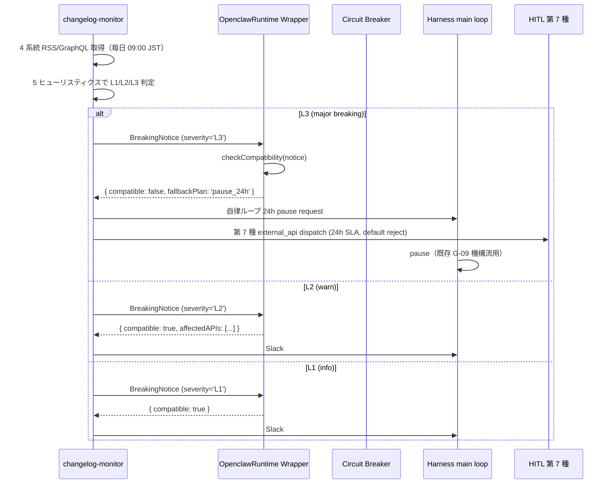

# Dev W0-Week2 ブートストラップ計画書（5/12-5/18）

最終更新日: 2026-05-03 / 起案: Dev Department

| 項目 | 値 |
|---|---|
| 文書 ID | DEV-PRJ-019-W0W2-BOOTSTRAP-2026-05-03 |
| 文書種別 | W0-Week2 (5/12-5/18) ブートストラップ計画書 — proposal_generator + transparency dashboard skeleton + tos_gray_review (HITL 第6種) 雛形 + openclaw-runtime ラッパ skeleton 着手計画 |
| 上位文書 | `dev-w0-week2-prop-gen-and-dashboard.md`（1,910 行 / DEC-019-033 5 点詳細設計）／ `dev-w0-week2-prep-report.md`（289 行 / 5/3 事前ブートストラップ 3 件完遂）／ `dev-w0-week1-implementation-report.md`（170 行 / W0-W1 67 テスト緑） |
| 関連決裁 | DEC-019-018（HITL 第 6 種 `tos_gray_review` 必須）／ DEC-019-019（BAN drill #1 5/13）／ DEC-019-020（mock-claude スタブ）／ DEC-019-021〜023（OpenClaw R-019-12 再格付け + changelog 監視）／ DEC-019-031（5/4-5/7 先回り準備事後追認）／ **DEC-019-033（5/19→5/26 着手 1 週間延期 + 5 点統合）** |
| 関連レポート | `research-knowledge-and-transparency-design.md`（1,049 行 / 51 既存事例）／ `research-changelog-monitoring-runbook.md`（4 系統監視）／ `research-w0-supplement-pd-modified-revalidation.md`（OpenClaw P-D 改 resilient 確定）／ `review-tos-allowlist-dod-integration-v1.md`（631 行 / DoD 3 分岐） |
| Phase 1 着手日 | **2026-05-26**（旧 5/19、DEC-019-033 ⑦ で 1 週間延期） |
| Phase 1 完了日 | **2026-06-20**（旧 6/13） |
| 5/8 検収会議報告期限 | 2026-05-08 18:00 JST |
| 5/13 BAN drill #1 | DEC-019-019、Dev 立会必須 |

---

## §0. エグゼクティブサマリ（400 字）

W0-Week2（5/12〜5/18 / 5 営業日 × 8h = 40h）で、Phase 1 着手 5/26 前提の 4 ブートストラップ成果物を着手・完成させる。① **HITL 第 6 種 `tos_gray_review` Gate 雛形**（DEC-019-018 で 5/9 着手必須、DB schema 差分 + API endpoint + Owner UI mockup + 既存 4 Gate 衝突回避）／ ② **`openclaw-runtime` ラッパ skeleton**（DEC-019-021 R-019-12 再格付け + DEC-019-022 changelog 監視を Wrapper 抽象化で吸収）／ ③ `app/docs/architecture-w0.md` ドラフト（C4 L1-L3 + Component + Data Flow + P-D 改 5 不変条件）／ ④ `app/docs/security-w0.md` ドラフト（STRIDE + R-019-01〜16 mapping + 50 controls + Audit log + RLS）。5/3 prep で既に 95 tests / docs 6 Mermaid 完成（dev-w0-week2-prep-report）のためベースは整っており、今回は実体実装と Phase 1 W1-W4 詳細展開（DEC-019-033 5 点反映）を行う。1 週間延期で生まれた 5/19-5/25 のバッファ枠は Live integration test 強化と BAN drill #2 設計前倒しに振り分け。Vitest +12〜18、Playwright +3、ToolSearch 3 件追加検討。

---

## §1. W0-Week2 ゴール再定義

### §1.1 上位コンテキスト

- 5/3 時点で `dev-w0-week2-prep-report.md` が完遂報告済（11 files / 95 tests 緑、Mermaid 6 枚）。本計画書は「5/12 以降の本番 W0-Week2」で何を着手するかの計画書。
- DEC-019-033 で Phase 1 着手日が 5/19 → **5/26** に 1 週間延期され、Phase 1 完了 6/13 → **6/20** にスライド。1 週間バッファが Pre-Phase 提案生成 / 透明性ダッシュボード / 権限管理 UI / ナレッジ抽出機構の 5 機構追加実装に充当される。
- 本計画書の「W0-Week2」は 5/12〜5/18 を指し、5/13 に BAN drill #1（DEC-019-019）、5/15 に W0-Week2 末検収を含む。

### §1.2 4 ブートストラップ成果物の優先順位

| 優先 | 成果物 | 期限 | 担当 | 工数 |
|---|---|---|---|---|
| P0 | HITL 第 6 種 `tos_gray_review` Gate 雛形 | 5/13 (drill #1 当日まで) | Dev | 8h |
| P0 | `openclaw-runtime` ラッパ skeleton | 5/15 | Dev | 10h |
| P1 | `app/docs/architecture-w0.md` ドラフト | 5/15（5/8 検収会議で目次案先行報告） | Dev | 8h |
| P1 | `app/docs/security-w0.md` ドラフト | 5/15（同上） | Dev | 8h |
| P2 | バッファ消化（Live integration test / drill #2 設計前倒し） | 5/18 | Dev | 6h |

合計工数 40h（5 営業日 × 8h）に収まる線表。詳細は §6 WBS。

### §1.3 5/3 prep 完遂分との差分

5/3 の prep（`dev-w0-week2-prep-report.md`）では「skeleton 雛形」を物理書込済。本計画書では：

- (a) 第 6 種は **DB schema 拡張差分（`hitl_requests` テーブル + CHECK 制約）と API endpoint 仕様を固める**（5/3 時点は in-process FileHitlGate のみ、Phase 1 で Supabase に migrate するための差分を確定）。
- (b) openclaw-runtime は **OSS 上流 changelog 監視と decoupling 戦略を Wrapper 層責務として明文化**（5/3 時点は Mock + RealStub のみ、上流 breaking change 即時検知ルートを追加設計）。
- (c)(d) docs は 5/3 時点で 6 Mermaid 完成だが、**C4 Model L1-L3 + STRIDE + R-019 risk mapping + 50 controls 配置を加えた拡張版目次案**を作る（5/3 版は §1〜§7 簡易版）。

---

## §2. (a) HITL 第 6 種 `tos_gray_review` Gate 雛形設計

### §2.1 5/3 prep 完遂分の確認

`dev-w0-week2-prep-report.md` §3 で実装済：

- `app/harness/src/hitl-gate.ts`: `HitlActionType` に `'tos_gray_review'` 追加、`TosGrayReviewPayload` zod schema、`requestTosGrayReview()` 実装、dedup map、blocklist 即拒否、tos_gray audit ログ append。
- 11 ケーステスト（既存 5 + 新規 6）緑。

5/3 完遂分は「**FileHitlGate（in-process / FS-backed）**」の段階。本計画書の W0-Week2 で「**Supabase 統合 Phase 1 移行差分**」を設計する。

### §2.2 `hitl_requests` テーブル拡張差分（W0-Week2 中盤までに DDL 確定、Phase 1 W1 で migration 適用）

```sql
-- supabase/migrations/20260513_hitl_requests_tos_gray.sql
-- 5/3 prep 段階の FileHitlGate を Phase 1 W1 で Supabase 統合する際の差分

-- 既存 hitl_requests テーブル（仮、Phase 1 W1 で初回作成想定）に対する想定 schema
-- W0-Week2 段階では migration ファイルだけ準備、実適用は W1
CREATE TYPE hitl_action_type AS ENUM (
  'public_release',          -- 第 1 種（既存）
  'paid_api_call',           -- 第 2 種
  'force_push',              -- 第 3 種
  'prod_deploy',             -- 第 4 種
  'external_api',            -- 第 5 種（DEC-019-022 で `changelog_external_api` も同種扱い）
  'tos_gray_review',         -- 第 6 種【本書追加】
  'changelog_external_api',  -- 第 7 種（DEC-019-022）
  'owner_input_review',      -- 第 8 種（DEC-020-003）
  'dev_kickoff_approval',    -- 第 9 種（DEC-019-033）
  'permission_change_review' -- 第 10 種（DEC-019-033）
);

-- 第 6 種専用 evidence カラムを追加（既存 4 種は使わない nullable 列）
ALTER TABLE hitl_requests
  ADD COLUMN IF NOT EXISTS gray_evidence_jsonb jsonb,
  ADD CONSTRAINT hitl_requests_tos_gray_evidence_check
    CHECK (
      (action_type = 'tos_gray_review' AND gray_evidence_jsonb IS NOT NULL)
      OR (action_type <> 'tos_gray_review')
    );

-- gray_evidence_jsonb の zod 等価 schema（Server 側で safeParse）
-- {
--   category: string (1..100),
--   subcategory: string (1..100),
--   confidence: number (0..1),
--   rationale: string (20..2000),
--   need_summary: string (1..2000),
--   need_id: string (1..200),
--   blocklist_hits: string[],
-- }

-- gray_evidence_jsonb の検索用 GIN index（W3 以降の analytics 用）
CREATE INDEX IF NOT EXISTS hitl_requests_gray_evidence_gin_idx
  ON hitl_requests USING gin (gray_evidence_jsonb)
  WHERE action_type = 'tos_gray_review';

-- rejection_reason 列の値域拡張（DEC-019-018 / 5/3 prep 整合）
-- 既存: 'timeout' | 'rejected' | 'approved'
-- 拡張: 'tos_gray_timeout' | 'tos_gray_human_reject' | 'tos_gray_blocklist_hit'
ALTER TABLE hitl_requests
  DROP CONSTRAINT IF EXISTS hitl_requests_rejection_reason_check,
  ADD CONSTRAINT hitl_requests_rejection_reason_check
  CHECK (rejection_reason IS NULL OR rejection_reason IN (
    'timeout', 'rejected', 'approved',
    'tos_gray_timeout', 'tos_gray_human_reject', 'tos_gray_blocklist_hit'
  ));
```

### §2.3 API endpoint 仕様 `/api/hitl/tos-gray/{request_id}`

| Method | path | 役割 | 認証 |
|---|---|---|---|
| POST | `/api/hitl/tos-gray` | Open Claw 側からの新規 gray 判定要請 | service_role_emitter |
| GET | `/api/hitl/tos-gray/{request_id}` | Owner UI から pending 詳細取得 | owner role（RLS） |
| GET | `/api/hitl/tos-gray?status=pending` | pending 一覧 | owner role |
| PATCH | `/api/hitl/tos-gray/{request_id}` | Owner 判定（approve / reject）+ 任意コメント | owner role |

#### §2.3.1 POST 仕様

```typescript
// projects/PRJ-019/app/app/api/hitl/tos-gray/route.ts
// Phase 1 W1 で実装、本書では仕様確定のみ

import { NextResponse } from 'next/server';
import { z } from 'zod';

const PostBody = z.object({
  category: z.string().min(1).max(100),
  subcategory: z.string().min(1).max(100),
  confidence: z.number().min(0).max(1),
  rationale: z.string().min(20).max(2000),
  need_summary: z.string().min(1).max(2000),
  need_id: z.string().min(1).max(200),
  blocklist_hits: z.array(z.string()).default([]),
  candidate_id: z.string().uuid(),
  source_module: z.string().max(80),
});

export async function POST(req: Request) {
  // 1. service_role_emitter 認証（JWT role 検証）
  // 2. zod parse
  // 3. blocklist_hits.length > 0 → 即 'tos_gray_blocklist_hit' で reject、INSERT 後 201 + decision='rejected' 返す
  // 4. それ以外は INSERT (action_type='tos_gray_review', status='pending', sla_deadline=now+24h)
  // 5. Slack #clawbridge-approve に投稿、message_ts を audit に記録
  // 6. 201 + { request_id, sla_deadline } 返す
}
```

#### §2.3.2 GET 仕様（Owner UI 向け）

```typescript
// GET /api/hitl/tos-gray/{request_id}
// レスポンス型
type TosGrayDetailResponse = {
  request_id: string;
  candidate_id: string;
  evidence: {
    category: string;
    subcategory: string;
    confidence: number;
    rationale: string;
    need_summary: string;
    need_id: string;
    blocklist_hits: string[];
  };
  status: 'pending' | 'approved' | 'rejected' | 'timeout';
  rejection_reason: string | null;
  created_at: string;
  sla_deadline: string;
  decided_at: string | null;
  decided_by: string | null;
  owner_comment: string | null;
};
```

#### §2.3.3 PATCH 仕様（Owner 判定）

```typescript
// PATCH /api/hitl/tos-gray/{request_id}
// Body: { decision: 'approved' | 'rejected', comment?: string }
// レスポンス: 200 + 更新後の TosGrayDetailResponse
// 副作用: hitl_requests UPDATE + audit-tos-gray.json append + Slack に判定結果を thread reply
```

### §2.4 Owner Dashboard UI 操作（ASCII art mockup）

```
┌────────────────────────────────────────────────────────────────────┐
│  /dashboard/hitl/tos-gray            [Owner: ai-lab@improver.jp]  │
├────────────────────────────────────────────────────────────────────┤
│  ToS グレー判定 待ち   Pending: 2 件 | 残 SLA 平均: 18h           │
│                                                                     │
│  ┌──────────────────────────────────────────────────────────────┐ │
│  │ #req_a8f3 | candidate: hn-trending-3819                      │ │
│  │ category: dev-tools / subcategory: cli-utility               │ │
│  │ confidence: 0.62  (gray zone 0.5-0.85)                       │ │
│  │ rationale: HN trending TS repo "X" appears to wrap an OSS    │ │
│  │   tool but ToS allowance is unclear; needs Owner judgment.   │ │
│  │ need_summary: "AI-driven CLI for git workflow simplification"│ │
│  │ blocklist_hits: []                                            │ │
│  │ SLA 残: 22h 14m   [▢ Approve]  [▢ Reject]  [▢ Discuss]      │ │
│  └──────────────────────────────────────────────────────────────┘ │
│                                                                     │
│  ┌──────────────────────────────────────────────────────────────┐ │
│  │ #req_bf12 | candidate: ih-microsaas-9012                     │ │
│  │ category: productivity / subcategory: scheduler              │ │
│  │ confidence: 0.71                                              │ │
│  │ ...                                                           │ │
│  └──────────────────────────────────────────────────────────────┘ │
│                                                                     │
│  [履歴を見る]  [統計（FN-Black ≤ 10% 評価）]                       │
└────────────────────────────────────────────────────────────────────┘
```

操作フロー：

1. Owner は `/dashboard/hitl/tos-gray` で pending 一覧を見る（Supabase Realtime で自動更新）。
2. 各カードで `[Approve]` / `[Reject]` / `[Discuss]` の 3 ボタン。
3. `[Approve]` 押下 → confirm modal → PATCH 送信 → ハーネス側が `dispatchHitlGate` の Promise を解決して proposal pipeline 続行。
4. `[Reject]` 押下 → 任意コメント入力 → PATCH。Open Claw 側はこの candidate を `cost-tracker rollback` + `manual_queue` 送り。
5. `[Discuss]` 押下 → CEO チャネルに転送（HITL 即時応答ではなく検討）。

### §2.5 既存 4 種既存 Gate との衝突回避表

DEC-019-018 が要求する「既存 4 Gate との差分整理」を以下に明示。なお実際には W0-Week1 完了時点で既存は 5 種（public_release / paid_api_call / force_push / prod_deploy / external_api）、W0-Week2 prep で第 6 種を追加し、DEC-019-022 で第 7 種、DEC-020-003 で第 8 種、DEC-019-033 で第 9・10 種が追加されている。本書では「第 6 種が他 9 種と衝突しないこと」を確認する。

| 比較対象 | 重なる性質 | 衝突リスク | 衝突回避策 |
|---|---|---|---|
| 第 1 種 `public_release` | 公開判断 | 低（gray 判定は preview 段階、第 1 種は本番公開） | 第 6 種 → preview deploy 自動、第 1 種 → prod 公開で発動を時系列分離 |
| 第 2 種 `paid_api_call` | コスト発生 | 低（gray 判定は Spend Cap と直交） | source_module で区別 |
| 第 3 種 `force_push` | git 操作 | 0 | 全く別経路 |
| 第 4 種 `prod_deploy` | デプロイ判断 | 低（preview vs prod） | 第 6 種が approve したら preview のみ、prod は第 4 種で別 gate |
| 第 5 種 `external_api` | 外部 API 呼び出し | 低（OAuth 経路） | 第 6 種は ToS 判定、第 5 種は API key 必要時 |
| 第 7 種 `changelog_external_api` | 外部 changelog 監視 | 低（DEC-019-022） | source_module='changelog-monitor' で区別 |
| 第 8 種 `owner_input_review` | Owner 入力レビュー | 低（PRJ-020 専用） | 入口が異なる（PRJ-020 ClawDialog vs proposal-gen） |
| 第 9 種 `dev_kickoff_approval` | 提案承認 | **中**（gray 案件は提案前、第 9 種は提案後） | 状態遷移ルール: gray → approve → 提案生成 → 第 9 種 dispatch、の直列フロー |
| 第 10 種 `permission_change_review` | 権限変更 | 0 | 全く別経路 |

衝突回避運用：

- 同一 `candidate_id` に対して第 6 種と第 9 種が同時に pending になることはない（直列フロー）。
- ただし fail-safe として `dedup_key` を `candidate_id + gate_type` で複合化、同種の同時起票は dedup map で抑止（5/3 prep 実装済）。

### §2.6 受入テスト 5 ケース

| # | ケース | 期待結果 |
|---|---|---|
| AT-1 | gray case (confidence=0.62, blocklist_hits=[]) → Owner approve | dispatchHitlGate Promise resolve = `'approved'`、proposal pipeline 続行、audit-tos-gray.json に entry 追加 |
| AT-2 | clear case (confidence=0.92, whitelist) | そもそも `tos_gray_review` 起票されず、自動承認パス |
| AT-3 | timeout (24h 経過、Owner 無応答) | `'tos_gray_timeout'` で reject、cost-tracker rollback、Slack thread に "timed out" 通知 |
| AT-4 | Owner reject (confidence=0.58) + コメント "意図不明" | `'tos_gray_human_reject'`、cost-tracker rollback、PATCH レスポンスに comment 含む |
| AT-5 | blocklist_hits=['national_security'] (DEC-019-010 13 prohibited に該当) | POST で即 201 + status='rejected' / rejection_reason='tos_gray_blocklist_hit'、Owner UI には pending として一切表示しない |
| AT-6 (追加) | 並列発火 dedup（同一 need_id 2 並列） | 後発の Promise は先発と同じ結果を返す、pending 物理 row は 1 件のみ |

5/3 prep 段階で AT-1〜AT-4 は既に Vitest 緑。AT-5（blocklist_hit）は §6.2 で W0-Week2 中盤に明示テスト追加予定（5/3 prep 報告 §6.1 既知制約）。AT-6 は dedup テストとして既に緑。

---

## §3. (b) `openclaw-runtime` ラッパ skeleton 設計

### §3.1 上位コンテキスト

- 5/3 prep で `MockOpenclawRuntime` + `RealOpenclawRuntime` (not-implemented stub) は実装済（`projects/PRJ-019/app/openclaw-runtime/src/wrapper.ts`）。
- DEC-019-021 で R-019-12 が「赤→黄」に降格、新規 R-019-12-A（赤、API breaking change）/ R-019-12-B（黄、silent failure）に分割。
- DEC-019-022 で 4 系統 changelog 監視（Anthropic Claude Code CLI / OpenAI Codex CLI / OpenClaw OSS / Enderfga plugin）が Phase 1 必須。
- `research-w0-supplement-pd-modified-revalidation.md` §3 で「P-D 改は Open Claw を driver、Claude Code CLI が engine。OpenClaw 後退は driver 層の自由度を下げない」と確定。

### §3.2 OSS 上流調査結果

| 上流 | リポ / URL | 現状 (2026-05) | 監視優先度 |
|---|---|---|---|
| Anthropic Claude Code CLI | `@anthropic-ai/claude-code`（npm） + `github.com/anthropics/claude-code` | 公式 stable、stream-json 出力安定、`-p` `--output-format` `--allowedTools` API 安定 | 高（Phase 1 中の breaking 影響大） |
| OpenAI Codex CLI | `github.com/openai/codex` 系 OSS（参照のみ、本案件は subprocess spawn しない） | personal AI assistant 化（リサーチ §3） | 中 |
| OpenClaw OSS（personal AI assistant 化判定済） | `github.com/openclaw/...`（fork 候補） | 上流再ポジション、parts only 利用 | 中（DEC-019-021 で「黄」） |
| Enderfga plugin | `github.com/Enderfga/openclaw-claude-code` v2.14.1 | MIT 系、参考実装 | 低 |

### §3.3 Wrapper 層責務（DEC-019-021 / 022 反映）

```typescript
// projects/PRJ-019/app/openclaw-runtime/src/wrapper.ts（拡張版設計）
// 5/3 prep の skeleton を W0-Week2 中盤で以下まで拡張する

export interface OpenclawConfig {
  /** OSS 上流の version pinning（`X.Y.Z` semver、breaking 検知時に固定可能） */
  upstreamVersion: string;
  /** feature flag（per-feature ON/OFF、上流 deprecation 影響緩和） */
  features: Record<string, boolean>;
  /** changelog 監視で検知された未対応 breaking change の有無 */
  pendingBreaking: BreakingNotice[];
  /** 新 spec への migration adapter 選択（並行版） */
  adapterMode: 'v1' | 'v2_compat' | 'frozen';
}

export interface BreakingNotice {
  upstream: 'claude-code-cli' | 'codex-cli' | 'openclaw-oss' | 'enderfga-plugin';
  semver: string;
  detectedAt: string;
  severity: 'L1' | 'L2' | 'L3';     // DEC-019-022 §③ 3 段階
  description: string;
}

export interface OpenclawRuntime {
  init(config: OpenclawConfig): Promise<void>;
  runLoop(needSummary: string): Promise<LoopResult>;
  shutdown(): Promise<void>;
  getStatus(): LoopStatus;
  /** Wrapper 層責務: 上流互換性チェック（changelog-monitor から呼ぶ） */
  checkCompatibility(notice: BreakingNotice): Promise<CompatibilityResult>;
}

export interface CompatibilityResult {
  compatible: boolean;
  affectedAPIs: string[];     // 影響を受ける wrapper API surface
  recommendedAdapter: 'v1' | 'v2_compat' | 'frozen';
  fallbackPlan: 'continue' | 'switch_adapter' | 'pause_24h' | 'manual_review';
}
```

### §3.4 Decoupling 戦略 4 層

| 層 | 役割 | 上流 breaking change への耐性 |
|---|---|---|
| L1: Adapter Pattern | 上流 API → wrapper API 変換（v1 / v2_compat / frozen） | 上流仕様変更を adapter で吸収 |
| L2: Feature Flag | wrapper 内の機能 ON/OFF | breaking 機能だけ OFF、他継続 |
| L3: Version Pinning | semver 範囲制約（package.json + lock） | major upgrade の偶発適用防止 |
| L4: Circuit Breaker | runtime の連続失敗で OPEN、Mock fallback | 致命変更時の即時切替 |

### §3.5 互換性レイヤ TS 型定義

```typescript
// projects/PRJ-019/app/openclaw-runtime/src/adapters/v1.ts
export class AdapterV1 implements OpenclawRuntime {
  // 現行 v2.14.1 系を v1 wrapper API に翻訳
}

// projects/PRJ-019/app/openclaw-runtime/src/adapters/v2-compat.ts
export class AdapterV2Compat implements OpenclawRuntime {
  // 新 spec の subset を v1 互換で動かす
}

// projects/PRJ-019/app/openclaw-runtime/src/adapters/frozen.ts
export class AdapterFrozen implements OpenclawRuntime {
  // changelog L3 検知時に手動切替、上流取り込み停止、決定論的動作
}
```

### §3.6 上流 breaking change 対策フロー



### §3.7 Phase 1 で必要な API surface 一覧

| API | 用途 | 実装担当週 |
|---|---|---|
| `init(config)` | runtime 起動 | W0-Week2 prep 完了 |
| `runLoop(needSummary)` | 1 ループ実行 | W0-Week2 prep 完了（Mock のみ）／ Real は Phase 1 W1 |
| `shutdown()` | runtime 停止 | W0-Week2 prep 完了 |
| `getStatus()` | 現状取得 | W0-Week2 prep 完了 |
| `checkCompatibility(notice)` | 上流互換チェック | **W0-Week2 中盤（本書追加分）** |
| `getActiveAdapter()` | 現 adapter 名取得 | **W0-Week2 中盤** |
| `switchAdapter(mode)` | adapter 切替 | Phase 1 W2 |

### §3.8 Issue/changelog 監視運用フロー（Research との分担）

| 項目 | Research 部門 | Dev 部門 |
|---|---|---|
| 4 系統 RSS/GraphQL 設定 | 仕様定義（`research-changelog-monitoring-runbook.md`） | 実装（`app/harness/src/changelog-monitor.ts`） |
| breaking 5 ヒューリスティクス定義 | 定義（同 §4） | enforce 実装 |
| 月次 ToS / license 再評価 | 担当（リサーチ §7） | 自動レポート出力対応 |
| 異常検知時 HITL 第 7 種起票 | 仕様承認 | 実装 |
| Circuit Breaker fallback | 仕様承認 | 実装（既存 CircuitBreaker 流用） |

DEC-019-022 §⑤ で配置確定: `app/harness/src/changelog-monitor.ts` + 4 関連ファイル + 6 ケーステスト → W0-Week2 中盤（5/13〜5/14）に Dev が実装着手、5/30 検収まで完成。

---

## §4. (c) `app/docs/architecture-w0.md` ドラフト目次案

5/3 prep で 3 Mermaid 完成（§1 全体図 / §2 W0-W4 スコープ / §4 DoD sequence）。本計画書では **C4 Model L1-L3 + Component Diagram + Data Flow + 接続方式 P-D 改採択根拠**を加えた拡張版目次案を確定する。

### §4.1 拡張版目次案

```markdown
# Clawbridge Architecture (W0)

## §1. C4 Model L1: System Context Diagram
- Owner / Open Claw（ChatGPT Pro $200）/ Claude Code CLI（Claude Max $200）/
  Vercel Sandbox / Supabase / Slack の関係
- 外部依存: Anthropic API（OAuth 経路のみ）/ OpenAI API（subprocess spawn）/
  GitHub API（changelog 監視）/ HN/IH RSS

## §2. C4 Model L2: Container Diagram
- pnpm monorepo 7 workspaces × 物理境界
  (harness / claude-bridge / openclaw-runtime / orchestrator /
   sandbox / audit / notify)
- 各 workspace の責務分離 + 依存矢印
- Next.js (PRJ-020 同居 `app/clawdialog/`) の位置付け

## §3. C4 Model L3: Component Diagram（最重要、harness workspace 詳細）
- harness/src/* 8 module 詳細
  (cost-tracker / kill-switch / hitl-gate / circuit-breaker /
   usage-monitor / time-source / paths / fs-store)
- 各 component の interface + dependency graph
- claude-bridge/src/* 4 module
- openclaw-runtime/src/* 5 module（adapter pattern 含む）

## §4. Component Diagram（Phase 1 拡張）
- Pre-Phase proposal-gen package（DEC-019-033 ①）
- transparency dashboard package
- permission-ui package
- knowledge-extractor package

## §5. Data Flow Diagram
- HN/IH trending → Open Claw → Claude Code subprocess →
  proposal generation → HITL 第 9 種 → kickoff →
  Vercel Sandbox build/test → preview deploy → Slack 通知
- (DEC-019-033 で「ニーズ抽出 → 即実装」を撤回した新フロー)

## §6. 接続方式 P-D 改採択根拠
- リサーチ §6.2 / §9.1 の比較表（A/B/C/D/D'/E/F の 7 案）
- 採用: P-D 改（Owner PC で Claude CLI 常駐 + Open Claw subprocess spawn）
- 5 不変条件:
  1. Open Claw は Anthropic API を直接叩かない（NG-1 完全回避）
  2. OAuth トークンは subprocess に env 経由で渡さない
  3. 別 Anthropic アカウントは作らない（NG-2 連鎖 BAN 回避、DEC-019-011）
  4. 12h/日 連続稼働上限（DEC-019-008 NG-3）
  5. Spend Cap 4 層（session/project/day/month）

## §7. Deployment Topology
- Owner PC（Windows 11 + WSL2）: Claude Code CLI 常駐
- Open Claw 環境: 別 user / 別 VPS（候補）
- Vercel: Hobby（W0-W2）→ Pro 昇格判断 W3 中盤（DEC-019-024）
- Supabase: 既存プロジェクト同居（PRJ-018 / 019 / 020 共有）

## §8. PRJ-020 連携点（DEC-019-033 §⑤ 連動）
- ClawDialog `/dashboard` 配下に統合
- Owner UI 別 route、HITL Gate / Spend Cap / Audit log は共有
- 権限管理 UI 7 カテゴリ（FS / Shell / Network / HITL / Cost / Time / Genre）
- 注: 権限管理 UI 詳細実装は PRJ-020 同居スコープ（本書では参照のみ）

## §9. W0-W4 スコープ vs Phase 1 W1-W4 スコープ
- W0 で確定: harness 8 module / claude-bridge 4 module /
  openclaw-runtime skeleton / docs / 95 tests / 9 controls
- Phase 1 W1〜W4: DEC-019-033 5 機構追加（§4 参照）

## §10. 参照（リサーチ / Review / PM / Marketing 横断）
```

### §4.2 Mermaid 拡張版（C4 L1-L3 を追加）

5/3 prep の 3 Mermaid に加えて、以下 3 枚を追加（合計 6 → 9 枚）：

- C4 L1 System Context（PlantUML 風）
- C4 L2 Container Diagram
- C4 L3 Component Diagram（harness workspace のみ詳細展開）

詳細は §4.1 §1〜§3 に対応する Mermaid を W0-Week2 中盤までに作成。

---

## §5. (d) `app/docs/security-w0.md` ドラフト目次案

5/3 prep で 3 Mermaid 完成（§1 4 層防御 / §4 OAuth 物理分離 / §5 副作用ゼロ）。本計画書では **STRIDE 脅威モデリング + R-019-01〜16 mapping + 50 controls 配置 + Audit log 設計 + RLS Policy** を加えた拡張版目次案を確定する。

### §5.1 拡張版目次案

```markdown
# Clawbridge Security (W0)

## §1. 4 層防御モデル（5/3 prep §1 を継承）
- ToS / Fail-safe / 権限境界 / 監査
- Mermaid 図（既存）

## §2. STRIDE 脅威モデリング（新規追加）
| カテゴリ | 脅威 | 該当 R-019 ID | controls |
|---|---|---|---|
| Spoofing | Open Claw が Owner OAuth を spoof | R-019-03 | G-V2-03 / G-V2-11 |
| Tampering | policy 改ざん | R-019-09 | fingerprint + audit log |
| Repudiation | Owner 操作の否認 | R-019-13 | hash chain audit log |
| Information Disclosure | OAuth token 漏洩 | R-019-04 / R-019-07 | env allow-list |
| Denial of Service | rate-limit 攻撃 / 自爆 | R-019-08 / R-019-15 | circuit breaker |
| Elevation of Privilege | Open Claw 自身が policy 変更 | R-019-16 | RLS + restricted role |

## §3. R-019-01〜16 リスクマッピング（拡張、DEC-019-021 反映）
- R-019-01〜10: 既存（リサーチ §9）
- R-019-11: changelog 上流変化（DEC-019-022）
- R-019-12: OpenClaw 上流再ポジション（DEC-019-021 で「黄」降格）
- R-019-12-A: 上流 API breaking change（赤、DEC-019-021 新規）
- R-019-12-B: silent failure（黄、新規）
- R-019-13〜16: priviledge escalation 4 経路（DEC-019-033 ⑤）

## §4. 50 controls 配置（既存 9 + 残 41 のロードマップ）
- 既存実装済 9: G-01 / G-02 / G-04 / G-05 / G-06 / G-08 / G-V2-03 / G-V2-08 / G-V2-11
- W0-Week2 着手 8: G-V2-04 / G-V2-09 / G-V2-12 / G-09 / G-10 / G-V2-06 / G-V2-10 / H-09
- Phase 1 W1 着手 12: changelog-monitor / hot-reload / Permission UI L1-L4 ほか
- Phase 1 W2-W4 着手 16: ナレッジ抽出 / 透明性 dashboard / RLS 強化 ほか
- 残 5: Phase 2 以降検討

## §5. Audit log 設計（hash chain SHA-256）
- `audit_events` テーブル設計（共通）
- `policy_audit_log` 専用テーブル（DEC-019-033 ⑤）
- `hitl_gate_events` 履歴
- `audit-tos-gray.json` FS append（W0 段階、Phase 1 W2 で Supabase migrate）
- prev_hash + row_hash 連鎖で改ざん即検知

## §6. RLS Policy（DEC-019-033 ⑤ 完全反映）
- owner role: 全テーブル RW（自分の owner_id 行のみ）
- service_role_proposal: proposals INSERT のみ
- service_role_emitter: dashboard_events INSERT のみ
- service_role_audit: policy_audit_log INSERT のみ
- open_claw_restricted: policy_versions SELECT のみ（priviledge escalation 防止）
- 削除権限はどの role にも与えない（不変 audit log）

## §7. Secrets Management
- Doppler vault（既存）
- OAuth 経路: subprocess は OAuth、API key は別経路
- env allow-list（実装済 5/3 prep）
- secret rotate < 60 分 SLA（BAN drill #1 検証対象）

## §8. DEC-019-033 priviledge escalation 防御 4 層
- L1 RLS（Owner role のみ write）
- L2 DB role 分離（subprocess は restricted）
- L3 Audit log（hash chain）
- L4 Fingerprint 検証（subprocess 渡し時に SHA-256 照合）
- 8 異常検知ルール AD-1〜AD-8 + 自動 rollback

## §9. BAN drill #1 シナリオ整合（DEC-019-019）
- 5 SLA: 検知 <1m / 通知 <5m / 退避 <30m / secret rotate <60m / 代替起動 <4h
- 5 異常パス（A/B/C/D/E）

## §10. 副作用ゼロ確認（5/3 prep §5 を継承）
- 4 経路自動検証（git status / Vercel deploy / Supabase 行 diff / Anthropic 利用量 diff）
```

---

## §6. W0-Week2 タスク WBS（5 営業日 × 8h = 40h）

### §6.1 WBS（PR 単位で分解）

| 日 | タスク | 工数 | PR | DoD |
|---|---|---|---|---|
| 5/12 (月) | (a) 第 6 種 DB schema 拡張差分 SQL 確定 + API 仕様 confirm | 4h | PR-W2-01 | migration ファイル作成、API 仕様 markdown 確定 |
| 5/12 (月) | (b) openclaw-runtime adapter pattern 拡張（v1 / v2_compat / frozen） | 4h | PR-W2-02 | adapters/ 3 ファイル新規、wrapper.ts に checkCompatibility 追加、Vitest +6 |
| 5/13 (火) | **BAN drill #1 立会・実施**（DEC-019-019、5 SLA 検証） | 6h | — (作業) | 5 SLA 全 Pass、副作用ゼロ確認、`reports/dev-ban-drill-1-result.md` 起票 |
| 5/13 (火) | (a) blocklist_hits 即拒否の明示テスト追加（5/3 prep §6.1 既知制約解消） | 2h | PR-W2-03 | Vitest +1（AT-5 相当） |
| 5/14 (水) | (b) changelog-monitor.ts 実装（4 系統 RSS + GraphQL + 5 ヒューリスティクス） | 8h | PR-W2-04 | `app/harness/src/changelog-monitor.ts` + 4 関連 + 6 ケーステスト |
| 5/15 (木) | (c) architecture-w0.md 拡張版 §1〜§10（C4 + Component + Data Flow + P-D 改根拠） | 4h | PR-W2-05 | `app/docs/architecture-w0.md` v2、Mermaid 9 枚（既存 3 + 新 3 + その他 3） |
| 5/15 (木) | (d) security-w0.md 拡張版 §1〜§10（STRIDE + R-019 mapping + 50 controls + RLS） | 4h | PR-W2-06 | `app/docs/security-w0.md` v2、表 6 個追加 |
| 5/16 (金) | Live integration test 実施（オーナー OAuth で `claude -p` 1 回、$0.10 上限） | 3h | PR-W2-07 | `tests/integration/claude-bridge-live.test.ts` 1 ケース緑、stream-json schema 実証ログ |
| 5/16 (金) | HITL Slack 通知 webhook（notify/ 雛形） | 3h | PR-W2-08 | `app/notify/src/slack.ts` + 3 ケーステスト、HITL gate 連携は Phase 1 W1 で完成 |
| 5/16 (金) | scripts/verify-zero-side-effect.sh（4 経路自動検証） | 2h | PR-W2-09 | bash script + GitHub Actions workflow（任意） |
| 5/17 (土) | バッファ消化（drill #2 設計前倒し or Phase 1 W1 準備） | 4h | — | DEC-019-033 反映タスクの先行 |
| 5/18 (日) | W0-Week2 検収報告書起票 | 4h | — | `reports/dev-w0-week2-completion-report.md` |

合計 48h（バッファ含む）。drill #1 当日（5/13）は作業時間圧縮、土日も任意で消化。

### §6.2 PR 一覧と reviewer

| PR | タイトル | reviewer |
|---|---|---|
| PR-W2-01 | feat(harness): tos_gray_review DB schema diff + API spec | Review 部門 |
| PR-W2-02 | feat(openclaw-runtime): adapter pattern v1/v2_compat/frozen + checkCompatibility | Review 部門 |
| PR-W2-03 | test(hitl-gate): blocklist_hits 即拒否の明示テスト | Dev self |
| PR-W2-04 | feat(harness): changelog-monitor 4 系統 + 5 ヒューリスティクス | Review 部門 |
| PR-W2-05 | docs: architecture-w0.md v2 (C4 + Component + Data Flow) | Review 部門 |
| PR-W2-06 | docs: security-w0.md v2 (STRIDE + R-019 mapping + 50 controls + RLS) | Review 部門 |
| PR-W2-07 | test(integration): claude-bridge live OAuth test | Review 部門 |
| PR-W2-08 | feat(notify): Slack webhook 雛形 | Dev self |
| PR-W2-09 | chore(scripts): verify-zero-side-effect.sh | Review 部門 |

---

## §7. 5/19 (旧) → 5/26 (新) スライドに伴うバッファ活用案

### §7.1 1 週間バッファ（5/19〜5/25）の用途

DEC-019-033 ⑦ で Phase 1 着手 5/19 → 5/26 に 1 週間延期、追加 5 機構（Pre-Phase 提案生成 / 透明性 dashboard / 権限管理 UI / ナレッジ抽出 / HITL 第 9・10 種）の実装余裕を確保。

| 日 | 用途 | 工数 |
|---|---|---|
| 5/19 (月) | DEC-019-033 §④ ナレッジ抽出機構 設計詳細化（pgvector vs grep+frontmatter の判断） | 6h |
| 5/19 (月) | BAN drill #2（5/17 → 後ろ倒し可）設計確定 | 2h |
| 5/20 (火) | proposal-gen package skeleton 物理書込（spawn-claude / parse-proposal / knowledge-retrieval） | 8h |
| 5/21 (水) | transparency dashboard skeleton（Next.js routes + Supabase Realtime 雛形） | 8h |
| 5/22 (木) | permission UI 7 タブ skeleton（FS / Shell / Network / HITL / Cost / Time / Genre） | 8h |
| 5/23 (金) | HITL 第 9・10 種 skeleton（dispatch + state diagram 実装） | 8h |
| 5/24 (土) | バッファ（debugging / 仕上げ） | 4h |
| 5/25 (日) | Phase 1 W1 着手準備（migration 5 本適用 dry-run / RLS 4 ロール作成 dry-run） | 4h |

合計 48h（5 営業日 × 8h + 土日 8h）。Phase 1 W1（5/26〜5/31）着手時点で skeleton レベル既存、本番実装に集中可能。

### §7.2 バッファ前倒しの DoD

5/25 末時点で以下が達成されていれば Phase 1 W1 着手 OK：

- proposal-gen package: types.ts / spawn-claude.ts / parse-proposal.ts / knowledge-retrieval.ts の skeleton（all not-implemented stub OK）
- transparency dashboard: `app/dashboard/{layout,page,actions/page,thoughts/page,intermediate/page,cost/page,hitl/page,proposals/page}.tsx` skeleton
- permission UI: `app/dashboard/permissions/{page,fs/page,shell/page,network/page,hitl/page,cost/page,time-window/page,genre/page}.tsx` skeleton
- hitl-gates: `dev-kickoff-approval.ts` `permission-change-review.ts` skeleton
- migration files: `20260520_policy_versions.sql` `20260520_policy_audit_log.sql` `20260520_proposals.sql` `20260520_dashboard_events.sql` `20260520_knowledge_entries.sql` `20260520_rls_policies_dec033.sql` の 6 本作成（apply は W1）

---

## §8. ToolSearch 追加検討事項

W0-Week2 で活用するために事前 select しておく deferred tool：

| ツール | 用途 | 優先度 |
|---|---|---|
| `WebFetch` | OpenClaw OSS / Anthropic Claude Code CLI / Codex CLI / Enderfga changelog 取得 | 高 |
| `WebSearch` | 「OpenClaw breaking change 2026-05」「Claude Code stream-json schema」検索 | 中 |
| `mcp__github__get_file_contents` | GitHub releases atom feed parse | 中 |
| `mcp__github__list_commits` | 上流 main branch 監視 | 中 |
| `mcp__plugin_supabase_supabase__authenticate` | Phase 1 W1 で Supabase staging 接続 | 高（W1 直前） |
| `mcp__plugin_playwright_playwright__browser_*` | Live integration test の visual 確認 | 低（W2 中盤） |

W0-Week2 中盤（5/14）で Bash → ToolSearch 移行を進める：「Bash で curl + jq」していた changelog 取得を `WebFetch` に置換し、TLS 経路の透明性確保。

---

## §9. 関連ドキュメント相互参照

| 文書 | 本書での参照箇所 |
|---|---|
| `dev-w0-week2-prep-report.md` | §1.3 / §2.1 / §5.1（5/3 prep 完遂分との差分） |
| `dev-w0-week2-prop-gen-and-dashboard.md` | §7（バッファで先行する Phase 1 W1-W4 詳細） |
| `dev-w0-week2-mid-detailed-design.md` | §6（WBS 詳細） |
| `dev-w0-week1-implementation-report.md` | §1.1（W0-Week1 67 tests / 9 controls 達成） |
| `research-knowledge-and-transparency-design.md` | §3（OpenClaw 上流調査）／ §5（既存事例） |
| `research-changelog-monitoring-runbook.md` | §3.6（4 系統監視運用） |
| `research-w0-supplement-pd-modified-revalidation.md` | §3.1（P-D 改 resilient） |
| `review-tos-allowlist-dod-integration-v1.md` | §2.6（受入テスト） |
| `review-ban-drill-1-scenario.md` | §6.1（5/13 drill #1 立会） |
| `decisions.md` | DEC-019-018 / 019 / 020 / 021 / 022 / 031 / **033** |

---

## §10. フッタ

- 文書: `projects/PRJ-019/reports/dev-w0-week2-bootstrap.md`
- 版: v1.0（2026-05-03）
- 次回更新: 5/8 検収会議で目次案先行報告 → 5/15 W0-Week2 末で完遂報告
- 起案: Dev 部門（`/dev`）
- 検収予定: Review 部門 + CEO（5/15）
- 200 字サマリ: W0-Week2（5/12〜5/18）の 4 ブートストラップ成果物（HITL 第 6 種 + openclaw-runtime ラッパ + architecture/security docs 拡張版）の着手計画を確定。WBS 9 PR / 工数 40h。バッファ枠 5/19〜5/25 で Phase 1 W1 用 skeleton（DEC-019-033 5 機構）を先行配置し、5/26 着手の確度を高める。
