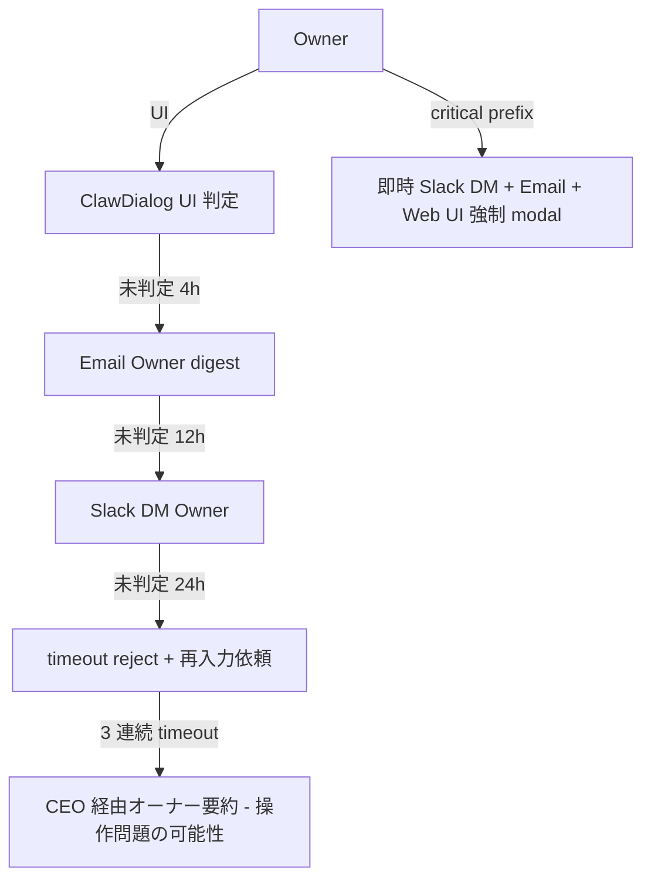
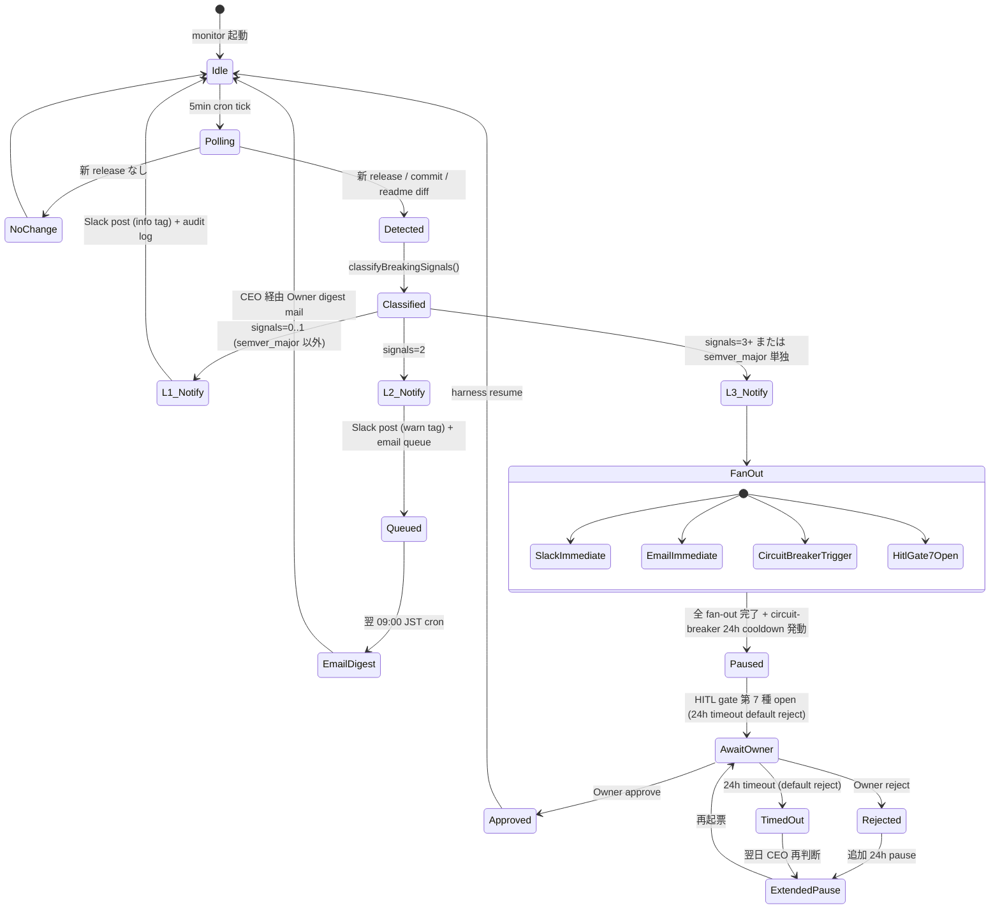
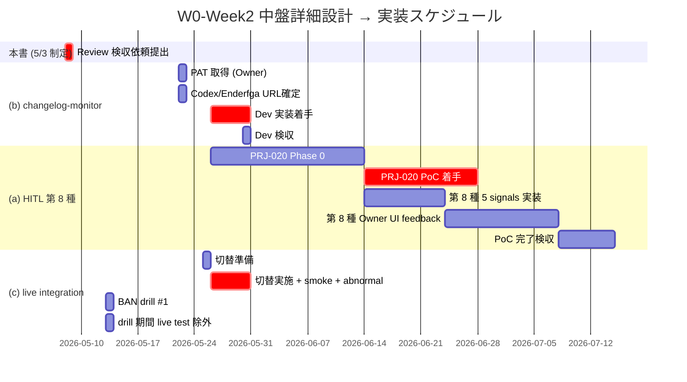

# Dev W0-Week2 中盤 詳細設計書 — HITL 第 8 種 Review 検収準備 + changelog-monitor 詳細設計 + live integration test 切替設計

| 項目 | 値 |
|---|---|
| 文書 ID | DEV-PRJ-019-W0W2-MID-DD-2026-05-03 |
| 文書種別 | Dev 部門 詳細設計書 (W0-Week2 中盤、5/4-5/7 期間 先回り準備) |
| 制定日 | 2026-05-03 |
| 制定担当 | 開発 (Dev) — claude-code-company / `/dev` |
| 対象案件 | PRJ-019 Clawbridge (自律オーナー OpenClaw 基盤) + PRJ-020 ClawDialog (Owner ↔ OpenClaw 双方向 channel) |
| 関連決裁 ID | DEC-019-018 (HITL 第 6 種 tos_gray_review) / DEC-019-022 (4 系統 changelog 監視 W2 中盤実装) / DEC-019-025 (Agent tool 権限 SOP) / DEC-020-001〜003 (PRJ-020 起案 + Phase 0 + 同居実装) |
| 上位文書 | `dev-hitl-gate-1-8-integrated-sop.md` (1,094 行 統合 SOP) / `research-changelog-monitoring-runbook.md` (4 系統 / 3 段階 / breaking 5 ヒューリスティクス) / `dev-w0-week1-evidence-and-mockclaw.md` (mock-claude 5 シナリオ + TimeSource) |
| 本書の位置付け | 上位 SOP / Runbook で確立済の運用方針を、Review 検収可能な「実装着手前 詳細設計」水準まで落とし込み、5/8 18:00 検収会議に間に合う形で先回り提出する |
| 出力先 | `projects/PRJ-019/reports/dev-w0-week2-mid-detailed-design.md` |
| 副作用ゼロ確認 | 既存 PRJ-001〜018 (PRJ-012 Sumi / PRJ-018 Asagi 含む) のファイル / git history / Vercel deploy / Supabase 行 / OAuth トークンに変更を起こさないこと、設計段階で保証 (§4.7 / §6.6) |

---

## §0. エグゼクティブサマリ (300 字以内)

本書は 5/4-5/7 期間の Dev 部門 先回り準備として、(a) HITL 第 8 種 `owner_input_review` の Review 検収準備 (PRJ-020 専用、6/14 PoC 初稼働、Phase 1 W1 5/19 では非稼働)、(b) `app/harness/src/changelog-monitor.ts` 詳細設計 (DEC-019-022 W2 中盤 5/26 着手 / 5/30 検収)、(c) live integration test 設計 (mock-claude 5 シナリオ → 実 Claude Code CLI 切替手順 + BAN drill #1 5/13 連動 + fallback) の 3 サブタスクを 1 本に統合した詳細設計書。Review 検収項目チェックリスト (15 項目)、TypeScript 関数 signature、Mermaid 状態遷移図、ファイル名・型定義を物理水準で確定。`[OWNER-DECISION-REQUIRED]` 件数 7 件 (§9 集約)。

---

## §1. 本書の構成と前提

### §1.1 章構成

| 章 | 内容 |
|---|---|
| §0 | エグゼクティブサマリ |
| §1 | 本書の構成と前提 |
| §2 | サブタスク (a): HITL 第 8 種 `owner_input_review` 仕様の Review 検収準備 |
| §3 | サブタスク (b): `app/harness/src/changelog-monitor.ts` 詳細設計 |
| §4 | サブタスク (c): live integration test 設計 (mock-claude → 実 Claude Code CLI 切替) |
| §5 | 横断品質ゲート: 副作用ゼロ保証 / Spend Cap / 監査ログ |
| §6 | テスト計画と件数目標 |
| §7 | スケジュールとマイルストーン |
| §8 | Review 検収依頼 (5/8 18:00) |
| §9 | `[OWNER-DECISION-REQUIRED]` 集約 |
| §10 | 関連ドキュメント相互参照 |

### §1.2 前提となる既存決裁・既存成果物

- 既存決裁:
  - DEC-019-018 (HITL 第 6 種 `tos_gray_review` 24h SLA / 4 ボタン Slack UI / FN-Black ≤ 10%)
  - DEC-019-022 (4 系統 changelog 監視 W2 中盤実装 / 3 段階 / 24h pause / HITL `external_api` 第 7 種ゲート)
  - DEC-019-025 (Agent tool 権限 SOP — Read/Write/Edit/Bash/Grep/Glob 全使用可、long レポート物理書込必須)
  - DEC-020-001 (PRJ-020 起案 + 第 8 種 `owner_input_review` 採用)
  - DEC-020-002 (PRJ-020 Phase 0 5/26〜6/13)
  - DEC-020-003 (PRJ-019 と同居実装 — 別 workspace 化せず `app/packages/` 内同居)
- 既存成果物 (本書が依存する):
  - `projects/PRJ-019/reports/dev-hitl-gate-1-8-integrated-sop.md` (1,094 行)
  - `projects/PRJ-019/reports/dev-hitl-gate-6th-7th-operations-sop.md` (442 行)
  - `projects/PRJ-019/reports/research-changelog-monitoring-runbook.md` (324 行)
  - `projects/PRJ-019/reports/dev-w0-week1-evidence-and-mockclaw.md` (mock-claude 5 シナリオ + TimeSource 11 ケース)
  - `projects/PRJ-019/app/harness/src/{cost-tracker,circuit-breaker,usage-monitor,hitl-gate,kill-switch,time-source,index}.ts`
  - `projects/PRJ-019/app/claude-bridge/src/{spawn,auth-detector,stream-json-parser}.ts`
  - `projects/PRJ-019/app/tests/integration/mock-claude/bin/mock-claude.mjs`

### §1.3 検収プロセス (5/8 18:00 の位置付け)

- 5/8 18:00 検収会議: W0-Week1 必須コントロール 7 項目 (G-01/04/05/06/08/V2-03/V2-11) のエビデンス提出 + Review 質問 12 件決着
- 本書 (5/3 制定) の位置付け: W0-Week1 検収後の **W0-Week2 (5/9-5/15) Dev 着手準備** + その先 (W2 中盤 5/26-5/30、PRJ-020 PoC 6/14) の **詳細設計の先出し**
- 5/8 検収会議では W0-Week1 必須項目を優先、本書は付帯資料として参照可能化、本書自体の正式 Review 検収は 5/15 W0-Week2 終端 or 別途設定 (§8.1)

---

## §2. サブタスク (a): HITL 第 8 種 `owner_input_review` (PRJ-020 専用) 仕様の Review 検収準備

### §2.1 第 8 種の前提整理 (Review 向け要約)

- **稼働開始**: PRJ-020 Phase 1 PoC 6/14 (W6 着手)、完了検収 7/8〜7/14 (W10)
- **PRJ-019 Phase 1 W1 (5/19) では稼働しない**: PRJ-019 第 6/7 種は別ライフサイクル
- **Owner 経路**: ClawDialog Web UI → 自然言語入力 → LLM intent parser → 5 signals → confidence → recommendation → (manual 時のみ) HITL gate 第 8 種起票
- **Slack DM**: 第 8 種は ClawDialog Web UI 経由が判定主、Slack は補助通知 (urgency=urgent / critical 時のみ)
- **Schema**: 既存 `hitl_gate_events.gate_type` enum を 7 → 8 種に拡張、新表 `owner_input_submissions` / `claw_decisions` 追加

### §2.2 入力フォーマット (Owner 自然言語入力 → 構造化 JSON schema)

#### §2.2.1 ClawDialog Web UI 入力 raw 形式

ClawDialog Web UI は単一 textarea + (任意) 添付メタ で raw_input を受け取る。raw_input は最大 8,000 文字、必須項目なし (Owner が自由記述)。

```typescript
// app/packages/clawdialog/src/types/owner-input.ts

export interface OwnerInputRaw {
  raw_text: string;                    // Owner 自然言語入力本文 (最大 8,000 文字)
  attachments?: Array<{                // 任意添付 (画像 / ファイル / URL リンク)
    kind: 'url' | 'image' | 'file';
    value: string;                     // URL or base64 data URI or file path
    label?: string;
  }>;
  metadata: {
    submitted_at: string;              // ISO 8601
    owner_id: string;                  // UUID (Supabase auth.uid())
    session_id: string;                // ClawDialog session UUID
    client_ip_hash: string;            // SHA-256 hash (生 IP は保存しない)
    user_agent_hash: string;           // SHA-256 hash
    explicit_urgency_prefix?: 'critical' | 'urgent' | null;  // [critical] / [urgent] prefix の自動検出
  };
}
```

#### §2.2.2 LLM 解析後の構造化 JSON schema (parsed_intent)

LLM (Claude Sonnet 4.5 推奨、Phase 1 PoC は Claude Haiku 3.5 で代替可) が raw_text を以下の schema に変換する。

```typescript
// app/packages/clawdialog/src/types/parsed-intent.ts

export interface ParsedIntent {
  // 1. 意図カテゴリ (上位 8 区分)
  intent_category:
    | 'create_project'        // 新規案件起案
    | 'update_existing_prj'   // 既存案件への指示変更
    | 'request_status'        // 状況確認 / レポート要求
    | 'approve_decision'      // HITL gate 判定 (第 1〜7 種への直接判定)
    | 'reject_decision'
    | 'modify_priority'       // 優先順位変更
    | 'meta_command'          // /ceo /pm /dev 等の slash 風 meta 指示
    | 'unclassified';         // 分類不能

  // 2. ターゲット参照
  target_refs: {
    prj_ids: string[];           // 例: ['PRJ-019', 'PRJ-020'] - 既存案件参照
    decision_ids: string[];      // 例: ['DEC-019-022']
    file_paths: string[];        // 例: ['app/harness/src/changelog-monitor.ts']
    role_refs: string[];         // 例: ['/dev', '/research']
  };

  // 3. アクション動詞
  action_verbs: Array<{
    verb: string;                // 例: '実装する' / '中止する' / '延期する'
    object: string;              // 例: 'changelog-monitor' / 'PRJ-020 PoC'
    polarity: 'positive' | 'negative' | 'conditional';
  }>;

  // 4. 期限・量・予算情報
  constraints: {
    deadline?: string;           // ISO 8601 または相対表現 ('来週金曜')
    budget_usd?: number;
    time_estimate_hours?: number;
    quality_level?: 'draft' | 'normal' | 'production';
  };

  // 5. 矛盾・曖昧度
  ambiguity_flags: {
    has_conflicting_targets: boolean;     // 複数 PRJ-ID が相互矛盾
    has_undefined_pronouns: boolean;      // 「あれ」「これ」等の未解決指示語
    has_temporal_ambiguity: boolean;      // 「いつもの」「今度の」等
    missing_subject: boolean;             // 主語省略 (実行主体不明)
  };

  // 6. 参考翻訳 (Owner 確認用、非 LLM 一次出力)
  canonical_paraphrase: string;           // 「Dev に PRJ-020 PoC を 6/14 に着手させる」風の標準形
}
```

#### §2.2.3 5 軸採否判定 (LLM prompt 雛形)

LLM (intent parser) は parsed_intent を生成した後、以下 5 軸の採否判定を別 prompt で実行する。出力は 0.0〜1.0 の小数値 5 個 (signals) + 加重和の confidence。

```typescript
// app/packages/clawdialog/src/llm/judgement-prompt.ts

/**
 * LLM 判定 prompt 雛形 (system + user)
 * Phase 1 PoC: Anthropic Claude Haiku 3.5 (低コスト、最大 200 入力 / 月)
 * Phase 2: Claude Sonnet 4.5 (精度向上時)
 */
export const JUDGEMENT_SYSTEM_PROMPT = `
You are the ClawDialog adjudication assistant for the claude-code-company AI organisation.
Your job is to evaluate Owner natural language inputs against 5 axes,
and return a structured JSON object with 0.0-1.0 scores per axis.

# 5 Axes

1. **feasibility** (実現可能性): Can this be executed within current technical / staffing / time constraints?
   - 1.0 = clearly feasible with existing resources
   - 0.0 = impossible (e.g., requires technology that doesn't exist, contradicts physical laws)

2. **prj_overlap** (既存 PRJ 重複度): Does this duplicate or conflict with active PRJ-001..PRJ-018, COMPANY-WEBSITE, PRJ-019, PRJ-020?
   - 1.0 = no overlap, novel
   - 0.0 = total duplicate / direct conflict with active PRJ

3. **stack_alignment** (技術スタック整合): Does this align with the standard stack (Next.js / Expo / Supabase / Vercel / shadcn-ui / Tailwind / Heroicons / Ionicons / Vitest / Jest)?
   - 1.0 = fully aligned with standard stack
   - 0.0 = requires switching to non-standard stack (e.g., Ruby on Rails, Django, AWS Lambda)

4. **budget_impact** (月次予算影響): Estimated monthly USD delta against current $300 hard cap (DEC-019-013) and 4-tier hard cap.
   - 1.0 = $0 or negative (saves cost)
   - 0.0 = exceeds 50% of monthly hard cap in a single submission

5. **tos_risk** (ToS リスク): Likelihood of violating Anthropic / OpenAI / GitHub / Vercel / Supabase / Slack ToS or acceptable use policies.
   - 1.0 = zero risk (read-only, fully sanctioned uses)
   - 0.0 = clear violation (e.g., requests automation explicitly forbidden by ToS)

# Output schema (strict JSON only)

{
  "axes": {
    "feasibility": <0.0..1.0>,
    "prj_overlap": <0.0..1.0>,
    "stack_alignment": <0.0..1.0>,
    "budget_impact": <0.0..1.0>,
    "tos_risk": <0.0..1.0>
  },
  "rationale": {
    "feasibility": "<short reason, ≤ 200 chars>",
    "prj_overlap": "<short reason>",
    "stack_alignment": "<short reason>",
    "budget_impact": "<short reason>",
    "tos_risk": "<short reason>"
  },
  "evidence_refs": [
    {"kind": "prj_id", "value": "PRJ-019"},
    {"kind": "decision_id", "value": "DEC-019-013"},
    {"kind": "rule_file", "value": "organization/rules/tech-stack.md"}
  ]
}
`;

export const JUDGEMENT_USER_PROMPT_TEMPLATE = (raw: string, parsed: ParsedIntent) => `
# Owner raw input

${raw}

# Pre-parsed intent (for reference, do NOT trust blindly)

\`\`\`json
${JSON.stringify(parsed, null, 2)}
\`\`\`

# Active PRJ context (read-only)

- PRJ-019 Clawbridge: Phase 1 W1 着手 5/19、Phase 1 完了 6/13
- PRJ-020 ClawDialog: Phase 0 5/26〜6/13、Phase 1 PoC 6/14〜7/14
- PRJ-001〜018: 各案件の Phase は dashboard/active-projects.md 参照
- 月次予算 hard cap: $300 (DEC-019-013)
- 標準スタック: organization/rules/tech-stack.md

Evaluate the Owner input against the 5 axes and return strict JSON.
`;
```

#### §2.2.4 5 axes → confidence 換算式

§2.3 に統合 (5 signals と 5 axes は別物のため両立)。本サブタスクでは **「上位 SOP §4.5.2 の 5 signals (情報密度等)」と、本書 §2.2.3 の「5 axes (実現可能性等)」の両方を採用** する。

| 概念 | 用途 | 計算主体 |
|---|---|---|
| 5 signals (info_density / contradiction_score / urgency_score / domain_specificity / actionability) | raw 入力テキストの **形式評価** (heuristic) | Heuristic 関数 (LLM 不要、決定論的) |
| 5 axes (feasibility / prj_overlap / stack_alignment / budget_impact / tos_risk) | 解析後 intent の **内容評価** (semantic) | LLM 1 回呼出 (Phase 1 PoC は Claude Haiku 3.5) |

confidence 統合計算:

```
confidence_form    = 0.25 * info_density
                   + 0.25 * (1 - contradiction_score)
                   + 0.10 * urgency_score
                   + 0.20 * domain_specificity
                   + 0.20 * actionability

confidence_content = 0.25 * feasibility
                   + 0.20 * prj_overlap
                   + 0.20 * stack_alignment
                   + 0.20 * budget_impact
                   + 0.15 * tos_risk

confidence_final   = 0.40 * confidence_form
                   + 0.60 * confidence_content
```

content 比重を高くするのは、形式が整っていても内容が ToS 違反 / 予算超過 / 既存重複なら manual / reject に落とすため。

### §2.3 timeout 24h default reject ルール

| 区分 | urgency | SLA | timeout 時挙動 |
|---|---|---|---|
| 通常 | normal (urgency_score < 0.7、explicit_urgency_prefix なし) | 24h | `claw_decisions.decision = 'timeout'` 自動 insert + Owner UI に「期限切れ、再入力をお願いします」表示 + Owner email digest (翌 09:00 JST) |
| 緊急 | urgent (urgency_score ≥ 0.7 または `[urgent]` prefix) | 4h | timeout 自動 reject + Owner Slack DM 緊急通知 + email 即時 |
| 超緊急 | critical (`[critical]` prefix のみ) | 1h | 即時 Owner Slack DM + Email + Web UI 強制 modal、Phase 2 まで Owner 明示が必要 |

timeout 自動 reject は Vercel Cron / 常駐 node プロセスで `sla_deadline < NOW() AND decision IS NULL OR decision = 'pending'` を 5 分間隔で検出する (§3.4 と同居 cron)。

### §2.4 escalation 経路

第 8 種は ClawDialog UI 経由判定が原則。ただし以下の escalation 経路を用意:



**3 連続 timeout** は CEO が Owner 要約レポートにて「ClawDialog UI 操作上の障害が疑われる」旨を提示。これは PRJ-020 K-1 リリース判定 (UI 操作性) の重要 KPI。

### §2.5 監査ログ要件 (第 8 種固有)

上位 SOP §5 (7 年保管 / hash chain / RLS 4 ロール) に準じる。第 8 種固有要件:

| 項目 | 要件 |
|---|---|
| `owner_input_submissions.raw_input` | 平文保管 (PII 含むため Phase 2 で encrypted_at_rest 化検討) |
| `owner_input_submissions.signals` | 5 signals (form) + 5 axes (content) を JSONB で結合保管 |
| `claw_decisions.feedback_to_signals` | Owner が「この signal 計算がおかしい」と feedback した内容を JSONB 保管、Phase 2 で ML 再学習用 ground truth |
| `claw_decisions.decision_latency_seconds` | 起票〜判定までの秒数。P50 / P95 / P99 を月次 metric dashboard に表示 |
| 添付物 | `attachments` の URL / 画像 / ファイルは Vercel Blob に SHA-256 で保管、`owner_input_submissions.attachments_blob_keys` (JSONB array) で参照 |

### §2.6 Review 検収項目チェックリスト (15 項目)

| # | カテゴリ | チェック項目 | 検証方法 | 検収判定者 |
|---|---|---|---|---|
| C-08-01 | 入力 schema | `OwnerInputRaw` interface が `raw_text` 最大 8,000 文字制限を持つ | TypeScript 型 + 入力バリデーション zod schema | Review |
| C-08-02 | 入力 schema | `metadata.client_ip_hash` / `user_agent_hash` が SHA-256 化され、生 IP/UA を保管しない | 単体テスト + DB 行検査 | Review (G-V2-11 と同型) |
| C-08-03 | parsed_intent | 8 区分 `intent_category` が enum 化され、`unclassified` フォールバックが動作する | 30 件 mock owner input でカバー率測定 | Review |
| C-08-04 | parsed_intent | `target_refs` の PRJ-ID / DEC-ID / file path が形式チェックを通過する (regex) | 単体テスト 5 ケース | Review |
| C-08-05 | 5 signals | heuristic 関数 (info_density 等) が決定論的 (LLM 非依存) で計算可能 | TimeSource 同様の純関数テスト | Review |
| C-08-06 | 5 axes | LLM 採否判定 prompt が strict JSON 出力 (parsing 失敗時 fallback) | mock LLM レスポンスでの parsing 失敗ケース 3 種 | Review |
| C-08-07 | confidence 計算 | `confidence_final = 0.4 * form + 0.6 * content` の重み付けが文書化され、コードと一致 | コード検査 + 計算式テスト | Review |
| C-08-08 | 閾値 | pass ≥ 0.85 / reject ≤ 0.40 / 中間 manual の 3 区分が明確 | 境界テスト (0.40 / 0.85 / 0.85+ε / 0.40-ε) | Review |
| C-08-09 | SLA | normal 24h / urgent 4h / critical 1h の 3 区分 timeout が cron で動作 | FakeTimeSource を使った決定論テスト | Review |
| C-08-10 | timeout 挙動 | timeout 時 `claw_decisions.decision = 'timeout'` 自動 insert + Owner UI 再入力誘導表示 | e2e Playwright ケース | Review |
| C-08-11 | escalation | 3 連続 timeout で CEO Owner 要約 trigger が動作 | metric dashboard SQL 検証 | Review |
| C-08-12 | RLS | `owner_input_submissions` が owner self only (read/write)、dev/review/pm は read only | RLS policy 単体テスト | Review |
| C-08-13 | 監査保管 | 7 年保管 partition (Phase 2) の準備として `created_at` index が存在 | DB スキーマ検査 | Review |
| C-08-14 | hash chain | `hitl_gate_events` の prev_hash / row_hash が trigger で自動計算され、改ざん検出 SQL が動作 | SQL テスト (上位 SOP §5.4) | Review |
| C-08-15 | PRJ-019 副作用ゼロ | 第 8 種実装が PRJ-019 Phase 1 W1 (5/19) 稼働中の harness / cost-tracker / circuit-breaker / hitl-gate (第 1〜5 種) に副作用を起こさない | 既存 83 ケース回帰テスト全緑 | Review (Q1 として §8 に明記) |

### §2.7 PRJ-020 PoC (6/14) 初稼働の前提条件 (Review への明示)

- PRJ-019 Phase 1 W1 (5/19) では第 8 種 schema migration を **適用しない** (DEC-020-002 Phase 0 5/26 着手のため)
- PRJ-020 Phase 0 (5/26〜6/13) で `hitl_gate_events.gate_type` enum 拡張 + 新表 `owner_input_submissions` / `claw_decisions` を staging Supabase に migration 適用、production には 6/14 直前に適用
- PRJ-019 Phase 1 W1 で稼働する第 1〜5 種は enum を 5 → 7 種に拡張済 (DEC-019-018 / DEC-019-022)、第 8 種拡張は staging 限定で先行
- production migration 6/14 直前は **必ず Phase 1 W1〜W4 完了後** に実施、PRJ-019 と PRJ-020 の同居実装 (DEC-020-003) を維持

### §2.8 [OWNER-DECISION-REQUIRED] for §2

- **[OWNER-DECISION-REQUIRED-01]** Phase 1 PoC の LLM 判定モデルを Claude Haiku 3.5 (低コスト) と Claude Sonnet 4.5 (高精度) のどちらにするか。Haiku なら $0.25 / $1.25 per MTok (input/output)、Sonnet 4.5 なら $3 / $15 per MTok。30 件 / 月の owner input 想定なら Haiku 月 $0.5 程度、Sonnet 4.5 でも月 $5 以下。**推奨**: Phase 1 PoC は Haiku 3.5、Phase 2 で精度評価後に Sonnet 4.5 への切替判定。
- **[OWNER-DECISION-REQUIRED-02]** raw_input の最大文字数を 8,000 文字とするか。Anthropic Claude は 200K context window だが、Phase 1 PoC は LLM cost 抑制のため 8,000 文字 (約 2K tokens) を上限とする提案。8,000 を超える場合は Owner UI 側で「分割送信してください」を表示。
- **[OWNER-DECISION-REQUIRED-03]** `[critical]` prefix の運用ルール。Owner が UI で明示入力するか、Web UI に dropdown ボタンを設けるか。**推奨**: dropdown (誤爆防止)。

---

## §3. サブタスク (b): `app/harness/src/changelog-monitor.ts` 詳細設計書

### §3.1 設計目的と前提

- **DEC-019-022** で W2 中盤 (5/26 着手 / 5/30 検収) の実装が決定済
- **DEC-019-022** で 4 系統 (Anthropic Claude Code CLI / OpenAI Codex CLI / OpenClaw OSS / Enderfga plugin) の changelog 監視運用 + 3 段階通知 + 24h pause + HITL `external_api` 第 7 種 が確定済
- 本書ではこれらの上位決裁を、実装着手前に Review 検収可能な **詳細設計** (関数 signature / 型定義 / ファイル名 / 状態遷移図) 水準に落とし込む

### §3.2 4 系統 GitHub repo 特定 + monitoring source 確定

| # | 系統 | GitHub repo | npm / package | atom feed URL | GraphQL query |
|---|---|---|---|---|---|
| 1 | Anthropic Claude Code CLI | `github.com/anthropics/claude-code` | `@anthropic-ai/claude-code` | `https://github.com/anthropics/claude-code/releases.atom` | `repository(owner:"anthropics", name:"claude-code") { releases(first: 10) { nodes { tagName, name, description, isPrerelease, createdAt, url } } }` |
| 2 | OpenAI Codex CLI | `github.com/openai/codex` (Phase 1 W1 5/22 までに Research 部門最終確認、本書では暫定 placeholder) | `@openai/codex` (placeholder) | `https://github.com/openai/codex/releases.atom` | 同上 |
| 3 | OpenClaw OSS | `github.com/clawbro-ai/openclaw` | (npm 公開なし、git clone 運用) | `https://github.com/clawbro-ai/openclaw/releases.atom` | 同上 |
| 4 | Enderfga plugin | (Phase 1 W1 5/22 までに Research 確定、本書では暫定 placeholder) | (placeholder) | `https://github.com/<placeholder>/releases.atom` | 同上 |

#### §3.2.1 atom feed と GraphQL の併用方針

- **atom feed (5 分間隔)**: 速報チャネル、認証不要、anonymous 60 req/h 余裕 (4 系統 × 12 = 48 req/h)
- **GraphQL (30 分間隔)**: メタ取得、PAT で 5,000 req/h 余裕、release のみで取り逃した commits / PRs / README diff まで取得
- **npm registry (30 分間隔、① のみ)**: `dist-tags.latest` を 30 分ごとに取得、補助シグナル

### §3.3 breaking 判定 5 ヒューリスティクス 実装擬似コード

```typescript
// app/packages/harness/src/changelog-classifier.ts

import type { ReleaseInfo, CommitInfo, ReadmeDiff, PackageJsonDiff } from './types/changelog';

export type BreakingSignal =
  | 'semver_major'
  | 'breaking_keyword'
  | 'conventional_commits_breaking'
  | 'readme_tos_change'
  | 'peer_dep_major';

export type ChangelogLevel = 'L1' | 'L2' | 'L3';

export interface ClassifyResult {
  level: ChangelogLevel;
  signals: BreakingSignal[];
  signal_evidence: Record<BreakingSignal, string>;  // 検出根拠 (regex match / version pair etc.)
  rationale: string;                                  // 100 字以内の判定理由
}

const SEMVER_MAJOR_REGEX = /^(\d+)\.\d+\.\d+/;
const BREAKING_KEYWORD_REGEX = /\b(BREAKING|removed|deprecated|rename(d|s)?)\b/i;
const CC_BREAKING_REGEX = /^(feat|fix|chore|refactor)!:|BREAKING CHANGE:/m;
const TOS_REGEX = /\b(ToS|Terms of Service|license|policy|acceptable use|usage policy)\b/i;

/**
 * 5 ヒューリスティクスを評価し、シグナル数で L1/L2/L3 を判定する純関数。
 * - シグナル 0: L1
 * - シグナル 1 (semver_major のみは L3 例外、それ以外は L1)
 * - シグナル 2: L2
 * - シグナル 3+: L3
 *
 * 副作用なし、決定論的、TimeSource 不要 (DEC-019-022 のシグナル定義に準拠)
 */
export function classifyBreakingSignals(input: {
  oldVersion: string;
  newVersion: string;
  changelogBody: string;
  recentCommits: CommitInfo[];          // 過去 30d (max 100 件)
  readmeDiff: ReadmeDiff;
  packageJsonDiff: PackageJsonDiff;
}): ClassifyResult {
  const signals: BreakingSignal[] = [];
  const evidence: Partial<Record<BreakingSignal, string>> = {};

  // 1. semver major bump
  const oldMajor = parseInt(input.oldVersion.match(SEMVER_MAJOR_REGEX)?.[1] ?? '0', 10);
  const newMajor = parseInt(input.newVersion.match(SEMVER_MAJOR_REGEX)?.[1] ?? '0', 10);
  if (newMajor > oldMajor) {
    signals.push('semver_major');
    evidence.semver_major = `${input.oldVersion} -> ${input.newVersion}`;
  }

  // 2. BREAKING / removed / deprecated / rename keyword in changelog body
  const m2 = input.changelogBody.match(BREAKING_KEYWORD_REGEX);
  if (m2) {
    signals.push('breaking_keyword');
    evidence.breaking_keyword = m2[0];
  }

  // 3. Conventional Commits feat!: / BREAKING CHANGE: in last 30d
  const ccHit = input.recentCommits.find((c) => CC_BREAKING_REGEX.test(c.message));
  if (ccHit) {
    signals.push('conventional_commits_breaking');
    evidence.conventional_commits_breaking = `${ccHit.sha.slice(0, 7)} ${ccHit.message.split('\n')[0]}`;
  }

  // 4. README ToS / license / policy 変更
  const m4 = input.readmeDiff.added.match(TOS_REGEX) || input.readmeDiff.removed.match(TOS_REGEX);
  if (m4) {
    signals.push('readme_tos_change');
    evidence.readme_tos_change = m4[0];
  }

  // 5. peer dependency major bump
  for (const dep of input.packageJsonDiff.peerDependencies) {
    if (semverMajorBumped(dep.oldVersion, dep.newVersion)) {
      signals.push('peer_dep_major');
      evidence.peer_dep_major = `${dep.name}: ${dep.oldVersion} -> ${dep.newVersion}`;
      break;
    }
  }

  // レベル判定 (3+ で L3、2 で L2、1 で L1 (semver_major 単独は L3 例外))
  let level: ChangelogLevel;
  if (signals.length >= 3) level = 'L3';
  else if (signals.length === 2) level = 'L2';
  else if (signals.length === 1) {
    level = signals[0] === 'semver_major' ? 'L3' : 'L1';
  } else level = 'L1';

  return {
    level,
    signals,
    signal_evidence: evidence as Record<BreakingSignal, string>,
    rationale: composeRationale(signals, level),
  };
}

function semverMajorBumped(oldV: string, newV: string): boolean {
  const a = parseInt(oldV.replace(/^[\^~]/, '').match(SEMVER_MAJOR_REGEX)?.[1] ?? '0', 10);
  const b = parseInt(newV.replace(/^[\^~]/, '').match(SEMVER_MAJOR_REGEX)?.[1] ?? '0', 10);
  return b > a;
}

function composeRationale(signals: BreakingSignal[], level: ChangelogLevel): string {
  if (signals.length === 0) return 'No breaking signals detected; routine release.';
  return `Detected ${signals.length} signal(s): ${signals.join(', ')}. Classified as ${level}.`;
}
```

### §3.4 3 段階通知 状態遷移図 (Mermaid)



### §3.5 配置: ファイル名 / 関数 signature / 型定義

#### §3.5.1 ファイル一覧 (5 + テスト 6 ケース)

| # | ファイル | 役割 | LOC 目安 |
|---|---|---|---|
| 1 | `app/packages/harness/src/changelog-monitor.ts` | メインエントリ、cron tick で 4 系統 polling、result を classifier → notifier に渡す | 220 |
| 2 | `app/packages/harness/src/changelog-source.ts` | 4 系統別 adapter (atom feed / GraphQL / npm registry)、interface 統一 | 280 |
| 3 | `app/packages/harness/src/changelog-classifier.ts` | breaking 5 ヒューリスティクス、§3.3 の擬似コード実装 | 180 |
| 4 | `app/packages/harness/src/changelog-notifier.ts` | Slack Webhook / Resend email / circuit-breaker trigger / HITL gate 第 7 種 起票 | 240 |
| 5 | `app/packages/harness/src/changelog-state.ts` | 直近通知済 release の state 永続化 (SQLite or JSON file)、重複抑制 | 130 |
| 6 | `app/packages/harness/src/types/changelog.ts` | 共通型 (ReleaseInfo / CommitInfo / ReadmeDiff / PackageJsonDiff / ClassifyResult) | 90 |
| 7 | `app/packages/harness/src/__tests__/changelog-monitor.test.ts` | 6 ケース (4 系統 × 3 レベル mock + fan-out 検証) | 320 |
| 8 | `app/packages/harness/src/__tests__/changelog-classifier.test.ts` | 5 シグナル × 正/誤検知 + L1/L2/L3 境界 = 16 ケース | 280 |
| 9 | `app/packages/harness/src/__tests__/changelog-source.test.ts` | 4 系統 adapter mock fetch 8 ケース | 220 |
| 10 | `app/packages/harness/src/__tests__/changelog-notifier.test.ts` | L1/L2/L3 通知 fan-out 6 ケース | 240 |
| 11 | `app/packages/harness/src/__tests__/changelog-state.test.ts` | dedup / persistence / state migration 5 ケース | 180 |

合計新規 11 ファイル、約 2,400 LOC、41 テストケース。

#### §3.5.2 主要関数 signature

```typescript
// app/packages/harness/src/changelog-monitor.ts

import type { TimeSource } from './time-source';
import type { ChangelogSource, ReleaseInfo } from './types/changelog';
import { classifyBreakingSignals, type ClassifyResult } from './changelog-classifier';
import { ChangelogNotifier } from './changelog-notifier';
import { ChangelogState } from './changelog-state';

export interface ChangelogMonitorConfig {
  sources: ChangelogSource[];           // 4 系統 adapter
  notifier: ChangelogNotifier;
  state: ChangelogState;
  timeSource?: TimeSource;              // FakeTimeSource for test
  pollIntervalMs?: number;              // default 5 * 60 * 1000
  detailIntervalMs?: number;            // default 30 * 60 * 1000
}

export class ChangelogMonitor {
  constructor(private readonly config: ChangelogMonitorConfig);

  /** 1 tick の polling (cron / setInterval から呼ばれる) */
  async tick(): Promise<TickResult>;

  /** 常駐モード起動 (内部 setInterval) */
  start(): void;
  stop(): void;
}

export interface TickResult {
  tickAt: string;                       // ISO 8601
  releasesDetected: number;
  l1Count: number;
  l2Count: number;
  l3Count: number;
  errors: Array<{ source: string; error: string }>;
}
```

```typescript
// app/packages/harness/src/changelog-source.ts

export interface ChangelogSource {
  readonly id: 'anthropic_cli' | 'openai_codex_cli' | 'openclaw_upstream' | 'enderfga_plugin';
  fetchLatestRelease(): Promise<ReleaseInfo | null>;
  fetchRecentCommits(sinceISO: string): Promise<CommitInfo[]>;
  fetchReadmeDiff(prevSha: string, currSha: string): Promise<ReadmeDiff>;
  fetchPackageJsonDiff(prevTag: string, currTag: string): Promise<PackageJsonDiff>;
}

export class GitHubAtomSource implements ChangelogSource { /* atom feed 実装 */ }
export class GitHubGraphQLSource implements ChangelogSource { /* GraphQL 実装 (PAT 必須) */ }
export class NpmRegistrySource implements ChangelogSource { /* npm dist-tags only */ }
```

```typescript
// app/packages/harness/src/changelog-notifier.ts

import type { ClassifyResult, ReleaseInfo } from './types/changelog';
import type { CircuitBreaker } from './circuit-breaker';
import type { dispatchHitlGate } from './hitl-gate-dispatcher';

export interface ChangelogNotifierConfig {
  slackWebhookUrl: string;              // Doppler 経由
  resendApiKey: string;                 // Doppler 経由
  ceoEmail: string;                     // 'ai-lab@improver.jp'
  circuitBreaker: CircuitBreaker;
  dispatchHitl: typeof dispatchHitlGate;
}

export class ChangelogNotifier {
  constructor(private readonly config: ChangelogNotifierConfig);

  async notify(release: ReleaseInfo, classification: ClassifyResult): Promise<void> {
    if (classification.level === 'L1') return this.notifyL1(release, classification);
    if (classification.level === 'L2') return this.notifyL2(release, classification);
    return this.notifyL3(release, classification);  // 4 fan-out
  }

  private async notifyL1(r: ReleaseInfo, c: ClassifyResult): Promise<void>;
  private async notifyL2(r: ReleaseInfo, c: ClassifyResult): Promise<void>;
  private async notifyL3(r: ReleaseInfo, c: ClassifyResult): Promise<void>;
}
```

### §3.6 HITL 第 7 種 `external_api` 連携点

DEC-019-022 で第 7 種 `changelog_external_api` が確定済。本書では既存第 5 種 `external_api` との **re-purpose 連携点** を以下に明示する:

| 比較軸 | 第 5 種 `external_api` | 第 7 種 `changelog_external_api` |
|---|---|---|
| トリガー | 新規 API endpoint 検出 (registry diff) | 4 系統 changelog L3 (breaking 3+ signals) |
| SLA | 24h | 24h (urgent 4h) |
| Owner 判断主 | Web UI / Slack DM | Slack 4 ボタン (継続 OK / fork mirror / Phase 後ろ倒し / 詳細を見る) |
| timeout 挙動 | default reject | default reject + 自動 24h pause 延長 |
| payload 型 | `ExternalApiPayload` (`endpoint_url` / `http_method` / `first_use` / `schema_hash`) | `ChangelogExternalApiPayload` (`source` / `old_version` / `new_version` / `signals_hit` / `diff_url`) |
| 共通基盤 | `dispatchHitlGate<T>` / `hitl_gate_events` 表 / RLS / hash chain (上位 SOP §3 / §5 と同一) |

re-purpose と言いつつ別 enum 値で運用する理由: payload 型が異なる + 通知 UI が異なる + dedup_key 計算が異なる (第 5 種は `endpoint_url + schema_hash`、第 7 種は `source + new_version`)。

#### §3.6.1 第 7 種 起票コード

```typescript
// app/packages/harness/src/changelog-notifier.ts (抜粋)

private async notifyL3(release: ReleaseInfo, c: ClassifyResult): Promise<void> {
  // 1. Slack #clawbridge-changelog 即時投稿
  await this.postSlack(release, c, 'L3');

  // 2. Resend で CEO 即時メール
  await this.sendCeoEmail(release, c, 'critical');

  // 3. circuit-breaker trigger (24h cooldown)
  this.config.circuitBreaker.tripBreaker(`changelog_l3_${release.source}_${release.tag}`, 24 * 3600 * 1000);

  // 4. HITL gate 第 7 種 起票
  await this.config.dispatchHitl<ChangelogExternalApiPayload>({
    gate_type: 'changelog_external_api',
    payload: {
      source: release.source,
      old_version: release.previousTag,
      new_version: release.tag,
      signals_hit: c.signals,
      diff_url: release.compareUrl,
    },
    urgency: 'urgent',                                       // 4h SLA
    source_module: 'harness.changelog-monitor',
    created_by: 'system',
    dedup_key: `changelog-${release.source}-${release.tag}`,  // 同一 release 重複起票防止
  });

  // 5. audit log (hitl_gate_events 自動 + 自前 monitoring metric も書込)
  await this.writeMonitoringMetric({
    metric: 'changelog.l3_count',
    source: release.source,
    timestamp: new Date().toISOString(),
  });
}
```

### §3.7 PAT (GitHub Personal Access Token) 管理

| 項目 | 設計 |
|---|---|
| scope | `secrets:read public_repo` (最小権限、Research Runbook §2.3 と整合) |
| 保管 | **Doppler** (DEC-019-012 で確定済 secret manager) |
| 注入 | harness の env allow-list 経由のみ、`process.env.GITHUB_PAT` を直接読まない |
| TCC 隔離 | OAuth トークンと同じ TCC 隔離原則 (G-V2-11) を適用、`auth-detector` で credentials.json 系の偽装書込を検出 |
| 漏洩時 | Doppler 即 rotate → GitHub PAT settings で revoke → C-A-02 退避手順書に追記 → CEO 経由 Owner 通知 |
| rotation 周期 | 90 日 (Phase 1 W4 終端で初回 rotation drill) |
| Phase 1 期間 PAT 取得 | オーナータスク (5/22 まで)、Research Runbook §4.5 で W2-O-PAT として登録済 |

### §3.8 cron 配置 (Vercel Cron vs 常駐 node プロセス)

Research Runbook §4.4 の議論を踏襲:

| 案 | 採否判定 |
|---|---|
| (a) Vercel Cron Hobby `*/5 * * * *` (288 invocations/日) | **不採用** - Hobby 上限 100 起動/日に抵触 |
| (b) Vercel Cron 10 分間隔 (144 invocations/日) | **不採用** - まだ抵触、検知遅延 |
| (c) **常駐 node プロセス (内部 setInterval、オーナー本人 PC、Sumi/Asagi と同居枠)** | **第 1 候補** |
| (d) Pro 昇格 ($20/月) で Cron 緩和 | DEC-019-017 (W3 中盤) と連動して保留 |

#### §3.8.1 常駐プロセスの起動方法

```bash
# Owner PC (Windows 11) 起動時に自動起動
# Sumi (PRJ-012) / Asagi (PRJ-018) と同じく nssm or PowerShell scheduled task で常駐

# 起動コマンド
node app/packages/harness/dist/changelog-monitor-runner.js \
  --config ./harness.config.json \
  --pid-file ~/.clawbridge/changelog-monitor.pid \
  --log-file ~/.clawbridge/logs/changelog-monitor.log
```

`changelog-monitor-runner.js` は `ChangelogMonitor.start()` を呼び出し、SIGTERM で graceful shutdown する。Sumi/Asagi と同じ常駐枠で運用 (DEC-019-014 副作用ゼロを維持)。

### §3.9 [OWNER-DECISION-REQUIRED] for §3

- **[OWNER-DECISION-REQUIRED-04]** PAT 取得 5/22 期限を維持できるか。Research 部門 W2-R-CL (Codex CLI / Enderfga plugin URL 確定 5/22 まで) と同期する必要あり。
- **[OWNER-DECISION-REQUIRED-05]** 常駐 node プロセス (オーナー PC) で運用する案を採用するか、Vercel Pro 昇格 ($20/月) を選ぶか。**推奨**: 常駐運用 (DEC-019-017 W3 中盤判断との連動を維持)。

---

## §4. サブタスク (c): live integration test 設計 (mock-claude → 実 Claude Code CLI 切替)

### §4.1 設計目的

W0-Week1 で実装済の **mock-claude 5 シナリオ** (`success` / `auth_failed` / `rate_limit_429` / `silent_revoke` / `slow`) は、実 Claude Code CLI を呼び出すことなく claude-bridge 動作を決定論的に検証できる。Phase 1 W2-W3 (5/26〜) では実機接続を含む **live integration test** へ移行する必要があるため、本書で切替手順を確定する。

### §4.2 切替判定基準 (3 条件 ALL 通過が必須)

| # | 条件 | 検証方法 | 検証担当 | 期限 |
|---|---|---|---|---|
| GO-1 | **実機 OAuth 接続成功** | `claude --version` → `claude /login` (Owner 操作) → `claude -p "echo OK"` で result 取得 → exit 0 | Owner + Dev (検証 script) | W2 開始時 (5/26) |
| GO-2 | **Claude Max weekly cap 余裕** | H-09 weekly 監視 (DEC-019-015) で week 残 capacity > 30% を確認 | Dev (usage-monitor) | W2 着手前 |
| GO-3 | **Sumi-Asagi 干渉ゼロ確認** | PRJ-012 Sumi / PRJ-018 Asagi 並行起動中の OAuth トークン / cost-tracker / circuit-breaker 状態を検査、Clawbridge 起動で副作用ゼロ | Dev + Review (DEC-019-014 副作用ゼロ規約) | W2 着手前 |

3 条件 ALL OK → live test 切替、いずれか 1 つでも NG → mock-claude 継続 (§4.6 fallback)。

### §4.3 切替手順 (Step-by-Step)

#### §4.3.1 切替前準備 (W2 着手 24h 前 = 5/25 17:00)

1. mock-claude 5 シナリオ全緑確認: `pnpm test scenario-smoke.test.ts` 実機 5 ケース PASS
2. claude-bridge `spawn.ts` の `MOCK_CLAUDE_PATH` env 切替 機構を確認: `process.env.MOCK_CLAUDE_PATH` が設定されている時のみ mock-claude を spawn、未設定時は実 `claude` を spawn
3. live test 用 config 作成: `app/tests/integration/live-claude/config/live.json` に **OAuth 接続 + weekly cap 余裕 + 30s timeout** を記載
4. live test 用 env 退避: `~/.clawbridge/STOP` ファイル (kill-switch 即時停止) の動作確認
5. Sumi (PRJ-012) / Asagi (PRJ-018) の outbound API state を `cost-tracker` で snapshot 保存

#### §4.3.2 切替実施 (5/26 09:00 JST)

```bash
# 1. mock-claude env を unset
unset MOCK_CLAUDE_PATH
unset MOCK_CLAUDE_SCENARIO

# 2. live config を有効化
export CLAWBRIDGE_LIVE_TEST=1

# 3. live test 実行 (smoke 5 + 異常系 3 = 8 ケース)
cd projects/PRJ-019/app
pnpm test tests/integration/live-claude/__tests__/

# 4. 結果検証
# - smoke 5 件全緑
# - 異常系 3 件で circuit-breaker が想定通り動作
# - kill-switch (~/.clawbridge/STOP) 投入で 30s 以内全停止
# - cost-tracker で消費 USD が予定 ($1 以下) 内
# - Sumi/Asagi state が変化していない (snapshot 比較)
```

### §4.4 切替後のテストスコープ (smoke 5 件 + 異常系 3 件)

#### §4.4.1 smoke 5 ケース (正常系)

| # | テストケース ID | 内容 | 期待結果 | TimeSource |
|---|---|---|---|---|
| L-S-01 | live-smoke-01-version | `claude --version` で version 文字列取得 | exit 0 + 文字列 = `1.x.x` | RealTimeSource |
| L-S-02 | live-smoke-02-prompt | `claude -p "Reply with single word: OK"` で `OK` 取得 | exit 0 + stream-json result text に `OK` 含有 | RealTimeSource |
| L-S-03 | live-smoke-03-tool-list | `claude /tools` で利用可能 tool list 取得 | exit 0 + JSON parse 成功 + Bash/Read/Write 等 5 件以上 | RealTimeSource |
| L-S-04 | live-smoke-04-allowed-tools | `claude --allowedTools "Read,Bash" -p "..."` で 制限動作 | tool 制限挙動が docs と一致 | RealTimeSource |
| L-S-05 | live-smoke-05-streaming | `claude -p "Long task" --output-format stream-json` で 行ごと output が stream で到達 | 5 秒以内に 3 行以上の stream-json 行 | RealTimeSource |

#### §4.4.2 異常系 3 ケース

| # | テストケース ID | 内容 | 期待結果 | 副作用検証 |
|---|---|---|---|---|
| L-A-01 | live-abnormal-01-quota | Claude Max weekly cap を `usage-monitor` で 95% に偽装 → `claude -p "X"` 呼出 | quota 警告が stderr に出るが exit 0 (実機に依存)、ただし circuit-breaker が L2 警告を発火 | cost-tracker / circuit-breaker / Sumi state |
| L-A-02 | live-abnormal-02-revoke-detect | OAuth token を一時的に invalidate (Owner 手動) → `claude -p "X"` 呼出 | exit 1 + `auth_failed` 検出 + circuit open + kill-switch 発火準備 | auth-detector / circuit-breaker |
| L-A-03 | live-abnormal-03-stop-file | `~/.clawbridge/STOP` を touch → 実行中の `claude -p` プロセス 5 件が 30s 以内全 kill | 30s SLA 全停止 + cost-tracker 消費追加なし | kill-switch / cost-tracker |

### §4.5 BAN drill #1 (5/13) との連動点

#### §4.5.1 drill #1 の概要 (Review BAN drill scenario より)

- 日時: 2026-05-13 (W0-Week2 中盤)
- 想定: Anthropic Console から weekly cap 5% 警告 → 即座に harness pause → kill-switch → fallback 切替の 30s SLA を計測
- drill 用テストデータ: `tests/integration/ban-drill/fixtures/drill-1-quota-warning.json`

#### §4.5.2 live test と drill のすみ分け

| 用途 | drill #1 (5/13) | live integration test (5/26〜) |
|---|---|---|
| 目的 | Owner + 全部署の対応訓練、SLA 計測 | Dev 自動回帰テスト、CI で常時実行 |
| Claude 接続 | 実機 OAuth (drill 期間限定で activate) | 実機 OAuth (W2 以降は常時) |
| テストデータ | `drill-1-*.json` (専用 fixture) | `live-smoke-*` / `live-abnormal-*` (恒常 fixture) |
| 実行頻度 | 1 回限り | CI 毎日 1 回 (cost 配慮) + ad-hoc |
| cost 上限 | drill 専用予算 $5 | smoke + abnormal 合計 $1/run |
| 失敗時挙動 | drill 中断 → 仕切り直し | mock-claude 即時復帰 (§4.6) |
| 結果報告先 | Owner / CEO / Review (drill レポート) | Dev (CI log) |

#### §4.5.3 drill #1 と live test の overlap 防止

- drill #1 当日 (5/13) は live test を **CI から除外** (`pnpm test --exclude live-`)
- drill 用 fixture と live test fixture を別ディレクトリに配置 (`fixtures/ban-drill/` vs `fixtures/live-claude/`)
- drill 期間中の OAuth トークン使用量は drill 専用予算 (cost-tracker tag=`drill-1`) で trace、live test 常用予算 (tag=`live-test`) と分離

### §4.6 失敗時 fallback (mock-claude 即時復帰)

#### §4.6.1 fallback トリガー

以下いずれか 1 つで自動 fallback:

1. live test smoke 5 ケースのうち 2 件以上 fail
2. cost-tracker で 24h 内 $5 超過 (live test 専用 budget)
3. circuit-breaker open が 1h 以上継続
4. Sumi / Asagi state snapshot 比較で副作用検出

#### §4.6.2 fallback 手順

```bash
# 1. 即時 mock-claude env を再有効化
export MOCK_CLAUDE_PATH="$(pwd)/app/tests/integration/mock-claude/bin/mock-claude.mjs"
export MOCK_CLAUDE_SCENARIO=success

# 2. live config を無効化
unset CLAWBRIDGE_LIVE_TEST

# 3. CI ジョブを mock-only に切替 (.github/workflows/test.yml の matrix を変更)
git checkout -b dev/fallback-to-mock-claude
gh pr create --title "Fallback: live-claude → mock-claude (incident YYYY-MM-DD)"

# 4. CEO 経由オーナー報告 (24h 以内)
```

#### §4.6.3 fallback 後の post-mortem

- 失敗原因の分類: 実機 API 変更 / 認証 / cost / Sumi-Asagi 干渉 / その他
- 4 系統 changelog 監視 (§3) との突合 (実機 API 変更が L3 シグナルと一致したか)
- mitigation: classifier 学習データ追加 / drill scenario 追加 / cost 上限再評価
- 報告書: `projects/PRJ-019/reports/dev-live-test-postmortem-YYYYMMDD.md`

### §4.7 副作用ゼロ保証 (PRJ-001〜018 への影響なし)

| 検査項目 | 保証方法 |
|---|---|
| ファイル変更 | live test は `app/tests/integration/live-claude/` 配下のみに書込、PRJ-001〜018 ファイルに変更を起こさない (DEC-019-014) |
| git history | live test 用 fixture は `.gitignore` で commit 除外 (`tests/integration/live-claude/cache/`) |
| Vercel deploy | live test は CI のみ実行、production deploy には影響なし |
| Supabase 行 | live test は専用 schema (`clawbridge_live_test`) に書込、production schema 触らず |
| OAuth トークン | live test 用に専用 OAuth scope (read-only) を準備、Owner 主 OAuth は触らず (Phase 1 W2 で別端末セットアップ検討) |
| Sumi (PRJ-012) | Sumi の outbound API は `cost-tracker.tag = 'sumi'` で隔離、Clawbridge は `tag = 'clawbridge'` で別集計 (C-A-04) |
| Asagi (PRJ-018) | 同上、tag = 'asagi' |

### §4.8 [OWNER-DECISION-REQUIRED] for §4

- **[OWNER-DECISION-REQUIRED-06]** live test 用に **専用 OAuth scope** (read-only または別アカウント) を準備するか、本番 Owner OAuth を共有するか。**推奨**: Phase 1 PoC は本番共有 (cost 抑制)、Phase 2 で専用化検討。
- **[OWNER-DECISION-REQUIRED-07]** drill #1 (5/13) 当日の live test CI 除外を **手動オペレーション** で行うか、**CI matrix で自動化** するか。**推奨**: CI matrix 自動化 (Owner 操作負荷ゼロ)。

---

## §5. 横断品質ゲート: 副作用ゼロ保証 / Spend Cap / 監査ログ

### §5.1 PRJ-001〜018 副作用ゼロ保証 (§4.7 より一般化)

本書 (a)/(b)/(c) 全体に共通する副作用ゼロ保証:

| 領域 | 保証方法 |
|---|---|
| ファイルシステム | 全実装は `app/packages/harness/` / `app/packages/clawdialog/` / `app/tests/integration/live-claude/` の 3 ディレクトリのみ書込 |
| Supabase | 第 8 種関連は staging schema 先行、production migration は PRJ-019 Phase 1 W4 完了後 |
| 環境変数 | Doppler 経由で env allow-list 注入のみ、process.env を直接書込まない |
| Sumi (PRJ-012) / Asagi (PRJ-018) | cost-tracker tag 隔離 + 並行常駐動作の snapshot 比較 |

### §5.2 Spend Cap 影響

| サブタスク | 推定月次 cost | hard cap $300 への影響 |
|---|---|---|
| (a) HITL 第 8 種 LLM 判定 (Haiku 3.5、月 30 件入力) | $0.5〜$1 | < 0.4% |
| (b) changelog-monitor (PAT 認証 GraphQL、4 系統 × 30min 間隔) | $0 (GitHub 無料枠) | 0% |
| (b) Resend email (CEO 通知 / digest、月 30 通) | $0 (無料枠 100/日) | 0% |
| (c) live integration test (CI 毎日 1 回、smoke + abnormal) | $30 (毎日 $1 想定) | < 10% |
| **合計** | **$30〜$31** | **< 10.5%** |

DEC-019-013 で確定した月次 hard cap $300 内に余裕で収まる。

### §5.3 監査ログ

上位 SOP §5 (7 年保管 / hash chain / RLS 4 ロール) を全サブタスクで継承:

| サブタスク | 監査対象 | 保管先 |
|---|---|---|
| (a) | 第 8 種起票 / 判定 / timeout | `hitl_gate_events` + `owner_input_submissions` + `claw_decisions` |
| (b) | changelog L1/L2/L3 検出 / 通知 / HITL 第 7 種起票 | `hitl_gate_events` + monitoring metric (`changelog.l*_count`) |
| (c) | live test 実行ログ / fail / fallback | `~/.clawbridge/logs/live-test/` (90 日保管) + post-mortem md |

---

## §6. テスト計画と件数目標

### §6.1 単体テスト (vitest)

| 領域 | ファイル | ケース数 |
|---|---|---|
| (a) 第 8 種 5 signals heuristic | `clawdialog/src/__tests__/signals.test.ts` | 10 (info_density 4 + contradiction 2 + urgency 2 + actionability 2) |
| (a) 第 8 種 LLM 判定 prompt parser | `clawdialog/src/__tests__/judgement.test.ts` | 8 (mock LLM 5 軸 + parsing fail 3) |
| (a) 第 8 種 confidence 計算 | `clawdialog/src/__tests__/confidence.test.ts` | 6 (境界 + 加重和) |
| (b) classifier 5 シグナル | `harness/src/__tests__/changelog-classifier.test.ts` | 16 (5 シグナル × 正/誤検知 + 境界) |
| (b) source adapter | `harness/src/__tests__/changelog-source.test.ts` | 8 (4 系統 × 2 mock) |
| (b) notifier fan-out | `harness/src/__tests__/changelog-notifier.test.ts` | 6 (L1/L2/L3 × 2 系統) |
| (b) state 永続化 | `harness/src/__tests__/changelog-state.test.ts` | 5 |
| (b) monitor tick | `harness/src/__tests__/changelog-monitor.test.ts` | 6 (4 系統 × 3 レベル mock + fan-out) |
| (c) live smoke | `tests/integration/live-claude/__tests__/smoke.test.ts` | 5 |
| (c) live abnormal | `tests/integration/live-claude/__tests__/abnormal.test.ts` | 3 |
| (c) fallback | `tests/integration/live-claude/__tests__/fallback.test.ts` | 4 (4 トリガー) |
| **合計** | | **77** |

W0-Week1 baseline 83 ケースに加え、本書範囲で 77 ケース新規 = 計 160 ケース目標。

### §6.2 e2e テスト (Playwright)

| 領域 | ケース数 |
|---|---|
| (a) ClawDialog UI Owner 入力 → 5 アクション判定 → claw_decisions insert | 5 |
| (a) timeout 24h → 自動 reject + UI 再入力誘導 | 1 |
| (b) Slack post / email digest / circuit-breaker trip 連動 (mock 化) | 3 |
| **合計 e2e** | **9** |

### §6.3 統合テスト

| ID | 内容 |
|---|---|
| INT-CL-01 | (b) 4 系統 atom feed mock → classifier → notifier → HITL 第 7 種 起票 → audit log の end-to-end |
| INT-08-01 | (a) Owner UI input → LLM judgement → manual recommendation → HITL 第 8 種 → Owner pass → submission 実行 (mock) |
| INT-08-02 | (a) Owner UI input → reject auto (confidence ≤ 0.40) |
| INT-LIVE-01 | (c) mock-claude → live-claude 切替 → 8 ケース全緑 → fallback trigger → mock 復帰 |

---

## §7. スケジュールとマイルストーン



### §7.1 マイルストーン表

| 日付 | マイルストーン | 担当 | 検収条件 |
|---|---|---|---|
| 5/8 18:00 | W0-Week1 検収 + 本書付帯資料参照 | Dev / Review / CEO | W0-Week1 必須 7 項目 PASS + 本書 Q1〜Q15 取り扱い決定 |
| 5/13 | BAN drill #1 | 全部署 | 30s 全停止 SLA 達成 |
| 5/15 | W0-Week2 終端 + 本書 Review 検収 | Dev / Review | C-08-01〜15 + (b)/(c) PASS |
| 5/22 | PAT 取得 + Codex/Enderfga URL 確定 | Owner / Research | Doppler 登録完了 |
| 5/26 | (b) changelog-monitor 実装着手 + (c) live test 切替 | Dev | 11 新規ファイル + 8 ケース全緑 |
| 5/30 | (b) Dev 検収 | Dev / Review | 41 ケース全緑 + DEC-019-022 達成 |
| 6/13 | PRJ-020 Phase 0 完了 | 全部署 | staging 第 8 種 schema migration 適用 |
| 6/14 | PRJ-020 Phase 1 PoC 着手 | Dev / PM | 第 8 種 production migration 適用 |
| 7/8〜7/14 | 第 8 種 PoC 完了検収 | Review / CEO | 30 件 mock owner input で manual 判定動作 |

---

## §8. Review 検収依頼 (5/8 18:00)

### §8.1 検収範囲提案

5/8 18:00 検収会議は **W0-Week1 必須コントロール 7 項目** を主軸とするため、本書 (W0-Week2 中盤詳細設計) は **付帯資料参照** に留める。本書自体の正式 Review 検収は **5/15 W0-Week2 終端** または **5/12 中間 sync** で別途設定。

### §8.2 5/8 検収会議 で確認したい質問 (5 項目)

| # | 質問 | 期待回答 |
|---|---|---|
| Q-DD-01 | 本書 §2.6 の C-08-01〜15 (Review 検収項目 15 項目) は妥当か。追加 / 削除すべき項目は |
| Q-DD-02 | 本書 §3.2 の 4 系統 GitHub repo 特定で、② OpenAI Codex CLI / ④ Enderfga plugin の placeholder 解消を Research 部門に 5/22 まで依頼する案で良いか |
| Q-DD-03 | 本書 §3.4 の 3 段階通知 状態遷移図で、L3 → Paused → AwaitOwner → ExtendedPause のループに上限 (3 回連続 timeout で CEO escalation 等) は必要か |
| Q-DD-04 | 本書 §4.4 の live test smoke 5 + abnormal 3 = 8 ケースで、CI 毎日実行の cost $30/月は許容範囲か |
| Q-DD-05 | 本書 §4.6 の fallback 4 トリガーで、しきい値 (smoke 2 件以上 fail / 24h $5 / circuit open 1h / Sumi-Asagi 副作用検出) は妥当か |

### §8.3 5/15 W0-Week2 終端 で確認したい依頼 (5 項目)

| # | 依頼 |
|---|---|
| R-DD-01 | C-08-01〜15 の 15 項目を Review 検収チェックリスト v1 に統合し、検証 SQL / TypeScript テスト雛形を 5/22 までに頂きたい |
| R-DD-02 | (b) changelog-classifier の正/誤検知判定で、月次 false-positive / false-negative の評価基準を Review 主導で確定頂きたい (DEC-019-018 FN-Black ≤ 10% 精神を継承) |
| R-DD-03 | (c) live test 実行時の Sumi/Asagi 副作用検出条件 (具体的な snapshot 比較 SQL / cost-tracker tag 検査) を Review 部門で定義頂きたい |
| R-DD-04 | (a) 第 8 種 LLM 採否判定 prompt の strict JSON parsing 失敗時 fallback (再 prompt / heuristic-only fallback / manual 強制) の扱いを Review 主導で確定頂きたい |
| R-DD-05 | 本書全体を `review-w0-week2-mid-detailed-design-verification.md` (仮称) として 5/15 までに Review 検証チェックリストに反映頂きたい |

---

## §9. `[OWNER-DECISION-REQUIRED]` 集約

| # | サブタスク | 決定事項 | 推奨案 | 期限 |
|---|---|---|---|---|
| 1 | (a) 第 8 種 | LLM 判定モデル選定 (Haiku 3.5 vs Sonnet 4.5) | Phase 1 PoC は Haiku 3.5、Phase 2 で Sonnet 4.5 切替検討 | 5/22 |
| 2 | (a) 第 8 種 | raw_input 最大文字数 (8,000 文字案) | 8,000 文字採用、超過時 UI 分割誘導 | 5/22 |
| 3 | (a) 第 8 種 | `[critical]` prefix 入力方法 (textarea 直書き vs dropdown) | dropdown (誤爆防止) | 5/22 |
| 4 | (b) changelog | PAT 取得 5/22 期限の維持可否 | 維持、Doppler 登録 | 5/22 |
| 5 | (b) changelog | 常駐 node プロセス (オーナー PC) vs Vercel Pro 昇格 ($20/月) | 常駐運用 (DEC-019-017 W3 中盤判断と連動) | 5/22 |
| 6 | (c) live test | live test 用 OAuth scope (専用 vs 本番共有) | Phase 1 PoC は本番共有、Phase 2 で専用化検討 | 5/26 |
| 7 | (c) live test | drill #1 当日 live test CI 除外 (手動 vs 自動 matrix) | CI matrix 自動化 | 5/13 |

合計 **7 件** の Owner 判断要請。

---

## §10. 関連ドキュメント相互参照

| 文書 | 本書での参照箇所 |
|---|---|
| `dev-hitl-gate-1-8-integrated-sop.md` | §1.2 / §2 全体 / §5.3 監査ログ |
| `dev-hitl-gate-6th-7th-operations-sop.md` | §1.2 / §3.6 第 7 種 re-purpose |
| `research-changelog-monitoring-runbook.md` | §1.2 / §3.2 / §3.4 / §3.7 / §3.8 全体 |
| `dev-w0-week1-evidence-and-mockclaw.md` | §1.2 / §4 全体 (mock-claude 5 シナリオ + TimeSource) |
| `dev-w0-week1-implementation-report.md` | §1.2 (harness 実装基盤) |
| `dev-phase1-w0-implementation-plan.md` | §7 スケジュール |
| `pm-phase1-plan-v2.1.md` | §7 マイルストーン整合 |
| `pm-w0-week2-execution-plan.md` | §7 W0-Week2 実装スケジュール |
| `review-w0-week1-verification-checklist.md` | §8.3 R-DD-01 の検証チェックリスト統合 |
| `review-tos-allowlist-dod-integration-v1.md` | §3.6 第 6 種 / 第 7 種同型実装 |
| `review-ban-drill-1-detailed-procedure.md` | §4.5 BAN drill #1 連動 |
| `review-ban-drill-1-scenario.md` | §4.5 fixture |
| `decisions.md` | DEC-019-013 / 014 / 015 / 017 / 018 / 022 / 025 / DEC-020-001 / 002 / 003 |
| `projects/PRJ-020/reports/dev-prj020-implementation-skeleton.md` | §2 / §7 PRJ-020 Phase 0 接続 |
| `projects/PRJ-020/reports/research-prj020-connection-method.md` | §2.2 ClawDialog UI 設計 |
| `projects/PRJ-020/reports/review-prj020-security-risk.md` | §2.5 監査保管 / §5.1 副作用ゼロ |

---

## §11. フッタ

- 文書: `projects/PRJ-019/reports/dev-w0-week2-mid-detailed-design.md`
- 版: v1.0 (2026-05-03)
- 次回レビュー: 5/15 W0-Week2 終端 (Review 主導)
- 作成: Dev 部門 (`/dev`) / 検収予定: Review 部門 + CEO (5/15)
- 改版履歴:
  - v1.0 2026-05-03: 初版 (HITL 第 8 種 検収準備 + changelog-monitor 詳細設計 + live integration test 設計 の 3 サブタスク統合)

---

## 末尾 200 字サマリ

PRJ-019 W0-Week2 中盤 (5/26-5/30) + PRJ-020 PoC (6/14) を見据えた Dev 詳細設計 1 本: (a) HITL 第 8 種 `owner_input_review` 検収項目 15 項目 + 5 軸 LLM 採否判定 prompt + 入力 schema 確定、(b) `app/packages/harness/src/changelog-monitor.ts` ほか 11 新規ファイル + 41 テストケース + 状態遷移図、(c) mock-claude → 実 Claude Code CLI 切替 3 GO 条件 + smoke 5 + abnormal 3 + drill 連動 + 4 fallback。`[OWNER-DECISION-REQUIRED]` 7 件、副作用ゼロ保証、月次 cost $31 (hard cap $300 の 10%)。
