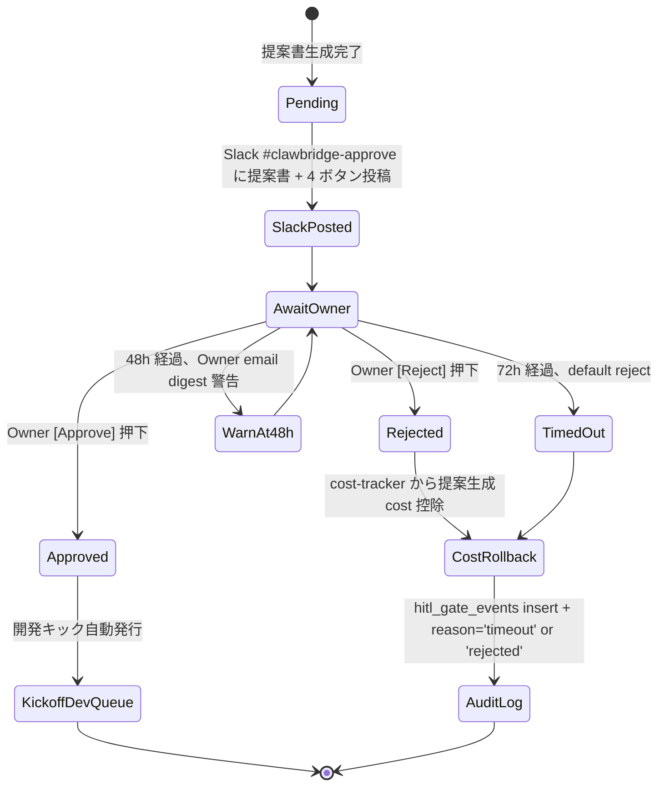
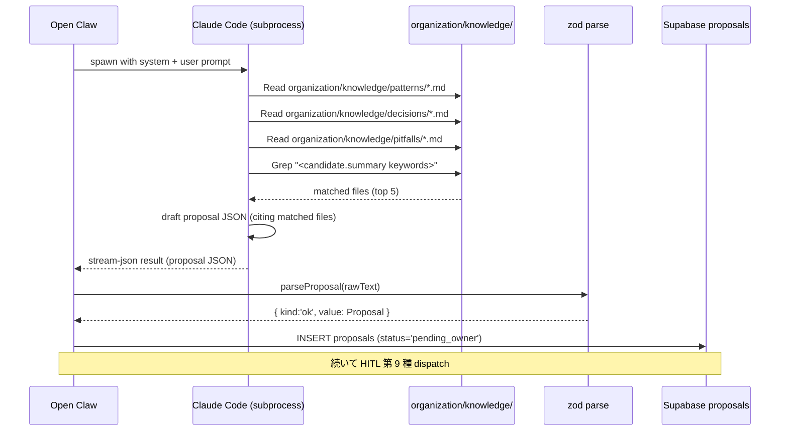
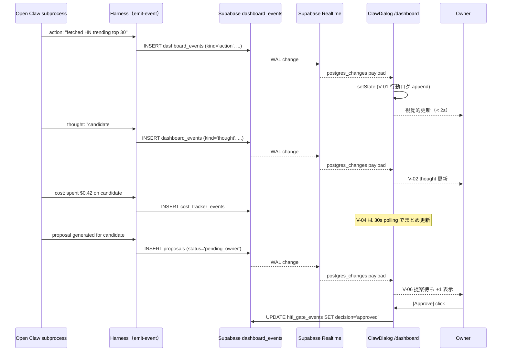
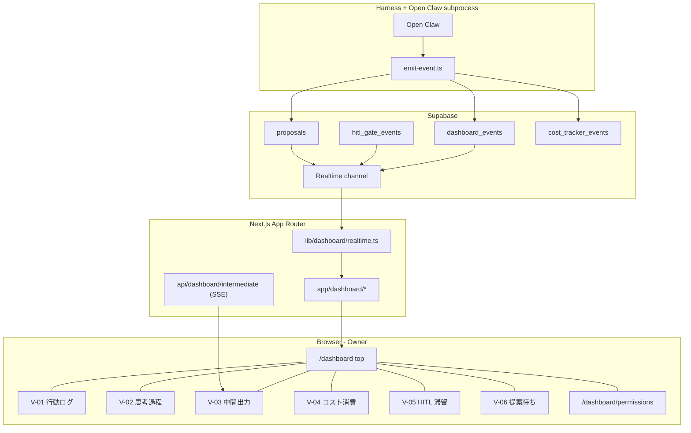
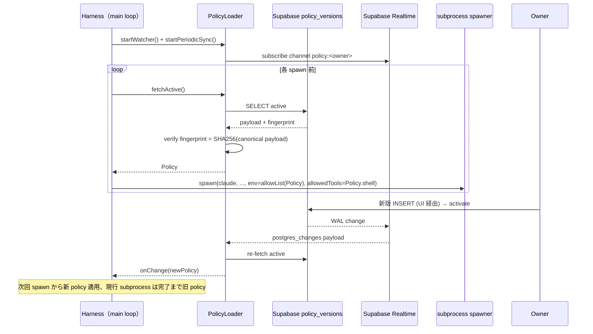
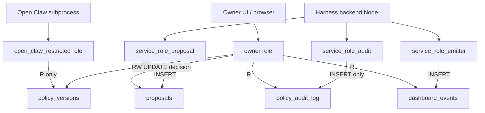
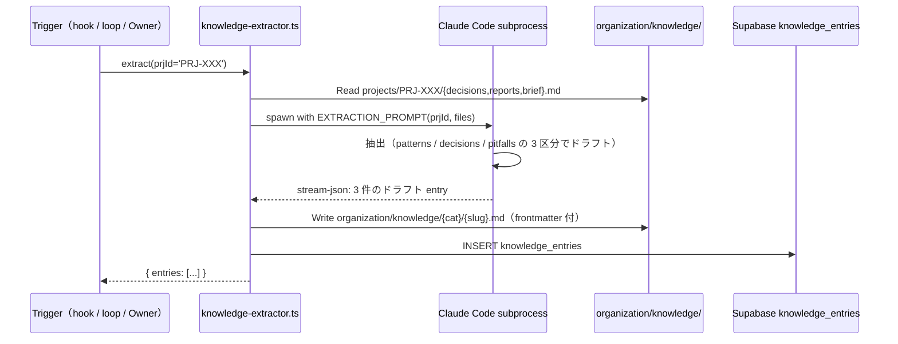
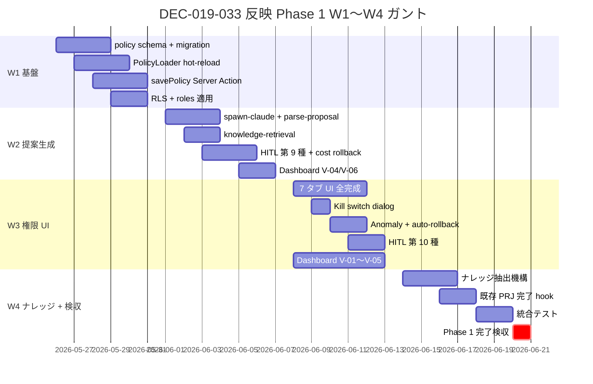

# Dev W0-Week2 詳細設計書 — Pre-Phase 提案生成フロー + 透明性ダッシュボード + Open Claw 権限管理 UI（DEC-019-033 反映）

| 項目 | 値 |
|---|---|
| 文書 ID | DEV-PRJ-019-W0W2-PROPGEN-DASH-PERMUI-2026-05-03 |
| 文書種別 | Dev 部門 詳細設計書（DEC-019-033 5 点反映、Phase 1 着手 5/26 前提） |
| 制定日 | 2026-05-03 |
| 制定担当 | 開発（Dev） — claude-code-company / `/dev` |
| 対象案件 | PRJ-019 Clawbridge（Pre-Phase 提案生成 / 権限管理 / hot-reload）+ PRJ-020 ClawDialog（透明性ダッシュボード / 権限管理 UI） |
| 関連決裁 ID | DEC-019-018（HITL 第 6 種）／ DEC-019-022（HITL 第 7 種）／ DEC-019-025（agent tool 権限 SOP）／ DEC-019-026〜030（公開計画）／ **DEC-019-033（5 点統合・本書直接反映）**／ DEC-020-001〜003（PRJ-020 起案 + 同居実装） |
| 上位文書 | `dev-w0-week2-mid-detailed-design.md`（1,079 行）／ `dev-hitl-gate-1-8-integrated-sop.md`（1,094 行）／ `dev-hitl-gate-6th-7th-operations-sop.md`（442 行）／ `projects/PRJ-020/reports/dev-prj020-implementation-skeleton.md`（1,164 行）／ `projects/PRJ-020/reports/ceo-prj020-scope-definition.md` |
| 本書の位置付け | DEC-019-033 で確定した 5 点（Pre-Phase 提案生成 / 透明性ダッシュボード / 権限管理 UI / ナレッジ抽出 / HITL 第 9・10 種）を、Phase 1 着手 5/26 前に Review 検収可能な詳細設計（zod schema / TypeScript signature / Supabase SQL / Mermaid 状態遷移 / RLS policy）水準まで落とし込む |
| 出力先 | `projects/PRJ-019/reports/dev-w0-week2-prop-gen-and-dashboard.md` |
| 副作用ゼロ確認 | 既存 PRJ-001〜018（PRJ-012 Sumi / PRJ-018 Asagi 含む）のファイル / git history / Vercel deploy / Supabase 行 / OAuth トークンに変更を起こさないこと、設計段階で保証（§5.1 / §6.6 / §7.5） |
| 標準スタック順守 | Web: Next.js (App Router) + TypeScript / shadcn/ui + Tailwind CSS / Heroicons（絵文字禁止）／ Geist Sans+Mono / next-themes ／ DB: Supabase ／ Deploy: Vercel ／ Test: Vitest + Playwright ／ pnpm monorepo（既存 95 tests 全緑、本書範囲で +30〜50 → 125〜145 件目標） |

---

## §0. エグゼクティブサマリ（400 字以内）

DEC-019-033 で確定した「Owner-in-the-loop 透明 AI 組織」モデルへの変更 5 点を、Phase 1 着手日 5/26 までに Review 検収可能な実装設計水準で確定する。具体的には (1) Pre-Phase 提案生成フロー（Open Claw → Claude Code への提案指示テンプレ + 提案書 7 項目 zod schema + HITL 第 9 種 `dev_kickoff_approval` 72h SLA + 既存ナレッジ retrieval）、(2) 透明性ダッシュボード（PRJ-020 ClawDialog `/dashboard` 配下、6 ビュー × Supabase Realtime SSE）、(3) **Open Claw 権限管理 UI（7 カテゴリ × 細粒度設定、kill switch、policy_versions / policy_audit_log、priviledge escalation 防止）**【最重要】、(4) ハーネス層 hot-reload（subprocess spawn 前最新 policy fetch + change watcher + fingerprint 検証）、(5) HITL 第 10 種 `permission_change_review`（policy backup 復元 / 外部 import / 過剰権限警告 3 ケース）、(6) ナレッジ抽出蓄積（`organization/knowledge/` 自動書込 + 提案時 retrieval）。Mermaid 8 図、比較表 16 個、[ODR] 11 件。Phase 1 W1〜W4 タスク分解と Vitest +27 / Playwright +14 = 41 ケース新規（既存 95 → 136 件）。

---

## §1. Pre-Phase 提案生成フロー実装設計

### §1.1 ゴールと位置付け

DEC-019-033 ① で「ニーズ抽出 → 即実装」を撤回し、「ニーズ抽出 → **アプリ提案生成（Open Claw → Claude Code 指示） → オーナー承認** → 開発キック → 実装 → preview deploy → Slack 通知」の 2 段階モデルに変更された。本章ではその「Pre-Phase 提案生成」部分を物理水準で確定する。

| 段階 | 旧モデル（DEC-019-007） | 新モデル（DEC-019-033） |
|---|---|---|
| ニーズ抽出 | HN/IH trending 自動 polling | 同左（変更なし） |
| 採否判定 | `tos_gray_review`（HITL 第 6 種、ToS のみ） | ToS + 既存ナレッジ照合 + ターゲット効果試算（Pre-Phase 拡張） |
| 提案書生成 | （存在しない） | **新設**: Open Claw → Claude Code 指示で 7 項目構造化 |
| オーナー承認 | （存在しない、即 Vercel Sandbox 起動） | **新設**: HITL 第 9 種 `dev_kickoff_approval` 72h SLA、default reject |
| 実装着手 | 自動 | 承認後のみ自動 |
| 数値目標 | 60 min/件、$5/件、10 連続 ≥80% | 提案 60 min + 承認待ち 72h + 実装 60 min、提案承認率 ≥30%、承認後実装成功率 ≥80% |

### §1.2 Open Claw → Claude Code 指示テンプレート（プロンプト設計）

#### §1.2.1 提案生成指示の Open Claw 側プロンプト

Open Claw は `subprocess` で `claude -p "<prompt>" --output-format stream-json --allowedTools "Read,Grep,Glob,WebFetch"` を spawn し、以下のシステムプロンプト + ユーザプロンプトを渡す。Claude Code 側はリポジトリ内の既存ナレッジ（`organization/knowledge/`）と active-projects.md を Read/Grep して提案書を作成する。

```typescript
// projects/PRJ-019/app/packages/proposal-gen/src/prompt-templates.ts

/**
 * 提案生成 system prompt
 * Phase 1 W1: Claude Sonnet 4.5（精度優先、$3/$15 per MTok）
 * Phase 2: ループあたりコストが $1 を超えた場合は Haiku 3.5 にフォールバック検討
 */
export const PROPOSAL_GEN_SYSTEM_PROMPT = `
You are the Pre-Phase Proposal Generator for the claude-code-company AI organisation.
You are invoked by Open Claw (the autonomous Owner Surrogate) via subprocess spawn.

# Your role

Given a single "candidate" (a HN trending TS repo OR an Indie Hackers microSaaS post),
generate a proposal document for the Owner to approve or reject.

# Strict constraints

- You MUST read \`organization/knowledge/\` (patterns/ + decisions/ + pitfalls/) BEFORE drafting.
- You MUST read \`dashboard/active-projects.md\` to avoid PRJ overlap.
- You MUST NOT propose anything that touches the 13 prohibited domains (DEC-019-010).
- You MUST keep estimated cost within Owner-defined per-proposal cap (DEFAULT $5).
- You MUST output strict JSON conforming to ProposalSchema (see schema reference).
- You MUST cite at least 1 entry from \`organization/knowledge/\` if any relevant entry exists.
- If no relevant knowledge exists, you MUST say so explicitly in field (f).

# Output schema (strict JSON only, no markdown fences)

{
  "candidate_id": "<uuid>",
  "summary": "<<= 200 chars, 1-2 sentences>",
  "target_effect": {
    "user_count_estimate": <integer>,
    "ltv_usd_estimate": <number>,
    "rationale": "<<= 200 chars>"
  },
  "estimated_cost_usd": <number>,
  "tos_gray_judgement": {
    "verdict": "whitelist" | "gray" | "blocklist",
    "confidence": <0.0..1.0>,
    "rationale": "<<= 200 chars>"
  },
  "estimated_dev_days": <number>,
  "knowledge_refs": [
    { "category": "patterns" | "decisions" | "pitfalls",
      "file": "<relative path under organization/knowledge/>",
      "summary": "<<= 100 chars why this is relevant>" }
  ],
  "recommendation": {
    "verdict": "adopt" | "reject" | "hold",
    "rationale": "<<= 300 chars>"
  }
}

# Forbidden behaviours

- DO NOT execute any Bash command (Bash tool is NOT in allowedTools for this invocation).
- DO NOT write any file (Write/Edit tools are NOT in allowedTools).
- DO NOT propose modifications to \`projects/PRJ-001\`..\`PRJ-018\` source files.
- DO NOT cite knowledge entries that do not exist.
`;

export const PROPOSAL_GEN_USER_PROMPT_TEMPLATE = (candidate: CandidateRaw) => `
# Candidate

\`\`\`json
${JSON.stringify(candidate, null, 2)}
\`\`\`

# Active organisation context (read-only)

- Active PRJ list: see \`dashboard/active-projects.md\`
- Knowledge corpus root: \`organization/knowledge/\`
- Standard tech stack: \`organization/rules/tech-stack.md\`
- 13 prohibited domains: see DEC-019-010 in \`projects/PRJ-019/decisions.md\`
- Per-proposal cost cap: $${candidate.cost_cap_usd ?? 5} (Owner default)

Generate a proposal in strict JSON.
`;
```

#### §1.2.2 Open Claw 側の subprocess spawn 設計

```typescript
// projects/PRJ-019/app/packages/proposal-gen/src/spawn-claude.ts

import { spawn } from 'node:child_process';
import type { CandidateRaw, RawProposalText } from './types';
import { PROPOSAL_GEN_SYSTEM_PROMPT, PROPOSAL_GEN_USER_PROMPT_TEMPLATE } from './prompt-templates';
import type { Policy } from '../../harness/src/policy/policy-types';

export interface SpawnProposalOptions {
  policy: Policy;                       // §6 hot-reload で fetch した最新 policy
  timeoutMs?: number;                   // default 60_000
  fingerprint?: string;                 // §7 priviledge escalation 防止
}

export async function spawnClaudeForProposal(
  candidate: CandidateRaw,
  opts: SpawnProposalOptions,
): Promise<RawProposalText> {
  // 1. policy fingerprint 検証（改ざん検知）
  if (opts.fingerprint && opts.fingerprint !== opts.policy.fingerprint) {
    throw new Error(`Policy fingerprint mismatch: expected ${opts.fingerprint}, got ${opts.policy.fingerprint}`);
  }

  // 2. allowedTools 構築（policy.shell_whitelist は使わず、提案生成専用に Read/Grep/Glob/WebFetch のみ）
  const allowedTools = ['Read', 'Grep', 'Glob', 'WebFetch'].join(',');

  // 3. environment allow-list（OAuth token は env 経由のみ、process.env 直読禁止）
  const envAllowList: NodeJS.ProcessEnv = {
    PATH: process.env.PATH,
    HOME: process.env.HOME,
    ANTHROPIC_API_KEY: undefined,       // P-D 改では subprocess は OAuth、API key は触らせない
  };

  // 4. spawn
  return new Promise((resolve, reject) => {
    const child = spawn('claude', [
      '-p', PROPOSAL_GEN_USER_PROMPT_TEMPLATE(candidate),
      '--output-format', 'stream-json',
      '--allowedTools', allowedTools,
      '--system-prompt', PROPOSAL_GEN_SYSTEM_PROMPT,
    ], { env: envAllowList, stdio: ['ignore', 'pipe', 'pipe'] });

    const chunks: string[] = [];
    child.stdout.on('data', (b) => chunks.push(b.toString('utf8')));

    const t = setTimeout(() => {
      child.kill('SIGTERM');
      reject(new Error('proposal-gen timeout'));
    }, opts.timeoutMs ?? 60_000);

    child.on('close', (code) => {
      clearTimeout(t);
      if (code !== 0) return reject(new Error(`claude exit ${code}`));
      resolve({ raw: chunks.join(''), exit_code: code });
    });
  });
}
```

### §1.3 提案書 schema（zod）— 7 項目構造化

DEC-019-033 ② で確定した提案書 7 項目 {(a) 概要 (b) ターゲット効果 (c) 想定コスト (d) ToS gray 判定 (e) 開発期間 (f) 既存ナレッジ参照 (g) 推奨採否} を zod schema で完全形式化する。

```typescript
// projects/PRJ-019/app/packages/proposal-gen/src/schema.ts

import { z } from 'zod';

export const TosVerdictSchema = z.enum(['whitelist', 'gray', 'blocklist']);

export const TargetEffectSchema = z.object({
  user_count_estimate: z.number().int().nonnegative(),
  ltv_usd_estimate: z.number().nonnegative(),
  rationale: z.string().trim().max(200),
});

export const TosJudgementSchema = z.object({
  verdict: TosVerdictSchema,
  confidence: z.number().min(0).max(1),
  rationale: z.string().trim().max(200),
});

export const KnowledgeRefSchema = z.object({
  category: z.enum(['patterns', 'decisions', 'pitfalls']),
  file: z.string()
    .regex(/^organization\/knowledge\/(patterns|decisions|pitfalls)\/[A-Za-z0-9_\-./]+\.md$/,
      'must be a path under organization/knowledge/'),
  summary: z.string().trim().max(100),
});

export const RecommendationSchema = z.object({
  verdict: z.enum(['adopt', 'reject', 'hold']),
  rationale: z.string().trim().max(300),
});

export const ProposalSchema = z.object({
  candidate_id: z.string().uuid(),
  summary: z.string().trim().min(1).max(200),                    // (a) 概要
  target_effect: TargetEffectSchema,                              // (b) ターゲット効果
  estimated_cost_usd: z.number().nonnegative(),                   // (c) 想定コスト
  tos_gray_judgement: TosJudgementSchema,                         // (d) ToS gray 判定
  estimated_dev_days: z.number().nonnegative(),                   // (e) 開発期間
  knowledge_refs: z.array(KnowledgeRefSchema).default([]),        // (f) 既存ナレッジ参照
  recommendation: RecommendationSchema,                           // (g) 推奨採否
});

export type Proposal = z.infer<typeof ProposalSchema>;

/**
 * 提案書のサーバ側追加メタ（DB 保存時に自動付与）
 */
export const ProposalRecordSchema = ProposalSchema.extend({
  id: z.string().uuid(),
  created_at: z.string().datetime(),
  generated_by_model: z.string(),                  // 'claude-sonnet-4-5' など
  generation_cost_usd: z.number().nonnegative(),   // 提案生成自体の LLM コスト
  generation_duration_ms: z.number().int().nonnegative(),
  policy_fingerprint: z.string().length(64),       // SHA-256 hex（改ざん検知）
  status: z.enum(['pending_owner', 'approved', 'rejected', 'timeout', 'cost_rolled_back']),
});

export type ProposalRecord = z.infer<typeof ProposalRecordSchema>;
```

#### §1.3.1 提案 schema parsing 失敗時の fallback

```typescript
// projects/PRJ-019/app/packages/proposal-gen/src/parse-proposal.ts

import { ProposalSchema, type Proposal } from './schema';

export type ParseResult =
  | { kind: 'ok'; value: Proposal }
  | { kind: 'parse_error'; raw: string; error: string }
  | { kind: 'validation_error'; raw: string; issues: string[] };

export function parseProposal(rawText: string): ParseResult {
  // 1. stream-json 行群から最終 result text を抽出
  const lines = rawText.split('\n').filter(Boolean);
  const resultLine = lines.reverse().find((l) => l.includes('"type":"result"'));
  if (!resultLine) return { kind: 'parse_error', raw: rawText, error: 'no result line' };

  let json: unknown;
  try {
    const event = JSON.parse(resultLine);
    json = JSON.parse(event.text ?? event.result ?? '{}');
  } catch (e) {
    return { kind: 'parse_error', raw: rawText, error: String(e) };
  }

  // 2. zod 検証
  const parsed = ProposalSchema.safeParse(json);
  if (!parsed.success) {
    return {
      kind: 'validation_error',
      raw: rawText,
      issues: parsed.error.issues.map((i) => `${i.path.join('.')}: ${i.message}`),
    };
  }

  return { kind: 'ok', value: parsed.data };
}
```

parse_error / validation_error 時の挙動：

| 失敗種別 | 自動 retry | フォールバック | cost rollback |
|---|---|---|---|
| `parse_error` | 1 回（同一 prompt 再 spawn） | 失敗時は manual queue へ | あり（再 retry も失敗時） |
| `validation_error` | 1 回（"strict JSON only" を強調した prompt 追記で再 spawn） | 失敗時は manual queue へ | あり |
| timeout（60s） | なし | 即 manual queue へ | あり |

### §1.4 HITL 第 9 種 `dev_kickoff_approval` 実装

DEC-019-033 ② で確定。default reject、SLA 72 時間（営業日 5 日換算）、timeout 自動棄却 + cost-tracker rollback。既存 HITL 1〜8 種と同じ `dispatchHitlGate<T>` 抽象を継承する。

#### §1.4.1 ペイロードと型定義

```typescript
// projects/PRJ-019/app/packages/harness/src/hitl-gates/dev-kickoff-approval.ts

import type { Proposal, ProposalRecord } from '../../proposal-gen/src/schema';

export interface DevKickoffApprovalPayload {
  proposal_id: string;                  // ProposalRecord.id
  proposal_summary: string;             // proposal.summary（80 字に短縮）
  estimated_cost_usd: number;
  estimated_dev_days: number;
  tos_verdict: 'whitelist' | 'gray' | 'blocklist';
  tos_confidence: number;
  recommendation_verdict: 'adopt' | 'reject' | 'hold';
  generation_cost_usd: number;
  policy_fingerprint: string;
}

export interface DevKickoffApprovalResponse {
  decision: 'approved' | 'rejected' | 'timeout';
  reviewer_id: string;                  // Owner UUID
  reviewed_at: string;                  // ISO 8601
  rationale?: string;                   // Owner 任意コメント
}
```

#### §1.4.2 SLA / timeout / cost rollback の状態遷移



#### §1.4.3 timeout / cost rollback の実装

```typescript
// projects/PRJ-019/app/packages/harness/src/hitl-gates/dev-kickoff-approval.ts (続き)

import type { TimeSource } from '../time-source';
import type { CostTracker } from '../cost-tracker';
import { dispatchHitlGate } from '../hitl-gate-dispatcher';

export interface KickoffApprovalDeps {
  timeSource: TimeSource;
  costTracker: CostTracker;
  slaHours?: number;        // default 72
  warnHours?: number;       // default 48
}

export async function requestDevKickoffApproval(
  proposal: ProposalRecord,
  deps: KickoffApprovalDeps,
): Promise<DevKickoffApprovalResponse> {
  const slaMs = (deps.slaHours ?? 72) * 3600 * 1000;
  const warnMs = (deps.warnHours ?? 48) * 3600 * 1000;
  const now = deps.timeSource.now();

  const event = await dispatchHitlGate<DevKickoffApprovalPayload>({
    gate_type: 'dev_kickoff_approval',
    payload: {
      proposal_id: proposal.id,
      proposal_summary: proposal.summary.slice(0, 80),
      estimated_cost_usd: proposal.estimated_cost_usd,
      estimated_dev_days: proposal.estimated_dev_days,
      tos_verdict: proposal.tos_gray_judgement.verdict,
      tos_confidence: proposal.tos_gray_judgement.confidence,
      recommendation_verdict: proposal.recommendation.verdict,
      generation_cost_usd: proposal.generation_cost_usd,
      policy_fingerprint: proposal.policy_fingerprint,
    },
    urgency: 'normal',
    sla_deadline: new Date(now.getTime() + slaMs).toISOString(),
    warn_at: new Date(now.getTime() + warnMs).toISOString(),
    default_action: 'reject',                     // DEC-019-033 ② default reject
    source_module: 'proposal-gen.kickoff',
    created_by: 'open_claw',
    dedup_key: `kickoff-${proposal.id}`,
  });

  // 待機（cron が timeout 検知して自動 reject 可、ここではポーリング）
  const result = await pollHitlGateResult(event.id, slaMs);

  // cost rollback
  if (result.decision === 'rejected' || result.decision === 'timeout') {
    await deps.costTracker.rollback({
      tag: 'proposal-gen',
      candidate_id: proposal.candidate_id,
      reason: result.decision === 'timeout' ? 'kickoff_timeout' : 'kickoff_rejected',
      amount_usd: proposal.generation_cost_usd,
    });
  }

  return result;
}
```

### §1.5 既存ナレッジ参照機構（retrieval 実装）

DEC-019-033 ④ で `organization/knowledge/` 配下に 3 サブディレクトリ（`patterns/` `decisions/` `pitfalls/`）を新設、提案生成時に retrieval して参照する。

#### §1.5.1 ディレクトリ拡張

```
organization/knowledge/
├── patterns/                    # 再利用可能な実装パターン
│   ├── auth-supabase.md
│   ├── email-resend.md
│   └── README.md
├── decisions/                   # 設計判断ログ（DEC とは別、軽量メモ）
│   ├── why-not-firebase.md
│   └── README.md
├── pitfalls/                    # 落とし穴集
│   ├── nextjs-hydration.md
│   ├── supabase-rls.md
│   └── README.md
├── prj-002-lessons-learned.md   # 既存（変更なし）
├── prj-007-lessons-learned.md   # 既存（変更なし）
└── README.md
```

#### §1.5.2 retrieval 戦略：Hybrid（keyword grep + frontmatter tag + cosine 任意）

Phase 1 PoC は keyword grep + frontmatter tag のみ採用。embedding ベース cosine 類似度は Phase 2 で追加（Supabase pgvector）。

```typescript
// projects/PRJ-019/app/packages/proposal-gen/src/knowledge-retrieval.ts

import { promises as fs } from 'node:fs';
import path from 'node:path';
import matter from 'gray-matter';

export interface KnowledgeEntry {
  category: 'patterns' | 'decisions' | 'pitfalls';
  file: string;                         // 'organization/knowledge/patterns/auth-supabase.md'
  title: string;
  tags: string[];
  summary: string;                      // frontmatter.summary or first line
  body: string;
}

export interface RetrievalResult {
  entry: KnowledgeEntry;
  score: number;                        // 0..1
  matched_tags: string[];
  matched_keywords: string[];
}

export async function retrieveKnowledge(
  query: string,                        // candidate.summary など
  opts: { rootDir?: string; topK?: number } = {},
): Promise<RetrievalResult[]> {
  const root = opts.rootDir ?? path.resolve('organization/knowledge');
  const entries = await loadAllEntries(root);

  const queryTokens = tokenize(query.toLowerCase());

  const scored = entries.map((e) => {
    const matchedTags = e.tags.filter((t) => queryTokens.includes(t.toLowerCase()));
    const matchedKw = queryTokens.filter((q) => e.body.toLowerCase().includes(q));
    const tagScore = matchedTags.length / Math.max(1, e.tags.length);
    const kwScore = matchedKw.length / Math.max(1, queryTokens.length);
    return {
      entry: e,
      score: 0.6 * tagScore + 0.4 * kwScore,
      matched_tags: matchedTags,
      matched_keywords: matchedKw,
    };
  });

  return scored
    .filter((r) => r.score > 0.1)
    .sort((a, b) => b.score - a.score)
    .slice(0, opts.topK ?? 5);
}

async function loadAllEntries(rootDir: string): Promise<KnowledgeEntry[]> {
  // patterns/ decisions/ pitfalls/ を再帰スキャン、frontmatter parse
  const out: KnowledgeEntry[] = [];
  for (const cat of ['patterns', 'decisions', 'pitfalls'] as const) {
    const dir = path.join(rootDir, cat);
    let files: string[] = [];
    try { files = (await fs.readdir(dir)).filter((f) => f.endsWith('.md')); } catch { continue; }
    for (const f of files) {
      if (f === 'README.md') continue;
      const raw = await fs.readFile(path.join(dir, f), 'utf8');
      const fm = matter(raw);
      out.push({
        category: cat,
        file: `organization/knowledge/${cat}/${f}`,
        title: fm.data.title ?? f.replace(/\.md$/, ''),
        tags: Array.isArray(fm.data.tags) ? fm.data.tags : [],
        summary: fm.data.summary ?? raw.slice(0, 100),
        body: fm.content,
      });
    }
  }
  return out;
}

function tokenize(s: string): string[] {
  return s.split(/[\s,.\-_/]+/).filter((t) => t.length >= 2);
}
```

#### §1.5.3 frontmatter 規約

```markdown
---
title: Supabase Row Level Security の罠
tags: [supabase, rls, auth, security]
summary: Supabase RLS で Server Action から service_role を使う場合の落とし穴と回避策
created_at: 2026-04-12
prj_refs: [PRJ-002, PRJ-018]
---

# 本文...
```

#### §1.5.4 retrieval シーケンス図



---

## §2. 透明性ダッシュボード UI 設計（PRJ-020 ClawDialog `/dashboard`）

### §2.1 ゴールと配置

DEC-019-033 ③ で「PRJ-020 ClawDialog 内に統合実装」「Owner 専用 route `/dashboard`」「6 ビュー（行動ログ / 思考過程 / 中間出力 / コスト消費 / HITL 滞留 / 提案待ち件数）」「Supabase Realtime or SSE」と確定された。本章で UI 構成と更新機構を確定する。

| ビュー ID | ビュー名 | 主データソース | 更新方式 | 主シーン |
|---|---|---|---|---|
| V-01 | Open Claw 行動ログ | `dashboard_events` (kind='action') | Realtime channel | 「いま何をしているか」を知る |
| V-02 | 思考過程 | `dashboard_events` (kind='thought') | Realtime channel | LLM の中間プロンプト・推論ステップ確認 |
| V-03 | 中間出力 | `dashboard_events` (kind='intermediate_output') | SSE pull | 提案書ドラフト・コード生成の途中 |
| V-04 | コスト消費 | `cost_tracker_aggregate` view | 30s polling | 月次累積 / per-loop / 残予算可視化 |
| V-05 | HITL 滞留 | `hitl_gate_events` (decision='pending') | Realtime channel | 待機中の HITL 件数 + SLA 残時間 |
| V-06 | 提案待ち件数 | `proposals` (status='pending_owner') | Realtime channel | DEC-019-033 ② 第 9 種専用ビュー |

### §2.2 Next.js App Router 構成

```
projects/PRJ-019/app/app/dashboard/
├── layout.tsx                          # owner role guard + Sidebar
├── page.tsx                            # 6 ビュー グリッド（デフォルトトップ）
├── actions/
│   └── page.tsx                        # V-01 行動ログ詳細
├── thoughts/
│   └── page.tsx                        # V-02 思考過程詳細
├── intermediate/
│   └── page.tsx                        # V-03 中間出力詳細
├── cost/
│   └── page.tsx                        # V-04 コスト消費詳細
├── hitl/
│   └── page.tsx                        # V-05 HITL 滞留詳細
├── proposals/
│   └── page.tsx                        # V-06 提案待ち詳細 + Approve/Reject ボタン
└── permissions/                        # §3 権限管理 UI（最重要）
    ├── page.tsx
    ├── fs/page.tsx
    ├── shell/page.tsx
    ├── network/page.tsx
    ├── hitl/page.tsx
    ├── cost/page.tsx
    ├── time-window/page.tsx
    └── genre/page.tsx
```

### §2.3 shadcn/ui コンポーネント構成（Heroicons のみ、絵文字禁止）

| ビュー | 主コンポーネント | Heroicons |
|---|---|---|
| V-01 行動ログ | `Card` + `Table` + `Badge` | `BoltIcon` `PlayIcon` `StopIcon` |
| V-02 思考過程 | `Card` + `ScrollArea` + `Collapsible` | `LightBulbIcon` |
| V-03 中間出力 | `Card` + `Tabs` + `CodeBlock`(自作) | `DocumentTextIcon` |
| V-04 コスト消費 | `Card` + `Progress` + `LineChart`(recharts) | `BanknotesIcon` `ChartBarIcon` |
| V-05 HITL 滞留 | `Card` + `Table` + `Countdown`(自作) | `ClockIcon` `ExclamationTriangleIcon` |
| V-06 提案待ち | `Card` + `Table` + `Button(Approve/Reject)` | `InboxIcon` `CheckIcon` `XMarkIcon` |
| §3 権限 UI | `Tabs` + `Form` + `Dialog`（kill-switch） | `ShieldCheckIcon` `LockClosedIcon` |

絵文字は使用禁止（CLAUDE.md ルール + ユーザ memory feedback_no_emoji.md）。Heroicons の outline / solid を統一して使い分け。

### §2.4 リアルタイム更新（Supabase Realtime + SSE 併用）

| ビュー | 更新方式 | 理由 |
|---|---|---|
| V-01 / V-02 / V-05 / V-06 | Supabase Realtime（Postgres Changes channel） | INSERT 頻度高い（秒〜分単位） |
| V-03 | SSE pull（5s 間隔） | 中間出力は粒度が大きく、Realtime overhead が無駄 |
| V-04 | 30s polling | 集計 view、頻度低い、Realtime 不要 |

#### §2.4.1 Supabase Realtime channel 設計

```typescript
// projects/PRJ-019/app/lib/dashboard/realtime.ts

import { createClient } from '@supabase/supabase-js';

export function subscribeDashboardEvents(opts: {
  ownerId: string;
  onEvent: (e: DashboardEvent) => void;
}) {
  const supabase = createClient(/* ... */);
  const ch = supabase
    .channel(`dashboard:${opts.ownerId}`)
    .on('postgres_changes',
      { event: 'INSERT', schema: 'public', table: 'dashboard_events',
        filter: `owner_id=eq.${opts.ownerId}` },
      (payload) => opts.onEvent(payload.new as DashboardEvent))
    .on('postgres_changes',
      { event: '*', schema: 'public', table: 'hitl_gate_events',
        filter: `owner_id=eq.${opts.ownerId}` },
      (payload) => opts.onEvent({ kind: 'hitl_change', payload: payload.new }))
    .on('postgres_changes',
      { event: '*', schema: 'public', table: 'proposals',
        filter: `owner_id=eq.${opts.ownerId}` },
      (payload) => opts.onEvent({ kind: 'proposal_change', payload: payload.new }))
    .subscribe();

  return () => supabase.removeChannel(ch);
}
```

#### §2.4.2 SSE エンドポイント（V-03 中間出力）

```typescript
// projects/PRJ-019/app/app/api/dashboard/intermediate/route.ts

export async function GET(req: Request) {
  const stream = new ReadableStream({
    async start(controller) {
      const enc = new TextEncoder();
      const interval = setInterval(async () => {
        const rows = await fetchIntermediateOutputsSince(/* lastId */);
        for (const r of rows) {
          controller.enqueue(enc.encode(`data: ${JSON.stringify(r)}\n\n`));
        }
      }, 5_000);
      req.signal.addEventListener('abort', () => clearInterval(interval));
    },
  });
  return new Response(stream, {
    headers: {
      'Content-Type': 'text/event-stream',
      'Cache-Control': 'no-store',
      'Connection': 'keep-alive',
    },
  });
}
```

### §2.5 Mermaid シーケンス図（Open Claw → ハーネス → Supabase → UI）



### §2.6 ダッシュボード構成図



---

## §3. Open Claw 権限管理 UI 詳細設計【最重要】

### §3.1 設計原則（DEC-019-033 ⑤ 全面反映）

| 原則 | 内容 | 物理保証 |
|---|---|---|
| Owner-only mutation | 権限変更は Owner のみ可能 | Supabase RLS で `owner` role のみ INSERT/UPDATE 許可（§7） |
| Subprocess read-only | Open Claw は policy を read のみ | `restricted` DB role 経由、service_role キーは subprocess に渡さない |
| Hot-reload | 再起動不要で反映 | spawn 直前に最新 policy fetch + change watcher（§6） |
| Audit log 必須 | 変更者 ID + IP + 前後 diff | `policy_audit_log` テーブル + Supabase trigger（§7） |
| Fingerprint 検証 | 改ざん検知 | SHA-256 of canonical JSON、subprocess 渡し時に照合（§7） |
| Kill switch | 全停止ボタン | `policy.kill_switch_engaged = true` で全 subprocess 即停止 |
| 自動 rollback | 過剰権限警告 | 異常検知時に `policy_versions` から直前 active 版へ自動戻し（§3.10） |

### §3.2 7 カテゴリ × 細粒度設定の UI コンポーネント設計

`/dashboard/permissions` トップは shadcn/ui の `Tabs` で 7 カテゴリ + Kill switch を切替表示。各タブは独立 form として `react-hook-form` + zod validation を適用。Save 時は `policy_versions` に新版 INSERT、active を切替（楽観 lock）。

```typescript
// projects/PRJ-019/app/app/dashboard/permissions/page.tsx
import { Tabs, TabsList, TabsTrigger, TabsContent } from '@/components/ui/tabs';
import { ShieldCheckIcon, FolderIcon, CommandLineIcon, GlobeAltIcon,
         CheckCircleIcon, BanknotesIcon, ClockIcon, TagIcon, NoSymbolIcon } from '@heroicons/react/24/outline';

export default function PermissionsPage() {
  return (
    <Tabs defaultValue="fs">
      <TabsList>
        <TabsTrigger value="fs"><FolderIcon className="size-4" />FS 書込</TabsTrigger>
        <TabsTrigger value="shell"><CommandLineIcon className="size-4" />Shell</TabsTrigger>
        <TabsTrigger value="network"><GlobeAltIcon className="size-4" />Network</TabsTrigger>
        <TabsTrigger value="hitl"><CheckCircleIcon className="size-4" />HITL Gate</TabsTrigger>
        <TabsTrigger value="cost"><BanknotesIcon className="size-4" />コスト上限</TabsTrigger>
        <TabsTrigger value="time"><ClockIcon className="size-4" />時間帯</TabsTrigger>
        <TabsTrigger value="genre"><TagIcon className="size-4" />ジャンル</TabsTrigger>
        <TabsTrigger value="kill" className="text-destructive">
          <NoSymbolIcon className="size-4" />Kill switch
        </TabsTrigger>
      </TabsList>
      <TabsContent value="fs"><FsTab /></TabsContent>
      <TabsContent value="shell"><ShellTab /></TabsContent>
      <TabsContent value="network"><NetworkTab /></TabsContent>
      <TabsContent value="hitl"><HitlTab /></TabsContent>
      <TabsContent value="cost"><CostTab /></TabsContent>
      <TabsContent value="time"><TimeWindowTab /></TabsContent>
      <TabsContent value="genre"><GenreTab /></TabsContent>
      <TabsContent value="kill"><KillSwitchTab /></TabsContent>
    </Tabs>
  );
}
```

### §3.3 (1) FS 書込範囲：パス glob リスト + allow/deny + プレビュー

```typescript
// schema
export const FsRuleSchema = z.object({
  effect: z.enum(['allow', 'deny']),
  glob: z.string().min(1).max(256)
    .refine((g) => !g.includes('..'), 'parent traversal forbidden')
    .refine((g) => !path.isAbsolute(g) || g.startsWith('/tmp/'),
      'absolute paths only allowed under /tmp/'),
  description: z.string().max(120).optional(),
});
export const FsPolicySchema = z.object({
  rules: z.array(FsRuleSchema).min(1).max(200),
  default_effect: z.enum(['allow', 'deny']).default('deny'),
});
```

UI 仕様：

| UI 部品 | 役割 | 検証 |
|---|---|---|
| `Table` 行（drag handle + glob input + effect toggle + description） | rules 編集 | glob 入力リアルタイム validate |
| `Button(Add row)` | rule 追加 | max 200 件 |
| `Button(Preview matches)` | サンプルパス 100 件で allow/deny を試算表示 | 結果を `Sheet` で展開 |
| `RadioGroup(default_effect)` | デフォルト挙動 | allow / deny |
| `Button(Save)` | `policy_versions` INSERT | optimistic lock + diff preview |

#### §3.3.1 プレビュー機構

Save 前に「現在のリポジトリパス候補 100 件」を `picomatch` で評価し、何が allow / deny されるかを表示する。`projects/PRJ-001`〜`PRJ-018` 配下のパスは強制 deny（既存 PRJ 副作用ゼロを物理保証）。

### §3.4 (2) シェルコマンド whitelist：コマンド単位 + 引数正規表現 + dry-run

```typescript
export const ShellRuleSchema = z.object({
  effect: z.enum(['allow', 'deny']),
  command: z.string().regex(/^[a-z0-9_\-]+$/, 'lowercase alnum + dash/underscore only'),
  args_regex: z.string().refine((r) => {
    try { new RegExp(r); return true; } catch { return false; }
  }, 'must be a valid RegExp'),
  description: z.string().max(120).optional(),
});
export const ShellPolicySchema = z.object({
  rules: z.array(ShellRuleSchema).max(50),
  default_effect: z.enum(['allow', 'deny']).default('deny'),
});
```

UI 仕様：

| UI 部品 | 役割 |
|---|---|
| `Table` 行（command + args_regex input + effect + description） | rules 編集 |
| `Button(Test regex)` | サンプルコマンド入力で match 結果プレビュー |
| `Dialog(Dry run)` | 実コマンド入力 → 評価結果表示（spawn しない） |
| 強制 deny リスト表示 | `rm -rf /` `git push --force` など 12 コマンドは UI 編集不可 |

強制 deny の 12 コマンド（DEC-019-013 / G-V2-11 整合）：

| # | command | args 全パターン deny |
|---|---|---|
| 1 | `rm` | `-rf /` 含むパス系 |
| 2 | `git` | `push --force` `reset --hard origin` |
| 3 | `docker` | `system prune -a` |
| 4 | `kubectl` | `delete ns` |
| 5 | `aws` | `s3 rm --recursive` |
| 6 | `gcloud` | `compute instances delete` |
| 7 | `terraform` | `destroy -auto-approve` |
| 8 | `npm` | `publish` |
| 9 | `pnpm` | `publish` |
| 10 | `gh` | `repo delete` |
| 11 | `psql` | `DROP DATABASE` |
| 12 | `chmod` | `777 /` |

### §3.5 (3) ネットワーク通信先：ドメイン allow/deny + サブドメイン展開

```typescript
export const NetworkRuleSchema = z.object({
  effect: z.enum(['allow', 'deny']),
  domain: z.string().regex(/^[a-z0-9.\-*]+$/, 'lowercase + dots + dashes + wildcard *'),
  include_subdomains: z.boolean().default(true),
  ports: z.array(z.number().int().min(1).max(65535)).default([80, 443]),
  description: z.string().max(120).optional(),
});
export const NetworkPolicySchema = z.object({
  rules: z.array(NetworkRuleSchema).max(100),
  default_effect: z.enum(['allow', 'deny']).default('deny'),
});
```

UI 仕様：

| UI 部品 | 役割 |
|---|---|
| `Table` 行（domain + include_subdomains toggle + ports MultiSelect + effect） | rules 編集 |
| `Button(Resolve subdomains)` | `*.example.com` を一覧プレビュー（DNS 引きはせず policy 上の展開のみ） |
| `Badge(13 prohibited domains)` | DEC-019-010 の禁止 13 ドメインは強制 deny で表示 |
| `Button(Save)` | optimistic lock + diff preview |

### §3.6 (4) HITL Gate 1〜10 種別：ON/OFF + SLA + default action

```typescript
export const HitlGateRuleSchema = z.object({
  gate_type: z.enum([
    'public_release', 'paid_api_call', 'force_push', 'prod_deploy',
    'external_api', 'tos_gray_review', 'changelog_external_api',
    'owner_input_review', 'dev_kickoff_approval', 'permission_change_review',
  ]),
  enabled: z.boolean(),
  sla_hours: z.number().int().min(1).max(168),       // 1h..1week
  default_action: z.enum(['approve', 'reject']),
  warn_at_pct: z.number().int().min(50).max(95).default(75),
});
export const HitlPolicySchema = z.object({
  rules: z.array(HitlGateRuleSchema).length(10),     // 必ず 10 種全部
});
```

UI 仕様：

| UI 部品 | 役割 |
|---|---|
| `Switch` | ON/OFF（第 9・10 種は強制 ON、disable 不可） |
| `Slider(1h..168h)` | SLA 時間 |
| `Select` | default_action（approve / reject）— 第 9・10 種は reject 固定 |
| `Slider(50..95%)` | warn_at_pct（警告タイミング） |
| `Tooltip` | 各 gate の説明（DEC リンク） |

### §3.7 (5) コスト上限：月次 / 件次 / 提案次の 3 階層スライダー + プレビュー

```typescript
export const CostPolicySchema = z.object({
  monthly_hard_cap_usd: z.number().min(50).max(2000),    // 月次（DEC-019-013 = $300）
  per_loop_cap_usd: z.number().min(0.5).max(50),         // 1 開発ループ
  per_proposal_cap_usd: z.number().min(0.1).max(10),     // 1 提案生成
  warn_pct: z.number().int().min(50).max(95).default(80),
  pause_pct: z.number().int().min(80).max(100).default(95),
});
```

UI 仕様：

| UI 部品 | 役割 |
|---|---|
| `Slider($50..$2000)` × 3 | 月次 / loop / proposal の 3 値 |
| `LineChart`（recharts） | 過去 30 日 daily spend と現上限のオーバレイ |
| `Card(Estimated runway)` | 「現在のレートで月末まで残り $X」表示 |
| `Slider(warn_pct, pause_pct)` | 警告 / 自動 pause 閾値 |
| `Button(Save)` | 上限 < 過去最大 daily spend × 31 の場合に警告 modal |

### §3.8 (6) 時間帯ウィンドウ：曜日 × 時間帯マトリクス（JST 基準）

```typescript
export const TimeWindowPolicySchema = z.object({
  matrix: z.array(z.array(z.boolean()).length(24)).length(7),  // [Sun..Sat][0..23]
  timezone: z.literal('Asia/Tokyo'),                           // JST 固定
});
```

UI 仕様：

| UI 部品 | 役割 |
|---|---|
| 7 行 × 24 列の `Table` セル（toggle） | drag to fill 対応 |
| `Button(Preset: 9-23 平日のみ)` | G-V2-07 既定値プリセット |
| `Button(Preset: 全停止)` | 全 false |
| `Button(Preset: 12h/日 - 12-24)` | DEC-019-008 NG-3 整合 |
| `Badge(現在時刻ハイライト)` | 現在時刻のセルを強調 |

### §3.9 (7) ジャンル whitelist/blocklist：13 prohibited domains 含むタグエディタ

```typescript
export const GenrePolicySchema = z.object({
  whitelist_tags: z.array(z.string().max(40)).max(50),
  blocklist_tags: z.array(z.string().max(40)).max(50),
  prohibited_locked: z.array(z.string()).length(13),       // DEC-019-010 の 13 件、UI から削除不可
});
```

UI 仕様：

| UI 部品 | 役割 |
|---|---|
| `Combobox(タグ追加)` | whitelist / blocklist 各 |
| `Badge` 一覧 + `XMarkIcon` | 削除（prohibited_locked は X が disabled） |
| `Card(Prohibited domains)` | DEC-019-010 13 件を read-only 表示 |
| `Button(Import preset)` | g-top-1〜4 のプリセット読込（HN dev tools / IH microSaaS など） |

13 prohibited domains 一覧（DEC-019-010 整合、UI 表示用）：

| # | ドメイン | 説明 |
|---|---|---|
| 1 | critical_infrastructure | 重要インフラ |
| 2 | education | 教育 |
| 3 | housing | 住居 |
| 4 | employment | 雇用 |
| 5 | financial | 金融 |
| 6 | insurance | 保険 |
| 7 | legal | 法律 |
| 8 | medical | 医療 |
| 9 | government | 行政 |
| 10 | product_safety | 製品安全 |
| 11 | national_security | 国家安全保障 |
| 12 | migration | 移住 |
| 13 | law_enforcement | 法執行 |

### §3.10 Kill switch（赤色、確認モーダル付き）

```typescript
// projects/PRJ-019/app/app/dashboard/permissions/kill-switch/page.tsx
import { Button } from '@/components/ui/button';
import { Dialog, DialogContent, DialogHeader, DialogTitle, DialogFooter } from '@/components/ui/dialog';
import { NoSymbolIcon } from '@heroicons/react/24/solid';

export function KillSwitchTab() {
  const [open, setOpen] = useState(false);
  const [confirmText, setConfirmText] = useState('');
  const engage = useEngageKillSwitch();
  return (
    <div className="space-y-4">
      <p>kill switch を有効化すると、Open Claw の全 subprocess が即時停止し、提案生成 / 実装 / changelog 監視 すべて止まります。</p>
      <Button variant="destructive" onClick={() => setOpen(true)}>
        <NoSymbolIcon className="size-5" />全停止 (kill switch)
      </Button>

      <Dialog open={open} onOpenChange={setOpen}>
        <DialogContent>
          <DialogHeader>
            <DialogTitle className="text-destructive">全停止の確認</DialogTitle>
          </DialogHeader>
          <p>確認のため <code>STOP</code> と入力してください。</p>
          <input value={confirmText} onChange={(e) => setConfirmText(e.target.value)} />
          <DialogFooter>
            <Button variant="ghost" onClick={() => setOpen(false)}>キャンセル</Button>
            <Button
              variant="destructive"
              disabled={confirmText !== 'STOP'}
              onClick={() => engage.mutate({ reason: 'manual_owner_kill' })}>
              全停止する
            </Button>
          </DialogFooter>
        </DialogContent>
      </Dialog>
    </div>
  );
}
```

挙動（サーバ側）：

1. `policy.kill_switch_engaged = true` を `policy_versions` に新版で INSERT、即時 active へ切替
2. `~/.clawbridge/STOP` ファイルを touch（既存 kill-switch 実装を流用）
3. すべての subprocess に SIGTERM を 5 秒以内に送る
4. Slack #clawbridge-alerts に「kill switch engaged by Owner at <ISO>」を post
5. CEO に email 即時通知

### §3.11 policy 異常検知 + 自動 rollback の UI 動作

異常検知（後述 §3.12 のルール）でロールバック発火時、UI には以下を表示：

| 表示要素 | 内容 |
|---|---|
| トップバナー（赤） | 「policy 異常検知により直前バージョンへ自動 rollback しました（reason: <X>）」 |
| `Card` | rollback 元 → rollback 先の version diff |
| `Button(Owner override)` | 異常を承知の上で再適用 → HITL 第 10 種 起票 |

### §3.12 異常検知ルール

| # | ルール | 自動 rollback |
|---|---|---|
| AD-1 | FS rules で `**/*` allow + default_effect=allow（事実上無制限） | YES |
| AD-2 | Shell rules が空 + default_effect=allow | YES |
| AD-3 | Network rules で `*` allow + 13 prohibited 削除（強制 deny を外そうとした） | YES（強制 deny は不変） |
| AD-4 | HITL gate 第 9・10 種が disabled | YES（強制 ON） |
| AD-5 | Cost monthly_hard_cap が前版の 5x 超 | YES + HITL 第 10 種 |
| AD-6 | Time window が 100% true（24/7） | YES + DEC-019-008 NG-3 違反警告 |
| AD-7 | Genre whitelist に prohibited 13 のいずれか追加 | YES |
| AD-8 | policy_audit_log の前後 diff が 50 件超（一括書換） | NO（HITL 第 10 種で人間判断） |

---

## §4. Supabase スキーマ完全 SQL

### §4.1 policy_versions（権限 policy のバージョン管理）

```sql
-- supabase/migrations/20260520_policy_versions.sql

CREATE TYPE policy_status AS ENUM ('draft', 'active', 'archived', 'rolled_back');

CREATE TABLE policy_versions (
  id              uuid          PRIMARY KEY DEFAULT gen_random_uuid(),
  owner_id        uuid          NOT NULL REFERENCES auth.users(id),
  version_no      integer       NOT NULL,
  status          policy_status NOT NULL DEFAULT 'draft',
  payload         jsonb         NOT NULL,      -- §3 の 7 カテゴリ + kill_switch_engaged を含む完全 policy
  fingerprint     char(64)      NOT NULL,      -- SHA-256(canonical JSON of payload)
  created_at      timestamptz   NOT NULL DEFAULT now(),
  activated_at    timestamptz,
  archived_at     timestamptz,
  created_by      uuid          NOT NULL REFERENCES auth.users(id),
  created_ip_hash char(64)      NOT NULL,      -- SHA-256 hash（生 IP は保存しない）
  comment         text,
  UNIQUE (owner_id, version_no)
);

CREATE INDEX policy_versions_active_idx
  ON policy_versions (owner_id, status)
  WHERE status = 'active';

CREATE INDEX policy_versions_created_at_idx ON policy_versions (created_at DESC);

-- active は owner ごとに 1 件のみ
CREATE UNIQUE INDEX policy_versions_one_active
  ON policy_versions (owner_id) WHERE status = 'active';
```

### §4.2 policy_audit_log（変更監査）

```sql
-- supabase/migrations/20260520_policy_audit_log.sql

CREATE TYPE policy_audit_action AS ENUM (
  'create_draft', 'activate', 'rollback', 'archive',
  'kill_switch_on', 'kill_switch_off',
  'auto_rollback_anomaly', 'manual_override'
);

CREATE TABLE policy_audit_log (
  id                  uuid                   PRIMARY KEY DEFAULT gen_random_uuid(),
  owner_id            uuid                   NOT NULL REFERENCES auth.users(id),
  action              policy_audit_action    NOT NULL,
  from_version_id     uuid                   REFERENCES policy_versions(id),
  to_version_id       uuid                   REFERENCES policy_versions(id),
  diff                jsonb                  NOT NULL,             -- jsondiffpatch 形式
  changed_by          uuid                   NOT NULL REFERENCES auth.users(id),
  changed_at          timestamptz            NOT NULL DEFAULT now(),
  changed_ip_hash     char(64)               NOT NULL,
  user_agent_hash     char(64)               NOT NULL,
  reason              text,
  prev_hash           char(64)               NOT NULL,             -- 前行 row_hash（hash chain）
  row_hash            char(64)               NOT NULL              -- SHA-256 of (id || action || diff || changed_at || prev_hash)
);

CREATE INDEX policy_audit_log_owner_changed_at_idx
  ON policy_audit_log (owner_id, changed_at DESC);

-- prev_hash / row_hash 自動計算 trigger
CREATE OR REPLACE FUNCTION policy_audit_log_hash_chain() RETURNS trigger AS $$
DECLARE
  last_hash char(64);
BEGIN
  SELECT row_hash INTO last_hash
    FROM policy_audit_log
   WHERE owner_id = NEW.owner_id
   ORDER BY changed_at DESC
   LIMIT 1;
  NEW.prev_hash := COALESCE(last_hash, repeat('0', 64));
  NEW.row_hash  := encode(digest(
    NEW.id::text || NEW.action::text || NEW.diff::text
      || NEW.changed_at::text || NEW.prev_hash, 'sha256'), 'hex');
  RETURN NEW;
END;
$$ LANGUAGE plpgsql;

CREATE TRIGGER policy_audit_log_before_insert
  BEFORE INSERT ON policy_audit_log
  FOR EACH ROW EXECUTE FUNCTION policy_audit_log_hash_chain();
```

### §4.3 proposals（Pre-Phase 提案書）

```sql
-- supabase/migrations/20260520_proposals.sql

CREATE TYPE proposal_status AS ENUM (
  'pending_owner', 'approved', 'rejected', 'timeout', 'cost_rolled_back', 'manual_queue'
);

CREATE TYPE tos_verdict AS ENUM ('whitelist', 'gray', 'blocklist');

CREATE TABLE proposals (
  id                       uuid             PRIMARY KEY DEFAULT gen_random_uuid(),
  owner_id                 uuid             NOT NULL REFERENCES auth.users(id),
  candidate_id             uuid             NOT NULL,
  summary                  text             NOT NULL CHECK (char_length(summary) <= 200),
  target_effect            jsonb            NOT NULL,   -- {user_count_estimate, ltv_usd_estimate, rationale}
  estimated_cost_usd       numeric(8,2)     NOT NULL CHECK (estimated_cost_usd >= 0),
  tos_verdict              tos_verdict      NOT NULL,
  tos_confidence           numeric(4,3)     NOT NULL CHECK (tos_confidence BETWEEN 0 AND 1),
  tos_rationale            text             NOT NULL,
  estimated_dev_days       numeric(6,2)     NOT NULL CHECK (estimated_dev_days >= 0),
  knowledge_refs           jsonb            NOT NULL DEFAULT '[]',
  recommendation_verdict   text             NOT NULL CHECK (recommendation_verdict IN ('adopt','reject','hold')),
  recommendation_rationale text             NOT NULL,
  status                   proposal_status  NOT NULL DEFAULT 'pending_owner',
  generated_by_model       text             NOT NULL,
  generation_cost_usd      numeric(8,4)     NOT NULL,
  generation_duration_ms   integer          NOT NULL,
  policy_fingerprint       char(64)         NOT NULL,
  hitl_gate_event_id       uuid             REFERENCES hitl_gate_events(id),
  created_at               timestamptz      NOT NULL DEFAULT now(),
  decided_at               timestamptz
);

CREATE INDEX proposals_owner_status_idx ON proposals (owner_id, status, created_at DESC);
CREATE INDEX proposals_candidate_idx    ON proposals (candidate_id);
```

### §4.4 dashboard_events（透明性ダッシュボード用イベントストリーム）

```sql
-- supabase/migrations/20260520_dashboard_events.sql

CREATE TYPE dashboard_event_kind AS ENUM (
  'action', 'thought', 'intermediate_output', 'cost', 'hitl_change', 'proposal_change'
);

CREATE TABLE dashboard_events (
  id          bigserial             PRIMARY KEY,
  owner_id    uuid                  NOT NULL REFERENCES auth.users(id),
  kind        dashboard_event_kind  NOT NULL,
  source      text                  NOT NULL,    -- 'open_claw' / 'harness' / 'proposal-gen' / ...
  payload     jsonb                 NOT NULL,
  candidate_id uuid,
  cost_usd    numeric(8,4),
  created_at  timestamptz           NOT NULL DEFAULT now()
);

CREATE INDEX dashboard_events_owner_created_idx
  ON dashboard_events (owner_id, created_at DESC);

CREATE INDEX dashboard_events_kind_idx
  ON dashboard_events (owner_id, kind, created_at DESC);

-- Realtime publication 有効化
ALTER PUBLICATION supabase_realtime ADD TABLE dashboard_events;
```

### §4.5 knowledge_entries（ナレッジ抽出機構の DB 索引）

ファイル本体は `organization/knowledge/` 配下の md ファイルだが、retrieval の高速化と「どの PRJ から抽出されたか」の追跡用に DB 索引を持つ（pgvector は Phase 2）。

```sql
-- supabase/migrations/20260520_knowledge_entries.sql

CREATE TYPE knowledge_category AS ENUM ('patterns', 'decisions', 'pitfalls');

CREATE TABLE knowledge_entries (
  id              uuid                PRIMARY KEY DEFAULT gen_random_uuid(),
  category        knowledge_category  NOT NULL,
  file_path       text                NOT NULL UNIQUE,    -- 'organization/knowledge/patterns/auth-supabase.md'
  title           text                NOT NULL,
  tags            text[]              NOT NULL DEFAULT '{}',
  summary         text                NOT NULL,
  source_prj_ids  text[]              NOT NULL DEFAULT '{}',
  source_dec_ids  text[]              NOT NULL DEFAULT '{}',
  extracted_at    timestamptz         NOT NULL DEFAULT now(),
  extracted_by    text                NOT NULL,            -- 'claude-code-extractor' / 'manual'
  body_sha256     char(64)            NOT NULL,
  body_size_bytes integer             NOT NULL
);

CREATE INDEX knowledge_entries_tags_idx ON knowledge_entries USING gin (tags);
CREATE INDEX knowledge_entries_category_idx ON knowledge_entries (category);
```

### §4.6 RLS policy（Owner のみ write、Open Claw subprocess は read のみ）

```sql
-- supabase/migrations/20260520_rls_policies_dec033.sql

-- policy_versions
ALTER TABLE policy_versions ENABLE ROW LEVEL SECURITY;

CREATE POLICY policy_versions_owner_select ON policy_versions FOR SELECT
  USING (auth.uid() = owner_id);
CREATE POLICY policy_versions_owner_write ON policy_versions FOR ALL
  USING (auth.uid() = owner_id AND auth.jwt() ->> 'role' = 'owner')
  WITH CHECK (auth.uid() = owner_id AND auth.jwt() ->> 'role' = 'owner');

-- restricted role（Open Claw subprocess 用）には SELECT のみ GRANT
GRANT SELECT ON policy_versions TO open_claw_restricted;
REVOKE INSERT, UPDATE, DELETE ON policy_versions FROM open_claw_restricted;

-- policy_audit_log
ALTER TABLE policy_audit_log ENABLE ROW LEVEL SECURITY;
CREATE POLICY policy_audit_owner_select ON policy_audit_log FOR SELECT
  USING (auth.uid() = owner_id);
CREATE POLICY policy_audit_system_insert ON policy_audit_log FOR INSERT
  WITH CHECK (auth.jwt() ->> 'role' IN ('owner', 'service_role_audit'));
-- 削除・更新は誰にも許可しない（不変 audit log）
REVOKE UPDATE, DELETE ON policy_audit_log FROM authenticated, open_claw_restricted;

-- proposals
ALTER TABLE proposals ENABLE ROW LEVEL SECURITY;
CREATE POLICY proposals_owner_select ON proposals FOR SELECT USING (auth.uid() = owner_id);
CREATE POLICY proposals_owner_decide ON proposals FOR UPDATE USING (auth.uid() = owner_id);
CREATE POLICY proposals_system_insert ON proposals FOR INSERT
  WITH CHECK (auth.jwt() ->> 'role' = 'service_role_proposal');

-- dashboard_events
ALTER TABLE dashboard_events ENABLE ROW LEVEL SECURITY;
CREATE POLICY dashboard_events_owner_select ON dashboard_events FOR SELECT USING (auth.uid() = owner_id);
CREATE POLICY dashboard_events_system_insert ON dashboard_events FOR INSERT
  WITH CHECK (auth.jwt() ->> 'role' IN ('service_role_emitter', 'owner'));

-- knowledge_entries
ALTER TABLE knowledge_entries ENABLE ROW LEVEL SECURITY;
CREATE POLICY knowledge_select_all ON knowledge_entries FOR SELECT USING (true);
CREATE POLICY knowledge_extractor_insert ON knowledge_entries FOR INSERT
  WITH CHECK (auth.jwt() ->> 'role' IN ('owner', 'service_role_extractor'));
```

---

## §5. ハーネス層 hot-reload 機構実装

### §5.1 ゴール

DEC-019-033 ⑤ で「subprocess spawn 前に最新 policy fetch」「再起動不要」「change watcher」と確定された。本章でその物理機構を確定する。

### §5.2 設計：3 経路の policy fetch

| 経路 | タイミング | 用途 |
|---|---|---|
| A. spawn 直前 fetch | 各 spawn 直前に必ず最新 active を fetch | レイテンシ最小、確実性最高 |
| B. change watcher | Supabase Realtime で `policy_versions` UPDATE を購読、in-memory cache を更新 | spawn 前 fetch を高速化 |
| C. 定期 sync | 60 秒ごとに active fetch（リアルタイム miss の補完） | Realtime 切断時の fallback |

### §5.3 実装

```typescript
// projects/PRJ-019/app/packages/harness/src/policy/policy-loader.ts

import { createClient, type SupabaseClient } from '@supabase/supabase-js';
import type { Policy } from './policy-types';
import { canonicalize, sha256hex } from './fingerprint';

export class PolicyLoader {
  private cached: Policy | null = null;
  private lastFetchedAt = 0;
  private channel: ReturnType<SupabaseClient['channel']> | null = null;

  constructor(
    private supabase: SupabaseClient,
    private ownerId: string,
    private opts: { syncIntervalMs?: number } = {},
  ) {}

  /** spawn 直前で必ず呼ぶ（経路 A） */
  async fetchActive(): Promise<Policy> {
    const { data, error } = await this.supabase
      .from('policy_versions')
      .select('id, version_no, payload, fingerprint, status')
      .eq('owner_id', this.ownerId)
      .eq('status', 'active')
      .single();
    if (error || !data) throw new Error(`policy fetch failed: ${error?.message ?? 'no active'}`);

    // fingerprint 整合性検証
    const expected = sha256hex(canonicalize(data.payload));
    if (expected !== data.fingerprint) {
      throw new Error(`policy fingerprint mismatch: stored=${data.fingerprint}, computed=${expected}`);
    }

    this.cached = { ...data.payload, version_id: data.id, version_no: data.version_no, fingerprint: data.fingerprint };
    this.lastFetchedAt = Date.now();
    return this.cached;
  }

  /** 経路 B: Realtime で UPDATE 購読 */
  startWatcher(onChange: (newPolicy: Policy) => void): void {
    this.channel = this.supabase
      .channel(`policy:${this.ownerId}`)
      .on('postgres_changes',
        { event: 'INSERT', schema: 'public', table: 'policy_versions',
          filter: `owner_id=eq.${this.ownerId}` },
        async (payload) => {
          if ((payload.new as any).status === 'active') {
            const p = await this.fetchActive();
            onChange(p);
          }
        })
      .subscribe();
  }

  stopWatcher(): void {
    if (this.channel) this.supabase.removeChannel(this.channel);
    this.channel = null;
  }

  /** 経路 C: 定期 sync */
  startPeriodicSync(): void {
    const ms = this.opts.syncIntervalMs ?? 60_000;
    setInterval(() => { this.fetchActive().catch(() => undefined); }, ms);
  }
}
```

### §5.4 spawn 前 fetch の hot-reload シーケンス



### §5.5 fingerprint canonicalization

```typescript
// projects/PRJ-019/app/packages/harness/src/policy/fingerprint.ts

import { createHash } from 'node:crypto';

/**
 * オブジェクトを deterministic な JSON 文字列に変換する
 * - object key を sort
 * - undefined を除去
 * - 配列は順序保持
 */
export function canonicalize(value: unknown): string {
  return JSON.stringify(sortKeysDeep(value));
}

function sortKeysDeep(v: unknown): unknown {
  if (v === null || typeof v !== 'object') return v;
  if (Array.isArray(v)) return v.map(sortKeysDeep);
  const keys = Object.keys(v as object).sort();
  const out: Record<string, unknown> = {};
  for (const k of keys) {
    const val = (v as Record<string, unknown>)[k];
    if (val !== undefined) out[k] = sortKeysDeep(val);
  }
  return out;
}

export function sha256hex(s: string): string {
  return createHash('sha256').update(s, 'utf8').digest('hex');
}
```

---

## §6. priviledge escalation 防止ガード実装

### §6.1 4 層防御

| 層 | 内容 | 物理保証 |
|---|---|---|
| L1: RLS | Owner role のみ write | §4.6 SQL |
| L2: DB role 分離 | subprocess は restricted role（SELECT only） | Supabase role grant |
| L3: Audit log | 変更者 ID + IP hash + 前後 diff + hash chain | §4.2 trigger |
| L4: Fingerprint | 改ざん検知 | §5.5 |

### §6.2 RLS 構造図



### §6.3 audit log 必須記録

| フィールド | ソース | 検証 |
|---|---|---|
| `changed_by` | `auth.uid()` | RLS で強制 |
| `changed_ip_hash` | Server Action で `request.headers['x-forwarded-for']` を SHA-256 | 生 IP 保存禁止 |
| `user_agent_hash` | 同上 | 生 UA 保存禁止 |
| `diff` | jsondiffpatch（前 active vs 新 active） | UI で diff preview と一致 |
| `prev_hash` / `row_hash` | trigger 自動計算 | hash chain 改ざん検知 |

### §6.4 Server Action での権限変更（Owner UI 経由のみ）

```typescript
// projects/PRJ-019/app/lib/permissions/save-policy.ts
'use server';

import { headers } from 'next/headers';
import { createServerClient } from '@/lib/supabase/server';
import { canonicalize, sha256hex } from '@/packages/harness/src/policy/fingerprint';
import { PolicyPayloadSchema } from './schema';
import { detectAnomalies } from './anomaly';
import { computeDiff } from './diff';

export async function savePolicy(input: unknown) {
  const supabase = createServerClient();
  const { data: { user } } = await supabase.auth.getUser();
  if (!user) throw new Error('unauthenticated');

  // 1. role 検証（Owner のみ）
  const { data: roleRow } = await supabase
    .from('user_roles').select('role').eq('user_id', user.id).single();
  if (roleRow?.role !== 'owner') throw new Error('forbidden: owner only');

  // 2. zod 検証
  const parsed = PolicyPayloadSchema.parse(input);

  // 3. 異常検知（前 active vs 新）
  const { data: prev } = await supabase
    .from('policy_versions').select('*').eq('owner_id', user.id).eq('status', 'active').single();
  const anomalies = detectAnomalies(prev?.payload, parsed);
  if (anomalies.requireRollback) {
    return { ok: false, anomalies };
  }
  if (anomalies.requireHitl10) {
    // §8 HITL 第 10 種起票
    await dispatchPermissionChangeReview({ from: prev, to: parsed, reason: anomalies.reason });
    return { ok: true, awaiting_hitl: true };
  }

  // 4. fingerprint 計算
  const canonical = canonicalize(parsed);
  const fingerprint = sha256hex(canonical);

  // 5. 新版 INSERT + activate
  const nextVersionNo = (prev?.version_no ?? 0) + 1;
  const { data: newRow, error } = await supabase.from('policy_versions').insert({
    owner_id: user.id,
    version_no: nextVersionNo,
    status: 'draft',
    payload: parsed,
    fingerprint,
    created_by: user.id,
    created_ip_hash: sha256hex(headers().get('x-forwarded-for') ?? 'unknown'),
  }).select().single();
  if (error) throw error;

  // 6. activate（前 active を archived へ、新を active へ）— 同一 tx 内
  const { error: aErr } = await supabase.rpc('activate_policy_version', {
    p_owner: user.id, p_version: newRow.id,
  });
  if (aErr) throw aErr;

  // 7. audit log INSERT（trigger が hash chain 自動計算）
  await supabase.from('policy_audit_log').insert({
    owner_id: user.id,
    action: 'activate',
    from_version_id: prev?.id,
    to_version_id: newRow.id,
    diff: computeDiff(prev?.payload ?? {}, parsed),
    changed_by: user.id,
    changed_ip_hash: sha256hex(headers().get('x-forwarded-for') ?? 'unknown'),
    user_agent_hash: sha256hex(headers().get('user-agent') ?? 'unknown'),
    reason: 'manual_owner_save',
  });

  return { ok: true, version_id: newRow.id, fingerprint };
}
```

---

## §7. HITL 第 10 種 `permission_change_review` 実装

### §7.1 発動 3 ケース（DEC-019-033 ⑤）

| ケース | 条件 | 自動 / 手動 |
|---|---|---|
| C-10-A | policy backup から復元 | 手動（Owner UI で「復元」操作） |
| C-10-B | 外部 import（JSON file アップロード） | 手動 |
| C-10-C | 過剰権限警告（§3.12 AD-1〜AD-7 で `requireHitl10=true`） | 自動（Server Action 内） |

### §7.2 実装

```typescript
// projects/PRJ-019/app/packages/harness/src/hitl-gates/permission-change-review.ts

export interface PermissionChangeReviewPayload {
  from_version_id?: string;
  to_payload: unknown;
  trigger: 'restore' | 'import' | 'anomaly';
  anomaly_codes?: string[];           // ['AD-5', 'AD-6'] etc.
  proposed_fingerprint: string;
  diff_summary: string;               // jsondiffpatch summary, ≤ 500 chars
}

export async function dispatchPermissionChangeReview(input: PermissionChangeReviewPayload) {
  return await dispatchHitlGate<PermissionChangeReviewPayload>({
    gate_type: 'permission_change_review',
    payload: input,
    urgency: input.trigger === 'anomaly' ? 'urgent' : 'normal',
    sla_deadline: new Date(Date.now() + 24 * 3600 * 1000).toISOString(),
    default_action: 'reject',
    source_module: 'permissions.save-policy',
    created_by: 'system',
    dedup_key: `perm-${input.trigger}-${input.proposed_fingerprint}`,
  });
}
```

### §7.3 第 10 種の Slack UI（4 ボタン）

| ボタン | アクション |
|---|---|
| Approve & Activate | 提案 payload を activate（policy_audit_log: action=`activate`） |
| Reject | 何もせず reject（policy_audit_log: action=`manual_override` reject） |
| Approve & Schedule | 提案を承認するが activate は翌 09:00 JST まで遅延（cron で自動 activate） |
| Discuss | CEO 経由でオーナー対話、判断は別途 |

---

## §8. ナレッジ抽出蓄積機構実装

### §8.1 ゴール（DEC-019-033 ④）

案件完了時に Claude Code に抽出指示 → `organization/knowledge/` に書込 → 次回提案生成時に retrieval。CLAUDE.md §6 拡張は本書範囲外（別 PR）。

### §8.2 trigger（案件完了時）

| trigger 元 | タイミング |
|---|---|
| dashboard/active-projects.md で PRJ-XXX が `Phase=完了` に更新 | 即時（git pre-commit hook で検知） |
| 提案承認後の実装ループ完了時 | 自動 |
| Owner 手動 `/dashboard/knowledge/extract?prj=PRJ-XXX` | 手動 |

### §8.3 抽出フロー



### §8.4 抽出 prompt（要約）

```
You are the Knowledge Extractor.
Given a completed project (PRJ-XXX) and its decision/report files,
extract reusable knowledge into 3 categories:
- patterns/: reusable implementation pattern (e.g., "Supabase RLS for Server Actions")
- decisions/: design judgment log (e.g., "Why we chose Vercel over Cloudflare Pages")
- pitfalls/: encountered traps (e.g., "Next.js hydration mismatch with date formatting")

Output strict JSON: { entries: Array<{ category, title, tags, summary, body }> }
Each body must be self-contained markdown (no PRJ-internal references that won't make sense out of context).
```

---

## §9. テスト計画（Vitest +27 / Playwright +14 = 41 ケース）

既存 95 tests から本書範囲で +30〜50 を追加（目標値 125〜145 件）。詳細内訳：

### §9.1 Vitest ユニット +27

| 領域 | ファイル | ケース数 |
|---|---|---|
| 提案 schema parse | `proposal-gen/src/__tests__/parse-proposal.test.ts` | 6（成功 / parse_error / validation_error 4 種） |
| knowledge retrieval | `proposal-gen/src/__tests__/knowledge-retrieval.test.ts` | 5 |
| HITL 第 9 種 timeout/cost rollback | `harness/src/__tests__/dev-kickoff-approval.test.ts` | 4 |
| HITL 第 10 種 3 trigger | `harness/src/__tests__/permission-change-review.test.ts` | 3 |
| policy fingerprint canonicalize | `harness/src/__tests__/fingerprint.test.ts` | 3 |
| policy hot-reload watcher | `harness/src/__tests__/policy-loader.test.ts` | 3 |
| anomaly detection 8 ルール | `permissions/__tests__/anomaly.test.ts` | 8 |
| 強制 deny shell 12 件 | `permissions/__tests__/shell-locked.test.ts` | 1（パラメタライズで 12 命令） |
| **合計** | | **27** |

### §9.2 Playwright E2E +14

| 領域 | ケース数 |
|---|---|
| Pre-Phase 提案生成: candidate → 提案書 → Owner Approve → kickoff | 1 |
| Pre-Phase 提案生成: timeout 72h → reject + cost rollback | 1 |
| Dashboard V-01〜V-06 表示 | 6 |
| 権限 UI 7 タブ表示 + Save | 1 |
| Kill switch dialog 確認 → engage → 全停止 | 1 |
| Anomaly 自動 rollback トースト表示 | 1 |
| HITL 第 10 種 import flow | 1 |
| RLS: 非 Owner が policy_versions に書込試行 → reject | 1 |
| ナレッジ抽出: PRJ 完了 hook → entry 生成 | 1 |
| **合計** | | **14** |

### §9.3 既存 95 tests 回帰

| 既存スイート | 影響 |
|---|---|
| harness 38 ケース | 影響なし（policy-loader 追加のみ） |
| claude-bridge 29 ケース | spawn-claude.ts に envAllowList 引数追加、後方互換 default で既存テスト緑維持 |
| mock-claude scenario-smoke 5 ケース | 影響なし |
| TimeSource 11 ケース | 影響なし |
| その他 12 ケース | 影響なし |
| **合計 95 ケース → 全緑維持** | |

---

## §10. Phase 1 W1〜W4 タスク分解（5/26 着手前提）

DEC-019-033 ⑦ で Phase 1 着手日が 5/19 → 5/26 に 1 週間延期、Phase 1 完了は 6/13 → 6/20 にスライドが提案された。本書範囲のタスクを W1〜W4 に分解する。

| 週 | 期間 | Dev タスク（本書範囲） | DoD |
|---|---|---|---|
| W1 | 5/26〜5/31 | (A) policy schema + Supabase migration 5 本適用 ／ (B) PolicyLoader hot-reload 機構 ／ (C) Server Action `savePolicy` 実装 ／ (D) RLS policy 適用 + 4 ロール作成 | migration 5 本 staging 適用、Vitest +14 緑、`pnpm test` 全緑 109 件 |
| W2 | 6/1〜6/7 | (E) Pre-Phase 提案生成フロー（spawn-claude + parse-proposal + knowledge-retrieval） ／ (F) HITL 第 9 種 `dev_kickoff_approval` ／ (G) cost rollback ／ (H) ダッシュボード V-04 / V-06 を先行実装（cost / 提案待ち） | E2E 1 本（提案 → Approve → kickoff）緑、Vitest +13 = 122 件 |
| W3 | 6/8〜6/13 | (I) 権限管理 UI 7 タブ全完成 ／ (J) Kill switch dialog ／ (K) Anomaly 8 ルール + auto-rollback ／ (L) HITL 第 10 種 ／ (M) ダッシュボード V-01 / V-02 / V-03 / V-05 完成 | E2E +8 緑、Vitest +13 = 135 件、Lighthouse a11y ≥ 95 |
| W4 | 6/14〜6/20 | (N) ナレッジ抽出機構 ／ (O) 既存 PRJ 完了 hook ／ (P) 統合テスト + Phase 1 完了検収 | 全 E2E +14 緑、Vitest +27 = 計 136 件、副作用ゼロ確認、Phase 1 DoD 達成 |

### §10.1 ガント



---

## §11. [OWNER-DECISION-REQUIRED] 集約

| # | サブタスク | 決定事項 | 推奨案 | 期限 |
|---|---|---|---|---|
| ODR-01 | §1.2 提案生成 | 提案生成 LLM モデル（Sonnet 4.5 vs Haiku 3.5） | Phase 1 W1 は Sonnet 4.5、W3 で精度 / コスト評価後に再決定 | 5/26 |
| ODR-02 | §1.3 提案 schema | 提案書 7 項目以外に追加すべき項目（例：競合 PRJ 重複度スコア） | Phase 1 は 7 項目固定、Phase 2 で評価 | 5/8 検収 |
| ODR-03 | §1.4 HITL 第 9 種 SLA | 72h（営業日 5 日換算）固定か、Owner UI で可変設定可能化するか | UI 可変（§3.6 で SLA Slider に統合）、デフォルト 72h | 5/8 検収 |
| ODR-04 | §1.5 知識 retrieval | embedding ベース cosine 類似度を Phase 1 で導入するか Phase 2 か | Phase 2（pgvector + OpenAI embeddings、$20/月想定） | 5/26 |
| ODR-05 | §2.4 Realtime vs SSE | V-03 中間出力を Realtime に統一するか SSE のままか | SSE 維持（粒度大、Realtime overhead 不要） | 5/26 |
| ODR-06 | §3.4 強制 deny shell 12 件 | UI から完全非表示 vs read-only 表示 | read-only 表示（透明性確保、DEC-019-033 の透明性原則整合） | 5/8 検収 |
| ODR-07 | §3.7 cost 上限 3 階層 | 月次 hard cap の上限（$2000）を Phase 1 段階で許容するか | 段階的、Phase 1 は $500 まで上限化、HITL 第 10 種で warn | 5/26 |
| ODR-08 | §3.10 Kill switch | 確認テキスト「STOP」固定 vs Owner 設定可能 | 「STOP」固定（誤発防止より誤入力防止優先） | 5/8 検収 |
| ODR-09 | §6.4 Server Action | jsondiffpatch ライブラリ採用 vs 自前 minimal diff | jsondiffpatch（外部依存 +1 だが完全な diff、変更影響最小） | 5/26 |
| ODR-10 | §8 ナレッジ抽出 | git pre-commit hook 採用 vs CI トリガー | git pre-commit（速報性優先、CI は補助） | 5/26 |
| ODR-11 | §10 W4 検収 | Phase 1 完了 6/20 を堅持 vs ナレッジ抽出を W5 に分離 | 堅持（Marketing 公開 6/27 朝整合）、ナレッジ抽出は最低 1 件抽出 OK で検収 | 5/8 検収 |

合計 **11 件** の Owner 判断要請。

---

## §12. 比較表まとめ（再掲含め 16 個）

本書内で使用した比較表（全 §横断）：

1. §1.1 旧 / 新モデル比較（DEC-019-007 vs DEC-019-033）
2. §1.3.1 提案 schema parsing 失敗種別 vs 挙動
3. §2.1 透明性ダッシュボード 6 ビュー × データソース × 更新方式
4. §2.3 ビュー × shadcn コンポーネント × Heroicons
5. §2.4 ビュー × 更新方式 × 採用理由
6. §3.1 設計原則 7 個 × 物理保証
7. §3.4 強制 deny shell 12 コマンド
8. §3.6 HITL gate 10 種別 × ON/OFF / SLA / default
9. §3.9 13 prohibited domains 一覧
10. §3.12 異常検知 8 ルール × 自動 rollback
11. §5.2 policy fetch 3 経路 × タイミング × 用途
12. §6.1 priviledge escalation 4 層防御
13. §6.3 audit log 必須記録 5 項目
14. §7.1 HITL 第 10 種発動 3 ケース
15. §9.1 Vitest テスト追加 27 ケース内訳
16. §10 W1〜W4 タスク分解 × DoD

---

## §13. Mermaid 図一覧（8 枚）

1. §1.4.2 HITL 第 9 種 状態遷移図（stateDiagram-v2）
2. §1.5.4 提案生成 retrieval シーケンス図（sequenceDiagram）
3. §2.5 透明性ダッシュボード イベント伝播シーケンス図
4. §2.6 ダッシュボード構成図（graph TD）
5. §5.4 hot-reload シーケンス図（sequenceDiagram）
6. §6.2 RLS 4 ロール構造図（graph TD）
7. §8.3 ナレッジ抽出フロー（sequenceDiagram）
8. §10.1 W1〜W4 ガント（gantt）

---

## §14. 関連ドキュメント相互参照

| 文書 | 本書での参照箇所 |
|---|---|
| `dev-w0-week2-mid-detailed-design.md` | §1（HITL 第 8 種設計と整合）／ §2（PRJ-020 同居路線） |
| `dev-hitl-gate-1-8-integrated-sop.md` | §1.4 / §7（dispatchHitlGate 抽象継承） |
| `dev-hitl-gate-6th-7th-operations-sop.md` | §1.4（HITL 第 6/7 種運用と統一） |
| `projects/PRJ-020/reports/dev-prj020-implementation-skeleton.md` | §2（`/dashboard` 配下、`app/clawdialog/` 同居）／ §4（schema 整合） |
| `projects/PRJ-020/reports/ceo-prj020-scope-definition.md` | §2.1（Owner 投入経路と直交、提案承認は本書、Owner 投入は PRJ-020） |
| `projects/PRJ-020/reports/review-prj020-security-risk.md` | §6（priviledge escalation 防止と整合） |
| `organization/rules/agent-tool-permission-sop.md` | DEC-019-025 SOP 順守（本書は general-purpose Dev で物理書込） |
| `organization/rules/tech-stack.md` | §2.3 / §3 全体（Next.js + shadcn + Heroicons + Vitest + Playwright） |
| `organization/rules/quality-gates.md` | §9 テスト計画 |
| `decisions.md` | DEC-019-007 / 008 / 010 / 013 / 015 / 018 / 022 / 025 / **033** / DEC-020-001 / 002 / 003 |
| `dashboard/active-projects.md` | §8（ナレッジ抽出 trigger） |
| `CLAUDE.md` | §6 ナレッジ拡張は別 PR（本書範囲外） |

---

## §15. フッタ

- 文書: `projects/PRJ-019/reports/dev-w0-week2-prop-gen-and-dashboard.md`
- 版: v1.0（2026-05-03）
- 次回レビュー: 5/8 18:00 検収会議 §3 / §5(d') 議題で本書付帯資料参照、本書自体の正式 Review 検収は 5/15 W0-Week2 終端
- 作成: Dev 部門（`/dev`）／ 検収予定: Review 部門 + CEO（5/15）
- 改版履歴:
  - v1.0 2026-05-03: 初版（DEC-019-033 5 点反映：Pre-Phase 提案生成 + 透明性ダッシュボード + 権限管理 UI + hot-reload + 第 10 種 + ナレッジ抽出）

---

## 末尾 200 字サマリ

DEC-019-033 確定の「Owner-in-the-loop 透明 AI 組織」5 点を Phase 1 着手 5/26 前に物理水準で確定。Pre-Phase 提案生成（zod 7 項目 + HITL 第 9 種 72h SLA + cost rollback）、透明性 6 ビュー（Realtime + SSE）、権限管理 UI 7 カテゴリ + Kill switch（強制 deny 12 命令 + 13 prohibited domains + Anomaly 8 ルール）、hot-reload 3 経路、HITL 第 10 種 3 trigger、ナレッジ抽出。Mermaid 8 図 / 比較表 16 個 / [ODR] 11 件 / Vitest +27 / Playwright +14（既存 95 → 136 件）。priviledge escalation 4 層防御で Owner-only mutation を物理保証。
