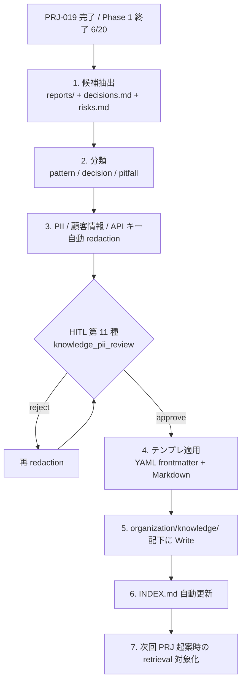
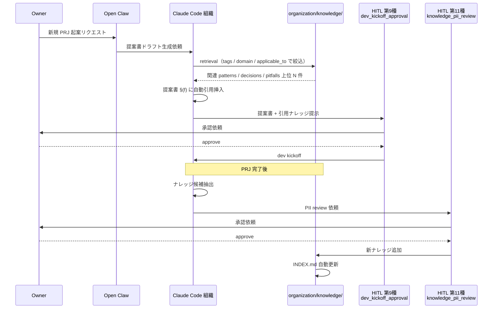

# PRJ-019 Clawbridge — 社内ナレッジ抽出仕様（organization/knowledge/ 反映）

- 案件: PRJ-019 Clawbridge
- 起票: Marketing 部門
- 対象: `organization/knowledge/` 配下 3 サブディレクトリ（patterns / decisions / pitfalls）への自動抽出フロー
- 関連:
  - `CLAUDE.md` §6 ナレッジ蓄積（DEC-019-033 拡張）
  - `projects/PRJ-019/decisions.md` DEC-019-033 §④
  - `projects/PRJ-019/reports/marketing-knowledge-reflection-design-v2.md`（v2 ナレッジ反映設計、本書はその抽出機構仕様化版）
  - `organization/knowledge/INDEX.md`
  - `organization/templates/lessons-learned-v2.md`
- ステータス: 設計確定（実装は PRJ-019 Phase 1 W4（5/26〜6/20 期間内）で Dev 部門が担当、CLAUDE.md §6 既定）

---

## §1. 抽出フロー全体像

CLAUDE.md §6 で規定された 3 サブディレクトリ（`patterns/` / `decisions/` / `pitfalls/`）への構造化蓄積を、Phase 1 で初期 10 件以上の知見として走らせる。HITL 第 11 種 `knowledge_pii_review`（DEC-019-033 §④）と連動した PII 保護を組込む。



### 1.1 フローの起動条件

| 起動条件 | 判定タイミング | 担当 |
|---|---|---|
| 案件 Phase 完了（PRJ-XXX が DONE 化） | dashboard 更新時 | PM |
| 重要 DEC（DEC-XXX で「ナレッジ抽出対象」フラグ） | DEC 起票時 | CEO |
| Owner 明示指示「この案件の知見を抽出して」 | 随時 | Owner → CEO |

---

## §2. HITL 第 11 種 `knowledge_pii_review` 連動仕様（DEC-019-033 §④）

ナレッジ抽出時の PII 漏洩防止用、R-019-16 への決定的対策として CEO が公式採択。Review 部門 ODR-OG-06 で正式化検討中。

### 2.1 ゲート仕様

| 項目 | 仕様 |
|---|---|
| ゲート ID | HITL-011 |
| ゲート名 | knowledge_pii_review |
| 起動タイミング | redaction 後、Write 前 |
| 入力 | 抽出候補 markdown（redaction 適用後）+ redaction 差分ログ |
| 判断者 | Owner（CEO 経由）、Marketing 補助、Review 監査 |
| 判断粒度 | approve / reject / partial（特定セクションのみ削除） |
| SLA | 3 営業日（DEC-019-033 §② SLA に準ずる） |
| escalation | 7 日経過で CEO に reminder、14 日で Owner エスカレーション |

### 2.2 redaction 自動ルール（事前適用）

| 種別 | パターン | 置換後 |
|---|---|---|
| メールアドレス | `[\w.+-]+@[\w-]+\.[\w.-]+` | `[REDACTED-EMAIL]` |
| API キー（OpenAI 系） | `sk-[A-Za-z0-9]{20,}` | `[REDACTED-APIKEY]` |
| API キー（Anthropic 系） | `sk-ant-[A-Za-z0-9-_]{20,}` | `[REDACTED-APIKEY]` |
| URL に含まれるトークン | `?token=[\w-]+` 等 | `?token=[REDACTED]` |
| 顧客名 / 個人名 | 案件 frontmatter に登録された人名一覧 | `[CLIENT-NAME]` |
| Slack / Discord webhook | `https://hooks\.slack\.com/[\w/]+` | `[REDACTED-WEBHOOK]` |
| AWS / GCP credentials | `AKIA[A-Z0-9]{16}` 等 | `[REDACTED-CLOUD]` |
| 内部社員名 | `organization/roles/` に未登録の固有名詞は保留 → HITL で確認 | `[INTERNAL-NAME]`（HITL 承認後） |
| BAN リスク具体数値 | `BAN.{0,10}\d+%` 等 | 「重大運用リスクを定量評価」に婉曲化（DEC-019-029 開示比率と整合） |

### 2.3 HITL 第 11 種の reject 時のフォールバック

reject されたコンテンツは破棄せず `organization/knowledge/.pending-pii/` に隔離し、再 redaction 後に再申請。3 回 reject で「公開不能」フラグを付与し社内限定 lessons-learned のみに反映。

---

## §3. Phase 1 で抽出すべき初期ナレッジ 10 件以上の候補リスト

`marketing-knowledge-reflection-design-v2.md` K1〜K10 を本仕様に従って 3 サブディレクトリに再分類し、初期 12 件として確定する。

| # | ID（仮） | 配置先 | type | タイトル | 出典 PRJ | 優先度 | HITL 11 必要性 |
|---|---|---|---|---|---|---|---|
| 1 | PATTERN-NNN-1 | `patterns/` | architecture | harness permission boundary（MUST/MUST-NOT 対の権限境界設計） | PRJ-019 | 最優先 | 中（具体仕様の 20% 非公開） |
| 2 | PATTERN-NNN-2 | `patterns/` | code | mock-first + TimeSource pattern | PRJ-019 | 最優先 | 低 |
| 3 | PATTERN-NNN-3 | `patterns/` | architecture | Owner-in-the-loop HITL 9〜11 種ゲート構成（DEC-019-033 §②③④） | PRJ-019 | 最優先 | 中 |
| 4 | PATTERN-NNN-4 | `patterns/` | architecture | 透明性 Dashboard（Supabase Realtime + RLS）構成 | PRJ-019 | 第二優先 | 中 |
| 5 | PATTERN-NNN-5 | `patterns/` | code | ナレッジ抽出機構（本仕様自身を pattern 化） | PRJ-019 | 第二優先 | 低 |
| 6 | DECISION-NNN-1 | `decisions/` | adr | 自社 PoC で商用 AI を直叩きせず harness 層を必ず挟む（K10 由来） | PRJ-019 | 最優先 | 中 |
| 7 | DECISION-NNN-2 | `decisions/` | adr | Owner-in-the-loop transparent AI org モデルへの正式変更（DEC-019-033 §①） | PRJ-019 | 最優先 | 低 |
| 8 | DECISION-NNN-3 | `decisions/` | adr | Casbin + Supabase RLS 二層防御の採択（DEC033-01 / DEC033-05） | PRJ-019 | 最優先 | 中 |
| 9 | DECISION-NNN-4 | `decisions/` | adr | 部分開示モード 80/50/100/概要（DEC-019-028 = Q-Mkt-05 採択） | PRJ-019 | 第二優先 | 中 |
| 10 | PITFALL-NNN-1 | `pitfalls/` | anti-pattern | multi-account による ToS 使用枠水増しの危険性（K8 由来、PRJ ID 伏字） | PRJ-XXX | 最優先 | 高（社外公開） |
| 11 | PITFALL-NNN-2 | `pitfalls/` | anti-pattern | OAuth トークン直 spawn の危険性（K9 由来、PRJ ID 伏字） | PRJ-XXX | 最優先 | 高（社外公開） |
| 12 | PITFALL-NNN-3 | `pitfalls/` | operational | 副作用ゼロ自動検証の grep フォールバック失敗パターン（PRJ-019 W0 で実検出） | PRJ-019 | 第二優先 | 低 |

### 3.1 Phase 1 完了時の最低ライン

12 件のうち **最優先 8 件**（PATTERN-NNN-1〜3 / DECISION-NNN-1〜3 / PITFALL-NNN-1〜2）を 6/20 完了時に必ず着地させる。第二優先 4 件は 6/27 公開までに整備し、ポートフォリオ §S5 Lessons Learned から内部リンクで参照可能にする。

---

## §4. 知見テンプレート 3 種

### 4.1 Pattern テンプレ（`patterns/PATTERN-NNN-{slug}.md`）

```yaml
---
id: PATTERN-NNN
type: pattern
category: architecture | code | ui
title: （パターン名）
source_prj: PRJ-019
source_decisions: [DEC-019-XXX, DEC-019-YYY]
tags: [harness, permission-boundary, owner-in-the-loop]
confidence: 0.85   # 0.0-1.0、横展開実績で更新
last_validated: 2026-06-20
applicable_to: [self-poc, web-app-receiving-order, mobile-app]
non_applicable_to: [client-on-prem-only]
hitl_pii_reviewed: true
hitl_pii_reviewer: Owner
hitl_pii_review_date: 2026-06-22
---

# {タイトル}

## 文脈（Context）
（このパターンが必要な状況、想定される課題）

## 構造（Structure）
（クラス図 / シーケンス図 / Mermaid 図）

## 適用例（Examples）
- PRJ-019 での適用: ...
- 他案件への横展開可能性: ...

## トレードオフ
- 採用したとき得るもの:
- 採用したとき失うもの:

## 関連パターン / 参照
- PATTERN-XXX
- DEC-XXX
- pitfall: PITFALL-XXX
```

### 4.2 Decision テンプレ（`decisions/DECISION-NNN-{slug}.md`）

```yaml
---
id: DECISION-NNN
type: adr
title: （判断のタイトル）
source_prj: PRJ-019
source_dec: DEC-019-XXX
tags: [tech-stack, architecture, risk-acceptance]
confidence: 0.90
last_validated: 2026-06-20
status: adopted | superseded | deprecated
superseded_by: null
hitl_pii_reviewed: true
---

# {タイトル}

## 文脈（Context）
（判断が必要になった背景、制約条件）

## 検討した代替案（Alternatives Considered）
1. 案 A: ... → 採用 / 不採用 + 理由
2. 案 B: ...
3. 案 C: ...

## 採用根拠（Rationale）
（なぜ A 案を選んだか、定量的・定性的根拠）

## 結果（Consequences）
- ポジティブ: ...
- ネガティブ: ...
- 中立: ...

## 検証可能な仮説（Validation Hypothesis）
- 「N 案件で同様の判断をした際に、X が成立するなら本判断は再採択可能」

## 関連
- 上位: DEC-XXX
- 関連 pattern: PATTERN-XXX
- 関連 pitfall: PITFALL-XXX
```

### 4.3 Pitfall テンプレ（`pitfalls/PITFALL-NNN-{slug}.md`）

DEC-019-033 §④ で「症状 + 原因 + 対処 + 再発防止策の 4 要素テンプレ」と規定。

```yaml
---
id: PITFALL-NNN
type: anti-pattern | operational | security
title: （落とし穴のタイトル）
source_prj: PRJ-XXX   # 部分匿名化（Q-Mkt-08 採択）
tags: [tos-violation, oauth, side-effect]
severity: critical | high | medium | low
confidence: 0.95
last_validated: 2026-06-20
hitl_pii_reviewed: true
hitl_pii_external_publish: true   # 社外公開可否
---

# {タイトル}

## 症状（Symptom）
（観察可能な現象、ログ / エラー / 挙動）

## 原因（Root Cause）
（なぜ発生するのか、5 Why 等で深掘り）

## 対処（Mitigation）
（既に発生した時の対処、復旧手順）

## 再発防止策（Prevention）
（チェックリスト追加 / 自動検知 / 訓練 / 設計変更）

## 検出方法（Detection）
（自動検知ルール、grep パターン、CI / lint）

## 関連
- 関連 DEC: DEC-XXX
- 関連 pattern（回避策）: PATTERN-XXX
- 関連 risk: R-XXX
```

---

## §5. 次回 PRJ 起案時の参照フロー（Open Claw → Claude Code → Owner 提案連動）

CLAUDE.md §6 で規定された「PRJ-019 Open Claw 提案生成（HITL 第 9 種 `dev_kickoff_approval` 直前）で `organization/knowledge/` を retrieval し、提案書テンプレ §(f) 既存ナレッジ参照に自動引用する」フローの具体化。



### 5.1 retrieval 戦略

| 戦略 | 内容 | 上位 N 件 |
|---|---|---|
| tag 一致 | 提案書 frontmatter の tags と nazi 一致 | 上位 5 件 |
| applicable_to 一致 | 案件カテゴリ（self-poc / web / mobile）一致 | 上位 5 件 |
| confidence 重み付け | confidence ≥ 0.80 のみ | フィルタ |
| 鮮度フィルタ | last_validated が 6 ヶ月以内 | フィルタ |
| 上位統合 | tag + applicable_to で OR 結合、confidence 降順 | 最終 上位 7 件 |

### 5.2 提案書テンプレ §(f) 既存ナレッジ参照の自動引用フォーマット

```markdown
## §(f) 既存ナレッジ参照（自動引用）

本提案は以下の既存ナレッジを参照しています。

### 適用予定パターン
- [PATTERN-006](organization/knowledge/patterns/PATTERN-006-harness-permission-boundary.md) — confidence 0.85, last_validated 2026-06-20

### 参照判断ログ
- [DECISION-001](organization/knowledge/decisions/DECISION-001-self-poc-harness-engineering.md) — 上位 ADR

### 回避すべき落とし穴
- [PITFALL-001](organization/knowledge/pitfalls/PITFALL-001-multi-account-tos-bypass.md) — severity: critical
- [PITFALL-002](organization/knowledge/pitfalls/PITFALL-002-oauth-token-spawn-direct.md) — severity: critical
```

---

## §6. メタデータ schema

YAML frontmatter の必須・任意フィールド一覧。

| フィールド | 型 | 必須 | 説明 |
|---|---|---|---|
| `id` | string | 必須 | PATTERN-NNN / DECISION-NNN / PITFALL-NNN 形式 |
| `type` | enum | 必須 | pattern / adr / anti-pattern / operational / security 等 |
| `title` | string | 必須 | 人間可読なタイトル |
| `source_prj` | string | 必須 | PRJ-XXX または `PRJ-XXX`（伏字） |
| `source_dec` | string | 任意 | 紐づく DEC ID |
| `source_decisions` | array | 任意 | 複数 DEC を引く場合 |
| `tags` | array | 必須 | 検索用 tag、kebab-case |
| `confidence` | float | 必須 | 0.0〜1.0、横展開実績で更新 |
| `last_validated` | date | 必須 | YYYY-MM-DD |
| `applicable_to` | array | pattern のみ必須 | self-poc / web-app-receiving-order / mobile-app 等 |
| `non_applicable_to` | array | 任意 | 適用不可ケース |
| `status` | enum | decision のみ必須 | adopted / superseded / deprecated |
| `superseded_by` | string\|null | decision のみ必須 | 後継 DECISION-NNN |
| `severity` | enum | pitfall のみ必須 | critical / high / medium / low |
| `hitl_pii_reviewed` | bool | 必須 | HITL 第 11 種承認済か |
| `hitl_pii_reviewer` | string | 任意 | 承認者 |
| `hitl_pii_review_date` | date | 任意 | 承認日 |
| `hitl_pii_external_publish` | bool | pitfall のみ任意 | 社外公開可否（Q-Mkt-08 採択時 true） |

### 6.1 INDEX.md 自動更新仕様

`organization/knowledge/INDEX.md` は新ナレッジ追加時に自動更新する。フォーマット：

```markdown
## patterns/
- PATTERN-006 — harness permission boundary [confidence 0.85, validated 2026-06-20]
- PATTERN-007 — mock-first + TimeSource [confidence 0.90, validated 2026-06-20]
...

## decisions/
- DECISION-001 — 自社 PoC harness engineering [adopted, validated 2026-06-20]
...

## pitfalls/
- PITFALL-001 — multi-account ToS bypass [severity: critical, external: true]
...
```

---

## §X 残課題

| # | 項目 | 担当 | 決裁タイミング |
|---|---|---|---|
| X1 | Review 部門 ODR-OG-06 による HITL 第 11 種正式化 | Review | 5/8 W0-Week1 検収会議 |
| X2 | retrieval の embedding 化（pgvector 等）採否 | Dev + Research | Phase 1 W4 |
| X3 | confidence 自動更新ロジック（横展開時の +0.05、reject 時の -0.10） | Dev | Phase 2 |
| X4 | 半年棚卸しのスケジュール化（last_validated > 180 days で再評価） | PM | 公開後 6 ヶ月 |

---

**起案**: Marketing Department / **最終更新**: 2026-05-03
