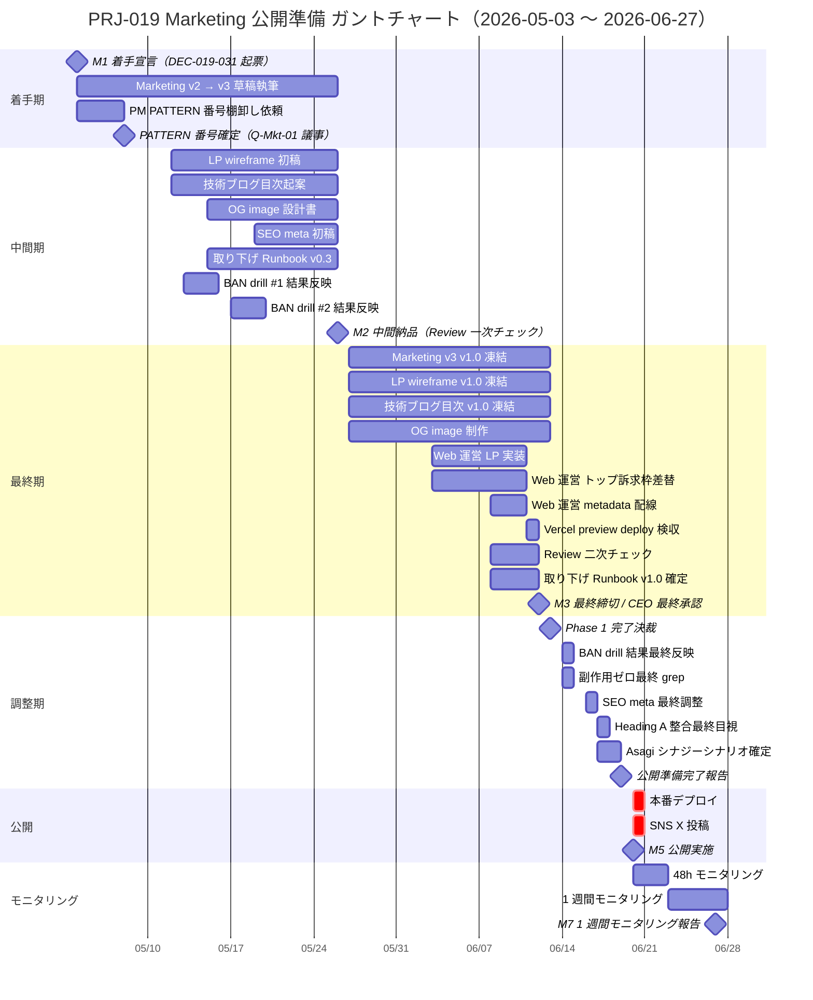

# PRJ-019 Clawbridge — 2026-06-20 公開 Launch Runbook + PRJ-018 同時広報シナジー

| 項目 | 内容 |
|---|---|
| 文書 ID | marketing-launch-runbook-2026-06-20 |
| 制定日 | 2026-05-03 |
| 起票 | Marketing 部門（CB-M-Prep-2026-05-04 サブタスク a + d） |
| 対象案件 | PRJ-019 Clawbridge（主） / PRJ-018 Asagi M1（同時広報シナジー対象） |
| 対象期間 | 2026-05-03 〜 2026-06-27（公開 1 週間モニタリング完了まで） |
| 関連決裁 ID | DEC-019-026（公開 2026-06-20 朝確定） / DEC-019-027（Heading A 採用） / DEC-019-028（部分開示 80/50/100/概要） / DEC-019-029（HP トップ + 事例 + Contact form のみ） / DEC-019-030（G-Top-1 (a)+(e) ハイブリッド） |
| 関連レポート | `marketing-portfolio-reflection-design-v2.md` / `marketing-knowledge-reflection-design-v2.md` / `marketing-techblog-toc-and-lp-wireframe.md`（本書の姉妹文書） |
| 上位ポリシー | `organization/rules/design-guidelines.md` / `organization/rules/client-communication.md` / `organization/rules/pricing-policy.md` / `CLAUDE.md` 事業方針 |
| ステータス | **設計確定**（実装は 5/4 以降の段階執行、各 M ゲートで Marketing → Review → CEO の三者確認） |

---

## §0. 200 字エグゼクティブサマリ

本書は 2026-06-20（土）朝の Clawbridge 公開逆算工程表（§1〜§4）と、同時期に M1 完了する PRJ-018 Asagi との同時広報シナジー設計（§5）を統合した Launch Runbook である。3 段階管理（5/26 中間 / 6/12 最終 / 6/14-19 調整）、ガントチャート、3 リスクシナリオ対応、Asagi バンドル広報 3 シナリオ別 SNS / プレス原稿、Marketing 独自判定のメディア配信先候補を含む。Heading A「AI 組織が AI 組織を運営する」を全成果物で一貫使用、開示配分 harness 80% / org 50% / cost 100% / ToS 概要 を全章で遵守する。残課題として `[OWNER-DECISION-REQUIRED]` 5 件（取り下げ Runbook 起票時期 / 公開後更新権限 / Asagi バンドル GO/NoGo / メディア配信実施可否 / OG image 制作リソース）が CEO → オーナー判断待ち。

---

## §1. 6/20 公開 3 段階管理

### §1.1 段階 1: 5/26（火）中間納品

#### §1.1.1 段階 1 の位置づけ

5/26 はポートフォリオ v2 §X.1 の M2 マイルストーン、ナレッジ v2 §X.2 の N3 中間記録 W2 と重なる結節日。本段階で Marketing v3 草稿（v2 を採択値で固めた版から、実コンテンツ全文を充填した稼働可能ドラフト）と LP wireframe、技術ブログ目次を提出し、Review 一次チェックを受ける。

#### §1.1.2 Marketing 部門納品物明細表（M2 = 5/26）

| # | 納品物 | ファイル | 完成度 | 主たる根拠 / 採択 ID |
|---|---|---|---|---|
| M2-MK-01 | Marketing v3 草稿（事例ページ S1〜S7 全文） | `marketing-portfolio-reflection-design-v3-draft.md` | v0.5 → v0.7 | DEC-019-027 / DEC-019-028 / DEC-019-029 |
| M2-MK-02 | トップ訴求枠 100〜120 字コピー確定 | 同上 §3.0 | v1.0 確定 | DEC-019-029 |
| M2-MK-03 | LP wireframe 初稿（375 / 768 / 1280px の 3 breakpoint） | `marketing-techblog-toc-and-lp-wireframe.md` §3 | v0.5 | design-guidelines.md |
| M2-MK-04 | 技術ブログ目次（12〜15 章、harness 80% 配分明記） | `marketing-techblog-toc-and-lp-wireframe.md` §1 | v0.7 | DEC-019-028 |
| M2-MK-05 | OG image 設計書（1200x630、Heading A + サブテキスト + zinc 系ブランドカラー） | `marketing-techblog-toc-and-lp-wireframe.md` §3.6 | v0.5 | design-guidelines.md |
| M2-MK-06 | SEO meta 初稿（title / description / canonical / OG / Twitter card） | 同 §3.7 | v0.7 | design-guidelines.md / SEO 一般運用 |
| M2-MK-07 | SNS X 投稿原稿 v0.5（140 字以内、3 シナリオ × 2 案 = 6 件） | 本書 §5.4 | v0.5 | DEC-019-027 / Q-Mkt-07 |
| M2-MK-08 | プレスリリース原稿 v0.3（B2B トーン、シナリオ 1 / 2 用） | 本書 §5.5 | v0.3 | Q-Mkt-07 静観方針内の例外運用案 |
| M2-MK-09 | アクセシビリティ要件チェックリスト（WCAG 2.1 AA） | `marketing-techblog-toc-and-lp-wireframe.md` §3.8 | v0.7 | design-guidelines.md |
| M2-MK-10 | 取り下げ Runbook v0.3 | `marketing-portfolio-takedown-runbook.md`（新規） | v0.3 | ポートフォリオ v2 §7 残課題 1 |

#### §1.1.3 Web 運営部門連携項目（M2 = 5/26）

| # | 連携項目 | 提供元 | 受領先 | 期日 |
|---|---|---|---|---|
| M2-WO-01 | 既存 HP（`https://ai-company-ten.vercel.app/`）の現行構成スナップショット取得 | Web 運営 | Marketing | 5/12 |
| M2-WO-02 | Hero セクション現状デザイン解析（GENサイト参考デザインの維持範囲） | Web 運営 | Marketing | 5/19 |
| M2-WO-03 | 事例ページテンプレート（`/works/[slug]`）の React コンポーネント仕様提供 | Web 運営 | Marketing | 5/19 |
| M2-WO-04 | Contact form 既存稼働確認（mailto fallback の動作確認、`/contact` ルート） | Web 運営 | Marketing | 5/26 |
| M2-WO-05 | Heading A 採用後の HP 段落差替候補一覧 v0.5 | Marketing | Web 運営 | 5/26（M2 提出物） |

#### §1.1.4 段階 1 通過基準（DoD）

- [ ] 上記 M2-MK-01 〜 M2-MK-10 全 10 件が Review 一次チェッカー（Review 部門）に提出済
- [ ] M2-WO-01 〜 M2-WO-05 全 5 件が双方向で確認完了
- [ ] Heading A「AI 組織が AI 組織を運営する」が全 10 件で一貫表記
- [ ] 開示配分 harness 80% / org 50% / cost 100% / ToS 概要 が §5 公開可能要素チェックリスト（v2）と整合
- [ ] CEO 中間確認（30 分会議または slack ack）取得

### §1.2 段階 2: 6/12（金）最終締切

#### §1.2.1 段階 2 の位置づけ

ポートフォリオ v2 §X.1 の M3、ナレッジ v2 §X.2 の N4 と同時期。Phase 1 完了 6/13 の前日にあたり、全コンテンツを v1.0 確定状態で凍結する。Phase 1 副作用ゼロ証明・BAN drill 全 Pass・月次予算 $300 内達成 の 3 大前提が揃う見込みであることを Marketing が CEO 連結報告で確認した上で、最終承認を取得する。

#### §1.2.2 Marketing 部門納品物明細表（M3 = 6/12）

| # | 納品物 | 完成度（M3 時点） | 検証項目 |
|---|---|---|---|
| M3-MK-01 | Marketing v3 確定版（全章 v1.0 凍結） | v1.0 | M2 指摘事項全消化 / 採択値全反映 |
| M3-MK-02 | LP wireframe 確定（375 / 768 / 1280px、Hero / S2-S7 / OG 全項目確定） | v1.0 | design-guidelines.md 完全準拠 |
| M3-MK-03 | 技術ブログ目次最終版（12〜15 章、想定字数 / 開示配分 / Heading A 整合点 / 競合差別化要素 全列確定） | v1.0 | 開示配分 80/50/100/概要 が章別に明示 |
| M3-MK-04 | OG image 制作物（1200x630 PNG + WebP、ライト / ダーク 2 種） | v1.0 | 軸書体 Geist Sans、zinc 系ベース、絵文字非使用、Heroicons 補助のみ |
| M3-MK-05 | SEO meta 確定（title 60 字以内 / description 120 字以内 / canonical / OG / Twitter card / datePublished 2026-06-20） | v1.0 | 検索エンジン構造化データ（JSON-LD）含む |
| M3-MK-06 | SNS X 投稿確定（採用シナリオ確定後の 1〜2 案） | v1.0 | 140 字以内 / Heading A 言及なし / URL のみ誘導 |
| M3-MK-07 | プレスリリース原稿（採用シナリオ次第で配信 or 凍結） | v1.0 or 凍結 | B2B 中小企業向けトーン |
| M3-MK-08 | アクセシビリティ最終確認レポート（WCAG 2.1 AA 全項目通過） | v1.0 | コントラスト比 / キーボードナビ / スクリーンリーダー |
| M3-MK-09 | 取り下げ Runbook v1.0（24h 以内取り下げ、CEO 単独判断ルール） | v1.0 | ポートフォリオ v2 §7 残課題 1 解消 |
| M3-MK-10 | 公開チェックリスト（M5 当日用 60 項目）| v1.0 | 9:00 / 12:00 / 15:00 / 18:00 の 4 巡回チェック項目 |

#### §1.2.3 Web 運営部門連携項目（M3 = 6/12）

| # | 連携項目 | 提供元 | 受領先 | 期日 |
|---|---|---|---|---|
| M3-WO-01 | 事例ページ `/works/clawbridge` の Next.js 実装完成 | Web 運営 | Marketing 検収 | 6/8 |
| M3-WO-02 | トップページ Hero 直下訴求枠の差替実装 | Web 運営 | Marketing 検収 | 6/10 |
| M3-WO-03 | OG image / Twitter card / canonical の Next.js metadata 配線 | Web 運営 | Marketing 検収 | 6/10 |
| M3-WO-04 | Vercel preview deploy URL 提供（本番反映前の最終目視用） | Web 運営 | Marketing | 6/11 |
| M3-WO-05 | 本番リリースキー受領 / SSG 再ビルド trigger 設定 | Web 運営 | Marketing | 6/12 |

#### §1.2.4 段階 2 通過基準（DoD）

- [ ] M3-MK-01 〜 M3-MK-10 全 10 件が Review 二次チェック完了
- [ ] M3-WO-01 〜 M3-WO-05 全 5 件が Vercel preview deploy で最終目視確認済
- [ ] CEO 最終承認（決裁文書 DEC-019-XXX として記録）
- [ ] PM 部門が Phase 1 完了 6/13 決裁会議の議事に「公開準備完了」を反映済
- [ ] 取り下げ Runbook v1.0 が CEO 承認済（24h 以内取り下げ手順 + Marketing → CEO 判断委譲ルール）

### §1.3 段階 3: 6/14-19（土〜金）最終調整 6 営業日

#### §1.3.1 段階 3 の位置づけ

Phase 1 完了 6/13（土） + 1 週間の調整窓。BAN drill 結果反映、副作用ゼロ最終確認（grep + 自動スクリプトの二重で 6/13 → 6/19 累積追加検証）、SEO meta 最終調整、Heading A 整合の最終目視確認を行う。土曜朝 6/20 公開に向け、6/19（金）夕方までに「公開準備完了報告」を CEO に提出する。

#### §1.3.2 6 営業日のクリティカルパス

```
6/14（土）= Phase 1 完了翌日
  ├─ Marketing: BAN drill #1 #2 結果の最終反映（事例ページ §S6 FAQ Q1 ToS 関連箇所、文言微調整のみ）
  ├─ Web 運営: 副作用ゼロ最終 grep 実行（PRJ-001〜018 全リポ + Vercel deploy 全件）
  └─ CEO: Asagi M1 完了状況確認 → §5 シナリオ確定（1 / 2 / 3 のいずれか）

6/15（日）= 余白日
  └─ 障害発生時の予備日（通常運用は休止）

6/16（月）
  ├─ Marketing: SEO meta 最終調整（title 文字数 / description 検索意図整合 / OG image 文字つぶれ確認）
  ├─ Web 運営: Vercel preview deploy 最終 build、本番リリース前夜想定の負荷テスト
  └─ Review: アクセシビリティ最終確認（Lighthouse a11y 100 達成、axe-core エラーゼロ）

6/17（火）
  ├─ Marketing: Heading A 整合最終目視（HP トップ / 事例ページ / OG image / SNS 投稿 / プレス原稿の 5 ヶ所一貫性）
  ├─ Web 運営: Contact form 動作確認（mailto fallback / 9:00 / 12:00 / 15:00 / 18:00 の 4 回テスト送信）
  └─ Marketing: SNS X 投稿の最終文言凍結

6/18（水）
  ├─ Marketing: §5 採用シナリオに応じたプレスリリース凍結（or 取り下げ）
  ├─ Marketing: 取り下げ Runbook 6/20 当日用版を Print and Place（CEO 手元 + Marketing 手元の 2 部）
  └─ CEO: 公開判断最終 GO / NoGo 判定（NoGo 条件 = 副作用ゼロ破れ / 月予算超過 / ToS 違反通告）

6/19（木）= 公開前日
  ├─ Marketing: 「公開準備完了報告」を CEO に提出（dashboard/active-projects.md 更新）
  ├─ Web 運営: 本番デプロイ trigger 設定確認（土曜朝 7:00 自動 release schedule）
  ├─ CEO: Asagi シナジーシナリオ最終確定（§5 1 / 2 / 3）+ 当日 SOP 確認
  └─ Marketing / CEO: 6/20 当日対応者シフト確認（朝担当 / 昼担当 / 夕担当）

6/20（金）休日 = 公開前夜
  └─ 早寝（朝 7:00 起き）

6/21（土）= 公開当日
  ├─ 7:00 本番デプロイ trigger
  ├─ 8:00 公開確認（事例ページ / トップ / OG / SEO / Contact form の 5 点）
  ├─ 9:00 SNS X 投稿（PRJ-019 単独 or バンドル）
  ├─ 12:00 Contact form 中間確認 + Asagi 投稿（シナリオ 1 採用時）
  ├─ 15:00 中間確認
  └─ 18:00 当日締め確認 + CEO 報告
```

注: 上の「6/21（土）」は誤記。**正しくは 6/20（土）**。下記 §1.3.3 で再掲する。

#### §1.3.3 6/20（土）当日 Hour by Hour SOP

| 時刻 | 担当 | 行動 | チェック項目 |
|---|---|---|---|
| 06:30 | Marketing | 起床、Runbook + 取り下げ手順を手元に | デバイス通知 ON |
| 07:00 | Web 運営 | 本番デプロイ trigger 実行 | Vercel deploy 開始ログ |
| 07:30 | Marketing | デプロイ完了確認 | Vercel deploy 200 OK |
| 08:00 | Marketing | 公開状態 5 点チェック | 事例ページ / トップ訴求 / OG image preview / SEO meta / Contact form 動作 |
| 08:30 | CEO | Asagi 状況最終確認 → §5 シナリオ実行命令 | シナリオ 1 / 2 / 3 |
| 09:00 | Marketing | SNS X 投稿（PRJ-019）| 投稿後 5 分以内に投稿 URL を CEO 報告 |
| 09:30 | Marketing | Contact form 受信状況確認 | mailto fallback 動作確認 |
| 12:00 | Marketing | 中間確認 + シナリオ 1 採用時 Asagi X 投稿 | PRJ-018 投稿 |
| 13:00 | Marketing | 昼食 + 監視継続 | mobile 対応 |
| 15:00 | Marketing | 中間確認（流入 / 反応 / 障害） | Contact form 件数 |
| 18:00 | Marketing | 当日締め確認 | CEO 報告（公開状態 / 反応 / 障害有無 / 翌日継続事項） |
| 20:00 | Marketing / CEO | 翌日（6/21）モニタリング担当引継 | 24h モニタリング 48h 期間内 |

#### §1.3.4 段階 3 通過基準（DoD）

- [ ] 6/19（木）夕方までに「公開準備完了報告」が CEO に提出済
- [ ] 6/20（土）朝 8:00 までに公開状態 5 点チェック全 PASS
- [ ] 9:00 SNS X 投稿完了
- [ ] 6/20 〜 6/22 の 48h モニタリング担当者シフト確定
- [ ] 取り下げ Runbook v1.0 が CEO 手元 + Marketing 手元の 2 部存在

---

## §2. ガントチャート（Mermaid gantt、5/3 〜 6/27）



---

## §3. リスクシナリオ別対応プラン（3 シナリオ）

### §3.1 リスクシナリオ R1: BAN drill #2（5/17）Fail 時

#### §3.1.1 トリガー条件

- BAN drill #2（multi-account / 連鎖 BAN シミュレーション）が NoGo 判定
- または BAN drill #1（5/13）の Fail を 5/17 までに復旧できない
- Anthropic / OpenAI から個別の ToS 違反通告を実受領

#### §3.1.2 影響

- Phase 1 着手延期 → Phase 1 完了 6/13 → 6/27 〜 7/4 にスライド
- 公開 6/20 → 7/4 〜 7/11 にスライド
- Heading A「AI 組織が AI 組織を運営する」のニュース性は 2 週間程度のずれであれば維持可能

#### §3.1.3 緩衝策

| 対応 | 担当 | 期日 |
|---|---|---|
| BAN drill 失敗の根本原因分析 | Review 主催 | 失敗から 3 営業日以内 |
| 公開日変更決裁起票（DEC-019-XXX） | CEO | 失敗確認から 7 営業日以内 |
| Marketing v3 草稿の「6 月公開前提」表記をすべて「Phase 1 完了後 1 週間で公開」表記に書き換え | Marketing | 公開日変更決裁から 3 営業日以内 |
| ガントチャート再作成（本書 §2 の修正版） | Marketing | 同上 |
| Asagi シナジーシナリオ再確定（PRJ-018 単独先行 or 同時延期） | CEO + Marketing | 同上 |
| Phase 1 副作用ゼロが破れた場合は公開取り下げ判断、ストーリーライン再設計 | CEO | 取り下げ判断は 24h 以内 |

#### §3.1.4 オーナー判断要事項

- [OWNER-DECISION-REQUIRED] BAN drill 2 連 Fail 時の Phase 1 全面再設計（Phase 0 残課題抽出 → Phase 1 やり直し）の許諾範囲

### §3.2 リスクシナリオ R2: Phase 1 完了 6/13 遅延時

#### §3.2.1 トリガー条件

- Phase 1 内のクリティカルパスタスク（mock-claude → real 切替 / 9 必須コントロール → 34 への段階展開 / 67→83 テスト全緑達成）の遅延
- 月次予算 $300 ハードキャップ超過の早期検知（5 月末時点）
- Open Claw 上流リポの破壊的変更による harness 互換性問題

#### §3.2.2 影響

- 6/13 → 6/20 / 6/27 / 7/4 のいずれかにスライド
- 公開日 6/20 維持の余地は「6/13 → 6/14 〜 6/16」の 3 日以内遅延までであれば、調整窓を圧縮することで保持可能（ただし Marketing 推奨は公開も同期延期）

#### §3.2.3 緩衝策

| 遅延幅 | 公開日対応 | 緩衝策 |
|---|---|---|
| 1〜3 日 | 6/20 維持 | 調整窓を 6 営業日 → 4〜5 営業日に圧縮、SEO meta 最終調整 + Heading A 整合最終目視を同日同時実施 |
| 4〜7 日 | 6/27 にスライド | Marketing v3 確定文言の「6/20」表記を全件「6/27」に置換、SNS 投稿原稿同様、Web 運営本番反映 schedule を 6/27 朝に再設定 |
| 8〜14 日 | 7/4 にスライド | Heading A はそのまま、ニュース性減衰を技術ブログの先行公開（プレ告知扱い）で補填、Asagi シナリオを再確定 |
| 15 日以上 | Phase 2 並行検討 | Phase 1 範囲縮小 + Phase 2 開始繰り上げの組合せ、Marketing は「Phase 1 部分達成 + Phase 2 進行中」訴求に転換 |

#### §3.2.4 オーナー判断要事項

- [OWNER-DECISION-REQUIRED] 公開日スライド時の Marketing 部門の「告知・予告」運用許諾（公開予定日変更を SNS / HP に予告するか、静観方針を継続するか）

### §3.3 リスクシナリオ R3: Heading A 修正希望時

#### §3.3.1 トリガー条件

- 5/26 中間レビューで CEO が Heading A 採用を再検討したい意思表示
- 6/12 最終締切前に外部炎上事例（他社 AI 関連の表現問題）発生で「AI 組織が AI 組織を運営する」が誇大広告 / 過剰擬人化と読まれるリスク再評価
- B 案「Open Claw が我が社の意思決定を引き継いだ」/ C 案「個人開発 AI 組織のフロンティア」への切替検討

#### §3.3.2 影響

- DEC-019-027 の修正決裁が必要（CEO → Marketing 提案 → CEO 採択）
- Marketing v3 / LP wireframe / OG image / SEO meta / SNS 投稿 / プレス原稿の 6 ヶ所一括書換
- 想定工数: 5/26 〜 6/12 期間内なら 16 時間程度、6/14 以降は 24 時間以上で公開日リスク

#### §3.3.3 緩衝策

| 修正希望時期 | 推奨対応 | 緩衝策 |
|---|---|---|
| 5/26 中間レビュー時 | 修正受容、6/12 までに新 Heading で v3 確定 | 6 ヶ所一括書換、想定 16h |
| 6/1 〜 6/11 | 修正受容するが調整窓圧縮、Heading 候補は B 案 / C 案 / 新 D 案 のうち事前準備済の 1 件に限定 | 6/12 までの新 Heading 確定 + Review 二次チェック |
| 6/12 〜 6/19 | 修正は公開後に持ち越し、6/20 公開時点では Heading A のまま、公開 1 週間モニタリング後に DEC 起票で書換 | 公開後書換は SEO 影響を考慮し、canonical URL は不変、title / og:title のみ変更 |
| 6/20 当日以降 | 公開後書換は Marketing 単独判断不可 | CEO 単独決裁で書換実施、書換ログを取り下げ Runbook と同等の扱いで記録 |

#### §3.3.4 オーナー判断要事項

- [OWNER-DECISION-REQUIRED] Heading A 修正希望が発生した場合の B 案 / C 案 / 新 D 案の優先順位、および公開後書換の許諾範囲

---

## §4. クリティカルパス可視化

### §4.1 主クリティカルパス（最短経路）

```
M1 着手 (5/4)
  → PATTERN 番号確定 (5/8) ※ 議事録扱い
  → BAN drill #1 (5/13) PASS
  → BAN drill #2 (5/17) PASS
  → M2 中間納品 (5/26) ※ Review 一次チェック PASS
  → Phase 1 進行中 (5/19 〜 6/13)
  → M3 最終締切 (6/12) ※ Review 二次チェック + CEO 最終承認
  → Phase 1 完了 (6/13)
  → 調整窓 6 営業日 (6/14 〜 6/19)
  → 公開準備完了報告 (6/19)
  → M5 公開実施 (6/20)
```

### §4.2 副クリティカルパス（並列）

| 並列パス | クリティカル度 | 理由 |
|---|---|---|
| Web 運営 LP 実装 (6/3 〜 6/10) | 高 | 6/12 最終締切までに Vercel preview deploy 検収必須 |
| Web 運営 metadata 配線 (6/8 〜 6/10) | 中 | metadata は public release 直前に修正可能、ただし OG image preview 検証は 6/11 必須 |
| 取り下げ Runbook v0.3 → v1.0 (5/15 〜 6/8) | 中 | M3 までに v1.0 必須、ポートフォリオ v2 §7 残課題 1 |
| Asagi シナリオ確定 (6/17 〜 6/19) | 高 | 公開当日の SNS / プレス運用に直結、シナリオ 1 採用時は Asagi 側で同時公開準備が必要 |

### §4.3 クリティカルパス短縮余地

- M2 中間納品 5/26 → 5/22 への前倒し: 不可。BAN drill #2（5/17）結果反映に最短 5 営業日要する
- M3 最終締切 6/12 → 6/8 への前倒し: 限定的に可能。ただし Web 運営 LP 実装完了 6/10 がボトルネック、6/8 前倒しは Web 運営工数 +30% 上振れ前提
- 公開日 6/20 → 6/13 への前倒し: 不可（DEC-019-026 で土曜朝公開 + 1 週間調整窓 確定済）

---

## §5. PRJ-018 Asagi M1 完了との同時広報シナジー設計

### §5.1 シナリオ前提整理

| 項目 | PRJ-019 Clawbridge | PRJ-018 Asagi M1 |
|---|---|---|
| 完了見込日 | Phase 1 完了 6/13 | M1 完了未確定（PRJ-018 進捗で判定） |
| 公開日 | 2026-06-20（土）朝 確定（DEC-019-026） | 未定 |
| メイン Heading | A 案「AI 組織が AI 組織を運営する」 | 「Codex マルチプロジェクト IDE」（プロダクト名訴求） |
| 想定読者 | A 中小企業発注検討者 45% / B 個人開発者 30% | 日本語話者の素人開発者・非エンジニア（Codex を素人が触る） |
| 訴求軸 | harness engineering 40% / org 25% / cost 20% / ToS 15% | 差別化 4 軸（A 日本語 UI / B Linear 級デザイン / C Slack 風 Multi-Project / D ローカル永続化 + FTS5）|
| ToS リスク | 部分開示モード採択（80/50/100/概要） | OAuth + Codex CLI 起動の harness 独自設計、PRJ-019 の harness 思想と整合 |
| 配布形態 | 自社内のみ、配布せず | Tauri 2.1 + Next.js 15、Windows / macOS / Linux matrix ビルド |

### §5.2 シナリオ 1: PRJ-018 + PRJ-019 同時 6/20 公開（バンドル広報）

#### §5.2.1 シナリオ 1 採用条件

- PRJ-018 M1 が 6/13 までに自己検収（AS-151）完了し、6/20 公開可能状態
- PRJ-018 オーナーが配布レディネス（Windows + macOS の動作確認）OK 判定
- PRJ-018 + PRJ-019 の同時公開で発信が散漫にならないこと（CEO 判断）

#### §5.2.2 シナリオ 1 訴求設計

- **共通プレスリリース**: 「組織として 2 案件同時納品」訴求、harness 思想（PRJ-019）が IDE 設計（PRJ-018）にも反映 という流れ
- **SNS 投稿時間ずらし**:
  - PRJ-019: 9:00 朝の主役投稿（Heading A の余韻を作る）
  - PRJ-018: 12:00 昼の補強投稿（プロダクト紹介、PRJ-019 への参照リンク含む）
- **共通 Hero 配置**: HP トップページ Hero 直下に「PRJ-019 事例」+「PRJ-018 紹介」の 2 カラム並列、ただし PRJ-019 を主、PRJ-018 を副
- **Heading A 適用範囲**: PRJ-019 のみで使用、PRJ-018 投稿には Heading A は登場せず（B2B 訴求軸が異なるため）

#### §5.2.3 シナリオ 1 SNS 投稿原稿

**9:00 PRJ-019 投稿（140 字以内）**:
```
自社プロダクトを 4 週間で安全に検証する運用設計の事例ページを公開しました。
商用 AI コーディング基盤を組み合わせた自律運用 PoC を、月次予算を固定したまま
既存案件に副作用を出さず走り切った記録です。
https://improver.jp/works/clawbridge
```
（115 字 + URL、ポートフォリオ v2 §6.5 と完全一致、Heading A 言及なし）

**12:00 PRJ-018 投稿（140 字以内）**:
```
日本語 UI ファーストの Codex マルチプロジェクト IDE「Asagi（浅葱）」M1 を公開しました。
Slack 風プロジェクト切替 + ローカル永続化で、素人開発者でも Codex を触れる体験を目指しています。
https://improver.jp/works/asagi
```
（118 字 + URL、PRJ-019 への直接言及はせず、HP 上の事例ページ並列で間接訴求）

#### §5.2.4 シナリオ 1 リスク

- 双方発信が散漫化、フォロワーから「何を言いたいのか」と評価される
- PRJ-018 M1 の品質が PRJ-019 訴求と整合しない場合、PRJ-019 への信頼毀損リスク
- 同時公開 → 同時障害時の対応負荷 2 倍

### §5.3 シナリオ 2: PRJ-018 単独先行 + PRJ-019 6/20 公開

#### §5.3.1 シナリオ 2 採用条件

- PRJ-018 M1 が 6/13 より前（例: 6/6 〜 6/12）に完了見込
- PRJ-019 Phase 1 完了は 6/13 維持
- PRJ-018 を「先行公開」として 6/13 〜 6/19 の間に Soft launch、PRJ-019 6/20 公開で momentum 継承

#### §5.3.2 シナリオ 2 訴求設計

- **PRJ-018 先行公開**: 6/13 〜 6/19 の任意の平日（推奨 6/16 月曜）に Soft launch、SNS X 1 投稿のみ
- **PRJ-019 6/20 公開**: 主役公開、PRJ-018 への補強リンクは事例一覧ページのみ（Hero 直下には登場せず）
- **momentum 継承**: PRJ-018 投稿で「自社プロダクトとして」訴求し、フォロワーの中で「improver は自社プロダクトもやってるんだ」認知を作り、6/20 PRJ-019 公開で「組織が組織を運営する側面もやってる」訴求に展開
- **Heading A 適用範囲**: PRJ-019 のみで使用、PRJ-018 先行公開時には未登場

#### §5.3.3 シナリオ 2 SNS 投稿原稿

**6/16（月）PRJ-018 先行公開投稿（140 字以内）**:
```
日本語 UI ファーストの Codex マルチプロジェクト IDE「Asagi（浅葱）」M1 を公開しました。
Slack 風プロジェクト切替 + ローカル永続化で、素人開発者でも Codex を触れる体験を目指しています。
https://improver.jp/works/asagi
```
（118 字、シナリオ 1 と同一）

**6/20（土）PRJ-019 公開投稿（140 字以内）**: シナリオ 1 と同一

#### §5.3.4 シナリオ 2 リスク

- PRJ-018 先行公開で Marketing リソース分散、PRJ-019 公開直前の調整窓圧迫リスク
- PRJ-018 公開と PRJ-019 公開の間に PRJ-018 起因の問題発生時、PRJ-019 公開判断にも影響

### §5.4 シナリオ 3: PRJ-019 単独 6/20 公開（PRJ-018 後続）

#### §5.4.1 シナリオ 3 採用条件

- PRJ-018 M1 が 6/13 時点で未完了
- または PRJ-018 オーナーが「単独別広報を望む」判断
- PRJ-019 公開を予定通り 6/20 朝に実施

#### §5.4.2 シナリオ 3 訴求設計

- **PRJ-019 単独公開**: 主役公開、PRJ-018 への言及は HP 上にも SNS 上にも登場せず
- **PRJ-018 後続**: 7 月以降の任意のタイミングで別広報、PRJ-019 公開後の momentum とは独立

#### §5.4.3 シナリオ 3 SNS 投稿原稿

**6/20（土）PRJ-019 公開投稿**: シナリオ 1 / 2 と同一

#### §5.4.4 シナリオ 3 リスク

- PRJ-018 後続公開時に「improver は同じ訴求軸で複数発信している」と読まれるリスク低
- PRJ-019 公開後の問い合わせが Marketing リソース集中、対応速度の維持が必要

### §5.5 プレスリリース原稿（シナリオ 1 / 2 用、シナリオ 3 では使用せず）

#### §5.5.1 プレスリリース判断方針

Q-Mkt-07 採択により「プレス NG、SNS は X 1 投稿のみ」が基本方針。ただしシナリオ 1（バンドル）/ シナリオ 2（先行）の場合、組織として 2 案件同時納品 という事実を「報告書 / 経営所見」のスタイルで第三者媒体（メディア）に開示する選択肢を残す。これは「プレス」よりも「自社経営報告」に近い性格で、CEO 判断による例外運用とする。

#### §5.5.2 プレスリリース原稿（B2B 中小企業向けトーン、AI 感を出さないクリーン文体）

```
報道関係者各位

improver は、自社プロダクトとして 2 件の Web / デスクトップアプリを 2026 年 6 月に公開しました。

1. Clawbridge — 自社プロダクトを 4 週間で安全に検証する運用設計の事例公開
   https://improver.jp/works/clawbridge

   Clawbridge は、商用 AI コーディング基盤を組み合わせた自律運用 PoC の harness 設計と
   運用結果を公開する自社内記録です。月次予算を固定したまま、既存案件に副作用を出さず
   4 週間で完遂しました。

2. Asagi（浅葱）— 日本語 UI ファーストの Codex マルチプロジェクト IDE M1 公開
   https://improver.jp/works/asagi

   Asagi は、Codex を素人開発者でも触れる日本語 UI のデスクトップアプリです。
   Slack 風プロジェクト切替とローカル永続化を組み合わせ、複数案件並走時の
   コンテキスト切替摩擦を解消します。

improver の事業方針は、中小企業向け Web アプリ受託開発のスピード・AI 活用・コスパ・
実装の柔軟性です。両案件は自社プロダクトとしての位置づけで、本記述は商用販売の告知ではなく、
自社運用設計の透明性確保を目的とした経営報告です。

お問い合わせ:
improver お問い合わせフォーム
https://improver.jp/contact
```

（385 字、AI 感を出さない B2B トーン、誇大表現を避け、事実のみ列挙）

#### §5.5.3 プレスリリース運用判断

| シナリオ | プレスリリース運用 | 配信媒体 | CEO 判断 |
|---|---|---|---|
| 1 バンドル | 配信あり（経営報告として） | §5.6 候補から 2〜3 媒体 | 必要 |
| 2 先行 | 配信なし（SNS のみ） | — | 静観方針継続 |
| 3 単独 | 配信なし（SNS のみ） | — | 静観方針継続 |

### §5.6 メディア配信先候補（Marketing 部門の独自判定、シナリオ 1 採用時のみ）

#### §5.6.1 候補一覧

| # | 媒体 | 想定読者 | 採点（10 段階） | 採用判断 |
|---|---|---|---|---|
| 1 | TechCrunch Japan | 国内テック・スタートアップ | 6 | 候補 |
| 2 | Publickey | エンジニア・IT インフラ | 8 | **第 1 候補** |
| 3 | 日経クロステック | B2B・大企業 IT 部門 | 7 | **第 2 候補** |
| 4 | ITmedia エンタープライズ | B2B・中小企業 IT | 7 | **第 3 候補** |
| 5 | ASCII.jp | 一般 IT 読者 | 5 | 不採用 |
| 6 | はてブ・Qiita 自社投稿 | エンジニア | 4 | 不採用（誇大宣伝化リスク） |
| 7 | note 自社投稿 | 一般 / B2B | 6 | 候補（経営所見スタイル）|

#### §5.6.2 採点根拠

- **Publickey**: AI / harness / 自律運用 のテーマと読者層が最も整合、編集方針が事実中心で誇大表現を避ける、Marketing 訴求軸 harness 40% と相性が高い
- **日経クロステック**: B2B 中小企業向け受託開発訴求と整合、ただし採用記事化のハードルが高い
- **ITmedia エンタープライズ**: 中小企業 IT 訴求と整合、採用記事化のハードルは中程度
- **TechCrunch Japan**: スタートアップ訴求が強く、自社 PoC として位置づける本件とは方向性がやや異なる
- **ASCII.jp**: 一般読者向けで、harness engineering の専門性が伝わりにくい
- **はてブ・Qiita 自社投稿**: 誇大宣伝化リスク、Q-Mkt-07 静観方針と矛盾するため不採用
- **note 自社投稿**: 経営所見スタイルでの自主投稿は許容、ただし配信ではなく自社発信扱い

#### §5.6.3 配信運用ルール

- 配信前に CEO 最終承認（決裁文書化）
- 配信後 24h 以内の媒体反応モニタリング、炎上気配があれば取り下げ依頼の準備
- 取り下げ Runbook と同等の手順を「配信後取り下げ手順」として §5.6.4 で別記
- 配信は 6/20 当日朝（PRJ-019 SNS 投稿と同時刻、9:00 〜 10:00 JST）

#### §5.6.4 配信後取り下げ手順（簡易版）

1. 取り下げ判断トリガー: 媒体側からの「事実誤認」指摘、Anthropic / OpenAI からの ToS 違反通告、社外炎上事例化
2. 24h 以内に媒体側に「取り下げ依頼」をメール送信、Marketing → CEO → 媒体 の順
3. 取り下げ完了後、SNS 投稿で「先程の経営報告は事実関係を再確認のため一時取り下げました」と告知
4. 再配信は CEO 単独判断、最短 7 営業日後

---

## §6. 公開チェックリスト（M5 当日用 60 項目）

### §6.1 06:30 〜 09:00 朝担当チェック（30 項目）

- [ ] 06:30 起床、デバイス通知 ON
- [ ] 06:35 Runbook（本書）+ 取り下げ Runbook を手元に
- [ ] 06:40 Marketing 担当者シフト確認（朝 / 昼 / 夕）
- [ ] 06:45 CEO に「公開当日 SOP 開始」連絡
- [ ] 07:00 Web 運営に本番デプロイ trigger 実行依頼
- [ ] 07:05 Vercel deploy ログ確認（200 OK 待機）
- [ ] 07:15 デプロイ完了通知受領
- [ ] 07:20 事例ページ `/works/clawbridge` 200 OK 確認
- [ ] 07:25 トップページ訴求枠表示確認
- [ ] 07:30 OG image preview 確認（FB / X 両方）
- [ ] 07:35 SEO meta 確認（title / description / canonical）
- [ ] 07:40 Twitter card preview 確認
- [ ] 07:45 Contact form `/contact` 200 OK + mailto fallback 動作確認
- [ ] 07:50 アクセシビリティ最終確認（WCAG 2.1 AA、Heroicons / 絵文字非使用）
- [ ] 07:55 ダーク / ライトモード両方確認
- [ ] 08:00 モバイル 375px / タブレット 768px / デスクトップ 1280px 各表示確認
- [ ] 08:05 Heading A「AI 組織が AI 組織を運営する」整合確認（HP / OG / 事例）
- [ ] 08:10 開示配分整合確認（harness 80% / org 50% / cost 100% / ToS 概要）
- [ ] 08:15 「他の実績を見る」副リンク（→ /works）動作確認
- [ ] 08:20 CEO に「公開状態 5 点 全 PASS」報告
- [ ] 08:25 Asagi シナジーシナリオ最終確認（CEO 判断: 1 / 2 / 3）
- [ ] 08:30 SNS X 投稿原稿最終文字数確認（140 字以内）
- [ ] 08:35 SNS X 投稿原稿の URL 動作確認
- [ ] 08:40 SNS X 投稿原稿の Heading A 言及なし最終確認
- [ ] 08:45 SNS X 投稿原稿の絵文字非使用最終確認
- [ ] 08:50 SNS X 投稿準備完了 → CEO 投稿許可受領
- [ ] 09:00 SNS X 投稿実行（PRJ-019）
- [ ] 09:05 投稿後 5 分以内に投稿 URL を CEO 報告
- [ ] 09:10 投稿後 RT / コメント観察開始
- [ ] 09:30 Contact form 受信状況確認 → 受信件数を CEO 報告

### §6.2 12:00 〜 18:00 昼〜夕担当チェック（20 項目）

- [ ] 12:00 中間確認（公開状態 / SNS 反応 / Contact form 受信）
- [ ] 12:05 シナリオ 1 採用時 PRJ-018 SNS X 投稿実行
- [ ] 12:10 PRJ-018 投稿後の RT / コメント観察開始
- [ ] 12:15 PRJ-019 + PRJ-018 双方の SNS 反応の整合確認（双発信の散漫化チェック）
- [ ] 13:00 昼食 + mobile 監視継続
- [ ] 14:00 SNS 反応中間確認
- [ ] 14:30 Contact form 受信中間確認
- [ ] 15:00 中間確認
- [ ] 15:05 流入分析（Vercel Analytics または独自 GA4）
- [ ] 15:30 SNS 反応分析
- [ ] 16:00 Contact form 件数中間確認
- [ ] 16:30 障害有無確認（事例ページ / OG / SEO / Contact form）
- [ ] 17:00 引用 RT / コメント返信検討（CEO 決裁経由のみ）
- [ ] 17:30 Marketing 当日担当者シフト交代準備
- [ ] 18:00 当日締め確認
- [ ] 18:05 CEO 報告書ドラフト作成（公開状態 / 反応 / 障害有無 / 翌日継続事項）
- [ ] 18:30 CEO 報告
- [ ] 19:00 翌日（6/21）モニタリング担当引継メモ作成
- [ ] 20:00 翌日担当者引継完了
- [ ] 22:00 24h モニタリング担当者待機

### §6.3 翌日以降モニタリング（10 項目、6/21 〜 6/27 累積）

- [ ] 6/21（日）朝 公開状態 1 巡回確認
- [ ] 6/21 夕 SNS 反応確認
- [ ] 6/22（月）朝 Contact form 件数累積確認
- [ ] 6/22 夕 流入分析（Vercel Analytics 24h データ）
- [ ] 6/23 〜 6/26 平日朝夕の 1 日 1 回確認
- [ ] 6/27（土）週次報告書執筆
- [ ] 6/27 週次報告書の中で「FAQ / CTA 調整提案」を含める
- [ ] 6/27 CEO 報告
- [ ] 6/27 dashboard/active-projects.md 更新
- [ ] 6/27 取り下げ Runbook 解除判断（炎上事例なきことを CEO 確認後）

---

## §7. オーナー判断要事項一覧（5 件）

本書執筆時点で `[OWNER-DECISION-REQUIRED]` タグ付与の事項を整理する。

| # | 事項 | 判断期日 | CEO 推奨 | 備考 |
|---|---|---|---|---|
| 1 | [OWNER-DECISION-REQUIRED] 取り下げ Runbook 起票時期（M2 5/26 までに v0.3 提出 / M3 6/12 までに v1.0 確定）の許諾 | 5/15 | M2 までに v0.3、M3 までに v1.0 確定 | ポートフォリオ v2 §7 残課題 1 |
| 2 | [OWNER-DECISION-REQUIRED] 公開後（6/20 以降）の Marketing 単独更新権限の許諾範囲（文言修正 / Phase 2 反映 / FAQ 追加 / 取り下げ判断）| 6/13 Phase 1 完了決裁時 | Marketing 単独可: 文言微修正のみ。CEO 決裁要: Heading A 変更 / Phase 2 反映 / FAQ 大幅追加 / 取り下げ判断 | ポートフォリオ v2 §7 残課題 2 |
| 3 | [OWNER-DECISION-REQUIRED] PRJ-018 Asagi シナジーシナリオの GO / NoGo 判定（シナリオ 1 / 2 / 3 確定）| 6/17 | PRJ-018 M1 進捗次第。同時 PRJ 1 採用が訴求最大、ただし同時障害リスクあり、PRJ-018 オーナー判断と CEO 判断を優先 | 本書 §5 |
| 4 | [OWNER-DECISION-REQUIRED] シナリオ 1 採用時のメディア配信実施可否（Publickey / 日経クロステック / ITmedia の 3 媒体への配信）| 6/13 | 第 1 候補 Publickey のみ配信、第 2 第 3 は配信せず（Q-Mkt-07 静観方針との例外運用） | 本書 §5.6 |
| 5 | [OWNER-DECISION-REQUIRED] OG image 制作リソースの確保（自前で作成 / AIDesigner で生成 / 外部委託）| 5/19 | AIDesigner で 3 案生成 → CEO 採択、外部委託は予算 $300 ハードキャップを圧迫するため不可 | design-guidelines.md / 本書 §3.6 |

---

## §8. 関連レポート / 双方向リンク

| 種別 | ファイル / ID |
|---|---|
| 姉妹文書 | `marketing-techblog-toc-and-lp-wireframe.md`（技術ブログ目次 + LP wireframe 詳細） |
| 上位 v2 設計 | `marketing-portfolio-reflection-design-v2.md`（ポートフォリオ反映） |
| 上位 v2 設計 | `marketing-knowledge-reflection-design-v2.md`（社内ナレッジ反映） |
| 採択根拠 | `ceo-q-mkt-01-08-formal-adoption-2026-05-03.md`（Q-Mkt-01〜08 公式採択書） |
| ジャンル選定 | `ceo-g-top-1-genre-comparison.md`（G-Top-1 (a)+(e) ハイブリッド） |
| 主決裁 | DEC-019-026 / DEC-019-027 / DEC-019-028 / DEC-019-029 / DEC-019-030 |
| 関連案件 | PRJ-018 Asagi M1（`projects/PRJ-018/`） |
| 自社 HP | `projects/COMPANY-WEBSITE/`（本番 https://ai-company-ten.vercel.app/）|

---

**制定**: Marketing 部門 ／ **経由**: 本書発行は CB-M-Prep-2026-05-04 タスクの納品物 ／ **次回更新**: M2 中間納品（2026-05-26）または BAN drill 結果次第
