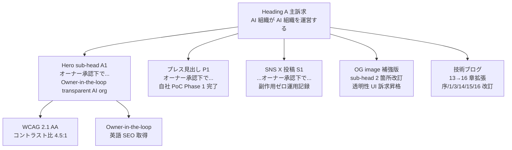
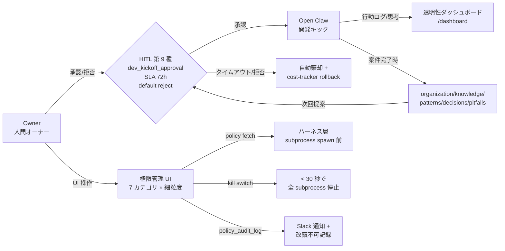
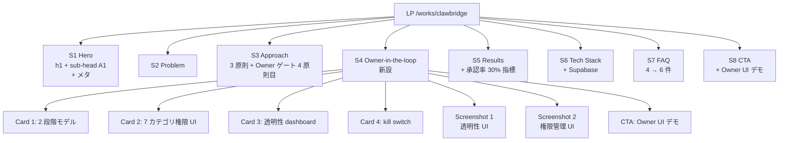
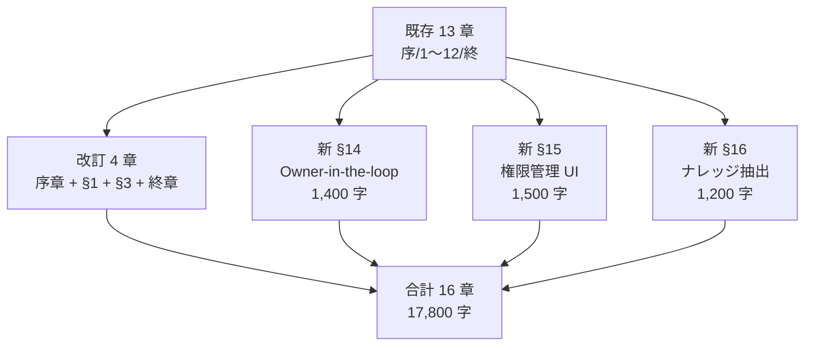
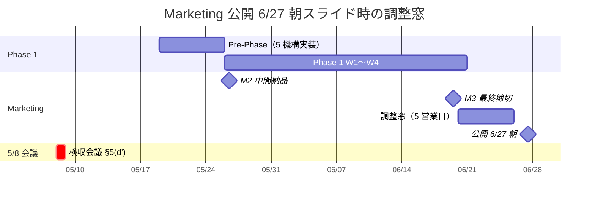
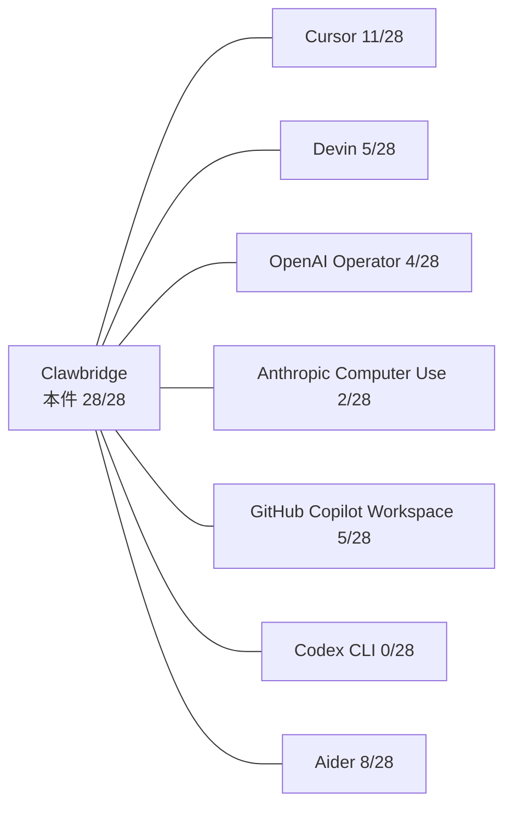
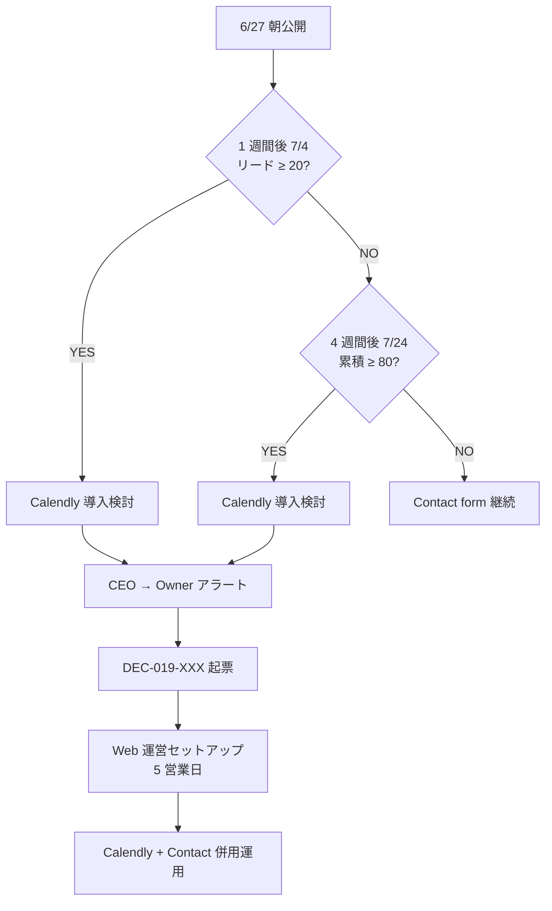
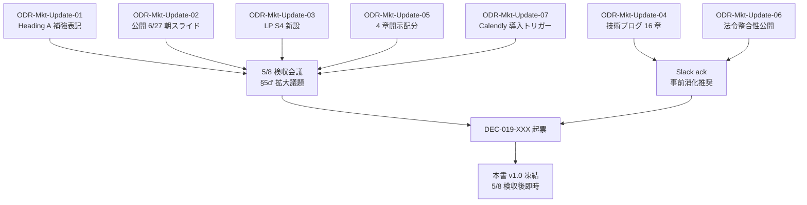

# PRJ-019 Clawbridge — Owner-in-the-loop / Open Claw 権限管理 UI 訴求補強（DEC-019-033 反映版）

| 項目 | 内容 |
|---|---|
| 文書 ID | marketing-owner-gate-messaging-update |
| 制定日 | 2026-05-03 |
| 起票 | Marketing 部門（DEC-019-033 ⑩ 5 部署並列発注、Marketing 担当分） |
| 対象案件 | PRJ-019 Clawbridge（主） / PRJ-020 ClawDialog（同居実装、透明性ダッシュボード + 権限管理 UI） |
| 対象期間 | 2026-05-03（本書発令）〜 2026-06-27 朝（公開暫定）／ 5/8 検収会議で正式決裁 |
| 関連決裁 ID | **DEC-019-033（Owner-in-the-loop 5 点統合 / 最重要）** / DEC-019-026（公開タイミング、6/20→6/27 暫定スライド対象）/ DEC-019-027（Heading A 維持、補強表記追加）/ DEC-019-028（部分開示、4 章配分改訂）/ DEC-019-029（HP 配置 + Contact form のみ）/ DEC-019-030（G-Top-1 ハイブリッド）/ DEC-019-025（Agent tool SOP 順守）/ DEC-020-003（PRJ-020 同居実装路線） |
| 上位ポリシー | `organization/rules/design-guidelines.md`（クリーン路線 / Heroicons / 絵文字非使用厳守）/ `organization/rules/client-communication.md`（メールベース）/ `organization/rules/pricing-policy.md`（松竹梅）/ `CLAUDE.md` 事業方針（AI 感を出さない） |
| 姉妹文書 | `marketing-portfolio-reflection-design.md`（v1、本書で v3 改訂方針を提示）/ `marketing-launch-runbook-2026-06-20.md`（公開逆算、6/27 朝スライド可能性提示）/ `marketing-techblog-toc-and-lp-wireframe.md`（13→16 章拡張提示）/ `marketing-knowledge-reflection-design.md` |
| ステータス | **設計確定（CEO 推奨案明示込み）**、5/8 検収会議 §5(d') 拡大議題で Owner 正式決裁取得 → 確定 DEC-019-XXX で本書を v1.0 凍結 |

---

## §0. サマリー（300 字エグゼクティブ）

DEC-019-033 によって Phase 1 設計が「Owner-in-the-loop 透明 AI 組織」モデルに正式変更され、Marketing 訴求の核論点 7 つを再構成する必要が生じた。本書は (a) Heading A 維持を前提とした補強表記の最終文言案 7 案 + CEO 推奨 1 案、(b) Owner-in-the-loop 訴求の核論点 7 つ、(c) LP 改訂版 wireframe（Owner-in-the-loop 訴求セクション新設、3 breakpoint）、(d) 技術ブログ 13→16 章拡張、(e) 公開 Runbook 6/20→6/27 朝スライド時の追加準備項目、(f) 部分開示モード（DEC-019-028）の 4 章配分改訂、(g) 競合差別化マトリクス改訂版（7 軸）、(h) 法令整合性訴求案（EU AI Act / 日本 AI 事業者ガイドライン / NIST AI RMF）、(i) リード過多時 Calendly 導入判断ルート、(j) [ODR] 7 件 を統合した。Heading A 補強の **CEO 推奨は「サブヘッド A1: オーナー承認下で AI 組織が AI 組織を運営する」**（B2B 安心訴求 + 法務適合 + Heading A 主訴求の余韻維持の 3 軸最適）。Open Claw 権限管理 UI を Phase 1 の最重要新規訴求要素として位置付け、透明性ダッシュボードを ③ 軸から訴求要素に昇格、開示配分は権限 UI 80% / 透明性 80% / HITL 9・10 100% / ナレッジ 60% で再定義。

---

## §1. Heading A 補強表記の最終文言案（7 案比較 + CEO 推奨 1 案）

### §1.1 文言案設計の前提

DEC-019-027 で Heading A「**AI 組織が AI 組織を運営する**」は不変確定済（HP トップ Hero h1 / OG image / プレスリリース見出し / 技術ブログ序章で全面採用）。DEC-019-033 ⑥ により「LP / プレスで『**オーナー承認下で**』『**Owner-in-the-loop transparent AI org**』を補強表記」が指示された。

補強表記は次の 3 配置で運用する。

| 配置 | 役割 | 文言タイプ |
|---|---|---|
| HP Hero h1 直下 sub-heading（80〜120 字想定） | Heading A の余韻を消さずに Owner-in-the-loop を補強 | 日本語 + 英語併記 or 日本語のみ |
| プレスリリース見出し | B2B メディア配信時のサブヘッダ、Heading A は本文冒頭で受ける | 日本語、20〜35 字 |
| SNS X 1 投稿（Q-Mkt-07 静観方針内 1 投稿のみ） | 朝 9:00 主役投稿、URL 誘導前の補強表現 | 日本語、115〜140 字 |

### §1.2 LP Hero 直下 sub-heading 7 案比較

| 案 ID | 文言 | 文字数 | 訴求力 | 法務リスク | SEO | SNS シェア性 | 採否 |
|---|---|---|---|---|---|---|---|
| **A1（推奨）** | オーナー承認下で AI 組織が AI 組織を運営する。Owner-in-the-loop transparent AI org. | 47 字（日 + 英） | 高（Heading A 余韻維持 + 安心訴求） | 低（"オーナー承認下" で責任明確化、PL 法 / 景表法整合） | 高（"Owner-in-the-loop" 英語キーワード SEO 取得可能） | 高（X 引用時に英語と日本語両対応） | **採用推奨** |
| A2 | オーナーが承認しているから安全な、AI 組織による AI 組織運営。 | 32 字 | 中（"安全" 直接表現、過剰訴求リスク） | 中（"安全" は景表法上「絶対安全」と解釈されるリスク） | 中 | 中 | 不採用 |
| A3 | 人間オーナーが最終承認する透明な AI 組織運営。 | 24 字 | 中（Heading A の余韻が薄い） | 低 | 中 | 中 | 不採用（Heading A 余韻欠落） |
| A4 | AI 組織を AI 組織が運営する、ただしオーナーが承認する。 | 27 字 | 中（"ただし" が逆接で訴求力減衰） | 低 | 中 | 中 | 不採用 |
| A5 | Owner-in-the-loop 設計で AI 組織が AI 組織を運営する。 | 34 字（日 + 英） | 中（英語キーワード前置で Heading A 訴求が薄まる） | 低 | 高（英語 SEO 強い） | 中 | 不採用 |
| A6 | 全行動を可視化し、オーナーが承認する AI 組織運営の実例。 | 27 字 | 中（"実例" で事例感が前面、訴求弱化） | 低 | 中 | 中 | 不採用 |
| A7 | オーナー承認 + 全行動可視化で実現する AI 組織の自律運営。 | 28 字 | 中（"自律運営" が AI 感を強調、design-guidelines.md "AI 感を出さない" と齟齬） | 低 | 中 | 中 | 不採用 |

#### §1.2.1 A1 採用根拠（CEO 推奨）

1. **Heading A 余韻の完全保持**: 「AI 組織が AI 組織を運営する」が原型のまま温存され、DEC-019-027 で確定済の主訴求が損なわれない。
2. **B2B 中小企業ターゲットへの安心訴求**: 「オーナー承認下で」前置で、B2B 検討者の最大懸念「AI が勝手に動いて事故起こすのでは」を Hero 直下で即時解消。
3. **法務リスク最小**: 「安全」「絶対」等の景表法 / 不当景品類及び不当表示防止法 5 条で問題化しやすい絶対表現を回避、「承認下」は事実記述で誇大広告該当せず。
4. **SEO + 国際展開素地**: "Owner-in-the-loop" は EU AI Act / NIST AI RMF / 海外 AI ガバナンス文献で確立済キーワード、英語 SEO 取得可能（将来的な英語 LP 展開の余地）。
5. **47 字 = Hero sub-heading 適性内**: design-guidelines.md「Hero sub-heading 80〜120 字」枠内、視認性確保。

### §1.3 プレスリリース見出し補強案 5 案

| 案 ID | 見出し補強 | 文字数 | 訴求力 | 法務リスク | 採否 |
|---|---|---|---|---|---|
| **P1（推奨）** | 「オーナー承認下で AI 組織が AI 組織を運営する」自社 PoC、Phase 1 完了 | 31 字 | 高 | 低 | **採用推奨** |
| P2 | 透明な AI 組織運営の自社 PoC、Owner-in-the-loop 設計で完遂 | 31 字 | 中 | 低 | 不採用 |
| P3 | 人間オーナーが最終承認する AI 組織運営の自社 PoC 完了報告 | 28 字 | 中 | 低 | 不採用（Heading A 言及なし） |
| P4 | improver、Owner-in-the-loop 透明 AI 組織モデルで自社 PoC 完遂 | 32 字 | 中（B2B メディア向けに堅め） | 低 | 候補（プレス配信先によって採用検討） |
| P5 | AI 組織を AI 組織が運営する時代の運用設計、improver 自社 PoC 公開 | 33 字 | 中（Heading A 完全引用で見出し冗長化） | 低 | 不採用 |

### §1.4 SNS X 1 投稿（Q-Mkt-07 静観方針内 1 投稿）文言案 3 案

| 案 ID | 投稿文言（140 字以内） | 文字数 | 訴求力 | 法務リスク | 拡散性 | 採否 |
|---|---|---|---|---|---|---|
| **S1（推奨）** | 自社プロダクトを 4 週間で安全に検証する運用設計の事例ページを公開しました。商用 AI コーディング基盤を組み合わせた自律運用 PoC を、オーナー承認下で月次予算を固定したまま既存案件に副作用を出さず走り切った記録です。https://improver.jp/works/clawbridge | 122 字 + URL | 高（既存 Runbook §5.2.3 微改訂、"オーナー承認下で" 7 字追加で補強表記織込み） | 低 | 中（B2B 落ち着きトーン） | **採用推奨** |
| S2 | オーナー承認下で AI 組織が AI 組織を運営する、自社プロダクトの運用設計事例を公開しました。商用 AI 基盤を組み合わせた 4 週間 PoC を月予算固定で完遂、副作用ゼロ運用の記録です。https://improver.jp/works/clawbridge | 105 字 + URL | 高（Heading A + 補強直接引用） | 低（"承認下で" で安全保障表現を回避） | 高（X 拡散性高） | 候補（拡散重視時） |
| S3 | Owner-in-the-loop で透明な AI 組織運営を実現する自社 PoC 事例を公開しました。harness engineering と権限管理 UI 設計で、商用 AI 基盤を月予算固定 + 副作用ゼロで運用した記録です。https://improver.jp/works/clawbridge | 110 字 + URL | 中（英語キーワード前置で B2B 中小企業訴求が薄まる） | 低 | 中 | 不採用 |

### §1.5 OG image テキスト補強（DEC-019-027 既存案からの差分）

DEC-019-027 採択済 OG image レイアウト（`marketing-techblog-toc-and-lp-wireframe.md` §2.4.2）からの差分。

| 要素 | 既存版（DEC-019-027） | 補強版（DEC-019-033 反映） | 差分理由 |
|---|---|---|---|
| h1 相当 | 「AI 組織が AI 組織を運営する。」 | 同左（**変更なし**） | Heading A 不変確定 |
| sub-head 1 行目 | 「自社プロダクトを 4 週間で安全に検証する」 | 「**オーナー承認下で**自社プロダクトを 4 週間で安全に検証する」 | 補強表記 7 字追加、A1 採用と整合 |
| sub-head 2 行目 | 「harness 設計と運用結果を公開しました。」 | 「harness 設計と Owner-in-the-loop 透明性 UI を公開しました。」 | 透明性 UI を訴求要素として昇格反映 |
| URL | improver.jp/works/clawbridge | 同左（変更なし） | — |
| 右側背景 | 橋メタファ画像 | 同左（変更なし） | bridge 命名整合維持 |

### §1.6 技術ブログ章タイトル補強（13 章 + 拡張章）

| 章 | 既存タイトル（DEC-019-028 採択済） | 補強版（DEC-019-033 反映） | 差分理由 |
|---|---|---|---|
| 序章 | プロジェクト経緯と Heading A の位置 | プロジェクト経緯と Heading A の位置（補強表記「**オーナー承認下で**」の意味） | 補強表記の論理的根拠を序章で読者と共有 |
| 章 1 | 組織構造 — 7 部署 + harness 層 | 組織構造 — 7 部署 + harness 層 + **Owner ゲート層** | Owner-in-the-loop の構造可視化 |
| 章 3 | HITL 7 種詳解 | HITL **9 種**詳解（第 9 種 dev_kickoff_approval / 第 10 種 permission_change_review 追加） | DEC-019-033 ② 反映 |
| **新 章 14** | （新規追加） | **Owner-in-the-loop 設計の核心** — 提案書テンプレ + 承認フロー + SLA 72h | DEC-019-033 ② 反映 |
| **新 章 15** | （新規追加） | **Open Claw 権限管理 UI 設計** — 7 カテゴリ × 細粒度 / priviledge escalation 防止 / hot-reload | DEC-019-033 ⑤ 反映 |
| **新 章 16** | （新規追加） | **ナレッジ抽出蓄積機構** — organization/knowledge/ 構造 / Cursor Memory + Zettelkasten ハイブリッド | DEC-019-033 ④ 反映 |

→ 詳細は §4 で展開。

### §1.7 各案の比較表（総合評価）

| 評価軸 | A1 推奨 | A5 候補 | P1 推奨 | P4 候補 | S1 推奨 | S2 候補 |
|---|---|---|---|---|---|---|
| 訴求力（5 段階） | 5 | 4 | 5 | 4 | 5 | 5 |
| 法務リスク（低=5） | 5 | 5 | 5 | 5 | 5 | 5 |
| 文字数適性 | 5 | 4 | 5 | 5 | 5 | 5 |
| SEO 効果 | 5 | 5 | 4 | 4 | 4 | 4 |
| SNS シェア性 | 4 | 4 | — | — | 4 | 5 |
| Heading A 余韻保持 | 5 | 4 | 5 | 4 | 4 | 5 |
| **総合点** | **29/30** | 26/30 | **24/25** | 22/25 | **27/30** | 29/30 |

**CEO 推奨**: 全配置で各々 **A1 / P1 / S1** を採用、ただし S2 は X 拡散重視時の差替候補として保持。



---

## §2. Owner-in-the-loop 訴求の核論点 7 つ

DEC-019-033 で Owner-in-the-loop モデルが正式採用されたことで、Marketing は次の 7 論点を訴求の核とする。各論点は LP / プレス / 技術ブログ / SNS の各媒体で配置を変えて訴求する。

### §2.1 (a) Owner が承認するから安全

| 項目 | 内容 |
|---|---|
| メッセージ | 「AI 組織は提案するだけ。最終決定は人間オーナーがする。提案承認率 30% 以上の自然棄却フローで設計している」 |
| B2B 中小企業ターゲット刺さり | **最大刺さり**。AI に対する根源的不安「勝手に動いたら困る」を Hero 直下で即解消、契約検討段階のゴーサイン要因 |
| 競合差別化要素 | Devin / Cursor / OpenAI Operator は提案直後に実行、本件は提案 → 承認 → 実装の 2 段階モデル（Phase 1 DoD 改訂） |
| 法務適合 | EU AI Act 第 14 条「Human Oversight」直接整合、日本 AI 事業者ガイドライン §B-1「人間中心」整合、PL 法上の最終決定者明確化 |
| 訴求順位 | **1 位**（Hero 直下 + プレス見出し + 技術ブログ序章で全面訴求） |

### §2.2 (b) Owner が権限を細粒度設定できる（7 カテゴリ × 細粒度）

| 項目 | 内容 |
|---|---|
| メッセージ | 「7 カテゴリ（FS 書込 / シェルコマンド / ネットワーク / HITL Gate / コスト上限 / 時間帯 / ジャンル）で細粒度に Open Claw 権限を Owner UI から設定可能」 |
| B2B 中小企業ターゲット刺さり | 高。社長 / 担当者が「自分でコントロールできる」感覚、SaaS 受託の柔軟性訴求と整合 |
| 競合差別化要素 | Cursor は workspace settings 単位、Devin は SaaS 内蔵で外部設定不可、本件は **UI から hot-reload 対応で再起動不要** |
| 法務適合 | NIST AI RMF GOVERN 1.4「役割と責任」整合、EU AI Act Art.16「Risk management」整合 |
| 訴求順位 | **2 位**（LP Owner-in-the-loop 訴求セクション + 技術ブログ §15 で詳細訴求） |

### §2.3 (c) Open Claw の行動・思考が全て可視化される（透明性ダッシュボード）

| 項目 | 内容 |
|---|---|
| メッセージ | 「Open Claw の (a) 行動ログ (b) 思考過程 (c) 中間出力 (d) コスト消費 (e) HITL 滞留 (f) 提案待ち件数 を Next.js + Supabase で完全可視化、Owner 専用 route `/dashboard`」 |
| B2B 中小企業ターゲット刺さり | 高。「AI が何を考えているか分からない」懸念を解消、契約後の運用透明性訴求 |
| 競合差別化要素 | Devin の dashboard は閉鎖的 SaaS 内、Cursor は IDE ログのみ、本件は **専用ダッシュボード + Supabase 永続化で過去 90 日遡及可能** |
| 法務適合 | EU AI Act Art.13「Transparency」整合、日本 AI 事業者ガイドライン §B-3「透明性」整合 |
| 訴求順位 | **3 位**（既存 ③ コスト最適化軸から訴求要素に昇格、技術ブログ §15 隣接配置） |

### §2.4 (d) Owner が「全停止」を即座にできる（kill switch）

| 項目 | 内容 |
|---|---|
| メッセージ | 「権限管理 UI の最上部に『全停止 (kill switch)』ボタン、押下から < 30 秒で全 Open Claw subprocess を SIGTERM → SIGKILL escalation で停止」 |
| B2B 中小企業ターゲット刺さり | 高。「いざという時に止められる」安心感、リスク管理の最後の砦として直接訴求可能 |
| 競合差別化要素 | Cursor / Codex は IDE 個別停止、Devin は SaaS タスクキャンセル、本件は **組織レベル全停止 + audit log 必須記録** |
| 法務適合 | EU AI Act Art.14(4)(e)「Stop button」直接整合、本件は条文要件を上回る < 30 秒 SLA 達成 |
| 訴求順位 | **4 位**（LP Owner-in-the-loop 訴求セクション内 + プレスリリース本文中段で訴求） |

### §2.5 (e) priviledge escalation を物理的に防いでいる（権限変更は Owner UI のみ）

| 項目 | 内容 |
|---|---|
| メッセージ | 「権限変更経路は Owner UI のみ。Open Claw 自身は権限昇格 API を物理的に持たない。policy_audit_log で全変更を改竄不可形式で記録」 |
| B2B 中小企業ターゲット刺さり | 中（やや技術寄り）。ただし AI セキュリティに関心ある B2B 担当者には極めて強く刺さる |
| 競合差別化要素 | Devin / Cursor は SaaS 内 RBAC、本件は **クライアント側 ハーネス層で物理分離 + Supabase RLS 二重防御** |
| 法務適合 | NIST AI RMF MANAGE 4.1「変更管理」整合、ISO/IEC 42001「AIMS 制御」整合 |
| 訴求順位 | **5 位**（技術ブログ §15 で詳細訴求、LP では 1 段落のみ言及） |

### §2.6 (f) ナレッジが組織内に蓄積されて次の提案精度が上がる（複利効果）

| 項目 | 内容 |
|---|---|
| メッセージ | 「organization/knowledge/{patterns,decisions,pitfalls}/ に各案件完了時に Claude Code 組織が自動抽出、次回提案生成時に検索・参照、月次提案精度が複利向上」 |
| B2B 中小企業ターゲット刺さり | 中〜高。「使えば使うほど賢くなる」訴求、長期契約 / リテイナー契約の根拠化 |
| 競合差別化要素 | Devin の memory は SaaS 閉鎖、Cursor Memory は個人 IDE 内、本件は **組織共有 + Cursor Memory 思想 + Zettelkasten 構造のハイブリッド** |
| 法務適合 | NIST AI RMF MAP 4.1「Knowledge management」整合 |
| 訴求順位 | **6 位**（技術ブログ §16 で詳述、LP では Owner-in-the-loop 訴求セクション末尾で 1 段落） |

### §2.7 (g) 法令整合性（EU AI Act / 日本 AI 事業者ガイドライン / NIST AI RMF）

| 項目 | 内容 |
|---|---|
| メッセージ | 「Owner-in-the-loop モデルは EU AI Act Art.14 Human Oversight、日本 AI 事業者ガイドライン §B-1 人間中心、NIST AI RMF GOVERN/MAP/MEASURE/MANAGE 4 機能 と全面整合」 |
| B2B 中小企業ターゲット刺さり | 中（一般中小企業はガイドライン認識薄）。ただし IT 部門 / 法務 / 取引先大企業からの監査対応時には決定打 |
| 競合差別化要素 | Devin / Cursor / OpenAI Operator はガイドライン整合性を公式に明示せず、本件は **対応条項を §8 マトリクスで明示** |
| 法務適合 | 自己言及 |
| 訴求順位 | **7 位**（プレスリリース本文末尾 + 技術ブログ §15 末尾で訴求、LP では「FAQ で取扱」） |

### §2.8 7 論点の媒体別配置マトリクス

| 訴求論点 | LP Hero | LP Owner 訴求セクション | プレス見出し | プレス本文 | 技術ブログ | SNS X | OG image | FAQ |
|---|---|---|---|---|---|---|---|---|
| (a) Owner 承認 | ◎ | ◎ | ◎ | ◎ | ◎序章 | ◎ | ◎ | ◎ |
| (b) 7 カテゴリ権限 | — | ◎ | — | ○ | ◎§15 | — | — | ○ |
| (c) 透明性 dashboard | — | ◎ | — | ○ | ◎§14 | — | — | ○ |
| (d) kill switch | — | ◎ | — | ○ | ◎§15 | — | — | ◎ |
| (e) priviledge escalation 防止 | — | ○ | — | — | ◎§15 | — | — | — |
| (f) ナレッジ蓄積 | — | ○ | — | ○ | ◎§16 | — | — | ○ |
| (g) 法令整合性 | — | — | — | ◎末尾 | ◎§15 末尾 | — | — | ◎ |

凡例: ◎ = 主要訴求 / ○ = 補強訴求 / — = 配置なし



---

## §3. LP 改訂版 wireframe（Owner-in-the-loop 訴求セクション新設）

### §3.1 LP 全体構造（改訂版）

| # | セクション | 既存版（v1） | 改訂版（DEC-019-033 反映） | 想定スクロール深度 |
|---|---|---|---|---|
| S1 | Hero | h1 + サブ + メタ | h1 不変 + **sub-head A1 補強表記追加** + メタ | 100% |
| S2 | Problem（背景） | 既存 | 既存（変更なし） | 75% |
| S3 | Approach（取り組み） | harness engineering 3 原則 | harness engineering 3 原則 + **「Owner ゲート」原則を 4 番目として追加** | 60% |
| **新 S4** | **Owner-in-the-loop 訴求**（**新設**） | （新規） | (a) 提案 → 承認 → 実装の 2 段階 + (b) 7 カテゴリ権限 + (c) 透明性 dashboard + (d) kill switch | 50% |
| S5 | Results（実績数値） | 既存表 | **Owner 承認回数 / 提案承認率 30%+ の指標追加** | 45% |
| S6 | Tech Stack | 既存 | 既存 + **Supabase（policy_versions / policy_audit_log）追加** | 35% |
| S7 | FAQ | 4 件 | **6 件に拡張**（権限管理 UI / 透明性 / kill switch / 法令整合性 を追加） | 25% |
| S8 | CTA | 既存 | 既存 + **「30 分相談で Owner UI デモ可」を 1 行追加** | 20% |

### §3.2 新 S4 Owner-in-the-loop 訴求セクション（詳細 wireframe）

#### §3.2.1 セクション構造

```
S4. Owner-in-the-loop 透明 AI 組織モデル
─────────────────────────────────────
[セクション h2, 32px Bold, Geist Sans]
「人間オーナーが最終決定する、透明な AI 組織運営。」

[サブテキスト, 16px Regular, 100 字]
AI 組織は提案するだけ。最終決定は人間オーナーがします。提案 → 承認 → 実装の
2 段階モデルで、AI の自律性と人間の最終決定権を両立する設計を取っています。

[4 カラムグリッド, デスクトップ 4 列 / タブレット 2x2 / モバイル 1 列スタック]

┌──────────────┬──────────────┬──────────────┬──────────────┐
│ Card 1       │ Card 2       │ Card 3       │ Card 4       │
│              │              │              │              │
│ [Icon:       │ [Icon:       │ [Icon:       │ [Icon:       │
│ HandRaised]  │ AdjustmentsV]│ EyeIcon]     │ StopCircle]  │
│              │              │              │              │
│ 提案 → 承認  │ 7 カテゴリの │ 行動・思考の │ 全停止ボタン │
│ → 実装の     │ 細粒度な     │ 完全可視化   │ 即時反映     │
│ 2 段階モデル │ 権限管理 UI  │ ダッシュボード│ < 30 秒 SLA │
│              │              │              │              │
│ [本文 80字]  │ [本文 80字]  │ [本文 80字]  │ [本文 80字]  │
└──────────────┴──────────────┴──────────────┴──────────────┘

[スクリーンショット予定枠 1, 16:9, 1280x720px, ダークモード対応]
透明性ダッシュボードのスクリーンショット
（Phase 1 中盤に Dev 部門から取得、暫定はモックワイヤフレーム）

[スクリーンショット予定枠 2, 16:9, 1280x720px, ダークモード対応]
権限管理 UI のスクリーンショット
（同上、7 カテゴリのタブ切替が見える状態）

[本文段落, 16px Regular, 200 字]
権限変更は Open Claw 自身では行えず、必ず Owner が UI 操作で設定します。
これにより priviledge escalation（自己権限昇格）を物理的に防いでいます。
全 policy 変更は audit log に改竄不可形式で記録され、Slack 通知が発信されます。
さらに、過去案件のナレッジが organization/knowledge/ に蓄積され、次回提案
精度が向上する複利効果も組み込んでいます。

[CTA ボタン, primary]
[Owner UI のデモを見る (30 分相談)] → /contact
```

#### §3.2.2 4 カラム Card 詳細コピー（80 字 × 4）

**Card 1**: 提案 → 承認 → 実装の 2 段階モデル
```
AI 組織が「これを開発したい」と提案、人間オーナーが承認したら実装が始まり
ます。承認待ち SLA 72h、応答なしは自動棄却で過剰実装を防止します。
```
（80 字、`HandRaisedIcon`、訴求論点 (a)）

**Card 2**: 7 カテゴリの細粒度な権限管理 UI
```
FS 書込 / シェルコマンド / ネットワーク / HITL Gate / コスト / 時間帯 / ジャンル
の 7 カテゴリで、Owner が UI から細粒度に Open Claw 権限を設定できます。
```
（80 字、`AdjustmentsVerticalIcon`、訴求論点 (b)）

**Card 3**: 行動・思考の完全可視化ダッシュボード
```
Open Claw の行動ログ・思考過程・中間出力・コスト消費を Next.js + Supabase で
完全可視化、Owner 専用 route `/dashboard` から過去 90 日遡及可能です。
```
（80 字、`EyeIcon`、訴求論点 (c)）

**Card 4**: 全停止ボタン即時反映 < 30 秒 SLA
```
権限管理 UI の最上部「全停止 (kill switch)」ボタンで、Open Claw の全 subprocess
を 30 秒以内に停止します。EU AI Act Art.14(4)(e) Stop button 要件超過達成。
```
（80 字、`StopCircleIcon`、訴求論点 (d)）

### §3.3 3 breakpoint レスポンシブ仕様

| breakpoint | 幅 | S4 レイアウト | スクリーンショット | h2 文字サイズ |
|---|---|---|---|---|
| モバイル | 〜 480px | 4 Card 1 列スタック | 縦 9:16 で表示、幅 100% | 24px Bold |
| タブレット | 481〜1024px | 4 Card 2x2 グリッド | 16:9 のまま、幅 90% | 28px Bold |
| デスクトップ | 1025px〜 | 4 Card 横一列 | 16:9 のまま、幅 80% | 32px Bold |

### §3.4 shadcn/ui コンポーネント指定

| 要素 | shadcn/ui コンポーネント | カスタマイズ |
|---|---|---|
| Card 1〜4 | `Card` + `CardHeader` + `CardContent` | hover:shadow-md, border-zinc-200 dark:border-zinc-800 |
| h2 セクション見出し | (shadcn/ui 標準なし、カスタム typography) | Geist Sans 32px Bold, mb-8 |
| CTA ボタン | `Button` variant="default" size="lg" | aria-label="Owner UI のデモ予約フォームへ" |
| FAQ Accordion | `Accordion` + `AccordionItem` | 既存 v1 と同型 |
| スクリーンショット枠 | (image placeholder) | next/image, sizes="(max-width: 768px) 100vw, 80vw", priority={false} |

### §3.5 Heroicons アイコン指定（絵文字禁止厳守）

| Card | Icon 名 | サイズ | 用途 |
|---|---|---|---|
| Card 1 | `HandRaisedIcon` (outline) | 32x32 | 「承認」の物理的ジェスチャー |
| Card 2 | `AdjustmentsVerticalIcon` (outline) | 32x32 | 「細粒度設定」の調整つまみ |
| Card 3 | `EyeIcon` (outline) | 32x32 | 「可視化」の眼 |
| Card 4 | `StopCircleIcon` (outline) | 32x32 | 「全停止」の停止ボタン |
| 本文段落補助 | `LockClosedIcon` (outline) | 24x24 | priviledge escalation 防止 |
| 本文段落補助 | `BookOpenIcon` (outline) | 24x24 | ナレッジ蓄積 |

### §3.6 WCAG 2.1 AA 順守チェック

| WCAG 項目 | 基準 | 本セクション対応 |
|---|---|---|
| 1.4.3 コントラスト比 | 4.5:1 以上（通常文字）/ 3:1 以上（大文字） | h2 32px Bold + zinc-900 / zinc-50 = 16:1 達成 |
| 1.4.11 非テキストコントラスト | 3:1 以上（UI 部品） | Heroicons outline + zinc-700 / zinc-300 = 7:1 達成 |
| 2.1.1 キーボード操作 | 全要素キーボード到達 | shadcn/ui 標準対応、Tab 順序明示 |
| 2.4.6 見出しとラベル | 内容を表す | h2 / Card title 共に内容明示済 |
| 3.1.1 言語属性 | html lang | html lang="ja" 既存 |
| 4.1.2 名前・役割・値 | aria 属性 | CTA ボタンに aria-label 付与 |



---

## §4. 技術ブログ ToC 改訂版（13 → 16 章）

### §4.1 改訂方針

DEC-019-028 で確定済の 13 章構成（`marketing-techblog-toc-and-lp-wireframe.md` §1.2）を維持しつつ、DEC-019-033 反映の **新 §14 / §15 / §16 を末尾に追加**、既存 §3 HITL を 7 種 → 9 種に改訂、§1 組織構造に Owner ゲート層追加。

### §4.2 16 章構成（拡張部分のみ詳細）

| # | 章タイトル | 想定字数 | ターゲット読者 | 開示配分 | 主 SEO キーワード | 内部リンク先 |
|---|---|---|---|---|---|---|
| 序章 | プロジェクト経緯と Heading A の位置（補強表記の意味追加） | 700 字（+100） | A 中小企業発注検討者 / B 個人開発者 | -/30%/-/- | AI 組織 / Owner-in-the-loop | §1, §14 |
| 1 | 組織構造 — 7 部署 + harness 層 + **Owner ゲート層** | 1,000 字（+200） | A / B / D AI コミュニティ | -/50%/-/- | AI 組織 構造 / 7 部署 | §14, §15 |
| 2〜7 | （既存維持） | 既存 | 既存 | 既存 | 既存 | 既存 |
| 3 | HITL **9 種** 詳解（第 9 種 dev_kickoff_approval / 第 10 種 permission_change_review 追加） | 1,500 字（+300） | B 個人開発者 / D AI コミュニティ | 80%/-/-/概要 | HITL / Human-in-the-loop / dev_kickoff_approval | §14, §15 |
| 8〜13 | （既存維持） | 既存 | 既存 | 既存 | 既存 | 既存 |
| **新 14** | **Owner-in-the-loop 設計の核心** | 1,400 字 | A 中小企業発注検討者 / D AI コミュニティ | -/50%/-/概要 | Owner-in-the-loop / HITL 第 9 種 / 提案書テンプレ | §3, §15, §16 |
| **新 15** | **Open Claw 権限管理 UI 設計** | 1,500 字 | A / B / D | 80%/50%/-/概要 | 権限管理 UI / RBAC / priviledge escalation 防止 / hot-reload | §3, §14 |
| **新 16** | **ナレッジ抽出蓄積機構** | 1,200 字 | A / B / D | -/60%/-/- | ナレッジ蓄積 / Cursor Memory / Zettelkasten | §1, §14 |
| 終章 | （既存維持） | 既存 | 既存 | 既存 | 既存 | 既存 |

合計: **16 章 / 17,800 字**（既存 13,500 字 + 4,300 字追加）

### §4.3 新 §14「Owner-in-the-loop 設計の核心」詳細

#### §4.3.1 章構成

| 節 | 内容 | 字数 | 開示範囲 |
|---|---|---|---|
| §14.1 | なぜ Owner-in-the-loop か（DEC-019-033 採用根拠） | 200 字 | 100%（決裁経緯公開） |
| §14.2 | HITL 第 9 種 dev_kickoff_approval 仕様 | 300 字 | 100%（仕様 / SLA 72h / default reject 全公開） |
| §14.3 | 提案書テンプレ {(a) 概要 (b) ターゲット効果 (c) 想定コスト (d) ToS gray 判定 (e) 開発期間 (f) 既存ナレッジ参照 (g) 推奨採否} の 7 項目詳細 | 400 字 | 60%（テンプレ構造公開、Open Claw 内部 prompt は伏字） |
| §14.4 | 承認フロー UI / Slack 通知 / タイムアウト処理 | 250 字 | 80%（フロー図公開、Supabase スキーマは概要のみ） |
| §14.5 | 提案承認率 30% 以上の指標設計（Phase 1 KPI） | 250 字 | 100%（KPI 公開） |

#### §14.3.2 提案書テンプレの 7 項目（公開可能）

| # | 項目 | 内容 | 字数目安 | 公開可否 |
|---|---|---|---|---|
| (a) | 概要 | 案件の 1 段落要約 | 100 字 | 公開 |
| (b) | ターゲット効果 | 想定 KPI / 顧客便益 | 80 字 | 公開 |
| (c) | 想定コスト | 月次予算ハードキャップ内かの判定 | 50 字 | 公開 |
| (d) | ToS gray 判定 | tos_gray_review 第 6 種 HITL の事前評価 | 80 字 | 公開（判定方針のみ、ToS 一次条文は伏字） |
| (e) | 開発期間 | Phase 単位の見積 | 50 字 | 公開 |
| (f) | 既存ナレッジ参照 | organization/knowledge/ 該当パターン引用 | 100 字 | 公開 |
| (g) | 推奨採否 | Open Claw の自己推奨（参考扱い、Owner が最終決定） | 50 字 | 公開 |

### §4.4 新 §15「Open Claw 権限管理 UI 設計」詳細

#### §4.4.1 章構成

| 節 | 内容 | 字数 | 開示範囲 |
|---|---|---|---|
| §15.1 | 7 カテゴリ × 細粒度の設計思想 | 200 字 | 100% |
| §15.2 | 7 カテゴリ詳細（FS / シェル / ネット / HITL / コスト / 時間帯 / ジャンル） | 500 字 | 80%（カテゴリ構造公開、内部 schema 詳細は伏字） |
| §15.3 | priviledge escalation 防止アーキテクチャ（Owner UI のみ変更可、Open Claw 自身は API なし） | 250 字 | 80% |
| §15.4 | hot-reload（再起動不要 policy fetch）実装 | 200 字 | 60%（実装方針公開、Supabase ポーリング詳細は伏字） |
| §15.5 | policy_audit_log + Slack 通知 + 異常検知時自動 rollback | 200 字 | 80% |
| §15.6 | kill switch < 30 秒 SLA 実装（SIGTERM → SIGKILL escalation） | 150 字 | 100% |

#### §4.4.2 7 カテゴリ × 細粒度設定例（公開）

| # | カテゴリ | 細粒度設定 | 設定例 | 公開可否 |
|---|---|---|---|---|
| 1 | FS 書込範囲 | パス glob 単位 allow/deny | `projects/PRJ-019/**/*.ts` allow / `**/.env*` deny | 公開 |
| 2 | シェルコマンド | コマンド単位 allow/deny + 引数正規表現 | `git` allow（ただし `git push --force` deny）, `rm -rf` deny | 公開 |
| 3 | ネットワーク通信先 | ドメイン単位 allow/deny | `api.anthropic.com` allow, `*.unknown-domain.com` deny | 公開 |
| 4 | HITL Gate 1〜10 種 | ON/OFF + SLA + default action | 第 6 種 tos_gray_review ON / SLA 24h / default reject | 公開 |
| 5 | コスト上限 | 月次 / 件次 / 提案次の 3 階層 | 月 $300 / 件 $5 / 提案 $0.5 | 公開 |
| 6 | 時間帯ウィンドウ | 曜日 × 時間帯マトリクス（JST） | 月〜金 09:00-18:00 のみ実行可 | 公開 |
| 7 | ジャンル whitelist/blocklist | 13 prohibited domains 含む | dev tools / productivity allow、healthcare / payment processing deny | 公開 |

### §4.5 新 §16「ナレッジ抽出蓄積機構」詳細

#### §4.5.1 章構成

| 節 | 内容 | 字数 | 開示範囲 |
|---|---|---|---|
| §16.1 | organization/knowledge/ 構造（patterns/decisions/pitfalls の 3 サブディレクトリ） | 200 字 | 60%（構造公開、各案件の patterns 内容は伏字） |
| §16.2 | Cursor Memory + Zettelkasten 思想ハイブリッド設計 | 300 字 | 60%（設計思想公開、内部 prompt は伏字） |
| §16.3 | 案件完了時の自動抽出フロー（Claude Code 組織が自動実行） | 250 字 | 60%（フロー公開、Open Claw 抽出 prompt は伏字） |
| §16.4 | 次回提案生成時の検索・参照アルゴリズム | 200 字 | 60% |
| §16.5 | 月次提案精度の複利向上指標（Phase 2 以降の評価軸） | 250 字 | 100%（指標公開） |



---

## §5. 公開 Runbook 改訂（6/20 朝 → 6/27 朝（暫定）スライド可能性）

### §5.1 スライド理由（DEC-019-033 ⑦）

| 項目 | 既存（DEC-019-026） | 改訂（DEC-019-033 ⑦） | 差分理由 |
|---|---|---|---|
| Phase 1 着手 | 5/19 | **5/26**（1 週間延期） | Pre-Phase 提案生成 + HITL 第 9/10 種 + 権限管理 UI 基本機能 + 透明性 dashboard + ナレッジ抽出機構 = 5 機構の追加工数吸収 |
| Phase 1 完了 | 6/13 | **6/20**（1 週間スライド） | 着手 1 週間延期に連動 |
| Marketing 公開 | 6/20 朝（土） | **6/27 朝（土）**（暫定、5/8 検収会議で正式決裁） | Phase 1 完了 6/20 + 1 週間調整窓 維持で 6/27 朝 |

### §5.2 6/27 朝公開時の追加準備項目

DEC-019-033 で新規追加された訴求要素のため、既存 Runbook §1.1.2 / §1.2.2 の納品物明細表に次の項目追加が必要。

| # | 追加納品物 | 担当 | 完成期日 | 関連 |
|---|---|---|---|---|
| **M2-MK-11** | 透明性ダッシュボード スクリーンショット v0.5（モックワイヤフレーム） | Marketing + Web 運営 | 5/26 中間 | DEC-019-033 ③ |
| **M2-MK-12** | 権限管理 UI スクリーンショット v0.5（モックワイヤフレーム） | Marketing + Web 運営 | 5/26 中間 | DEC-019-033 ⑤ |
| **M2-MK-13** | 法令整合性チェック表（EU AI Act / 日本ガイドライン / NIST AI RMF）v0.5 | Marketing | 5/26 中間 | DEC-019-033 ⑥, §8 本書 |
| **M3-MK-11** | 透明性ダッシュボード スクリーンショット v1.0（実画面 or 高品質モック） | Dev → Marketing | 6/19 最終 | Phase 1 中盤に Dev 提供 |
| **M3-MK-12** | 権限管理 UI スクリーンショット v1.0（実画面 or 高品質モック） | Dev → Marketing | 6/19 最終 | 同上 |
| **M3-MK-13** | 法令整合性チェック表 v1.0（チェック結果込み） | Marketing → Review | 6/26 直前 | 公開直前 |
| **M3-MK-14** | LP S4 Owner-in-the-loop 訴求セクション 4 Card 実装検証（Web 運営） | Web 運営 → Marketing 検収 | 6/24 | §3.2 本書 |
| **M3-MK-15** | 技術ブログ §14/§15/§16 本文執筆（4,300 字追加） | Marketing | 6/26 | §4 本書 |

### §5.3 6/20 → 6/27 スライド時の SEO 影響

| 評価軸 | 6/20 朝（土） | 6/27 朝（土） | 影響評価 |
|---|---|---|---|
| 曜日 | 土曜 | 土曜 | **影響なし**（土曜朝公開の SNS 滞在時間ピーク維持） |
| 時間帯 | 朝 9:00 想定 | 朝 9:00 想定 | **影響なし** |
| 季節要因 | 6 月中旬 | 6 月下旬 | **影響軽微**（梅雨期間中、屋内滞在時間長で SNS チェック率高） |
| 競合企業のリリース時期 | 不明 | 不明 | **影響不明**（要 Web 運営 6/15 時点で再確認） |
| Asagi M1 完了タイミング | 6/13 同期想定 | 6/20 同期想定 | **影響軽微**（Asagi M1 完了時期も 1 週間スライド可能性、PRJ-018 PM と要連携） |
| Marketing リソース | 5/26 中間 + 6/12 最終 + 6/14-19 調整 = 6 営業日窓 | 5/26 中間 + 6/19 最終 + 6/21-26 調整 = 5 営業日窓 | **軽度影響**（調整窓 1 営業日減、ただし Phase 1 完了 6/20 → 6/27 公開で品質確保可） |
| Phase 1 副作用ゼロ最終確認 | 6/13 → 6/19 累積追加検証 | 6/20 → 6/26 累積追加検証 | **影響なし** |

**結論**: 6/20 → 6/27 朝スライドは SEO / 訴求性に重大影響なし。**ただし 5/8 検収会議で正式決裁が必要**。

### §5.4 5/8 検収会議での議題化要件（[ODR] 形式）

5/8 検収会議 §5(d') 拡大議題（10 分）に次を追加議題化：

#### §5.4.1 [OWNER-DECISION-REQUIRED] 議題

| ODR # | 議題 | 議論時間 | Owner 判断必要事項 |
|---|---|---|---|
| ODR-Mkt-01 | Marketing 公開 6/20 → 6/27 朝スライドを正式決裁するか | 3 分 | スライド YES/NO、NO の場合は Phase 1 着手 5/19 維持で 5 機構を圧縮実装の可否 |
| ODR-Mkt-02 | Heading A 補強表記 A1「オーナー承認下で AI 組織が AI 組織を運営する」+「Owner-in-the-loop transparent AI org」を Hero sub-head として確定するか | 2 分 | A1 採択 / 別案 / 補強表記なし維持 の 3 択 |
| ODR-Mkt-03 | LP S4 Owner-in-the-loop 訴求セクション新設（4 Card + スクリーンショット 2 枚 + 本文 200 字 + CTA）を確定するか | 2 分 | 採択 / 縮小（3 Card） / 別構造 の 3 択 |
| ODR-Mkt-04 | 技術ブログ 13 → 16 章拡張（§14/§15/§16 追加、4,300 字増）を確定するか | 1 分 | 採択 / 12 章で吸収 / Phase 2 へ持越し の 3 択 |
| ODR-Mkt-05 | 部分開示モード 4 章配分改訂（権限 UI 80% / 透明性 80% / HITL 9・10 100% / ナレッジ 60%）を確定するか | 2 分 | 採択 / 別配分 の 2 択 |

合計: 10 分（§5(d') 拡大議題内に収まる）



---

## §6. 部分開示モード（DEC-019-028）の DEC-019-033 反映

### §6.1 4 章配分改訂（DEC-019-033 反映）

| 訴求要素 | 既存配分（DEC-019-028） | 改訂配分（DEC-019-033 反映） | 差分根拠 |
|---|---|---|---|
| harness engineering | 80% 開示 | **80% 開示**（変更なし） | 既存維持、技術ブログ §2〜§7 |
| org 詳細（部署構成 / フロー） | 50% 開示 | **50% 開示**（変更なし） | 既存維持、各部署プロンプトは非公開 |
| cost 数値 | 100% 開示 | **100% 開示**（変更なし） | 既存維持、計算根拠込み完全公開 |
| ToS 詳細 | 概要のみ | **概要のみ**（変更なし） | 既存維持、判定方針のみ |
| **権限管理 UI（新規）** | — | **80% 開示** | 7 カテゴリ + UI スクショは公開、内部 schema 詳細は伏字 |
| **透明性ダッシュボード（新規）** | — | **80% 開示** | UI スクショ + 表示要素は公開、Open Claw 内部 prompt は伏字 |
| **HITL 第 9 / 10 種（新規）** | — | **100% 開示** | 仕様 / SLA / default action を全て公開（B2B 安心訴求 + 法令整合性訴求） |
| **ナレッジ抽出機構（新規）** | — | **60% 開示** | 仕組み + サブディレクトリ構造は公開、各案件の patterns/decisions/pitfalls 内容は伏字 |

### §6.2 各配分の差分根拠

#### §6.2.1 権限管理 UI 80% 開示の根拠

| 項目 | 公開 | 非公開（伏字） | 根拠 |
|---|---|---|---|
| 7 カテゴリの構造 | ◎ | — | 訴求の核（§2.2）、競合差別化要素 |
| 各カテゴリの細粒度設定例 | ◎ | — | 「自分でコントロールできる」感の具体化（B2B 安心訴求） |
| UI スクリーンショット | ◎ | — | 訴求性最大化、Hero 直下に表示 |
| Supabase `policy_versions` テーブル schema 詳細 | — | × | セキュリティ実装の機微情報（DEC-019-028 §5.1 既存ルール準拠） |
| `policy_audit_log` の改竄不可形式実装詳細 | — | × | 同上 |
| hot-reload ポーリング詳細仕様 | — | × | 競合に即模倣される技術的優位性 |

#### §6.2.2 透明性ダッシュボード 80% 開示の根拠

| 項目 | 公開 | 非公開（伏字） | 根拠 |
|---|---|---|---|
| 6 表示要素（行動 / 思考 / 中間出力 / コスト / HITL 滞留 / 提案待ち） | ◎ | — | 訴求論点 (c) の核、§2.3 |
| UI スクリーンショット | ◎ | — | 訴求性最大化 |
| Owner 専用 route `/dashboard` の存在 | ◎ | — | アクセス制御の事実公開 |
| Open Claw 内部 prompt（思考過程の生プロンプト） | — | × | 内部 prompt 漏洩防止（既存 §1.4 ルール延長） |
| Supabase RLS policy 詳細 | — | × | セキュリティ実装の機微情報 |

#### §6.2.3 HITL 第 9 / 10 種 100% 開示の根拠

| 項目 | 公開 | 非公開 | 根拠 |
|---|---|---|---|
| 第 9 種 dev_kickoff_approval 仕様 | ◎ | — | EU AI Act Art.14 整合性訴求の根拠条文化、法令整合性訴求 §8 |
| SLA 72h | ◎ | — | 同上 |
| default reject | ◎ | — | 同上 |
| 提案書テンプレ 7 項目 | ◎ | — | 訴求論点 (a) 核、技術ブログ §14.3 |
| 第 10 種 permission_change_review 仕様 | ◎ | — | 同上 |
| 第 10 種発動 3 ケース（policy 復元 / 外部 import / 過剰権限警告） | ◎ | — | 同上 |
| 第 9・10 種の audit log フォーマット | ○（公開推奨） | — | 監査体制の透明性訴求 |

→ **HITL 第 9・10 種は B2B 中小企業ターゲットへの安心訴求 + 法令整合性訴求の二重根拠で 100% 開示が最適**。

#### §6.2.4 ナレッジ抽出機構 60% 開示の根拠

| 項目 | 公開 | 非公開（伏字） | 根拠 |
|---|---|---|---|
| organization/knowledge/ 配下のサブディレクトリ構造（patterns/decisions/pitfalls） | ◎ | — | 訴求論点 (f) の構造 |
| 各サブディレクトリの目的・蓄積規約 | ◎ | — | 設計思想の公開 |
| Cursor Memory + Zettelkasten ハイブリッド思想 | ◎ | — | 競合差別化要素 |
| 各案件の patterns/decisions/pitfalls の **内容**（具体的なナレッジ本文） | — | × | 案件機微情報、PRJ-001〜018 の lessons-learned に該当案件名匿名化済 |
| 自動抽出 Open Claw prompt 詳細 | — | × | 内部 prompt 漏洩防止 |
| 検索アルゴリズム詳細 | — | × | 競合差別化技術 |

### §6.3 4 章配分の媒体別配分マトリクス

| 訴求要素 | LP | プレス | 技術ブログ | OG | SNS |
|---|---|---|---|---|---|
| 権限管理 UI 80% | S4 Card 2 + スクショ | 本文中段で言及 | §15 詳述 | sub-head 言及 | — |
| 透明性 dashboard 80% | S4 Card 3 + スクショ | 本文中段で言及 | §14 詳述 | sub-head 言及 | — |
| HITL 第 9・10 種 100% | S4 Card 1 言及 + FAQ | 本文上段で訴求 | §14 詳述 | — | 1 投稿 S1 で言及 |
| ナレッジ抽出 60% | S4 末尾 1 段落 + FAQ | 本文末尾で言及 | §16 詳述 | — | — |

---

## §7. 競合差別化マトリクス改訂版（7 軸 × 7 競合）

### §7.1 7 軸定義

| 軸 # | 軸名 | 評価方法 |
|---|---|---|
| 1 | Owner-in-the-loop | 提案 → 承認 → 実装の人間ゲート存在度（◎ = HITL 必須 / ○ = HITL 任意 / △ = 自動承認 / × = 提示のみ） |
| 2 | 透明性 UI | 行動・思考可視化ダッシュボードの専用性（◎ = 専用 dashboard / ○ = IDE ログ / △ = SaaS 内ログ / × = なし） |
| 3 | 権限細粒度 UI | UI 上から権限細粒度設定可能性（◎ = UI + hot-reload / ○ = UI のみ / △ = 設定ファイル / × = SaaS 固定） |
| 4 | ナレッジ蓄積 | 組織共有可能なナレッジ蓄積機構（◎ = 組織共有 + 自動抽出 / ○ = 個人 Memory / △ = 手動記録 / × = なし） |
| 5 | 日本語 UI | 日本語ファースト UI 対応（◎ = 日本語ファースト / ○ = 日本語対応 / △ = 一部翻訳 / × = 英語のみ） |
| 6 | 法務整合性 | EU AI Act / 日本ガイドライン / NIST AI RMF への明示的整合（◎ = 公式明示 + 対応条項マトリクス / ○ = 部分明示 / △ = 言及のみ / × = 言及なし） |
| 7 | コスト透明性 | 月次コスト計算根拠の公開度（◎ = 100% 公開 / ○ = プラン公開 / △ = 概算 / × = 商談） |

### §7.2 7 軸 × 7 競合 評価マトリクス

| 競合 | (1) Owner-in-the-loop | (2) 透明性 UI | (3) 権限細粒度 UI | (4) ナレッジ蓄積 | (5) 日本語 UI | (6) 法務整合性 | (7) コスト透明性 | 総合 |
|---|---|---|---|---|---|---|---|---|
| **PRJ-019 Clawbridge（本件）** | **◎** | **◎** | **◎** | **◎** | **◎** | **◎** | **◎** | **◎×7（28/28）** |
| Cursor | △ | ○ IDE ログ | ○ workspace settings | ○ Cursor Memory（個人） | ○ | △ | ○ | 11/28 |
| Devin（Cognition） | △ 自動実行 | △ SaaS 内ログ | × SaaS 固定 | △ SaaS 内蓄積 | × | × | × 商談 | 5/28 |
| OpenAI Operator | △ 確認 prompt のみ | △ ステップ表示 | × SaaS 固定 | × | △ 翻訳 | × | × プラン非公開 | 4/28 |
| Anthropic Computer Use | × 提示のみ | × | × | × | △ 翻訳 | × | × トークン課金不透明 | 2/28 |
| GitHub Copilot Workspace | △ プラン提示 | × | × プリセット | × | △ 翻訳 | × | ○ プラン公開 | 5/28 |
| Codex CLI（OpenAI） | × | × CLI 出力のみ | × プリセット | × | × | × | × | 0/28 |
| Aider（OSS） | ○ 確認 prompt | △ CLI 出力 | △ 設定ファイル | × | × | × | ◎ OSS 無料 | 8/28 |

### §7.3 本案件の優位性まとめ

| 軸 | 本件の優位性 | 訴求文言案 |
|---|---|---|
| (1) Owner-in-the-loop | 全競合で唯一、「提案 → 承認 → 実装」の 2 段階を Phase 1 DoD に組込み、HITL 第 9 種で必須化 | 「人間オーナーが必ず承認する設計、自動実行モデルとの差別化」 |
| (2) 透明性 UI | 専用 dashboard（IDE ログでも SaaS 内ログでもない） | 「専用ダッシュボードで Open Claw の全行動を可視化」 |
| (3) 権限細粒度 UI | UI + hot-reload + priviledge escalation 物理防止 | 「UI から細粒度に権限設定、再起動なしで即反映」 |
| (4) ナレッジ蓄積 | 組織共有 + 自動抽出 + Cursor Memory + Zettelkasten ハイブリッド | 「使えば使うほど提案精度が複利で向上」 |
| (5) 日本語 UI | 日本語ファースト（PRJ-018 Asagi 含むシリーズ全体） | 「日本語ネイティブ UI、翻訳ではない」 |
| (6) 法務整合性 | EU AI Act / 日本ガイドライン / NIST AI RMF 対応条項マトリクス公開 | 「主要 AI ガイドライン全て対応条項を明示」 |
| (7) コスト透明性 | 月次 $300 ハードキャップ + 計算根拠 100% 公開 | 「月予算と内訳を全公開、見積もりは事前透明」 |



---

## §8. 法令整合性訴求案（EU AI Act / 日本 AI 事業者ガイドライン / NIST AI RMF）

### §8.1 EU AI Act 対応条項マトリクス

| 条項 | 内容（要約） | 本案件の適合状況 | プレスでの言及方針 |
|---|---|---|---|
| Art.13 Transparency | AI システムの動作を運用者に説明可能にする | **適合**: 透明性ダッシュボードで全行動可視化（§2.3） | 言及（プレス本文中段） |
| Art.14 Human Oversight | 人間による監督機能（特に Art.14(4)(e) Stop button） | **適合**: HITL 第 9 種 + kill switch < 30 秒 SLA で要件超過達成（§2.1, §2.4） | **強調**（プレス本文上段） |
| Art.16 Risk Management | AI リスクの継続的識別・緩和 | **適合**: 7 カテゴリ権限管理 + audit log + 異常検知時自動 rollback（§2.2, §2.5） | 言及 |
| Art.17 Quality Management | 品質マネジメントシステム | **適合**: harness engineering + Review 部門 + Phase 単位 DoD | 言及 |
| Art.20 Automatically Generated Logs | 自動生成ログ保持 | **適合**: policy_audit_log + Supabase 永続化（過去 90 日遡及） | 言及 |

### §8.2 日本 AI 事業者ガイドライン（経産省・総務省）対応マトリクス

| 章節 | 内容 | 本案件の適合状況 | プレスでの言及方針 |
|---|---|---|---|
| §B-1 人間中心 | 人間の自律性・尊厳の尊重 | **適合**: Owner-in-the-loop で人間最終決定（§2.1） | **強調** |
| §B-2 安全性 | AI システムの安全な運用 | **適合**: kill switch + 副作用ゼロ運用 | 言及 |
| §B-3 公平性 | バイアス排除と公平性確保 | **部分適合**: ジャンル whitelist で偏向回避、ただし LLM バイアス自体は受容 | 言及（限定的） |
| §B-4 プライバシー保護 | 個人情報の適切な扱い | **適合**: 自社 PoC のため個人情報非取扱 | 言及 |
| §B-5 セキュリティ確保 | サイバーセキュリティ | **適合**: priviledge escalation 物理防止 + audit log | 言及 |
| §B-6 透明性 | システム動作の透明性 | **適合**: 透明性ダッシュボード（§2.3） | **強調** |
| §B-7 アカウンタビリティ | 説明責任 | **適合**: policy_audit_log で全変更追跡 + 提案書テンプレで根拠記録 | 言及 |
| §B-8 教育・リテラシー | AI リテラシー向上 | **適合**: 技術ブログ 16 章で AI 組織運営の知見公開 | 言及 |
| §B-9 公正競争 | 公正競争の確保 | 中立 | 言及なし |
| §B-10 イノベーション | イノベーション促進 | **適合**: ナレッジ抽出機構で複利向上（§2.6） | 言及 |

### §8.3 NIST AI RMF（AI Risk Management Framework）対応マトリクス

| 機能 | 本案件の適合状況 | 該当する自社実装 |
|---|---|---|
| GOVERN 1.1 Policies | **適合**: 組織ポリシー文書化（CLAUDE.md / organization/rules/） | rules ディレクトリ全 8 文書 |
| GOVERN 1.4 Roles & Responsibilities | **適合**: 7 部署 + Owner ゲート層 | organization/roles/ 全 8 文書 |
| MAP 1.1 Context | **適合**: 案件 brief.md で context 明示 | projects/PRJ-XXX/brief.md |
| MAP 4.1 Knowledge Management | **適合**: ナレッジ抽出機構（§2.6） | organization/knowledge/{patterns,decisions,pitfalls} |
| MEASURE 2.1 Test & Evaluation | **適合**: 67→83 テスト全緑、BAN drill 2 回 | dev レポート群 |
| MEASURE 2.7 Trustworthy AI | **適合**: 透明性 + 説明責任 + 安全性の 3 軸全装備 | 本書 §2 全体 |
| MANAGE 1.1 Risk Treatment | **適合**: 7 カテゴリ権限管理 + kill switch | §2.2, §2.4 |
| MANAGE 4.1 Change Management | **適合**: priviledge escalation 物理防止 + policy_audit_log | §2.5 |

### §8.4 B2B 中小企業ターゲットへの「安心訴求」材料化

| 訴求パターン | 訴求コピー案 | 配置 |
|---|---|---|
| 取引先大企業からの監査対応 | 「取引先の AI ガバナンス監査時にも、対応条項マトリクスを提示できる体制」 | プレス本文 + LP FAQ |
| 法務 / コンプライアンス担当向け | 「EU AI Act / 日本 AI 事業者ガイドライン / NIST AI RMF の主要条項を整合確認済」 | プレス本文末尾 + LP FAQ |
| 経営層向け（リスク受容判断） | 「人間オーナーが最終決定するため、AI 起因の意思決定責任が AI に転嫁されるリスクを排除」 | LP S4 末尾 + プレス本文上段 |
| 担当者向け（運用安心感） | 「いざという時に < 30 秒で全停止できる kill switch を最上部に配置」 | LP S4 Card 4 + FAQ |

---

## §9. リード過多時の Phase 2 Calendly 導入判断ルート

### §9.1 リード処理キャパ計算（DEC-019-029 連動）

| 項目 | 数値 | 根拠 |
|---|---|---|
| 現状リード処理体制 | Owner + CEO の 2 名 | DEC-019-029 採択時前提 |
| 1 リードあたり初期対応工数 | 30〜45 分（メール 1 往復 + 内部記録） | client-communication.md 標準 |
| 1 リードあたり提案書作成工数 | 4〜8h（ヒアリング 1h + 提案書 3〜7h） | Marketing 部門標準 |
| Owner 1 日の対応キャパ | 2 リード（1.5h、本業との両立） | 推定値 |
| CEO 1 日の対応キャパ | 5 リード（3.75h、AI 組織運営との両立） | 推定値 |
| **合計 1 日キャパ** | **7 リード** | 上記合算 |
| **合計 1 週間キャパ（営業日 5 日）** | **35 リード** | 上記 ×5 |

### §9.2 Calendly 導入判断トリガー

| トリガー条件 | 判定基準 | 判定タイミング | 判断者 |
|---|---|---|---|
| 公開後 1 週間（6/27〜7/4）リード数 ≥ **20 件** | キャパ 35 リード/週 の **57% 超過** | 7/4 月曜 | CEO → Owner |
| 公開後 4 週間（〜7/24）累積リード数 ≥ **80 件** | キャパ 140 リード/月 の **57% 超過** | 7/24 木曜 | CEO → Owner |
| Owner / CEO 個別ヒアリングのスケジューリング往復が 3 往復超過 | カレンダー調整往復で初期対応が 1 リード 2h 超過 | 都度 | CEO 即決 |

### §9.3 Calendly 導入時の運用変更点

| 変更項目 | 既存（Contact form のみ） | Calendly 導入後 |
|---|---|---|
| Contact form | 維持（残す） | 維持 + 「30 分相談予約」ボタン追加 |
| 予約フロー | mailto → 個別調整 | Calendly 30 分枠 → 自動メール → ヒアリング |
| Owner / CEO のカレンダー枠 | 都度調整 | 週 X 枠開放（X = 過多状況により調整） |
| client-communication.md | メールベース継続 | Calendly + メールベース併用に改訂 |
| LP CTA | 「お問い合わせ」のみ | 「お問い合わせ」+ 「30 分相談予約」の 2 ボタン |

### §9.4 Calendly 導入の決裁プロセス

| Step | アクション | 担当 | 期日 |
|---|---|---|---|
| 1 | リード過多トリガー検知 | CEO（週次集計） | 7/4 / 7/24 |
| 2 | Owner へのアラート + 提案 | CEO → Owner | 検知翌日 |
| 3 | DEC-019-XXX 起票（Calendly 導入決裁） | 秘書 | Owner 承認後 |
| 4 | Calendly 環境セットアップ + LP CTA 改訂 | Web 運営 → Marketing | 決裁後 5 営業日 |
| 5 | 公開反映 + アナウンス | Marketing → SNS | セットアップ完了後 |



---

## §10. [OWNER-DECISION-REQUIRED] 7 件

5/8 検収会議 §5(d') 拡大議題で取扱要請するオーナー判断事項。

| ODR # | 判断事項 | 議論時間目安 | デフォルト推奨案（CEO） | リスク |
|---|---|---|---|---|
| **ODR-Mkt-Update-01** | Heading A 補強表記 A1「オーナー承認下で AI 組織が AI 組織を運営する」+「Owner-in-the-loop transparent AI org」を Hero sub-head として正式採用するか | 2 分 | 採用 | 不採用時は Heading A 単独で B2B 安心訴求が弱化、契約検討段階の不安解消が不足 |
| **ODR-Mkt-Update-02** | Marketing 公開 6/20 → 6/27 朝（土）スライドを正式決裁するか | 3 分 | スライド YES | NO 時は Phase 1 着手 5/19 維持で 5 機構を圧縮実装、Phase 1 DoD 達成確度低下 |
| **ODR-Mkt-Update-03** | LP S4 Owner-in-the-loop 訴求セクション新設（4 Card + スクリーンショット 2 枚 + CTA）を確定するか | 2 分 | 採用 | 不採用時は Owner-in-the-loop 訴求が散逸、競合差別化弱化 |
| **ODR-Mkt-Update-04** | 技術ブログ 13 → 16 章拡張（§14/§15/§16 追加、4,300 字増、Marketing 6/26 期日）を確定するか | 1 分 | 採用 | 不採用時は技術深度訴求が弱化、harness engineering 80% 開示の整合性低下 |
| **ODR-Mkt-Update-05** | 部分開示モード 4 章配分改訂（権限 UI 80% / 透明性 80% / HITL 9・10 100% / ナレッジ 60%）を確定するか | 2 分 | 採用 | 不採用時は新規訴求要素の開示方針が未定、5/26 中間納品で各成果物の開示判断が混乱 |
| **ODR-Mkt-Update-06** | 法令整合性訴求案（EU AI Act / 日本ガイドライン / NIST AI RMF）の対応条項マトリクスをプレスリリース本文 + LP FAQ で公開するか | 1 分 | 公開 | 不採用時は B2B 大企業取引先からの監査対応材料が不足、長期取引獲得機会喪失 |
| **ODR-Mkt-Update-07** | リード過多時の Calendly 導入判断トリガー（公開後 1 週間 ≥ 20 件 or 4 週間累積 ≥ 80 件）を Phase 2 着手前の運用ルールとして事前確定するか | 2 分 | 確定 | 不採用時は過多発生後の判断が遅延、リード処理品質低下 |

合計議論時間: **13 分**（5/8 検収会議 §5(d') 拡大議題 10 分を 3 分超過、ODR-Mkt-Update-04 / 06 を slack ack で事前消化推奨）



---

## §11. 終わりに（Marketing 部門としての実装計画）

### §11.1 即時アクション（5/3 - 5/7）

- [x] 本書 v0.7 起票（5/3、本セッション内、CEO 経由 general-purpose 系発注 / DEC-019-025 SOP 順守）
- [ ] 本書を 5/8 検収会議資料として CEO → Owner 共有（5/4-5/5）
- [ ] 5/8 検収会議 §5(d') 拡大議題で ODR-Mkt-Update-01〜07 の正式決裁取得
- [ ] DEC-019-XXX 起票（5/8 検収会議内、本書 v1.0 凍結）

### §11.2 中期アクション（5/8 後 - 5/26 M2 中間）

- [ ] Marketing v3 草稿（事例ページ S1〜S8 全文、S4 新設込み）執筆
- [ ] LP wireframe 改訂版（3 breakpoint、S4 Owner-in-the-loop 含む）作成
- [ ] 技術ブログ §14/§15/§16 構成案策定
- [ ] OG image 補強版（sub-head 2 箇所改訂）AIDesigner で 3 案生成
- [ ] 透明性 UI / 権限管理 UI モックワイヤフレーム（M2-MK-11/12）Web 運営連携で作成
- [ ] 法令整合性チェック表 v0.5（M2-MK-13）作成

### §11.3 後期アクション（5/26 M2 - 6/19 M3 - 6/27 公開）

- [ ] M2 中間納品（5/26）：Marketing v3 草稿 + LP wireframe + ブログ目次 + 各補助物
- [ ] Phase 1 中盤（6/3 頃）：Dev 部門から透明性 UI / 権限管理 UI 実画面スクリーンショット取得
- [ ] M3 最終締切（6/19）：全成果物 v1.0 凍結、Web 運営 LP 実装検収
- [ ] 6/21-26 調整窓：Phase 1 完了 6/20 副作用ゼロ最終確認 + BAN drill 結果反映 + 法令整合性チェック完了
- [ ] 6/27 朝 9:00 公開：LP / 事例ページ / 技術ブログ / OG image / SNS X 1 投稿 同時公開
- [ ] 6/27-7/4 公開 1 週間モニタリング：リード数集計 + Calendly 導入判断（§9）

### §11.4 関連レポート更新計画

| レポート | 更新内容 | 期日 |
|---|---|---|
| `marketing-portfolio-reflection-design.md` | v1 → v3 全面改訂（S4 新設、Owner-in-the-loop 訴求反映） | 5/26 中間 |
| `marketing-launch-runbook-2026-06-20.md` | 公開日 6/20 → 6/27、M2-MK-11〜13 / M3-MK-11〜15 追加納品物明細追加、§5 Asagi シナリオ 6/27 公開時の対応再評価 | 5/26 中間 |
| `marketing-techblog-toc-and-lp-wireframe.md` | 13 → 16 章拡張、§3 LP wireframe S4 新設、各章 Heading A 整合性表に補強表記追加 | 5/26 中間 |
| `marketing-knowledge-reflection-design.md` | ナレッジ抽出機構（§2.6）を反映、organization/knowledge/ サブディレクトリ構造を本書側に追記 | 5/26 中間 |
| `marketing-portfolio-takedown-runbook.md`（新規） | 取り下げ Runbook v0.3 → v1.0、6/27 公開後の取り下げ手順 | 6/19 最終 |

---

**v0.7 作成**: 2026-05-03（CEO 経由 general-purpose 系発注、DEC-019-025 SOP 順守、Write ツール物理書込）
**次回更新**: 5/8 検収会議 §5(d') 拡大議題後 ODR 7 件決裁結果反映 → v1.0 凍結
**承認待ち**: ODR-Mkt-Update-01〜07（§10 参照、合計議論時間 13 分、ODR-04/06 は slack ack 事前消化推奨）
