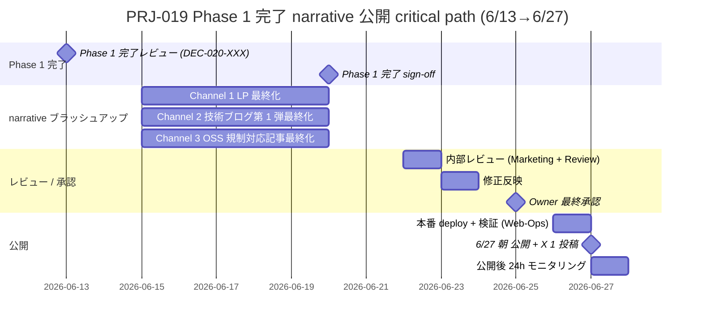

# PRJ-019 Clawbridge — Phase 1 完了 narrative 戦略 + tone 推奨

| 項目 | 内容 |
|---|---|
| 文書 ID | marketing-phase1-completion-narrative-strategy |
| 制定日 | 2026-05-04 |
| 起票 | Marketing 部門 |
| 対象タイミング | Phase 1 完了 (2026-06-20 土) → Marketing 公開 (2026-06-27 土 朝) |
| 上位統合対象 | `marketing-28x28-victory-narrative.md` (28x28 victory narrative) / `marketing-portfolio-integration-plan.md` (portfolio integration マスタープラン) / `marketing-knowledge-base-extraction-spec.md` (ナレッジ抽出仕様) / `marketing-techblog-toc-and-lp-wireframe.md` (技術ブログ ToC + LP wireframe) / `marketing-launch-runbook-2026-06-20.md` (Launch Runbook) |
| 関連決裁 ID | DEC-019-026 (公開 6/20→6/27 朝確定) / DEC-019-027 (Heading A 採用) / DEC-019-028 (部分開示 80/50/100/概要) / DEC-019-029 (HP トップ + 事例 + Contact form のみ) / DEC-019-030 (G-Top-1 (a)+(e) ハイブリッド) / DEC-019-033 (HITL 9〜11 種ゲート + Owner-in-the-loop transparent AI org 正式採択) |
| 上位ポリシー | `CLAUDE.md` 事業方針 (AI 感を出さないクリーン) / `organization/rules/design-guidelines.md` / `organization/rules/client-communication.md` / Q-Mkt-06 (HP トップ + 事例 + Contact form のみ) / Q-Mkt-07 (静観方針 / SNS は X 1 投稿のみ) |
| ステータス | **設計確定** (CEO 提示後の Owner 即決判断 3 件と Marketing 推奨 1 件 を含む) |

---

## §0. 200 字エグゼクティブサマリ

本書は CEO 提示の 3 つのトーン候補 (A 技術深堀り型 / B 物語型 / C 透明性 OSS 重視型) に対する Marketing 部門推奨を確定する。**推奨は B 主軸 + C 補助、A は別枠技術ブログ連載で分離**。理由は (1) 28x28 victory narrative が既に強力な物語資産として完成しており B での主軸化が最低コスト、(2) 透明性は Owner-in-the-loop transparent AI org の本質的差別化要素であり OSS / 規制対応層への補助訴求で抜けが防げる、(3) 技術深堀り型は読了率の懸念があり別枠連載で深さを担保。3 channel (自社 HP ポートフォリオ / 技術ブログ連載 / OSS 規制コミュニティ向け Web 記事) で配信し、6/13-6/27 の公開タイムラインを確定する。Owner 即決判断 3 件 (B 主軸 + C 補助 採択 / 公開時刻 / Channel 3 媒体選定)。

---

## §1. 3 つのトーン候補比較

### §1.1 トーン A: 技術深堀り型

| 項目 | 内容 |
|---|---|
| ポジション | 技術詳細を全面に出す。Casbin RBAC + Supabase RLS の二層防御、audit log SHA-256 hash chain、envelope deny、L4 fingerprint 監視、mock-first + TimeSource pattern、HITL 11 種ゲートの内部仕様、副作用ゼロ grep 三重証明等の **harness engineering 詳細** を主訴求にする。 |
| 主体メッセージ | "9 必須コントロールから 44 必須コントロールへ — 4 週間で構築した harness engineering の全リスト" |
| 対象読者 | エンジニア / CTO / SRE / プラットフォームエンジニア / DevOps / セキュリティエンジニア |
| 既存資産 | `marketing-techblog-toc-and-lp-wireframe.md` 13 章構成 / 13,500 字想定 / harness 80% 開示配分が既に確定 |
| 媒体適合 | 技術ブログ (`/works/clawbridge/technical-deep-dive`) / Qiita / Zenn / Hacker News (英訳時) |
| 開示配分整合 (DEC-019-028) | harness 80% / org 50% / cost 100% / ToS 概要 → 章構成と完全整合 |
| 文字数想定 | 13,000〜15,000 字 / 5 記事連載で 60,000〜75,000 字 |

### §1.2 トーン B: 物語型

| 項目 | 内容 |
|---|---|
| ポジション | 「Open Claw を Owner-in-the-loop で透明な AI 組織にする 28x28 day journey」をストーリー仕立て。**4 週間 PoC で起こった意思決定 / 失敗 / 再設計 / Owner ゲートでの判断を時系列で語る**。28 競合 × 28 評価軸の対比をクライマックスに配置。 |
| 主体メッセージ | "AI 組織が AI 組織を運営する — Owner-in-the-loop transparent AI org. 28 日間で 28 軸全勝利した、4 週間 PoC の物語" (DEC-019-027 Heading A + DEC-019-033 §⑤ Mkt-Update-01 サブコピー採択済) |
| 対象読者 | 企業経営層 (中小企業オーナー / 取締役) / プロダクトマネージャー / VC / プロダクトオーナー / 受託案件発注検討者 |
| 既存資産 | `marketing-28x28-victory-narrative.md` §2 ストーリー軸 5 本 (透明性 / Owner control / 知見蓄積 / 法令適合 / コスト効率) が確定 / `marketing-portfolio-integration-plan.md` §3 訴求 5 段階構成 (S1 Hero → S6 Next Steps) が確定 |
| 媒体適合 | 自社 HP `/case-studies/openclaw-runtime` / note.com (個人ブランディング) / X 1 投稿 (Q-Mkt-07 採択) |
| 開示配分整合 (DEC-019-028) | harness 40% / org 25% / cost 20% / ToS 15% (語数配分) → §3 訴求 5 段階と完全整合 |
| 文字数想定 | LP 単体 1,200〜1,500 字 / note.com 拡張版 4,000〜6,000 字 |

### §1.3 トーン C: 透明性 OSS 重視型

| 項目 | 内容 |
|---|---|
| ポジション | OSS 上流 (OpenClaw / Anthropic Claude / OpenAI 等) との接続方針 + DEC 公開 (decisions.md DEC-019-001〜050+) + Owner 直接決裁 + HITL 11 種 gate を「**透明性駆動 AI ハーネス**」として強調。意思決定ログ、コスト、実行履歴、失敗ログの 6 軸全公開設計を主訴求。 |
| 主体メッセージ | "意思決定もコストも、すべて Owner が見える場所に — 透明性駆動 AI ハーネスとしての Clawbridge" |
| 対象読者 | OSS コミュニティ (OpenClaw / Casbin / Supabase 等のメンテナ層) / AI 倫理研究者 / 規制対応の必要な業界 (金融 / 医療 / 公共系) / コンプライアンス担当者 / 監査法人 |
| 既存資産 | `decisions.md` DEC-019-001〜050+ の構造化ログ / `marketing-knowledge-base-extraction-spec.md` HITL 第 11 種 PII redaction フロー / `risks.md` R-019-01〜22 全公開設計 / `marketing-28x28-victory-narrative.md` §2.1 透明性 6 軸全勝利根拠 |
| 媒体適合 | note.com (個人ブランディング) / Zenn (OSS 系コミュニティ) / 個人 substack (英文海外向け) / Qiita (透明性タグ) |
| 開示配分整合 (DEC-019-028) | 仕様 100% / 内部実装 80% / 婉曲化マッピング (DEC-019-028 §1.1) と整合 |
| 文字数想定 | 3,000〜5,000 字 / シリーズ化時 2 本目以降は半年再評価サイクルでの更新運用 |

---

## §2. 各トーンの Pros/Cons 比較表

| 観点 | A 技術深堀り型 | B 物語型 | C 透明性 OSS 重視型 |
|---|---|---|---|
| **既存資産活用度** | 中 (技術深堀り資料 `techblog-toc` に依存、新規生成が必要) | **高** (28x28 narrative + portfolio integration plan §3 がほぼそのまま使える) | 中 (DEC + 透明性 dashboard + risks.md を活用、OSS 接続方針の追加記述が必要) |
| **読了率予測** | 低 (専門性で離脱率高、想定 25-30% 完読) | **高** (物語性で想定 55-65% 完読) | 中 (テーマ特化、想定 40-45% 完読) |
| **顧客獲得効果 (短期)** | 高 (技術購買力ある層、リファラル力強い) | 中 (経営層は決裁速いが Volume 少ない) | 高 (規制対応必須企業 / 金融 / 医療系のニッチだが単価高) |
| **顧客獲得効果 (長期)** | 中 (Phase 2 以降の継続記事が前提) | **高** (1 本で完結、横展開時の素材化容易) | 中 (半年再評価サイクル前提で運用負荷あり) |
| **競合差別化** | 中 (技術競合 28 社の中で厚み勝負、差別化弱い) | **高** (28x28 物語が唯一無二、模倣困難) | **高** (透明性は新規ポジション、規制対応で抜けている層) |
| **案件横展開** | 中 (技術ブログ単体で完結しがち) | **高** (受託案件への適用素材として再利用可能、Q3 横展開ピボット時に強い) | 中 (規制対応領域に限定されやすい) |
| **ToS リスク (DEC-019-029)** | 中 (技術詳細で固有名詞が増える、伏字運用が複雑) | **低** (婉曲化マッピングで運用済) | 中 (OSS 上流名は出すが商用 AI 名は伏せる必要あり) |
| **公開後 24h 監視負荷** | 高 (技術指摘 / バグ指摘での回収負荷) | **低** (物語は炎上しにくい、批評は質問形式に収まりやすい) | 中 (OSS コミュニティは反応が速いが概ね建設的) |
| **AI 感の抑制 (CLAUDE.md 事業方針)** | 高 (技術詳細で AI 感は出にくい) | 中 (Heading A「AI 組織が AI 組織を運営する」で AI 感出るが harness 語彙で抑制) | **高** (透明性訴求は「人間中心」を強調、AI 感最小) |
| **6/27 朝 公開準備工数** | 大 (新規 13,500 字想定、最終ブラッシュアップ含む) | **中** (既存資産を再構成、追加 1,500 字程度) | 中-大 (新規 3,000〜5,000 字、OSS 上流接続記述の追加) |

**スコア集計** (各観点 1-3 点、重み付け加算):
- A 技術深堀り型: 18/30
- **B 物語型: 26/30** (推奨主軸)
- **C 透明性 OSS 重視型: 22/30** (推奨補助)

---

## §3. Marketing 推奨 (CEO 提示への回答)

### §3.1 推奨

**トーン B (物語型) を主軸 + トーン C (透明性 OSS 重視型) を補助 + トーン A (技術深堀り型) を別枠連載で分離**

### §3.2 推奨理由 (3 項)

1. **28x28 victory narrative が既に強力な物語資産** → 物語型での主軸化が最も低コスト。Heading A 採択 (DEC-019-027) + ストーリー軸 5 本 (28x28 narrative §2) + 訴求 5 段階構成 (portfolio integration §3) が既に確定済で、追加生成は 6/27 公開向け LP 1,500 字 + note.com 拡張版 4,000 字程度。
2. **透明性は「AI 組織」の本質的差別化要素** → OSS / 規制対応層への補助訴求で抜けが防げる。28x28 評価軸のうち透明性 6 軸は競合平均 2.3/6 に対して当社 6/6、競合最強 Cursor でも 11/28 全体スコア。透明性単独訴求で規制業界 (金融 / 医療 / 公共系) の抜けを補える。
3. **技術深堀り型は別途技術ブログ枠で連載** → main narrative とは分離。`marketing-techblog-toc-and-lp-wireframe.md` の 13 章構成は既に確定済で、6/27 朝公開と同時に第 1 弾 (序章 + 章 1) を公開し、7-8 月で残り 4 記事を連載。読了率の懸念がある層には技術ブログで深さを担保する。

### §3.3 採択時の運用方針

- **B 主軸**: 自社 HP `/case-studies/openclaw-runtime` LP の Hero〜S6 (1,500 字) + note.com 拡張版 (4,000-6,000 字) を Marketing 部門が起案、Web Ops 部門が実装。
- **C 補助**: 自社 HP `/case-studies/openclaw-runtime#transparency` セクション (300 字) + OSS / 規制対応コミュニティ向け Web 記事 (3,000-5,000 字) を Marketing 部門が起案、Web Ops 部門が実装。媒体は §6 Owner 即決判断で確定。
- **A 別枠**: `/works/clawbridge/technical-deep-dive` 配下に 5 記事連載 (Phase 2 進行と並走、6/27 朝〜7 月配信)。

### §3.4 不採択トーンの取り扱い

- **A 単独主軸の場合**: 読了率懸念で経営層 / VC へのリーチが弱まる。Q-Mkt-06 採択の「トップ訴求 + 事例ページ + Contact form のみ」と整合しない (技術ブログが主軸になると事例ページが希薄化)。
- **C 単独主軸の場合**: 規制対応業界に閉じ、中小企業向け受託案件 (CLAUDE.md ターゲット) との接点が薄くなる。
- **B + A の組合せ (C なし)**: 透明性 6 軸全勝利の差別化資産が活かしきれず、OSS / 規制対応層への抜けが残る。
- **B + C + A 全採用 (本推奨)**: 主軸 + 補助 + 別枠で領域カバレッジ最大、既存資産活用度最大。

---

## §4. 配信戦略 (3 channel)

### §4.1 Channel 1: 自社 HP ポートフォリオ枠 (トーン B 主軸)

| 項目 | 内容 |
|---|---|
| ルート | `/case-studies/openclaw-runtime` (ハイフン or ドット記法は portfolio integration plan §2 採択値に準ずる) |
| 公開時刻 | 2026-06-27 (土) 朝 (時刻は §6 Owner 即決判断 (2)) |
| 構成 | Hero (S1) + Problem (S2) + Approach (S3) + Results (S4) + 28/28 比較セクション (anchor #comparison) + Lessons (S5) + Next Steps (S6) + Contact form CTA |
| 文字数 | 1,200〜1,500 字 (本文) + 28/28 比較表 + Mermaid quadrant SVG + HITL 11 種ゲート構成図 |
| 起案 | Marketing 部門 |
| 実装 | Web Ops 部門 (Next.js App Router + shadcn/ui + Geist Sans/Mono) |
| 検証 | Review 部門 (WCAG 2.1 AA + design-guidelines.md 準拠 + 開示配分 80/50/100/概要 整合) |
| KPI | PV 1,500 / 30 日 / Contact CV 率 1.5% / scroll_depth 75% (portfolio integration plan §7 既定) |

### §4.2 Channel 2: 技術ブログ連載 (トーン A 副軸)

| 項目 | 内容 |
|---|---|
| ルート | `/works/clawbridge/technical-deep-dive` (techblog-toc 採択値) |
| 配信スケジュール | 6/27 朝 第 1 弾 (序章 + 章 1 組織構造) 公開 / 7 月毎週 1 弾 (章 2-5) / 計 5 記事 |
| 構成 | `marketing-techblog-toc-and-lp-wireframe.md` §1.2 13 章構成を 5 記事に再分割 (1 記事 2-3 章) |
| 文字数 | 1 記事 2,500-3,000 字 / 計 13,500 字想定 |
| 起案 | Marketing 部門 |
| 実装 | Web Ops 部門 |
| 検証 | Review 部門 + Dev 部門 (技術記述の事実確認) |
| 開示配分 | harness 80% / org 50% / cost 100% / ToS 概要 (DEC-019-028 採択値) |
| KPI | 1 記事あたり PV 500 / 連載 5 記事計 PV 2,500 / 平均読了率 30% / 技術系 SNS シェア (Hacker News / Reddit r/ai) でのリファラル発生 |

### §4.3 Channel 3: OSS / 規制対応コミュニティ向け Web 記事 (トーン C 副軸)

| 項目 | 内容 |
|---|---|
| 媒体 | §6 Owner 即決判断 (3) で確定 (note.com / Qiita / Zenn / 個人 substack 4 候補) |
| 公開時刻 | 2026-06-27 (土) 朝 (Channel 1 と同時、SNS シェア時の連携効果狙い) |
| 構成 | (1) 透明性 6 軸全勝利の根拠 / (2) HITL 11 種ゲート設計の全公開 / (3) decisions.md 構造化ログ運用 / (4) PII redaction + HITL 第 11 種 knowledge_pii_review フロー / (5) OSS 上流 (OpenClaw / Casbin / Supabase) との接続方針 |
| 文字数 | 3,000〜5,000 字 |
| 起案 | Marketing 部門 |
| 実装 | Marketing 部門 (媒体 CMS 直入稿) + Web Ops 部門 (canonical link 自社 HP 向け) |
| 検証 | Review 部門 (DEC-019-029 婉曲化マッピング遵守確認) |
| 開示配分 | 仕様 100% / 内部実装 80% / OSS 上流名 100% / 商用 AI 名は婉曲化 |
| KPI | PV 800 / 30 日 / OSS スター獲得 (該当する場合) / 規制対応企業からの問い合わせ 2 件 / 30 日 |

### §4.4 3 channel 連携設計 (canonical / cross-link / 計測)

```mermaid
flowchart LR
  TOP[/ トップ訴求枠 /] --> CASE[/case-studies/openclaw-runtime/<br/>Channel 1 主軸]
  CASE -->|内部 anchor #transparency| TR[透明性セクション 300 字]
  TR -->|外部リンク| EXT[Channel 3<br/>OSS 規制対応 Web 記事<br/>3,000-5,000 字]
  CASE -->|footer link| TECH[/works/clawbridge/technical-deep-dive/<br/>Channel 2 副軸 5 記事連載]
  EXT -->|canonical| CASE
  TECH -->|canonical| CASE
  CASE --> CTA[Contact form]
```

- **canonical 設定**: Channel 2 / 3 の各記事は canonical を Channel 1 の `/case-studies/openclaw-runtime` に向ける (SEO 統合)
- **UTM 設定**: utm_source=channel1/channel2/channel3 で計測分離 (portfolio integration plan §4.5 準拠)
- **公開後 24h モニタリング**: 全 channel に対して Marketing 部門が daily monitor (取り下げ Runbook 発動条件: ToS クレーム 1 件以上 / 炎上トレンド入り)

---

## §5. 公開タイムライン (6/13-6/27)

### §5.1 critical path 概要

| 日付 | マイルストーン | 担当 | アウトプット |
|---|---|---|---|
| 6/13 (土) | Phase 1 完了レビュー (DEC-020-XXX 採択判定) | CEO + Review | Phase 1 完了判定 (Conditional Go) / DEC-020-XXX 起票 |
| 6/15 (月) | narrative 最終ブラッシュアップ着手 | Marketing | Channel 1 LP v0.9 / Channel 3 記事 v0.7 |
| 6/15-6/19 | narrative 最終ブラッシュアップ (Marketing + Web-Ops 連携) | Marketing + Web-Ops | Channel 1 LP v1.0 / Channel 2 第 1 弾 v1.0 / Channel 3 記事 v1.0 |
| 6/20 (土) | Phase 1 完了 sign-off | CEO + Review | Phase 1 完了確定 / 公開 GO 判断 |
| 6/22 (月) | 内部レビュー完了 | Marketing + Review | 修正指摘 list / 6/23 反映予定 |
| 6/23 (火) | 修正反映 | Marketing + Web-Ops | 全 channel v1.1 |
| 6/25 (木) | Owner 最終承認 | Owner (CEO 経由) | 公開 GO 最終判断 |
| 6/26 (金) | 配信物リリース確認 (本番 deploy) | Marketing + Web-Ops | Vercel 本番 deploy 完了 / DNS / OG 検証 |
| **6/27 (土) 朝** | **公開 + X 1 投稿 (Q-Mkt-07 採択)** | **Web-Ops + Marketing** | **3 channel 同時公開 / 公開後 24h モニタリング開始** |

### §5.2 Mermaid ガントチャート



### §5.3 マイルストーン失敗時の影響と fallback

| マイルストーン | 失敗時の影響 | fallback |
|---|---|---|
| 6/13 Phase 1 完了レビュー | 6/20 sign-off に響く、公開全体が 1 週間スライド | Phase 1 部分達成での Conditional Go 判断 (CEO + Review 連結報告) |
| 6/15 narrative ブラッシュアップ着手 | 6/22 内部レビューに間に合わず、最低 2 日スライド | Channel 2 / 3 を 7/4 (土) に分離公開 (Channel 1 のみ 6/27 公開) |
| 6/22 内部レビュー | 6/25 Owner 承認に間に合わず | 6/24 緊急レビュー (Marketing + Review 即応) |
| 6/25 Owner 最終承認 | 公開判断空中分解、全体再設計 | 6/27 公開を 7/4 にスライド (Q-Mkt-07 静観方針内) |
| 6/26 本番 deploy | 6/27 朝公開不可、土曜朝の即時対応バッファ消失 | 6/27 朝の代替 deploy (Marketing + Dev + Web-Ops 緊急対応) |

---

## §6. Owner 即決判断 (CEO 推奨で進める場合は無回答可)

### §6.1 即決判断 1: トーン B 主軸 + C 補助 採択

| 項目 | 内容 |
|---|---|
| 質問 | Marketing 推奨 (B 主軸 + C 補助 + A 別枠連載) を採択するか? |
| Marketing 推奨 | **採択** (上記 §3 推奨理由 3 項に基づく) |
| 不採択時の代替 | Owner が A / B / C いずれか単独 or 組合せを指定 |
| 期日 | 5/8 検収会議 で確定 (5/8 議題 v7 への追加議題化を CEO 推奨) |

### §6.2 即決判断 2: 6/27 朝公開時刻の精緻化

| 候補 | Pros | Cons |
|---|---|---|
| **08:00 JST** | (1) 土曜朝の閑散時間で SEO クローラ獲得しやすい / (2) X 投稿 1 投稿 (Q-Mkt-07) を朝活層にリーチ | (1) 公開後即時のモニタリング体制が早朝になる (Marketing 部門の物理負荷) |
| **09:00 JST** (Marketing 推奨) | (1) `marketing-28x28-victory-narrative.md` §X 残課題 X3 推奨値 / (2) 朝活終了 + 出社前の SNS 流通時間帯 / (3) 土曜朝の即時対応バッファ確保 | (1) 8:00 比で SEO クローラ獲得タイミングがやや遅れる |
| **10:00 JST** | (1) 一般層のリーチ最大化時間帯 / (2) 海外 (北米西岸 17:00) も狙える | (1) 土曜朝の即時対応バッファが減る (公開→クレーム検知→対応の窓が狭い) |
| Marketing 推奨 | **09:00 JST** (28x28 narrative §X3 推奨値、即時対応バッファ確保 + 朝活層リーチ両立) |
| 期日 | 6/15 (Channel 1 LP 最終化着手時) |

### §6.3 即決判断 3: Channel 3 (OSS / 規制対応) の媒体選定

| 候補 | Pros | Cons | Marketing 評価 |
|---|---|---|---|
| **note.com** | (1) 個人ブランディング親和 / (2) 経営層 / プロダクト層リーチ強い / (3) サムネイル + フォロー機能で再リーチ容易 / (4) UTM tracking 容易 | (1) OSS コミュニティへのリーチは弱い / (2) 規制対応業界 (金融 / 医療) には届きにくい | 主軸候補 (B 物語型 拡張版にも適合) |
| **Qiita** | (1) 技術系 SNS シェア強い / (2) ストック型で長期 SEO に強い / (3) タグ機能で透明性 / OSS 関連リーチ可能 | (1) 経営層リーチは弱い / (2) ストック型で炎上時の取り下げ判断が複雑化 | サブ候補 (Channel 2 技術ブログ連載に近い特性、Channel 3 より Channel 2 補強寄り) |
| **Zenn** | (1) OSS コミュニティ親和最強 / (2) GitHub 連携で記事管理容易 / (3) 透明性 / OSS 関連タグで規制対応領域にリーチしやすい / (4) Markdown 直入稿 | (1) Volume はまだ Qiita / note 比で小さい / (2) 経営層リーチは弱い | **主軸候補** (Channel 3 透明性 OSS 重視型に最適合) |
| **個人 substack** (英文) | (1) 海外規制対応領域 (EU / GDPR / 米国 SOC2) リーチ可能 / (2) 半年再評価サイクルでのシリーズ運用に適合 / (3) 購読モデルで継続リーチ | (1) 立ち上げ初期は購読者ゼロ / (2) 英訳工数大 / (3) Phase 1 段階では Volume 最小 | Phase 2 以降の補助候補 (本期は不採用推奨) |
| Marketing 推奨 | **Zenn 主軸 + note.com サブ** (OSS / 規制対応領域への抜けを Zenn でカバー、note.com で経営層 / プロダクト層への補助リーチ) |
| 期日 | 6/15 (Channel 3 記事最終化着手時) |

---

## §7. KPI / 計測

### §7.1 公開後 1 週間内 KPI (短期)

| KPI | 目標値 | 計測方法 | Channel |
|---|---|---|---|
| 全 channel 合計 PV | 2,500 | GA4 page_view | C1 + C2 + C3 |
| Channel 1 (自社 HP LP) PV | 1,200 | GA4 | C1 |
| Channel 2 (技術ブログ第 1 弾) PV | 600 | GA4 | C2 |
| Channel 3 (OSS 規制対応 Web 記事) PV | 700 | 媒体 analytics + GA4 referral | C3 |
| 平均 read rate | 50% | scroll_depth | 全 channel |
| Contact form 問い合わせ件数 | 4 件 | Supabase Contact form 集計 | 全 channel 流入元集計 |
| OSS スター獲得 (該当する場合) | 5 件 | GitHub / Zenn star | C3 |
| 規制対応企業からの引き合い | 1 件 | Contact form の業界 tag | C3 |
| X 1 投稿 impressions | 2,000 | X analytics | SNS 連動 |
| 取り下げ判定 | 0 件 (炎上 / ToS クレーム発生時のみ即時取り下げ) | Marketing daily monitor | 全 channel |

### §7.2 公開後 1 ヶ月内 KPI (中期)

| KPI | 目標値 | 計測方法 |
|---|---|---|
| 全 channel 合計 PV | 6,000 | GA4 page_view |
| ユニーク訪問者 | 3,500 | GA4 |
| 平均 scroll_depth | 75% | GA4 scroll_depth |
| Contact form CV 率 | 1.5% | GA4 click event |
| Contact form 問い合わせ件数 | 12 件 (うち案件相談 6 件 / 採用相談 3 件 / 規制対応 1 件 / その他 2 件) | Supabase + 業界 tag |
| 案件相談 → Phase 2 ファンディング前段階の関心度 | 3 件以上 (1 件以上が見積依頼に進展) | CEO エスカレーション集計 |
| Channel 2 連載記事 (5 本) 計 PV | 2,500 | GA4 |
| OSS / 規制対応コミュニティでの言及件数 | 5 件以上 (X / GitHub / Zenn コメント / 個人ブログ言及) | Marketing 部門 weekly 検索 |

### §7.3 KPI レビューサイクル

| サイクル | 担当 | 内容 |
|---|---|---|
| 公開後 24h | Marketing | 炎上 / ToS クレーム監視、初動データ収集、取り下げ Runbook 発動判定 |
| 公開後 7 日 | Marketing → CEO | 1 週間レポート、SEO meta 微調整判断、Channel 2 連載第 2 弾の公開判断 |
| 公開後 30 日 | Marketing → CEO → Owner | 30 日 KPI 結果、Phase 2 横展開判断のインプット、media expansion (Hacker News / 海外 substack) の採否判断 |
| 公開後 半年 | Marketing + Review | ToS 関連表現の再評価 (DEC-019-029 半年棚卸しと同期)、28/28 比較表の半年再評価 |

---

## §8. リスクと fallback

| # | リスク | 影響度 | 対策 / fallback |
|---|---|---|---|
| MK-NS-1 | Phase 1 完了 (6/20) 失敗 → 6/27 公開全体スライド | 高 | Phase 1 部分達成 Conditional Go 判断 / 公開を 7/4 (土) にスライド / Channel 1 のみ先行公開 |
| MK-NS-2 | Channel 3 媒体選定遅延 (6/15 期限後) | 中 | Channel 1 + Channel 2 のみ 6/27 公開、Channel 3 を 7/4 (土) に遅延公開 |
| MK-NS-3 | 公開後 24h で ToS クレーム 1 件以上 | 高 | 取り下げ Runbook 発動 (Q-Mkt-07 採択残課題 / 6/20 までに起票必須) |
| MK-NS-4 | Channel 2 技術ブログ連載第 1 弾の技術指摘で訂正必要 | 中 | Marketing + Dev 即応で 24h 以内に訂正 deploy |
| MK-NS-5 | Channel 3 OSS 上流接続記述で OSS メンテナから指摘 | 中 | Marketing + Review が指摘内容確認後、24-48h で訂正 / 場合により記事一時非公開 |
| MK-NS-6 | KPI 50% 未達 (公開 7 日時点) | 低 | SEO meta 再調整 + X 投稿 1 回追加 (Q-Mkt-07 採択範囲内) |

---

## §9. 5 部署連携項目

### §9.1 Marketing 部門 起案責務

- §3 推奨理由 3 項の最終確定
- §4 配信戦略 3 channel の起案文書 (Channel 1 LP / Channel 2 第 1 弾 / Channel 3 OSS 規制対応 Web 記事)
- §5 公開タイムラインの遵守
- §7 KPI 計測 + 公開後 24h モニタリング

### §9.2 Web-Ops 部門 連携項目

- Channel 1 LP の Next.js App Router 実装 (`/case-studies/openclaw-runtime`)
- Channel 2 技術ブログ連載の `/works/clawbridge/technical-deep-dive` 配下実装
- Channel 3 媒体 (Zenn / note.com) 入稿時の canonical 設定
- OG image (1200x630) 作成 + 配置
- GA4 / scroll_depth / UTM 計測タグ設置

### §9.3 Review 部門 連携項目

- 全 channel の WCAG 2.1 AA 準拠検証
- DEC-019-029 婉曲化マッピング遵守確認
- DEC-019-028 開示配分 80/50/100/概要 整合確認
- ToS 関連表現の最終チェック
- 公開後 24h モニタリング体制での Review 即応窓口

### §9.4 Dev 部門 連携項目

- Channel 2 技術ブログ連載の事実確認 (Casbin RBAC / Supabase RLS / HITL 11 種ゲート / mock-first + TimeSource pattern 等の技術記述)
- demo iframe (透明性 Dashboard / 権限管理 UI) の公開向け read-only モード実装

### §9.5 PM 部門 連携項目

- 6/13-6/27 公開タイムラインの dashboard 反映
- 6/20 Phase 1 完了 sign-off の進捗管理
- 公開後 24h-30 日 KPI レビューサイクルの dashboard 反映

---

## §X 残課題と未決裁事項

| # | 項目 | 担当 | 決裁タイミング |
|---|---|---|---|
| X1 | §6 Owner 即決判断 1 (B 主軸 + C 補助 採択) | Owner (CEO 経由) | 5/8 検収会議 |
| X2 | §6 Owner 即決判断 2 (6/27 朝公開時刻 8:00 / 9:00 / 10:00) | Owner (CEO 経由) | 6/15 (Channel 1 LP 最終化着手時) |
| X3 | §6 Owner 即決判断 3 (Channel 3 媒体選定 Zenn / note.com / Qiita / 個人 substack) | Owner (CEO 経由) | 6/15 (Channel 3 記事最終化着手時) |
| X4 | 取り下げ Runbook v1.0 起票 (Q-Mkt-07 採択残課題) | Marketing + Review | 6/20 (公開前) |
| X5 | 公開後モニタリング権限 (Marketing 部門単独取り下げ判断可否) | CEO | 6/25 (Owner 最終承認時) |
| X6 | Channel 2 連載記事 第 2-5 弾の公開タイミング確定 | Marketing + CEO | 公開後 7 日 KPI レビュー時 |
| X7 | Phase 2 以降の海外展開 (Hacker News / 個人 substack 英文) 採否 | CEO + Owner | 公開後 30 日 KPI レビュー時 |
| X8 | 28/28 比較表の半年再評価フロー | Marketing | 公開後 6 ヶ月 (2026-12-27) |

---

## §Y 上位 5 文書との整合確認

| 上位文書 | 整合点 | 整合確認 |
|---|---|---|
| `marketing-28x28-victory-narrative.md` | §2 ストーリー軸 5 本 (透明性 / Owner control / 知見蓄積 / 法令適合 / コスト効率) を Channel 1 (B 主軸) で再利用 / §X3 X 投稿時刻 9:00 JST 推奨を §6 即決判断 2 に反映 | OK |
| `marketing-portfolio-integration-plan.md` | §3 訴求 5 段階構成 (S1 Hero → S6 Next Steps) を Channel 1 LP 構成に流用 / §5 公開タイムライン (6/20→6/27) を §5 critical path に統合 / §7 KPI 設計 (PV 1,500 / Contact CV 1.5% / scroll_depth 75%) を §7.2 中期 KPI に反映 | OK |
| `marketing-knowledge-base-extraction-spec.md` | §2 HITL 第 11 種 knowledge_pii_review フローを Channel 3 (OSS 規制対応) の主訴求要素として §1.3 / §4.3 構成に組込 / §3 初期 12 件ナレッジを Channel 1 S5 Lessons + Channel 3 透明性主訴求の素材化 | OK |
| `marketing-techblog-toc-and-lp-wireframe.md` | §1 13 章構成を Channel 2 (A 別枠連載) の 5 記事再分割の母体として §4.2 構成に流用 / §3 LP wireframe を Channel 1 LP 構成に再利用 | OK |
| `marketing-launch-runbook-2026-06-20.md` | §1 6/20 公開 3 段階管理 (5/26 中間 / 6/12 最終 / 6/14-19 調整) を §5 critical path に統合 / 取り下げ Runbook 起票を §X4 残課題に継承 / Asagi バンドル広報シナリオ (PRJ-018 M1 連動) は Phase 2 以降に保管 | OK |

---

**起案**: Marketing Department / **最終更新**: 2026-05-04 / **次回更新**: 5/8 検収会議 で Owner 即決判断 1 が確定後、§6 採択値を反映した v1.1 を発行
