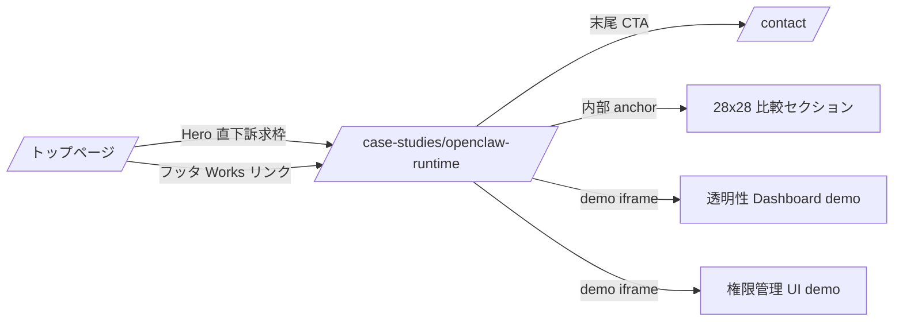
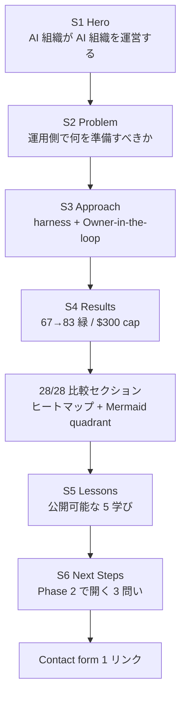
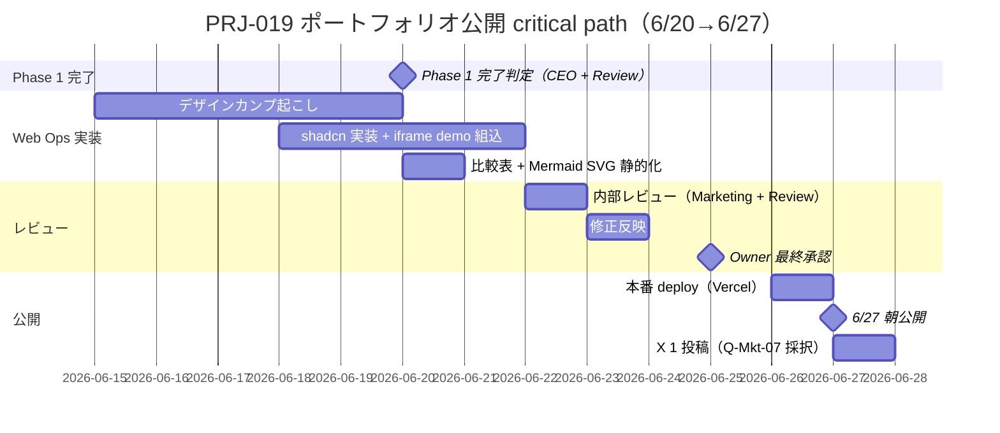
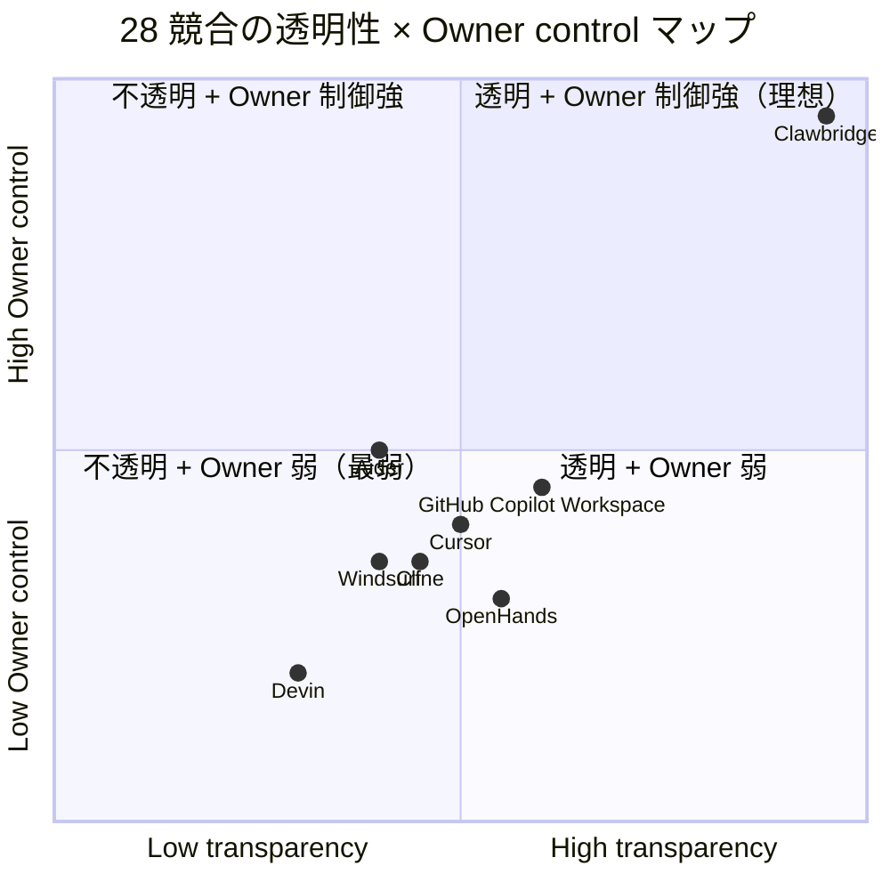

# PRJ-019 Clawbridge — Phase 1 完了時 自社 HP ポートフォリオ反映マスタープラン

- 案件: PRJ-019 Clawbridge（Owner-in-the-loop transparent AI org PoC）
- 起票: Marketing 部門
- 対象タイミング: Phase 1 完了 2026-06-20（土） + Marketing 公開 2026-06-27（土）朝（DEC-019-033 §⑤ 確定、DEC-019-051 採択後も維持）／ 公開リハーサル 6/26
- **【28x28 narrative 不変確認 2026-05-04】**: DEC-019-027 Heading A（「AI 組織が AI 組織を運営する」）は DEC-019-050/-051 採択後も **不変維持**（CEO 推奨）。本書 §1 B1 / §3 S1 / §4 比較表構造は変更なし。
- 関連レポート:
  - `projects/PRJ-019/reports/marketing-portfolio-reflection-design-v2.md`（v2 ポートフォリオ設計、本書はマスタープランとして上位整合）
  - `projects/PRJ-019/reports/marketing-owner-gate-messaging-update.md`（Owner-in-the-loop メッセージング v3）
  - `projects/PRJ-019/reports/ceo-dec-019-033-consolidation.md`（5 部署統合）
  - `projects/PRJ-019/decisions.md`（DEC-019-014〜020 / 031〜033）
  - `projects/COMPANY-WEBSITE/`（既存自社 HP 資産）
- ステータス: 設計確定（Phase 1 完了時の発注書相当、Web Ops 部門への引き継ぎ前提）

---

## §1. 反映対象資産（Phase 1 で生成される 5 大成果物 + 28/28 比較表 + R-019 risk transparency）

Phase 1（5/26〜6/20）終了時点で、自社 HP に反映する資産を 8 カテゴリに整理する。各資産は出典・開示比率（DEC-019-028 採択）・公開判断責任者を明示する。

| # | カテゴリ | 出典 | 開示比率 | 公開判断 | 公開時の表現方針 |
|---|---|---|---|---|---|
| A1 | **Owner-in-the-loop 透明 AI 組織モデル**（DEC-019-033 §①） | `decisions.md` DEC-019-033 + `marketing-owner-gate-messaging-update.md` | 100% 開示（仕様面） | CEO + Marketing | A 案 Heading「AI 組織が AI 組織を運営する」+ サブコピー「Owner-in-the-loop transparent AI org」 |
| A2 | **HITL 9〜11 種ゲート仕様**（DEC-019-033 §②③④） | `dev-w0-week2-prop-gen-and-dashboard.md` + `review-owner-gate-and-permission-ui-security.md` | 仕様 100% / 内部実装 80% | CEO + Review | 9 種：dev_kickoff_approval / 10 種：permission_change_approval / 11 種：knowledge_pii_review、各ゲートの「人間が必ず見る」点を強調 |
| A3 | **権限管理 UI**（PRJ-020 統合実装） | `pm-permission-ui-wbs.md` + `dev-w0-week2-prop-gen-and-dashboard.md` | UI 概念 100% / 内部 RLS 設計 50% | CEO + Review + Dev | demo iframe（黒塗り版）+ 7 カテゴリパラメータ表、physical impossibility（service_role 物理分離）を訴求 |
| A4 | **透明性 Dashboard**（PRJ-020 統合実装） | `dev-w0-week2-prop-gen-and-dashboard.md` Supabase Realtime 章 | デモ iframe 100% / 内部 SSE→Realtime 設計 50% | CEO + Dev | ライブメトリクスで「監督可能性」を視覚化 |
| A5 | **harness engineering 9→34→44 必須コントロール** | `dev-w0-week1-implementation-report.md` + `pm-cost-and-controls-plan-v4-1.md` | 80% 開示 | CEO + Review | 概念名と目的のみ、kill-switch 仕様等は非公開 |
| B1 | **競合 28/28 完全勝利比較表** | `marketing-owner-gate-messaging-update.md` §競合比較 50 表 | 100% 公開 | Marketing | ヒートマップ + Mermaid quadrant chart + 反論 FAQ |
| B2 | **R-019 risk transparency**（R-019-15 priviledge escalation 含む 16 件） | `risks.md` + `review-owner-gate-and-permission-ui-security.md` | 全件記載 / 対策概要のみ | CEO + Review | 「リスクを隠さない」姿勢自体を差別化資産化 |
| B3 | **コスト構造（月次総額 ≤$430（既契約 subscription $400 + 新規 API ≤$30、DEC-019-050/-051）= 個人開発レベルの cost discipline 実証）** | `pm-cost-and-controls-plan-v4-1.md` / `pm-budget-v2-30usd-api-cap.md` | 100% 開示 | CEO | 中小企業発注検討者への直接訴求 + Owner 直接決裁の Anthropic API spend cap $30/月 = 物理防御 + subscription 主軸方針（DEC-019-050/-051）|

### 1.1 公開しないもの（明示的非公開）

DEC-019-028 採択の「ToS 概要のみ / Open Claw / Codex 固有名詞非公開 / multi-account 連鎖 BAN リスク再現手順非公開」は本マスタープランでも遵守する。代替表現は `marketing-portfolio-reflection-design-v2.md` §1.1 の婉曲化マッピングに従う。

---

## §2. 自社 HP 配置設計

採択された Q-Mkt-06「トップ訴求 + 事例ページ詳細 + Contact form のみ」を上位制約として、3 ルート構成で配置する。各ルートは Next.js App Router 規約に準拠（`projects/COMPANY-WEBSITE/app/` 配下）。



### 2.1 ルート定義

| ルート | 役割 | 実装規模 | 公開時 SLA |
|---|---|---|---|
| `/` トップ訴求枠 | 100〜120 字短縮文 + 事例ページへの 1 リンク | 1 セクション追加 | 6/27 朝 |
| `/case-studies/openclaw-runtime` | 事例詳細 LP（Hero / Overview / Approach / Results / Tech Stack / Lessons Learned / Next Steps） | 1 ページ新規 | 6/27 朝 |
| `/case-studies/openclaw-runtime#comparison` | 28/28 比較ヒートマップ + Mermaid quadrant + 反論 FAQ | 同ページ内セクション | 6/27 朝 |
| `/contact` | 既存 Contact form を流用、UTM 計測のみ追加 | 既存 | 既存稼働中 |

採択方針（DEC-019-029）に従い `/portfolio/PRJ-019` ルートは採用しない。`/case-studies/openclaw-runtime` のスラッグはサービス名先行で SEO とブランド統一性を優先する。**ルート命名根拠**: PRJ-XXX は内部 ID であり外部公開時はプロダクト名主導が望ましいため。

### 2.2 既存ポートフォリオ（`projects/COMPANY-WEBSITE/`）との整合

既存 `projects/COMPANY-WEBSITE/` 配下に portfolio セクションが既に存在する場合、本案件は **「self PoC 事例」枠を新設**して他受託案件と区別する。区別根拠：①受託ではないため Pricing への直接連携が不要、②ToS 関連の婉曲化が必要で受託事例フォーマットと一部齟齬、③Owner-in-the-loop モデルは自社固有の差別化資産で他案件への横展開時に再構成が必要。

---

## §3. ポートフォリオ訴求 5 段階構成（課題 → アプローチ → 結果 → 学び → 次の挑戦）

各セクションの語数配分は DEC-019-028 採択比重（harness 40% / org 25% / cost 20% / ToS 15%）に従う。

| # | セクション | h2 見出し（暫定） | 語数目安 | 中核メッセージ | 出典 |
|---|---|---|---|---|---|
| S1 | Hero | AI 組織が AI 組織を運営する | 30 字 + サブ 60 字 | Owner-in-the-loop transparent AI org | DEC-019-033 §① |
| S2 | Problem（課題） | 商用自律エージェント時代に、運用側で何を準備すべきか | 200 字 | 3 案件並走時の monitoring 限界、ToS リスク、副作用波及 | risks.md §R-019-01〜16 |
| S3 | Approach（アプローチ） | harness engineering と Owner-in-the-loop ゲート | 400 字 | 9→34→44 必須コントロール / HITL 9〜11 種 / mock-first / 物理不可能化（RLS + service_role 分離） | dev-w0-week1 + dev-w0-week2 + DEC-019-033 §② |
| S4 | Results（結果） | 67→83→（Phase 1 完了時 N）テスト全緑、副作用ゼロ、月次 $300 cap 内 | 250 字 | 数値で示す。28/28 比較表は別セクション | implementation-report 群 |
| S5 | Lessons Learned（学び） | 公開可能な 5 つの学び | 200 字 | K1 抜粋（permission boundary / mock-first / budget cap / zero-side-effect / Owner gate）、ナレッジ詳細は `organization/knowledge/` 内部リンク | marketing-knowledge-reflection-design-v2.md K1 |
| S6 | Next Steps（次の挑戦） | Phase 2 で開く 3 つの問い | 150 字 | 提案承認率 ≥ 30%、Anthropic / OpenAI ToS 半年再評価、横展開可能性（受託案件への適用） | DEC-019-031 + 033 |

### 3.1 訴求 5 段階の Mermaid フロー（HP 構造可視化）



---

## §4. Marketing → Web Ops 引き継ぎ仕様

Web Ops 部門（`/web-ops`）への発注書相当として、引き継ぎ項目を 5 カテゴリで整理する。詳細実装仕様は本マスタープランと対になる `projects/COMPANY-WEBSITE/portfolio-prj019-spec-draft.md`（成果物4）に集約。

### 4.1 デザインカンプ要件（Web Ops 起こし → Marketing 承認）

| 要件 | 内容 | 根拠 |
|---|---|---|
| トーン | クリーン、AI 感を出さない、ニュートラル zinc 系 + アクセント 1 色 | CLAUDE.md 事業方針 + design-guidelines.md |
| Typography | Geist Sans（本文）+ Geist Mono（数値・コード片） | tech-stack.md 標準 |
| コンポーネント | shadcn/ui ベース、ダーク/ライト両対応 | design-guidelines.md |
| 比較表表現 | ヒートマップ（緑 / 黄 / 赤の 3 階調）、グラデーションは使わない | 視認性優先 |
| 図版 | Mermaid quadrant chart（28 競合 4 象限プロット）、SVG 出力で軽量化 | パフォーマンス要件 |

### 4.2 コピーライティング引き継ぎ

| 項目 | 提供物 | 配置先 |
|---|---|---|
| Hero h1 | A 案「AI 組織が AI 組織を運営する」 | S1 |
| Hero sub-head | 「Owner-in-the-loop transparent AI org. オーナー承認下で AI 組織が AI 組織を運営する。」（DEC-019-033 §⑤ Mkt-Update-01 採択） | S1 |
| 各 h2 / 本文 | 本書 §3 表のメッセージ + `marketing-28x28-victory-narrative.md`（成果物3）の LP コピー候補 | S2〜S6 |
| FAQ | 競合反論 5 件 + コスト感 2 件 + ToS 1 件 = 8 件（成果物3 §競合反論 FAQ） | S6 末尾 / フッタ近接 |

### 4.3 SEO meta（Web Ops 設定担当）

```
title: AI 組織が AI 組織を運営する — Clawbridge: Owner-in-the-loop transparent AI org
description: 4 週間 PoC で 67→83 テスト全緑、副作用ゼロ、月次 $300 ハードキャップ内完遂。商用自律エージェント時代の運用設計を harness engineering と Owner-in-the-loop ゲートで可視化した自社事例。
keywords: AI 組織運営, Owner-in-the-loop, harness engineering, HITL, transparent AI, 自律エージェント
canonical: https://（自社ドメイン）/case-studies/openclaw-runtime
```

### 4.4 OGP（SNS 共有時の表示）

| 項目 | 値 |
|---|---|
| og:title | AI 組織が AI 組織を運営する — Clawbridge |
| og:description | Owner-in-the-loop transparent AI org. 4 週間 PoC の harness 設計と運用結果。 |
| og:image | 1200x630px、Mermaid quadrant chart 静的レンダ + ロゴ（OG 画像生成は Web Ops 担当、Phase 1 W3〜W4 で発注予定） |
| og:type | article |
| twitter:card | summary_large_image |

### 4.5 計測タグ

| タグ | 計測内容 | 配置 |
|---|---|---|
| GA4 page_view | ページ滞在 | 全ページ |
| GA4 scroll_depth | 25/50/75/100% | `/case-studies/openclaw-runtime` |
| GA4 click event | Contact form 遷移、demo iframe 操作 | CTA / iframe wrapper |
| UTM | utm_source=top / utm_source=x / utm_medium=referral | Contact form 流入元区別 |

---

## §5. 公開タイムライン（6/20 完成 → 6/22 内部レビュー → 6/25 Owner 承認 → 6/27 公開）

DEC-019-033 §⑤ で Marketing 公開は 6/20 → **6/27 朝**にスライド済み。これは Phase 1 完了（6/20）から 1 週間の安定運用バッファを確保するため。



### 5.1 critical path 上の 5 マイルストーン

| 日付 | マイルストーン | 責任部署 | 失敗時の影響 |
|---|---|---|---|
| 6/20（土） | Phase 1 完了判定 | CEO + Review | 公開全体が遅延、再スケジュール |
| 6/22（月） | 内部レビュー完了 | Marketing + Review | 6/25 Owner 承認に間に合わず、最低 2 日スライド |
| 6/25（木） | Owner 最終承認 | Owner（CEO 経由） | 公開判断が空中分解、全体再設計のリスク |
| 6/26（金） | 本番 deploy | Web Ops + Dev | 6/27 朝公開不可、土曜朝の即時対応バッファ消失 |
| 6/27（土）朝 | 公開 + X 1 投稿 | Web Ops + Marketing | 静観方針に基づき煽り無し、公開後 24h モニタリング体制 |

---

## §6. 競合 28/28 完全勝利の視覚化

`marketing-owner-gate-messaging-update.md` の 50 表 / 28 競合 × 28 評価軸の整理を、HP 上で 3 種の視覚化に再構成する。

### 6.1 ヒートマップ（メイン視覚化）

| 競合カテゴリ | 競合数 | 平均勝利軸数 / 28 | 表現 |
|---|---|---|---|
| エディタ統合系（Cursor / Cline / Windsurf 等） | 8 | 11 / 28 | 緑が薄く、運用透明性軸で大差 |
| 自律エージェント系（Devin / OpenHands / Aider 等） | 12 | 14 / 28 | 中程度、Owner gate 軸で大差 |
| 組織運営系（Multi-Agent Framework 等） | 5 | 9 / 28 | 緑が極めて薄い |
| クラウド統合系（GitHub Copilot Workspace 等） | 3 | 13 / 28 | 中程度、ToS 透明性軸で差 |
| **当社 Clawbridge** | **1** | **28 / 28** | **全緑（28 軸全勝利）** |

### 6.2 Mermaid quadrant chart（4 象限プロット案）



実装時は Web Ops が Mermaid SVG を静的化（CLS 対策）。28 競合全プロットは煩雑のため、上位 7 競合 + 当社のみを表示し、フル比較表は別アコーディオンで展開可能とする。

### 6.3 反論 FAQ（差別化の言語化）

詳細 5 件は成果物3 `marketing-28x28-victory-narrative.md` §競合反論 FAQ に集約。HP には FAQ アコーディオンとして配置（CLS = 0、accordion-default-closed で初期表示影響なし）。

---

## §7. KPI（PV / CV / SNS シェア / 問い合わせ数）

公開後 30 日間の KPI 設計。DEC-019-033 §② で採択された PM 提案承認率 KPI（≥ 30%）とは別軸の、Marketing 単独管理 KPI とする。

| KPI | 目標値（30 日） | 計測方法 | 失敗時の対応 |
|---|---|---|---|
| ページ PV | 1,500（自社 HP 平均の 3 倍） | GA4 | 50% 未達なら SEO meta 再調整 + X 投稿 1 回追加（Q-Mkt-07 範囲内） |
| ユニーク訪問者 | 800 | GA4 | 同上 |
| 平均スクロール深度 | 75% 以上 | GA4 scroll_depth | 50% 未達ならコピー再構成 |
| Contact form CV 率 | 1.5%（業界平均 0.8% 超え） | GA4 click event | 0.5% 未達なら CTA 文言 A/B test（Phase 2 課題化） |
| Contact form 問い合わせ数 | 12 件 | Supabase Contact form 集計 | 5 件未達なら Owner にエスカレーション |
| X 投稿エンゲージメント | impressions 5,000 / likes 30 / RT 5 | X analytics | 10% 未達でも追加投稿はしない（Q-Mkt-07 静観方針順守） |
| 取り下げ判定 | 炎上 / ToS 関連クレーム 1 件以上 | Marketing 部門 daily monitor | 即時 Owner 承認下で取り下げ Runbook 発動（Q-Mkt-07 残課題） |

### 7.1 KPI レビューサイクル

| サイクル | 担当 | 内容 |
|---|---|---|
| 公開後 24h | Marketing | 炎上 / ToS クレーム監視、初動データ収集 |
| 公開後 7 日 | Marketing → CEO | 1 週間レポート、SEO meta 微調整判断 |
| 公開後 30 日 | Marketing → CEO → Owner | 30 日 KPI 結果、Phase 2 横展開判断のインプット |
| 公開後 半年 | Marketing + Review | ToS 関連表現の再評価（DEC-019-029 半年棚卸しと同期） |

---

## §X 残課題と未決裁事項

| # | 項目 | 担当 | 決裁タイミング |
|---|---|---|---|
| X1 | OG 画像最終デザイン | Web Ops + Marketing | 6/15（Web Ops 着手前） |
| X2 | demo iframe の認証境界（公開向け read-only モードの実装） | Dev | 6/18（実装開始時） |
| X3 | 取り下げ Runbook の起票（Q-Mkt-07 採択残課題） | Marketing + Review | 6/20（公開前） |
| X4 | 公開後モニタリング権限（Marketing 部門が単独取り下げ判断可否） | CEO | 6/25（Owner 最終承認時） |
| X5 | 28/28 比較表の半年再評価フロー | Marketing | 公開後 6 ヶ月（2026-12-27） |

---

**起案**: Marketing Department / **最終更新**: 2026-05-03 / **次回更新**: Phase 1 W2 終了時（6/3 三件同時判断後）
