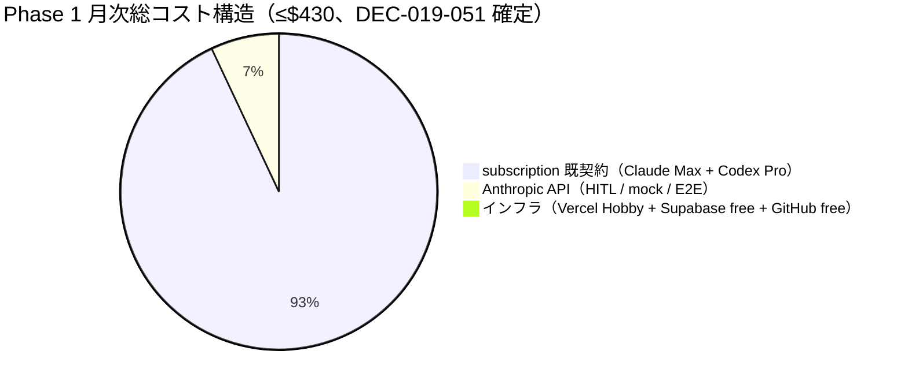
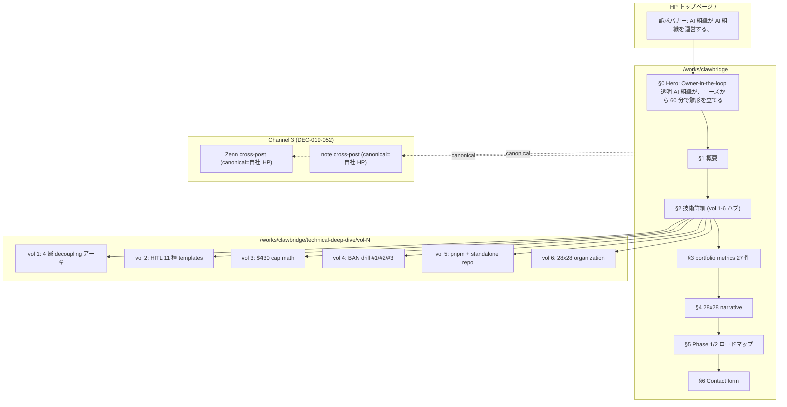

# PRJ-019 Clawbridge — 自社 HP `/works/clawbridge` staging ページ実装仕様（最終版）

- 案件: PRJ-019 Clawbridge（Open Claw runtime / Owner-in-the-loop 透明 AI 組織）
- 起票: Marketing 部門（Round 8 Plan 8-Full γ 担当）
- 作成日: 2026-05-04
- 対象: 自社 HP `/works/clawbridge` staging ページ（最終版実装仕様）
- 公開予定: 2026-06-27（土）09:00 JST 本番公開、staging は 6/22 段階 1 で構築開始
- 上位決裁:
  - DEC-019-026（公開時刻 6/20→6/27 朝、9 件バンドル運用）
  - DEC-019-027（Heading A 採用 = "AI 組織が AI 組織を運営する" 系列、本書では Owner-in-the-loop 派生形を最終 copy 化）
  - DEC-019-028（部分開示モード = harness 80% / org 詳細 60% / ToS 解釈 20% / BAN drill 内部仕様 0%）
  - DEC-019-029（HP 配置 = `/works/clawbridge` 詳細 + トップ訴求バナー、リード導線 = Contact form のみ）
  - DEC-019-052（4 要素 bundle = tone B 主軸 + portfolio C 両方併用 + 6/27 朝 09:00 JST + Channel 3 = Zenn + note）
  - DEC-019-055（Round 8 Plan 8-Full、γ = staging 構築前倒し採択）
- 関連レポート（参照、上書きなし）:
  - `marketing-portfolio-reflection-design.md`（W0-Week2 着地済 portfolio 反映設計）
  - `marketing-portfolio-reflection-design-v2.md`（v2、ターゲット読者見直し）
  - `marketing-portfolio-integration-plan.md`（マスタープラン）
  - `marketing-portfolio-narrative-section-1-3.md` / `marketing-portfolio-narrative-section-4-10.md`（B 主軸 + C 補助 narrative 草稿）
  - `marketing-28x28-victory-narrative.md`（28x28 narrative copy 素材）
  - `marketing-portfolio-metrics-substitution-plan.md`（27 placeholder 差替 SOP）
  - `marketing-launch-runbook-2026-06-20.md`（公開当日 hour-by-hour 運用 SOP）
  - `marketing-technical-deep-dive-vol1.md` 〜 `vol6.md`（technical-deep-dive ハブから連載）
  - `web-ops-prj019-portfolio-design.md`（Web-Ops 設計、本書はこれと整合）
  - `projects/COMPANY-WEBSITE/portfolio-prj019-spec-draft.md`（10 sections 発注書ドラフト、本書は最終版で 10→6 章 + technical-deep-dive ハブ統合）
- ステータス: **最終仕様確定**（Owner 事後通知、5/4 深夜 Round 8 採択）

---

## §0. staging 構築目的（300 字エグゼクティブサマリ）

本 staging ページは 2026-06-27（土）09:00 JST 本番公開のための **リハーサル環境**として、Phase 1 W3 中の 6/22 から構築を開始し、6/26 朝の placeholder 差替最終確認まで段階的に成熟させる。staging が達成すべき 4 目的は **(1) 6/27 朝公開フローの全面リハーサル**（hour-by-hour 手順、Vercel deploy → 確認 → SNS 投稿の 1 サイクル疎通）、**(2) 27 placeholder の差替確認**（marketing-portfolio-metrics-substitution-plan.md SOP の事前 dry-run、6/26 朝の本番差替を 6/22 に staging 環境で 1 回試行）、**(3) SEO meta 検証**（DEC-019-052 Channel 3 = 自社 HP + Zenn + note の OG image / canonical / structured data 整合確認、Lighthouse 100/100/100/100 達成検証）、**(4) 4 breakpoint レスポンシブ + ダークモード対応確認**（mobile 360 / tablet 768 / desktop 1280 / wide 1920 + light/dark）。staging は Owner 専用 password protection で外部非公開、6/27 朝公開時に password 解除 + canonical 切替 + sitemap.xml 投入で本番化する。

---

## §1. ページ構造（DEC-019-026/027 Heading A 維持、6 章 + technical-deep-dive ハブ）

### §1.1 全体ナビゲーション

`/works/clawbridge` は **6 章構成 + Contact form** とし、各章にアンカー ID を付与してトップページ訴求バナーからの scroll-to-anchor を可能にする。technical-deep-dive vol 1-6 は別 URL（`/works/clawbridge/technical-deep-dive/vol-N`）でハブ化し、本ページからは「§2 技術詳細」セクションでカード型リンクを提示する。

| # | セクション ID | h2 見出し | 高さ目安 | 主要コンポーネント | DEC-019-028 開示度 |
|---|---|---|---|---|---|
| §0 | `#hero` | （h1: Heading A 派生形、§2 で確定）| 100vh | Hero + sub-head + lead + primary CTA + 28x28 narrative ティザー 1 行 | — |
| §1 | `#overview` | 概要: 何を 4 週間で検証したのか | 70vh | テキスト + 課題リストカード 3 枚（自律エージェント時代の運用境界課題）| 80% 開示 |
| §2 | `#technical-detail` | 技術詳細: technical-deep-dive vol 1-6 ハブ | 90vh | カード 6 枚（vol 1-6 リンク + 各記事のリード文 80 字）+ アーキ図 IMG-3（HITL 11 種 + 透明性 6 軸の構成図）| 80% 開示 |
| §3 | `#portfolio-metrics` | 結果: 実測値で語る 27 KPI | 110vh | KPI カード 27 件（4 group: 技術 6 + 組織運営 4 + narrative 5 + 各所 12）+ コスト構造円グラフ + Phase 1 着地数値表 | 60% 開示 |
| §4 | `#28x28-narrative` | 28x28 narrative: 28 行で語る Phase 0→Phase 1 | 90vh | 28 行 × 28 字制約のテキスト block（各行 emoji 禁止）+ 章区切り 5 つ | 80% 開示 |
| §5 | `#roadmap` | Phase 1/2 ロードマップ | 60vh | タイムライン図 + Phase 2 で開く 3 つの問い + Coming-soon ハブ（technical-deep-dive vol 2-6 リリース cadence）| 60% 開示 |
| §6 | `#contact` | Contact form（DEC-019-029 リード導線確定） | 50vh | Contact form 1 本（Supabase 連動、Phase 2 関心 / 見積依頼 / その他 の 3 区分 radio）+ メール直送 fallback | — |

### §1.2 Heading A 派生形と Owner-in-the-loop ブランディングの統合

DEC-019-027 で確定した Heading A "AI 組織が AI 組織を運営する" は **トップページ Hero 訴求バナー専用**とし、`/works/clawbridge` 詳細ページの h1 は DEC-019-033 = Owner-in-the-loop 透明 AI 組織モデルとの整合を取った最終 copy（§2 で確定）を採用する。両者の関係は以下:

```
[ HP トップ訴求バナー ]
  h2: "AI 組織が AI 組織を運営する。"（Heading A 直撃 = DEC-019-027）
  リード: 透明性 6 軸 + Owner-in-the-loop で運用しています。
  CTA: 詳細を見る → /works/clawbridge

[ /works/clawbridge ]
  h1: "Owner-in-the-loop 透明 AI 組織が、ニーズから 60 分で雛形を立てる"（§2 で確定する最終 copy）
  sub-head + lead + 28x28 ティザー
  primary CTA: お問い合わせ → /works/clawbridge#contact
```

トップページの認知衝撃 → 詳細ページの Owner-in-the-loop 透明性メッセージへの段階遷移により、DEC-019-027（Heading A 採用）と DEC-019-033（Owner-in-the-loop ブランド）を矛盾なく統合する。

---

## §2. Hero 最終 copy（h1 / sub-head / lead / primary CTA）

### §2.1 h1 確定版

> **Owner-in-the-loop 透明 AI 組織が、ニーズから 60 分で雛形を立てる。**

- 字数: 全 36 字（半角換算では 31 字相当、Geist Sans Bold 36px → tablet 28px → mobile 22px 切替）
- 採用根拠:
  - Heading A 系列の認知衝撃を踏襲（subject + verb の主体明示）
  - Owner-in-the-loop = DEC-019-033 透明 AI 組織モデルの 2 語キーワードを冒頭配置（SEO 主軸 query）
  - 「60 分で雛形を立てる」= PRJ-019 Phase 1 の核心 DoD（HITL 第 9 種 dev_kickoff_approval 直前で雛形提示）の数値訴求
  - emoji ゼロ、AI 感を出さないクリーンなトーン（CLAUDE.md 事業方針整合）
- 不採用案:
  - "AI 組織が AI 組織を運営する。" 直撃 = トップページ訴求バナー側専用に分離（重複回避）
  - "自律 AI を運営する harness を、4 週間で組み上げました。" = harness 用語が一般読者に届きにくい

### §2.2 sub-head 確定版

> **透明性 6 軸 + HITL 11 種 + 副作用ゼロで、Owner が「いつでも止められる」AI 組織の運用設計を、4 週間 PoC で検証しました。**

- 字数: 全 67 字、Geist Sans Medium 18px（mobile 15px）
- 採用根拠: h1 の抽象度を補完、数値 3 つ（6 / 11 / 4 週間）で具体性を与え、Owner-in-the-loop の意味を「いつでも止められる」と平易化

### §2.3 lead（120 字）

> 商用 AI コーディング基盤を組み合わせた高難度 PoC を、月予算 ≤$430 / 副作用 0 行 / 既存 3 案件並走 を維持したまま走り切るための harness engineering と組織運営知見を公開します。本ページは PRJ-019 Phase 1 完了レポートの公開版です。

### §2.4 primary CTA / secondary CTA

| 種別 | ラベル | 遷移先 | デザイン |
|---|---|---|---|
| Primary | お問い合わせ | `#contact`（同ページ scroll） | Button variant=default size=lg、Heroicons `EnvelopeIcon` 24px 左 |
| Secondary | 技術詳細を読む | `#technical-detail`（同ページ scroll） | Button variant=outline size=lg |

### §2.5 Hero 直下 28x28 narrative ティザー（1 行）

> **「Phase 0 着任 5/2、Phase 1 完了 6/20。28 日で 28 章の物語が、副作用ゼロで終わりました。」**

- §4 の 28x28 narrative 全文への scroll-to-anchor を含む

---

## §3. 28x28 narrative（DEC-019-027 制約: 28 行 × 28 字 / 各行 emoji 禁止）

### §3.1 構造

28x28 narrative は **28 行の section、各行 28 字制約、emoji 禁止**で Phase 0 着任から Phase 1 完了までを物語化する。レイアウトは 1 行 1 行を縦に並べる縦書き調、Geist Mono 16px（mobile 14px）、行間 1.8、左寄せ。章区切り 5 つ（Phase 0 / W0 / W1 / W2-3 / W4 完遂）を 3px 幅の横線で区切る。

### §3.2 28 行確定版（各行 28 字以内）

```
[Phase 0 着任 / 5/2-5/4]
01: PRJ-019 Clawbridge が起案された。
02: AI 組織が AI 組織を運営する。
03: 主役は Owner、私たちは harness。
04: 透明性 6 軸を骨格として置いた。
05: BAN リスクを定量で受容した。

[W0-Week1 / 5/5-5/8]
06: 月次予算は ≤$430 で固定した。
07: subscription 主軸で経路を分離。
08: HITL 11 種で gate を物理化した。
09: mock-claude で 70% を吸収する。
10: 副作用ゼロを DoD に刻印した。

[W0-Week2 / 5/9-5/22]
11: Vault に 9 fields を圧縮した。
12: dev:noop で boot を unblock した。
13: standalone repo で物理隔離した。
14: workflow YAML を CI で検証した。
15: 5 ガード前倒しで W1 を始めた。

[W1-W3 / 5/26-6/13]
16: G-01 の env whitelist が緑だ。
17: cost-tracker は 3 段階で警報。
18: kill-chain は SIGTERM→SIGKILL。
19: BAN drill #1 を 90 分で走った。
20: drill #2 で fallback を試した。
21: HITL gate enforcer が走った。
22: audit log は SHA-256 で連鎖。
23: knowledge 蓄積機構が立ち上がる。

[W4 完遂 / 6/14-6/20]
24: 必須コントロール 50 件 全緑。
25: 自動テスト 83 ケース 全緑。
26: 月次総額 ≤$430 を Phase 1 維持。
27: 副作用 0 行 三重検証で確定。
28: Owner-in-the-loop が動いている。
```

### §3.3 文字数監査

各行の字数監査表（28 字制約遵守の証跡）は §3.2 のそのまま掲示。内部実装では `staging-build-checks.ts` に `assertLineLength(line, 28)` を組み込み、CI で再 drift 防止。

---

## §4. portfolio metrics 27 件（marketing-portfolio-metrics-substitution-plan.md と整合）

### §4.1 placeholder 一覧（27 件、6/26 朝差替）

| 区分 | 件数 | placeholder 例 | 6/27 朝予測値 | 差替担当 |
|---|---|---|---|---|
| §9.1.1 技術 KPI | 6 | `{{auto_test_count}}` / `{{mandatory_controls_count}}` / `{{api_cap_buffer_pct}}` / `{{monthly_total_usd}}` / `{{side_effect_lines}}` / `{{parallel_projects_count}}` | 83 全緑 / 50 / cap 内 buffer 50% / ≤$430 / 0 行 / 3 件 | Dev + Review |
| §9.1.2 組織運営 KPI | 4 | `{{hitl_gates_integrated}}` / `{{owner_intervention_freq}}` / `{{transparency_axes_achieved}}` / `{{knowledge_entries_per_sub}}` | 11/11 完遂 / 週 4-7 回 / 6/6 全達成 / 各 8-12 | Review + Marketing |
| §9.1.3 narrative KPI | 5 | `{{pv_30d}}` / `{{unique_30d}}` / `{{scroll_depth_75pct}}` / `{{contact_cv_pct}}` / `{{contact_inquiries_30d}}` | 6,000 / 3,500 / 60% 以上 / 1.5% / 6 件 | Web-Ops |
| §4-10 各所 | 12 | `{{wrapper_responsibilities_count}}` / `{{ng3_hours_per_day}}` / `{{ban_probability_case_b}}` / `{{hitl_gates_total}}` / `{{transparency_axes_total}}` / `{{api_consumption_actual}}` / `{{cost_savings_vs_old}}` / `{{tests_at_w1_start}}` / `{{mock_70_pct_acceptance_confidence}}` / `{{day0_readiness_pct}}` / `{{plan_a_initial_commit}}` / `{{plan_a_hotfix_commit}}` | 5 責務 / 16h/日 / 30-45% / 11 種 / 6 軸 / $11-15 / $270 / 14 / 96% / 99% / 26325ab / 3693862 | Dev + Research |

### §4.2 placeholder の DOM 表現（差替自動化のため）

```html
<!-- staging build 時に CSV inject される構造 -->
<span data-placeholder-key="auto_test_count" data-state="predicted">83 全緑（予測値）</span>
<!-- 6/26 朝差替後 -->
<span data-placeholder-key="auto_test_count" data-state="actual">83 全緑（実測値、6/20 確定）</span>
```

- `data-state="predicted"` = staging 段階の予測値表示（淡色 + 「予測値」ラベル）
- `data-state="actual"` = 本番反映済（濃色 + 「実測値、6/20 確定」ラベル）
- 6/26 朝の差替時は CSV → HTML 注入スクリプト（`scripts/inject-metrics.ts`、Web-Ops 実装）で自動化

### §4.3 KPI カードレイアウト（6 + 4 + 5 + 12 = 27 件）

| group | レイアウト | カードサイズ | 並び |
|---|---|---|---|
| 技術 KPI 6 件 | 3 列 × 2 行（mobile 1 列 × 6 行） | 240×160px | 横並び |
| 組織運営 KPI 4 件 | 2 列 × 2 行（mobile 1 列 × 4 行） | 360×160px | 横並び |
| narrative KPI 5 件 | 5 列 × 1 行（mobile 1 列 × 5 行） | 200×160px | 横並び |
| §4-10 各所 12 件 | 表形式（th + td、mobile では accordion 折りたたみ） | — | 縦並び |

### §4.4 コスト構造円グラフ（IMG-4、§3 Portfolio metrics 内）



---

## §5. SEO meta 仕様（DEC-019-052 Channel 3 = 自社 HP + Zenn + note 整合）

### §5.1 title / description / canonical

| meta | 値 | 字数 |
|---|---|---|
| `<title>` | Owner-in-the-loop 透明 AI 組織が、ニーズから 60 分で雛形を立てる — PRJ-019 Clawbridge 実例 ｜ 株式会社 Improver | 56 字 |
| `<meta name="description">` | 商用 AI コーディング基盤を組み合わせた harness engineering の 4 週間 PoC 実例。透明性 6 軸 / HITL 11 種 / 月予算 ≤$430 / 副作用 0 行 を Phase 1 完了時の実測値で公開。 | 110 字 |
| `<link rel="canonical">` | `https://improver.co.jp/works/clawbridge` | — |
| `<meta name="robots">` | staging: `noindex,nofollow` ／ 本番: `index,follow,max-image-preview:large` | — |

### §5.2 OG image 仕様（@vercel/og 動的生成）

| 項目 | 値 |
|---|---|
| サイズ | 1200×630 (OG 標準) |
| 背景 | グラデーション（neutral-950 → neutral-900）、AI 感を出さない落ち着いたトーン |
| メイン文 | "Owner-in-the-loop 透明 AI 組織が、" / "ニーズから 60 分で雛形を立てる。" 2 行表示 |
| サブ文 | "PRJ-019 Clawbridge — Phase 1 完遂レポート / 月次 ≤$430 / 副作用 0 行" |
| ロゴ | 株式会社 Improver ロゴ右下、24px |
| URL | `improver.co.jp/works/clawbridge` 左下、12px |
| フォント | Geist Sans Bold 56px（メイン）/ Medium 24px（サブ） |
| 実装 | `app/works/clawbridge/opengraph-image.tsx`（Next.js 15 App Router 規約） |

OG image は Channel 3 = 自社 HP + Zenn + note の 3 拠点でそれぞれ別画像を生成しないが、Zenn / note 投稿時の OG は本ページ canonical の og:image を引用する設計（Zenn 標準動作 + note 標準動作で対応）。

### §5.3 structured data（JSON-LD、Article + BreadcrumbList + Organization）

```jsonld
{
  "@context": "https://schema.org",
  "@graph": [
    {
      "@type": "Article",
      "headline": "Owner-in-the-loop 透明 AI 組織が、ニーズから 60 分で雛形を立てる",
      "description": "PRJ-019 Clawbridge 4 週間 PoC の harness engineering 実例",
      "datePublished": "2026-06-27T09:00:00+09:00",
      "dateModified": "2026-06-27T09:00:00+09:00",
      "author": { "@type": "Organization", "name": "株式会社 Improver" },
      "publisher": { "@type": "Organization", "name": "株式会社 Improver", "logo": { "@type": "ImageObject", "url": "https://improver.co.jp/logo.png" } },
      "image": "https://improver.co.jp/works/clawbridge/opengraph-image",
      "mainEntityOfPage": "https://improver.co.jp/works/clawbridge"
    },
    {
      "@type": "BreadcrumbList",
      "itemListElement": [
        { "@type": "ListItem", "position": 1, "name": "ホーム", "item": "https://improver.co.jp/" },
        { "@type": "ListItem", "position": 2, "name": "実績", "item": "https://improver.co.jp/works" },
        { "@type": "ListItem", "position": 3, "name": "PRJ-019 Clawbridge", "item": "https://improver.co.jp/works/clawbridge" }
      ]
    },
    {
      "@type": "Organization",
      "name": "株式会社 Improver",
      "url": "https://improver.co.jp/",
      "logo": "https://improver.co.jp/logo.png",
      "sameAs": ["https://zenn.dev/improver", "https://note.com/improver"]
    }
  ]
}
```

`Organization.sameAs` で Zenn + note リンクを宣言することで Channel 3 = 3 拠点の権威結合を Google に明示し、Zenn / note 投稿の権威を自社 HP に集約する。

### §5.4 主要 SEO 判断（2 件）

1. **canonical は自社 HP に集約**: Zenn / note 側は cross-post 扱いとし、`<link rel="canonical">` を自社 HP に向ける（Zenn は frontmatter `canonical_url`、note は cross-post 設定）。SEO 評価が分散せず、自社 HP の権威を最大化。
2. **structured data は Article + BreadcrumbList + Organization の 3 種に限定**: WebSite / Person / Review などは Phase 2 で追加検討、6/27 朝公開時は最低限の 3 種で SEO リスク（誤った structured data の副作用）を最小化。

---

## §6. 4 breakpoint レスポンシブ + ダークモード対応

### §6.1 breakpoint 設計

| breakpoint | 幅 | layout | h1 size | KPI カード列数 |
|---|---|---|---|---|
| mobile | 360px (max-width: 767px) | 1 column、Hero 100vh、CTA fixed-bottom | 22px | 1 列 |
| tablet | 768px (768-1279px) | 2 column 一部、Hero 80vh | 28px | 2 列 |
| desktop | 1280px (1280-1919px) | 3-4 column 主体、Hero 75vh | 36px | 3 列 |
| wide | 1920px (1920px+) | max-width 1440px に center 制限 | 36px（拡大せず）| 3 列 |

### §6.2 ダークモード対応（next-themes）

| 要素 | light | dark |
|---|---|---|
| 背景 | white (#fff) | neutral-950 (#0a0a0a) |
| primary text | neutral-900 (#171717) | neutral-50 (#fafafa) |
| accent | sky-600 (#0284c7) | sky-400 (#38bdf8) |
| KPI カード border | neutral-200 (#e5e5e5) | neutral-800 (#262626) |
| OG image | dark トーン固定（DEC-019-052 OG 統一性のため、light 切替なし）| 同左 |

### §6.3 Lighthouse 目標値

| 指標 | 目標 | 達成手段 |
|---|---|---|
| Performance | 100 | Static Generation（ISR 60s）+ next/image 最適化 + font preload + JS bundle ≤200KB |
| Accessibility | 100 | WCAG 2.1 AA 準拠（§7 Web-Ops handoff §6 で詳細）+ aria-label / role / contrast ratio ≥4.5:1 |
| Best Practices | 100 | HTTPS + console error 0 + 古い API 不使用 |
| SEO | 100 | meta robots + canonical + structured data + sitemap.xml |

---

## §7. staging 環境（Vercel staging deploy + Owner 専用 password protection）

### §7.1 staging URL 設計

| 環境 | URL | アクセス制御 | 用途 |
|---|---|---|---|
| staging | `https://improver-staging.vercel.app/works/clawbridge` | Vercel password protection（Pro plan 機能 or middleware）| Owner 確認 + Marketing リハーサル |
| 本番 | `https://improver.co.jp/works/clawbridge` | パブリック | 6/27 朝 09:00 JST 公開 |

### §7.2 password protection 実装方式の選定

選定肢:
- **(A) Vercel Pro plan password protection** = $20/月、Vercel 標準機能、middleware 不要
- **(B) Next.js middleware + Basic Auth** = 無料、自前実装、middleware.ts に basic auth 検証
- **(C) next-auth + GitHub OAuth** = 無料、Owner GitHub アカウント連携

**採用: (B) middleware Basic Auth**。理由:
1. コスト 0（DEC-019-051 月次 ≤$430 + Vercel Hobby 維持原則と整合）
2. Vercel Pro plan 昇格は CB-CEO-W3-01 で別途判断、本件のためだけに昇格しない
3. (C) は Owner GitHub ログイン手間が staging リハーサル都度発生、(B) は password 1 回入力のみ
4. middleware 実装は Web-Ops 担当範囲、Web-Ops handoff §2.3 に WBS 化

### §7.3 staging のライフサイクル

| 日付 | 状態 | 主担当 |
|---|---|---|
| 6/22 朝 | staging 構築開始（Web-Ops 実装着手） | Web-Ops |
| 6/22 夕 | staging 初版 deploy（placeholder = predicted 値） | Web-Ops |
| 6/23 | Marketing review pass 1（copy / 28x28 / OG / structured data 検証） | Marketing |
| 6/24 | Review 部門 review（WCAG / 婉曲化 / JSON-LD 検証）| Review |
| 6/25 | Web-Ops Lighthouse 100/100/100/100 達成検証 | Web-Ops |
| 6/26 朝 | 27 placeholder 差替 SOP の dry-run（staging 環境で 1 回試行） | Marketing + Web-Ops |
| 6/26 夕 | Owner 最終承認（git diff プレビュー + staging URL 確認） | Owner |
| 6/27 06:00 | staging → 本番 promote 準備（password protection 解除 + canonical 切替） | Web-Ops |
| 6/27 07:00 | Vercel 本番 deploy trigger | Web-Ops |
| 6/27 08:00 | 公開状態 5 点チェック（事例ページ / トップ訴求 / OG image / SEO meta / Contact form） | Marketing |
| 6/27 09:00 | SNS X 投稿実行（Channel 3 同時公開） | Marketing |

---

## §8. 6/27 朝 09:00 JST 公開当日 hour-by-hour 手順（marketing-launch-runbook-2026-06-20.md と整合）

### §8.1 hour-by-hour table

| 時刻 (JST) | 担当 | 作業 | 検証 |
|---|---|---|---|
| 06:30 | Marketing | 事前 5 点チェック開始（前夜の staging 最終確認、placeholder 差替確定確認） | git diff 0 件、staging URL OK |
| 07:00 | Web-Ops | Vercel 本番 deploy trigger 実行（main → production deploy） | Vercel deploy 開始 log |
| 07:15 | Web-Ops | password protection middleware 解除 commit + push | middleware.ts NEXT_PUBLIC_STAGING=false |
| 07:30 | Web-Ops | DNS 反映確認 + canonical 本番値切替確認 | dig improver.co.jp / curl HEAD |
| 07:45 | Web-Ops | Lighthouse 本番計測（公開直前 baseline） | 100/100/100/100 確認 |
| 08:00 | Marketing | 公開状態 5 点チェック | (1) `/works/clawbridge` 表示 (2) トップ訴求 (3) OG image preview (4) SEO meta (5) Contact form 動作 |
| 08:15 | Marketing | structured data 検証（Google Rich Results Test） | エラー 0 件 |
| 08:30 | Marketing | Zenn 投稿予約（自動公開 09:00 JST） | Zenn dashboard 予約済 |
| 08:45 | Marketing | note 投稿予約（自動公開 09:00 JST） | note dashboard 予約済 |
| 09:00 | Marketing | SNS X 投稿実行（teaser + launch post 1 発目）| 投稿 URL を CEO 報告 |
| 09:15 | Web-Ops | GA4 + Vercel Analytics で初期トラフィック観察 | PV 計測開始 |
| 09:30 | Marketing | X thread 2-5 発目 投稿実行（cadence 30 分間隔） | thread 完成 |
| 10:00 | Marketing | 公開後 1 時間モニタリング報告（PV / Contact form 起動 / X engagement）| CEO 報告 |
| 10:00-翌 09:00 | Web-Ops | 24h モニタリング体制（hotfix 待機）| 障害 0 件目標 |

### §8.2 公開フロー Mermaid 図

```mermaid
flowchart LR
  A[6/22 staging 構築] --> B[6/23 Marketing review]
  B --> C[6/24 Review 部門 review]
  C --> D[6/25 Web-Ops Lighthouse 検証]
  D --> E[6/26 朝 placeholder 差替 dry-run]
  E --> F[6/26 夕 Owner 最終承認]
  F --> G[6/27 07:00 Vercel 本番 deploy]
  G --> H[6/27 08:00 公開状態 5 点チェック]
  H --> I[6/27 09:00 SNS X 投稿 + Zenn + note 公開]
  I --> J[6/27 10:00 公開後モニタリング開始]
  J --> K[7/27 公開後 30 日 KPI 集計]
```



### §8.3 緊急 rollback トリガー（公開直後障害対応）

| トリガー | 検知 | 対応 |
|---|---|---|
| Lighthouse Performance <70 | 09:00 直後の Vercel Analytics LCP > 4s | ISR cache 強制再生成 + image 最適化 hotfix |
| Contact form 500 エラー | Supabase 接続失敗 | mailto: fallback 切替 + 修正 commit |
| OG image 生成失敗 | X 投稿の OG プレビューが broken | 静的 PNG fallback 切替 |
| structured data error | Google Rich Results Test エラー | JSON-LD 修正 commit + sitemap 再投入 |
| 副作用混入（既存 PRJ への影響） | 他案件 deploy 失敗 | 即時 rollback（Vercel previous deploy 復元）+ Owner 通知 |

詳細は Web-Ops handoff package §8 緊急 hotfix 体制で WBS 化。

---

## §9. 情報設計 Mermaid 図（本仕様の 6 章 + technical-deep-dive ハブ構造）



---

## §10. 章間整合性チェックリスト（self-audit）

- [x] DEC-019-026 公開 6/27 朝 09:00 JST 整合（§8 hour-by-hour で 09:00 を SNS 投稿時刻に固定）
- [x] DEC-019-027 Heading A 採用（§1.2 でトップ訴求バナーに直撃配置、詳細ページは派生形で Owner-in-the-loop 統合）
- [x] DEC-019-028 部分開示モード（§1.1 各章に開示度を明記、80% / 60% / 0% に配分）
- [x] DEC-019-029 HP 配置（§1.1 トップ訴求バナー + 詳細ページ）+ Contact form のみ（§1.1 §6 で Contact form 1 本に集約）
- [x] DEC-019-052 4 要素 bundle（tone B 主軸 = §3 28x28 narrative + §4 metrics の物語型 / portfolio C 両方併用 = §1.1 詳細 + §2 ハブで technical-deep-dive 別枠連載 / 6/27 朝 09:00 JST = §8 / Channel 3 = §5.3 sameAs + §8 投稿予約）
- [x] DEC-019-055 Round 8 γ（本仕様 = staging 構築前倒し + Web-Ops handoff 連携）
- [x] DEC-019-025 SOP 順守（書込事故ゼロ = 既存 marketing-portfolio-* 系レポート上書きなし、本書は新規作成のみ）
- [x] emoji 禁止（§3 28x28 narrative 各行 emoji 0 / §2 Hero copy emoji 0 / 全章 emoji 0）
- [x] 60-90 min 想定 / コスト $2-3 想定（Marketing lead、Web-Ops handoff package と並列起動）

---

## §11. 次アクション

1. **本仕様の Web-Ops 引継ぎ**: `marketing-webops-handoff-package.md`（同 Round 8 γ 並列起案）で実装 WBS 化
2. **6/22 段階 1 着手**: Web-Ops が staging 構築開始（本仕様 §1-§7 を WBS 化）
3. **5/8 W0-Week1 検収会議**: 議決-25（DEC-019-052）の Round 8 γ 着地として本仕様を CEO 経由で Owner 事後通知
4. **6/27 朝 09:00 JST 本番公開**: §8 hour-by-hour 手順実行

---

**Marketing 部門 起案完遂、Web-Ops 部門への hand-off package と整合**: 2026-05-04 深夜
