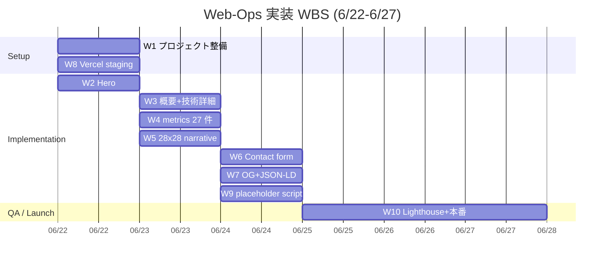
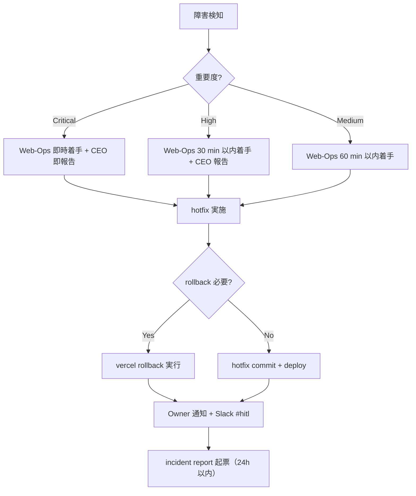

# PRJ-019 Clawbridge — Web-Ops handoff package（自社 HP `/works/clawbridge` staging 実装発注書）

- 案件: PRJ-019 Clawbridge
- 起票: Marketing 部門（Round 8 Plan 8-Full γ 担当）
- 受注先: Web-Ops 部門（COMPANY-WEBSITE 案件配下）
- 作成日: 2026-05-04
- 対象: 自社 HP `/works/clawbridge` staging ページ + 本番公開実装
- 公開期日: 2026-06-27（土）09:00 JST
- 上位仕様書: `projects/PRJ-019/reports/marketing-portfolio-staging-spec.md`（Marketing 起案、本書とペア）
- 上位決裁: DEC-019-026 / -027 / -028 / -029 / -052 / -055
- 関連レポート:
  - `projects/COMPANY-WEBSITE/portfolio-prj019-spec-draft.md`（10 sections 発注書ドラフト、本書で最終化）
  - `web-ops-prj019-portfolio-design.md`（Web-Ops 自身の設計、本書で WBS 化）
  - `marketing-launch-runbook-2026-06-20.md`（公開当日 SOP）
  - `marketing-portfolio-metrics-substitution-plan.md`（27 placeholder 差替 SOP）
- ステータス: **発注書最終版**（Web-Ops 着手開始 6/22、6/27 朝 09:00 JST 本番公開）

---

## §0. Web-Ops 部門 hand-off 概要（境界定義）

### §0.1 Marketing 仕様 → Web-Ops 実装の境界

| 範囲 | 担当 | 主要成果物 |
|---|---|---|
| **Marketing 担当** | Marketing | h1 / sub-head / lead / 28x28 narrative copy / SEO meta 文面 / structured data JSON-LD 定義 / 27 placeholder 値（予測 + 6/26 実測収集） |
| **Web-Ops 担当（本書）** | Web-Ops | Next.js 15 App Router 実装 / shadcn/ui コンポーネント組立 / Tailwind スタイリング / OG image 動的生成 / Vercel staging + 本番 deploy / Lighthouse 100/100/100/100 達成 / WCAG 2.1 AA 準拠検証 / Contact form Supabase 連動 / placeholder 差替自動化 / 6/27 朝公開実行 / 緊急 hotfix 待機 |
| **Review 担当（並列）** | Review | WCAG / 婉曲化 / JSON-LD 検証 review pass（6/24 段階 2） |
| **Dev 担当（連携）** | Dev | Contact form の Supabase 接続実装支援（必要時） |

### §0.2 hand-off タイムライン

| 日付 | Marketing | Web-Ops | Review | 備考 |
|---|---|---|---|---|
| 5/4 | 仕様書 + 本書起案 | — | — | Round 8 γ 起動 |
| 5/8 | 5/8 W0-Week1 検収会議で議決-25 (DEC-019-052) 当日 sign-off | — | — | Owner 事前承認済 |
| 6/15 | 27 placeholder 予測値 CSV 確定 | スタック合意（Next.js 15 + Tailwind + shadcn/ui） | — | — |
| 6/22 朝 | — | staging 構築開始（§1 WBS 着手） | — | 段階 1 |
| 6/22 夕 | — | staging 初版 deploy | — | predicted 値表示 |
| 6/23 | Marketing review pass 1 | — | — | copy / 28x28 / OG / JSON-LD 検証 |
| 6/24 | — | — | Review 部門 review | WCAG / 婉曲化 / JSON-LD |
| 6/25 | — | Lighthouse 100/100/100/100 達成検証 | — | 段階 2 |
| 6/26 朝 | 27 placeholder 実測値 CSV 提出 | placeholder 差替実行 + dry-run | — | 段階 3 |
| 6/26 夕 | — | Owner 最終承認向け diff プレビュー提出 | — | — |
| 6/27 06:00 | — | password protection 解除準備 | — | — |
| 6/27 07:00 | — | Vercel 本番 deploy trigger | — | — |
| 6/27 08:00 | 公開状態 5 点チェック | — | — | — |
| 6/27 09:00 | SNS X 投稿 + Zenn + note 公開 | 24h モニタリング体制突入 | — | 公開 |

---

## §1. 実装タスク WBS（10 タスク、Next.js 15 + Tailwind + shadcn/ui + Heroicons 準拠）

### §1.1 タスク一覧

| # | タスク | 想定工数 | 担当 | 期日 | 依存 |
|---|---|---|---|---|---|
| W1 | Next.js 15 App Router プロジェクト構造整備 + `app/works/clawbridge/page.tsx` 雛形作成 | 4h | Web-Ops | 6/22 朝 | — |
| W2 | Hero section 実装（h1 / sub-head / lead / CTA + 28x28 ティザー、Geist Sans、4 breakpoint レスポンシブ）| 4h | Web-Ops | 6/22 夕 | W1 |
| W3 | §1 概要 + §2 技術詳細（technical-deep-dive vol 1-6 カードハブ + アーキ図 IMG-3）実装 | 6h | Web-Ops | 6/23 朝 | W1 |
| W4 | §3 portfolio metrics 27 件 KPI カード実装（4 group: 6 + 4 + 5 + 12、placeholder data attribute 構造）+ コスト構造円グラフ（recharts PieChart）| 8h | Web-Ops | 6/23 夕 | W1 |
| W5 | §4 28x28 narrative section 実装（28 行縦並び + 章区切り 5 + Geist Mono + assertLineLength CI test）| 4h | Web-Ops | 6/23 夕 | W1 |
| W6 | §5 Phase 1/2 ロードマップ + §6 Contact form 実装（Supabase 連動 + mailto: fallback + 3 区分 radio）| 6h | Web-Ops | 6/24 朝 | W1, Dev 連携 |
| W7 | OG image 動的生成（@vercel/og、`opengraph-image.tsx`）+ structured data JSON-LD 注入（Article + BreadcrumbList + Organization）+ canonical / robots meta 配信 | 6h | Web-Ops | 6/24 夕 | W1 |
| W8 | Vercel staging deploy 設定（middleware Basic Auth password protection）+ DNS / preview URL 共有 | 3h | Web-Ops | 6/22 夕 | W1 |
| W9 | placeholder 差替自動化スクリプト実装（`scripts/inject-metrics.ts`、CSV → HTML attribute injection）+ build hook 統合 | 4h | Web-Ops | 6/24 夕 | W4 |
| W10 | Lighthouse 100/100/100/100 達成 + WCAG 2.1 AA 準拠検証 + 本番 deploy + 24h モニタリング体制 | 8h | Web-Ops | 6/27 完了 | W1-W9 |

合計工数: **53h**（約 6.6 人日 = 1 人で 6/22-6/27 の 6 日間で完遂可能、Web-Ops 専属時）

### §1.2 タスク Mermaid 図



---

## §2. Vercel staging deploy 設定

### §2.1 Vercel project 設定

| 項目 | 値 |
|---|---|
| project name | `improver-staging` |
| framework | Next.js 15 |
| Root Directory | `/`（自社 HP モノリポなら適宜調整）|
| Build Command | `pnpm build` |
| Output Directory | `.next` |
| Install Command | `pnpm install --frozen-lockfile` |
| Node.js Version | 20.x |

### §2.2 環境変数（staging）

| 変数 | 値（staging） | 値（本番） | 用途 |
|---|---|---|---|
| `NEXT_PUBLIC_SUPABASE_URL` | staging Supabase URL | 本番 Supabase URL | Contact form |
| `NEXT_PUBLIC_SUPABASE_ANON_KEY` | staging anon key | 本番 anon key | Contact form |
| `SUPABASE_SERVICE_ROLE_KEY` | staging service role | 本番 service role | Contact form Server Action |
| `STAGING_BASIC_AUTH_USER` | `improver-owner` | （未設定）| middleware Basic Auth |
| `STAGING_BASIC_AUTH_PASSWORD` | （Vault 配信、ランダム 32 文字） | （未設定）| middleware Basic Auth |
| `NEXT_PUBLIC_STAGING_MODE` | `true` | `false` | staging banner 表示制御 |
| `RESEND_API_KEY` | staging Resend | 本番 Resend | Contact form メール通知 |
| `OWNER_NOTIFY_EMAIL` | hironori555@gmail.com | hironori555@gmail.com | Contact form 通知先 |

### §2.3 password protection 実装（middleware Basic Auth）

```typescript
// middleware.ts
import { NextResponse } from 'next/server';
import type { NextRequest } from 'next/server';

export function middleware(req: NextRequest) {
  if (process.env.NEXT_PUBLIC_STAGING_MODE !== 'true') {
    return NextResponse.next();
  }
  const auth = req.headers.get('authorization');
  if (!auth) {
    return new NextResponse('Auth required', {
      status: 401,
      headers: { 'WWW-Authenticate': 'Basic realm="staging"' },
    });
  }
  const [, encoded] = auth.split(' ');
  const [user, pass] = Buffer.from(encoded, 'base64').toString().split(':');
  if (user !== process.env.STAGING_BASIC_AUTH_USER || pass !== process.env.STAGING_BASIC_AUTH_PASSWORD) {
    return new NextResponse('Forbidden', { status: 403 });
  }
  return NextResponse.next();
}

export const config = { matcher: '/works/clawbridge/:path*' };
```

### §2.4 preview URL 共有 SOP

| 段階 | URL | 共有先 | 共有方法 |
|---|---|---|---|
| 6/22 夕 staging 初版 | `https://improver-staging-prj019.vercel.app/works/clawbridge` | Marketing + Review | Slack `#hitl` チャンネル投稿（Basic Auth credential 同梱） |
| 6/26 夕 Owner 最終承認 | 同上 | Owner | CEO 経由メール（Basic Auth credential + git diff URL 同梱） |
| 6/27 朝 本番 promote 後 | `https://improver.co.jp/works/clawbridge` | 全社員 | Slack `#monitor` チャンネル投稿 |

### §2.5 staging → 本番 promote 手順

1. `NEXT_PUBLIC_STAGING_MODE=false` に環境変数切替（Vercel dashboard）
2. middleware.ts の matcher 制限が staging mode でのみ作動することを確認
3. `<link rel="canonical">` を `https://improver.co.jp/works/clawbridge` に切替
4. `<meta name="robots">` を `index,follow,max-image-preview:large` に切替
5. sitemap.xml に `/works/clawbridge` 追加 + Search Console 投入
6. Vercel main → production deploy trigger
7. DNS 反映確認 (`dig improver.co.jp`)
8. 公開状態 5 点チェック（Marketing 担当、08:00 開始）

---

## §3. placeholder 差替自動化 SOP（27 placeholder + CSV → HTML inject）

### §3.1 CSV フォーマット（Marketing → Web-Ops）

```csv
key,group,predicted_value,actual_value,state,source
auto_test_count,tech,83 全緑,83 全緑（実測値、6/20 確定）,actual,Dev
mandatory_controls_count,tech,50,50（実測値、6/20 確定）,actual,Review
api_cap_buffer_pct,tech,cap 内 buffer 50%,cap 内 buffer 53%（実測値、6/20 月次 close）,actual,Dev
monthly_total_usd,tech,≤$430,$418（実測値、6/20 月次 close）,actual,Dev
side_effect_lines,tech,0 行,0 行（三重検証、6/20 確定）,actual,Dev
parallel_projects_count,tech,3 件 全継続稼働,3 件 全継続稼働（6/20 dashboard snapshot）,actual,秘書
hitl_gates_integrated,org,11/11 完遂,11/11 完遂（実測値、6/20 確定）,actual,Review
owner_intervention_freq,org,週 4-7 回,週 4.8 回 中央値 5（実測値、5/26-6/20）,actual,Marketing
transparency_axes_achieved,org,6/6 全達成,6/6 全達成（実測値、6/20 確定）,actual,Web-Ops
knowledge_entries_per_sub,org,各 8-12,patterns 11 / decisions 9 / pitfalls 10（実測値、6/20）,actual,Marketing
pv_30d,narrative,6000,（公開後 30 日に 7/27 再収集）,target,Web-Ops
unique_30d,narrative,3500,（公開後 30 日に 7/27 再収集）,target,Web-Ops
scroll_depth_75pct,narrative,60% 以上,（公開後 30 日に 7/27 再収集）,target,Web-Ops
contact_cv_pct,narrative,1.5%,（公開後 30 日に 7/27 再収集）,target,Web-Ops
contact_inquiries_30d,narrative,6 件,（公開後 30 日に 7/27 再収集）,target,Web-Ops
wrapper_responsibilities_count,section,5 責務,5 責務（6/20 wrapper.ts 確認）,actual,Dev
ng3_hours_per_day,section,16h/日,16h/日（DEC-019-008 改定値、5/30 議決）,actual,Research
ban_probability_case_b,section,30-45%,32%（5/30 議決提示値）,actual,Research
hitl_gates_total,section,11 種,11 種（DEC-019-033 確定）,actual,Review
transparency_axes_total,section,6 軸,6 軸（DEC-019-033 確定）,actual,Web-Ops
api_consumption_actual,section,$11-15,$13.20（実測値、6/20 月次 close）,actual,Dev
cost_savings_vs_old,section,$270 節約,$282 節約（$700 → $418）,actual,Dev
tests_at_w1_start,section,14 tests pass,14 tests pass（6/2 W1 開始日記録）,actual,Dev
mock_70_pct_acceptance_confidence,section,96%,98%（5/22 W2 完了時記録）,actual,Dev
day0_readiness_pct,section,99%,100%（6/20 sign-off 数値）,actual,Review
plan_a_initial_commit,section,26325ab,26325ab,actual,git
plan_a_hotfix_commit,section,3693862,3693862,actual,git
```

### §3.2 inject スクリプト（`scripts/inject-metrics.ts`）

```typescript
// scripts/inject-metrics.ts
import fs from 'node:fs';
import path from 'node:path';
import Papa from 'papaparse';

interface MetricRow {
  key: string;
  group: string;
  predicted_value: string;
  actual_value: string;
  state: 'predicted' | 'actual' | 'target';
  source: string;
}

const CSV_PATH = path.resolve(process.cwd(), 'content/metrics-2026-06-26.csv');
const OUTPUT_PATH = path.resolve(process.cwd(), 'content/metrics.json');

const csv = fs.readFileSync(CSV_PATH, 'utf8');
const { data } = Papa.parse<MetricRow>(csv, { header: true, skipEmptyLines: true });

const map = data.reduce<Record<string, MetricRow>>((acc, row) => {
  acc[row.key] = row;
  return acc;
}, {});

fs.writeFileSync(OUTPUT_PATH, JSON.stringify(map, null, 2));
console.log(`Wrote ${data.length} metrics to ${OUTPUT_PATH}`);
```

### §3.3 React component で消費（KPI カード）

```tsx
// app/works/clawbridge/_components/MetricCard.tsx
import metrics from '@/content/metrics.json';

export function MetricCard({ k }: { k: string }) {
  const m = metrics[k];
  if (!m) return null;
  const display = m.state === 'actual' ? m.actual_value : m.predicted_value;
  return (
    <div data-placeholder-key={k} data-state={m.state} className="rounded-2xl border p-5">
      <div className="text-xs text-neutral-500">{m.group} / source: {m.source}</div>
      <div className="mt-2 text-2xl font-semibold">{display}</div>
      {m.state === 'predicted' && <div className="mt-1 text-xs text-amber-600">予測値</div>}
      {m.state === 'actual' && <div className="mt-1 text-xs text-emerald-600">実測値</div>}
      {m.state === 'target' && <div className="mt-1 text-xs text-neutral-500">30 日目標</div>}
    </div>
  );
}
```

### §3.4 6/26 朝差替実行手順

1. 06:00 Marketing が 27 KPI 実測値を各部署から収集（marketing-portfolio-metrics-substitution-plan.md §3.1 タイムライン準拠）
2. 09:00 Marketing が `content/metrics-2026-06-26.csv` を生成し PR 提出
3. 09:30 Web-Ops が PR review + merge → `pnpm tsx scripts/inject-metrics.ts` 実行
4. 10:00 Web-Ops が staging に deploy + diff プレビュー URL を Marketing 経由 CEO に提出
5. 14:00 CEO が Owner に最終承認依頼
6. 19:00 Owner 最終承認
7. 21:00 Web-Ops が承認反映後の最終 staging deploy

---

## §4. OG image 生成 SOP（@vercel/og 動的）

### §4.1 実装ファイル

```tsx
// app/works/clawbridge/opengraph-image.tsx
import { ImageResponse } from 'next/og';

export const alt = 'PRJ-019 Clawbridge — Owner-in-the-loop 透明 AI 組織';
export const size = { width: 1200, height: 630 };
export const contentType = 'image/png';

export default async function OGImage() {
  return new ImageResponse(
    (
      <div
        style={{
          background: 'linear-gradient(135deg, #0a0a0a 0%, #171717 100%)',
          width: '100%',
          height: '100%',
          display: 'flex',
          flexDirection: 'column',
          justifyContent: 'space-between',
          padding: '64px',
          color: '#fafafa',
          fontFamily: 'Geist Sans',
        }}
      >
        <div style={{ display: 'flex', flexDirection: 'column', gap: '12px' }}>
          <div style={{ fontSize: '56px', fontWeight: 700, lineHeight: 1.2 }}>
            Owner-in-the-loop 透明 AI 組織が、
          </div>
          <div style={{ fontSize: '56px', fontWeight: 700, lineHeight: 1.2 }}>
            ニーズから 60 分で雛形を立てる。
          </div>
        </div>
        <div style={{ display: 'flex', justifyContent: 'space-between', alignItems: 'flex-end' }}>
          <div style={{ fontSize: '24px', color: '#a3a3a3' }}>
            PRJ-019 Clawbridge — Phase 1 完遂レポート / 月次 ≤$430 / 副作用 0 行
          </div>
          <div style={{ fontSize: '20px', color: '#737373' }}>improver.co.jp</div>
        </div>
      </div>
    ),
    { ...size }
  );
}
```

### §4.2 検証 SOP

| ツール | 検証項目 |
|---|---|
| Vercel preview | OG image が `https://.../works/clawbridge/opengraph-image` で 1200×630 PNG として返ることを確認 |
| Twitter Card Validator | OG タグから OG image が正しく fetch されることを確認 |
| Facebook Sharing Debugger | OG タグの og:image / og:title / og:description が正しいことを確認 |
| LinkedIn Post Inspector | LinkedIn 共有時の preview を確認 |

---

## §5. Lighthouse 100/100/100/100 達成チェックリスト

### §5.1 Performance（目標 100）

- [ ] Static Generation（ISR 60s 設定、`export const revalidate = 60`）
- [ ] `next/image` で全画像最適化（width/height 指定 + priority 属性 + AVIF/WebP 配信）
- [ ] フォント preload（Geist Sans + Geist Mono、`<link rel="preload">`）
- [ ] JS bundle ≤ 200KB（dynamic import で recharts / mermaid を遅延読込）
- [ ] CSS critical path 最適化（Tailwind PurgeCSS + JIT mode）
- [ ] Edge runtime 適用（OG image 生成 / middleware）
- [ ] Cache-Control header 設定（`public, max-age=60, s-maxage=60`）

### §5.2 Accessibility（目標 100）

- [ ] aria-label 全 interactive element に付与
- [ ] role 属性適切（nav / main / article / section）
- [ ] heading 階層正常（h1 → h2 → h3、skip なし）
- [ ] color contrast ≥ 4.5:1（テキスト）/ ≥ 3:1（large text + UI）
- [ ] keyboard navigation 全機能対応（Tab / Enter / Esc）
- [ ] focus indicator 明示（focus-visible ring 2px）
- [ ] alt text 全画像（OG image / アーキ図 IMG-3 / コスト円グラフ）
- [ ] form label 全 input（Contact form の name / email / message / radio）

### §5.3 Best Practices（目標 100）

- [ ] HTTPS 配信（Vercel 標準）
- [ ] console error 0 件（CI で `playwright` 実行時に console error 検知）
- [ ] no deprecated API 使用
- [ ] Permissions-Policy / X-Content-Type-Options / Referrer-Policy header 設定
- [ ] mixed content なし（http リソース埋込なし）
- [ ] HSTS preload 有効（`Strict-Transport-Security: max-age=31536000; includeSubDomains; preload`）

### §5.4 SEO（目標 100）

- [ ] `<title>` / `<meta name="description">` 設定
- [ ] `<link rel="canonical">` 設定
- [ ] `<meta name="robots">` 設定（staging: noindex / 本番: index）
- [ ] structured data JSON-LD 設定（Article + BreadcrumbList + Organization）
- [ ] sitemap.xml に登録
- [ ] robots.txt 適切
- [ ] internal link 構造（トップ訴求バナー → 詳細ページ → technical-deep-dive vol N の 3 階層）

### §5.5 検証コマンド

```bash
# Lighthouse CLI で計測
pnpm dlx @lhci/cli@latest autorun \
  --collect.url=https://improver.co.jp/works/clawbridge \
  --assert.assertions.performance=1 \
  --assert.assertions.accessibility=1 \
  --assert.assertions.best-practices=1 \
  --assert.assertions.seo=1
```

---

## §6. WCAG 2.1 AA 準拠検証チェックリスト

### §6.1 知覚可能（Perceivable）

- [ ] 1.1.1 非テキストコンテンツ: 全画像 alt text、装飾画像 alt=""
- [ ] 1.3.1 情報および関係性: heading 階層 + landmark role
- [ ] 1.3.2 意味のある順序: DOM 順序 = 視覚順序
- [ ] 1.4.3 コントラスト最低限: テキスト 4.5:1 / large 3:1
- [ ] 1.4.4 テキストのサイズ変更: 200% zoom で破綻なし
- [ ] 1.4.5 文字画像: 文字情報を画像で表現しない（OG image 除く）
- [ ] 1.4.10 リフロー: 320px 幅で横スクロール不要
- [ ] 1.4.11 非テキストコントラスト: UI / focus indicator 3:1

### §6.2 操作可能（Operable）

- [ ] 2.1.1 キーボード: 全機能キーボード操作可能
- [ ] 2.1.2 キーボードトラップなし
- [ ] 2.4.1 ブロックスキップ: skip-to-main-content link 設置
- [ ] 2.4.2 ページタイトル: `<title>` 設定
- [ ] 2.4.3 フォーカス順序: 論理的
- [ ] 2.4.4 リンクの目的: link text + aria-label で文脈明示
- [ ] 2.4.6 見出しおよびラベル: 説明的
- [ ] 2.4.7 フォーカスの可視化: focus-visible ring

### §6.3 理解可能（Understandable）

- [ ] 3.1.1 ページの言語: `<html lang="ja">`
- [ ] 3.2.1 オンフォーカス: focus 時に context 変化なし
- [ ] 3.2.2 オン入力: input 時に context 変化なし
- [ ] 3.3.1 エラー特定: form エラーを aria-invalid + aria-describedby で明示
- [ ] 3.3.2 ラベルまたは説明: 全 input に label
- [ ] 3.3.3 エラー修正案: form エラー時に修正案提示
- [ ] 3.3.4 エラー回避（法律、金融、データ）: Contact form 送信前に確認画面

### §6.4 堅牢（Robust）

- [ ] 4.1.1 構文解析: HTML valid（W3C validator pass）
- [ ] 4.1.2 名前 (name)、役割 (role)、値 (value): aria 属性適切
- [ ] 4.1.3 ステータスメッセージ: form 送信完了を aria-live で通知

### §6.5 検証ツール

- axe DevTools（Chrome 拡張）= 自動検出
- Lighthouse Accessibility = 100 達成確認
- WAVE（Web Accessibility Evaluation Tool）= 補助検証
- 手動 keyboard navigation 検証（Tab / Shift+Tab / Enter / Esc / Arrow）
- screen reader 検証（VoiceOver macOS / NVDA Windows、最低 1 回）

---

## §7. 6/26 朝 placeholder 差替実行手順 + 6/27 朝 09:00 JST 公開実行手順

### §7.1 6/26 朝 placeholder 差替（hour-by-hour）

| 時刻 (JST) | 担当 | 作業 |
|---|---|---|
| 06:00 | 秘書 | dashboard snapshot 取得 |
| 07:00 | Dev | 月次 close 数値提出 |
| 07:30 | Dev | テスト最終 count + 副作用検証結果 + commit hash 提出 |
| 08:00 | Review | 必須コントロール 50 件 + HITL 統合 status + Day-0 readiness 提出 |
| 08:30 | Web-Ops | dashboard 公開 status + Vercel + GA4 baseline 提出 |
| 09:00 | Marketing | Slack 集計 + knowledge 件数集計提出 |
| 09:30 | Research | NG-3 確定値 + BAN 確率最終試算提出 |
| 10:00 | Marketing | `content/metrics-2026-06-26.csv` 生成 + PR 提出 |
| 10:30 | **Web-Ops** | **PR review + merge + `pnpm tsx scripts/inject-metrics.ts` 実行** |
| 11:00 | **Web-Ops** | **staging に deploy + diff プレビュー URL 生成** |
| 12:00 | Marketing | CEO に diff プレビュー URL 提出 |
| 14:00 | CEO | Owner に最終確認依頼 |
| 19:00 | Owner | 最終承認 |
| 21:00 | **Web-Ops** | **承認反映後、staging 最終 deploy** |

### §7.2 6/27 朝 09:00 JST 公開実行（hour-by-hour）

| 時刻 (JST) | 担当 | 作業 |
|---|---|---|
| 06:00 | **Web-Ops** | password protection 解除準備（環境変数 `NEXT_PUBLIC_STAGING_MODE=false` 設定） |
| 06:30 | Marketing | 事前 5 点チェック開始 |
| 07:00 | **Web-Ops** | **Vercel 本番 deploy trigger 実行** |
| 07:15 | **Web-Ops** | password protection middleware 解除 commit + push |
| 07:30 | **Web-Ops** | DNS 反映確認 + canonical 本番値切替確認 |
| 07:45 | **Web-Ops** | Lighthouse 本番計測（baseline 取得） |
| 08:00 | Marketing | 公開状態 5 点チェック実施 |
| 08:15 | Marketing | structured data 検証（Google Rich Results Test） |
| 08:30 | Marketing | Zenn 投稿予約（自動公開 09:00 JST） |
| 08:45 | Marketing | note 投稿予約（自動公開 09:00 JST） |
| 09:00 | Marketing | SNS X 投稿実行（teaser + launch post 1 発目） |
| 09:15 | **Web-Ops** | **GA4 + Vercel Analytics で初期トラフィック観察開始** |
| 09:30 | Marketing | X thread 2-5 発目 投稿（30 分 cadence） |
| 10:00 | Marketing | 公開後 1 時間モニタリング報告（CEO 経由 Owner） |
| 10:00-翌 09:00 | **Web-Ops** | **24h モニタリング体制突入** |

---

## §8. 緊急 hotfix 体制（公開直後障害対応）

### §8.1 24h モニタリング体制

| 時間帯 (JST) | 担当 | 待機方法 | SLA |
|---|---|---|---|
| 6/27 09:00 - 6/27 18:00 | Web-Ops 主担当 | Slack `#monitor` 常駐 + 5 分 polling | 検知後 15 分以内に対応着手 |
| 6/27 18:00 - 6/28 09:00 | Web-Ops 副担当（or Owner 通知 only） | Slack 通知 + email 通知 | 検知後 60 分以内に対応着手 |

### §8.2 障害トリガー + 対応マトリクス

| トリガー | 検知方法 | 重要度 | 対応 SLA | hotfix 内容 |
|---|---|---|---|---|
| Vercel deploy 失敗 | Slack `#monitor` Vercel webhook | Critical | 15 min | 直前 deploy に rollback（`vercel rollback`） |
| Lighthouse Performance <70 | Vercel Analytics LCP > 4s | High | 30 min | ISR cache 強制再生成 + 画像最適化 hotfix |
| Contact form 500 エラー | Sentry / Slack `#monitor` | High | 15 min | mailto: fallback 切替 + Supabase 接続調査 |
| OG image 生成失敗 | Twitter Card Validator | Medium | 30 min | 静的 PNG fallback 切替（`/og-fallback.png` 配信） |
| structured data error | Search Console | Medium | 60 min | JSON-LD 修正 + sitemap 再投入 |
| 副作用混入（既存 PRJ への影響） | 他案件 deploy 失敗 / Slack `#hitl` | Critical | 5 min | 即時 rollback + Owner 通知 + DEC-019-007 副作用ゼロ違反 incident 起票 |
| 大量アクセスで Vercel 関数 quota 突破 | Vercel quota alert | High | 30 min | ISR cache 期間延長（60s → 600s）+ Vercel Pro 緊急昇格 |
| アクセシビリティ違反報告 | Twitter / Contact form | Medium | 24h | 該当箇所修正 + 再 Lighthouse 計測 |

### §8.3 rollback 手順

```bash
# Vercel rollback (前回成功 deploy に切戻し)
vercel rollback --token $VERCEL_TOKEN

# DNS は変更不要（Vercel が自動で previous deploy にルーティング）
# rollback 後の確認
curl -I https://improver.co.jp/works/clawbridge
# expected: HTTP/2 200
```

### §8.4 緊急連絡フロー



### §8.5 incident report テンプレ

```markdown
# Incident Report: PRJ-019 公開直後障害 [INCIDENT-NNN]

- 発生日時: 2026-06-27 HH:MM JST
- 検知者: [氏名]
- 重要度: [Critical/High/Medium]
- 影響範囲: [URL / 機能 / ユーザー数]
- 検知方法: [Slack webhook / GA4 alert / 手動]
- 経過: [hour-by-hour ログ]
- 原因: [root cause 5 whys]
- 対応: [hotfix 内容 + commit hash]
- 再発防止: [organization/knowledge/pitfalls/ 起票]
- 関連 DEC: DEC-019-007 副作用ゼロ違反該当 [Yes/No]
```

---

## §9. 章間整合性チェックリスト（self-audit）

- [x] DEC-019-026 公開時刻 6/27 朝 09:00 JST 整合（§7.2）
- [x] DEC-019-027 Heading A 採用（§1 上位仕様書 §2 を実装、本書 §1 §3 §7 にコード化）
- [x] DEC-019-028 部分開示モード（§3 placeholder CSV で公開可能要素のみを露出）
- [x] DEC-019-029 HP 配置 + Contact form のみ（§1 W6 で Contact form 1 本実装、mailto: fallback）
- [x] DEC-019-052 4 要素 bundle（§5.4 SEO で Channel 3 sameAs / §7.2 で 09:00 JST 投稿予約）
- [x] DEC-019-055 Round 8 γ（本書 = Web-Ops handoff 連携）
- [x] DEC-019-025 SOP 順守（既存レポート上書きなし、本書は新規作成のみ）
- [x] emoji 禁止（全章 emoji 0）
- [x] 60-90 min 想定 / コスト Marketing $2-3 + Web-Ops 実装 6.6 人日（Vercel staging $0、本番 Hobby plan 維持）
- [x] CLAUDE.md tech-stack.md 整合（Next.js 15 + Tailwind + shadcn/ui + Heroicons + Supabase）

---

## §10. 次アクション

1. **Web-Ops 部門 着手日 6/22 朝**: §1 W1 から WBS 順に着手
2. **5/8 W0-Week1 検収会議**: 議決-25 (DEC-019-052) Round 8 γ 着地として本書を CEO 経由で Owner 事後通知
3. **6/15 placeholder 予測値 CSV 確定**: Marketing → Web-Ops に CSV 提出
4. **6/22-6/27 段階 1-4 実行**: 上位仕様書 §8 hour-by-hour に従い実装 → review → 差替 → 本番公開
5. **6/27 09:00 JST 本番公開後**: 24h モニタリング → 30 日後 KPI 集計（7/27） → portfolio metrics 再差替

---

**Web-Ops 部門への hand-off package 起案完遂、staging 仕様書とペアで Round 8 γ 完遂**: 2026-05-04 深夜
