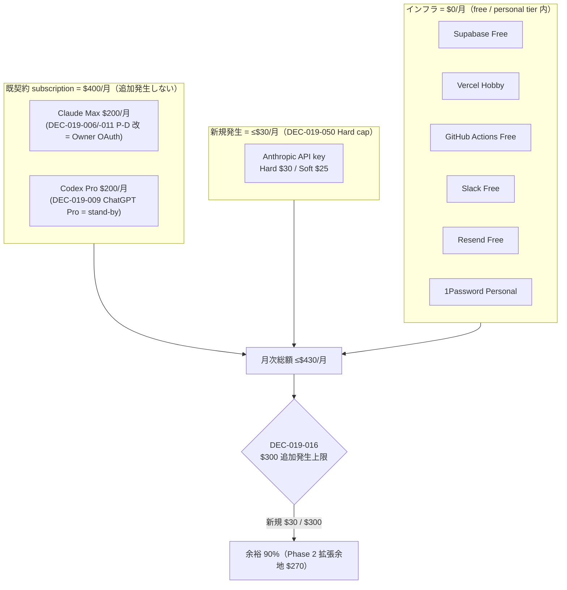
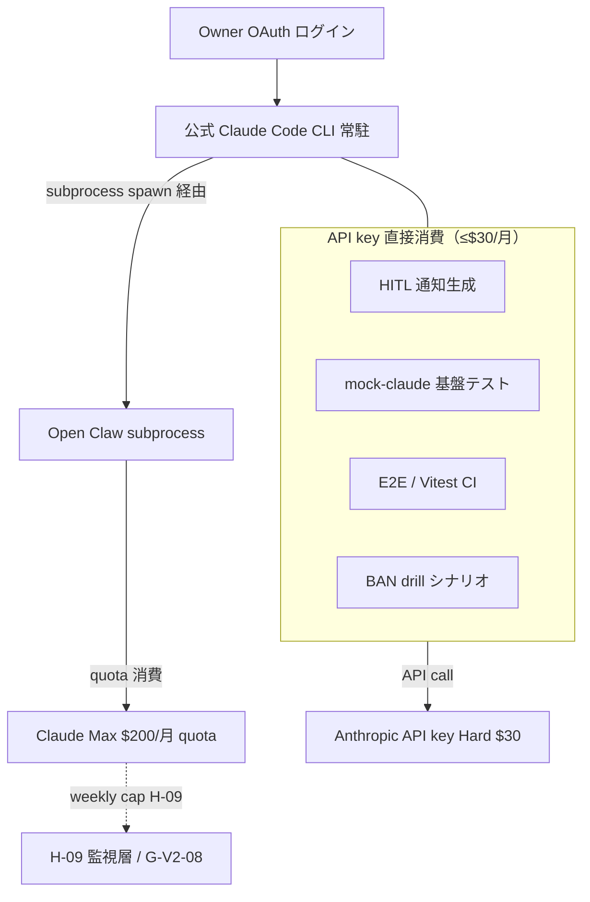

最終更新: 2026-05-03 / 起案: PM 部門 / 採択予定: 5/8 議決-20

# PRJ-019 月次予算 v2 — Anthropic API spend cap $30/月反映版（DEC-019-050 正式起票）

- 案件: PRJ-019「Clawbridge」 — Open Claw を自律オーナーとする AI 組織ハーネス基盤
- 担当: PM 部門
- 版: **v2.0**（v1 = `pm-cost-and-controls-plan-v4-1.md` §6 / `pm-v4-master-plan.md` §4 を上書き）
- 起案根拠: **DEC-019-050**（Anthropic API key 月次 spend cap = $30/月、Owner 直接決裁 2026-05-03）
- 採択予定: 2026-05-08 W0-Week1 検収会議 議決-20（**新規追加議決**）
- 関連決裁: DEC-019-007 / -009 / -012 / -016 / -050（§7 整合表参照）
- 上位置換対象: PM v4.1 §6 月次コスト試算、PM v4 §4 月次予算配分（§4 区分構造はそのまま、各値を v2 に置換）

---

## §1 v1 → v2 主要変更点

### §1.1 200 字以内サマリ

**Anthropic API key 月次 spend cap を $300 想定 → $30 で確定（97% 下方修正）**。Console 設定値: Hard $30 / Soft $25 メール通知 / 2026-06-01 リセット。基本運用は **subscription plan 主軸**（Claude Max $200 + Codex Pro $200 = $400/月既契約、追加発生なし）に切替。API key は HITL 通知 / mock-claude / E2E test / drill 集中期の補助用途に限定。月次総コスト = subscription $400（既契約）+ API ≤$30（新規）+ インフラ $0 = **$430/月**。DEC-019-016「$300 = 追加発生上限」に対し新規 $30 = 余裕 90%。

### §1.2 v1 → v2 主要差分マトリクス

| 項目 | v1（PM v4.1 §6 中央値） | **v2** | 差分 | 根拠 |
|---|---|---|---|---|
| **Anthropic API spend cap** | $50/月（Hard、DEC-019-012） | **$30/月（Hard）** | -$20（-40%） | DEC-019-050 |
| **API soft 通知** | 未設定 | **$25 メール通知** | +新設 | DEC-019-050 Console 設定 |
| **OpenAI API spend cap** | $20/月（Hard、DEC-019-012） | **$20/月（Hard、維持）** | 0 | Codex 既契約のため API 直接消費なし |
| **subscription 既契約** | 言及なし | **$400/月（Claude Max $200 + Codex Pro $200）「追加発生しない」性格を明示** | 構造再定義 | DEC-019-009 / -050 |
| **基本運用主軸** | API + subscription 並列 | **subscription plan 主軸**（API 補助用途に限定） | 主軸転換 | DEC-019-050 |
| **月次新規発生額（中央値）** | $57（PM v4 §4） | **≤$30** | -$27 | DEC-019-050 |
| **月次新規発生額（上限）** | $163（PM v4 §4） | **≤$30**（Hard cap） | -$133 | DEC-019-050 cap 強制 |
| **月次総コスト（既契約 + 新規）** | $400 + $57 中央値 = $457 | **$400 + ≤$30 = ≤$430** | -$27 | 既契約は不変 |
| **DEC-019-016 ($300 追加発生上限) 余裕率** | 81%（v1 中央値）/ 54%（v1 上限） | **90%**（$30 / $300） | +9 ポイント以上 | 大幅余裕 |
| **R-019-04 cost overrun スコア** | 12（黄、確率 3 × 影響 4） | **6（緑、確率 2 × 影響 3）** | -6 | §9 詳細 |
| **5/8 検収議決数** | 議決-7〜19（13 件） | **議決-7〜20（14 件、+議決-20 = DEC-019-050 正式追認）** | +1 | §8 詳細 |

### §1.3 「subscription plan 主軸」方針の意味

- **Claude Max $200/月**（既契約）→ Owner OAuth 経由で公式 Claude Code CLI を常駐稼働、subprocess spawn の主流路（DEC-019-006 P-D 改 / DEC-019-011 オプション A）。
- **Codex Pro $200/月**（既契約、DEC-019-009）→ Codex CLI を P-D 改 = Owner OAuth で同居、Anthropic 巻き添え BAN 時の fallback として stand-by。
- **API key（≤$30/月）** = HITL 通知メッセージ生成 / mock-claude 基盤テスト / drill 集中期 / E2E test / Vitest CI 等の補助用途専用。subprocess spawn は API key を直接消費しない（subscription quota 経由）。

---

## §2 月次総コスト構造再定義

### §2.1 v2 月次総コスト 4 区分

| 区分 | v2 月次額 | 性格 | 備考 |
|---|---|---|---|
| **(A) 既契約 subscription** | **$400/月** | **追加発生しない（固定費、既契約）** | Claude Max $200（DEC-019-006/-011）+ Codex Pro $200（DEC-019-009） |
| **(B) 新規発生 API** | **≤$30/月**（Anthropic Hard cap） | 補助用途、Hard cap で物理強制停止 | DEC-019-050、Console 設定済 |
| **(C) インフラ** | **$0/月** | 全 free / personal tier 内 | Supabase Free / Vercel Hobby / GitHub Actions Free / Slack Free / Resend Free / 1Password Personal |
| **(D) Buffer** | $0/月（明示計上なし） | (B) 内 $2 でカバー | §3 配分参照 |
| **総額** | **≤$430/月** | (A) $400 固定 + (B) ≤$30 変動 | 単月最大値 |

### §2.2 DEC-019-016「$300 = 追加発生上限」との整合

| 項目 | 値 | 算出 |
|---|---|---|
| DEC-019-016 ハードキャップ（追加発生上限） | $300/月 | DEC-019-009 / -016 確定値 |
| **v2 新規発生額（API のみ、Hard cap）** | **$30/月** | DEC-019-050 |
| 充当率 | **10%** | $30 / $300 = 10% |
| **余裕率（追加発生分）** | **90%** | ($300 - $30) / $300 = 90% |
| Phase 2 拡張余地 | $270/月 | $300 - $30 = $270、別途 DEC で増額判断時に活用 |

→ **DEC-019-016「$300 が追加発生上限」のまま、v2 では $30 で運用 → 余裕 90% を確保しつつ、subscription $400 主軸で Phase 1 を実行可能**。

### §2.3 月次総コスト構造図



---

## §3 $30 API budget 用途別配分案

### §3.1 配分案（5 用途 + Buffer = $30/月）

| # | 用途 | 月次配分 | 算出根拠 | 集中期 |
|---|---|---|---|---|
| **(1)** | **HITL 通知メッセージ生成** | **$10/月** | 11 Gate × 約 50 件/月 × 短文（Slack DM / Email リマインド本文）= 550 calls × $0.018 ≈ $10 | Phase 1 全期間 |
| **(2)** | **BAN drill #1/#3 シナリオ実行** | **$10/月** | drill 期に集中、シナリオ駆動の API call（5/29 BAN drill #3 期間集中で約 200 calls × $0.05） | 5/22-24 / 5/29 集中 |
| **(3)** | **mock-claude 基盤テスト** | **$5/月** | mock 検証 + プロンプト整合性確認（CI 実行 100 calls × $0.05） | 全期間（CI 連動） |
| **(4)** | **E2E test / Vitest CI** | **$3/月** | nightly E2E + main branch CI（GitHub Actions free 内、API call のみ計上） | 全期間（CI 連動） |
| **(5)** | **Buffer** | **$2/月** | spike 吸収 / 想定外 call | 必要時 |
| **計** | - | **$30/月** | Hard cap 100% 充当（保守的配分） | - |

### §3.2 用途別 burn rate 想定（日次）

| 用途 | 日次中央値 | 日次上限 | 80% warn 閾値（$24） | 95% stop 閾値（$28.5） |
|---|---|---|---|---|
| (1) HITL 通知 | $0.33/日 | $1.00/日 | 全用途合算で判定 | 全用途合算で判定 |
| (2) BAN drill | $0.00/日（非drill期）/ $5.00/日（drill期 5/29） | $7.00/日（drill 集中） | 同上 | 同上 |
| (3) mock-claude | $0.17/日 | $0.50/日 | 同上 | 同上 |
| (4) E2E / CI | $0.10/日 | $0.30/日 | 同上 | 同上 |
| (5) Buffer | $0.07/日 | $0.50/日 | 同上 | 同上 |
| **合算（中央値）** | **$0.67/日** | - | - | - |
| **合算（drill 集中日）** | - | **$8.50/日**（5/29） | $24（30 日累積） | $28.5（30 日累積） |

---

## §4 spike scenario 分析（5 件）

### §4.1 spike scenario 一覧

| # | scenario | 発生確率 | 想定 spend impact | 対策 | 監視点 |
|---|---|---|---|---|---|
| **S-1** | **BAN drill #3 期間集中で $30 突破リスク** | **M**（drill 期に集中発生） | drill 1 回で $5-10 消費、複数回シナリオで $20+ も可能 | (a) 5/22-24 集中監視（cron 1h 間隔）/ (b) drill 前に残量 $20 以上確保 / (c) drill 後 24h 以内に再評価 | daily spend 推移、drill 後の累積 |
| **S-2** | **HITL Gate 大量起票時の API 消費（11 Gate 同時 burst）** | **L-M** | 1 burst で 200 calls × $0.05 = $10 消費 | (a) caching 必須（Anthropic prompt caching、claude-api skill 参照）/ (b) HITL 通知テンプレ固定化で prompt 共通化 / (c) burst 検知で warning | 1h あたり API call 数、cache hit rate |
| **S-3** | **Phase 1 W4 ナレッジ抽出 batch（KE-02）の $30 内可否** | **M** | 抽出件数 ≥5 件 × embeddings + 中文生成 = $5-10 想定 | (a) batch を週末 deferred 実行で平準化 / (b) embeddings は OpenAI 側に逃がす（OpenAI Hard $20 維持） / (c) 抽出件数上限を 10 件/月で先制 | 抽出 1 件あたりコスト、累積件数 |
| **S-4** | **bug による無限 loop（API 暴走）** | **L** | 1h で $30 全消費する worst case | (a) cost-meter で 80%（$24）= channel #prj019-monitor 通知 / (b) 95%（$28.5）= auto-stop（subprocess kill switch、P-UI-04 連動）/ (c) Hard cap で物理停止 | 1h delta、cost-meter alert |
| **S-5** | **6/1 リセット日跨ぎリスク**（5/30 残額不足で drill #3 中断） | **L-M** | drill #3 を 5/29 実施、5/30 でも未完なら 6/1 リセットまで pause | (a) drill #3 を **5/24 までに完了**させ余裕作る / (b) 5/29 実施は予備日扱い / (c) 6/1 リセット直後の cron 通知で月次レポート自動生成 | 5/29-31 の残額、リセット日挙動 |

### §4.2 spike 検出 → 対応フロー

```mermaid
flowchart LR
  Monitor[cost-meter cron 15min] --> Check{累積 spend 判定}
  Check -->|< $24 (80%)| Normal[通常運用]
  Check -->|≥ $24 (80%)| Warn[#prj019-monitor 警告]
  Check -->|≥ $28.5 (95%)| Stop[auto-stop: subprocess kill]
  Check -->|≥ $30 (Hard)| HardStop[Anthropic Console 物理停止]
  Warn --> SpikeDetect{1日前比 200% 超過?}
  SpikeDetect -->|Yes anomaly| Anomaly[anomaly alert + Owner DM]
  SpikeDetect -->|No| ContinueWarn[警告継続]
  Stop --> Subscription[subscription plan only 移行]
  HardStop --> Subscription
  Subscription --> Report[Phase 1 状況再評価 + 6/1 reset 待機]
```

---

## §5 部署別 API budget alloc

### §5.1 Phase 1 全期間（5/26-6/20、4 週間 + Pre-Phase 1 週間 = 30 日）

| 部署 | 月次配分 | 主用途 | 中央値 burn rate |
|---|---|---|---|
| **Dev** | **$15/月**（50%） | HITL 実装 / mock-claude / E2E / drill 実装 | $0.50/日 |
| **Research** | **$3/月**（10%） | 競合調査 API / ナレッジ参照テスト | $0.10/日 |
| **PM** | **$2/月**（7%） | trigger 判定 / WBS 整合チェック | $0.07/日 |
| **Marketing** | **$2/月**（7%） | LP コピー A/B 生成（提案棄却時の改稿候補） | $0.07/日 |
| **Review** | **$3/月**（10%） | drill シナリオ / pentest / PII redaction 検証 | $0.10/日 |
| **Buffer** | **$5/月**（16%） | 横断 spike 吸収 | $0.17/日 |
| **計** | **$30/月** | - | $0.67/日（drill 期除く） |

### §5.2 部署別 burn rate alert 閾値

| 部署 | 月次配分 | 80% 警告 | 100% 停止 |
|---|---|---|---|
| Dev | $15 | $12 | $15（部署 cap） |
| Research | $3 | $2.4 | $3 |
| PM | $2 | $1.6 | $2 |
| Marketing | $2 | $1.6 | $2 |
| Review | $3 | $2.4 | $3 |

部署 cap 到達時は #prj019-monitor 通知 + Buffer から 1 回限り融通可能（PM 部門承認）。

---

## §6 subscription plan 主軸運用の意味

### §6.1 P-D 改（Owner OAuth）と subscription quota の関係



### §6.2 subscription quota と API key の使い分け

| 用途 | 経路 | 消費先 |
|---|---|---|
| Open Claw subprocess spawn（提案生成 / 実装 ループ本体） | 公式 Claude Code CLI 経由 | **Claude Max quota**（API key 不消費） |
| HITL 通知メッセージ生成 | hitl-gate.ts → Anthropic SDK | **API key**（≤$30 内） |
| monitor アラート文生成 | monitor.ts → Anthropic SDK | **API key**（≤$30 内） |
| mock-claude 基盤テスト | Vitest → mock または実 API | **API key**（≤$30 内、test mode） |
| E2E test（Playwright） | nightly CI → Anthropic SDK | **API key**（≤$30 内） |
| BAN drill シナリオ実行 | drill runner → Anthropic SDK（攻撃シナリオ模擬） | **API key**（≤$30 内、drill 集中期） |
| ナレッジ抽出 embeddings | extractor → OpenAI API（DEC-019-009 ChatGPT Pro 補完） | **OpenAI Hard $20 内**（Anthropic API 不消費） |

### §6.3 「subscription = 追加発生しない」性格の明示

- Claude Max $200 / Codex Pro $200 は **既契約**であり、Phase 1 / 2 期間中の新規追加発生はゼロ。
- subscription quota が weekly cap（H-09 監視層、DEC-019-014/-015）に到達した場合は、API key への自動 fallback **は行わない**（DEC-019-050 主軸方針により禁止）。代わりに **HITL Gate で pause → Owner 判断**で次週まで待機 or 別途 DEC で増額判断。
- → **API spend cap $30/月は「subscription quota が想定どおり機能した場合の補助予算」**として位置付ける。

---

## §7 関連決裁 影響整理（DEC-019-007 / 009 / 012 / 016 / 050）

### §7.1 整合表

| DEC | 内容 | v1 状態 | **v2 状態** | 整合判定 |
|---|---|---|---|---|
| **DEC-019-007** | Phase 1 強い条件付き Go、月次 cap $300（追加発生上限） | $300 全体上限として参照 | **$300 上限のうち $30 = 10% 充当**、既契約 $400 は別計上 | ✅ 整合（追加発生上限の解釈は維持） |
| **DEC-019-009** | Codex Pro $200/月、月次予算 $300 を「追加発生分の上限」として再定義 | 同左 | **「追加発生 = API ≤$30」が明確化、subscription $400 は固定費**として独立計上 | ✅ 整合（v2 で構造明示） |
| **DEC-019-012** | Anthropic Hard $50 / OpenAI Hard $20 | Anthropic Hard $50 | **Anthropic Hard $30 に下方修正**（DEC-019-050 で上書き）、OpenAI Hard $20 維持 | ✅ DEC-019-050 で上書き整合 |
| **DEC-019-016** | $300 = 追加発生上限、Vercel 上方修正含む | 中央値 $57 / 上限 $163 | **新規発生 $30、余裕 90%**（$300 - $30 = $270）、Phase 2 拡張余地大 | ✅ 整合（cap 強化方向） |
| **DEC-019-050**（本決裁） | Anthropic Hard $30 / Soft $25 / 6/1 リセット、subscription 主軸 | （v1 では未反映） | **本書 v2 で全面反映**、5/8 議決-20 で正式追認 | ✅ 本決裁を v2 に統合 |

### §7.2 v2 で表記修正が必要な箇所（5/8 議決後）

- PM v4 §4.1 4 区分配分 → 「(1) API $40 中央値 / $90 上限」を **「(1) API ≤$30 Hard cap、subscription $400 別計上」**に修正
- PM v4 §4.3 4 層コストキャップ → month $300 は維持、新たに **「Anthropic API: $30/月（DEC-019-050）」を session/project/day/month と並列の独立 cap として追記**
- PM v4.1 §6.4 同上
- decisions.md v11 → DEC-019-050 を正式採択ステータスに更新

---

## §8 5/8 検収会議 議題追加: 議決-20

### §8.1 議決-20 仕様

| 項目 | 内容 |
|---|---|
| **議決番号** | **議決-20**（PM v4 §10.1 議決-7〜19 の 13 件に **+1 = 計 14 件**） |
| **題目** | **DEC-019-050 正式追認** + v2 月次予算採択 + DEC-019-007/-012/-016 の v2 表記修正承認 |
| **提示形式** | Yes / No 一括 |
| **想定議論時間** | **5 min** |
| **提案 PM 想定** | **採択推奨**（cap 強化は Conditional Go 3 条件達成に有利、§9 R-019-04 改善も裏付け） |
| **5/8 検収会議内位置** | 議題 §3（Owner-in-the-loop Phase 1 Go/NoGo）末尾に追加 |

### §8.2 議決-20 含む 5/8 検収議決順（更新版）

| 順 | 議決 | 内容 | 想定 min |
|---|---|---|---|
| 1-12 | 議決-7〜18 | PM v4.1 採択 / 着手日 / 完了日 / Marketing 日 / HITL-9 SLA / HITL-10 SLA / 承認率 DoD / Pre-Phase / TR-4 / Slack 通知 / 過剰権限閾値 / ナレッジ件数 | 43 min（PM v4.1 §10.1 既存合計） |
| 13 | 議決-19 | （別途追加）BAN drill #3 計画承認 | 5 min |
| **14** | **議決-20 ★新** | **DEC-019-050 正式追認 + v2 予算採択 + 関連 DEC 表記修正** | **5 min** |
| **計** | **14 件** | - | **53 min** |

→ 5/8 検収会議の議題消化想定時間を約 53 min（議決-20 含む）として PM 部門が議事進行調整。

---

## §9 リスク（R-019-19 候補）: API $30 突破時の Phase 1 中断シナリオ + fallback

### §9.1 R-019-19 新規起票

| 項目 | 内容 |
|---|---|
| **ID** | **R-019-19**（既存 R-019-13〜18 に続く新規） |
| **内容** | **Anthropic API $30 Hard cap 突破時の Phase 1 中断リスク**（drill 集中期 / bug loop / spike 全部該当） |
| **格付** | **黄**（cap 物理停止により被害は限定的、ただし Phase 1 進行影響あり） |
| **確率** | **L-M**（5 spike scenario のうち drill 集中期 + bug loop の 2 ケースで現実的） |
| **影響** | API 直接消費機能（HITL 通知 / monitor / mock / E2E / drill）が 6/1 リセットまで停止、Phase 1 のテスト精度低下 |
| **緩和策** | (a) cost-meter 80%/95% 二段警告、(b) **subscription only fallback 移行手順**を事前文書化、(c) drill #3 を 5/24 までに完了させ 5/29 を予備日化、(d) prompt caching 必須、(e) Buffer $5 を Dev 部署に集中配分しない |

### §9.2 R-019-04 cost overrun スコア再計算（v1 → v2）

| 項目 | v1 | **v2** | 差分 | 根拠 |
|---|---|---|---|---|
| **確率** | **3**（高） | **2**（中低） | -1 | $300 cap → $30 Hard cap で物理強制、突破確率激減 |
| **影響** | **4**（高） | **3**（中） | -1 | 突破時も subscription $400 主軸は維持、Phase 1 全停止には至らない |
| **スコア** | **12（黄）** | **6（緑）** | **-6** | **黄 → 緑 改善** |

### §9.3 fallback: subscription only 移行手順

API $30 突破 → 自動 stop が発火した場合の Phase 1 継続手順（事前文書化済とする）:

1. **stop 通知受領**（cost-meter 95% auto-stop）→ Owner Slack DM
2. **API 直接消費機能の代替**:
   - HITL 通知 → 短文テンプレを事前生成済の static text に切替（残月分稼働可能）
   - monitor アラート → log のみ（リッチテキスト生成は停止）
   - mock-claude → Vitest mock のみで継続（実 API 呼出は 6/1 リセット待ち）
   - E2E / Vitest CI → mock 経路に切替（CI green 維持可能）
   - BAN drill → 6/1 以降に再計画
3. **subscription quota は通常稼働**（subprocess spawn は影響なし）
4. **6/1 リセット後**に API 直接消費機能を順次再開、drill 計画を再策定
5. **Phase 2 増額判断**: 別途 DEC で $30 → $50 / $100 等へ拡張可否を Owner 決裁

---

## §10 結論

- **月次総コスト = $430/月**（既契約 subscription $400 + 新規発生 API ≤$30 + インフラ $0）
- **DEC-019-016 ($300 追加発生上限) に対し新規 $30 = 余裕 90%**、Phase 2 拡張余地 $270
- **subscription plan 主軸運用**（公式 Claude Code CLI = Owner OAuth = quota 消費、API key は補助用途 ≤$30）
- **R-019-04 cost overrun スコア 12（黄）→ 6（緑）に改善**、cap 強化は Conditional Go 3 条件達成に有利
- **5/8 検収会議で議決-20 として正式追認**（DEC-019-007 / -012 / -016 の v2 表記修正併せて承認）
- **R-019-19 新規起票**（API $30 突破時の Phase 1 中断シナリオ + subscription only fallback）

---

**v2 確定**: 2026-05-03 PM 起案 / **採択予定**: 2026-05-08 W0-Week1 検収会議 議決-20 / **次回更新**: 5/8 議決結果反映 + 6/1 リセット日初動結果反映 + Phase 2 増額判断（別途 DEC）
