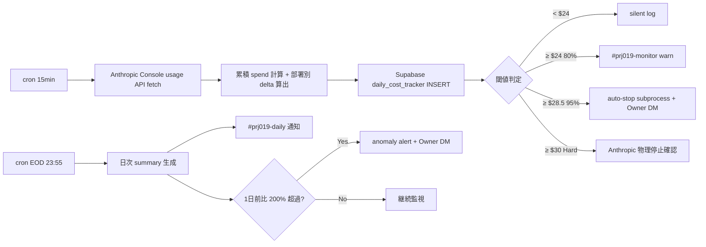
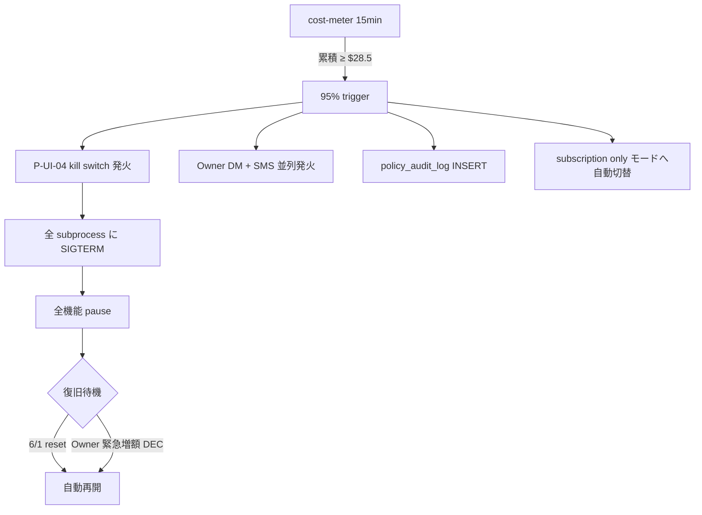
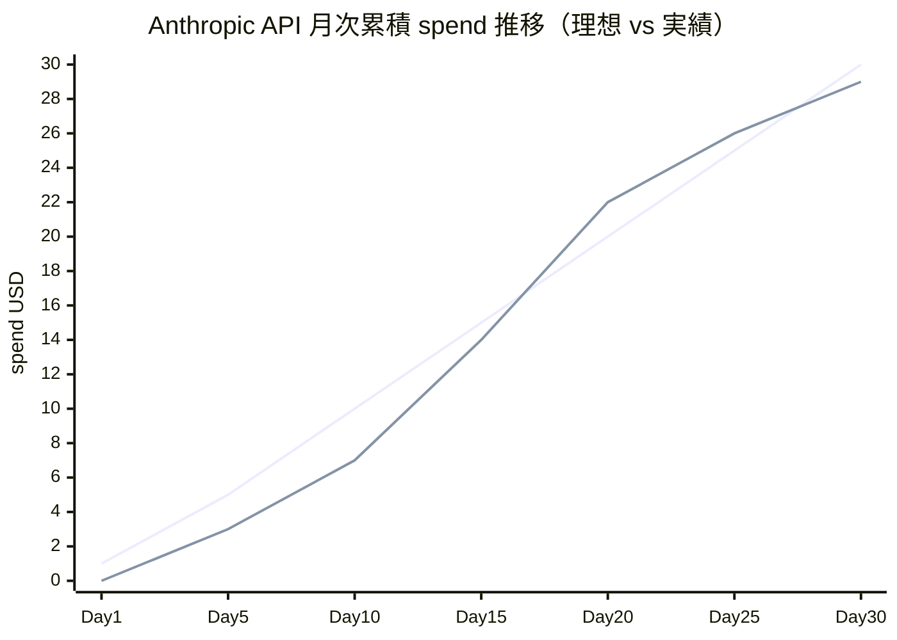
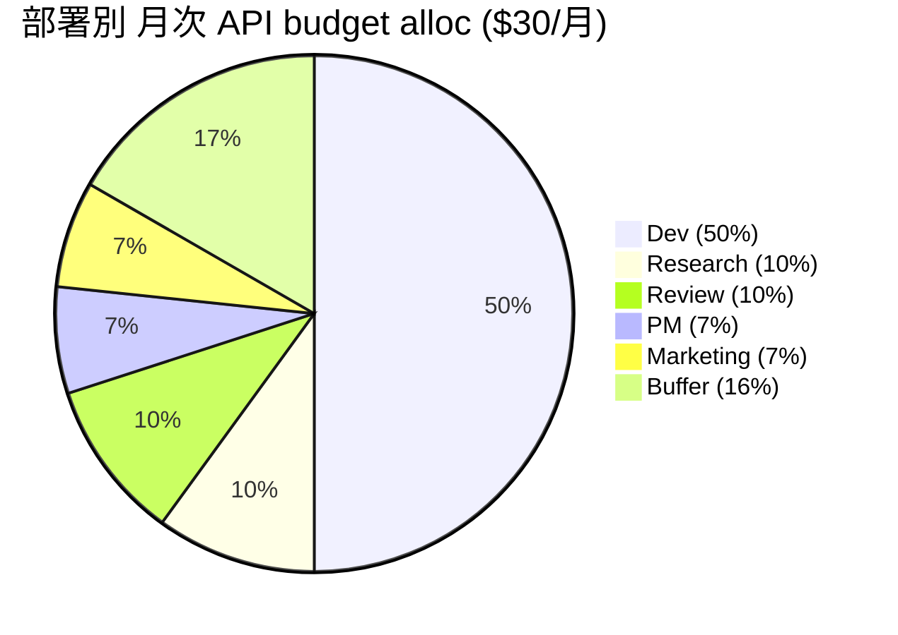
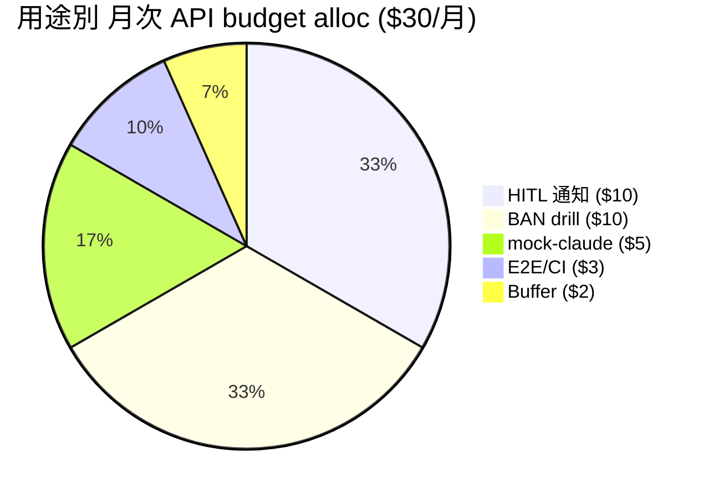
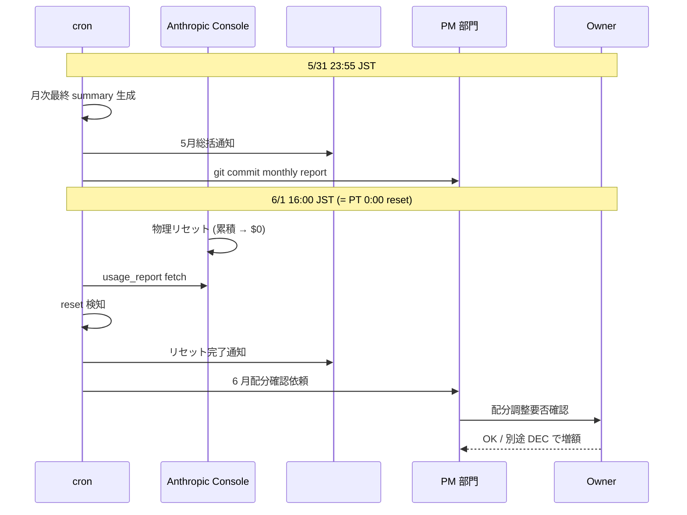
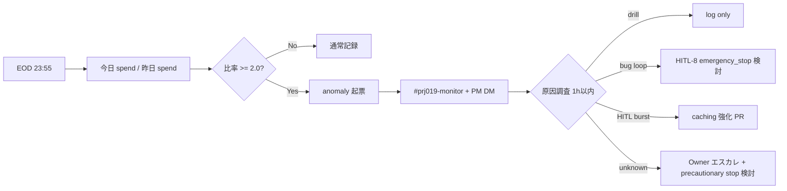

最終更新: 2026-05-03 / 起案: PM 部門 / 採択予定: 5/8 議決-20

# PRJ-019 月次トラッキングテンプレ — Anthropic API $30 cap 専用（v2）

- 案件: PRJ-019「Clawbridge」
- 担当: PM 部門
- 版: **v2.0**（DEC-019-050 反映、$30 Hard cap 専用設計）
- 採択予定: 2026-05-08 W0-Week1 検収会議 議決-20
- 関連: `pm-budget-v2-30usd-api-cap.md` §3 配分 / §4 spike 分析 / §5 部署 alloc を本テンプレで運用化
- データソース: Anthropic Console usage API + monitor cron 連動 + Supabase `cost_metrics` table

---

## §1 daily API spend tracking（cron 連動）

### §1.1 daily tracker テーブル（雛形）

| 日付 | 累積 spend | 日次 delta | 残額 | cap 充当率 | 部署内訳（Dev/Res/PM/Mkt/Rev/Buf） | spike flag | 80% warn | 95% stop | 備考 |
|---|---|---|---|---|---|---|---|---|---|
| YYYY-MM-DD | $X.XX | $X.XX | $XX.XX | XX% | $A/$B/$C/$D/$E/$F | Y/N | Y/N | Y/N | （drill / bug / 通常） |

### §1.2 cron 仕様

| 項目 | 設定値 |
|---|---|
| **実行頻度** | **15 分間隔**（fast monitoring）+ **EOD 23:55 JST**（daily summary 確定） |
| **データソース** | Anthropic Console usage API（`/v1/organizations/usage_report`）+ Supabase `cost_metrics` 集計 |
| **格納先** | Supabase `daily_cost_tracker` table（append-only、retention 1 年） |
| **通知 channel** | `#prj019-monitor`（warn/stop）+ `#prj019-daily`（EOD summary） |
| **責任者** | Dev（cron 実装）+ PM（閾値設定）+ Owner（通知受領） |

### §1.3 cron 動作フロー



---

## §2 weekly summary（毎週金 EOD、PM 自動集計）

### §2.1 weekly summary 雛形

```
PRJ-019 週次 spend サマリ - Week N (YYYY-MM-DD ~ YYYY-MM-DD)

【総額】
- 週次 spend: $X.XX / 月次 cap $30
- 月次累積: $X.XX (XX% 充当)
- 残額: $XX.XX / 残日数 XX 日 → 日次平均必要 burn: $X.XX

【部署別週次】
- Dev:       $X.XX / $15 月次 cap (XX%)
- Research:  $X.XX / $3  月次 cap (XX%)
- PM:        $X.XX / $2  月次 cap (XX%)
- Marketing: $X.XX / $2  月次 cap (XX%)
- Review:    $X.XX / $3  月次 cap (XX%)
- Buffer:    $X.XX / $5  月次 cap (XX%)

【主要イベント】
- HITL 通知発火数: XX 件
- BAN drill 実施: あり/なし (drill 名)
- spike 検知: XX 回
- auto-stop 発火: XX 回

【予測】
- 月末予測 spend: $XX.XX
- 月末予測残額: $XX.XX
- 突破リスク: 緑/黄/赤

【アクション】
- [ ] 部署 cap 80% 到達時の融通要否
- [ ] 翌週 drill 計画への影響
- [ ] PM 部門エスカレ要否
```

### §2.2 weekly summary 配信仕様

| 項目 | 設定 |
|---|---|
| **配信日時** | 毎週金曜 18:00 JST |
| **配信先** | `#prj019-monitor` channel + PM Slack DM + Owner Slack DM |
| **生成手段** | cron + Supabase 集計 query + テンプレ filling（Anthropic API call は 1 回のみ、$0.05 程度） |
| **保管先** | `projects/PRJ-019/reports/weekly-cost-tracker/YYYY-WW.md` に append（git commit） |

---

## §3 80% warning ($24) / 95% auto-stop ($28.5) 仕様

### §3.1 二段警告の閾値設計

| 閾値 | 額 | 通知 | 動作 | 復旧条件 |
|---|---|---|---|---|
| **info** | $0 〜 $20 | silent log | 通常運用 | - |
| **soft warn** | $20 (67%) | `#prj019-daily` 通知（EOD のみ） | 通常運用継続 | - |
| **80% warn** | **$24 (80%)** | **`#prj019-monitor` 即時通知 + PM DM** | 通常運用継続、PM 部門が daily 監視に切替 | $20 まで戻れば warn 解除 |
| **95% stop** | **$28.5 (95%)** | **`#prj019-monitor` 緊急 + Owner DM + SMS** | **subprocess kill switch 発火（P-UI-04 連動）+ HITL 通知 / mock / drill 等の API 直接消費停止** | 6/1 リセット or Owner 緊急増額判断（別途 DEC） |
| **Hard cap** | **$30 (100%)** | Anthropic Console 自動メール | **Anthropic API 物理停止**（API 側で全 call 拒否） | 6/1 リセット |

### §3.2 95% auto-stop の subprocess kill 連動



### §3.3 通知メッセージテンプレ

**80% warn (`#prj019-monitor`)**:

```
[PRJ-019] API spend 80% warn
累積: $24.XX / $30 Hard cap (XX%)
日次 burn: $X.XX (前日比 +XX%)
残日数: XX 日 / 残額 $X.XX → 日次必要 burn $X.XX
推奨アクション:
- [ ] PM daily 監視切替
- [ ] 翌 drill 計画見直し
- [ ] Buffer 部署融通検討
```

**95% stop (`#prj019-monitor` + Owner DM + SMS)**:

```
[PRJ-019] CRITICAL: API spend 95% auto-stop
累積: $28.50+ / $30 Hard cap
動作: subprocess kill switch 発火、subscription only モード切替
影響:
- HITL 通知: 短文テンプレ static fallback
- monitor: log only
- mock-claude / E2E: mock 経路のみ
- BAN drill: 6/1 以降に再計画
復旧: 6/1 リセット or 緊急増額 DEC（Owner 判断）
詳細: pm-budget-v2-30usd-api-cap.md §9.3 fallback 手順
```

---

## §4 残量 visualization

### §4.1 月次残量推移（line chart）



理想線 = $1/日 × 30 日 = $30 / 月（線形 burn）
実績線 = drill 集中期（5/24-29）でやや上振れ、6/1 直前で残量 $1 程度を残す想定

### §4.2 部署別配分（pie chart）



### §4.3 用途別配分（pie chart）



### §4.4 累積 vs 残額 dashboard 表示要件

透明性 Dashboard `/dashboard/costs` に以下を 6 指標の 1 つとして恒常表示:
- **累積 spend**（プログレスバー、$24 で黄色、$28.5 で赤）
- **残額**（$30 - 累積）
- **残日数**
- **日次必要 burn**（残額 / 残日数）
- **直近 7 日 line chart**
- **次回リセット日**（6/1）までの残時間

---

## §5 6/1 リセット day の挙動

### §5.1 リセット日 cron 仕様

| 時刻 (JST) | 動作 |
|---|---|
| **5/31 23:55** | 月次最終 daily summary 生成、`projects/PRJ-019/reports/monthly-cost-tracker/2026-05.md` を確定し git commit |
| **6/1 00:00** | Anthropic Console 側で物理リセット（PT 基準なので注意、実 reset 時刻は約 **6/1 16:00 JST** 想定 = PT 0:00） |
| **6/1 16:00** | cron がリセット検知（`usage_report` の累積 reset 確認）→ 月次レポート自動生成 |
| **6/1 16:30** | `#prj019-monitor` に「リセット完了 + 5月総括 + 6月配分再確認」通知 |
| **6/1 17:00** | PM 部門が 6 月配分の調整要否確認（必要なら別途 DEC で増額判断） |

### §5.2 月次レポート雛形（`monthly-cost-tracker/2026-05.md`）

```
# PRJ-019 月次 API spend レポート - 2026-05

## 総額
- 月次総 spend: $XX.XX / $30 Hard cap (XX%)
- Hard cap 突破: あり/なし
- 95% auto-stop 発火: XX 回
- 80% warn 発火: XX 回

## 部署別実績
[テーブル]

## 用途別実績
[テーブル]

## 主要イベント timeline
- 5/22-24: drill #1 期間（spend $X.XX）
- 5/29:    BAN drill #3（spend $X.XX）
- ...

## spike 分析
- 検知数: XX 回
- 原因別: drill XX / bug X / 通常 spike X

## 6 月への教訓
- [ ] 配分見直し要否
- [ ] cap 増額検討要否
- [ ] caching 強化対象
```

### §5.3 6/1 リセット day 挙動図



---

## §6 部署別 burn rate alert

### §6.1 部署 cap 80% / 100% 発火仕様

| 部署 | 月次 cap | 80% 警告 | 100% 停止 | 100% 後の動作 |
|---|---|---|---|---|
| Dev | $15 | $12 | $15 | Buffer から融通可能（PM 承認）/ なければ HITL 通知の static fallback |
| Research | $3 | $2.4 | $3 | Buffer 融通 / なければ調査 API call 停止 |
| PM | $2 | $1.6 | $2 | Buffer 融通 / なければ trigger 判定の API call 停止 |
| Marketing | $2 | $1.6 | $2 | Buffer 融通 / なければ LP A/B 生成停止 |
| Review | $3 | $2.4 | $3 | Buffer 融通 / なければ pentest API call 停止 |
| Buffer | $5 | - | $5 | 100% 到達 = 全部署 cap 到達と同時 = 全 API 直接消費停止 |

### §6.2 burn rate alert ロジック

```python
# pseudocode
for dept in departments:
    cap = DEPT_CAPS[dept]
    spent = get_dept_spend(dept, current_month)
    if spent >= cap:
        notify(channel='#prj019-monitor', level='critical',
               msg=f'{dept} 部署 cap 100% 到達、Buffer 融通要請')
        request_buffer_transfer(dept, amount=cap*0.2, approver='PM')
    elif spent >= cap * 0.8:
        notify(channel='#prj019-monitor', level='warn',
               msg=f'{dept} 部署 cap 80% 警告、daily 監視切替')
```

### §6.3 Buffer 融通ルール

| 項目 | 仕様 |
|---|---|
| **発動条件** | 部署 cap 100% 到達 + 翌週も継続稼働必要 |
| **融通額** | 部署 cap の 20% を上限（例: Dev $15 → +$3 まで） |
| **融通回数** | 月内 1 部署 1 回まで |
| **承認者** | PM 部門（即時承認可、Slack thread で記録） |
| **超過時** | Owner 緊急増額判断（別途 DEC、Phase 1 中は原則回避） |

---

## §7 spike detection（1 日で前日比 200% 超過 = anomaly）

### §7.1 anomaly 検出ロジック

```python
# pseudocode
def detect_spike(today_spend, yesterday_spend):
    if yesterday_spend == 0:
        return today_spend > 5  # 初日 spike: $5 超過で anomaly
    ratio = today_spend / yesterday_spend
    if ratio >= 2.0:  # 前日比 200% 超過
        return True
    return False
```

### §7.2 anomaly 検出時の通知 + 動作

| 段階 | 通知 | 動作 |
|---|---|---|
| **anomaly 検知** | `#prj019-monitor` immediate + PM DM | PM が 1h 以内に原因調査 |
| **原因 = drill** | log のみ | 計画通り、許容 |
| **原因 = bug loop** | Owner DM + SMS | 即時 subprocess kill 検討、HITL-8 emergency_stop 発動可 |
| **原因 = HITL burst** | log + caching 強化 PR | prompt caching が機能していない可能性、Dev 部門に調査依頼 |
| **原因不明** | Owner DM | 1h 以内に原因特定できない場合、precautionary stop 検討 |

### §7.3 anomaly 履歴 retention

- Supabase `anomaly_log` table に 1 年保管
- 月次レポートに anomaly 件数 + 原因別内訳を記録
- Phase 2 着手前に anomaly トレンド分析を PM 部門が実施

### §7.4 spike detection フロー



---

## §8 トラッキング運用責任分担

| 責任 | 部署 | 役割 |
|---|---|---|
| **cron 実装 + Supabase migration** | Dev | `daily_cost_tracker` / `anomaly_log` table + cron job + Slack webhook |
| **閾値設定 + 部署 cap 配分** | PM | $24 / $28.5 / 部署別 cap 確定、本書テンプレで運用化 |
| **monitor 通知文** | Dev + PM | テンプレ §3.3 を Anthropic SDK で生成（API 直接消費 ≤$1/月想定） |
| **anomaly 一次対応** | PM | 1h 以内の原因調査、Slack thread 起票 |
| **緊急時 subprocess kill** | Dev + Owner | P-UI-04 kill switch 連動（DEC-019-033 ⑤ 既存仕様） |
| **月次レポート git commit** | PM | EOD 23:55 cron 自動 + 6/1 16:30 手動最終確認 |
| **増額 DEC 起案** | PM + Owner | 別途 DEC 必要時のみ（Phase 1 中は回避方針） |

---

**v2 確定**: 2026-05-03 PM 起案 / **採択予定**: 2026-05-08 W0-Week1 検収会議 議決-20 / **次回更新**: 5/8 議決後 cron 実装着手（Dev W1-W2 タスクへ統合）+ 6/1 リセット日初動結果反映
