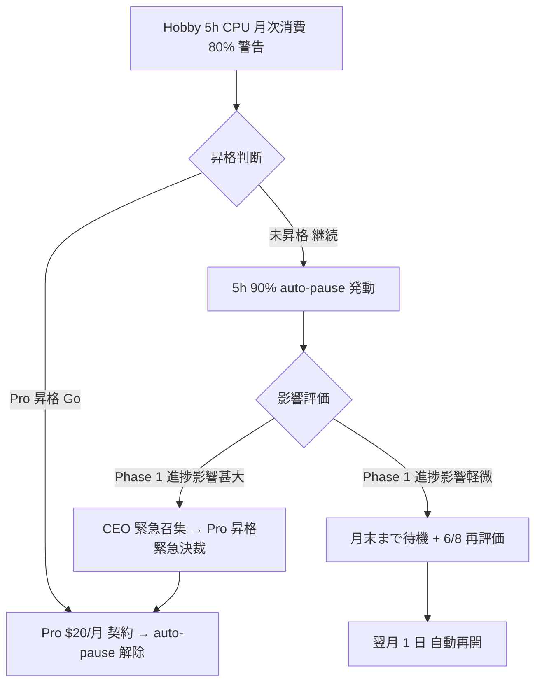

# CB-CEO-W3-01 Vercel Hobby→Pro 昇格判断 (6/3) データ収集 + 判定 worksheet テンプレ

- **文書 ID**: pm-cb-ceo-w3-01-decision-template
- **制定日**: 2026-05-03
- **対象案件**: PRJ-019「Clawbridge」 Phase 1 W3 中盤 (2026-06-03)
- **担当部署**: PM 部門
- **作成者**: PM Agent (claude-code-company)
- **版**: v1.0 (FINAL、5/8 検収会議向け配布版)
- **関連決裁**:
  - DEC-019-007 (Phase 1 強い条件付き Go、5/19〜6/13)
  - DEC-019-012 (月次予算 $300 ハードキャップ)
  - DEC-019-016 (Vercel Sandbox / Hosting Pro 上方修正)
  - DEC-019-017 (Vercel Hobby→Pro 昇格判断 W3 中盤)
  - **DEC-019-024 (CB-CEO-W3-01 = Vercel Hobby→Pro 昇格判断 6/3 公式タスク化)** ← 本書根拠決裁
  - DEC-019-025 (エージェント tool 権限 SOP、本書物理書込根拠)
- **上位レポート**:
  - PM v4 本体: `pm-cost-and-controls-plan-v4.md` §3.4 (Vercel Hobby→Pro 昇格判断)
  - W0-Week2 実行計画: `pm-w0-week2-execution-plan.md`
  - PM v5 起案テンプレ + 5/8 議事 Runbook: `pm-v5-template-and-meeting-runbook.md` (本書と同時納品)
  - Research 補追検証: `research-w0-supplement-op1-op5.md` §4 Vercel Sandbox 公式 pricing 一次裏取り

---

## §0. 200 字 サマリ

CB-CEO-W3-01 = 2026-06-03 (W3 中盤) に CEO が即決する Vercel Hobby→Pro 昇格判断のためのデータ収集テンプレ + 判定 worksheet。判断材料 4 軸 (Sandbox CPU 実消費 / Hobby 5h CPU 月次消費率 70% 閾値 / 同時実行 10 個 / 最大 45 分ランタイム抵触履歴) を W1〜W2 (5/19-5/30) Dev 毎週末集計フォーマット (CSV / Markdown 表) でカバー。6/3 当日 CEO 即決 worksheet (Excel-style 表 + 計算式)、昇格時 ($20/月 Hosting Pro) の月次予算インパクト試算 (DEC-019-012 内)、昇格遅延時 (5h CPU 90% auto-pause) 運用シナリオ、DEC-019-XXX 起票テンプレ 3 案 (昇格 Go / 継続 / Conditional 昇格) を網羅。`[OWNER-DECISION-REQUIRED]` タグ 3 件。

---

## §1. CB-CEO-W3-01 の位置付けと判断根拠

### §1.1 経緯と DEC-019-024 既決事項

DEC-019-024 (本日 5/3 即決済) で「Vercel Hobby→Pro 昇格判断」を **W3 中盤 (2026-06-03) の公式 CEO 決裁タスク = CB-CEO-W3-01** として確定。本書はその当日決裁を支援する **データ収集テンプレ + 判定 worksheet + 起票テンプレ** の統合版。

### §1.2 判断材料 4 軸 (DEC-019-024 既定)

| 軸 | 内容 | 閾値 (PM v4 §3.4) | 判断帰結 |
|---|---|---|---|
| **A** | Sandbox CPU 実消費 (W1〜W2 累計) | 中央値 $20/月、上限 $46/月 | 累計 $32 (= $46 × 70%) 超で昇格濃厚 |
| **B** | Hobby 5h CPU 月次消費率 | 70% 超 | 70% 超で Pro $20/月 昇格 |
| **C** | Sandbox 同時実行 10 個 抵触履歴 | 0 件目標 | 1 件以上で昇格濃厚 |
| **D** | Sandbox 最大 45 分ランタイム 抵触履歴 | 0 件目標 | 1 件以上で昇格濃厚 (45 分超のテスト要件発生) |

### §1.3 判断時期と責任者

- **判断時期**: 2026-06-03 (水) 09:00 JST (CB-CEO-W3-01 タスク予定時刻)
- **判断者**: CEO (即決)
- **集計者**: Dev Lead (W1〜W2 毎週末 = 5/24 / 5/30 / 6/2 朝)
- **PM 提案者**: PM Agent (Dev 集計を本書 §3.5 worksheet に転記、CEO 提案)
- **承認経路**: Dev 集計 → PM 提案 (6/3 朝) → CEO 即決 (6/3 09:00) → 秘書部門 DEC-019-XXX 起票 (6/3 22:00 まで) → Owner 24h 内承認

---

## §2. データ収集テンプレ (W1〜W2 毎週末 Dev 集計フォーマット)

### §2.1 集計タイミング (週次 3 回 + 当日 1 回 = 計 4 回)

| # | 集計日 | 期間 | 集計責任者 | 提出先 |
|---|---|---|---|---|
| 1 | 2026-05-24 (土) 朝 | W1 (5/19〜5/24 = Phase 1 着手から 6 日間) | Dev Lead | PM Agent (本書 §3 反映) |
| 2 | 2026-05-30 (土) 朝 | W2 前半 (5/25〜5/30 = 7 日間) | Dev Lead | PM Agent (本書 §3 反映) |
| 3 | 2026-06-02 (火) 朝 | W2 後半 + W3 直前 (5/31〜6/2 = 3 日間) | Dev Lead | PM Agent (本書 §3 反映) |
| 4 | 2026-06-03 (水) 09:00 当日 | 累計 (5/19〜6/2 = 15 日間) | Dev Lead + PM Agent | CEO (即決判定材料) |

### §2.2 CSV 集計フォーマット (1 行 = 1 ループ実行)

ファイル: `projects/PRJ-019/reports/dev-vercel-sandbox-usage-csv-{YYYY-MM-DD}.csv`

```csv
loop_id,start_at,duration_sec,vcpu_count,cpu_seconds,parallel_count,timeout_45min_hit,sandbox_cost_usd,project_id,notes
0001,2026-05-19T10:00:00+09:00,612,2,1224,1,0,0.034,PRJ-019,W1 day1 first loop
0002,2026-05-19T10:30:00+09:00,580,2,1160,1,0,0.032,PRJ-019,W1 day1
...
```

| カラム | 型 | 単位 | 計算式 / 取得元 |
|---|---|---|---|
| loop_id | string | - | 自動採番 (0001〜) |
| start_at | datetime | ISO 8601 (JST) | Sandbox 起動 timestamp |
| duration_sec | int | seconds | Sandbox 実行終了 - 起動 |
| vcpu_count | int | vCPU | Vercel Sandbox 設定値 (通常 2) |
| cpu_seconds | int | CPU 秒 | duration_sec × vcpu_count |
| parallel_count | int | 同時実行数 | 同時刻に走った Sandbox 数 (max を記録) |
| timeout_45min_hit | int (0/1) | - | 45 分 (2700 秒) 超 = 1、それ以外 = 0 |
| sandbox_cost_usd | float | USD | cpu_seconds × $0.000028/秒 (Vercel Sandbox 公式 pricing 換算) |
| project_id | string | - | PRJ-019 / PRJ-020 / 共有 |
| notes | string | - | 自由記述 |

### §2.3 Markdown 表サマリフォーマット (週次集計表)

ファイル: `projects/PRJ-019/reports/dev-vercel-sandbox-usage-summary-{YYYY-MM-DD}.md`

```markdown
# Vercel Sandbox 使用量 週次サマリ ({YYYY-MM-DD} 集計)

## 集計期間: {YYYY-MM-DD} 〜 {YYYY-MM-DD} ({N} 日間)

| 指標 | 値 | 単位 | 備考 |
|---|---|---|---|
| ループ実行件数 | {N} | 件 | 週内合計 |
| 平均ループ時間 | {N} | 秒 | mean(duration_sec) |
| 中央値ループ時間 | {N} | 秒 | median(duration_sec) |
| 最大ループ時間 | {N} | 秒 | max(duration_sec) |
| 累計 CPU 秒 | {N} | CPU 秒 | sum(cpu_seconds) |
| 累計 CPU 時間 | {N} | CPU 時 | 累計 CPU 秒 / 3600 |
| Hobby 5h 月次に対する消費率 | {N} % | % | 累計 CPU 時 / 5 × 100 |
| 累計 Sandbox コスト | ${N} | USD | sum(sandbox_cost_usd) |
| 同時実行 ピーク | {N} | 件 | max(parallel_count) |
| 45 分超抵触件数 | {N} | 件 | sum(timeout_45min_hit) |

## 累計指標 (Phase 1 着手 5/19 から本日まで)

| 指標 | 値 | 閾値 | 判定 |
|---|---|---|---|
| 累計 CPU 時 | {N} | 5h × 70% = 3.5h | {Y/N} 超過 |
| 累計コスト | ${N} | $46 × 70% = $32 | {Y/N} 超過 |
| 同時実行ピーク (累計) | {N} | 10 件 | {Y/N} 抵触 |
| 45 分超抵触件数 (累計) | {N} | 0 件 | {Y/N} 抵触 |
```

### §2.4 取得手段 (Dev 実装ガイド)

| データソース | 取得手段 | 自動化レベル |
|---|---|---|
| Vercel Sandbox 個別ループログ | Vercel CLI `vercel logs` + 自製 parser | 半自動 (cron 1h) |
| 月次 CPU 時間 / コスト | Vercel Dashboard API (`GET /v9/usage`) | 完全自動 (cron 1h) |
| 同時実行ピーク | Vercel Sandbox metrics エンドポイント | 完全自動 (cron 5min) |
| 45 分超抵触 | Sandbox timeout 設定値 + 終了 timestamp 比較 | 半自動 (Dev 集計時に判定) |

### §2.5 集計データの保管場所

- CSV 原本: `projects/PRJ-019/reports/dev-vercel-sandbox-usage-csv-{YYYY-MM-DD}.csv` (週 1 回新規)
- Markdown 表: `projects/PRJ-019/reports/dev-vercel-sandbox-usage-summary-{YYYY-MM-DD}.md` (週 1 回新規)
- 累計版: `projects/PRJ-019/reports/dev-vercel-sandbox-usage-cumulative.md` (毎週末上書き)

---

## §3. 6/3 当日 CEO 即決 worksheet (Excel-style 表 + 計算式)

### §3.1 worksheet 全体構造

6/3 09:00 CEO の机上に置く A4 1 枚のサマリシート。Dev Lead が 6/3 06:00 までに本書 §2.5 累計データを転記、PM Agent が 6/3 08:00 までに判定計算を埋めて CEO に提出。

### §3.2 Cell A 入力欄 (Dev 集計値、6/3 06:00 までに入力)

| Cell | 項目 | 入力値 | 単位 | 取得元 |
|---|---|---|---|---|
| **A1** | 累計 CPU 時 (5/19〜6/2) | `[ ]` | h | §2.5 累計版 |
| **A2** | 累計 Sandbox コスト | `$[ ]` | USD | §2.5 累計版 |
| **A3** | 同時実行ピーク (累計) | `[ ]` | 件 | §2.5 累計版 |
| **A4** | 45 分超抵触件数 (累計) | `[ ]` | 件 | §2.5 累計版 |
| **A5** | 月次予算 (Phase 1 全体) | `$300` | USD | DEC-019-012 (固定) |
| **A6** | 月次既使用額 (5/19〜6/2 累計) | `$[ ]` | USD | cost-tracker 累計 |
| **A7** | 月次予測額 (6/13 までの線形外挿) | `$[ ]` | USD | A6 ÷ 15 × 26 (= Phase 1 期間 26 日) |

### §3.3 Cell B 計算欄 (PM Agent が 6/3 08:00 までに計算)

| Cell | 項目 | 計算式 | 結果 (例) |
|---|---|---|---|
| **B1** | Hobby 5h 月次消費率 | `A1 / 5 × 100` % | 例: 4.2 / 5 × 100 = **84%** |
| **B2** | Pro 昇格時月次予算インパクト | `+$20` (Hosting Pro 確定) + Sandbox 課金 (上限 $26) | 例: +$20 + 累計 Sandbox 課金 |
| **B3** | 月次予算ハードキャップ抵触可否 | `(A7 + B2) ≤ A5` | 例: ($150 + $46) = $196 ≤ $300 ⇒ **OK** |
| **B4** | 軸 A 判定 (Sandbox CPU 実消費) | `A2 ≥ $32` | 例: $35 ≥ $32 ⇒ **昇格濃厚** |
| **B5** | 軸 B 判定 (Hobby 5h 70% 閾値) | `B1 ≥ 70` | 例: 84% ≥ 70 ⇒ **昇格濃厚** |
| **B6** | 軸 C 判定 (同時実行 10 個抵触) | `A3 ≥ 1` | 例: 0 ⇒ **未抵触** |
| **B7** | 軸 D 判定 (45 分超抵触) | `A4 ≥ 1` | 例: 0 ⇒ **未抵触** |
| **B8** | **総合判定 (4 軸スコア)** | (B4〜B7 のうち「昇格濃厚」の件数) | 例: 2 軸抵触 ⇒ **Conditional 昇格** |

### §3.4 総合判定の閾値 (Cell B8 の解釈)

| B8 件数 | CEO 推奨判断 | 起票候補 DEC |
|---|---|---|
| 0〜1 軸 | **継続 (Hobby のまま、6/8 W3 末で再評価)** | DEC-019-XXX (B案) |
| 2 軸 | **Conditional 昇格 (6/8 W3 末まで再観測 → 昇格 or 継続を再決裁)** | DEC-019-XXX (C案) |
| 3〜4 軸 | **昇格 Go (6/3 即時 Pro $20/月 契約)** | DEC-019-XXX (A案) |

### §3.5 worksheet 1 枚版 (CEO 机上配布用、Markdown 形式)

```markdown
# CB-CEO-W3-01 Vercel Hobby→Pro 昇格判断 worksheet (2026-06-03 当日版)

## §A 入力欄 (Dev Lead 6/3 06:00 までに入力)

| Cell | 項目 | 値 | 単位 |
|---|---|---|---|
| A1 | 累計 CPU 時 | `___` | h |
| A2 | 累計 Sandbox コスト | $`___` | USD |
| A3 | 同時実行ピーク (累計) | `___` | 件 |
| A4 | 45 分超抵触件数 | `___` | 件 |
| A5 | 月次予算 (Phase 1 全体) | $300 | USD (DEC-019-012) |
| A6 | 月次既使用額 (5/19〜6/2) | $`___` | USD |
| A7 | 月次予測額 (6/13 まで) | $`___` | USD |

## §B 計算欄 (PM Agent 6/3 08:00 までに計算)

| Cell | 項目 | 値 | 判定 |
|---|---|---|---|
| B1 | Hobby 5h 消費率 | `___` % | (B5 で判定) |
| B2 | Pro 昇格時月次インパクト | $`___` | +$20 + Sandbox 課金 |
| B3 | 月次予算抵触可否 | `___` | OK / NG |
| B4 | 軸 A (CPU 実消費 ≥ $32) | `___` | 昇格濃厚 / 未抵触 |
| B5 | 軸 B (5h 70% ≥ 70%) | `___` | 昇格濃厚 / 未抵触 |
| B6 | 軸 C (同時実行 ≥ 10 件) | `___` | 昇格濃厚 / 未抵触 |
| B7 | 軸 D (45 分超 ≥ 1 件) | `___` | 昇格濃厚 / 未抵触 |
| B8 | **総合判定 (昇格濃厚軸数)** | `___` /4 | 0-1: 継続 / 2: Conditional 昇格 / 3-4: 昇格 Go |

## §C CEO 即決欄 (6/3 09:00 当日記入)

- [ ] **A 案 (昇格 Go)**: 6/3 即時 Pro $20/月 契約、DEC-019-XXX 起票
- [ ] **B 案 (継続)**: Hobby 維持、6/8 W3 末で再評価、DEC-019-XXX 起票
- [ ] **C 案 (Conditional 昇格)**: 6/8 W3 末まで再観測 → 昇格 or 継続を再決裁、DEC-019-XXX 起票

CEO 署名: _______________ 日時: _______________
Owner 24h 承認: _______________ 日時: _______________
```

---

## §4. 昇格時の月次予算インパクト試算 (DEC-019-012 ハードキャップ内)

### §4.1 昇格時 (Pro $20/月 + Sandbox 課金) の予算影響

| カテゴリ | PM v4 (Hobby 想定) | 昇格後 (Pro 想定) | 差分 |
|---|---|---|---|
| Hosting Pro 月額 | $0 | **+$20** | +$20 |
| Sandbox 課金 (中央値) | $0 (Hobby 内収まる前提) | **+$26** (DEC-019-016 上限想定の中央) | +$26 |
| Sandbox 課金 (上限) | $20 (DEC-019-016 v4 中央値) | **+$46** (DEC-019-016 上限) | +$26 |
| **Phase 1 月次追加発生 中央値** | $33 (PM v4 §3.2) | **$33 + $20 + (中央 $26 - $0) = $79** [または既込み試算] | +$46 |
| **Phase 1 月次追加発生 上限** | $93 (PM v4 §3.2) | **$93 (既に Hosting Pro $20 + Sandbox 上限 $46 込み)** | ±0 (上限ケースは v4 既込み) |

**重要な注意**: PM v4 §3.2 の上限 $93 は **既に Hosting Pro $20 + Sandbox 上限 $46 を込み計算済**。中央値ケースで昇格する場合は中央値 $33 から +$46 増加して **約 $79** となるが、これも DEC-019-012 ハードキャップ $300 に対し **74% 余裕** で抵触なし。

### §4.2 月次予算 $300 ハードキャップ抵触シナリオ判定

| シナリオ | 既使用額 (累計) | 昇格後月次インパクト | 残予算 | 抵触可否 |
|---|---|---|---|---|
| 中央値継続 | $33 | +$46 | $267 | **OK** |
| 上限継続 | $93 | ±0 (既込み) | $207 | **OK** |
| 中央値 → 上限急変 | $33 → $93 | +$46 + $60 = +$106 | $107 | **OK 但し monitoring 必須** |
| Phase 1 末予測 (6/13 まで) | $93 上限ケースで線形外挿 | $93 × 26/15 = $161 | $139 | **OK** |

### §4.3 昇格時の Spend Cap 設定変更 (DEC-019-012 連動)

| プロバイダ | Hard | Soft | 変更内容 |
|---|---|---|---|
| Vercel | (Hobby 自動 throttle) | - → **Pro 昇格後は手動 $80/月 上限設定** | 新規 |
| Anthropic / OpenAI | $50 / $20 | $40 / $15 | 変更なし |

---

## §5. 昇格遅延時の運用シナリオ (Hobby 5h CPU 90% auto-pause)

### §5.1 5h CPU 90% auto-pause の発動条件

Hobby プランは **5h CPU 月次上限の 90% 到達時に Vercel Sandbox を自動 pause** (Vercel Hobby 公式仕様、Research §4 一次裏取り済)。

### §5.2 auto-pause 発動時の運用フロー



### §5.3 auto-pause 発動時の CEO/Owner 通知フロー

| 段階 | 通知時刻 | 通知先 | 内容 |
|---|---|---|---|
| **80% 警告** | 自動 (cost-tracker) | CEO Slack DM | Hobby 5h CPU 80% 到達、3 日以内に昇格判断推奨 |
| **90% auto-pause 発動** | 自動 (Vercel) | CEO Slack DM + Owner SMS | Sandbox 自動 pause 発動、Phase 1 ループ停止中 |
| **翌月 1 日 自動再開** | 自動 (Vercel) | CEO Slack DM | Sandbox 再開、ループ再開可能 |

### §5.4 auto-pause 発動の Phase 1 影響シナリオ

| 発動時期 | Phase 1 影響 | 推奨対応 |
|---|---|---|
| W1 後半 (5/24 頃) | 6 日間遅延、Phase 1 末日 6/13 → 6/19 後ろ倒し | TR-1 系 PM v5 起案検討 |
| W2 中盤 (5/30 頃) | 14 日間遅延、Phase 1 中止検討 | CEO 緊急召集 → Pro 昇格緊急決裁 |
| W3 中盤 (6/3 頃) | 6/3 当日 CB-CEO-W3-01 で正式判断 | 本書 §3 worksheet 適用 |
| W4 (6/9 以降) | Phase 1 完了影響軽微、月末待機可 | 月末まで待機 |

### §5.5 auto-pause 防止のための Dev 部門先行アクション (W1〜W2 中)

- 5/24 / 5/30 / 6/2 朝の集計時に **B1 Hobby 5h 消費率が 60% 超なら Dev → PM 即時通知** (本書 §2.1 集計フロー追加)
- 60% 超検知時は PM Agent が **5/30 朝の臨時会議招集** を CEO に提案 (CB-CEO-W3-01 を 6/3 → 5/31 前倒し検討)

---

## §6. DEC-019-XXX 起票テンプレ (3 案)

### §6.1 A 案 起票テンプレ — 昇格 Go (即時 Pro $20/月 契約)

```markdown
## DEC-019-XXX: CB-CEO-W3-01 Vercel Hobby→Pro 昇格 Go (2026-06-03 即決)

- 起票日: 2026-06-03
- 起票者: 秘書部門 (CEO 経由)
- 決裁者: CEO 即決 → Owner 24h 内承認
- 内容: 本書 §3 worksheet B8 = 3〜4 軸抵触の総合判定により、Vercel Hobby→Pro 昇格を 6/3 即時実施。Hosting Pro $20/月 契約、Sandbox Spend Cap 手動 $80/月 上限設定。
- 判定材料 (本書 §3 worksheet 値):
  - A1 累計 CPU 時: ___ h
  - A2 累計 Sandbox コスト: $___
  - B1 Hobby 5h 消費率: ___%
  - B8 総合判定: ___ /4 軸抵触
- 月次予算インパクト: PM v4 §3.2 中央値 $33 → 昇格後 $79、ハードキャップ $300 内 (74% 余裕)
- 関連: DEC-019-012 (月次予算 $300) / DEC-019-016 (Vercel 上方修正) / DEC-019-017 (昇格判断 W3 中盤) / DEC-019-024 (CB-CEO-W3-01 公式タスク化)
- 連動アクション: Dev Lead が 6/3 12:00 までに Vercel Pro プラン契約手続き完了
```

### §6.2 B 案 起票テンプレ — 継続 (Hobby 維持、6/8 W3 末で再評価)

```markdown
## DEC-019-XXX: CB-CEO-W3-01 Vercel Hobby 継続 (2026-06-03 即決)

- 起票日: 2026-06-03
- 起票者: 秘書部門 (CEO 経由)
- 決裁者: CEO 即決 → Owner 24h 内承認
- 内容: 本書 §3 worksheet B8 = 0〜1 軸抵触の総合判定により、Vercel Hobby 継続。6/8 (W3 末) で再評価し、必要時 緊急決裁会議で昇格判断。
- 判定材料 (本書 §3 worksheet 値):
  - A1 累計 CPU 時: ___ h
  - A2 累計 Sandbox コスト: $___
  - B1 Hobby 5h 消費率: ___% (70% 未満)
  - B8 総合判定: ___ /4 軸抵触 (0〜1 軸)
- 月次予算インパクト: PM v4 §3.2 中央値 $33 維持、ハードキャップ $300 内 (89% 余裕)
- 再評価日: 2026-06-08 (W3 末)、Dev 集計 → PM 提案 → CEO 即決 (B 案維持 / A 案緊急昇格 / C 案 Conditional)
- 関連: DEC-019-012 / DEC-019-016 / DEC-019-017 / DEC-019-024
- 連動アクション: Dev Lead が 6/3〜6/8 期間中 5h CPU 90% auto-pause 防止のため日次監視強化
```

### §6.3 C 案 起票テンプレ — Conditional 昇格 (6/8 W3 末まで再観測)

```markdown
## DEC-019-XXX: CB-CEO-W3-01 Vercel Conditional 昇格 (2026-06-03 即決)

- 起票日: 2026-06-03
- 起票者: 秘書部門 (CEO 経由)
- 決裁者: CEO 即決 → Owner 24h 内承認
- 内容: 本書 §3 worksheet B8 = 2 軸抵触の総合判定により、Conditional 昇格判定。6/8 (W3 末) まで再観測、3 軸以上抵触で昇格、1 軸以下に低下で継続を再決裁。
- 判定材料 (本書 §3 worksheet 値):
  - A1 累計 CPU 時: ___ h
  - A2 累計 Sandbox コスト: $___
  - B1 Hobby 5h 消費率: ___%
  - B8 総合判定: 2 /4 軸抵触
- 再観測期間: 6/3〜6/8 (5 日間)、Dev 日次集計 + PM 日次評価
- 6/8 再決裁会議: 6/8 09:00、CEO + PM + Dev (15 分)、本書 §3 worksheet を再度埋めて A/B/C 再判定
- 月次予算インパクト想定: 中央値 $33 → 緩和上昇 $50 程度、ハードキャップ $300 内 (83% 余裕)
- 関連: DEC-019-012 / DEC-019-016 / DEC-019-017 / DEC-019-024
- 連動アクション: Dev Lead が 6/3〜6/8 期間中、本書 §2 集計を 1 日 1 回に頻度上げ
```

---

## §7. オーナー判断要請事項 (Owner-Decision)

### §7.1 [OWNER-DECISION-REQUIRED] タグ件数

| # | 内容 | 判断時期 | PM 推奨 |
|---|---|---|---|
| **[OWNER-DECISION-REQUIRED] CW3-1** | 6/3 当日 CEO 即決後の 24h 内承認可否 (A 案 / B 案 / C 案のいずれか) | 6/3〜6/4 24h | CEO 推奨に従う |
| **[OWNER-DECISION-REQUIRED] CW3-2** | A 案 (昇格 Go) 採択時の Sandbox Spend Cap 手動 $80/月 上限設定承認 | 6/3〜6/4 | 設定推奨 |
| **[OWNER-DECISION-REQUIRED] CW3-3** | C 案 (Conditional) 採択時、6/8 再決裁会議で B8 が 1 軸以下に低下で「逆転継続」を許容するか、それとも 6/3 時点の 2 軸抵触を重視して昇格を強制するか | 6/3〜6/4 | 6/8 再決裁会議で柔軟判断、逆転継続許容 |

### §7.2 5/8 検収会議での先行 Owner 確認事項

CB-CEO-W3-01 そのものは 6/3 当日タスクだが、5/8 検収会議 §5.2 で DEC-019-024 を Owner 直接面前再確認する際に以下を併せて確認推奨:
- 本書 §2 データ収集テンプレ (Dev 毎週末集計 5/24 / 5/30 / 6/2) 着手の Dev 部門への発注承認
- 本書 §3 worksheet を 6/3 09:00 CEO 即決の根拠資料として正式採用承認
- 本書 §6 起票テンプレ 3 案 (A/B/C) を CEO 即決時の起票ひな形として正式採用承認

これら 3 点は本書 §7.1 の [OWNER-DECISION-REQUIRED] タグ対象外 (5/3 DEC-019-024 既決済の追認に該当) だが、5/8 議事中に Owner に口頭で再確認する。

---

## §8. 関連ファイル + 配布履歴

### §8.1 関連ファイル

- 親文書 (PM v4): `pm-cost-and-controls-plan-v4.md` §3.4 (Vercel Hobby→Pro 昇格判断)
- 連動 (PM v5 起案テンプレ + 5/8 議事 Runbook): `pm-v5-template-and-meeting-runbook.md` (本書と同時納品、(a)+(b) 統合納品物)
- 連動 (W0-Week2 実行計画): `pm-w0-week2-execution-plan.md`
- 連動 (議題 v4): `secretary-w0-week1-meeting-agenda-v4.md`
- 連動 (Research Vercel pricing 一次裏取り): `research-w0-supplement-op1-op5.md` §4
- 上流 SOP: `organization/rules/agent-tool-permission-sop.md` (DEC-019-025、本書物理書込根拠)
- 意思決定: `projects/PRJ-019/decisions.md` (DEC-019-024 = 本書根拠決裁)
- データ集計 (Dev、5/24 / 5/30 / 6/2 / 6/3 朝 4 回作成予定):
  - `dev-vercel-sandbox-usage-csv-{YYYY-MM-DD}.csv`
  - `dev-vercel-sandbox-usage-summary-{YYYY-MM-DD}.md`
  - `dev-vercel-sandbox-usage-cumulative.md`

### §8.2 配布履歴と承認

| 版 | 日付 | 状態 | 備考 |
|---|---|---|---|
| **v1.0 FINAL** | **2026-05-03** | **PM 部門制定 (CEO 経由配布、本書)** | **CB-CEO-W3-01 (Vercel 昇格判断 6/3) のデータ収集 + 判定 worksheet + 起票テンプレ 3 案、3 件 [OWNER-DECISION-REQUIRED] 含む** |

### §8.3 次回更新

- 5/4 CEO 即決後の修正反映
- 5/8 検収会議 §5.2 DEC-019-024 Owner 再確認結果反映
- 5/24 / 5/30 / 6/2 朝の Dev 集計実値反映
- 6/3 当日 CEO 即決後の起票テンプレ確定版反映
- 6/8 W3 末再観測 (C 案採択時) 結果反映

---

## §9. CEO 即決サマリ (5/8 検収会議 §5.2 用 30 秒読み上げ版)

5/8 検収会議 §5.2 で DEC-019-024 を Owner 直接面前再確認する際、CEO が本書を 30 秒で要約する読み上げ用テキスト:

> 「DEC-019-024 = CB-CEO-W3-01 Vercel Hobby→Pro 昇格判断について、PM 部門が本書 `pm-cb-ceo-w3-01-decision-template.md` で判断材料 4 軸 (CPU 実消費 / 5h 70% 閾値 / 同時実行 10 個 / 45 分超) のデータ収集テンプレと、6/3 当日 CEO 即決の worksheet (Excel-style 7 入力欄 + 8 計算欄)、起票テンプレ 3 案 (昇格 Go / 継続 / Conditional 昇格) を整備済みです。Dev 部門は 5/24 / 5/30 / 6/2 / 6/3 朝の計 4 回 W1〜W2 累計を集計、PM 部門が 6/3 08:00 までに worksheet を埋めて CEO に提出、CEO は 6/3 09:00 即決します。Owner 異議なき場合、議事録に DEC-019-024 Owner 再確認済を明記します」

---

**制定**: PM 部門 ／ **経由**: CEO ／ **宛**: Owner + 7 部署 (CEO / Dev / Research / Review / PM / 秘書 / Marketing)

**制定日**: 2026-05-03 ／ **対象判断実施日**: 2026-06-03 09:00 JST ／ **データ収集着手日**: 2026-05-24 (土) 朝 ／ **DEC 起票期日**: 2026-06-03 22:00 JST
