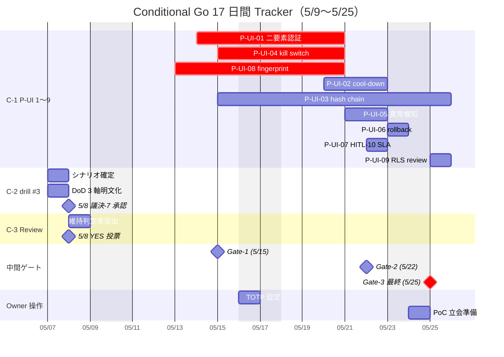

最終更新: 2026-05-03 / 起案: PM 部門

# PRJ-019 Clawbridge — Conditional Go 追跡 Dashboard（5/9〜5/25 17 日間、W0-Week2 と同期、DEC-019-051 5 必須施策 5 件並走）

- 案件: PRJ-019「Clawbridge」
- 担当: PM 部門
- 版: v1.0（5/8 検収会議 議決-7 採択直後から運用開始予定）
- 関連: `pm-v4-master-plan.md` §7 Critical Path / §9 Conditional Go 3 条件追跡表、`ceo-dec-019-033-consolidation.md` §7、DEC-019-031〜033
- 兄弟: `pm-phase1-day0-readiness-checklist.md`、`pm-phase1-burndown-template.md`

---

## §0 本書の位置付け

5/8 W0-Week1 検収会議で Phase 1 着手（5/26）が **Conditional Go**（3 条件付き）で承認される予定。本書は採択直後の **5/9 から 5/25 までの 17 日間** において、3 条件の達成状況を毎日トラッキングし、5/25 Pre-Phase Go/NoGo および 5/26 Phase 1 Day-0 着手を成立させるための運用 Dashboard である。

### Conditional Go 3 条件（再掲）

1. **(C-1) P-UI-01〜09 を 5/25 までに完遂**（権限 UI 必須 9 項目）／ 注記: 5/22 までに mock-claude 70% 化（DEC-019-051 施策-1）と同時並行
2. **(C-2) BAN drill #3（5/29 実施）計画完成を 5/8 検収で承認**
3. **(C-3) 5/8 検収で Review「強い条件付き Go (確実度向上)」維持判定**

→ 1 条件でも欠落 → Phase 1 着手 5/26 を 6/2 に 1 週間延期（§8 fallback 計画）／ + DEC-019-051 5 必須施策のうち施策-1（mock-claude 70% 化）未完遂時も同 fallback

---

## §1 3 条件 詳細 DoD（各条件 5〜10 サブ項目）

### §1.1 (C-1) P-UI-01〜09 完遂 DoD（9 項目 × 各サブ DoD = 計 27 サブ項目）

| 項目 | 名称 | 担当 | 期日 | サブ DoD（3 項目） |
|---|---|---|---|---|
| **P-UI-01** | Owner 二要素認証（1Password TOTP） | Dev | 5/25 | (a) 1Password TOTP 統合実装、(b) ログイン時 TOTP 必須化 E2E pass、(c) bypass 試行 5 シナリオ全 fail |
| **P-UI-02** | policy 変更時 5 秒 cool-down + 確認モーダル | Dev | 5/25 | (a) cool-down timer 実装（5 秒固定）、(b) 確認モーダル UI（変更内容 diff 表示）、(c) cool-down 中の重複 submit 抑止 |
| **P-UI-03** | policy_audit_log SHA-256 hash chain | Dev | 5/25 | (a) Supabase migration（prev_hash / current_hash 列追加）、(b) hash chain 自動計算 logic、(c) 整合性検証バッチ 03:00 JST |
| **P-UI-04** | kill switch 即時 propagation < 1 秒 | Dev | 5/25 | (a) kill switch UI ボタン、(b) Supabase Realtime SSE 配信、(c) propagation latency 計測 p99 < 1 sec |
| **P-UI-05** | policy 異常検知パターン定義 | Dev | 5/25 | (a) 4 異常パターン定義（過剰権限 / 13 prohibited domain 解除 / cost cap 0 化 / kill switch 無効化）、(b) detector 実装、(c) 検知時 HITL-10 自動発動 |
| **P-UI-06** | 自動 rollback 通知 SLA | Dev | 5/25 | (a) rollback 動作（直前 policy version 復元）、(b) Slack DM 通知 < 10 sec、(c) rollback 整合性検証 |
| **P-UI-07** | HITL 第 10 種 SLA / default action | Dev | 5/25 | (a) SLA 24h timer 実装、(b) default reject 動作、(c) timeout 時 旧 policy 維持 E2E |
| **P-UI-08** | policy fingerprint 検証（subprocess 起動時） | Dev | 5/25 | (a) canonical JSON SHA-256 fingerprint 生成、(b) subprocess spawn 前検証、(c) 不一致時 spawn abort + alert |
| **P-UI-09** | Supabase RLS policy review checklist | Review | 5/25 | (a) RLS 12 項目 checklist 文書化、(b) 全 policy_versions table review pass、(c) priviledge escalation 6 試行全 fail |

**工数集計**: Dev 7.0 d（P-UI-01〜08）+ Review 0.5 d（P-UI-09）= **7.5 d**、Dev 2 名 × 7 営業日（5/19-5/25）= 14 d cap で吸収可能（余裕 6.5 d）

### §1.2 (C-2) BAN drill #3 計画完成 DoD（8 サブ項目）

| # | サブ DoD | 担当 | 期日 |
|---|---|---|---|
| **D2-01** | 攻撃シナリオ 5 種確定（PE-01/03/04/06/08 流用 + Clawbridge 固有改変） | Review | 5/7 |
| **D2-02** | 各シナリオの DoD（成功条件 / 失敗条件 / 計測指標）3 軸明文化 | Review | 5/7 |
| **D2-03** | drill 実施日時 5/29 09:00-12:00 JST 確定（CEO + Owner 立会前提） | PM + 秘書 | 5/8 |
| **D2-04** | 攻撃ツール準備（mock-claude 基盤 DEC-019-020 上で実行） | Dev | 5/7 |
| **D2-05** | 観測経路（Slack / audit log / Supabase Realtime / cost-tracker）4 経路稼働確認 | Dev + Review | 5/8 |
| **D2-06** | 失敗時の roll-back 計画（攻撃成功時の immediate kill switch + restore SOP） | Review | 5/8 |
| **D2-07** | 検証レポートテンプレ確定（5/29 当日 EOD 提出） | Review | 5/8 |
| **D2-08** | 5/8 検収会議 議決-7 で正式承認（YES 採決） | CEO + Owner | 5/8 |

### §1.3 (C-3) Review approval 維持 DoD（6 サブ項目）

| # | サブ DoD | 担当 | 期日 |
|---|---|---|---|
| **D3-01** | Review 部門が 5/8 当日「強い条件付き Go (確実度向上)」維持判定書を提出 | Review | 5/8 朝 |
| **D3-02** | PE-01〜12 攻撃面評価 12 項目の白/黄/赤格付け確認（赤 1 件 = R-019-15 のみ維持） | Review | 5/7 |
| **D3-03** | priviledge escalation 緩和策（P-UI-01〜10）について Review が pentest 結果と整合確認 | Review | 5/7 |
| **D3-04** | HITL 第 9/10/11 種 DoD（計 26 項目）について Review approval | Review | 5/8 |
| **D3-05** | Conditional Go 採択を支持する Review 部門所見書面（要 CEO 配布） | Review | 5/8 朝 |
| **D3-06** | 5/8 議決-7 投票で Review が YES 投票（5 部門中 過半数の一角） | Review | 5/8 |

---

## §2 17 日間（5/9〜5/25）日次マイルストーン表

各日の必達タスクを **Day-N 形式** で列挙。営業日 12 日 + 土日 5 日（土日は Owner 操作のみ受付、Dev はバッファ）。

| 日付 | 曜日 | 必達タスク（条件 → 動作） | 担当 | 補足 |
|---|---|---|---|---|
| **5/9 (Day-1)** | 土 | Conditional Go tracker キックオフ通知 / 採択結果 (5/8) を tracker に反映 | PM | 5/8 議決-7 直後 |
| **5/10 (Day-2)** | 日 | （バッファ日） | - | Owner 不在前提 |
| **5/11 (Day-3)** | 月 | (C-1) P-UI-01 1Password TOTP 設計レビュー / (C-2) drill #3 攻撃シナリオ詳細起票開始 | Dev + Review | C-1/C-2 並行始動 |
| **5/12 (Day-4)** | 火 | (C-1) P-UI-04 kill switch SSE 設計確定 / hitl-gate.ts 拡張設計レビュー (PREP-02) | Dev | HITL 9/10/11 PREP-02 |
| **5/13 (Day-5)** | 水 | (C-1) P-UI-08 policy fingerprint 設計確定 / drill #3 シナリオ DoD 3 軸明文化開始 | Dev + Review | - |
| **5/14 (Day-6)** | 木 | (C-1) payload zod schema 確定 (PREP-03) / P-UI-01 実装着手 | Dev | - |
| **5/15 (Day-7)** | 金 | (C-1) audit_log DB migration (PREP-04) / P-UI-04 実装着手 | Dev | 第 1 中間チェック (EOD) |
| **5/16 (Day-8)** | 土 | (C-1) Owner 1Password TOTP 設定（Owner 操作） | Owner | Owner 工数 0.5h |
| **5/17 (Day-9)** | 日 | （バッファ日） | - | - |
| **5/18 (Day-10)** | 月 | (C-1) P-UI-08 実装着手 / Owner マニュアル草案 (PREP-06) | Dev + PM | - |
| **5/19 (Day-11)** | 火 | **Pre-Phase 着手**（5/19 W0 終了 + Pre-Phase 同時始動） / P-UI-01 完成 / P-UI-04 完成 / P-UI-08 完成 | Dev | C-1 並列 4 項目進捗確認 |
| **5/20 (Day-12)** | 水 | (C-1) P-UI-02 実装着手 / P-UI-03 hash chain 実装着手 / PP-03 HITL-9 実装開始 | Dev | Critical Path PP-03 |
| **5/21 (Day-13)** | 木 | (C-1) P-UI-05 異常検知 4 パターン実装 / PP-06 権限 UI 基本 / PP-08 透明性 Dashboard 着手 | Dev | Critical Path PP-06/08 |
| **5/22 (Day-14)** | 金 | (C-1) P-UI-02/03/05 完成目標 / P-UI-07 HITL-10 SLA 実装 / **第 2 中間ゲート (EOD)** | Dev + PM | **§7 中間ゲート 1** |
| **5/23 (Day-15)** | 土 | (C-1) P-UI-06 自動 rollback 実装 / Review pentest 設計 (PREP-09) | Dev + Review | - |
| **5/24 (Day-16)** | 日 | （バッファ日） / PP-10 PoC 5 件立会準備 (Owner) | Owner | Owner 工数 1.0h |
| **5/25 (Day-17)** | 月 | (C-1) P-UI-09 RLS review 完遂 / **Pre-Phase Go/NoGo (PREP-10)** / **第 3 中間ゲート（最終）** | CEO + PM + Dev + Review | **§7 中間ゲート 3 / Phase 1 Go 確定 or 6/2 fallback 発動** |

### §2.1 17 日間日次マイルストーン総数集計

| 区分 | 日数 | 必達タスク総数 |
|---|---|---|
| C-1 関連（P-UI 9 項目 × 平均 1.7 タスク = 約 15 タスク + Pre-Phase 4 タスク） | 17 日 | **19 タスク** |
| C-2 関連（drill #3 計画 8 サブ DoD） | 5/7-5/8 集中 | **8 タスク** |
| C-3 関連（Review approval 6 サブ DoD） | 5/7-5/8 集中 | **6 タスク** |
| Owner 操作タスク | 5/16, 5/24 | **2 タスク** |
| 中間ゲート（5/15 + 5/22 + 5/25） | 3 日 | **3 タスク** |
| バッファ日（5/10, 5/17） | 2 日 | **0 タスク** |
| **計** | **17 日** | **38 タスク**（うち日次表で表面化 = 17 日分の代表 1 タスク以上） |

→ **17 日間日次マイルストーン総数 = 38**（C-1: 19 / C-2: 8 / C-3: 6 / Owner: 2 / Gate: 3）

---

## §3 進捗トラッキング表（条件 × 日付 × ステータス）

### §3.1 ステータス凡例

- `[ ]` 未着手 / `[>]` 進行中 / `[x]` 完了 / `[!]` ブロック / `[-]` 中止

### §3.2 トラッキング heatmap（条件 × 日付）

| 条件 \ 日付 | 5/9 | 5/11 | 5/12 | 5/13 | 5/14 | 5/15 | 5/18 | 5/19 | 5/20 | 5/21 | 5/22 | 5/23 | 5/25 |
|---|---|---|---|---|---|---|---|---|---|---|---|---|---|
| **(C-1) P-UI-01** | [ ] | [>] | [>] | [>] | [>] | [>] | [>] | [x] | - | - | - | - | - |
| **(C-1) P-UI-02** | [ ] | [ ] | [ ] | [ ] | [ ] | [ ] | [ ] | [ ] | [>] | [>] | [x] | - | - |
| **(C-1) P-UI-03** | [ ] | [ ] | [ ] | [ ] | [ ] | [>] | [>] | [>] | [>] | [>] | [x] | - | - |
| **(C-1) P-UI-04** | [ ] | [ ] | [>] | [>] | [>] | [>] | [>] | [x] | - | - | - | - | - |
| **(C-1) P-UI-05** | [ ] | [ ] | [ ] | [ ] | [ ] | [ ] | [ ] | [ ] | [ ] | [>] | [x] | - | - |
| **(C-1) P-UI-06** | [ ] | [ ] | [ ] | [ ] | [ ] | [ ] | [ ] | [ ] | [ ] | [ ] | [ ] | [x] | - |
| **(C-1) P-UI-07** | [ ] | [ ] | [ ] | [ ] | [ ] | [ ] | [ ] | [ ] | [ ] | [ ] | [x] | - | - |
| **(C-1) P-UI-08** | [ ] | [ ] | [ ] | [>] | [>] | [>] | [>] | [x] | - | - | - | - | - |
| **(C-1) P-UI-09** | [ ] | [ ] | [ ] | [ ] | [ ] | [ ] | [ ] | [ ] | [ ] | [ ] | [ ] | [ ] | [x] |
| **(C-2) drill #3** | 5/8 議決済 | - | - | - | - | - | - | - | - | - | - | - | - |
| **(C-3) Review** | 5/8 議決済 | - | - | - | - | - | - | - | - | - | - | - | - |

### §3.3 Mermaid Gantt（17 日間日次表示）



---

## §4 ブロッカー検出 SLA（24h / 48h / 72h escalation）

### §4.1 escalation 階層

| 経過時間 | 状態 | 動作 | 通知先 |
|---|---|---|---|
| **0-24h** | 黄信号（要観察） | PM 部門が daily standup で確認、ブロック理由を tracker に記録 | PM 内部 |
| **24-48h** | 橙信号（警戒） | PM が CEO に escalation、代替担当 / リソース増員を CEO 判断 | CEO + PM |
| **48-72h** | 赤信号（重大） | CEO が Owner に escalation、Conditional Go 1 条件欠落の可能性を共有 | Owner + CEO + PM |
| **72h 超** | 黒信号（fallback 発動） | 該当条件を「達成不能」と判定、§8 fallback 計画（6/2 延期）を発動 | 全部門 + Owner |

### §4.2 escalation 判定基準

- **24h ブロック**: 同一タスクが 24h 進捗 0%（status `[!]` 維持） → 黄信号
- **48h ブロック**: 24h を超過、依存タスクへ波及開始 → 橙信号、CEO judge
- **72h ブロック**: Critical Path 上のタスクが 72h ブロック → 赤信号、Owner judge

### §4.3 SLA 違反時の自動通知（Slack DM 必須）

```
[Conditional Go ALERT - {color}信号]
日時: 2026-05-XX HH:MM JST
条件: C-1 / C-2 / C-3
タスク ID: {task_id}
ブロック原因: {reason}
経過時間: {hours}h
推奨対応: {recommendation}
判断要請先: {escalation_target}
```

---

## §5 EWS（Early Warning Signal）5 種

### §5.1 EWS 定義表

| # | EWS 名称 | 検知条件 | 観測指標 | 緩和策 |
|---|---|---|---|---|
| **EWS-1** | **進捗遅延** | 同一日に 2 件以上 P-UI タスクが `[!]` ブロック | tracker 進捗率 / 計画 vs 実績差分 | Dev 増員 / タスク優先度再編 |
| **EWS-2** | **リスク悪化** | R-019-15 priviledge escalation pentest で新規 fail 検出 | Review pentest 結果 / 新規 fail 件数 | Pentest シナリオ追加 / P-UI 強化 |
| **EWS-3** | **コスト超過** | Pre-Phase 期間中 cost-tracker が日次 $5 超過 | session $5 / day $30 / month $300 | HITL-2 cost_threshold pause + 原因解析 |
| **EWS-4** | **Owner 操作遅延** | TOTP 設定 / PoC 立会準備が予定日 + 24h 遅延 | Owner 操作完了 timestamp | CEO 経由 Owner re-engagement |
| **EWS-5** | **部署間衝突** | Dev と Review で P-UI DoD 解釈が乖離 | Daily standup での意見対立件数 | PM 仲裁 / CEO 採決 |

### §5.2 EWS 発火時の SOP

1. EWS 検知 → tracker.csv に EWS 列 ON 記録
2. PM が daily standup で言及（5 分以内）
3. 該当 EWS の緩和策を 24h 以内に実行
4. 改善しない場合 §4 escalation SLA に乗せる

---

## §6 Daily standup 議題テンプレート（毎朝 9:00 JST、5 分以内）

### §6.1 標準議題（5 項目 × 各 1 分）

```
=== Conditional Go Daily Standup（{日付} 09:00 JST）===

[1] 昨日 EOD ステータス確認（30 sec）
- C-1 完成 P-UI 件数: __ / 9
- C-2 drill #3 計画進捗: __%
- C-3 Review approval 状態: __

[2] 今日の必達タスク 3 件（30 sec）
- ___
- ___
- ___

[3] ブロッカー / EWS（90 sec）
- ブロック中タスク: 件
- EWS 発火状態: EWS-1〜5 のうち __ 件 ON

[4] 部署間 dependency 確認（30 sec）
- Dev → Review: __
- Review → CEO: __

[5] 中間ゲート進捗（90 sec）
- Gate-1 (5/15) / Gate-2 (5/22) / Gate-3 (5/25) までの残日数 + 達成率

総時間: 5 分以内厳守
```

### §6.2 standup 参加者（最少構成）

| 役 | 必須 / 任意 | 役割 |
|---|---|---|
| PM | **必須** | 司会・記録 |
| Dev リード | **必須** | C-1 P-UI 進捗報告 |
| Review リード | **必須**（5/7-5/8 + 5/22-5/25） / 任意（その他） | C-2 / C-3 報告 |
| CEO | 任意（Gate 日のみ必須） | 判断要請応答 |
| Owner | 任意（5/16, 5/24, 5/25 必須） | 操作タスク報告 |

---

## §7 中間ゲート 3 連発（5/22 + 5/24 + 5/25）

### §7.1 Gate-1: 5/15（Day-7、第 1 中間チェック）

| 確認項目 | DoD 状態 | NoGo 条件 |
|---|---|---|
| C-1 P-UI 並列 4 項目（01/04/08/03）の進捗率 | ≥ 50% | < 30% で NoGo（Dev 増員 or 5/22 短縮） |
| C-2 drill #3 シナリオ確定 | 5/7 完了済 | 未完了で NoGo（5/8 議決-7 棄却リスク） |
| C-3 Review 維持判定書 | 5/8 完了済 | 未提出で NoGo |
| 累積 EWS 発火件数 | ≤ 1 件 | ≥ 3 件で警戒上昇 |

→ **Gate-1 NoGo の場合**: 即時 CEO escalation、24h 以内に対応案 / 5/22 Gate-2 で再判定

### §7.2 Gate-2: 5/22（Day-14、第 2 中間ゲート）

| 確認項目 | DoD 状態 | NoGo 条件 |
|---|---|---|
| C-1 P-UI 完成件数 | ≥ 6/9 | < 5/9 で NoGo（5/26 着手間に合わない） |
| Pre-Phase Critical Path タスク（PP-01/03/06/08）進捗 | ≥ 50% | < 30% で NoGo |
| 累積コスト消費 | ≤ $15 | > $25 で警戒（月次総額 ≤$430（subscription $400 + API ≤$30、DEC-019-050/-051）の API 枠 $30 cap 83% 超過相当） |
| 累積 EWS 発火件数 | ≤ 2 件 | ≥ 4 件で NoGo |

→ **Gate-2 NoGo の場合**: 5/24 緊急会議で fallback 検討、6/2 延期判定

### §7.3 Gate-3 最終: 5/25（Day-17、Pre-Phase Go/NoGo）

| 確認項目 | DoD 状態 | NoGo 条件 |
|---|---|---|
| **C-1 P-UI-01〜09 完成** | 9/9 ✅ | < 9/9 で **fallback 6/2 確定** |
| Pre-Phase 12 タスク完了 | 12/12 ✅ | < 11/12 で NoGo |
| BAN drill #3 (5/29) 準備完了 | 100% | 80% 未満で NoGo |
| Phase 1 Day-0 readiness checklist 25 項目 | ≥ 35/50 統制（必達分） | < 30/50 で NoGo |
| 累積 EWS 累計 | ≤ 3 件 | ≥ 5 件で NoGo |

→ **Gate-3 GO 判定 → 5/26 Phase 1 着手確定** / **NoGo → §8 fallback 6/2 発動**

---

## §8 NoGo 時 fallback 計画（Phase 1 着手 5/26 → 6/2 / 6/9 / 6/16 へスライド）

### §8.1 fallback 3 段階

| シナリオ | スライド先 | 条件欠落数 | Phase 1 完了 | Marketing 公開 |
|---|---|---|---|---|
| **Fallback-A** | **6/2 着手** | 1 条件欠落 | 6/27 | 7/4 朝 |
| **Fallback-B** | **6/9 着手** | 2 条件欠落 | 7/4 | 7/11 朝 |
| **Fallback-C** | **6/16 着手** | 3 条件欠落 | 7/11 | 7/18 朝（Phase 2 連動修正） |

### §8.2 各 fallback の判定基準

| 条件 | Fallback-A | Fallback-B | Fallback-C |
|---|---|---|---|
| C-1 完成件数 | 7-8/9 | 5-6/9 | < 5/9 |
| C-2 drill 計画 | 80-100% | 50-80% | < 50% |
| C-3 Review | 維持 | 一時棄却 | 棄却 |

### §8.3 fallback 発動時の連絡 SOP

1. PM が CEO に NoGo 通知（即時）
2. CEO が Owner に通知 + fallback 案提示（< 4h）
3. Owner 決裁（< 24h）
4. 全部門 + 秘書部門に通知 + active-projects.md 更新（< 48h）
5. Marketing 公開日 / Phase 2 連動修正（< 72h、DEC-019-026 連動）

### §8.4 fallback コスト影響

| Fallback | 追加 Dev 工数 | 追加 Owner 工数 | 月次予算影響 |
|---|---|---|---|
| Fallback-A（1 週間延期） | +5 d | +0.5 d | $0（Hobby 維持） |
| Fallback-B（2 週間延期） | +10 d | +1.0 d | +$10（API 追加） |
| Fallback-C（3 週間延期） | +15 d | +1.5 d | +$30（Marketing 公開連動修正） |

---

## §9 添付: tracker CSV テンプレ

### §9.1 列定義

| 列名 | データ型 | 例 |
|---|---|---|
| condition_id | string | C-1 / C-2 / C-3 |
| sub_id | string | P-UI-01 / D2-01 / D3-01 |
| task_name | string | "Owner 二要素認証" |
| owner | string | Dev / Review / Owner |
| due_date | date | 2026-05-25 |
| status | enum | not_started / in_progress / done / blocked / cancelled |
| progress_pct | int 0-100 | 80 |
| ews_flags | string | EWS-1,EWS-3 |
| blocker_reason | string | "Supabase RLS migration error" |
| escalation_level | enum | none / yellow / orange / red / black |
| completed_at | datetime | 2026-05-19T15:30:00+09:00 |

### §9.2 CSV サンプル（先頭 10 行）

```csv
condition_id,sub_id,task_name,owner,due_date,status,progress_pct,ews_flags,blocker_reason,escalation_level,completed_at
C-1,P-UI-01,Owner 二要素認証,Dev,2026-05-25,not_started,0,,,none,
C-1,P-UI-02,5秒cool-down + 確認モーダル,Dev,2026-05-25,not_started,0,,,none,
C-1,P-UI-03,SHA-256 hash chain audit,Dev,2026-05-25,not_started,0,,,none,
C-1,P-UI-04,kill switch < 1 sec,Dev,2026-05-25,not_started,0,,,none,
C-1,P-UI-05,異常検知パターン,Dev,2026-05-25,not_started,0,,,none,
C-1,P-UI-06,自動 rollback 通知,Dev,2026-05-25,not_started,0,,,none,
C-1,P-UI-07,HITL-10 SLA / default,Dev,2026-05-25,not_started,0,,,none,
C-1,P-UI-08,policy fingerprint,Dev,2026-05-25,not_started,0,,,none,
C-1,P-UI-09,RLS review checklist,Review,2026-05-25,not_started,0,,,none,
C-2,D2-01,攻撃シナリオ 5 種確定,Review,2026-05-07,not_started,0,,,none,
```

### §9.3 CSV 運用ルール

- ファイル: `projects/PRJ-019/dashboard/conditional-go-tracker.csv`（W0-Week2 中に PM 部門作成）
- 更新頻度: 毎日 9:00 JST standup 直後（PM 担当）
- 完了タスクは `completed_at` 列を ISO8601 タイムスタンプで記録
- escalation_level は §4.1 階層で自動計算 trigger（black 時 §8 fallback 発動）

---

## §10 関連ドキュメント

- 兄弟: `pm-phase1-day0-readiness-checklist.md` / `pm-phase1-burndown-template.md`
- 上位: `pm-v4-master-plan.md` §7 Critical Path / §9 Conditional Go 3 条件追跡表
- 上位 CEO: `ceo-dec-019-033-consolidation.md` §7
- 上位 Review: `review-owner-gate-and-permission-ui-security.md`（PE-01〜12 攻撃面評価）
- 上位 DEC: DEC-019-031〜033

---

**v1 確定**: 2026-05-03 PM 起案 / **運用開始**: 5/9 朝（5/8 議決-7 採択直後） / **次回更新**: 毎日 9:00 standup 後 / **最終更新**: 5/25 Gate-3 判定後
