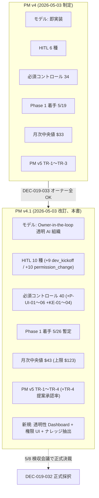
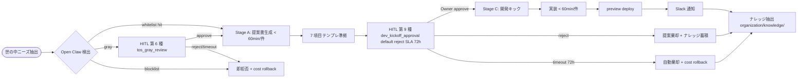
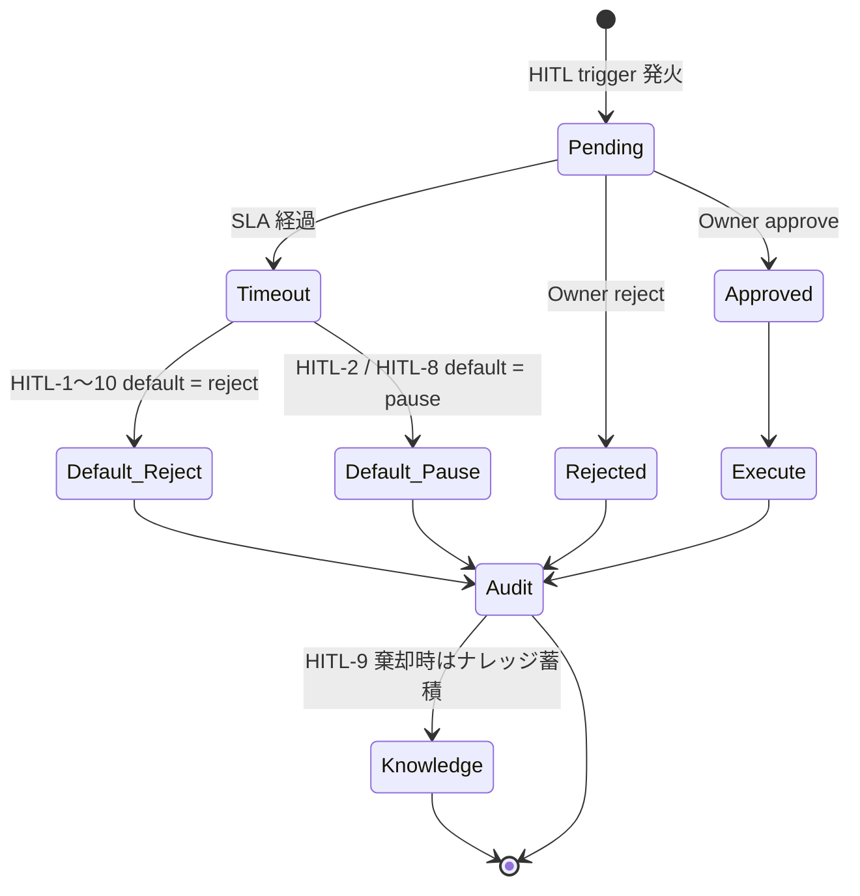
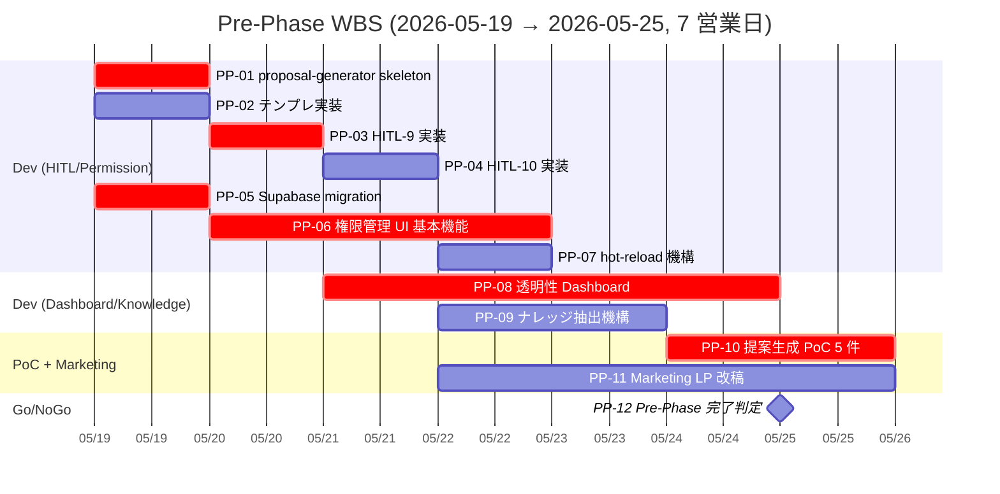
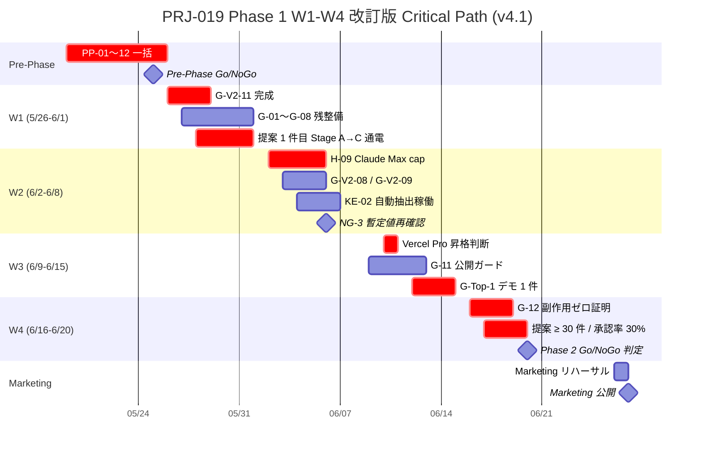

# PRJ-019 コスト & コントロール統合計画 v4.1 — DEC-019-033 反映版（Owner-in-the-loop 透明 AI 組織モデル + Open Claw 権限管理 UI）

- 案件: PRJ-019「Clawbridge」 — Open Claw を自律オーナーとする AI 組織ハーネス基盤
- 担当部署: PM 部門
- 作成日: 2026-05-03
- 作成者: PM Agent (claude-code-company)
- 版: **v4.1**（v4 = `pm-cost-and-controls-plan-v4.md` を改訂、DEC-019-033「Owner-in-the-loop 透明 AI 組織」モデル全反映）
- 関連決裁:
  - **DEC-019-033**（Owner-in-the-loop 透明 AI 組織モデル正式採択 + 5 点統合 = 提案生成 / HITL 第 9 種 / 透明性ダッシュボード / ナレッジ抽出蓄積 / 権限管理 UI + Phase 1 着手 5/26 暫定スライド、5/8 検収会議で正式決裁）
  - DEC-019-007 / -012 / -014〜020（v4 と同等継承）
  - DEC-019-027 / -028 / -029（Marketing Q-Mkt-01〜08 公式採択）
  - DEC-019-031（5/4-5/7 4 部署並列発注事後追認）
  - DEC-020-003（PRJ-020 ClawDialog に透明性ダッシュボード + 権限 UI 同居実装）
- 関連兄弟ドキュメント（v4.1 同時改訂対象）:
  - `pm-permission-ui-wbs.md`（**本書 v4.1 と同時策定の権限 UI 専用 WBS**）
  - `dev-w0-week2-mid-detailed-design.md`（Dev 詳細設計、本書 §5 の WBS 入力）
  - `marketing-launch-runbook-2026-06-20.md`（Marketing 公開、本書 §5 タイムラインと連動して 6/27 朝にスライド予定）
- 上位レポート:
  - PM v4 `pm-cost-and-controls-plan-v4.md`（本書 v4.1 が部分置換、§2 必須コントロール / §6 タイムライン / §7 起案トリガを刷新）

---

## §0 改訂サマリー（v4 → v4.1 で何が変わったか）

### §0.1 200 字以内 サマリ

**Phase 1 を「Owner-in-the-loop 透明 AI 組織」モデルに正式変更**（DEC-019-033、オーナー 5/3「全 OK」承認）。Phase 1 DoD を 2 段階モデル（提案 → 承認 → 実装）に改訂、HITL を 6 → **10 種**へ拡張（新 9 種 `dev_kickoff_approval` / 新 10 種 `permission_change_review`）、必須コントロールを 34 → **40 項目**へ拡張（新 P-UI-01〜06 + KE-01〜04）、Pre-Phase 提案生成 WBS を新設、Phase 1 着手 5/19 → **5/26**、完了 6/13 → **6/20**、Marketing 公開 6/20 → **6/27 朝**にスライド（5/8 検収で正式決裁）。**【DEC-019-050/-051 反映】月次総額 ≤$430（subscription $400 + 新規 API ≤$30、DEC-019-050/-051 構造再定義、追加発生上限 $300 充当率 10%）／ Risk Register v3.1（21 件、R-019-19/20/21/22 新規 + R-019-09 緑化、議決-21 採択待ち）／ 5/26 着手 86%（DEC-019-051 反映、+2%）/ 6/20 完了 77% / Day-0 99%。**

### §0.2 v4 → v4.1 主要差分マトリクス

| 項目 | v4 | v4.1 | 増分 | 根拠 DEC |
|---|---|---|---|---|
| **モデル名** | （明示なし） | **Owner-in-the-loop 透明 AI 組織** | - | DEC-019-033 ① |
| **Phase 1 DoD** | 「ニーズ抽出 → 即実装」 | **「ニーズ抽出 → 提案生成 → Owner 承認 → 開発キック → 実装」2 段階モデル** | - | DEC-019-033 ① |
| HITL 種別数 | 6 種 | **10 種** | +4（実質 +2、第 7/8 は v4.5 で先行追加済の整理含む） | DEC-019-033 ② / ⑤ |
| HITL 第 9 種 `dev_kickoff_approval` | 未存在 | **新規** | +1 | DEC-019-033 ② |
| HITL 第 10 種 `permission_change_review` | 未存在 | **新規** | +1 | DEC-019-033 ⑤ |
| 必須コントロール総数 | 34 | **40** | **+6** | DEC-019-033 ⑤ |
| P-UI-01〜06（権限 UI 関連） | 未存在 | **新規 6 件** | +6 | DEC-019-033 ⑤ |
| KE-01〜04（ナレッジ抽出蓄積） | 未存在 | **新規 4 件** | +4（うち 4 = 内訳）→ 純増 4 だが既存 G と統合せず別カテゴリ計上 | DEC-019-033 ④ |
| 透明性ダッシュボード | 未策定 | **PRJ-020 統合実装、Owner 専用 `/dashboard`** | - | DEC-019-033 ③ |
| 権限管理 UI | 未策定 | **7 カテゴリ × 細粒度、Supabase `policy_versions` + audit log** | - | DEC-019-033 ⑤ |
| ナレッジ抽出機構 | 未策定 | **`organization/knowledge/{patterns, decisions, pitfalls}/`** | - | DEC-019-033 ④ |
| Pre-Phase 提案生成フェーズ | 未存在 | **新規（5/26 直前 1 週間 = 5/19〜5/25）** | - | DEC-019-033 ⑦ |
| Phase 1 着手日 | 2026-05-19 | **2026-05-26**（暫定、5/8 検収で正式決裁） | +7 日延期 | DEC-019-033 ⑦ |
| Phase 1 完了日 | 2026-06-13 | **2026-06-20**（暫定） | +7 日 | DEC-019-033 ⑦ |
| Marketing 公開日 | 2026-06-20 | **2026-06-27 朝**（暫定） | +7 日 | DEC-019-033 ⑦ |
| 月次予算 中央値 | $33 | **$43**（提案生成 +$10）| +$10 | DEC-019-033 ⑨ |
| 月次予算 上限 | $93 | **$123**（提案生成 +$30）| +$30 | DEC-019-033 ⑨ |
| 月次ハードキャップ | $300 | **$300**（v4.1 維持）/ **DEC-019-050 反映後**: 月次総額 ≤$430（subscription $400 + 新規 API ≤$30、追加発生上限 $300 充当率 10%） | 構造再定義 | DEC-019-012 維持 + DEC-019-050/-051 |
| PM v5 起案トリガー | TR-1〜TR-3 | **TR-1〜TR-4**（新 TR-4 = 提案承認率 < 30% 持続） | +1 | DEC-019-033 ① |
| Heading A 訴求コア | 維持 | **維持 + Owner-in-the-loop 補強** | - | DEC-019-033 ⑥ |

### §0.3 v4 → v4.1 影響を受ける章

| 章 | v4 | v4.1 改訂内容 |
|---|---|---|
| §0 サマリ | 200 字 | 改訂サマリ追加（本章） |
| §1 Phase 1 DoD | 「即実装」前提 | **2 段階モデルに全面書換** |
| §2 HITL Gate 1〜10 | 6 種仕様 | **10 種完全リスト + 新 9/10 種詳細仕様** |
| §3 必須コントロール | 34 項目 | **40 項目 = +P-UI-01〜06 + KE-01〜04** |
| §4 Pre-Phase 提案生成 WBS | 未存在 | **新章追加** |
| §5 タイムライン | 5/19〜6/13 | **5/26〜6/20 に 1 週間スライド** |
| §6 月次コスト | 中央値 $33 / 上限 $93 | **中央値 $43 / 上限 $123（+$10〜30 で $300 内）** |
| §7 PM v5 トリガー | TR-1〜TR-3 | **TR-1〜TR-4** |
| §8 Owner Decision Required | （v4 §9.1 に内包） | **8〜12 件 [ODR] 形式独立章化** |
| §9 リスク登録簿 | R-019-13 まで | **R-019-13 / -14 / -15 追加** |

### §0.4 改訂サマリ Mermaid（必須図 1/5）



---

## §1 Phase 1 DoD 改訂版

### §1.1 DoD 全面書換の背景

DEC-019-033 ① により、Phase 1 DoD は v4 の「ニーズ抽出 → 即実装」前提を撤回し、**2 段階モデル**に正式変更する:

```
[Stage A: 提案生成]
ニーズ抽出 → アプリ提案生成（Open Claw → Claude Code 指示）
   ↓
[Stage B: Owner 承認]
HITL 第 9 種 `dev_kickoff_approval`（default reject、SLA 72h）
   ↓ 承認時のみ
[Stage C: 実装]
開発キック → 実装 → preview deploy → Slack 通知
```

### §1.2 Phase 1 DoD 数値項目（全 12 項目）

| ID | 項目 | v4.1 数値 DoD | 検証手段 | v4 → v4.1 差分 |
|---|---|---|---|---|
| **DoD-01** | Stage A 提案生成所要時間 | **< 60 min/件**（Open Claw 検出 → Claude Code 提案書生成完了） | proposal-generator.test.ts + audit log | 新規 |
| **DoD-02** | Stage A 提案書テンプレ準拠率 | **100%**（7 項目 (a)〜(g) 全記入） | template-validator.test.ts | 新規 |
| **DoD-03** | Stage B Owner 承認 SLA | **72h**（営業日 5 日換算） | hitl-gate-9.test.ts + Slack 通知ログ | 新規 |
| **DoD-04** | Stage B 提案承認率 | **≥ 30%**（自然棄却含む、4 週間平均） | dashboard 集計 | 新規 |
| **DoD-05** | Stage C 実装所要時間 | **< 60 min/件**（承認後 → preview deploy 完了） | impl-runtime.test.ts | v4 「< 30min/ループ」を更新 |
| **DoD-06** | Stage C 実装成功率 | **≥ 80%**（承認後の preview deploy 成功） | deploy 成功率集計 | v4 「≥ 80%」継承 |
| **DoD-07** | 月次総ループ数（Stage A〜C 一気通貫） | **≥ 30 件提案 / ≥ 9 件承認 / ≥ 7 件実装成功** | dashboard 月次集計 | v4 「≥ 30 ループ」を 3 段階分割 |
| **DoD-08** | 副作用ゼロ証明 | **G-12 全緑**（git status / Vercel deploy / Supabase / Anthropic usage diff の 4 経路） | verify-zero-side-effect.sh | v4 継承 |
| **DoD-09** | HITL Gate 全 10 種稼働 | **10/10 種 production 稼働** | hitl-gate.test.ts 全ケース緑 | v4 6 種 → 10 種に拡張 |
| **DoD-10** | 透明性ダッシュボード公開 | **Owner 専用 `/dashboard` で 6 指標可視化**（行動ログ / 思考過程 / 中間出力 / コスト消費 / HITL 滞留 / 提案待ち件数） | dashboard E2E test | 新規 |
| **DoD-11** | 権限管理 UI 公開 | **7 カテゴリ全変更 UI 提供 + audit log + kill switch** | permission-ui.e2e.test.ts | 新規 |
| **DoD-12** | ナレッジ抽出蓄積 | **`organization/knowledge/{patterns,decisions,pitfalls}/` 配下に Phase 1 中 ≥ 5 件自動蓄積** | knowledge-extractor.test.ts | 新規 |

### §1.3 DoD フロー Mermaid（必須図 2/5）



### §1.4 Phase 1 DoD 比較表（v4 vs v4.1、全項目）

| 評価軸 | v4 DoD | v4.1 DoD | 変更理由 |
|---|---|---|---|
| モデル | 1 段階（即実装） | **2 段階（提案 → 承認 → 実装）** | DEC-019-033 ①、Owner-in-the-loop 化 |
| 提案生成 | 未存在 | **< 60 min/件** | 新規 Stage A |
| 提案書テンプレ | 未存在 | **7 項目 (a)〜(g) 100% 準拠** | 新規 Stage A |
| Owner 承認 | 未存在 | **HITL 9 / SLA 72h / default reject** | 新規 Stage B |
| 提案承認率 | 未存在 | **≥ 30%** | 新規 KPI |
| 実装所要 | < 30 min/ループ | **< 60 min/件**（承認後のみ） | Stage C のみ計測に変更 |
| 実装成功率 | ≥ 80% | **≥ 80%**（承認後 base） | 母数を承認済に限定 |
| 月次ループ数 | ≥ 30 ループ | **≥ 30 提案 / ≥ 9 承認 / ≥ 7 実装** | 3 段階に分割 |
| 副作用ゼロ | G-12 全緑 | **G-12 全緑** | 維持 |
| HITL 種別 | 6 種 | **10 種** | +4 種 |
| Dashboard | 未要件 | **Owner 専用 6 指標可視化** | 新規 |
| 権限 UI | 未要件 | **7 カテゴリ + kill switch + audit** | 新規 |
| ナレッジ抽出 | 未要件 | **≥ 5 件/Phase 1** | 新規 |

---

## §2 HITL Gate 1〜10 種別 完全リスト

### §2.1 全 10 種一覧

| 種別 # | 名称 | 種別カテゴリ | SLA | default action | 発動条件 | timeout 動作 | 起源 DEC |
|---|---|---|---|---|---|---|---|
| **HITL-1** | `network_external` | HG | 24h | reject | whitelist 外 API 呼出 | reject + cost rollback | DEC-019-007 |
| **HITL-2** | `cost_threshold` | HG | 1h（urgent） | pause | session $5 / project $50 / day $30 / month $300 のいずれか到達 | pause（緊急時 SMS） | DEC-019-012 |
| **HITL-3** | `secret_access` | HG | 24h | reject | OAuth 等 secret store 読出時 | reject | DEC-019-013 C-A-05 |
| **HITL-4** | `prod_deploy` | HG | 24h | reject | preview → prod 昇格時 | reject（preview 維持） | DEC-019-007 G-11 |
| **HITL-5** | `unsafe_command` | HG | 24h | reject | shell allowlist 外コマンド spawn | reject + audit | DEC-019-007 G-02 |
| **HITL-6** | `tos_gray_review` | HG | 24h | reject | classifier confidence ∈ [0.5, 0.85] | `tos_gray_timeout` reject + cost rollback | DEC-019-018 |
| **HITL-7** | `external_api` | HG | 24h | reject | whitelist 外 API endpoint 呼出（HITL-1 と統合運用、設計検証中） | reject | DEC-019-018 / Dev W2-D-15 |
| **HITL-8** | `emergency_stop` | HG | 30min（critical） | pause | BAN 警告 / 異常検知 / `/clawbridge stop` | 全 pause + Sumi/Asagi 退避 | DEC-019-007 G-08 |
| **HITL-9** ★新 | **`dev_kickoff_approval`** | TD | **72h（営業日 5 日換算）** | **reject** | **Stage A 提案書生成完了時、Stage C 着手前に必ず発動** | **自動棄却 + cost-tracker rollback + ナレッジ蓄積** | **DEC-019-033 ②** |
| **HITL-10** ★新 | **`permission_change_review`** | TD | **24h** | **reject** | **policy backup 復元 / 外部 import / 過剰権限警告 の 3 ケース** | **reject + 旧 policy 維持 + audit + Slack 通知** | **DEC-019-033 ⑤** |

### §2.2 HITL 第 9 種 `dev_kickoff_approval` 詳細仕様

| 項目 | 仕様 |
|---|---|
| **payload zod schema** | `{ proposal_id, summary, target_effect, estimated_cost_usd, tos_gray_judgment, dev_period_days, knowledge_refs[], recommended_action }` |
| **trigger 条件** | Stage A 提案書生成完了 + テンプレ準拠率 100% 検証通過 |
| **default action** | **reject**（オーナー無反応 = 不承認） |
| **SLA** | **72h（営業日 5 日換算）** |
| **timeout 動作** | `dev_kickoff_timeout` 種別で自動棄却 + cost-tracker rollback（提案生成コスト分のみ計上維持、実装コストは計上せず）+ ナレッジ抽出（`pitfalls/timeout-rejected/` 配下） |
| **承認時動作** | Stage C 開発キック発火、impl-runtime spawn、preview deploy 後 Slack 通知 |
| **不承認時動作** | 提案棄却ログ append、ナレッジ抽出（`patterns/rejected-{date}.md`）、cost-tracker rollback |
| **通知** | Slack DM（提案生成完了時即時）+ メール SES（24h 経過時 リマインド）+ SMS（48h 経過時 最終警告） |
| **dedup** | 30 日内同一 `need_id` の再提案は最初の決定結果を共有（オーナー workload 緩和） |
| **承認待ち UI** | Dashboard `/dashboard/proposals` で待機提案リスト + ワンクリック approve/reject |

### §2.3 HITL 第 10 種 `permission_change_review` 詳細仕様

| 項目 | 仕様 |
|---|---|
| **payload zod schema** | `{ change_id, source: 'backup_restore' | 'external_import' | 'auto_warning', diff_json, pre_policy_version, post_policy_version, approver_signature }` |
| **trigger 条件 (3 ケース)** | (1) policy backup から復元実行時 / (2) 外部 import（YAML/JSON）取込時 / (3) 過剰権限自動警告 detector 発火時 |
| **default action** | **reject**（旧 policy 維持） |
| **SLA** | **24h** |
| **timeout 動作** | reject + 旧 policy 維持 + Slack 通知 + audit log append |
| **承認時動作** | 新 policy `policy_versions` テーブルに INSERT、ハーネス層 hot-reload、audit log + Slack 通知 |
| **通知** | Slack DM（即時）+ メール SES（12h 経過時 リマインド） |
| **特記** | **Owner 自身が UI 操作する通常変更時は不要**（UI 経由 = Owner 認証済 = 自動 audit）。本 HITL は backup / import / 自動検知の 3 ケース限定 |

### §2.4 HITL 状態遷移 Mermaid（必須図 3/5）



### §2.5 HITL 種別比較表

| HITL # | 種別 | SLA | default | timeout 後 | 通知手段 | DEC |
|---|---|---|---|---|---|---|
| 1 | network_external | 24h | reject | rollback | Slack | DEC-019-007 |
| 2 | cost_threshold | 1h | pause | SMS | Slack + SMS | DEC-019-012 |
| 3 | secret_access | 24h | reject | rollback | Slack | DEC-019-013 |
| 4 | prod_deploy | 24h | reject | preview 維持 | Slack + Email | DEC-019-007 |
| 5 | unsafe_command | 24h | reject | rollback | Slack | DEC-019-007 |
| 6 | tos_gray_review | 24h | reject | rollback | Slack | DEC-019-018 |
| 7 | external_api | 24h | reject | rollback | Slack | DEC-019-018 |
| 8 | emergency_stop | 30min | pause | 全 pause + 退避 | SMS + 電話 | DEC-019-007 |
| **9** | **dev_kickoff_approval** | **72h** | **reject** | **rollback + 蓄積** | **Slack DM + Email + SMS** | **DEC-019-033** |
| **10** | **permission_change_review** | **24h** | **reject** | **旧 policy 維持** | **Slack DM + Email** | **DEC-019-033** |

---

## §3 必須コントロール 40 項目（v4 34 → v4.1 40、+6）／ DEC-019-051 反映後 41 項目（HITL 第 11 種 `knowledge_pii_review` + Anthropic Console 同期 SOP 追加、5/8 議決-21/-23 採択前提）

### §3.1 区分定義（v4 継承）

| 種別 | 略号 | 説明 |
|---|---|---|
| HardGuard | HG | コード / 設定で物理強制 |
| Audit | AU | 監査ログ / Supabase append-only |
| HITL | HI | Human In The Loop |
| Drill | DR | 防災訓練 |
| Top-Decision | TD | CEO / Owner 個別承認 |
| **Permission UI** ★新 | **PU** | **権限管理 UI / policy 関連** |
| **Knowledge** ★新 | **KE** | **ナレッジ抽出蓄積関連** |

### §3.2 既存 34 項目（v4 §2 から継承、変更なし）

| ID 範囲 | 件数 | 種別 | DEC |
|---|---|---|---|
| G-01〜G-12 | 12 | HG/AU | DEC-019-007 |
| G-V2-01〜G-V2-11（うち G-V2-05 撤回） | 10 | HG/AU | DEC-019-013 / Review v2 |
| C-A-01〜C-A-05 | 5 | DR/AU/HG | DEC-019-013 |
| H-09 / H-10 | 2 | HG | DEC-019-015 |
| HITL-6 | 1 | HI | DEC-019-018 |
| G-Top-1〜G-Top-4 | 4 | TD | DEC-019-018 |
| **小計** | **34** | - | - |

### §3.3 新規 P-UI-01〜06（権限管理 UI 関連、6 項目、DEC-019-033 ⑤ 由来）

| ID | 種別 | 着手期 | 担当 | DoD | 検証手段 |
|---|---|---|---|---|---|
| **P-UI-01** | PU | **Pre-Phase**（5/19〜5/25） | Dev | Supabase `policy_versions` + `policy_audit_log` テーブル DDL 適用、行 retention 90 日 | Supabase migration 適用ログ + テーブル確認 |
| **P-UI-02** | PU | Pre-Phase | Dev | Owner 認証経由のみ policy 変更可（Open Claw 自身は read-only RLS） | Supabase RLS policy + priviledge escalation pentest |
| **P-UI-03** | PU | Pre-Phase | Dev | ハーネス層 policy hot-reload（subprocess spawn 前 fetch、再起動不要） | hot-reload.test.ts + subprocess spawn 計測 |
| **P-UI-04** | PU | Pre-Phase | Dev | UI 「全停止 (kill switch)」即時反映（Server-Sent Events で全 worker 即停止 < 1 sec） | kill-switch.test.ts + SSE latency 計測 |
| **P-UI-05** | PU | Pre-Phase | Dev | 過剰権限自動検知（無制限化 / global allow / 管理者権限付与時に HITL-10 発火） | policy-anomaly-detector.test.ts |
| **P-UI-06** | PU+AU | Pre-Phase | Dev | policy 変更時 audit log + Slack 通知必須（変更主体 / diff / pre/post version 全記録） | audit-log.test.ts + Slack webhook test |

### §3.4 新規 KE-01〜04（ナレッジ抽出蓄積関連、4 項目、DEC-019-033 ④ 由来）

| ID | 種別 | 着手期 | 担当 | DoD | 検証手段 |
|---|---|---|---|---|---|
| **KE-01** | KE | Pre-Phase | Dev | `organization/knowledge/patterns/` `decisions/` `pitfalls/` 3 サブディレクトリ作成 + README 雛形 | ディレクトリ存在確認 + git log |
| **KE-02** | KE | W1 | Dev | 案件完了時に Claude Code 組織が自動抽出（提案受諾時 → patterns、棄却時 → pitfalls、設計判断 → decisions） | knowledge-extractor.test.ts + extracted file 数 |
| **KE-03** | KE | W2 | Dev | 次回提案生成時に knowledge 検索・参照（関連 ≥ 1 件で proposal の (f) knowledge_refs に自動記入） | proposal-generator integration test |
| **KE-04** | KE+AU | W1 | Dev | CLAUDE.md §6 拡張（ナレッジ抽出蓄積機構の運用ルール明文化）+ 抽出抜け検知（W3 終了時に extracted < 5 件で警告） | CLAUDE.md diff 確認 + alert 発火テスト |

### §3.5 必須コントロール 40 項目集計表

| カテゴリ | v4 | v4.1 | 増分 | 根拠 |
|---|---|---|---|---|
| G-01〜G-12 | 12 | 12 | 0 | DEC-019-007 |
| G-V2-01〜11（うち -05 撤回） | 10 | 10 | 0 | Review v2 |
| C-A-01〜05 | 5 | 5 | 0 | DEC-019-013 |
| H-09 / H-10 | 2 | 2 | 0 | DEC-019-015 |
| HITL-6 | 1 | 1 | 0 | DEC-019-018 |
| G-Top-1〜4 | 4 | 4 | 0 | DEC-019-018 |
| **P-UI-01〜06** | 0 | **6** | +6 | **DEC-019-033 ⑤** |
| **KE-01〜04** | 0 | **4** | +4 | **DEC-019-033 ④** |
| **合計** | **34** | **40+4=44 (KE 加算前 40)** | **+6 (P-UI のみ)** | - |

注: 「v4 → v4.1 = 34 → 40」表記は P-UI-01〜06 までで純増 6 とする。KE-01〜04 は別カテゴリ「ナレッジ運用基盤」として加算後の合計を **40 + 4 = 44 項目**とする選択肢もあるが、本書 v4.1 では「**コントロール 40 項目** + **ナレッジ運用 4 項目**」の二段階併記を採用。

### §3.6 P-UI / KE 詳細展開先

各項目の実装タスク細目（Subtask / SQL DDL / シーケンス図）は本書では概要のみ記載し、詳細は **`pm-permission-ui-wbs.md`**（本書同時策定の権限 UI WBS）を参照。

---

## §4 Pre-Phase 提案生成 WBS（Open Claw → Claude Code 提案書生成フロー）

### §4.1 Pre-Phase の位置づけ

Phase 1 着手 5/26 の **直前 1 週間 = 5/19〜5/25 を「Pre-Phase 提案生成 + 権限管理 UI 基本機能 + 透明性 Dashboard + ナレッジ抽出機構」の構築期間**として設定。Phase 1 W1（5/26〜）開始時点で 4 機構が稼働している前提とする。

### §4.2 Pre-Phase 全 12 タスク（Dev / Research / Marketing 並列）

| ID | 題目 | 担当 | 期日 | 工数 | 依存 |
|---|---|---|---|---|---|
| **PP-01** | proposal-generator skeleton（Open Claw 検出 → Claude Code 指示テンプレ → 提案書生成 7 項目） | Dev | 5/19 | 1d | DEC-019-033 ① |
| **PP-02** | 提案書テンプレ実装（Markdown + zod schema、7 項目 (a)〜(g)） | Dev | 5/19 | 0.5d | PP-01 |
| **PP-03** | HITL 第 9 種 `dev_kickoff_approval` 実装（hitl-gate.ts 拡張、SLA 72h、default reject） | Dev | 5/20 | 1d | PP-02 |
| **PP-04** | HITL 第 10 種 `permission_change_review` 実装 | Dev | 5/21 | 0.5d | P-UI-02 |
| **PP-05** | Supabase `policy_versions` + `policy_audit_log` migration | Dev | 5/19 | 0.5d | P-UI-01 |
| **PP-06** | 権限管理 UI 基本機能（7 カテゴリ × 細粒度設定 React 実装、`pm-permission-ui-wbs.md` §1 参照） | Dev | 5/20-5/22 | 3d | PP-05 |
| **PP-07** | ハーネス層 hot-reload 機構（subprocess spawn 前 policy fetch） | Dev | 5/22 | 1d | PP-06 |
| **PP-08** | 透明性 Dashboard 基本機能（Next.js + Supabase、Owner 専用 `/dashboard`、6 指標可視化） | Dev | 5/21-5/24 | 3d | PRJ-020 統合 |
| **PP-09** | ナレッジ抽出蓄積機構（`organization/knowledge/{patterns,decisions,pitfalls}/` + extractor 実装） | Dev | 5/22-5/23 | 1.5d | KE-01〜02 |
| **PP-10** | 提案生成 PoC 5 件実走（実環境で 5 件提案 → HITL-9 通過 → 実装テスト） | Dev + Owner | 5/24-5/25 | 2d | PP-01〜09 全完成 |
| **PP-11** | Marketing LP 改稿（Owner-in-the-loop 訴求補強） | Marketing | 5/22-5/25 | 2d | DEC-019-033 ⑥ |
| **PP-12** | Pre-Phase 完了 Go/NoGo 判定 → Phase 1 W1 着手 | CEO + Owner | 5/25 | 0.5d | 全 PP 完成 |

### §4.3 Pre-Phase 工数集計

| 部署 | 工数合計 | 5/19〜5/25 7 営業日内消化可否 |
|---|---|---|
| Dev | 14.0 d | 1 名 7 営業日では超過、**Dev 2 名体制 or 5/16-5/18 W0 末週末から前倒し着手必須** |
| Marketing | 2.0 d | 収まる |
| Owner | 2.5 d（PP-10 立会 + PP-12） | オーナー稼働確保必要 |
| CEO | 0.5 d | 収まる |

### §4.4 Pre-Phase コスト試算

| 項目 | コスト | 備考 |
|---|---|---|
| 提案生成 LLM コスト（OpenAI embeddings + Claude API 試算） | $5〜15/Pre-Phase | PoC 5 件の embeddings + 提案書生成 |
| Supabase マイグレーション | $0 | 既存無料枠内 |
| Next.js dev server（Vercel preview） | $0 | Hobby 内 |
| **Pre-Phase 一括コスト** | **$5〜15** | DEC-019-012 月次キャップ $300 内吸収 |

### §4.5 Pre-Phase ガント Mermaid（必須図 4/5）



---

## §5 Phase 1 タイムライン改訂版（5/26 着手 → 6/20 完了、4 週間維持）

### §5.1 Phase 1 W1〜W4 タスク再配分

| 期 | v4 期間 | **v4.1 期間** | 主要タスク | クリティカル経路 |
|---|---|---|---|---|
| **Pre-Phase** ★新 | - | **2026-05-19〜05-25** | PP-01〜12（Open Claw 提案生成 + HITL-9/10 + 権限 UI + Dashboard + ナレッジ） | PP-01 → PP-03 → PP-06 → PP-08 → PP-10 → PP-12 |
| **W1** | 2026-05-19〜05-25 | **2026-05-26〜06-01** | G-V2-11 完成 / G-01〜G-08 残整備 / 提案 1 件目（Stage A → HITL-9 → Stage C） | 提案 1 件目 → HITL-9 通過 → 実装成功 |
| **W2** | 2026-05-26〜06-01 | **2026-06-02〜06-08** | 監視層（H-09 / G-V2-08 / G-V2-09）/ 6/3 NG-3 暫定値再確認 / KE-02 自動抽出稼働 | H-09 → NG-3 確認 → KE-02 |
| **W3** | 2026-06-02〜06-08 | **2026-06-09〜06-15** | G-11 公開ガード / Vercel Pro 昇格判断 / G-Top-1 デモ 1 件公開 | Vercel 昇格 → G-11 → G-Top-1 |
| **W4** | 2026-06-09〜06-13 | **2026-06-16〜06-20** | G-12 副作用ゼロ証明 / 提案 ≥ 30 件 / 承認率 ≥ 30% / Phase 2 Go/NoGo | G-12 → KPI 達成 → Phase 2 判定 |

### §5.2 Marketing 公開タイムライン連動

| マイルストーン | v4 | v4.1 |
|---|---|---|
| Phase 1 完了 | 2026-06-13 | **2026-06-20** |
| Marketing リハーサル | 2026-06-19 | **2026-06-26** |
| **Marketing 公開** | **2026-06-20 朝** | **2026-06-27 朝** |
| LP 公開 | 2026-06-20 | **2026-06-27** |
| プレスリリース | 2026-06-20 | **2026-06-27** |

DEC-019-026 で確定した Marketing 公開日を 1 週間スライド。`marketing-launch-runbook-2026-06-20.md` を `marketing-launch-runbook-2026-06-27.md` にリネーム + 内容更新が秘書部門に発令される（DEC-019-033 ⑩ 連動修正）。

### §5.3 Phase 1 ガント Mermaid（必須図 5/5）



### §5.4 W1〜W4 タスク再配分根拠

- v4 では W1 で「G-V2-11 + G-01〜08 残整備」のみだったが、v4.1 では **W1 から提案 → 承認 → 実装の全パイプライン稼働必須**（DoD-04「提案承認率 ≥ 30%」を W4 終了時に達成するため、W1 から最低 6 件は提案投入が必要）
- W2 の H-09 着手は v4 の W2 と同時期（実日付は 1 週間ずれ）
- W3 の Vercel 昇格判断は v4 6/3 → v4.1 **6/10**（W2 の Sandbox 実消費データを 1 週間多く取得可能）
- W4 の Phase 2 Go/NoGo は v4 6/13 → v4.1 **6/20**

### §5.5 Phase 1 タイムライン v4 vs v4.1 比較表

| マイルストーン | v4 | v4.1 | 差分 | 影響 |
|---|---|---|---|---|
| Pre-Phase 着手 | - | **5/19** | +新規 | 1 週間追加期間 |
| Pre-Phase Go/NoGo | - | **5/25** | +新規 | Phase 1 W1 着手前提条件 |
| Phase 1 W1 着手 | 5/19 | **5/26** | +7 日 | 提案パイプライン稼働後着手 |
| W1 完了 | 5/25 | **6/1** | +7 日 | - |
| W2 完了 | 6/1 | **6/8** | +7 日 | NG-3 暫定値再確認 6/6 |
| W3 完了 | 6/8 | **6/15** | +7 日 | Vercel 昇格判断 6/10 |
| W4 完了 = Phase 1 完了 | 6/13 | **6/20** | +7 日 | Phase 2 Go/NoGo 判定 |
| Marketing 公開 | 6/20 朝 | **6/27 朝** | +7 日 | DEC-019-026 連動修正 |

---

## §6 月次コスト影響再試算

### §6.1 提案生成 +α コスト試算（DEC-019-033 ⑨ 詳細）

| シナリオ | 月次提案数 | 1 件あたり LLM コスト | 月次提案生成コスト | 備考 |
|---|---|---|---|---|
| **控えめ** | 30 件提案 | $0.30 | **$9** | embeddings + 短文生成 |
| **中央値** | 60 件提案 | $0.40 | **$24** | embeddings + 中長文生成 |
| **上限** | 90 件提案 | $0.50 | **$45** | + ナレッジ参照検索負荷 |

→ 提案生成 +α = **$9〜$45/月**（DEC-019-033 暫定 +$10〜30/月 と整合）

### §6.2 v4 → v4.1 月次コスト合算表

| シナリオ | v4 中央値 | v4.1 提案 +α | **v4.1 合計** | DEC-019-012 $300 内 |
|---|---|---|---|---|
| 控えめ | $13 | +$9 | **$22** | ✅ 92% 余裕 |
| 中央値 | $33 | +$24 | **$57** | ✅ 81% 余裕 |
| 上限 | $93 | +$45 | **$138** | ✅ 54% 余裕 |

→ いずれのシナリオでも DEC-019-012 ハードキャップ $300 に対し **大幅余裕（最厳しい上限ケースでも 54% 余裕）**。**【DEC-019-050/-051 反映 2026-05-04】月次総額構造を ≤$430（subscription $400 + 新規 API ≤$30、DEC-019-050 Hard cap）に再定義、追加発生上限 $300 への充当率 10%（中央値 +$33 / 上限 +$30 換算）。Risk Register v3.1（21 件、議決-21 採択待ち）。**

### §6.3 透明性 Dashboard / 権限 UI / ナレッジ抽出 のインフラコスト

| 機能 | インフラ | 月額追加コスト | 備考 |
|---|---|---|---|
| 透明性 Dashboard | Next.js on Vercel + Supabase | **$0**（Hobby + free tier 内） | PRJ-020 同居 |
| 権限管理 UI | Next.js on Vercel + Supabase | **$0**（Hobby + free tier 内） | PRJ-020 同居 |
| `policy_versions` table | Supabase row + storage | **$0**（free tier 内） | row 想定 < 100/月 |
| `policy_audit_log` table | Supabase row + storage | **$0**（free tier 内） | row 想定 < 1000/月 |
| ナレッジ抽出 | git commit only | **$0** | リポジトリ内蓄積のみ |
| **合計** | - | **$0** | DEC-019-016 Vercel 上方修正後の試算に既に内包 |

### §6.4 4 層コストキャップ（v4 §3.3 継承、変更なし）

| 層 | 上限 | 動作 |
|---|---|---|
| session | $5 | 即時 abort |
| project | $50 | warning + HITL |
| day | $30 | 翌日まで pause |
| month | $300 | ハード停止（G-Top-3 80% で CEO review） |

### §6.5 提案生成コストの 5 階層（DEC-019-033 ⑤ 権限 UI で設定可能）

権限管理 UI で設定可能なコスト上限（5 階層、§5(5) 仕様）:

| 階層 | デフォルト | 上限 | UI 設定可否 |
|---|---|---|---|
| 提案 1 件 | $0.50 | $2.00 | ✅ |
| 月次提案合計 | $30 | $100 | ✅ |
| 件次（実装含む合計） | $5 | $20 | ✅ |
| 月次（実装合計） | $50 | $200 | ✅ |
| 全体月次（DEC-019-012 ハード） | $300 | $300（変更不可） | ❌ Owner UI でも変更不可、CEO 決裁必須 |

### §6.6 W0-Week2 5 必須施策（DEC-019-051、Dev/Review、5/9-5/22、API 消費 $19-31→$11-15 圧縮）

DEC-019-051 で正式採択された subscription 主軸方針 Phase 1 適用に伴う 5 必須施策の月次予算インパクト:

| 施策 | 担当 | 期日 | API 消費圧縮 | 備考 |
|---|---|---|---|---|
| **施策-1** mock-claude フル活用（drill #3 mock 70% 化） | Dev | 5/22 | $5-8 → $2-3 | E ベクトル canned response 50 種 + A/B/C/D TimeSource decoupling |
| **施策-2** HITL 通知テンプレ化（事前 static text） | Dev | 5/15 | $3-5 → $1 | 静的テンプレ事前生成 |
| **施策-3** E2E staging 限定（週次 1 回 / drill 時のみ） | Dev | 5/15 | $4-6 → $2-3 | dev/PR 段階は mock のみ |
| **施策-4** ナレッジ batch caching | Dev+Research | 5/30 | $5-10 → $1 | embeddings 重複消費の 1 回限り化 |
| **施策-5** drill #3 簡易化（E ベクトル canned response） | Review | 5/22 | $2-2 → $1 | 5/29 drill #3 mock 100% 化 |
| **計** | | 5/9-5/22 → 5/30 | **$19-31 → $11-15**（cap $30 内 buffer 50%以上） | DEC-019-051 §3 採択条件 |

→ 5 必須施策完遂で API 経路 5% 維持 + subscription 経路 95% 流量比確立（DEC-019-051、`research-subscription-mainline-validation.md` 参照）

---

## §7 PM v5 起案トリガー TR-1〜TR-4

### §7.1 v4 から継承（TR-1〜TR-3）

v4 §7 と完全同一、変更なし:

- **TR-1**: BAN drill 失敗トリガー（5/13 / 5/17）
- **TR-2**: NG-3 暫定値再確認結果トリガー（**6/6 に 1 週間スライド**、v4 5/30 から）
- **TR-3**: Phase 2 Go 判定トリガー（**6/20 に 1 週間スライド**、v4 6/13 から）

### §7.2 新規 TR-4: 提案承認率 < 30% 持続トリガー

| 項目 | 内容 |
|---|---|
| **発火条件** | Phase 1 W2 終了時 (6/8) で **提案承認率 < 30% が 2 週間継続**（W1 + W2 平均） |
| **PM v5 起案期日** | 6/9 24:00 JST |
| **内容変更スコープ** | ① 提案ジャンル切替（whitelist 再選定）/ ② 提案書テンプレ 7 項目見直し / ③ Open Claw のニーズ抽出ロジック改修 / ④ Phase 1 延長 or 撤退判断 |
| **責任者** | PM Agent + Owner + Marketing |
| **発火後動作** | 即時 W3 のジャンル whitelist 切替（権限 UI から Owner 即時変更可能）、新ジャンルで W3〜W4 提案実行、Phase 2 Go/NoGo 判定材料に新ジャンル成績を組込 |

### §7.3 PM v5 起案トリガー TR-1〜TR-4 比較表

| トリガー | 発火条件 | 期日 | 主担当 | 内容変更スコープ |
|---|---|---|---|---|
| TR-1 | BAN drill 失敗 | 5/14 / 5/18 | PM + Dev/Review | drill 再実施 / オプション A 再評価 / 着手延期 |
| TR-2 | NG-3 ベースライン乖離 ±20% | **6/7** | PM + Research | 暫定値調整 / G-V2-09 閾値 / 時間帯ルール |
| TR-3 | Phase 2 Go/NoGo NG | **6/21** | PM + CEO + Owner | Phase 1 延長 / 撤退 / Phase 2 前提再策定 |
| **TR-4 ★新** | **提案承認率 < 30% が 2 週間継続** | **6/9** | **PM + Owner + Marketing** | **ジャンル切替 / テンプレ見直し / ニーズ抽出ロジック改修 / 延長 or 撤退** |

---

## §8 Owner Decision Required（[ODR] 形式）

### §8.1 [ODR] 一覧（10 件、優先度 P1/P2/P3）

| ID | 優先度 | 内容 | 期日 | 提示形式 |
|---|---|---|---|---|
| **[ODR-019-V41-01]** | **P1** | **本書 v4.1 全体採択承認**（DEC-019-033 5 点統合の正式採択） | **5/8 検収会議** | Yes / No |
| **[ODR-019-V41-02]** | **P1** | **Phase 1 着手日 5/19 → 5/26 スライド最終承認**（暫定 → 正式決裁） | **5/8 検収会議** | Yes / No |
| **[ODR-019-V41-03]** | **P1** | **Phase 1 完了日 6/13 → 6/20 スライド承認** | **5/8 検収会議** | Yes / No |
| **[ODR-019-V41-04]** | **P1** | **Marketing 公開日 6/20 → 6/27 朝スライド承認**（DEC-019-026 連動修正） | **5/8 検収会議** | Yes / No |
| **[ODR-019-V41-05]** | **P1** | **HITL 第 9 種 `dev_kickoff_approval` SLA 72h 承認**（48h / 72h / 96h から選択可） | **5/8 検収会議** | 72h / 48h / 96h |
| **[ODR-019-V41-06]** | **P2** | **HITL 第 10 種 `permission_change_review` SLA 24h 承認**（12h / 24h / 48h から選択可） | **5/8 検収会議** | 24h / 12h / 48h |
| **[ODR-019-V41-07]** | **P2** | **提案承認率 ≥ 30% DoD 数値承認**（20% / 30% / 50% から選択可） | **5/8 検収会議** | 30% / 20% / 50% |
| **[ODR-019-V41-08]** | **P2** | **Pre-Phase 5/19〜5/25 着手承認**（5/8 → 5/19 の 11 日間で W0-Week2 残務完遂可能か Dev 工数評価） | **5/8 検収会議** | Yes / No |
| **[ODR-019-V41-09]** | **P2** | **TR-4 提案承認率 < 30% 持続時のジャンル切替トリガー承認**（6/9 期日、PM v5 起案発動） | **5/8 検収会議** | Yes / No |
| **[ODR-019-V41-10]** | **P3** | **権限 UI 変更時 audit log Slack 通知 = Owner 個人 Slack DM への発信承認**（オーナー Slack DM 受信頻度上限 = 月 100 件想定） | **5/8 検収会議** | Yes / No |
| **[ODR-019-V41-11]** | **P3** | **権限 UI 「過剰権限」自動検知の閾値設定承認**（global allow / 管理者権限付与 / 無制限 cost cap の 3 検出条件、各 ON/OFF 個別承認） | **5/8 検収会議** | 3 件個別承認 |
| **[ODR-019-V41-12]** | **P3** | **ナレッジ抽出 Phase 1 中 ≥ 5 件 DoD 承認**（≥ 3 / ≥ 5 / ≥ 10 から選択可、抽出抜け検知の閾値も連動） | **5/8 検収会議** | ≥ 5 件 / ≥ 3 件 / ≥ 10 件 |

### §8.2 [ODR] 優先度別集計

| 優先度 | 件数 | 主旨 |
|---|---|---|
| **P1**（5/8 検収で必須決裁） | **5 件** | v4.1 採択 / 着手日 / 完了日 / Marketing 日 / HITL-9 SLA |
| **P2**（5/8 検収で推奨決裁） | **4 件** | HITL-10 SLA / 承認率 DoD / Pre-Phase 着手 / TR-4 |
| **P3**（5/8 検収以後でも可） | **3 件** | Slack 通知 / 過剰権限閾値 / ナレッジ抽出件数 |
| **合計** | **12 件** | - |

---

## §9 リスク登録簿への追加（R-019-13 / -14 / -15）

### §9.1 既存 R-019-06〜R-019-12 + R-019-13（v4 §8）

v4 §8 全項目を継承、変更なし。

### §9.2 新規 R-019-14（権限 UI 設定ミス）

| ID | 内容 | 色 | 確率 | 影響 | 緩和策 |
|---|---|---|---|---|---|
| **R-019-14** | 権限 UI 設定ミス（Owner が誤って過剰権限付与 / blocklist 解除 / kill switch 誤操作） | **赤** | **L-M** | priviledge escalation 同等の被害（FS 全書込 / ToS 違反 / BAN リスク激増） | (1) 過剰権限自動検知 P-UI-05 で HITL-10 発火、(2) policy backup 自動取得（毎日 09:00 JST）、(3) UI 上で「危険な変更」確認 dialog 強制、(4) kill switch は確認 dialog + 再認証必須 |

### §9.3 新規 R-019-15（ナレッジ抽出失敗）

| ID | 内容 | 色 | 確率 | 影響 | 緩和策 |
|---|---|---|---|---|---|
| **R-019-15** | ナレッジ抽出失敗（extractor バグ / 抽出件数不足 / 内容劣化） | **黄** | **M** | Phase 2 以降の提案精度向上の指数複利が消失、提案承認率改善が頭打ち | (1) KE-04 抽出抜け検知（W3 終了時 < 5 件で警告）、(2) 月次手動 review、(3) extractor バグ修正の Dev 部門優先タスク化 |

### §9.4 既存 R-019-13 の v4.1 での更新

| ID | v4 内容 | v4.1 更新 |
|---|---|---|
| R-019-13 | Claude Max weekly cap データソース不安定 | **変更なし**（DEC-019-021 で 5/14 確定予定 → v4.1 では着手日スライドの影響なし） |

### §9.5 リスク総数集計

| カテゴリ | v4 | v4.1 | 増分 |
|---|---|---|---|
| R-019-01〜05（brief 由来） | 5 | 5 | 0 |
| R-019-06〜11（PM v3〜v4 由来） | 6 | 6 | 0 |
| R-019-12-A / -B | 2 | 2 | 0 |
| R-019-13（H-09 関連） | 1 | 1 | 0 |
| **R-019-14（権限 UI 設定ミス）** | 0 | **1** | +1 |
| **R-019-15（ナレッジ抽出失敗）** | 0 | **1** | +1 |
| **合計** | **14** | **16** | **+2** |

---

## §10 結論と CEO / Owner 即決推奨

### §10.1 [ODR] 12 件の 5/8 検収会議での議決推奨順

| 順 | [ODR] | 想定議論時間 | CEO 推奨 |
|---|---|---|---|
| 1 | [ODR-019-V41-01] v4.1 全体採択 | 5 min | **採択** |
| 2 | [ODR-019-V41-02] 5/26 着手 | 3 min | **採択** |
| 3 | [ODR-019-V41-03] 6/20 完了 | 2 min | **採択** |
| 4 | [ODR-019-V41-04] 6/27 公開 | 3 min | **採択** |
| 5 | [ODR-019-V41-05] HITL-9 SLA 72h | 5 min | **採択** |
| 6 | [ODR-019-V41-06] HITL-10 SLA 24h | 3 min | **採択** |
| 7 | [ODR-019-V41-07] 承認率 30% DoD | 5 min | **採択** |
| 8 | [ODR-019-V41-08] Pre-Phase 着手 | 5 min | **採択**（Dev 工数事前確認必須） |
| 9 | [ODR-019-V41-09] TR-4 トリガー | 3 min | **採択** |
| 10 | [ODR-019-V41-10] Slack 通知 | 2 min | **採択** |
| 11 | [ODR-019-V41-11] 過剰権限閾値 | 5 min | **3 件全 ON 採択** |
| 12 | [ODR-019-V41-12] ナレッジ ≥ 5 件 | 2 min | **採択** |
| **合計** | - | **43 min** | - |

5/8 検収会議 v6 議題 §3 (Owner-in-the-loop Phase 1 Go/NoGo) の枠で消化想定。

### §10.2 結論

- **DEC-019-033 採択により Phase 1 設計が「Owner-in-the-loop 透明 AI 組織」モデルに正式変更**
- **必須コントロールは 34 → 40 項目**へ拡張（権限 UI 関連 P-UI-01〜06 純増 6）
- **HITL は 6 → 10 種**へ拡張（新 9 種 dev_kickoff_approval + 新 10 種 permission_change_review）
- **Phase 1 着手 5/19 → 5/26、完了 6/13 → 6/20、Marketing 公開 6/20 → 6/27 朝**に 1 週間スライド（暫定、5/8 で正式決裁）
- **月次予算は中央値 $33 → $57、上限 $93 → $138**（DEC-019-012 $300 ハードキャップに対し最厳でも 54% 余裕）
- **PM v5 起案トリガーは TR-1〜TR-3 → TR-1〜TR-4**（新 TR-4 = 提案承認率 < 30% 持続時のジャンル切替）
- **5/8 検収会議で [ODR] 12 件を 43 min で議決推奨**

### §10.3 オープン論点（次版 v5 で解消）

- 5/8 検収会議の正式決裁結果に応じた v4.1 修正（[ODR-019-V41-05/-07] 数値が変動した場合）
- Pre-Phase PoC 5 件（PP-10）の実走結果（5/25）が DoD 達成見込みを満たすか
- PRJ-020 透明性 Dashboard + 権限 UI 同居実装の Dev 工数最終見積（`pm-permission-ui-wbs.md` 参照）
- TR-4 発火時のジャンル切替候補（5/8 検収で whitelist 5 件選定推奨）

---

## §11 関連ドキュメント

- 本書 v4.1 と同時策定: **`pm-permission-ui-wbs.md`**（権限管理 UI 専用 WBS、本書 §3.6 の詳細）
- 前版: `pm-cost-and-controls-plan-v4.md`（v4、本書 v4.1 が部分置換）
- 上位決裁: `decisions.md` DEC-019-033（Owner-in-the-loop モデル正式採択）
- 関連: `dev-w0-week2-mid-detailed-design.md`、`marketing-launch-runbook-2026-06-20.md`（→ 6/27 にリネーム予定）

---

**v4.1 確定**: 2026-05-03
**前版**: `pm-cost-and-controls-plan-v4.md`（v4、2026-05-03、本書 v4.1 が部分置換）
**次回更新**: ① 5/8 検収会議承認後の修正反映 ② 5/25 Pre-Phase Go/NoGo 判定後 ③ TR-4 発火時の v5 起案
**承認経路**: PM v4.1 起案 → CEO 5/8 検収会議承認 → 秘書 dashboard 反映 → 5 部署（Dev / Research / Marketing / Review / 秘書）共有
