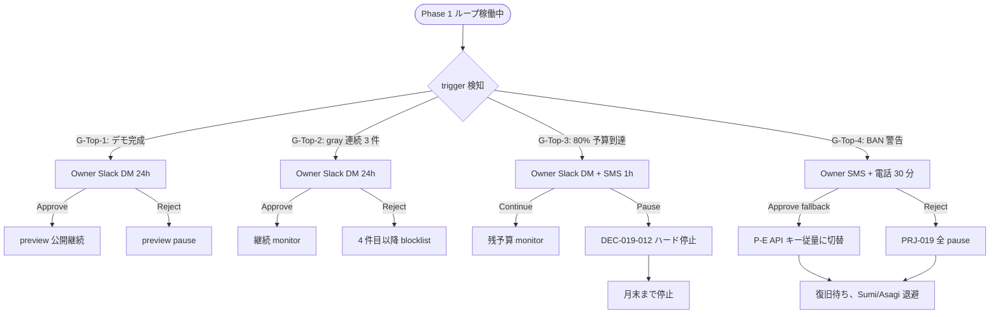
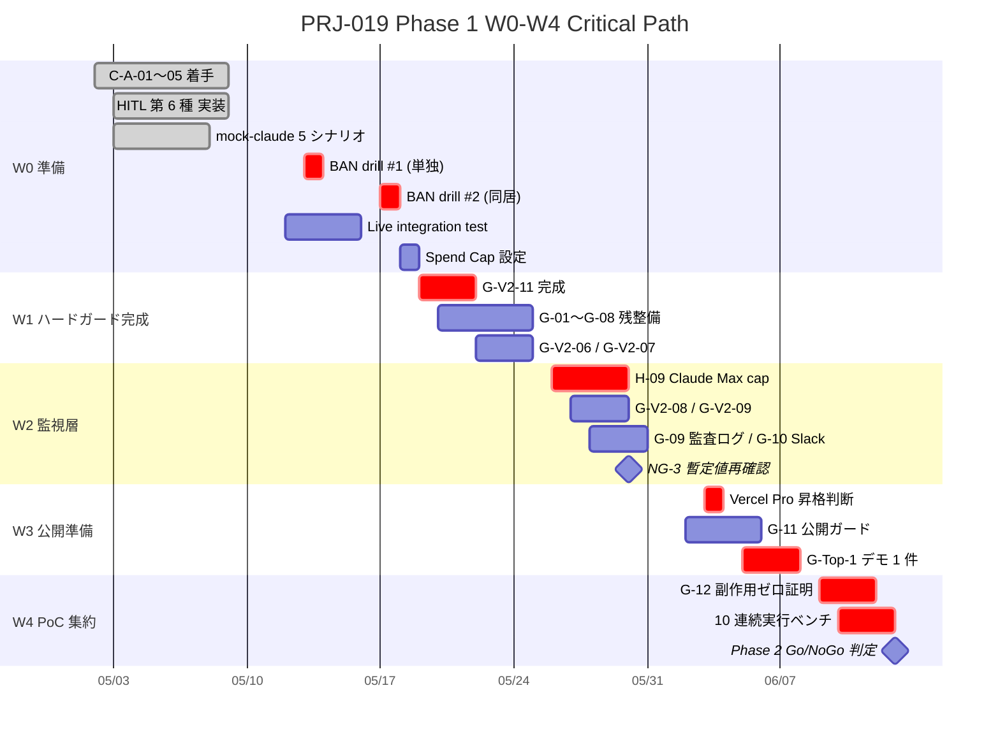

# PRJ-019 コスト & コントロール統合計画 v4 — H-09 / H-10 / Vercel 上方修正 / HITL 第 6 種 / G-Top-1〜4 完全反映版

- 案件: PRJ-019「Clawbridge（仮）」 — Open Claw を自律オーナーとする AI 組織ハーネス基盤
- 担当部署: PM 部門
- 作成日: 2026-05-03
- 作成者: PM Agent (claude-code-company)
- 版: **v4**（v3 = `pm-cost-plan-v3.md` を全置換、Phase 1 着手 5/19 前の最終確定版）
- 関連決裁:
  - DEC-019-007（Phase 1 強い条件付き Go、5/19〜6/13 4 週間）
  - DEC-019-009（ChatGPT Pro $200 既契約）
  - DEC-019-010（OpenAI ToS 条件付き許容）
  - DEC-019-011（Anthropic オプション A 採用）
  - DEC-019-012（月次予算 $300 ハードキャップ + Spend Cap 方針）
  - DEC-019-013（C-A-01〜05 オプション A 緩和策）
  - DEC-019-014（W0-Week1 3 部署成果承認）
  - **DEC-019-015**（H-09 Claude Max weekly cap 監視 / H-10 extra usage 課金 OFF を本書 v4 で正式組込）
  - **DEC-019-016**（Vercel Sandbox / Hosting Pro 上方修正を本書 v4 で正式組込）
  - **DEC-019-017**（Vercel Hobby→Pro 昇格判断 W3 中盤を本書 v4 で正式組込）
  - **DEC-019-018**（HITL 第 6 種 `tos_gray_review` / G-Top-1〜4 を本書 v4 で正式組込）
  - DEC-019-019（BAN drill #1 シナリオ承認）
  - DEC-019-020（mock-claude スタブ 5 シナリオ承認）
- 上位レポート:
  - PM v3 `pm-cost-plan-v3.md`（本書 v4 が全置換）
  - PM v2 `pm-architecture-v2-and-phase1-plan.md`（§5 のコスト章は本書 v4 を正とし v2 §5 は破棄継続）
  - Research `research-w0-supplement-op1-op5.md`（OP-1〜OP-5 一次裏取り完了、§7 PM v5 起案トリガー TR-1〜TR-3）
  - Review `review-tos-allowlist-dod-integration-v1.md`（HITL 第 6 種 + G-Top-1〜4 仕様策定元）
  - Dev `dev-w0-week2-prep-report.md`（HITL 第 6 種実装着手済、§3 / openclaw-runtime skeleton §4）
- v3 → v4 改訂理由:
  1. DEC-019-014〜020 連発に伴い v3 の必須コントロール 28 項目では新規 6 項目（H-09 / H-10 / HITL 第 6 種 / G-Top-1〜4）を吸収できない
  2. Research §4 が Vercel Sandbox 公式 pricing 再検証で v3 の中央値 $5 / 上限 $20 を「中央値 $20 / 上限 $46」に上方修正必要と確定
  3. v3 §A2.1 中央値 $13 / 上限 $73 は v4 で中央値 $33 / 上限 $93 に再計算必要
  4. Phase 1 着手 5/19 まで 16 日、5/8 検収会議までに本書 v4 確定が必要
  5. PM v5 起案トリガー TR-1〜TR-3 の確定が CEO 即決推奨事項として残存

---

## §0 200 字以内 サマリ

v4 で必須コントロールを v3 の 28 項目から **34 項目**へ拡張（H-09 Claude Max weekly cap 監視 / H-10 extra usage 課金 OFF / HITL 第 6 種 `tos_gray_review` / G-Top-1〜4 CEO 個別承認 4 種を追加発令、既存 1 件と統合し純増 6）。Phase 1 月次追加発生コストの中央値 $13 → **$33**、上限 $73 → **$93**（Vercel Sandbox $26 + Hosting Pro $20 上方修正反映）。月次ハードキャップ $300 は維持（DEC-019-012）。Phase 1 着手 5/19 確度は「強い条件付き Go」を継続。

---

## §1 v3 → v4 差分マトリクス

### §1.1 数値差分表

| 項目 | v3 | v4 | 増分 | 根拠 DEC |
|---|---|---|---|---|
| 必須コントロール総数 | 28 | **34** | **+6** | DEC-019-015 / DEC-019-018 |
| H-09 (Claude Max weekly cap 監視) | 未記載 | **新規** | +1 | DEC-019-015 |
| H-10 (extra usage 課金 OFF) | 未記載 | **新規** | +1 | DEC-019-015 |
| HITL 第 6 種 `tos_gray_review` | 5 種 | **6 種** | +1 | DEC-019-018 |
| G-Top-1〜4 (CEO 個別承認 4 種) | 未記載 | **新規 4 件** | +4 | DEC-019-018 |
| Vercel Sandbox 中央値 | $5/月 | **$20/月** | +$15 | DEC-019-016 |
| Vercel 上限ケース | $20/月 | **$46/月** | +$26 | DEC-019-016 |
| Phase 1 追加発生 中央値 | $13/月 | **$33/月** | +$20 | DEC-019-016 |
| Phase 1 追加発生 上限 | $73/月 | **$93/月** | +$20 | DEC-019-016 |
| 月次ハードキャップ | $300/月 | $300/月 | 0 | DEC-019-012 維持 |
| BAN drill 回数 | 2 回 | 2 回 | 0 | DEC-019-019 維持 |
| HITL 種別数 | 5 種 | **6 種** | +1 | DEC-019-018 |
| Vercel 昇格判断 | 未記載 | **W3 中盤公式タスク化** | +1 | DEC-019-017 |
| PM v5 起案トリガー | 未記載 | **TR-1/TR-2/TR-3 確定** | +3 | Research §7.2 |

### §1.2 コントロール体系差分の Mermaid（必須図 1/3）

```mermaid
flowchart LR
  subgraph V3["v3 必須コントロール 28"]
    G01_12["G-01〜G-12 (12)"]
    GV2["G-V2-01〜G-V2-11 (11)"]
    CA["C-A-01〜C-A-05 (5)"]
  end
  subgraph V4["v4 必須コントロール 34"]
    G01_12_v4["G-01〜G-12 (12)"]
    GV2_v4["G-V2-01〜G-V2-11 (11)"]
    CA_v4["C-A-01〜C-A-05 (5)"]
    H09["H-09 Claude Max weekly cap 監視 (新)"]
    H10["H-10 extra usage 課金 OFF (新)"]
    HITL6["HITL 第 6 種 tos_gray_review (新)"]
    GTOP["G-Top-1〜4 CEO 個別承認 (新)"]
  end
  V3 -->|DEC-019-015 / -018| V4
  H09 -.|Sumi/Asagi 同居の真ボトルネック| Note1[Research §3.3 / §7.2]
  HITL6 -.|24h timeout default reject| Note2[Dev W0-Week2 着手済]
  GTOP -.|Phase 1 デモ 1 件 / gray 連続 / 80% / BAN 警告| Note3[Review §4]
```

### §1.3 コスト差分の根拠（DEC-019-016 詳細）

- **Vercel Sandbox**: Research §4.1〜§4.5 が公式 pricing（vercel.com/docs/vercel-sandbox/pricing 2026-03-14 更新）を一次裏取り。中央値ケース（月 60 ループ × 10 分 × 2vCPU = 20 hr）で Hobby 5h CPU を 4 倍超過 = 課金 $26 想定。
- **Vercel Hosting Pro**: Next.js dev server で 45 分超のテスト要件発生時に Pro $20 が必要（DEC-019-017 W3 中盤判断）。
- **v4 上限ケース $93** = 控えめ $13（Hobby 内）+ Sandbox 課金 $26 + Hosting Pro $20 + 各種バッファ $34（DEC-019-012 内訳維持）。

---

## §2 必須コントロール 34 項目 一覧

### §2.1 区分定義

| 種別 | 略号 | 説明 |
|---|---|---|
| HardGuard | HG | コード / 設定で物理強制（ループ自動 pause / kill-switch 等） |
| Audit | AU | 監査ログ / Supabase append-only に記録、人手 review 可能 |
| HITL | HI | Human In The Loop（pending file → 人間承認待ち） |
| Drill | DR | 防災訓練（事前演習で SLA 確認） |
| Top-Decision | TD | CEO 個別承認（オーナー直接 review） |

### §2.2 表 A: 既存 G-01〜G-12（12 項目、DEC-019-007 由来）

| ID | 種別 | 着手期 | 担当 | DoD | 検証手段 |
|---|---|---|---|---|---|
| G-01 | HG | W0-W1 | Dev | FS allowlist `projects/PRJ-019/app/`配下のみ書込可 | unit test + verify-zero-side-effect.sh |
| G-02 | HG | W0-W1 | Dev | shell allowlist（rg / git read / pnpm 等のみ） | spawn 一覧テスト |
| G-03 | HG | W0-W2 | Dev | network allowlist（Anthropic / OpenAI / Vercel API のみ） | proxy log 監視 |
| G-04 | HG | W0-W1 | Dev | secret 隔離（OAuth トークン Doppler vault 経由のみ） | env scan + 1Password CLI |
| G-05 | HG | W0-W1 | Dev | HITL gate（5+1=6 種、§4 仕様参照） | hitl-gate.test.ts 11 ケース全緑 |
| G-06 | HG | W0-W1 | Dev | コストキャップ 4 層（session/project/day/month） | cost-tracker.test.ts 12 ケース |
| G-07 | HG | W0-W2 | Dev | wall-clock 上限（1 ループ 30 分） | timeout test |
| G-08 | HG | W0-W1 | Dev | kill-switch（Slack `/clawbridge stop` 即停止） | kill-switch.test.ts 8 ケース |
| G-09 | AU | W2 | Dev | Supabase 監査ログ append-only（90 日 retention） | row count + retention 設定 |
| G-10 | AU | W2 | Dev | Slack 通知（成功 / 失敗 / HITL pending） | webhook test |
| G-11 | HG | W3 | Dev | 公開ガード（preview deploy のみ、prod は HITL 必須） | deploy log 確認 |
| G-12 | AU | W4 | Dev | 副作用ゼロ証明（git status / Vercel deploy / Supabase 行 diff / Anthropic usage diff の 4 経路） | verify-zero-side-effect.sh 全緑 |

### §2.3 表 B: G-V2-01〜G-V2-11（11 項目、Review v2 由来）

| ID | 種別 | 着手期 | 担当 | DoD | 検証手段 |
|---|---|---|---|---|---|
| G-V2-01 | HG | W0 | Dev | OAuth トークン到達禁止（AppArmor / TCC） | 隔離テスト |
| G-V2-02 | HG | W1 | Dev | 5h ウィンドウ 70% 上限 | usage-monitor.test.ts |
| G-V2-03 | HG | W0-W1 | Dev | API キー直叩き禁止（Anthropic 直 SDK 排除） | grep + lint rule |
| G-V2-04 | HG | W1 | Dev | extra usage 課金禁止（H-10 と統合） | API key spend cap $0 |
| G-V2-05 | （撤回） | - | - | DEC-019-006 で撤回、オプション A 採用 | - |
| G-V2-06 | HG | W1 | Dev | rate jitter（並列開始時刻ばらし） | spawn jitter test |
| G-V2-07 | HG | W1 | Dev | 業務時間帯ウィンドウ（09:00〜23:00 JST） | scheduler test |
| G-V2-08 | AU | W2 | Dev | Anthropic 警告メール 1h 監視 | mail-watcher cron |
| G-V2-09 | HG | W2 | Dev | Boris Cherny 線（API 換算 $1,000 計算消費 80%/100%） | cost_check skill |
| G-V2-10 | AU | W1+ | Research | ToS 半年再評価（W1 進行中整備） | research log |
| G-V2-11 | HG | W0 | Dev | 1Password CLI で OAuth FS / env 隔離 | secret scan |

### §2.4 表 C: C-A-01〜C-A-05（5 項目、DEC-019-013 由来）

| ID | 種別 | 着手期 | 担当 | DoD | 検証手段 |
|---|---|---|---|---|---|
| C-A-01 | DR | W0 | Dev | Sumi/Asagi 作業データ完全バックアップ | git push + session export |
| C-A-02 | DR | W0 | Dev/Review | BAN 検知時の Sumi/Asagi 退避手順書 | 文書 + drill 立会 |
| C-A-03 | DR | W0 | Dev/Review | BAN drill 2 回（5/13 単独 + 5/17 同居） | drill ログ + 5 SLA 達成 |
| C-A-04 | AU | W0 | Dev | ChatGPT Pro / Claude Max 使用量モニタリング | daily export |
| C-A-05 | HG | W0 | Dev | OAuth トークン保管隔離（OS user / env / Doppler） | secret scan |

### §2.5 表 D: 新規 H-09 / H-10（2 項目、DEC-019-015 由来）

| ID | 種別 | 着手期 | 担当 | DoD | 検証手段 |
|---|---|---|---|---|---|
| **H-09** | HG | W2 | Dev | Claude Max weekly cap 監視（毎日 09:00 / 21:00 JST、80% 警告 / 95% 自動 pause） | cost_check skill 拡張 + Slack 通知ログ |
| **H-10** | HG | W0-W1 | Dev/Owner | extra usage 課金 Phase 1 原則 OFF（突発時 CEO 決裁で ON） | API key spend cap $0 設定スクリーンショット |

H-09 データソースは **DEC-019-021 候補で 5/14 確定**（Console scrape vs `/usage` parse の PoC 比較を 5/12-13 で実施）。

### §2.6 表 E: 新規 HITL 第 6 種 + G-Top-1〜4（5 項目、DEC-019-018 由来）

| ID | 種別 | 着手期 | 担当 | DoD | 検証手段 |
|---|---|---|---|---|---|
| **HITL-6** `tos_gray_review` | HI | W0-Week2 | Dev | 24h timeout default reject、blocklist 即拒否、dedup map、audit log | hitl-gate.test.ts +6 ケース全緑（Dev 報告済） |
| **G-Top-1** Phase 1 デモ 1 件公開 | TD | W3-W4 | Owner | CEO 個別承認（対象ジャンル / 公開先 / 公開時刻 / RTO 30 分） | 承認記録 + decision log |
| **G-Top-2** gray 連続 3 件昇格 | TD | W1〜 | Owner | 同一 category で連続 3 件 gray 判定時 CEO 個別 review | dedup map + 通知 |
| **G-Top-3** 月次予算 80% ($240) 到達 | TD | W2〜 | Owner | 即時 pause or 継続の CEO 個別承認 | cost-tracker alert |
| **G-Top-4** BAN 警告メール受領 | TD | W0〜 | Owner | API キー従量フォールバック発動の即時切替 CEO 承認 | mail-watcher trigger |

**合計 12 + 11 + 5 + 2 + 5 - 1（G-V2-05 撤回） = 34 項目**（v3 28 項目から純増 6）。

---

## §3 コスト計画 v4

### §3.1 月次予算ハードキャップ $300 内訳（DEC-019-012 維持）

| カテゴリ | 月額 | 性格 |
|---|---|---|
| Claude Max $200 既契約 | $0（追加発生ゼロ） | 既支払 |
| Codex Pro $200 既契約 | $0（追加発生ゼロ） | 既支払 |
| **追加発生分上限** | **$300** | **DEC-019-012 ハードキャップ** |
| 内訳: Doppler / Vercel / Sentry / GitHub Actions / Slack / SES / monitoring / バッファ | 合計 ≤ $300 | 月次トラッキング |

### §3.2 Phase 1 追加発生コスト試算（v4 上方修正後）

| シナリオ | Vercel | Doppler | GH Actions | Sentry | Slack | SES | OpenAI API (embeddings) | 1Password | バッファ | **合計** |
|---|---|---|---|---|---|---|---|---|---|---|
| **控えめ** (Hobby 内、月 30 ループ) | $0 | $0 | $0 | $0 | $0 | $0 | $5 | $3 | $5 | **$13** |
| **中央値** (月 60 ループ、Sandbox 課金開始) | **$20** | $0 | $0 | $0 | $0 | $0 | $5 | $3 | $5 | **$33** |
| **上限** (月 90 ループ + Hosting Pro) | **$46** ($26 + $20) | $0 | $0 | $0 | $0 | $0 | $20 | $8 | $19 | **$93** |

→ Phase 1 追加発生月額 **中央値 $33 / 上限 $93**、いずれも DEC-019-012 ハードキャップ $300 に対し **大幅余裕（中央値 11%、上限 31%）**。

### §3.3 4 層コストキャップ（既存維持、DEC-019-012）

| 層 | 上限 | 動作 |
|---|---|---|
| session | $5 | 即時 abort |
| project | $50 | warning + HITL |
| day | $30 | 翌日まで pause |
| month | $300 | ハード停止（G-Top-3 80% で CEO review） |

v4 で変更なし。

### §3.4 Vercel Hobby → Pro 昇格判断（DEC-019-017 維持、本書で公式タスク化）

- **判断時期**: W3 中盤（2026-06-03 頃）
- **判断者**: CEO 決裁（Dev 集計 → PM 提案 → CEO 承認）
- **判断材料**:
  1. W1〜W2 の Sandbox CPU 実消費（毎週末 Dev 集計報告）
  2. Hobby 5h CPU 月次に対する消費率 70% 超過時に Pro 昇格
  3. 同時実行 10 個 / 最大 45 分ランタイムへの抵触履歴
- **昇格時の追加コスト**: $20/月（Hosting Pro）+ Sandbox 課金 $26（上限ケース）
- **未昇格時**: W3 末まで Hobby 継続も可

### §3.5 Spend Cap 設定（DEC-019-012 維持）

| プロバイダ | Hard | Soft | Per-request |
|---|---|---|---|
| Anthropic（API キーフォールバック発動時） | $50/月 | $40/月 | $0.50 |
| OpenAI（バッファ） | $20/月 | $15/月 | $0.30 |
| Vercel | （Hobby 自動 throttle）→ Pro 昇格時 $80/月 | - | - |

---

## §4 HITL 第 6 種 `tos_gray_review` 仕様

DEC-019-018 既決、Dev W0-Week2 着手済（`dev-w0-week2-prep-report.md` §3）。

### §4.1 trigger 条件

- ジャンル分類器（claude-bridge or orchestrator）で `confidence ∈ [0.5, 0.85]` 判定時
- whitelist confidence ≥ 0.85 → 自動 preview deploy
- blocklist hit → 即拒否（cost-tracker rollback）

### §4.2 payload zod schema

```ts
TosGrayReviewPayload = z.object({
  category: z.string().min(1).max(100),
  subcategory: z.string().min(1).max(100),
  confidence: z.number().min(0).max(1),       // 0.5〜0.85 範囲想定
  rationale: z.string().min(20).max(2000),
  need_summary: z.string().min(1).max(2000),
  need_id: z.string().min(1).max(200),
  blocklist_hits: z.array(z.string()).default([]),
})
```

### §4.3 動作

| ステップ | 動作 |
|---|---|
| 1. payload 検証 | zod safeParse、失敗 → throw |
| 2. blocklist チェック | `blocklist_hits.length > 0` → 即 `tos_gray_blocklist_hit` 拒否（人間 polling 不要） |
| 3. dedup map 確認 | 30 日内同一 `need_id` は最初の決定結果を共有 |
| 4. pending file 生成 | `pendingDir/audit-tos-gray.json` に append |
| 5. Slack 通知 | G-Top-2 連続 3 件監視も同時動作 |
| 6. 24h timeout | default reject = `tos_gray_timeout` |
| 7. 人間 reject | `tos_gray_human_reject` |
| 8. 人間 approved | `'approved'` |
| 9. audit log append | `audit/hitl-tos-gray-{date}.jsonl` |

### §4.4 rejection_reason 種別

`HitlRejectionReason = 'timeout' | 'rejected' | 'approved' | 'tos_gray_timeout' | 'tos_gray_human_reject' | 'tos_gray_blocklist_hit'`

### §4.5 dev 実装状況（dev-w0-week2-prep-report.md §3）

- `app/harness/src/hitl-gate.ts` 拡張完了
- `hitl-gate.test.ts` 5 → 11 ケース全緑（+6 ケース）
- `tos_gray_blocklist_hit` 明示テストは W0-Week2 中盤で追加予定

---

## §5 G-Top-1〜4 CEO 個別承認運用ルール

### §5.1 各ルートの運用テンプレート

| ID | 名称 | trigger | 通知先 | 期限 | 受容判断材料 | 不承認時動作 |
|---|---|---|---|---|---|---|
| **G-Top-1** | Phase 1 デモ 1 件公開 | W3-W4 で 1 件目の preview deploy 完成 | Owner Slack DM + Email | 24h | 対象ジャンル / 公開先 / 公開時刻 / RTO 30 分 / TTL（自動取下時刻） | preview pause、再 review 待ち |
| **G-Top-2** | gray 連続 3 件昇格 | 同一 category で連続 3 件 `tos_gray_review` 判定 | Owner Slack DM | 24h | 3 件の rationale / 共通 subcategory / classifier ログ | 4 件目は強制 blocklist 扱い |
| **G-Top-3** | 月次予算 80% 到達 | cost-tracker month $240 超過 | Owner Slack DM + SMS | 1h | 残予算 / 月末予測 / 主要消費先 | 即時 pause（DEC-019-012 ハード停止） |
| **G-Top-4** | BAN 警告メール受領 | mail-watcher が Anthropic / OpenAI 警告検知 | Owner SMS + 電話 | 30 分 | メール本文 / 検知時刻 / 影響範囲 | 即 P-E API キー従量フォールバック発動、PRJ-019 全 pause |

### §5.2 G-Top フローの Mermaid（必須図 2/3）



### §5.3 G-Top-1 デモ公開ジャンル選定（DEC-019-022 候補）

- 5/8 検収会議で議題追加、CEO が **Phase 1 デモ 1 件のジャンル** を確定
- whitelist 確実通過 + 過去案件競合なし + 公開時 PR 価値あり、の 3 条件
- 候補例: 個人開発者向け Code Snippet サービス / OSS dependency dashboard / Markdown blog generator など（5/8 で詳細議論）

---

## §6 Critical Path 分析

### §6.1 W0-W4 主要マイルストーン

| 期 | 期間 | 主要タスク | クリティカル経路 |
|---|---|---|---|
| **W0** | 2026-05-02〜05-18 | C-A-01〜05 / HITL 第 6 種 / mock-claude / BAN drill #1 (5/13) / drill #2 (5/17) / Live integration / 副作用ゼロ確認 / Spend Cap 設定 | HITL 6 → mock-claude → BAN drill #1 → Live integration → Spend Cap |
| **W1** | 2026-05-19〜05-25 | G-V2-11 完成 / G-01〜G-08 残整備 / G-V2-06 / G-V2-07 / G-Top-2 監視 | G-V2-11 → G-08 統合 → G-Top-2 連続検知 |
| **W2** | 2026-05-26〜06-01 | 監視層 (G-V2-08 / G-V2-09 / **H-09**) / tos_monitor / changelog monitor / G-09 監査ログ / G-10 Slack | H-09 → G-V2-09 統合 → 5/30 NG-3 暫定値再確認（DEC-019-008） |
| **W3** | 2026-06-02〜06-08 | G-11 公開ガード / Vercel Pro 昇格判断（6/3 中盤、DEC-019-017）/ G-Top-1 デモ 1 件 | Vercel 昇格判断 → G-11 → G-Top-1 デモ |
| **W4** | 2026-06-09〜06-13 | G-12 副作用ゼロ証明 / 10 連続実行 / Phase 2 Go/NoGo 判定 | G-12 → 10 連続 → 6/13 Phase 2 Go |

### §6.2 ガントチャート Mermaid（必須図 3/3、簡易版）



### §6.3 リスク分岐点

| 分岐点 | 発生時の影響 | 対応 |
|---|---|---|
| 5/13 BAN drill #1 Fail | Phase 1 着手 1 週間延期 | TR-1 発火 → PM v5 起案 |
| 5/17 BAN drill #2 Fail | オプション A 撤回検討 | TR-1 発火 → DEC-019-011 再評価 |
| 5/30 NG-3 暫定値再確認 NG | DEC-019-008 改訂 | TR-2 発火 → PM v5 起案 |
| 6/3 Vercel 消費率 70% 超 | Pro 昇格決裁 | DEC-019-017 公式手順発動 |
| 6/13 Phase 2 Go 判定 NG | Phase 1 延長 or 撤退 | TR-3 発火 → PM v5 起案 |

---

## §7 PM v5 起案トリガー条件 TR-1〜TR-3

Research §7.2 と完全整合。

### §7.1 TR-1: BAN drill 失敗トリガー

| 項目 | 内容 |
|---|---|
| **発火条件** | 2026-05-13 BAN drill #1 で 5 SLA のうち 1 つでも違反 |
| **PM v5 起案期日** | 5/14 24:00 JST |
| **内容変更スコープ** | ① drill 再実施計画 / ② オプション A 継続可否再評価 / ③ Phase 1 着手日延期判断（5/19 → 5/26 等） |
| **責任者** | PM Agent + Dev / Review 部門 |

### §7.2 TR-2: NG-3 暫定値再確認結果トリガー

| 項目 | 内容 |
|---|---|
| **発火条件** | 2026-05-30 W2 終了時に DEC-019-008 暫定値（12h/日 / API 換算 $1,000）の運用実績がベースライン乖離 ±20% 超 |
| **PM v5 起案期日** | 5/31 24:00 JST |
| **内容変更スコープ** | ① 暫定値の上下調整 / ② G-V2-09 閾値の調整 / ③ ピーク時間帯回避ルールの強化 |
| **責任者** | PM Agent + Research 部門 |

### §7.3 TR-3: Phase 2 Go 判定トリガー

| 項目 | 内容 |
|---|---|
| **発火条件** | 2026-06-13 Phase 1 完了時の Phase 2 Go/NoGo 判定が「NoGo」または「条件付き Go」 |
| **PM v5 起案期日** | 6/14 24:00 JST |
| **内容変更スコープ** | ① Phase 1 延長計画 / ② 撤退判断（プロジェクト中止）/ ③ Phase 2 着手前提条件の再策定（並列度 / 予算枠 / 必須コントロール追加） |
| **責任者** | PM Agent + CEO + Owner |

---

## §8 リスク再評価表（PM 視点、Research §4 と整合）

### §8.1 既存リスク R-019-06〜R-019-12 の更新

| ID | リスク | v3 評価 | v4 評価 | 変動理由 |
|---|---|---|---|---|
| R-019-06 | Vercel Sandbox 従量超過 | 黄 (M / +$20-$80) | **黄維持** (M / +$26-$46) | 上限ケースの試算精緻化（DEC-019-016） |
| R-019-07 | Sentry / Supabase 早期昇格必要 | 黄 (L / +$26-$50) | 黄維持 | 変動なし |
| R-019-08 | OpenAI embeddings 想定超過 | 黄 (L / +$15-$30) | 黄維持 | 変動なし |
| R-019-09 | API キーフォールバック発動 | 赤 (M / +$30-$50) | **赤維持** | G-Top-4 で発動条件明確化 |
| R-019-10 | BAN 巻き添え Sumi/Asagi 停止損失 | 赤 (L-M / ¥500k-¥2M) | **赤維持** | drill #2 で確認、C-A-02 / -03 整備中 |
| R-019-11 | サブスク値上げ | 黄 (L 半年内 / +$50-$100) | 黄維持 | 変動なし |
| **R-019-12** | OpenClaw 上流変更追従 | 黄 | **A/B 分割** | Dev §4.4 で本体 OSS は personal AI 化判明 |

### §8.2 R-019-12 A/B 分割（本書で正式登録）

| ID | 内容 | 色 | 確率 | 影響 | 緩和策 |
|---|---|---|---|---|---|
| **R-019-12-A** | OpenClaw 本体 OSS が personal AI assistant 化（claude-code-company 連携機能の縮退） | **赤** | M-H | 連携プラグイン Enderfga/openclaw-claude-code への依存度上昇、本体機能を直接利用できなくなる可能性 | parts only 利用方針継続、fork 不要、月次 WebFetch 監視（CB-D-W0-04） |
| **R-019-12-B** | Enderfga/openclaw-claude-code v2.14.1 の skill schema 変更 | **黄** | L-M | adapter 層改修必要、Phase 2 工数 +1〜2 週 | vendor/ 配下に固定 version clone、月次更新確認 |

dashboard 反映は秘書部門に依頼（本書で正式登録、`dashboard/active-projects.md` PRJ-019 リスク行追加）。

### §8.3 新規リスク R-019-13（H-09 関連）

| ID | 内容 | 色 | 確率 | 影響 | 緩和策 |
|---|---|---|---|---|---|
| R-019-13 | Claude Max weekly cap データソース不安定（Console scrape DOM 変更 / `/usage` parse format 変更） | 黄 | M | H-09 監視抜け、Sumi/Asagi 巻き添え検知遅延 | DEC-019-021 候補で 5/14 までに dual-source 設計、月次 schema 検証 |

---

## §9 結論と CEO 即決推奨

### §9.1 即決推奨 4 件（DEC-019-021〜024 候補）

| 候補 ID | 内容 | 期日 | 責任者 | 次回更新 |
|---|---|---|---|---|
| **DEC-019-021** | H-09 データソース選定運用枠（Console scrape vs `/usage` parse） | PoC 5/12 / PM 提案 5/13 / **CEO 決裁 5/14** | Dev / Research / PM | W2 終了時 5/30 |
| **DEC-019-022** | G-Top-1 Phase 1 デモ 1 件 ジャンル選定 | **5/8 検収会議で議題追加**、5/15 までに CEO 確定 | Owner / CEO / Marketing | W3 中盤 6/3 |
| **DEC-019-023** | PM v5 起案トリガー TR-1/TR-2/TR-3 確定（本書 §7） | **5/8 検収会議で承認** | PM | TR-1/TR-2/TR-3 発火時 |
| **DEC-019-024** | Vercel Hobby → Pro 昇格判断枠（W3 中盤 6/3）公式タスク化 | **5/8 検収会議で承認** | Dev / PM / CEO | W3 中盤 6/3 当日 |

### §9.2 結論

- **Phase 1 着手 5/19 確度**: 「強い条件付き Go」継続（DEC-019-007 / DEC-019-014 の条件すべて維持）
- **Phase 1 追加発生月額**: 中央値 $33 / 上限 $93、DEC-019-012 ハードキャップ $300 に対し **大幅余裕**（中央値 11%、上限 31%）
- **既契約 $400 込み総月額**: 中央値 $433 / 上限 $493
- **必須コントロール**: 34 項目中 **W0 着手前クリア = 27 項目 / W0-Week2 整備 = 4 項目（HITL 第 6 種完了済 / H-10 / C-A-04 / C-A-05）/ W1 整備 = 3 項目（H-09 / G-Top-1 / G-Top-2）**
- **CEO 即決推奨 4 件**を 5/8 検収会議で承認し、Phase 1 着手 5/19 を予定通り実施可能

### §9.3 オープン論点（次版 v5 で解消）

- H-09 データソース最終確定（DEC-019-021）
- G-Top-1 デモ 1 件ジャンル確定（DEC-019-022）
- Phase 2 Go/NoGo 判定後の v5 起案（TR-3 発火時）
- Phase 3 着手前のコスト計画 v6 策定（既存方針継続）

---

**v4 確定**: 2026-05-03
**前版**: `pm-cost-plan-v3.md`（v3、2026-05-03、本書で全置換）
**次回更新**: ① 5/8 検収会議承認後の修正反映 ② 5/14 DEC-019-021 確定後 ③ TR-1/TR-2/TR-3 発火時の v5 起案
**承認経路**: PM v4 起案 → CEO 5/8 検収会議承認 → 秘書 dashboard 反映 → Dev / Review / Research 全部署共有
