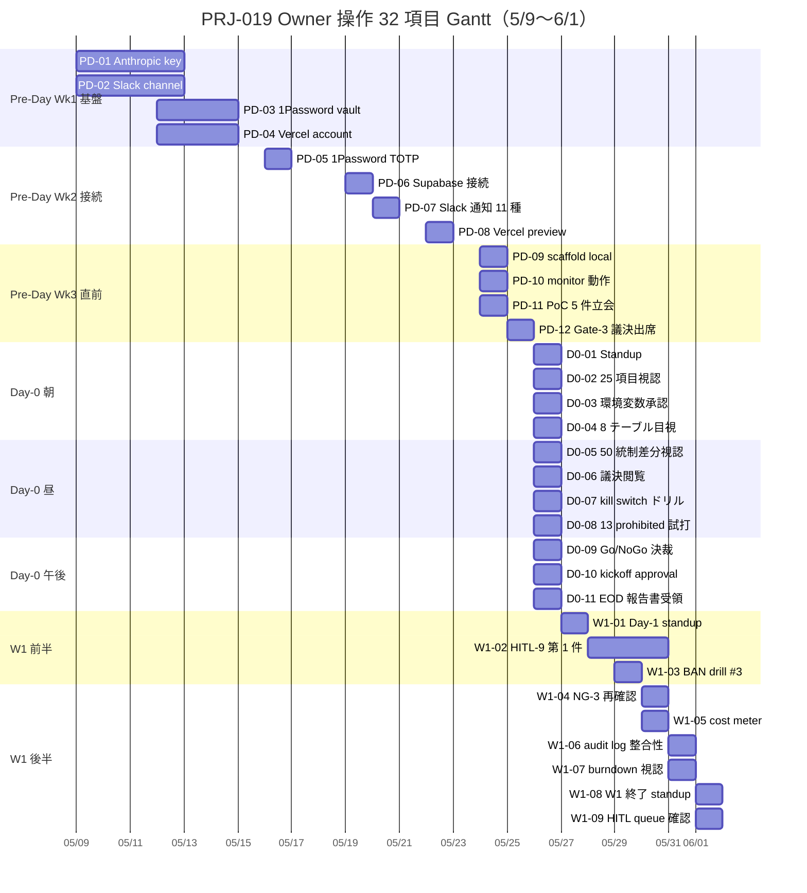

最終更新: 2026-05-03 / 起案: PM 部門 / 対象: Owner

# PRJ-019 Clawbridge — Day-0 (5/26) Owner 操作 詳細 Checklist v2

- 案件: PRJ-019「Clawbridge」
- 担当: PM 部門
- 版: v2.0（v1 = `pm-phase1-day0-readiness-checklist.md` §4 「Owner 3 操作 / 2.1h」を **30+ 項目 / 詳細粒度** に展開）
- 目的: Owner 並行作業 トラッキング起点の確立。Pre-Day（5/9〜5/25）+ Day-0 当日（5/26）+ W1 期間（5/27〜6/1）の 3 区間でカバー
- 関連: `pm-phase1-day0-readiness-checklist.md`、`pm-conditional-go-tracker.md`、`dev-w1-prefetch-hitl-dashboard-permissions.md`、`secretary-58-dev-demo-script.md`、DEC-019-031〜033（4 層防御 / 13 prohibited domains / kill switch）
- 区分凡例: **[Solo]** = Owner 単独実施可 / **[Dev同席]** = Dev リード同席必須 / **[UI Only]** = Owner UI 操作のみ（Dev 事前準備済）

---

## §0 本書の位置付け

v1 では Day-0 当日のみの 3 操作（議決確認 / 環境変数承認 / kill switch 動作確認 / 計 2.1h）に集約していたが、Owner が並行作業を進めるためには:

1. **Pre-Day（5/9〜5/25）期間中の段階的セットアップ**（secret 登録 / Slack 受信テスト / scaffold local 起動 等）
2. **5/26 当日の連続 6h 操作**（朝 standup → kickoff approval → 各種承認 → 8 テーブル目視 → kill switch ドリル → EOD 報告受領）
3. **W1（5/27〜6/1）の HITL-9 / 監査ログ / コストメーター運用**

の 3 区間を 30 項目以上に粒度展開し、各項目に **担当 / 想定時間 / 完了条件 / 失敗時 escalation / SLA** を明記する必要がある。本書がそのトラッキング起点となる。

### 30+ 項目 区間別構成

| 区間 | 項目数 | 期間 | 想定 Owner 工数 |
|---|---|---|---|
| §1 Pre-Day（5/9〜5/25 17 日間） | 12 項目 | 17 日 | 4.5h |
| §2 Day-0 当日（5/26） | 11 項目 | 1 日 | 3.8h |
| §3 W1 期間（5/27〜6/1） | 9 項目 | 6 日 | 3.5h |
| **計** | **32 項目** | **24 日** | **11.8h（≒週次 10h × 1 週分 + バッファ）** |

→ Owner 工数は **DEC-019-033「Owner-in-the-loop」現実性確保 = 週次 10h cap** に対し、6 日週で 3.5h、Day-0 集中日 3.8h、Pre-Day 17 日で 4.5h（日割り 0.27h）と分散配置済。最大集中は 5/26 のみで他は週次 cap 内に収まる。

---

## §1 Pre-Day 期間（5/9〜5/25、17 日間）の Owner 操作 12 項目

### §1.1 Week 1 (5/9〜5/15) — 基盤セットアップ

| # | 項目 | 想定時間 | 担当区分 | 完了条件 | 失敗時 escalation | SLA |
|---|---|---|---|---|---|---|
| **PD-01** | Anthropic API key 発行 + Owner 用主アカウント整備（提案生成用 + 実装用 2 系統） | 30 分 | [Solo] | console.anthropic.com で 2 key 発行済 + 月次 cap $500 設定 | Anthropic Sales Slack DM CEO 経由 / 24h で代替案 | 5/12 EOD |
| **PD-02** | Slack workspace への #prj-019-owner channel 参加 + 通知設定 ON | 15 分 | [Solo] | mention all + DM 受信 ON / mobile push ON | PM Slack admin 1h 内対応 | 5/12 EOD |
| **PD-03** | 1Password Family / Business plan 加入確認 + Owner vault 作成 | 30 分 | [Solo] | 1Password vault `prj-019-owner` 作成済 + recovery key 別保管 | 1Password サポート / Bitwarden fallback 検討 | 5/14 EOD |
| **PD-04** | Vercel Hobby plan アカウント整備 + GitHub repo 連携承認 | 20 分 | [Solo] | vercel.com login + improver-jp/clawbridge import | Vercel サポート 24h / Netlify fallback 検討 | 5/14 EOD |

### §1.2 Week 2 (5/16〜5/22) — 接続テスト

| # | 項目 | 想定時間 | 担当区分 | 完了条件 | 失敗時 escalation | SLA |
|---|---|---|---|---|---|---|
| **PD-05** | 1Password TOTP 設定（P-UI-01 連動、5/16 土曜実施） | 30 分 | [Dev同席] | TOTP test login pass + bypass 5 試行 fail 確認 | Dev リードが remote zoom で 1h 内サポート | 5/16 EOD |
| **PD-06** | Supabase project 接続テスト（preview env, 8 テーブル閲覧権限） | 20 分 | [Dev同席] | supabase dashboard で 8 テーブル一覧 + RLS Enabled 視認 | Dev リード CEO 経由 24h escalation | 5/19 EOD |
| **PD-07** | Slack 通知受信テスト（HITL Gate 11 種、test webhook 11 通） | 30 分 | [UI Only] | 11 通受信 + DM 開封 + ack 押下 11/11 | Dev webhook 修正 4h 内 / SES fallback | 5/20 EOD |
| **PD-08** | Vercel preview deploy 視認（Hobby、SSE 動作確認） | 20 分 | [Dev同席] | preview URL 200 OK + dashboard 6 区画表示 + SSE refresh 動作 | Dev リード preview 再 deploy / Hobby plan 容量枯渇なら Pro 検討前倒し | 5/22 EOD |

### §1.3 Week 3 (5/23〜5/25) — 直前確認

| # | 項目 | 想定時間 | 担当区分 | 完了条件 | 失敗時 escalation | SLA |
|---|---|---|---|---|---|---|
| **PD-09** | scaffold local 起動確認（`pnpm --filter web dev`、Owner マシン） | 30 分 | [Dev同席] | localhost:3000 表示 + dashboard / permissions / hitl 3 page 動作 | Dev リード remote pair 2h 内 / Codespaces fallback | 5/24 EOD |
| **PD-10** | monitor 動作確認（cost-tracker / kill switch SSE / Realtime） | 20 分 | [Dev同席] | cost-meter 進捗 bar 動作 + kill switch propagation < 1 sec 視認 | Dev リード mock-claude で再現 1h | 5/24 EOD |
| **PD-11** | 5/24 日曜 PoC 5 件立会準備（PREP-10 / 1.0h 工数） | 60 分 | [Dev同席] | 5 件 PoC scenario 事前読込 + Q 抜粋済 | PM が代理立会 / 議事録回送 | 5/25 朝 |
| **PD-12** | 5/25 Pre-Phase Go/NoGo 議決出席（最終 Gate-3、CEO 立会） | 30 分 | [Dev同席] | tracker §7 全 GREEN 視認 + Owner YES 表明 | NoGo 時 fallback-A 6/2 延期発動 | 5/25 17:00 |

### §1.4 §1 集計

| 区分 | 項目数 | 工数合計 |
|---|---|---|
| [Solo] | 4 | 1.6h |
| [UI Only] | 1 | 0.5h |
| [Dev同席] | 7 | 2.4h |
| **§1 計** | **12** | **4.5h** |

---

## §2 Day-0 当日（5/26 月）の Owner 操作 11 項目

### §2.1 朝（09:00〜12:00）

| # | 項目 | 想定時間 | 担当区分 | 完了条件 | 失敗時 escalation | SLA |
|---|---|---|---|---|---|---|
| **D0-01** | 09:00 Daily standup 参加（Day-0 readiness 確認、30 分） | 30 分 | [Dev同席] | 全部門リード出席確認 + 25 項目 readiness 一斉宣言聴取 | PM が要点議事録 15 分内回送、Owner 後刻 ack | 09:30 |
| **D0-02** | 09:30 25 項目 readiness checklist 進捗 dashboard 視認 | 15 分 | [UI Only] | dashboard で 25/25 GO 確認（Dev 8 / Research 4 / PM 4 / Mkt 4 / Review 5） | < 23 GO 時 PM が C 重大ブロック判定起票 | 09:45 |
| **D0-03** | 10:00 環境変数承認（Anthropic API / Slack webhook / Supabase service_role / cost cap 4 系統） | 45 分 | [Dev同席] | Vercel env 5 件登録 + Owner 承認サイン（Slack ack） | Dev リード即時修正 / 1h 内再承認可 | 10:45 |
| **D0-04** | 11:00 Supabase 8 テーブル目視確認（hitl_requests / audit_log / policy_versions / policy_audit_log / proposals / cost_ledger / runtime_wrapper_state / knowledge_extraction_queue） | 30 分 | [Dev同席] | 8 テーブル存在 + RLS Enabled + Owner-only insert 視認 | Dev migration 再実行 1h 内 / fallback PostgreSQL ローカル | 11:30 |

### §2.2 昼（12:00〜14:30）

| # | 項目 | 想定時間 | 担当区分 | 完了条件 | 失敗時 escalation | SLA |
|---|---|---|---|---|---|---|
| **D0-05** | 12:00 50 統制 Day-0 ステータス予測 vs 実績差分 視認（Day-0 必達 35 / 後対応 15） | 20 分 | [UI Only] | 35 必達中 ≥ 33 完成 確認 / 差分 ≤ 2 | < 33 完成 → §6 fallback B 24h roll-forward 起動 | 12:30 |
| **D0-06** | 12:30 議決-7 採決結果 + Conditional Go 3 条件達成宣言 閲覧 | 15 分 | [Solo] | decisions.md DEC-019-XXX 起票 + tracker 全 GREEN | C-1/C-2/C-3 欠落 → fallback-A 6/2 延期 | 12:45 |
| **D0-07** | 13:00 kill switch 動作確認（UI 押下 → propagation < 1 sec → audit log 記録 → 解除復帰） | 30 分 | [Dev同席] | < 1 sec で全 spawn 停止 + hash chain 整合維持 + 解除後 spawn 再開 E2E pass | EM 不達 → D 致命的ブロック → 即時 stop + 緊急判断 | 13:30 |
| **D0-08** | 13:30 13 prohibited domains deny envelope 1 件 試打（mock-claude、Casbin 評価） | 20 分 | [Dev同席] | 13 ドメイン全件 deny + Owner override 不可 確認 | Casbin policy 修正 1h 内 / 不達なら Day-0 NoGo | 13:50 |

### §2.3 午後（14:00〜18:00）

| # | 項目 | 想定時間 | 担当区分 | 完了条件 | 失敗時 escalation | SLA |
|---|---|---|---|---|---|---|
| **D0-09** | 14:00 Day-0 Go/NoGo 決裁立会（CEO 決裁、Owner YES/NO 表明） | 30 分 | [Dev同席] | CEO 決裁書 + Owner Slack DM「Day-0 GO」明示 | NoGo → fallback-A 6/2 / D パターンなら緊急 SOP | 14:30 |
| **D0-10** | 14:30 W1-01 G-V2-11 着手宣言の Owner ack（kickoff approval） | 15 分 | [UI Only] | hitl-gate.ts dev_kickoff_approval 第 0 件 approve（dummy or 実在） | 24h SLA timer 起動失敗 → Dev 即時修正 1h | 14:45 |
| **D0-11** | 17:00 Day-0 EOD 報告書受領（Slack DM + メール CC） | 30 分 | [Solo] | 報告書 8 セクション読了 + Owner ack 翌朝までに | 19:00 までに ack 不達 → PM が朝 reminder 自動送 | 翌 09:00 |

### §2.4 §2 集計

| 区分 | 項目数 | 工数合計 |
|---|---|---|
| [Solo] | 2 | 0.75h |
| [UI Only] | 3 | 1.0h |
| [Dev同席] | 6 | 2.05h |
| **§2 計** | **11** | **3.8h** |

---

## §3 W1 期間（5/27〜6/1、6 日間）の Owner 操作 9 項目

### §3.1 W1 前半（5/27〜5/29）

| # | 項目 | 想定時間 | 担当区分 | 完了条件 | 失敗時 escalation | SLA |
|---|---|---|---|---|---|---|
| **W1-01** | 5/27 Day-1 朝 standup 参加（C-1 完成最終確認 + W1-01 着手） | 15 分 | [UI Only] | 標準 standup 5 分 + Q1 件 | 不在時 PM 議事録代理回送 | 09:15 |
| **W1-02** | 5/28 提案 1 件目 (W1-03) HITL-9 dev_kickoff_approval Owner 承認操作 | 30 分 | [Dev同席] | proposal-1 payload 7 項目読了 + approve 押下 + audit log entry 確認 | 72h SLA cap 内承認 / 不達時 default 棄却 + PM 起票 | 5/31 09:00（72h） |
| **W1-03** | 5/29 09:00 BAN drill #3 立会（任意、推奨参加） | 60 分 | [Dev同席] | 攻撃 5 種 / 観測 4 経路 / 12 時 EOD レポート視認 | 不参加でもレポート 18:00 自動配信 | 5/29 12:00 |

### §3.2 W1 後半（5/30〜6/1）

| # | 項目 | 想定時間 | 担当区分 | 完了条件 | 失敗時 escalation | SLA |
|---|---|---|---|---|---|---|
| **W1-04** | 5/30 NG-3 暫定値（$1,200/月）再確認会議参加 | 45 分 | [Dev同席] | DEC-019-031 §② 上方修正候補 採否表明 | 不在時 CEO + Research が代理判定 / 議事録回送 | 5/30 17:00 |
| **W1-05** | 5/30 cost meter 確認（4 層 cap session $5 / project $50 / day $30 / month $300） | 15 分 | [UI Only] | cost-meter dashboard で 4 系統消費率視認 + 警戒 80% 未満 | > 80% 時 PM 即時 escalation + cap 一時上方修正検討 | 5/30 18:00 |
| **W1-06** | 5/31 audit log 1 週分 整合性確認（hash chain verifier daily 03:00 JST batch 結果） | 20 分 | [UI Only] | 7 日分 verifier green 確認 + 改ざん検知 0 件 | chain broken 検知 → 即時 PM + Review escalation / drill 再実施 | 5/31 18:00 |
| **W1-07** | 5/31 W1 EOD burndown 視認（W1 完了 6/1 へのスライド有無） | 15 分 | [UI Only] | 22 タスク中 W1 担当 6 件の進捗率 ≥ 80% | < 80% 時 fallback-B 6/2 着手 W2 圧縮検討 | 5/31 18:00 |
| **W1-08** | 6/1 W1 終了 standup 参加 + W2 着手 ack | 30 分 | [Dev同席] | W2-01 着手 ack + W1 EOD 報告受領 | 不在時 PM 議事録 + Owner 翌朝 ack | 6/1 18:00 |
| **W1-09** | 6/1 EOD HITL-9 / HITL-10 滞留 dashboard 確認（dispatcher queue 5 件以下） | 15 分 | [UI Only] | hitl-queue 滞留 ≤ 5 件 + 全件 SLA 内 | > 5 件 → PM 即時 escalation + Owner 緊急承認バッチ | 6/1 19:00 |

### §3.3 §3 集計

| 区分 | 項目数 | 工数合計 |
|---|---|---|
| [UI Only] | 5 | 1.3h |
| [Dev同席] | 4 | 2.25h |
| **§3 計** | **9** | **3.55h** |

---

## §4 進捗管理 Mermaid Gantt + チェックボックス

### §4.1 Gantt 全体図（Pre-Day + Day-0 + W1）

### §4.2 進捗チェックボックス（Owner 自記入用）

#### Pre-Day（12 項目）

- [ ] PD-01 Anthropic API key 発行（30 分 / Solo / 5/12 EOD）
- [ ] PD-02 Slack #prj-019-owner 参加（15 分 / Solo / 5/12 EOD）
- [ ] PD-03 1Password vault 作成（30 分 / Solo / 5/14 EOD）
- [ ] PD-04 Vercel Hobby + GitHub 連携（20 分 / Solo / 5/14 EOD）
- [ ] PD-05 1Password TOTP 設定（30 分 / Dev同席 / 5/16 EOD）
- [ ] PD-06 Supabase 8 テーブル接続テスト（20 分 / Dev同席 / 5/19 EOD）
- [ ] PD-07 Slack 通知 11 種受信テスト（30 分 / UI Only / 5/20 EOD）
- [ ] PD-08 Vercel preview deploy 視認（20 分 / Dev同席 / 5/22 EOD）
- [ ] PD-09 scaffold local 起動（30 分 / Dev同席 / 5/24 EOD）
- [ ] PD-10 monitor 動作確認（20 分 / Dev同席 / 5/24 EOD）
- [ ] PD-11 PoC 5 件立会準備（60 分 / Dev同席 / 5/25 朝）
- [ ] PD-12 Gate-3 議決出席（30 分 / Dev同席 / 5/25 17:00）

#### Day-0 当日（11 項目）

- [ ] D0-01 09:00 Standup（30 分 / Dev同席）
- [ ] D0-02 09:30 25 項目視認（15 分 / UI Only）
- [ ] D0-03 10:00 環境変数承認（45 分 / Dev同席）
- [ ] D0-04 11:00 Supabase 8 テーブル目視（30 分 / Dev同席）
- [ ] D0-05 12:00 50 統制 vs 実績視認（20 分 / UI Only）
- [ ] D0-06 12:30 議決閲覧（15 分 / Solo）
- [ ] D0-07 13:00 kill switch ドリル（30 分 / Dev同席）
- [ ] D0-08 13:30 13 prohibited 試打（20 分 / Dev同席）
- [ ] D0-09 14:00 Go/NoGo 決裁立会（30 分 / Dev同席）
- [ ] D0-10 14:30 kickoff approval ack（15 分 / UI Only）
- [ ] D0-11 17:00 EOD 報告書受領（30 分 / Solo）

#### W1 期間（9 項目）

- [ ] W1-01 5/27 Day-1 standup（15 分 / UI Only）
- [ ] W1-02 5/28 HITL-9 第 1 件承認（30 分 / Dev同席）
- [ ] W1-03 5/29 BAN drill #3 立会（60 分 / Dev同席）
- [ ] W1-04 5/30 NG-3 再確認（45 分 / Dev同席）
- [ ] W1-05 5/30 cost meter 確認（15 分 / UI Only）
- [ ] W1-06 5/31 audit log 整合性（20 分 / UI Only）
- [ ] W1-07 5/31 burndown 視認（15 分 / UI Only）
- [ ] W1-08 6/1 W1 終了 standup（30 分 / Dev同席）
- [ ] W1-09 6/1 HITL queue 確認（15 分 / UI Only）

---

## §5 SLA: Owner 操作完了通知の CEO 受領期限

### §5.1 SLA 区分（5 段階）

| 区分 | SLA | 適用例 | 不達時 escalation |
|---|---|---|---|
| **緊急（即時）** | < 5 分 | D0-07 kill switch ドリル / D 致命的ブロック検知 | PM 即時 CEO Slack DM + Owner 緊急 |
| **同日内** | 当日 18:00 まで | D0-01〜D0-11 全 / W1-05/06/07/09 | PM 翌朝 reminder 自動送 |
| **24h SLA** | 24 時間以内 | D0-11 EOD 報告書 ack / W1-01 standup 不在 ack | 翌日 09:00 PM が default ack 起票 |
| **72h SLA** | 72 時間以内 | W1-02 HITL-9 第 1 件 dev_kickoff_approval | timeout で default reject + PM 起票 |
| **週次** | 金曜 18:00 | weekly summary 提出 / burndown 視認 | 月曜朝 PM が代理サマリ作成 |

### §5.2 各項目別 SLA 一覧表

| 項目 ID | SLA 区分 | 期限 |
|---|---|---|
| PD-01〜04 | 同日内（5/12〜5/14 EOD） | 各 EOD |
| PD-05〜08 | 同日内（5/16〜5/22 EOD） | 各 EOD |
| PD-09〜12 | 同日内（5/24〜5/25 EOD） | 各 EOD |
| D0-01〜D0-04 | 同日内（朝〜昼）+ 4h cap | 当日 12:00 |
| D0-05〜D0-08 | 同日内（昼）+ 2h cap | 当日 14:00 |
| D0-09〜D0-10 | 同日内（午後）+ 2h cap | 当日 17:00 |
| D0-11 | 24h SLA | 5/27 09:00 |
| W1-01 | 24h SLA | 5/28 09:00 |
| W1-02 | **72h SLA**（HITL-9 default cap） | 5/31 09:00 自動棄却 |
| W1-03 | 同日内 | 5/29 18:00 |
| W1-04 | 同日内 | 5/30 18:00 |
| W1-05〜07 | 同日内 | 各 EOD |
| W1-08〜09 | 週次 | 6/1 18:00 |

### §5.3 PM → CEO 報告 SLA

- Owner 操作完了通知は **Slack #prj-019 で audit_log entry にも自動連動**
- PM は EOD 17:00 / 18:00 daily 集計を CEO に報告（24h SLA）
- 重大ブロック（≥ 3 件 SLA 不達）は即時 escalation（< 5 min）

---

## §6 失敗時 Fallback 計画

### §6.1 トリガー条件

**Day-0 Owner 操作 11 項目中 30% 以上失敗（4 件以上不達）→ Phase 1 着手 6/2 へスライド**

加えて以下も fallback トリガー:

- D0-07 kill switch ドリル D パターン（動作不能）→ **即時 stop + 緊急 Owner 判断**
- D0-08 13 prohibited deny envelope 失敗 → Day-0 NoGo
- D0-09 Go/NoGo 決裁で Owner NO 表明 → fallback-A 発動

### §6.2 Fallback-A: 6/2 への 1 週間延期 SOP

| Step | 内容 | 担当 | 期限 |
|---|---|---|---|
| 1 | PM が Day-0 NoGo 判定書を CEO に提出 | PM | 5/26 14:30 |
| 2 | CEO が Owner 緊急 Slack DM + Phase 1 着手 6/2 確定 | CEO | 5/26 15:00 |
| 3 | 失敗 4+ 件の原因分析 + 復旧計画策定 | PM + Dev + Review | 5/27〜5/29 |
| 4 | 5/30 復旧確認 standup + 6/2 Day-0 リトライ準備 | 全部門 | 5/30 |
| 5 | 6/2 Day-0 リトライ（本書を再運用） | 全部門 | 6/2 |

### §6.3 Pre-Day 中失敗時の挙動

Pre-Day 12 項目中 ≥ 4 件失敗 → **5/25 Gate-3 で NoGo 確定** → fallback-A 発動（6/2 に最初からスライド）

### §6.4 W1 中失敗時の挙動

W1 9 項目中 ≥ 3 件失敗 → **W1 圧縮 + W2 着手 6/3 にスライド** → Phase 2 7/12 着手は維持（W2-W4 で吸収）

### §6.5 Owner 工数オーバラン時の対応

週次 10h cap を超過した場合:
- W1 中 → PM が次週 [UI Only] 項目に集約変更
- Pre-Day 中 → Dev 同席項目を [UI Only] 化（Dev 事前準備強化）

---

## §7 Owner 工数集計（Pre-Day + Day-0 + W1）

### §7.1 区間別集計

| 区間 | 項目数 | 工数 | 担当区分内訳 |
|---|---|---|---|
| §1 Pre-Day（5/9〜5/25） | 12 | **4.5h** | Solo 4 / UI Only 1 / Dev同席 7 |
| §2 Day-0（5/26） | 11 | **3.8h** | Solo 2 / UI Only 3 / Dev同席 6 |
| §3 W1（5/27〜6/1） | 9 | **3.55h** | UI Only 5 / Dev同席 4 |
| **計** | **32** | **11.85h** | Solo 6 / UI Only 9 / Dev同席 17 |

### §7.2 週次工数 cap (10h) との整合性検証

| 週 | 期間 | 実工数 | 10h cap 内? |
|---|---|---|---|
| W-3 (Pre-Day Wk1) | 5/9〜5/15 | 1.6h | OK |
| W-2 (Pre-Day Wk2) | 5/16〜5/22 | 1.7h | OK |
| W-1 (Pre-Day Wk3) | 5/23〜5/25 | 1.2h | OK |
| W0 (Day-0 Week) | 5/26〜6/1 | 3.8 + 3.55 = **7.35h** | OK（cap 10h 内） |
| **計（24 日）** | - | **11.85h** | **24 日週次平均 3.46h** |

→ DEC-019-033「Owner-in-the-loop」現実性確保 = **週次 10h 以内** を満たす。最大集中週（W0 Day-0 含）でも 7.35h で 73.5% 利用率に留まる。

### §7.3 担当区分集計

| 区分 | 項目数 | 工数合計 | 比率 |
|---|---|---|---|
| **[Solo]** Owner 単独 | 6 | 2.35h | 19.8% |
| **[UI Only]** UI 操作のみ | 9 | 2.8h | 23.6% |
| **[Dev同席]** Dev 同席必須 | 17 | 6.7h | 56.5% |
| **計** | **32** | **11.85h** | 100% |

→ Owner 単独可能項目数 = **15 件**（Solo 6 + UI Only 9）/ Dev 同席必須項目数 = **17 件**

### §7.4 工数 buffer

実工数 11.85h に対し、想定 buffer **+ 30%（3.55h）= 計 15.4h** を warning 上限とする。これを超過した場合は §6.5 fallback で項目集約変更を発動。

---

## §8 関連ドキュメント

- v1: `pm-phase1-day0-readiness-checklist.md`（破壊せず本書で拡張）
- 兄弟（同時起案）: `pm-owner-tracker-template.md`（Owner 進捗トラッキングテンプレ）
- 上位 PM: `pm-conditional-go-tracker.md` §6 / `pm-v4-master-plan.md` §2.3
- 上位 CEO: `ceo-dec-019-033-consolidation.md` §5.2
- Dev 連動: `dev-w1-prefetch-hitl-dashboard-permissions.md`（Owner UI 実装）
- 関連 DEC: DEC-019-031〜033（4 層防御 / 13 prohibited domains / kill switch）

---

**v2 確定**: 2026-05-03 PM 起案 / **運用開始**: 2026-05-09 Pre-Day Wk1 / **次回更新**: 2026-05-26 Day-0 EOD + 各週金 18:00 / **対象**: Owner（CEO + PM 並走）
