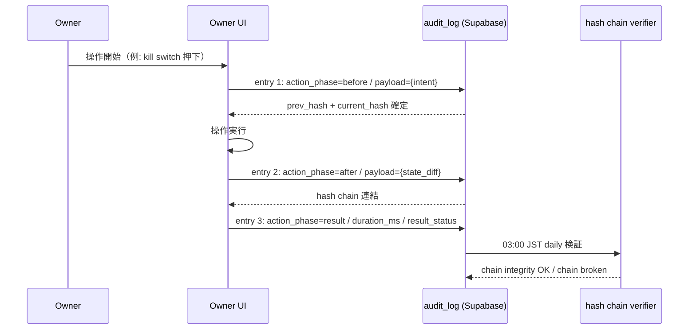
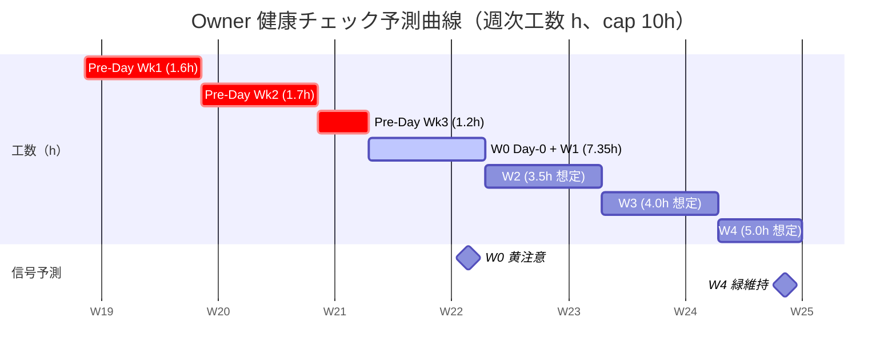

最終更新: 2026-05-03 / 起案: PM 部門 / 対象: Owner

# PRJ-019 Clawbridge — Owner 進捗トラッキングテンプレ

- 案件: PRJ-019「Clawbridge」
- 担当: PM 部門
- 版: v1.0（5/26 Day-0 着手と同時運用開始）
- 関連: `pm-day0-owner-actions-detailed-v2.md`（兄弟 / 32 項目 詳細 checklist）、`pm-phase1-day0-readiness-checklist.md`（v1）、`pm-conditional-go-tracker.md`、DEC-019-033（Owner-in-the-loop / 4 層防御 / kill switch）
- 用途: Owner が朝 5 分 / 週次金 EOD / ブロッカー時の 3 軸でセルフトラッキング。CEO + PM への一元連携によりエスカレーション経路を最短化する

---

## §0 本書の位置付け

DEC-019-033「Owner-in-the-loop」を **週次 10h cap で疲弊なく回す** ためには、Owner 自身がセルフトラッキングできるテンプレ化が不可欠。本書は以下 6 軸を提供する:

1. §1 Daily checkin（朝 5 分 / 6 項目）
2. §2 Weekly summary（毎週金 EOD）
3. §3 ブロッカー報告（即時 escalation）
4. §4 Slack channel 5 構成案
5. §5 audit_log 連動（操作前後で entry 残す方針）
6. §6 健康チェック（週次工数上限 10h で疲弊防止）

これらは `pm-day0-owner-actions-detailed-v2.md` 32 項目の運用基盤として機能する。

---

## §1 Daily Checkin テンプレ（朝 5 分 / 6 項目）

### §1.1 運用ルール

- 開催: 毎朝 09:00 JST、Owner 自記入
- 提出先: Slack #prj-019-owner-checkin（DM）または Notion DB
- 記入時間目安: **5 分以内**（超過は §6 健康チェック 黄色信号）
- PM が 09:30 までに集計、CEO に 10:00 サマリ報告

### §1.2 テンプレ本文

```
================================================================================
[Owner Daily Checkin] YYYY-MM-DD (曜)
================================================================================
記入者: Owner / 記入時刻: HH:MM JST / 所要: __ 分

【1】昨日完了した Owner 操作（pm-day0-owner-actions-detailed-v2.md の項目 ID 参照）
  - [ ] 完了 ID: ____ / 所感: ____
  - [ ] 完了 ID: ____ / 所感: ____

【2】今日予定の Owner 操作
  - [ ] 予定 ID: ____ / 想定時間: ____ 分
  - [ ] 予定 ID: ____ / 想定時間: ____ 分

【3】ブロッカー / 懸念事項（< 30 字 × 最大 3 件）
  - ________________________________________
  - ________________________________________

【4】今日の Owner 工数 見込み
  ____ h（週次 cap 10h 内? Y / N）

【5】Slack 通知滞留 件数（HITL 滞留 + 未読 DM）
  HITL 滞留: ____ 件 / 未読 DM: ____ 件

【6】コンディション 自己採点（1-5、3 以下なら §6 黄色信号）
  本日: ____ / 5
================================================================================
```

### §1.3 Daily checkin 項目別 SLA

| 項目 | 期限 | 不達時 |
|---|---|---|
| 全体提出 | 09:30 JST | PM が 10:00 reminder |
| 【3】ブロッカー記入 | 09:30 JST | PM が即時 §3 escalation 起票 |
| 【6】コンディション ≤ 3 | 即時 | PM が §6 健康チェック 黄色信号発動 |

---

## §2 Weekly Summary テンプレ（毎週金 EOD、PM へ提出）

### §2.1 運用ルール

- 開催: 毎週金曜 17:00〜18:00 JST、Owner 記入 + PM レビュー
- 提出先: PM Slack DM + #prj-019 channel（CEO + 全部門リード CC）
- 記入時間目安: **15〜20 分**
- PM が翌月曜朝までに次週 plan 整合確認

### §2.2 テンプレ本文

```
================================================================================
[Owner Weekly Summary] Week-N (YYYY-MM-DD 〜 YYYY-MM-DD)
================================================================================
記入者: Owner / 提出時刻: 金 HH:MM JST

【A】今週の Owner 操作 完了率
  完了: __ / __ 項目（__ %）
  未完: ____（理由 + 翌週繰越可否）

【B】今週の Owner 工数 実績
  実工数: __ h（週次 cap 10h に対し __ %）
  内訳:
    - [Solo]:     __ h
    - [UI Only]:  __ h
    - [Dev同席]:  __ h

【C】今週発生したブロッカー（§3 ブロッカー報告 起票件数）
  - 件数: __ 件 / 未解決: __ 件
  - 重大度別: 緊急 __ / 高 __ / 中 __ / 低 __

【D】HITL Gate 実績
  - HITL-9 第 N 件 起動 / 承認: __ 件 / 棄却: __ 件 / timeout: __ 件
  - HITL-10 (policy 変更) 起動: __ 件
  - HITL-11 (knowledge PII review) 起動: __ 件

【E】コスト 4 層 cap 状況
  - session $5: 平均消費 __ %
  - project $50: 累計 __ %
  - day $30: 平均 __ %
  - month $300: 累計 __ %

【F】今週のハイライト（< 100 字）
  ________________________________________

【G】来週の Owner 操作 予告（pm-day0-owner-actions-detailed-v2.md の ID で）
  - ID ____: ____ 分
  - ID ____: ____ 分

【H】コンディション 週次平均
  自己採点 平均: __ / 5
  疲労度: 低 / 中 / 高（§6 黄色 or 赤色 信号判定）

【I】PM への要望 / CEO への申し送り
  ________________________________________
================================================================================
```

### §2.3 Weekly summary 提出 SLA

| 項目 | 期限 | 不達時 |
|---|---|---|
| Owner 提出 | 金曜 18:00 JST | PM が翌朝 reminder + 月曜朝 standup で代理サマリ |
| PM レビュー | 翌月曜 09:00 JST | CEO に直接 escalation |
| CEO 受領 | 翌月曜 12:00 JST | Owner 月曜 EOD まで ack |

---

## §3 ブロッカー報告テンプレ（即時 escalation 用）

### §3.1 運用ルール

- 起票タイミング: ブロッカー検知後 **< 15 分以内**
- 提出先: Slack #prj-019-emergency（@channel mention）+ PM Slack DM
- PM が 30 分以内に部署別 escalation ルートで 1 次対応

### §3.2 テンプレ本文

```
================================================================================
[Owner BLOCKER REPORT] YYYY-MM-DD HH:MM JST
================================================================================
起票: Owner / 緊急度: 緊急 / 高 / 中 / 低

【1】ブロッカー概要（< 50 字）
  ________________________________________

【2】影響を受ける Owner 操作 ID（pm-day0-owner-actions-detailed-v2.md）
  - ID: ____ / 期限への影響: ____

【3】症状（観察事実のみ、推測除外）
  ________________________________________

【4】試行済の自己解決手段
  - ________________________________________
  - ________________________________________

【5】期待する支援
  - 支援タイプ: 技術質問 / 設定変更 / 緊急判断 / その他
  - 支援担当推奨: PM / Dev / Review / CEO / 秘書

【6】SLA 期待（緊急度別）
  - 緊急: < 15 分 1 次返答
  - 高:   < 1 h 1 次返答
  - 中:   < 4 h 1 次返答
  - 低:   < 24 h 1 次返答
================================================================================
```

### §3.3 部署別 escalation ルート

| ブロッカー種別 | 1 次対応 | 2 次対応 | 3 次対応 |
|---|---|---|---|
| **環境変数 / Vercel / Supabase 接続** | Dev リード | PM | CEO |
| **HITL Gate 動作 / dispatcher 滞留** | Dev リード | Review | PM + CEO |
| **kill switch / 4 層防御 / 13 prohibited deny** | Dev リード | Review | CEO（緊急 SOP D パターン） |
| **コスト超過 / 4 層 cap 異常** | PM | Dev | CEO |
| **議決 / Phase 移行 / Conditional Go** | PM | CEO | Owner（最終決裁） |
| **Marketing 公開 / プレス** | Marketing リード | PM | CEO |
| **audit log hash chain 改ざん検知** | Review | Dev リード | CEO + Owner（D 致命的） |
| **PII / 顧客情報 / API key 漏洩** | Review（HITL-11） | CEO | 法務（外部） |

### §3.4 緊急 SOP（D 致命的ブロック）

§3.3 の **「kill switch / 4 層防御」「audit log 改ざん」「PII 漏洩」** の 3 種は D 致命的ブロックとして以下を即時実行:

1. PM 即時 CEO Slack DM（< 5 min）
2. CEO Owner 緊急 Slack DM（< 15 min）
3. kill switch 全押下 + spawn 停止
4. 24h 以内に原因解析 + 復旧計画
5. 6/2 fallback or それ以上の延期判定（pm-day0-owner-actions-detailed-v2.md §6.4）

---

## §4 Owner 専用 Slack channel 推奨設定（5 channel 構成案）

### §4.1 5 channel 構成

| # | channel 名 | 用途 | 通知設定 | メンバー |
|---|---|---|---|---|
| **1** | `#prj-019-owner-checkin` | Daily checkin (§1) 提出専用 | DM 化 + mobile push ON | Owner / PM |
| **2** | `#prj-019-emergency` | ブロッカー報告 (§3) + D 致命的 escalation | @channel mention 即通知 | Owner / CEO / PM / Dev リード / Review リード |
| **3** | `#prj-019-hitl-queue` | HITL Gate 11 種 滞留通知 + 承認操作 | DM 化 + mobile push ON / 1 件ごと | Owner / PM / Dev リード |
| **4** | `#prj-019-cost-meter` | 4 層 cap 警戒（80% 超）+ audit log 異常 | mention 警戒のみ通知 | Owner / PM / Dev リード / Review リード |
| **5** | `#prj-019` | 全体共有（EOD 報告書 / 議決 / weekly summary） | mention のみ通知 | 全員（CEO / Owner / 5 部門 リード + 秘書） |

### §4.2 通知設定詳細

#### Channel 1: `#prj-019-owner-checkin`
- 通知: DM すべて
- mobile push: ON
- mute: 無し
- pin: テンプレ §1.2 を上部固定

#### Channel 2: `#prj-019-emergency`
- 通知: @channel + @here mention
- mobile push: ON（強制）
- mute: 無し
- 緊急 SOP D パターン時は CEO + Owner 直接呼出可

#### Channel 3: `#prj-019-hitl-queue`
- 通知: 自分宛 mention + DM
- mobile push: ON（HITL 滞留 5 件超なら強制 mention）
- HITL-9（72h SLA）/ HITL-10（24h SLA）/ HITL-11（PII review）の各起動で自動投稿
- pin: hitl-gate.ts dispatcher の URL

#### Channel 4: `#prj-019-cost-meter`
- 通知: keyword「警戒」「超過」「異常」のみ
- mobile push: 警戒時のみ ON
- 80% 超で自動 mention、95% 超で @channel
- audit log hash chain 異常検知時は即 @channel

#### Channel 5: `#prj-019`
- 通知: mention のみ
- mobile push: OFF（朝晩 1 度の確認で十分）
- mute: 不要、ただし大量の cross-team chat は thread 化推奨

### §4.3 channel 運用 SOP

- Owner は channel 1〜4 を mobile push ON で常時受信、channel 5 は朝晩確認で OK
- channel 2（emergency）は 5 min 以内 ack 期待
- channel 3（hitl-queue）の 72h SLA は default reject に流れる前に Owner 承認必須
- channel 4（cost-meter）は週末も含め監視継続

---

## §5 Owner 操作の audit_log 連動（操作前/後で entry 残す方針）

### §5.1 連動方針

DEC-019-033 §⑤ 4 層防御の第 4 層「audit_log SHA-256 hash chain」と整合し、Owner 操作の **操作前 / 操作後 / 結果** の 3 entry を audit_log に自動記録する。

### §5.2 entry 構造

```typescript
interface OwnerAuditLogEntry {
  entry_id: string;            // UUID
  timestamp: string;           // ISO 8601 JST
  prev_hash: string;           // 前 entry の SHA-256
  current_hash: string;        // 自 entry の SHA-256（自動計算）
  actor: 'owner';              // 固定
  action_phase: 'before' | 'after' | 'result';
  operation_id: string;        // pm-day0-owner-actions-detailed-v2.md の ID（例: "D0-07"）
  operation_name: string;      // 例: "kill switch ドリル"
  payload: object;             // 操作の入出力（PII redaction 済）
  duration_ms?: number;        // operation_phase = 'result' のみ
  result_status?: 'ok' | 'fail' | 'partial';
  pii_redacted: boolean;       // 必ず true（HITL-11 連動）
}
```

### §5.3 操作別 entry パターン

#### Owner 操作 1 件あたり 3 entry を必ず生成:



### §5.4 PII redaction 方針（HITL-11 連動）

- API key / Slack webhook URL / 顧客 PII（メール / 名前 / 電話）は entry payload で **自動 redaction** （正規表現 + Allow-list 方式）
- Anthropic API key は `sk-ant-***REDACTED***` 形式
- 顧客名は SHA-256 hash 化して残す（再識別不可、検索用 metadata）
- HITL-11 `knowledge_pii_review` で人間チェック可、Review 部門 ODR-OG-06 で正式化検討中

### §5.5 audit_log 連動 SLA

| 項目 | 期限 |
|---|---|
| entry 1 (before) 書込 | 操作開始 < 100 ms |
| entry 2 (after) 書込 | 操作完了 < 100 ms |
| entry 3 (result) 書込 | < 500 ms |
| hash chain 整合性 verifier | daily 03:00 JST |
| chain broken 検知 → Slack 通知 | < 10 sec |

### §5.6 Owner 操作とテンプレ提出の連動

| §1〜§3 提出 | audit_log entry phase |
|---|---|
| Daily checkin 提出 | result（記入時間 + 6 項目内容） |
| Weekly summary 提出 | result（提出時間 + 9 項目内容、PII redaction） |
| Blocker report 起票 | before（起票直後）+ after（PM 1 次対応後）+ result（解決時） |

---

## §6 Phase 1 期間中 Owner 健康チェック（週次工数上限 10h で疲弊防止）

### §6.1 健康チェックの背景

DEC-019-033「Owner-in-the-loop」は **Owner が現実的に持続可能** であることが大前提。週次 10h cap を超過すると以下の劣化が想定される:

- HITL-9 / HITL-10 承認の品質低下（流し見 → 重大判断ミス）
- Daily checkin 形骸化（5 項目以上が「無し」記入）
- ブロッカー報告漏れ（疲弊で起票せず → CEO 把握遅延）
- 議決出席率低下 → Conditional Go 条件破綻リスク

### §6.2 信号判定基準（3 段階）

| 信号 | 条件 | アクション |
|---|---|---|
| **緑（健全）** | 週次工数 < 8h かつ Daily コンディション平均 ≥ 4 | 通常運用継続 |
| **黄（警戒）** | 週次工数 8〜10h または Daily コンディション平均 3〜3.9 | PM が次週 [UI Only] 化 推奨、Dev 同席項目を Dev 事前準備強化で代替検討 |
| **赤（疲弊）** | 週次工数 > 10h または Daily コンディション平均 < 3 が 3 日連続 | **Phase 1 W2 着手スライド検討 + CEO 緊急会議招集** |

### §6.3 週次健康チェック SOP

- 毎週金曜 18:00 PM が weekly summary §H 自己採点を集計
- 黄色信号 → PM が翌月曜朝の standup で対策提案
- 赤色信号 → PM が即時 CEO Slack DM、24h 以内に Owner と CEO で 1on1 設定

### §6.4 疲弊防止策

| 対策 | 実施トリガー | 担当 |
|---|---|---|
| **[UI Only] 化推進** | 黄色信号 1 週連続 | PM + Dev |
| **HITL-9 SLA cap 緩和（72h → 96h）** | 赤色信号 + Owner 同意 | PM + CEO |
| **Phase 1 W2 着手 6/3 → 6/5 スライド** | 赤色信号 2 週連続 | CEO + 全部門 |
| **Dev 同席項目を 30% 削減** | 赤色信号 + Owner 要望 | PM + Dev リード |
| **Owner 任意休息日設定（土日 + 平日 1 日）** | 黄色信号継続 | Owner 自身 + PM 整合 |

### §6.5 Phase 1（5/26〜6/20）期間中の予測健康曲線



### §6.6 §6 集計

- W0（5/26〜6/1）: 7.35h → **黄色（警戒水準下限）**、PM が 6/1 EOD 標準対策発動
- W2〜W4: 工数低減見込（HITL-9 慣熟 + Dev 自走化）→ **緑維持**
- 累計 24 日 11.85h → 週次平均 3.46h → **緑信号維持**

---

## §7 運用開始 + 改訂サイクル

### §7.1 運用開始タイミング

- §1 Daily checkin: 2026-05-26 (Day-0) より起動
- §2 Weekly summary: 2026-05-29（Day-0 を含む W0 終了週金曜）初回提出
- §3 ブロッカー報告: 2026-05-09 (Pre-Day Wk1) より随時運用
- §4 Slack channel: 2026-05-08（議決-7 採決後 24h 以内に PM が channel 5 件作成）
- §5 audit_log 連動: 2026-05-26 Day-0 より自動運用（Dev 実装済）
- §6 健康チェック: 2026-05-29 W0 終了金曜 初回判定

### §7.2 改訂サイクル

- 週次: 毎週金 18:00 PM がテンプレ修正案レビュー（Owner feedback 反映）
- 月次: Phase 1 W4 終了時（6/20）に v2 起案 → Phase 2 へ持込
- DEC 連動: 関連 DEC 起票時（DEC-019-034〜）に該当 §を改訂

---

## §8 関連ドキュメント

- 兄弟（同時起案）: `pm-day0-owner-actions-detailed-v2.md`（32 項目 詳細 checklist）
- v1: `pm-phase1-day0-readiness-checklist.md`（破壊せず本書で拡張）
- 上位 PM: `pm-conditional-go-tracker.md` §6 / `pm-v4-master-plan.md`
- 上位 CEO: `ceo-dec-019-033-consolidation.md` §5.2 必須コントロール 50 項目
- Dev 連動: `dev-w1-prefetch-hitl-dashboard-permissions.md`（Owner UI 実装）
- 関連 DEC: DEC-019-031〜033（4 層防御 / 13 prohibited domains / kill switch / Owner-in-the-loop）

---

**v1 確定**: 2026-05-03 PM 起案 / **運用開始**: 2026-05-08〜2026-05-26 段階展開 / **次回更新**: 2026-05-29 W0 終了金曜（初回 weekly summary 受領後）+ 6/20 Phase 1 W4 終了時 / **対象**: Owner（CEO + PM 並走）
