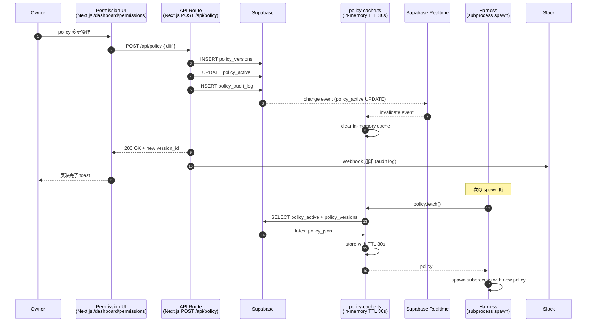
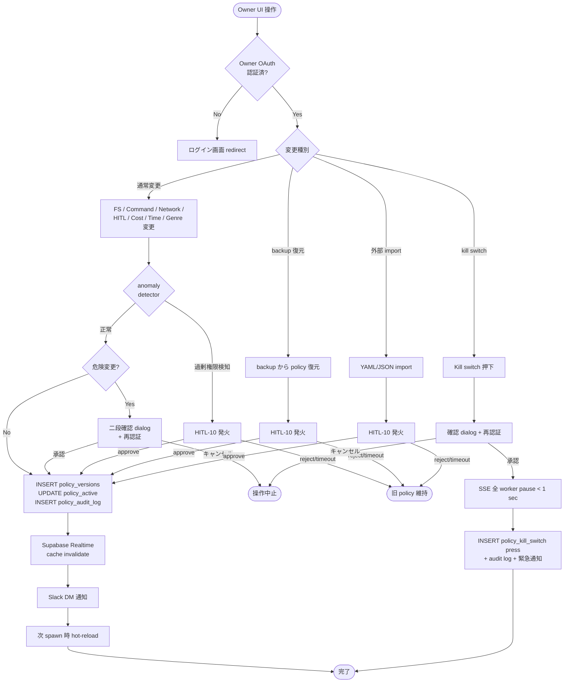

# PRJ-019 / PRJ-020 — Open Claw 権限管理 UI 専用 WBS（DEC-019-033 ⑤ 反映）

- 案件: PRJ-019「Clawbridge」 + PRJ-020「ClawDialog」（透明性 Dashboard + 権限 UI 同居実装）
- 担当部署: PM 部門
- 作成日: 2026-05-03
- 作成者: PM Agent (claude-code-company)
- 版: **v1.0**（DEC-019-033 ⑤ 採択直後、Pre-Phase 5/19 着手前の最終確定版）
- 関連決裁:
  - **DEC-019-033 ⑤**（Open Claw 権限管理 UI = 7 カテゴリ × 細粒度、Supabase `policy_versions` + audit log、Owner のみ変更可、priviledge escalation 物理防止、kill switch、HITL 第 10 種 `permission_change_review`）
  - DEC-020-003（PRJ-020 ClawDialog に透明性 Dashboard + 権限 UI 同居実装路線継承）
  - DEC-019-007 G-01〜G-12（既存ハーネスコントロール、本 UI で動的設定可能化）
  - DEC-019-018 HITL-6 + G-Top-1〜4（既存 HITL 種別、本 UI で SLA / default 動的変更可能化）
- 兄弟ドキュメント: `pm-cost-and-controls-plan-v4-1.md`（PM v4.1、§3.3 / §3.6 で本書を参照）

---

## §0 サマリー

### §0.1 200 字以内

Open Claw 権限管理 UI を **PRJ-020 ClawDialog 内「権限設定」タブ**として実装。**7 カテゴリ × 細粒度設定可能化** = (1) FS / (2) シェル / (3) ネットワーク / (4) HITL / (5) コスト / (6) 時間帯 / (7) ジャンル。**Supabase `policy_versions` + `policy_audit_log` + RLS（Owner のみ write）**、ハーネス層 **hot-reload**（subprocess spawn 前 fetch、再起動不要）、**priviledge escalation 物理防止**（Open Claw は read-only）、**kill switch 即時反映**（SSE 全 worker pause < 1 sec）、**HITL 第 10 種 `permission_change_review`**（backup 復元 / 外部 import / 過剰権限警告 の 3 ケース）。Pre-Phase 5/19〜5/25 で基本機能完成、Phase 1 W1〜W4 で運用拡充。総工数 **Dev 14 d**（Pre-Phase + W1〜W4 配分）。

### §0.2 本 WBS の位置づけ

- PM v4.1 §3.6（必須コントロール 40 項目のうち P-UI-01〜06）の **詳細展開**
- PM v4.1 §4（Pre-Phase 提案生成 WBS）のうち **PP-04〜PP-07 の詳細**
- DEC-019-033 ⑤ の **実装着工指示書**

### §0.3 設計原則（5 原則）

| # | 原則 | 根拠 |
|---|---|---|
| **1** | **変更は Owner のみ可能**（Open Claw 自身の権限昇格経路を物理的に断つ） | DEC-019-033 ⑤ priviledge escalation 防止 |
| **2** | **Supabase で policy バージョン管理**（変更履歴 100% 監査可能） | DEC-019-033 ⑤ audit log |
| **3** | **ハーネス層 hot-reload**（再起動不要、subprocess spawn 前 fetch） | DEC-019-033 ⑤ 運用継続性 |
| **4** | **kill switch 即時反映**（UI ボタン押下から < 1 sec で全 worker pause） | DEC-019-033 ⑤ 緊急対応 |
| **5** | **policy 異常検知 + 自動 rollback**（過剰権限警告 detector + HITL-10 発火） | DEC-019-033 ⑤ 暴走防止 |

---

## §1 7 カテゴリ × 細粒度設定 機能要件マトリクス

### §1.1 7 カテゴリ概要

| # | カテゴリ | 設定単位 | 既存対応コントロール |
|---|---|---|---|
| 1 | **FS（ファイルシステム書込範囲）** | パス glob 単位 allow/deny | G-01 |
| 2 | **Command（シェルコマンド whitelist）** | コマンド単位 allow/deny + 引数正規表現 | G-02 |
| 3 | **Network（ネットワーク通信先）** | ドメイン単位 allow/deny | G-03 |
| 4 | **HITL（HITL Gate 1〜10 種別）** | 種別単位 ON/OFF + SLA + default action | G-05 / HITL-1〜10 |
| 5 | **Cost（コスト上限）** | 月次 / 件次 / 提案次の 5 階層 | G-06 / DEC-019-012 |
| 6 | **Time（時間帯ウィンドウ）** | 曜日 × 時間帯マトリクス（JST 基準） | G-V2-07 |
| 7 | **Genre（ジャンル whitelist/blocklist）** | ジャンル単位 + 13 prohibited domains | DEC-019-018 / G-Top-2 |

### §1.2 機能要件マトリクス（カテゴリ × 機能）

| カテゴリ | UI 表示 | 設定操作 | 検証 | 反映方式 | audit |
|---|---|---|---|---|---|
| **FS** | パス tree + glob list | パス add/remove + 一括 import | path normalize + glob syntax check | hot-reload | full diff |
| **Command** | コマンド表 + 正規表現 | コマンド add/remove + regex test | regex compile + bash 構文 lint | hot-reload | full diff |
| **Network** | ドメイン list + tag | ドメイン add/remove + bulk paste | DNS resolve check + cert validity | hot-reload | full diff |
| **HITL** | 10 種別 toggle + SLA slider | ON/OFF + SLA 数値 + default 選択 | SLA 範囲 5min〜168h、default 列挙制限 | hot-reload | full diff |
| **Cost** | 5 階層 spinner | 数値 input + 単位選択 | 数値範囲 + DEC-019-012 ハード越え禁止 | hot-reload | full diff |
| **Time** | 7×24 grid | セル click ON/OFF + パターン適用 | TZ = JST 固定 | hot-reload | full diff |
| **Genre** | カテゴリ tree + 13 prohibited tag | カテゴリ add/remove + prohibited 強制 | 13 prohibited は Owner UI でも解除不可 | hot-reload | full diff |

### §1.3 7 カテゴリ別 詳細仕様

#### §1.3.1 FS（ファイルシステム書込範囲）

| 項目 | 仕様 |
|---|---|
| 設定対象 | パス glob（`projects/PRJ-019/app/**`, `organization/knowledge/**` 等） |
| デフォルト allow | `projects/PRJ-{nnn}/app/**`, `projects/PRJ-{nnn}/reports/**`（PRJ-019 のみ）, `organization/knowledge/{patterns,decisions,pitfalls}/**` |
| デフォルト deny | `**/.env*`, `**/secrets/**`, `**/.git/**`, 上記 allow 以外全て |
| 設定単位 | 行単位 add / remove、bulk import（YAML） |
| UI コンポーネント | Tree view + glob list table |
| 検証ルール | path normalize（`..` 禁止）、glob 構文チェック、絶対パス禁止 |
| 反映方式 | hot-reload（次 spawn から有効） |

#### §1.3.2 Command（シェルコマンド whitelist）

| 項目 | 仕様 |
|---|---|
| 設定対象 | コマンド名 + 引数正規表現（例: `git`, `^(status|diff|log)$`） |
| デフォルト allow | `git`, `pnpm`, `node`, `rg`, `cat`, `ls`, `mkdir`, `cp`, `mv`, `claude` |
| デフォルト deny | `rm -rf`, `dd`, `chmod 777`, `sudo`, `npm publish`, `gh release` 等 |
| 設定単位 | コマンド単位 + 引数 regex |
| UI コンポーネント | Table（コマンド / 引数 regex / allow|deny） |
| 検証ルール | regex compile 成功、bash 構文 lint pass |
| 反映方式 | hot-reload |

#### §1.3.3 Network（ネットワーク通信先）

| 項目 | 仕様 |
|---|---|
| 設定対象 | ドメイン（FQDN）+ tag |
| デフォルト allow | `api.anthropic.com`, `api.openai.com`, `*.vercel.app`, `*.supabase.co`, `github.com`, `api.github.com`, `slack.com`, `clawbro.ai` |
| デフォルト deny | 上記以外全て |
| 設定単位 | ドメイン add/remove、bulk paste |
| UI コンポーネント | List + tag chip |
| 検証ルール | DNS resolve 成功、cert validity check（HTTPS のみ） |
| 反映方式 | hot-reload |

#### §1.3.4 HITL（HITL Gate 1〜10 種別）

| 項目 | 仕様 |
|---|---|
| 設定対象 | HITL-1〜10 各 ON/OFF / SLA / default action |
| デフォルト | PM v4.1 §2.1 表通り |
| 設定単位 | 種別単位の 3 属性（ON/OFF, SLA, default） |
| UI コンポーネント | 10 行 table、各行 toggle + slider + select |
| 検証ルール | SLA 範囲 5min〜168h、default = `reject`/`pause`/`approve` 列挙、HITL-8 / HITL-9 / HITL-10 は ON/OFF 変更不可（DEC-019-033 ハード固定） |
| 反映方式 | hot-reload |

#### §1.3.5 Cost（コスト上限）

| 項目 | 仕様 |
|---|---|
| 設定対象 | 5 階層 = 提案 1 件 / 月次提案合計 / 件次（実装含む） / 月次（実装合計） / 全体月次 |
| デフォルト | $0.50 / $30 / $5 / $50 / $300 |
| 上限 | $2.00 / $100 / $20 / $200 / **$300（変更不可）** |
| 設定単位 | 階層単位 spinner |
| UI コンポーネント | 5 行 form |
| 検証ルール | 数値範囲、DEC-019-012 全体月次 $300 ハード越え禁止 |
| 反映方式 | hot-reload |

#### §1.3.6 Time（時間帯ウィンドウ）

| 項目 | 仕様 |
|---|---|
| 設定対象 | 7 曜日 × 24 時間 = 168 セル |
| デフォルト allow | 月〜金 09:00〜23:00 JST、土日 10:00〜22:00 JST |
| デフォルト deny | 月〜金 23:00〜09:00、土日 22:00〜10:00 |
| 設定単位 | セル click ON/OFF、パターン適用（平日のみ / 24h / カスタム） |
| UI コンポーネント | 7×24 grid（heatmap 風） |
| 検証ルール | TZ = JST 固定、最低 1 セル ON 必須（全 OFF は kill switch 化） |
| 反映方式 | hot-reload |

#### §1.3.7 Genre（ジャンル whitelist/blocklist）

| 項目 | 仕様 |
|---|---|
| 設定対象 | ジャンルカテゴリ + サブカテゴリ + 13 prohibited domains |
| デフォルト whitelist | `developer-tools`, `productivity`, `markdown-tools`, `code-snippet`, `oss-dependency` 等（DEC-019-022 候補） |
| デフォルト blocklist | adult, gambling, weapons, illegal-drugs, hate-speech, self-harm, pii-trading, financial-fraud, malware, copyright-infringement, child-safety-violation, medical-misinfo, election-interference の 13 prohibited（**Owner UI でも解除不可、CEO + Review 二段決裁必須**） |
| 設定単位 | カテゴリ tree、prohibited 強制 |
| UI コンポーネント | Tree + tag chip |
| 検証ルール | 13 prohibited は immutable、whitelist と blocklist の重複禁止 |
| 反映方式 | hot-reload |

### §1.4 7 カテゴリ × 設定単位 比較表

| カテゴリ | 設定単位 | UI | 検証 | hot-reload | audit | Owner 変更可否 |
|---|---|---|---|---|---|---|
| FS | パス glob | Tree | path syntax | ✅ | full diff | ✅ |
| Command | コマンド + regex | Table | regex compile | ✅ | full diff | ✅ |
| Network | ドメイン | List | DNS resolve | ✅ | full diff | ✅ |
| HITL | 種別 × 3 属性 | 10 行 table | SLA 範囲 | ✅ | full diff | ✅（HITL-8/9/10 ON/OFF 不可） |
| Cost | 5 階層 | Form | 数値範囲 | ✅ | full diff | ✅（全体月次 $300 不可） |
| Time | 7×24 grid | Grid | JST 固定 | ✅ | full diff | ✅ |
| Genre | カテゴリ + 13 prohibited | Tree | prohibited immutable | ✅ | full diff | ✅（13 prohibited 不可） |

### §1.5 7 カテゴリ × 既存コントロール 対応表

| カテゴリ | 関連既存コントロール | 関係 |
|---|---|---|
| FS | G-01 | UI で動的設定可能化 |
| Command | G-02 | UI で動的設定可能化 |
| Network | G-03 | UI で動的設定可能化 |
| HITL | G-05 / HITL-1〜10 | UI で SLA / default 動的設定可能化 |
| Cost | G-06 / G-V2-09 / DEC-019-012 | UI で 4 層 → 5 階層に拡張 |
| Time | G-V2-07 | UI で 7×24 grid 化 |
| Genre | DEC-019-018 / G-Top-2 / 13 prohibited | UI で whitelist/blocklist 動的設定 |

---

## §2 Supabase スキーマ案

### §2.1 テーブル一覧

| テーブル | 用途 | retention |
|---|---|---|
| `policy_versions` | policy のバージョン管理（INSERT のみ、UPDATE/DELETE 不可） | 90 日（DEC-019-007 G-09 整合） |
| `policy_audit_log` | 変更監査ログ（誰がいつ何をどう変更したか） | 90 日 |
| `policy_active` | 現在 active な policy を指す（最新 version_id） | 永続 |
| `policy_kill_switch` | kill switch 状態 + 押下履歴 | 永続 |
| `policy_anomaly_log` | 過剰権限自動検知ログ | 90 日 |

### §2.2 SQL DDL

```sql
-- policy_versions: policy バージョン管理（append-only）
CREATE TABLE policy_versions (
  id UUID PRIMARY KEY DEFAULT gen_random_uuid(),
  version_number BIGSERIAL NOT NULL UNIQUE,
  policy_json JSONB NOT NULL,         -- 7 カテゴリ全設定を JSON で保持
  created_at TIMESTAMPTZ NOT NULL DEFAULT now(),
  created_by TEXT NOT NULL,           -- 'owner' | 'system_backup' | 'system_import'
  source TEXT NOT NULL,               -- 'ui_change' | 'backup_restore' | 'external_import' | 'auto_warning_rollback'
  hitl_approval_id UUID,              -- HITL-10 発動時の承認 ID
  parent_version_id UUID REFERENCES policy_versions(id),  -- 直前 version
  notes TEXT
);

-- INSERT only constraint
CREATE RULE policy_versions_no_update AS ON UPDATE TO policy_versions DO INSTEAD NOTHING;
CREATE RULE policy_versions_no_delete AS ON DELETE TO policy_versions DO INSTEAD NOTHING;

CREATE INDEX idx_policy_versions_version_number ON policy_versions(version_number DESC);
CREATE INDEX idx_policy_versions_created_at ON policy_versions(created_at DESC);

-- policy_active: 現在 active な policy
CREATE TABLE policy_active (
  id INT PRIMARY KEY DEFAULT 1 CHECK (id = 1),  -- 単一行
  active_version_id UUID NOT NULL REFERENCES policy_versions(id),
  activated_at TIMESTAMPTZ NOT NULL DEFAULT now(),
  activated_by TEXT NOT NULL
);

-- policy_audit_log: 変更監査ログ
CREATE TABLE policy_audit_log (
  id UUID PRIMARY KEY DEFAULT gen_random_uuid(),
  occurred_at TIMESTAMPTZ NOT NULL DEFAULT now(),
  actor TEXT NOT NULL,                -- 'owner:{user_id}' | 'system'
  action TEXT NOT NULL,               -- 'create' | 'activate' | 'rollback' | 'kill_switch_press'
  pre_version_id UUID REFERENCES policy_versions(id),
  post_version_id UUID REFERENCES policy_versions(id),
  diff JSONB,                         -- 7 カテゴリ別 diff
  reason TEXT,
  ip_address INET,
  user_agent TEXT,
  slack_notified BOOLEAN DEFAULT false
);

CREATE INDEX idx_policy_audit_log_occurred_at ON policy_audit_log(occurred_at DESC);
CREATE INDEX idx_policy_audit_log_actor ON policy_audit_log(actor);

-- policy_kill_switch: kill switch 状態
CREATE TABLE policy_kill_switch (
  id INT PRIMARY KEY DEFAULT 1 CHECK (id = 1),
  is_active BOOLEAN NOT NULL DEFAULT false,
  activated_at TIMESTAMPTZ,
  activated_by TEXT,
  deactivated_at TIMESTAMPTZ,
  deactivated_by TEXT,
  press_count BIGINT NOT NULL DEFAULT 0
);

INSERT INTO policy_kill_switch (id, is_active) VALUES (1, false);

-- policy_anomaly_log: 過剰権限自動検知ログ
CREATE TABLE policy_anomaly_log (
  id UUID PRIMARY KEY DEFAULT gen_random_uuid(),
  detected_at TIMESTAMPTZ NOT NULL DEFAULT now(),
  policy_version_id UUID NOT NULL REFERENCES policy_versions(id),
  anomaly_type TEXT NOT NULL,         -- 'global_allow' | 'admin_privilege' | 'cost_unlimited' | 'all_hitl_off'
  detail JSONB NOT NULL,
  hitl_10_triggered BOOLEAN DEFAULT false,
  hitl_10_id UUID,
  resolved_at TIMESTAMPTZ,
  resolution TEXT
);

CREATE INDEX idx_policy_anomaly_log_detected_at ON policy_anomaly_log(detected_at DESC);

-- RLS（Row-Level Security）
ALTER TABLE policy_versions ENABLE ROW LEVEL SECURITY;
ALTER TABLE policy_active ENABLE ROW LEVEL SECURITY;
ALTER TABLE policy_audit_log ENABLE ROW LEVEL SECURITY;
ALTER TABLE policy_kill_switch ENABLE ROW LEVEL SECURITY;
ALTER TABLE policy_anomaly_log ENABLE ROW LEVEL SECURITY;

-- Owner のみ INSERT 可能、Open Claw role は SELECT のみ
CREATE POLICY policy_versions_owner_insert ON policy_versions
  FOR INSERT TO authenticated
  WITH CHECK (auth.jwt() ->> 'role' = 'owner');

CREATE POLICY policy_versions_all_select ON policy_versions
  FOR SELECT USING (true);

CREATE POLICY policy_active_owner_update ON policy_active
  FOR UPDATE TO authenticated
  USING (auth.jwt() ->> 'role' = 'owner')
  WITH CHECK (auth.jwt() ->> 'role' = 'owner');

CREATE POLICY policy_kill_switch_owner_update ON policy_kill_switch
  FOR UPDATE TO authenticated
  USING (auth.jwt() ->> 'role' = 'owner');

-- audit log は system が INSERT のみ
CREATE POLICY policy_audit_log_system_insert ON policy_audit_log
  FOR INSERT WITH CHECK (true);

CREATE POLICY policy_audit_log_owner_select ON policy_audit_log
  FOR SELECT TO authenticated
  USING (auth.jwt() ->> 'role' IN ('owner', 'reviewer'));
```

### §2.3 policy_json スキーマ（JSONB の中身）

```json
{
  "version": "1.0",
  "fs": {
    "allow": ["projects/PRJ-019/app/**", "organization/knowledge/**"],
    "deny": ["**/.env*", "**/secrets/**"]
  },
  "command": {
    "allow": [
      { "command": "git", "args_regex": "^(status|diff|log)$" },
      { "command": "pnpm", "args_regex": ".*" }
    ],
    "deny": [
      { "command": "rm", "args_regex": "-rf.*" }
    ]
  },
  "network": {
    "allow": ["api.anthropic.com", "api.openai.com", "*.vercel.app"],
    "deny": []
  },
  "hitl": {
    "1": { "enabled": true, "sla_minutes": 1440, "default_action": "reject" },
    "2": { "enabled": true, "sla_minutes": 60, "default_action": "pause" },
    "9": { "enabled": true, "sla_minutes": 4320, "default_action": "reject", "immutable": true },
    "10": { "enabled": true, "sla_minutes": 1440, "default_action": "reject", "immutable": true }
  },
  "cost": {
    "per_proposal": 0.50,
    "monthly_proposal_total": 30,
    "per_session_with_impl": 5,
    "monthly_with_impl": 50,
    "monthly_total": 300
  },
  "time": {
    "tz": "Asia/Tokyo",
    "matrix": [
      [false, false, ..., true, true, ..., false],  /* 月: 24 セル */
      ...                                              /* 日: 24 セル */
    ]
  },
  "genre": {
    "whitelist": ["developer-tools", "productivity"],
    "blocklist_custom": [],
    "blocklist_prohibited": [
      "adult", "gambling", "weapons", "illegal-drugs", "hate-speech",
      "self-harm", "pii-trading", "financial-fraud", "malware",
      "copyright-infringement", "child-safety-violation",
      "medical-misinfo", "election-interference"
    ]
  }
}
```

### §2.4 テーブル比較表

| テーブル | 行数想定（月次） | 主用途 | INSERT のみ | RLS |
|---|---|---|---|---|
| `policy_versions` | < 100 行 | バージョン管理 | ✅（rule で強制） | Owner only insert |
| `policy_active` | 1 行（固定） | 現在 active 指定 | ❌（UPDATE） | Owner only update |
| `policy_audit_log` | < 1000 行 | 変更監査 | ✅（INSERT only） | system insert / Owner+Reviewer select |
| `policy_kill_switch` | 1 行（固定） | kill switch 状態 | ❌（UPDATE） | Owner only update |
| `policy_anomaly_log` | < 100 行 | 過剰権限検知 | ✅ | system insert |

---

## §3 ハーネス層 hot-reload 機構の実装タスク分解

### §3.1 hot-reload 機構の要件

| 要件 | 仕様 |
|---|---|
| **policy fetch タイミング** | 各 subprocess spawn の直前（< 50ms オーバヘッド許容） |
| **キャッシュ戦略** | TTL 30 sec（Supabase row read 過剰回避） |
| **キャッシュ無効化** | UI から policy 変更時に Supabase Realtime 経由で即時 invalidate |
| **fallback** | Supabase 接続失敗時は最後に成功した policy を継続使用 + Slack alert |
| **再起動不要** | ハーネス process 再起動なしで policy 変更が次 spawn から反映 |

### §3.2 hot-reload 実装タスク（5 件）

| ID | タスク | 工数 | 依存 |
|---|---|---|---|
| **HR-01** | `policy-cache.ts` 実装（TTL 30 sec、in-memory cache） | 0.5d | - |
| **HR-02** | Supabase Realtime subscription（`policy_active` UPDATE 検知 → cache invalidate） | 0.5d | HR-01 |
| **HR-03** | subprocess spawn 前 hook 実装（cost-tracker / hitl-gate / circuit-breaker 直前で `policy.fetch()`） | 0.5d | HR-01 |
| **HR-04** | fallback 実装（Supabase 接続失敗時は最後の cache 継続 + Slack alert） | 0.3d | HR-01 |
| **HR-05** | hot-reload latency 計測（spawn 前 fetch < 50ms 検証） | 0.2d | HR-01〜04 |

**hot-reload 工数合計**: **2.0 d**

### §3.3 hot-reload シーケンス図 Mermaid（必須図 1/2）



### §3.4 hot-reload 検証手段

| 検証項目 | 手段 | DoD |
|---|---|---|
| spawn 前 fetch latency | spawn 100 回実行時の fetch 時間計測 | p95 < 50ms |
| Realtime invalidate 速度 | UI 変更 → cache invalidate の遅延計測 | < 500ms |
| fallback 動作 | Supabase 接続を意図的に切断、最後の cache が使用されること | 切断 5 分間継続使用 |
| 再起動不要証明 | ハーネス process 起動中に policy 変更、次 spawn が新 policy で動作 | manual test pass |

---

## §4 priviledge escalation 防止のガード実装タスク

### §4.1 priviledge escalation 防止の 4 防衛線

| 防衛線 | 仕様 | 実装場所 |
|---|---|---|
| **1. RLS（DB 層）** | Owner role のみ `policy_versions` INSERT 可能、Open Claw role は SELECT のみ | Supabase RLS（§2.2） |
| **2. API 層認証** | `/api/policy` POST は Owner JWT 必須、Open Claw 認証では 403 | Next.js API route |
| **3. UI 層 認証** | `/dashboard/permissions` ルートは Owner OAuth 認証必須 | Next.js middleware |
| **4. ハーネス層 read only** | Open Claw subprocess は Supabase service role key を持たず、anon key + Open Claw role でのみ read | env 分離 + Doppler |

### §4.2 priviledge escalation 防止 実装タスク（6 件）

| ID | タスク | 工数 | 依存 |
|---|---|---|---|
| **PE-01** | Supabase RLS 設定（`policy_versions` Owner only insert、Open Claw role は SELECT のみ） | 0.5d | §2.2 DDL |
| **PE-02** | Next.js middleware（`/dashboard/permissions` ルート Owner OAuth 認証必須） | 0.3d | - |
| **PE-03** | API route 認証（`/api/policy` POST は Owner JWT 必須、Open Claw JWT は 403） | 0.5d | - |
| **PE-04** | env 分離（Open Claw subprocess の env から service role key 完全除去、Doppler vault 経由のみ） | 0.5d | G-V2-11 |
| **PE-05** | priviledge escalation pentest（Open Claw 経由で policy 変更を試みる、全経路で失敗確認） | 1d | PE-01〜04 |
| **PE-06** | Owner UI 操作の二段確認（「危険な変更」確認 dialog + 再認証 = OAuth リフレッシュ） | 0.5d | PE-02 |

**priviledge escalation 防止 工数合計**: **3.3 d**

### §4.3 「危険な変更」の定義（PE-06 二段確認 trigger）

| 変更内容 | 二段確認 trigger | 理由 |
|---|---|---|
| FS allow に `**` 追加 | ✅ | 全ファイル書込 = 過剰権限 |
| Command allow に `rm`, `dd`, `chmod` 追加 | ✅ | 破壊的コマンド |
| Network allow に `*` 追加 | ✅ | 全ドメイン許可 |
| HITL-1〜7 全 OFF | ✅ | 全 HITL 無効化 = 暴走防止無効 |
| Cost monthly_with_impl > $200 | ✅ | コスト爆発リスク |
| Time 全 24h 7 曜日 ON | ✅ | 業務時間外稼働 |
| Genre blocklist_custom から既存 blocklist 削除 | ✅ | リスク領域開放 |
| **13 prohibited domains 解除試行** | ❌（**UI 上で操作不可、Owner UI でも変更不可**） | DEC-019-033 ⑤ ハード制約 |

### §4.4 priviledge escalation 4 防衛線 比較表

| 防衛線 | 層 | 実装方式 | 失敗時動作 | 監査 |
|---|---|---|---|---|
| 1. RLS | DB | Supabase Row-Level Security | INSERT 失敗 | DB error log |
| 2. middleware | Edge | Next.js middleware + JWT 検証 | 401 redirect to login | access log |
| 3. API auth | API | JWT role check + audit log | 403 Forbidden | API audit |
| 4. env 分離 | Runtime | Doppler vault + role-scoped env | service key absence | secret scan |

---

## §5 kill switch / 異常検知 + 自動 rollback 実装タスク

### §5.1 kill switch 仕様

| 項目 | 仕様 |
|---|---|
| **trigger** | UI ボタン押下 + 確認 dialog + 再認証 |
| **反映速度** | UI 押下から < 1 sec で全 worker pause |
| **反映機構** | Server-Sent Events（SSE）で全 ハーネス worker に即時通知 |
| **解除** | Owner UI から再操作で解除可能（再認証必須） |
| **押下履歴** | `policy_kill_switch.press_count` + `policy_audit_log` 記録 |
| **緊急通知** | Owner Slack DM + メール SES + SMS（即時） |

### §5.2 kill switch 実装タスク（4 件）

| ID | タスク | 工数 | 依存 |
|---|---|---|---|
| **KS-01** | UI ボタン + 確認 dialog + 再認証実装 | 0.5d | PE-06 |
| **KS-02** | SSE エンドポイント + 全 worker subscription（`/api/kill-switch/sse`） | 1d | - |
| **KS-03** | ハーネス worker 側 SSE listener + 即時 pause 実装 | 0.5d | KS-02 |
| **KS-04** | kill switch latency 計測（UI 押下 → 全 worker pause < 1 sec） | 0.3d | KS-01〜03 |

**kill switch 工数合計**: **2.3 d**

### §5.3 異常検知（過剰権限自動検知）仕様

| 検知条件 | trigger 条件 | 動作 |
|---|---|---|
| **`global_allow`** | FS allow に `**` 追加 / Network allow に `*` 追加 | HITL-10 発火 + 旧 policy 維持 |
| **`admin_privilege`** | Command allow に `sudo`, `chmod 777` 等追加 | HITL-10 発火 + 旧 policy 維持 |
| **`cost_unlimited`** | Cost 5 階層のいずれかが上限値超え or null | HITL-10 発火 + 旧 policy 維持 |
| **`all_hitl_off`** | HITL-1〜7 全 OFF（HITL-8/9/10 は immutable で OFF 不可） | HITL-10 発火 + 旧 policy 維持 |

### §5.4 異常検知 + 自動 rollback 実装タスク（5 件）

| ID | タスク | 工数 | 依存 |
|---|---|---|---|
| **AD-01** | `policy-anomaly-detector.ts` 実装（4 検知条件 + 拡張可能 ruleset） | 1d | - |
| **AD-02** | API route で policy 保存前に detector 実行、anomaly 検出時は INSERT せず HITL-10 発火 | 0.5d | AD-01 / PE-03 |
| **AD-03** | 自動 rollback 実装（HITL-10 reject / timeout 時に `policy_active.active_version_id` を pre_version_id に戻す） | 0.5d | AD-02 |
| **AD-04** | `policy_anomaly_log` テーブル INSERT + Slack 通知 | 0.3d | §2.2 DDL |
| **AD-05** | 異常検知 pentest（4 条件全てで HITL-10 発火 + 旧 policy 維持を確認） | 0.5d | AD-01〜04 |

**異常検知 + 自動 rollback 工数合計**: **2.8 d**

### §5.5 異常検知 4 条件 比較表

| 検知条件 | 検知対象 | trigger 値 | HITL-10 発火 | 自動 rollback |
|---|---|---|---|---|
| global_allow | FS / Network | `**` / `*` 含む | ✅ | ✅ |
| admin_privilege | Command | `sudo` / `chmod 777` 等 | ✅ | ✅ |
| cost_unlimited | Cost | 上限値超え / null | ✅ | ✅ |
| all_hitl_off | HITL | 1〜7 全 OFF | ✅ | ✅ |

---

## §6 HITL 第 10 種 `permission_change_review` 仕様

### §6.1 trigger 3 ケース（Owner UI 通常変更時は不要）

| ケース | 例 | trigger 自動発火 |
|---|---|---|
| **(1) backup 復元** | Owner が「policy 30 日前に戻す」UI 操作 | ✅ |
| **(2) 外部 import** | Owner が YAML/JSON ファイルから policy import | ✅ |
| **(3) 過剰権限警告** | §5.3 の 4 検知条件のいずれか trigger | ✅ |

通常 UI 操作（FS パス追加 / HITL SLA 変更 / Cost 上限変更等）は **HITL-10 不要**（Owner 認証済 = 自動 audit のみ）。

### §6.2 HITL-10 動作詳細

| ステップ | 動作 |
|---|---|
| **1. 発火条件検知** | API route or anomaly detector |
| **2. payload 生成** | `{ change_id, source, diff_json, pre_policy_version, post_policy_version }` |
| **3. pending file 生成** | `pendingDir/audit-permission-change.json` に append |
| **4. Slack DM 通知** | 即時、Owner DM + リンク `/dashboard/permissions/pending/{change_id}` |
| **5. 待機** | SLA 24h |
| **6.a 承認時** | 新 policy `policy_versions` INSERT + `policy_active` UPDATE + audit log |
| **6.b 拒否時** | 旧 policy 維持 + audit log |
| **6.c timeout 時** | 旧 policy 維持 + audit log + 再リマインド Slack |
| **7. ナレッジ蓄積** | `organization/knowledge/decisions/permission-change-{date}.md` に判断ログ蓄積 |

### §6.3 HITL-10 zod schema

```ts
PermissionChangeReviewPayload = z.object({
  change_id: z.string().uuid(),
  source: z.enum(['backup_restore', 'external_import', 'auto_warning']),
  diff_json: z.record(z.any()),
  pre_policy_version: z.string().uuid(),
  post_policy_version: z.string().uuid(),
  approver_signature: z.string().optional(),    // Owner OAuth JWT 残骸
  anomaly_type: z.enum(['global_allow', 'admin_privilege', 'cost_unlimited', 'all_hitl_off']).optional(),
  rationale: z.string().min(20).max(2000),
})
```

### §6.4 HITL-10 実装タスク（4 件）

| ID | タスク | 工数 | 依存 |
|---|---|---|---|
| **H10-01** | `hitl-gate.ts` 拡張（HITL-10 種別追加、payload validator） | 0.5d | - |
| **H10-02** | pending file + Slack DM 通知 | 0.3d | H10-01 |
| **H10-03** | 承認/拒否/timeout 動作実装 | 0.5d | H10-01〜02 |
| **H10-04** | HITL-10 統合テスト（3 trigger ケース全パス） | 0.5d | H10-01〜03 |

**HITL-10 工数合計**: **1.8 d**

### §6.5 HITL-10 vs 通常 UI 変更 比較表

| 操作 | trigger | HITL-10 発火 | audit log | Slack 通知 | 反映方式 |
|---|---|---|---|---|---|
| FS path 追加（通常） | UI 操作 | ❌ | ✅ | ✅ | hot-reload |
| HITL SLA 変更（通常） | UI 操作 | ❌ | ✅ | ✅ | hot-reload |
| Cost 階層変更（通常） | UI 操作 | ❌ | ✅ | ✅ | hot-reload |
| backup 復元 | UI 「30 日前に戻す」 | ✅ | ✅ | ✅ | HITL-10 通過後 hot-reload |
| 外部 import | UI 「YAML import」 | ✅ | ✅ | ✅ | HITL-10 通過後 hot-reload |
| 過剰権限警告 | anomaly detector | ✅ | ✅ | ✅ | rejection で旧 policy 維持 |
| 13 prohibited 解除試行 | UI 操作不可 | - | - | - | UI 上で操作不可 |

---

## §7 タスク工数見積（人日 / Phase 1 W1〜W4 配分）

### §7.1 タスク区分別 工数集計

| 区分 | タスク ID 範囲 | 工数 |
|---|---|---|
| 1. 7 カテゴリ UI 実装 | UI-01〜07（各 0.5d × 7） | **3.5 d** |
| 2. Supabase スキーマ + migration | DB-01〜03 | **0.5 d** |
| 3. hot-reload 機構 | HR-01〜05 | **2.0 d** |
| 4. priviledge escalation 防止 | PE-01〜06 | **3.3 d** |
| 5. kill switch | KS-01〜04 | **2.3 d** |
| 6. 異常検知 + 自動 rollback | AD-01〜05 | **2.8 d** |
| 7. HITL 第 10 種 | H10-01〜04 | **1.8 d** |
| 8. 統合テスト + E2E | TEST-01〜03 | **2.0 d** |
| **合計** | - | **18.2 d** |

注: PM v4.1 §3.3 で「P-UI-01〜06 = 6 項目」と表現したが、本書ではより細分化したタスク 30 件 + 工数 18.2 d で実装する。

### §7.2 Phase 1 W1〜W4 配分

| 期 | 期間 | 配分タスク | 工数 |
|---|---|---|---|
| **Pre-Phase** | 5/19〜5/25 | UI-01〜07 + DB-01〜03 + HR-01〜05 + PE-01〜04 + H10-01〜02 = 基本機能 | **10.0 d** |
| **W1** | 5/26〜6/1 | PE-05〜06 + KS-01〜04 + AD-01〜02 = priviledge 防止 + kill switch | **4.3 d** |
| **W2** | 6/2〜6/8 | AD-03〜05 + H10-03〜04 + TEST-01 = 異常検知 + HITL-10 完成 | **2.5 d** |
| **W3** | 6/9〜6/15 | TEST-02〜03 + 運用ドキュメント整備 | **1.0 d** |
| **W4** | 6/16〜6/20 | 検収 + Phase 2 移行準備 | **0.4 d** |
| **合計** | - | - | **18.2 d** |

### §7.3 Pre-Phase 集中投下 = Dev 2 名体制 or 5/16-5/18 前倒し必須

Pre-Phase 7 営業日に 10.0 d は 1 名稼働では超過。以下いずれか:
- **(A)** Dev 2 名体制で並列実装（Pre-Phase 7 日 × 2 名 = 14 d cap で吸収）
- **(B)** W0-Week2 末週末（5/16-5/18 = 3 日間）から前倒し着手で 10 d → 7 d 期間に圧縮
- **推奨**: **(A) Dev 2 名体制**（PRJ-019/020 同居実装の利点で人員流用可能）

### §7.4 タスク工数集計表

| 区分 | タスク数 | 工数 | 配分先 |
|---|---|---|---|
| UI 実装 | 7 件 | 3.5 d | Pre-Phase |
| Supabase | 3 件 | 0.5 d | Pre-Phase |
| hot-reload | 5 件 | 2.0 d | Pre-Phase |
| priviledge 防止 | 6 件 | 3.3 d | Pre-Phase + W1 |
| kill switch | 4 件 | 2.3 d | W1 |
| 異常検知 | 5 件 | 2.8 d | W1 + W2 |
| HITL-10 | 4 件 | 1.8 d | Pre-Phase + W2 |
| 統合テスト | 3 件 | 2.0 d | W2 + W3 |
| **合計** | **37 件** | **18.2 d** | Pre-Phase 〜 W4 |

---

## §8 Owner Decision Required（[ODR]）

### §8.1 [ODR] 6 件

| ID | 優先度 | 内容 | 期日 | 提示形式 |
|---|---|---|---|---|
| **[ODR-019-PUI-01]** | **P1** | **Pre-Phase 5/19〜5/25 に Dev 2 名体制承認**（10.0 d を 7 営業日で消化、§7.3 推奨案 A） | **5/8 検収会議** | Yes / No |
| **[ODR-019-PUI-02]** | **P1** | **Supabase スキーマ案承認**（5 テーブル DDL §2.2、policy_versions INSERT only constraint 含む） | **5/8 検収会議** | Yes / No |
| **[ODR-019-PUI-03]** | **P1** | **kill switch SSE 反映速度 < 1 sec DoD 承認**（2 sec / 1 sec / 500ms から選択可） | **5/8 検収会議** | < 1 sec / < 500ms / < 2 sec |
| **[ODR-019-PUI-04]** | **P2** | **過剰権限自動検知 4 条件承認**（global_allow / admin_privilege / cost_unlimited / all_hitl_off の 3 件 ON / 4 件 ON / カスタム） | **5/8 検収会議** | 4 件全 ON / カスタム |
| **[ODR-019-PUI-05]** | **P2** | **「危険な変更」二段確認 dialog 仕様承認**（§4.3 の 7 trigger ケース全 ON / 主要 4 件のみ ON） | **5/8 検収会議** | 7 件全 ON / 4 件 |
| **[ODR-019-PUI-06]** | **P3** | **policy backup 自動取得頻度承認**（毎日 09:00 JST / 毎週月曜 09:00 / 毎時間 から選択可） | **5/8 検収会議** | 毎日 09:00 / 毎週 / 毎時間 |
| **[ODR-019-PUI-07]** | **P3** | **policy_audit_log retention 90 日承認**（30 日 / 90 日 / 180 日 / 365 日 から選択可、Supabase 課金影響あり） | **5/8 検収会議** | 90 日 / 180 日 / 365 日 |
| **[ODR-019-PUI-08]** | **P3** | **13 prohibited domains リスト承認**（§1.3.7、CEO + Review 二段決裁必須、Owner UI でも解除不可とする条項の確認） | **5/8 検収会議** | Yes / No |

### §8.2 [ODR] 優先度別集計

| 優先度 | 件数 |
|---|---|
| P1 | 3 件 |
| P2 | 2 件 |
| P3 | 3 件 |
| **合計** | **8 件** |

---

## §9 関連ドキュメント

- 上位: `pm-cost-and-controls-plan-v4-1.md`（PM v4.1、§3.6 / §4 で本書を参照）
- 関連 Dev 詳細設計: `dev-w0-week2-mid-detailed-design.md`
- Review セキュリティ評価: `review-security-and-risk-assessment.md`（priviledge escalation pentest シナリオ参照）
- PRJ-020 兄弟: `projects/PRJ-020/decisions.md` DEC-020-003（透明性 Dashboard + 権限 UI 同居実装路線）

---

## §10 mermaid 図 2 枚目: 権限変更フロー（必須図 2/2）



---

**v1.0 確定**: 2026-05-03
**前版**: 該当なし（DEC-019-033 採択直後の新規策定）
**次回更新**: ① 5/8 検収会議承認後の修正反映 ② Pre-Phase 完了 5/25 後の実装結果反映 ③ Phase 1 W4 完了 6/20 後の運用結果反映
**承認経路**: PM 起案 → CEO 5/8 検収会議承認 → 秘書 dashboard 反映 → Dev / Review / Marketing / 秘書 共有
