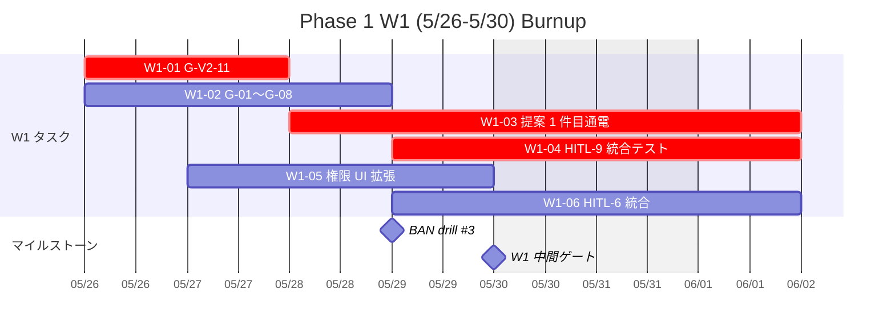
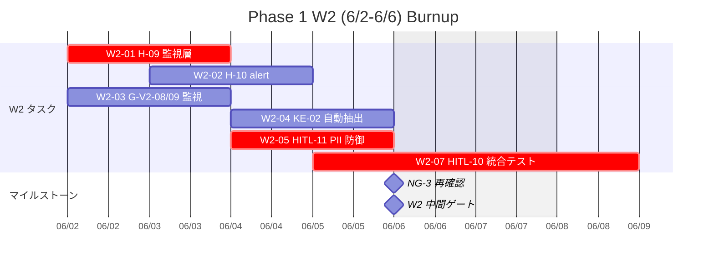
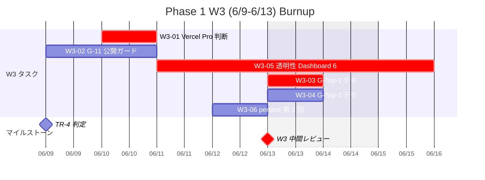
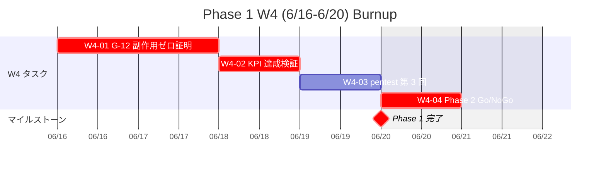
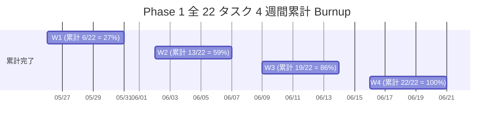
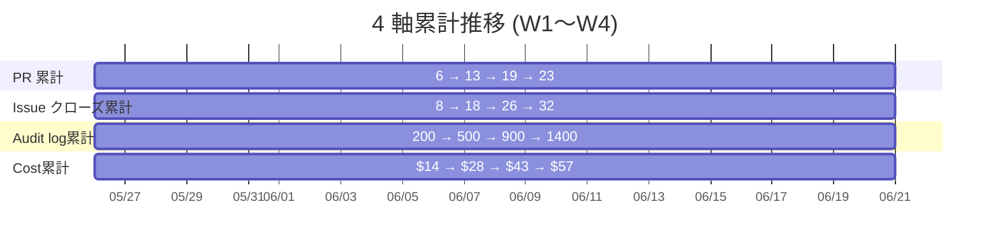
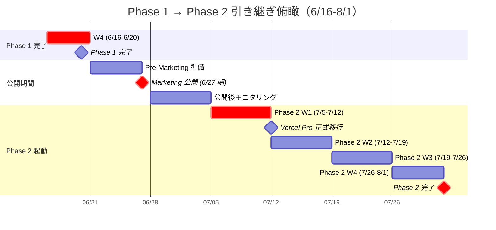

最終更新: 2026-05-03 / 起案: PM 部門

# PRJ-019 Clawbridge — Phase 1（5/26-6/20）4 週間バーンダウン管理テンプレ

- 案件: PRJ-019「Clawbridge」
- 担当: PM 部門
- 版: v1.0（5/8 検収会議 議決-7 採択直後から運用開始予定）
- 関連: `pm-v4-master-plan.md` §2.1 W1〜W4 タスク一覧 / §2.2 工数集計 / §6 マイルストーン表 / §7 Critical Path、DEC-019-031〜033
- 兄弟: `pm-conditional-go-tracker.md`、`pm-phase1-day0-readiness-checklist.md`

---

## §0 本書の位置付け

Phase 1（5/26-6/20、4 週間 = 20 営業日）の各週 DoD と burndown 管理を 1 本にまとめた運用テンプレート。pm-v4 §2.1 で確定した 22 タスク（W1: 6 / W2: 7 / W3: 6 / W4: 4 + Marketing 1）に対し、PR / Issue / Audit log / Cost の 4 軸で進捗をトラッキングする。Phase 1 完了 6/20 の検収条件と Marketing 公開 6/27 朝の連動条件、Phase 2（7/5-8/1）への引き継ぎ条件まで一貫管理する。

### Phase 1 全体俯瞰

| 週 | 期間 | 営業日 | Dev 工数（pm-v4 §2.2） | 重要マイルストーン |
|---|---|---|---|---|
| **W1** | 5/26-5/30 | 5 d（土日除く） | 10.0 d | BAN drill #3 (5/29) |
| **W2** | 6/2-6/6 | 5 d | 10.0 d | NG-3 再確認 (6/6) |
| **W3** | 6/9-6/13 | 5 d | 7.0 d | TR-4 判定 (6/9) / Vercel Pro 昇格判断 (6/10) |
| **W4** | 6/16-6/20 | 5 d | 1.5 d | **Phase 2 Go/NoGo (6/20)** |
| **計** | 20 d | 20 d | **28.5 d** | 4 中間ゲート + 1 最終ゲート |

---

## §1 W1〜W4 各週 DoD

### §1.1 W1 (5/26-5/30) DoD

| ID | DoD 項目 | 担当 | 完了基準 |
|---|---|---|---|
| W1-01 | G-V2-11 完成（緊急停止 SOP 統合） | Dev | E2E test pass + SOP 文書化 |
| W1-02 | G-01〜G-08 残整備 | Dev | 全 G integration test pass |
| W1-03 | 提案 1 件目 Stage A→C 通電（HITL-9 通過実走） | Dev + Owner | preview deploy 成功 + Slack 通知配信 |
| W1-04 | HITL-9 統合テスト（pending file / Slack DM / SLA timer） | Dev | 受入テスト 10 ケース pass |
| W1-05 | 権限 UI Phase 1 拡張（kill switch SSE + 異常検知 4 条件） | Dev | E2E test + propagation < 1 sec |
| W1-06 | HITL-6 `tos_gray_review` 24h SLA 統合 | Dev | classifier 連動 test pass |
| **W1 中間ゲート (5/30 EOD)** | 6/6 件全完了 + BAN drill #3 (5/29) Pass | PM | drill レポート EOD |

### §1.2 W2 (6/2-6/6) DoD

| ID | DoD 項目 | 担当 | 完了基準 |
|---|---|---|---|
| W2-01 | H-09 Claude Max weekly cap 監視層 | Dev | 監視 dashboard 稼働 |
| W2-02 | H-10 Claude Max alert 統合 | Dev | alert webhook 動作 |
| W2-03 | G-V2-08 / G-V2-09 監視拡張 | Dev | 監視 metric 追加完了 |
| W2-04 | KE-02 ナレッジ自動抽出稼働（patterns/decisions/pitfalls） | Dev | 抽出 logic + 3 ディレクトリ追加 |
| W2-05 | HITL-11 `knowledge_pii_review` 統合実装 | Dev | 受入テスト 8 ケース pass |
| W2-06 | NG-3 暫定値再確認（6/6） | PM + Research | 結果 DEC 起票 |
| W2-07 | HITL-10 `permission_change_review` 統合テスト（3 ケース） | Dev + Review | 受入テスト 8 ケース pass |
| **W2 中間ゲート (6/6 EOD)** | 7 件全完了 + NG-3 結果反映 | PM | NG-3 再確認結果報告 |

### §1.3 W3 (6/9-6/13) DoD

| ID | DoD 項目 | 担当 | 完了基準 |
|---|---|---|---|
| W3-01 | Vercel Pro 昇格判断（実消費データに基づく） | PM + CEO + Owner | ODR 採択 + budget-line 確定 |
| W3-02 | G-11 公開ガード | Dev | E2E test + 公開ブロック動作 |
| W3-03 | G-Top-1 デモ 1 件公開（matching ジャンル） | Dev + Marketing | デモ URL + Marketing 連動 |
| W3-04 | G-Top-2 個人データ取扱フローのデモ | Dev | データフロー可視化 |
| W3-05 | 透明性 Dashboard 6 指標完成 | Dev | 6 指標 Realtime 配信 |
| W3-06 | priviledge escalation pentest 第 2 回（W3 中間） | Review | pentest pass |
| **W3 中間ゲート (6/13 EOD)** | **6/13 中間レビュー（重要）** | CEO + PM | Phase 2 Go 確度判定 |

### §1.4 W4 (6/16-6/20) DoD

| ID | DoD 項目 | 担当 | 完了基準 |
|---|---|---|---|
| W4-01 | G-12 副作用ゼロ証明 | Dev + Review | git status / Vercel deploy / Supabase / Anthropic usage diff = 0 |
| W4-02 | KPI 達成検証（提案 ≥ 30 / 承認 ≥ 9 / 実装成功 ≥ 7） | PM | KPI report |
| W4-03 | priviledge escalation pentest 第 3 回（W4 最終） | Review | 最終 pentest pass |
| W4-04 | **Phase 2 Go/NoGo 判定 + DEC-019-XXX 起票** | CEO + PM + Owner | 議決 + DEC 起票 |
| **W4 最終ゲート (6/20)** | **Phase 1 完了宣言 + Phase 2 Go/NoGo 確定** | CEO | 検収議事録 |

---

## §2 各週 task burnup chart（Mermaid）

### §2.1 W1 burnup（理想線 vs 実績）



### §2.2 W2 burnup



### §2.3 W3 burnup



### §2.4 W4 burnup



### §2.5 4 週間総合 burnup（累計タスク完了予測）



---

## §3 累積 PR 数 / Issue クローズ数 / Audit log entry 数 / Cost burn 推移

### §3.1 4 軸トラッキング表

| 週 | PR 累計 | Issue クローズ累計 | Audit log entry 累計 | Cost 累計（月次） |
|---|---|---|---|---|
| W1 終了 (5/30) | **6 PR** | 8 | 約 200 entries | $14（API $10 + Infra $0 + Tools $1 + Buffer $3）|
| W2 終了 (6/6) | 13 PR | 18 | 約 500 entries | $28 |
| W3 終了 (6/13) | 19 PR | 26 | 約 900 entries | $43 |
| W4 終了 (6/20) | 23 PR | 32 | 約 1,400 entries | $57（中央値） |

### §3.2 W1 必達 PR 数 = 6 PR の内訳

| PR # | タイトル | DoD 連動 | 担当 |
|---|---|---|---|
| **PR-1** | feat(harness): G-V2-11 緊急停止 SOP 統合 | W1-01 | Dev |
| **PR-2** | fix(harness): G-01〜G-08 残整備 | W1-02 | Dev |
| **PR-3** | feat(proposal): 提案 1 件目 Stage A→C 通電実装 | W1-03 | Dev |
| **PR-4** | test(hitl): HITL-9 統合テスト 10 ケース | W1-04 | Dev |
| **PR-5** | feat(permission-ui): kill switch SSE + 異常検知 4 条件 | W1-05 | Dev |
| **PR-6** | feat(hitl): HITL-6 tos_gray_review 24h SLA 統合 | W1-06 | Dev |

→ **Phase 1 W1 必達 PR 数 = 6**（Dev 2 名 × 5 営業日 = 10 d cap で 6 PR は無理なく吸収）

### §3.3 PR / Issue / Audit / Cost burn chart



### §3.4 Cost burn 限界基準（monthly $300 cap）

| 週 | 累計予算 | $300 cap 消費率 | 警戒水準 |
|---|---|---|---|
| W1 EOD | $14 | 4.7% | 余裕 |
| W2 EOD | $28 | 9.3% | 余裕 |
| W3 EOD | $43 | 14.3% | 余裕 |
| W4 EOD | $57 | 19.0% | 余裕（中央値）/ 上限 $163 = 54% で警戒 |

→ CEO review 80% trigger（$240）には 4 週間で到達しない見込

---

## §4 KPI 追跡

### §4.1 4 KPI 一覧

| # | KPI | 目標値 | TR-4 トリガー | 測定タイミング |
|---|---|---|---|---|
| **K-1** | **提案承認率** | **≥ 30%**（自然棄却含む） | < 30% 持続検知 → ジャンル切替 | 6/9 W3 開始時 |
| **K-2** | 承認後実装成功率 | ≥ 80% | - | 各週 EOD |
| **K-3** | HITL SLA 遵守率 | ≥ 95%（11 種合算） | - | 各週 EOD |
| **K-4** | コスト burn | ≤ $300/月 | $240 (80%) で CEO review | 毎日 EOD |

### §4.2 KPI トラッキング表

| 週 | K-1 提案承認率 | K-2 実装成功率 | K-3 HITL SLA | K-4 Cost burn |
|---|---|---|---|---|
| W1 EOD | -（提案 1 件目のみ） | -（評価不能） | 100%（提案 1 件） | $14 |
| W2 EOD | 約 25%（提案 8 件 / 承認 2 件想定） | 100%（2/2） | ≥ 95% | $28 |
| W3 EOD | **判定**（K-1 ≥ 30% Pass / 未満 → TR-4） | ≥ 80% | ≥ 95% | $43 |
| W4 EOD | **最終確定** | **最終確定** | **最終確定** | $57 |

### §4.3 TR-4 発動シナリオ

K-1 提案承認率 < 30% 持続検知（6/9 W3 開始時判定）の場合:

1. ジャンル whitelist を 5 件追加（matching → matching + creator + scheduling + utility + content）
2. 6/13 W3 中間レビューで再判定
3. 改善せず → Phase 2 着手 7/5 を 1 週間延期 (7/12) 検討

---

## §5 週次レビュー会議テンプレ（毎週金曜 16:00、30 分）

### §5.1 標準議題（30 分構成）

```
=== Phase 1 週次レビュー会議 ({日付} 16:00 JST) ===

[1] 開会・出席確認 (2 分)
   - 必須: PM / Dev リード / Review リード
   - 任意: CEO / Owner（Gate 週は必須）

[2] 当週 DoD 達成状況報告 (8 分)
   - W{N} タスク __/__ 完了
   - 未達タスクの理由 + 翌週へ持越し計画

[3] KPI 進捗 (5 分)
   - K-1 提案承認率: __%
   - K-2 実装成功率: __%
   - K-3 HITL SLA: __%
   - K-4 Cost burn: $__ / $300 cap

[4] EWS 発火状態 + ブロッカー (5 分)
   - EWS-1〜5 累計件数
   - 24h 以上のブロッカー有無
   - escalation 要否判断

[5] 翌週 DoD + Critical Path 確認 (5 分)
   - 翌週必達タスク 一覧
   - Critical Path 上の警戒事項

[6] Owner 操作期待 + 議決事項 (3 分)
   - 翌週 Owner 操作: __ 件
   - 翌週議決事項: __ 件

[7] 閉会 (2 分)
   - 議事録は当日 17:00 までに #prj-019 に配信
```

### §5.2 開催スケジュール

| 週 | 開催日 | 必須参加 |
|---|---|---|
| W1 終了 | 5/30 (金) 16:00 | PM + Dev + Review + CEO（drill #3 結果共有） |
| W2 終了 | 6/6 (金) 16:00 | PM + Dev + Review + Research（NG-3 結果） |
| W3 終了 | 6/13 (金) 16:00 | **PM + Dev + Review + CEO + Owner**（中間レビュー） |
| W4 終了 | 6/20 (金) 16:00 | **全部門 + Owner**（Phase 2 Go/NoGo） |

---

## §6 中間ゲート 6/13 (W3 末) Go/NoGo 判定基準

### §6.1 6/13 中間レビューの位置付け

W3 終了時に「Phase 1 完了 6/20 達成可能性」「Marketing 公開 6/27 朝決定可能性」の 2 軸で Go/NoGo を判定。NoGo 時は W4 に追加対策を講じるか、Phase 2 着手 7/5 のスライドを発議する。

### §6.2 6/13 GO 判定基準

| 項目 | GO 基準 | 確認手段 |
|---|---|---|
| W1〜W3 タスク完成率 | ≥ 17/19（W1: 6 + W2: 7 + W3: 6 のうち 17 以上） | tracker.csv |
| KPI K-1 提案承認率 | ≥ 30% | 提案 / 承認の累計比 |
| KPI K-3 HITL SLA | ≥ 95% | HITL 発動 vs 期内応答 |
| KPI K-4 Cost burn | ≤ $50（中央値推移内） | cost-tracker |
| Vercel Pro 昇格判断 | 採択（Phase 2 移行 or 即時移行） | ODR-019-VPU-01 確定 |
| pentest 第 2 回結果 | pass | Review レポート |
| EWS 累計 | ≤ 2 件 | tracker EWS 列 |

→ **全項目 GO の場合**: Phase 2 Go/NoGo 確度 ≥ 90%、6/20 完了確定
→ **NoGo の場合**: W4 中に対策、最悪 Phase 2 着手 7/5 → 7/12 延期

### §6.3 6/13 NoGo 時 fallback

| 欠落項目 | fallback |
|---|---|
| タスク完成率 < 17/19 | W4 にタスク持越し + Phase 2 W1 圧縮 |
| K-1 提案承認率 < 30% | TR-4 発動、ジャンル切替（whitelist +5） |
| Cost burn > $50 | HITL-2 cost_threshold 強化、API 呼出最適化 |
| EWS ≥ 3 件 | 緊急 standup + CEO escalation |

---

## §7 Phase 1 終了 (6/20) 検収条件 + Marketing 公開 (6/27) 連動

### §7.1 Phase 1 検収条件 (6/20 EOD)

| 検収項目 | DoD | 検証手段 |
|---|---|---|
| **C1: 22 タスク全完了** | 22/22 完了 | tracker.csv |
| **C2: 50 統制全件 GREEN** | 50/50 GREEN（Day-0 後対応 15 含む） | 統制 dashboard |
| **C3: KPI 4 件達成** | K-1 ≥ 30% / K-2 ≥ 80% / K-3 ≥ 95% / K-4 ≤ $300 | KPI report |
| **C4: 副作用ゼロ証明完了** | W4-01 G-12 pass | git diff / Vercel diff / Supabase diff / Anthropic usage diff |
| **C5: pentest 第 1〜3 回 全 pass** | 3/3 pass | Review レポート |
| **C6: ナレッジ抽出機構稼働** | KE-01〜04 起動 + patterns/decisions/pitfalls 各 1 件以上蓄積 | knowledge ディレクトリ確認 |
| **C7: Phase 2 Go/NoGo 議決完了** | DEC-019-XXX 起票 | decisions.md |

### §7.2 Marketing 公開 6/27 朝 連動条件

| 連動条件 | 達成基準 | 担当 |
|---|---|---|
| 検収 C1〜C7 全 pass | 7/7 pass | PM |
| Vercel Pro 移行完了（商業利用 ToS 適合） | 6/26 までに Pro 移行 | Dev + PM |
| 公開リハーサル成功（6/26） | リハーサル EOD pass | Marketing + Dev |
| LP / プレス草案最終承認 | 6/26 18:00 までに Owner 承認 | Marketing + Owner |
| Heading A 維持確認 | DEC-019-027 不変 | Marketing |
| 公開後更新権限の Owner approval | 5/8 議決済 | - |

→ **6 連動条件全 GREEN → 6/27 朝公開実行**
→ **1 件でも NoGo → 7/4 朝へスライド（Phase 1 fallback と同期）**

### §7.3 Phase 1 完了報告書テンプレ（6/20 EOD）

```
================================================================================
PRJ-019 Clawbridge Phase 1 完了報告書
================================================================================
配信日時: 2026-06-20 17:00 JST
起案: PM 部門
宛先: CEO + Owner + 全部門

【1】Phase 1 検収結果
  C1 22 タスク完了:        __/22
  C2 50 統制 GREEN:        __/50
  C3 KPI 4 件達成:         __/4
  C4 副作用ゼロ証明:       [pass/fail]
  C5 pentest 1〜3 回:      [pass/fail]
  C6 ナレッジ抽出機構:     [稼働/未稼働]
  C7 Phase 2 Go/NoGo議決:  [完了/未完]

【2】Phase 2 Go 判定
  CEO 判断: GO / NoGo / Conditional Go
  Owner 確認: [済/未]
  DEC-019-XXX 起票: [済/未]

【3】Marketing 6/27 朝公開連動
  6 連動条件: __/6 GREEN
  公開実行可否: 6/27 朝 / 7/4 朝へスライド

【4】Phase 1 KPI 最終値
  K-1 提案承認率:       __% (目標 ≥ 30%)
  K-2 実装成功率:       __% (目標 ≥ 80%)
  K-3 HITL SLA:         __% (目標 ≥ 95%)
  K-4 Cost burn:        $__ / $300 cap (__%)

【5】次 Phase 引き継ぎ事項（§8 参照）

================================================================================
```

---

## §8 Phase 2 (7/5-8/1) への引き継ぎ条件

### §8.1 引き継ぎ必須項目（8 項目）

| # | 引き継ぎ項目 | 完了状態 | Phase 2 起動条件 |
|---|---|---|---|
| **H-1** | Phase 1 検収 C1〜C7 全 pass | 6/20 完了 | 全 pass で Phase 2 GO |
| **H-2** | Phase 2 Go/NoGo 議決 | 6/20 DEC 起票 | DEC 起票完了 |
| **H-3** | Marketing 公開状態（6/27 or 7/4） | 6/27 朝 / 7/4 朝 | 公開後の社外反響モニタリング |
| **H-4** | Vercel Pro 移行完了 | 7/12 まで完了 | Phase 2 W2 中に確定 |
| **H-5** | KE-03（提案生成統合）実装計画 | Phase 2 W1 着手予定 | 引き継ぎ design doc |
| **H-6** | HITL-11 PII redaction 強化計画 | Phase 2 W2 着手予定 | 引き継ぎ design doc |
| **H-7** | 提案承認率 30% 維持 + ジャンル拡張計画 | Phase 2 W1 で whitelist +5 | TR-4 連動 |
| **H-8** | 月次予算 Phase 2 上限 $200 / 中央値 $90 | Phase 2 開始時から運用 | budget tracker |

### §8.2 Phase 2 起動 (7/5) 前の Pre-Phase 2 準備（6/21-7/4、約 2 週間）

| 期間 | タスク | 担当 |
|---|---|---|
| 6/21-6/26 | Phase 2 設計 + 公開リハーサル | Dev + Marketing |
| 6/27 | Marketing 公開（朝） | Marketing |
| 6/28-7/4 | 公開後の反響モニタリング + Phase 2 タスク詳細化 | PM + Marketing |
| 7/5 | Phase 2 W1 着手 | Dev + PM |

### §8.3 Phase 2 主要タスク（pm-v4 §3.1 から再掲）

| ID | タスク | 工数 |
|---|---|---|
| P2-01 | KE-03 完成（ナレッジ抽出を提案生成に組込） | 2.0 d |
| P2-02 | 承認率 ≥ 30% 維持 + ジャンル拡張 | 2.0 d |
| P2-03 | Vercel Pro 正式移行 | 1.5 d |
| P2-04 | HITL-11 PII redaction 強化 | 1.5 d |
| P2-05 | G-Top-1〜4 機能拡充 + Marketing 発信強化 | 3.0 d |
| P2-06 | Phase 2 完了 + Phase 3 Go/NoGo 判定 | 1.0 d |
| **計** | - | **18.0 d** |

### §8.4 Phase 2 引き継ぎ Mermaid 全体俯瞰



---

## §9 関連ドキュメント

- 兄弟: `pm-conditional-go-tracker.md`（5/9〜5/25 17 日間追跡）
- 兄弟: `pm-phase1-day0-readiness-checklist.md`（5/26 Day-0 readiness）
- 上位: `pm-v4-master-plan.md` §2.1 W1〜W4 タスク / §3 Phase 2 / §6 マイルストーン / §7 Critical Path
- 関連: `pm-v4-vercel-upgrade-tradeoff.md`（W3 6/10 昇格判断ゲート）
- 関連: `pm-v4-hitl-gates-9-10-11-wbs.md`（HITL-9/10/11 W1〜W2 統合 WBS）
- 上位 DEC: DEC-019-031〜033

---

**v1 確定**: 2026-05-03 PM 起案 / **運用開始**: 5/26 Day-0 / **次回更新**: 毎週金曜 16:00 週次レビュー会議後 / **最終更新**: 6/20 Phase 1 完了報告書配信時
