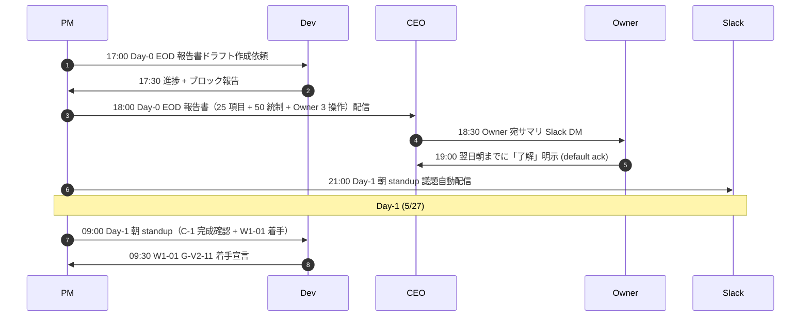
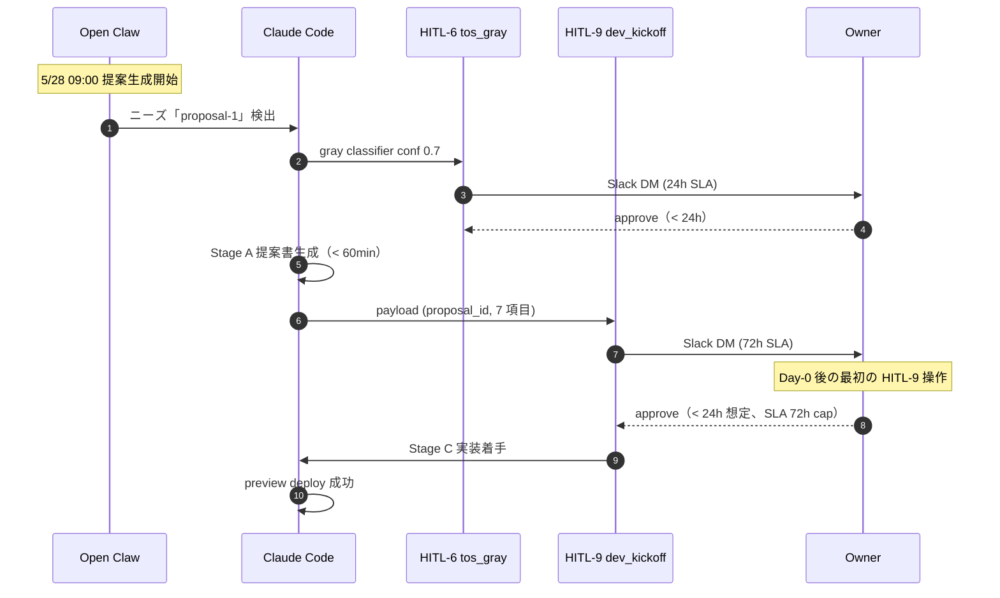

最終更新: 2026-05-03 / 起案: PM 部門

# PRJ-019 Clawbridge — Phase 1 着手日 (5/26) Day-0 Readiness Checklist

- 案件: PRJ-019「Clawbridge」
- 担当: PM 部門
- 版: v1.0（5/8 検収会議 議決-7 採択直後から運用開始予定）
- 関連: `pm-v4-master-plan.md` §2.3 Pre-Phase WBS / §6 マイルストーン表、`pm-conditional-go-tracker.md` §7 Gate-3 最終判定、DEC-019-031〜033
- 兄弟: `pm-conditional-go-tracker.md`、`pm-phase1-burndown-template.md`

---

## §0 本書の位置付け

5/25 Pre-Phase Go/NoGo（Gate-3 最終）通過後、5/26 朝に Phase 1 W1 を正式着手する **Day-0** での **最終 Go/NoGo 判定** に用いる checklist。本書は 5 部門 25 項目 + 50 統制 + Owner 3 操作 + SOP 移行手順の 4 軸で構成され、Day-0 EOD までに **全項目 GO** が確定して初めて Phase 1 W1 の Critical Path（W1-01 G-V2-11 → W1-03 提案 1 件目通電）が起動する。Day-0 (5/26) Go/NoGo は W0-Week2 5/22 mock 70% 化完遂の上で成立する（DEC-019-051）。

### Day-0 タイムライン（5/26 当日）

| 時刻 | 内容 | 担当 |
|---|---|---|
| 09:00 | Day-0 readiness 確認 standup（30 分） | 全部門 |
| 09:30 | 25 項目 readiness checklist 一斉確認 | PM |
| 10:30 | Owner 3 操作確認（議決 / 環境変数 / kill switch） | Owner |
| 12:00 | 50 統制 Day-0 ステータス予測 vs 実績差分検証 | PM + Review |
| 14:00 | Day-0 Go/NoGo 判定（CEO 決裁） | CEO + Owner |
| 14:30 | GO の場合: W1-01 G-V2-11 着手 | Dev |
| 17:00 | Day-0 EOD 報告書配信 | PM |
| 18:00 | Day-1 (5/27) 朝 standup 議題確定 | PM |

---

## §1 全部門 readiness 25 項目チェックリスト

### §1.1 Dev 部門（8 項目）

| # | 項目 | DoD | 担当 | Day-0 確認手段 |
|---|---|---|---|---|
| **D-01** | P-UI-01〜09 全完成（C-1 完遂） | 9/9 完成 + Review pentest pass | Dev リード | tracker.csv 全 status=done |
| **D-02** | hitl-gate.ts 拡張完了（HITL-9/10/11 統合） | DoD 26 項目全 pass | Dev リード | 受入テスト 26 ケース pass log |
| **D-03** | Pre-Phase 12 タスク完了（PP-01〜12） | 12/12 完了 | Dev リード | Pre-Phase WBS チェック |
| **D-04** | Supabase migration 適用（policy_versions / policy_audit_log / audit_log hash chain） | migration 3 件全 apply | Dev リード | `supabase db diff` clean |
| **D-05** | Vercel preview deploy 動作確認（Hobby plan） | preview URL 200 OK + SSE 稼働 | Dev リード | Vercel dashboard 確認 |
| **D-06** | mock-claude 基盤稼働（DEC-019-020） | mock-claude 全コマンド mockable | Dev リード | mock-claude unit test pass |
| **D-07** | cost-tracker 稼働（4 層 cap + Anthropic API 三段階 guard ok/warn $24/auto_stop $28.5/hard_fail $30、DEC-019-050） | $5/$50/$30/月次総額 ≤$430 cap 動作確認 | Dev リード | cost-tracker integration test |
| **D-08** | audit log SHA-256 hash chain integrity verifier 稼働 | daily 03:00 JST batch green | Dev リード | verifier log 確認 |
| **D-09** | Anthropic Console + cost-monitor.ts 同期 SOP 策定（5/22 完遂、DEC-019-051） | SOP 文書化 + 月次同期チェック手順確定 | Dev リード | SOP 文書 + W0-Week2 完遂エビデンス |

### §1.2 Research 部門（4 項目）

| # | 項目 | DoD | 担当 | Day-0 確認手段 |
|---|---|---|---|---|
| **R-01** | NG-3 暫定値 $1,200/月（DEC-019-031 上方修正候補）採択確認 | 5/30 W2 終了時再確認準備 | Research リード | 5/30 議題台帳 確認 |
| **R-02** | PII 検知ルール 7 種策定完了（PREP-05） | 7 種定義書 + redaction logic 設計 | Research リード | PREP-05 成果物確認 |
| **R-03** | Codex 6/1 移行確認準備（CB-CEO-W3-01 連動） | 移行判定資料準備 | Research リード | 6/3 三件同時判断資料 |
| **R-04** | 提案生成 LLM モデル選定（Haiku 3.5 推奨）裏付資料 | DEC-019-031 §② 確認 | Research リード | dev-w0-week2-mid 設計書確認 |

### §1.3 PM 部門（4 項目）

| # | 項目 | DoD | 担当 | Day-0 確認手段 |
|---|---|---|---|---|
| **P-01** | W1〜W4 WBS 確定 + tracker 構築完了 | 22 タスク × 担当アサイン済 | PM リード | pm-v4-master-plan.md §2.1 確認 |
| **P-02** | 月次予算 4 区分配分稼働（subscription $400 / API ≤$30 / インフラ $0 / Buffer $0、DEC-019-051） | budget-line.csv 運用中 | PM リード | budget tracker 確認 |
| **P-03** | Conditional Go tracker 38 タスク達成確認 | 38/38 GO | PM リード | conditional-go-tracker.csv 確認 |
| **P-04** | Burndown template 起動準備（W1〜W4） | 4 週間 burndown chart 雛形 | PM リード | pm-phase1-burndown-template.md §2 確認 |

### §1.4 Marketing 部門（4 項目）

| # | 項目 | DoD | 担当 | Day-0 確認手段 |
|---|---|---|---|---|
| **M-01** | Heading A 維持確認（DEC-019-027 不変） | LP/プレスで Heading A | Marketing リード | LP wireframe 確認 |
| **M-02** | Owner-in-the-loop 訴求補強完成 | LP コピー / プレス草案 | Marketing リード | marketing-owner-gate-messaging-update.md 確認 |
| **M-03** | 公開リハーサル日（6/26）リソース確保 | リハーサル参加者 4 名確保 | Marketing リード | 秘書台帳確認 |
| **M-04** | 6/27 朝公開タイムライン草案 | DEC-019-026 連動 | Marketing リード | marketing-launch-runbook 確認 |

### §1.5 Review 部門（5 項目）

| # | 項目 | DoD | 担当 | Day-0 確認手段 |
|---|---|---|---|---|
| **V-01** | BAN drill #3（5/29 実施）準備完了（mock 70% 化条件付き、DEC-019-051 施策-1/施策-5 連動） | 攻撃シナリオ 5 種 + 観測経路 4 経路 | Review リード | drill 計画書確認 |
| **V-02** | priviledge escalation pentest 第 1 回（W2 中間 6/5 予定）準備 | pentest 12 試行シナリオ | Review リード | PREP-09 成果物 |
| **V-03** | RLS policy review checklist 12 項目運用中 | P-UI-09 完了 | Review リード | RLS review log |
| **V-04** | hash chain integrity 日次検証稼働 | 03:00 JST verifier green | Review リード | verifier log |
| **V-05** | HITL-9/10/11 受入テスト 26 ケース pass | 26/26 pass | Review リード | テストレポート |

### §1.6 25 項目集計

| 部門 | 項目数 |
|---|---|
| Dev | 8 |
| Research | 4 |
| PM | 4 |
| Marketing | 4 |
| Review | 5 |
| **計** | **25** |

---

## §2 50 統制項目の Day-0 ステータス予測表

### §2.1 50 統制カテゴリ別構成（PM v4 §1.1 v3→v4 重要数値変化「44→50」）

| カテゴリ | 件数 | Day-0 必達 | Day-0 後対応 | 詳細 |
|---|---|---|---|---|
| **G-01〜G-12** ハーネス層基盤統制 | 12 | 10 | 2（W3 G-11 / W4 G-12） | G-V2-08/09 監視拡張は W2 |
| **P-UI-01〜P-UI-10** 権限 UI 統制 | 10 | 10 | 0 | 全件 5/25 完遂が C-1 条件 |
| **HITL-1〜HITL-11** ヒトの判断 Gate | 11 | 9 | 2（HITL-11 W2 / HITL-9 提案 1 件目通電は W1） | HITL-1〜8 + HITL-10 が Day-0 必達 |
| **NG-1〜NG-3** 不動条件 | 3 | 3 | 0 | NG-3 暫定値 5/30 再確認準備のみ |
| **KE-01〜KE-04** ナレッジ抽出統制 | 4 | 0 | 4（W2-04 / W2-05） | Phase 1 W2 で起動 |
| **TR-1〜TR-4** トリガー統制 | 4 | 3 | 1（TR-4 提案承認率 6/9 判定） | TR-1〜3 は Day-0 監視開始 |
| **HC（hash chain）** 統制 | 4 | 4 | 0 | AUD-01〜04 全 Day-0 必達 |
| **EM（緊急停止）** 統制 | 2 | 2 | 0 | kill switch + 全停止 SOP |
| **計** | **50** | **41**（→ 35 必達 + 6 監視開始） | **9**（W1〜W4 中対応） | - |

### §2.2 Day-0 ステータス予測詳細表（50 統制）

| 統制 ID | カテゴリ | Day-0 ステータス予測 | 完了予定 |
|---|---|---|---|
| G-01 | ハーネス | 完成 | Pre-Phase |
| G-02 | ハーネス | 完成 | Pre-Phase |
| G-03 | ハーネス | 完成 | Pre-Phase |
| G-04 | ハーネス | 完成 | Pre-Phase |
| G-05 | ハーネス | 完成 | Pre-Phase |
| G-06 | ハーネス | 完成 | Pre-Phase |
| G-07 | ハーネス | 完成 | Pre-Phase |
| G-08 | ハーネス | 完成 | Pre-Phase |
| G-09 | ハーネス | 完成 | Pre-Phase |
| G-10 | ハーネス | 完成 | Pre-Phase |
| G-11 | ハーネス | **W3 で完成予定（Day-0 未完）** | W3 (6/9) |
| G-12 | ハーネス | **W4 で完成予定（Day-0 未完）** | W4 (6/16) |
| P-UI-01〜P-UI-09 | 権限 UI | **9/9 完成（C-1 完遂）** | 5/25 |
| P-UI-10 | 権限 UI | **W4 pentest で確認** | W4 (6/19) |
| HITL-1 | HITL | 完成 | Pre-Phase |
| HITL-2 | HITL | 完成 | Pre-Phase |
| HITL-3 | HITL | 完成 | Pre-Phase |
| HITL-4 | HITL | 完成 | Pre-Phase |
| HITL-5 | HITL | 完成 | Pre-Phase |
| HITL-6 | HITL | 完成 | Pre-Phase |
| HITL-7 | HITL | 完成 | Pre-Phase |
| HITL-8 | HITL | 完成 | Pre-Phase |
| HITL-9 | HITL | 基本動作完成（提案 1 件目通電は W1-03） | W1 通電 |
| HITL-10 | HITL | 完成 | Pre-Phase |
| HITL-11 | HITL | **W2 で完成予定（Day-0 未完）** | W2 (6/4) |
| NG-1 | 不動 | 監視開始 | 継続 |
| NG-2 | 不動 | 監視開始 | 継続 |
| NG-3 | 不動 | 暫定値運用 + 5/30 再確認 | 5/30 |
| KE-01 | ナレッジ | **W2 で起動予定** | W2 (6/4) |
| KE-02 | ナレッジ | **W2 で起動予定** | W2 (6/4) |
| KE-03 | ナレッジ | **Phase 2 W1 で完成予定** | Phase 2 (7/12) |
| KE-04 | ナレッジ | **W2 で起動予定** | W2 (6/4) |
| TR-1 | トリガー | 監視開始 | 継続 |
| TR-2 | トリガー | 監視開始 | 継続 |
| TR-3 | トリガー | 監視開始 | 継続 |
| TR-4 | トリガー | **6/9 判定予定（提案承認率 < 30% 持続検知）** | 6/9 |
| HC-AUD-01 | hash chain | 完成 | Pre-Phase |
| HC-AUD-02 | hash chain | 完成 | Pre-Phase |
| HC-AUD-03 | hash chain | 完成 | Pre-Phase |
| HC-AUD-04 | hash chain | 完成 | Pre-Phase |
| EM-01 kill switch | 緊急 | 完成 | Pre-Phase |
| EM-02 全停止 SOP | 緊急 | 完成 | Pre-Phase |

---

## §3 50 統制中 Day-0 必達 35 項目 / 残 15 項目は Phase 1 中対応

### §3.1 Day-0 必達 35 項目分類

| カテゴリ | 必達数 | 内訳 |
|---|---|---|
| **Dev 担当 28 項目** | 28 | G-01〜G-10 (10) + P-UI-01〜09 (9) + HITL-1〜10 (9) |
| **Review 担当 4 項目** | 4 | HC-AUD-01〜04 (4) |
| **共通 3 項目** | 3 | NG-1〜2 監視開始 + EM-01 kill switch |
| **計** | **35** | - |

### §3.2 Day-0 後対応 15 項目分類

| ID | 完了予定 | 担当 | リスク |
|---|---|---|---|
| G-11 公開ガード | W3 (6/9) | Dev | 中 |
| G-12 副作用ゼロ証明 | W4 (6/16) | Dev + Review | 中 |
| P-UI-10 pentest 実施 | W4 (6/19) | Review | 低 |
| HITL-11 統合 | W2 (6/4) | Dev | 中 |
| KE-01 ナレッジ patterns 起動 | W2 (6/4) | Dev | 中 |
| KE-02 ナレッジ自動抽出 | W2 (6/4) | Dev | 中 |
| KE-03 提案生成統合 | Phase 2 W1 (7/12) | Dev | 低 |
| KE-04 PII redaction | W2 (6/4) | Dev | 高 |
| NG-3 再確認 | 5/30 | Research + PM | 中 |
| TR-4 判定 | 6/9 | PM | 中 |
| HITL-9 提案 1 件目通電 | W1-03 (5/28-30) | Dev + Owner | **高（C-1 連動）** |
| Vercel Pro 昇格判断 | W3 (6/10) | PM + CEO + Owner | 中 |
| 公開リハーサル | 6/26 | Marketing + Dev | 低 |
| Marketing 公開 | 6/27 朝 | Marketing | 中 |
| Phase 2 Go/NoGo | 6/20 | CEO + PM + Owner | 中 |

### §3.3 ボトルネック部署分析

| 部署 | Day-0 必達担当数 | 35 項目に占める割合 |
|---|---|---|
| **Dev** | **28** | **80.0%** |
| Review | 4 | 11.4% |
| 共通 | 3 | 8.6% |
| **計** | **35** | **100%** |

→ **Day-0 必達 35 項目の最大ボトルネック部署 = Dev（28/35 = 80.0%）**

→ Dev 2 名体制必須（pm-v4 §2.2 / Review §10 推奨整合）

---

## §4 Owner Day-0 操作チェックリスト（3 操作）

### §4.1 Owner 操作 1: 議決確認

| # | 項目 | DoD | 確認手段 |
|---|---|---|---|
| **OWN-1.1** | 5/8 議決-7 採決結果が tracker に反映されている | DEC-019-XXX 起票完了 | decisions.md 確認 |
| **OWN-1.2** | Conditional Go 3 条件達成宣言の閲覧 | tracker 全 GREEN | conditional-go-tracker.md 確認 |
| **OWN-1.3** | Phase 1 W1 着手承認の最終 YES 判断 | Owner Slack DM で「Day-0 GO」明示 | Slack log |

### §4.2 Owner 操作 2: 環境変数承認

| # | 項目 | DoD | 確認手段 |
|---|---|---|---|
| **OWN-2.1** | Anthropic API key（提案生成 + 実装用 2 系統）登録確認 | Vercel env / Supabase secret に登録済 | Vercel dashboard |
| **OWN-2.2** | Slack webhook URL（HITL 通知用）登録確認 | webhook 動作確認 | test 通知送信 |
| **OWN-2.3** | Supabase service_role key 隔離確認（DB role 分離） | service_role が UI 経由不可 | RLS 確認 |
| **OWN-2.4** | cost-tracker 4 層 cap（$5/$50/$30/$300）の Owner 承認 | env 変数登録 | env diff |
| **OWN-2.5** | 1Password TOTP 設定完了（P-UI-01 連動） | TOTP test login pass | Owner UI |

### §4.3 Owner 操作 3: kill switch 動作確認

| # | 項目 | DoD | 確認手段 |
|---|---|---|---|
| **OWN-3.1** | UI から kill switch 押下 | < 1 sec で全 spawn 停止 | Realtime SSE 観測 |
| **OWN-3.2** | kill switch 押下後の audit log 記録確認 | hash chain 整合性維持 | verifier log |
| **OWN-3.3** | kill switch 解除後の通常動作復帰 | spawn 再開可能 | E2E test |

### §4.4 Owner 工数集計（Day-0）

| 操作 | 想定時間 |
|---|---|
| 議決確認 | 0.5h |
| 環境変数承認 | 0.5h |
| kill switch 動作確認 | 0.3h |
| Day-0 standup 立会 | 0.5h |
| Day-0 Go/NoGo 決裁 | 0.3h |
| **計** | **2.1h（≒ 0.3 d）** |

---

## §5 Day-0 → Day-1 → Week-1 移行時の標準手順（SOP）

### §5.1 Day-0 EOD（5/26 17:00）→ Day-1 朝（5/27 09:00）の移行 SOP



### §5.2 Day-1 → Week-1（W1 終了 6/1）の SOP

| 日付 | 必達タスク | 担当 |
|---|---|---|
| 5/27 (Day-1) | W1-01 G-V2-11 完成、W1-02 G-01〜G-08 残整備着手 | Dev |
| 5/28 (Day-2) | W1-03 提案 1 件目 Stage A→C 通電（HITL-9 通過実走、Owner 立会） | Dev + Owner |
| 5/29 (Day-3) | **BAN drill #3 実施**（09:00-12:00、攻撃 5 種 / 観測 4 経路 / 12 時 EOD レポート） | Review + Dev + CEO + Owner |
| 5/30 (Day-4) | W1-04 HITL-9 統合テスト + **NG-3 暫定値再確認会議** | Dev + Research + PM |
| 5/31 (Day-5) | W1-05 権限 UI Phase 1 拡張（kill switch SSE + 異常検知 4 条件） | Dev |
| 6/1 (Day-6) | W1-06 HITL-6 `tos_gray_review` 24h SLA 統合 + W1 終了 standup | Dev |

### §5.3 Daily standup SOP（5/27〜継続）

- 開催時間: 毎朝 9:00 JST、5 分以内（Conditional Go tracker §6 と同形式）
- 必須参加: PM + Dev リード、随時: Review / CEO / Owner
- 議題: 昨日 EOD / 今日タスク / ブロッカー / EWS / Gate 進捗

---

## §6 Day-0 でブロックされた場合の roll-forward / roll-back 判定基準

### §6.1 ブロックパターン分類

| パターン | 検知 | 判定 |
|---|---|---|
| **A 軽微ブロック**（1〜2 項目失敗） | 25 項目中 1-2 不達 | Day-0 内に対応 → roll-forward |
| **B 中程度ブロック**（3〜5 項目失敗） | 25 項目中 3-5 不達 | Day-0 + Day-1 で対応 → 24h roll-forward |
| **C 重大ブロック**（6 項目以上失敗 or C-1 〜 C-3 1 つ崩壊） | 25 項目中 6+ or 条件崩壊 | **roll-back 6/2 着手延期** |
| **D 致命的ブロック**（kill switch 動作不能 / hash chain 整合性崩壊） | EM / HC 不達 | **即時 stop + Owner 緊急判断** |

### §6.2 roll-forward 判定基準

- C-1 / C-2 / C-3 全て GREEN
- 25 項目中 ≥ 23 項目 GO
- Day-0 必達 35 統制中 ≥ 33 完成
- EWS 累計 ≤ 1 件
- → Day-0 GO 確定、W1-01 即時着手

### §6.3 roll-back 判定基準（6/2 延期）

- C-1 / C-2 / C-3 のいずれか欠落
- 25 項目中 ≤ 19 項目 GO
- Day-0 必達 35 統制中 ≤ 30 完成
- EWS 累計 ≥ 3 件
- → Day-0 NoGo、`pm-conditional-go-tracker.md` §8 fallback-A 発動

### §6.4 緊急判定 SOP（D パターン）

1. PM 即時 CEO に escalation（< 5 min）
2. CEO Owner 緊急 Slack DM（< 15 min）
3. kill switch 全押下 + spawn 停止
4. 24h 以内に原因解析 + 復旧計画
5. 6/2 fallback or それ以上の延期判定

---

## §7 Day-0 後の最初の HITL ループ（HITL 第 9 種 dev_kickoff_approval、24h SLA）

### §7.1 W1 中の最初の HITL-9 起動シナリオ（W1-03、5/28-5/30）



### §7.2 24h SLA timer 動作確認

| 項目 | DoD |
|---|---|
| HITL-9 timer 起動 | 5/28 EOD までに timer 開始 |
| 24h リマインド SES 送信 | 5/29 EOD |
| 48h リマインド SMS 送信 | 5/30 EOD |
| 72h timeout 自動棄却 | 5/31 朝（Owner 操作なき場合） |

### §7.3 Owner 操作テンプレート

```
[HITL-9 dev_kickoff_approval - 提案 #1]

提案 ID: prop-2026-05-28-001
概要: {proposal summary}
ターゲット効果: {target_effect}
想定コスト: ${estimated_cost_usd}
ToS gray 判定: {gray | clear}
開発期間: {dev_period_days} 日
既存ナレッジ参照: {knowledge_refs[]}
推奨採否: {recommend}

→ approve | reject

SLA: 72h（5/31 09:00 自動棄却）
```

---

## §8 Day-0 終了報告テンプレ（CEO + Owner 宛、5/26 EOD 配信）

### §8.1 報告書構造（PM 部門が 17:00 配信）

```
================================================================================
PRJ-019 Clawbridge Phase 1 Day-0 EOD 報告書
================================================================================
配信日時: 2026-05-26 17:00 JST
起案: PM 部門
宛先: CEO + Owner
配信形式: Slack DM + メール（CC: 全部門）

【1】Day-0 Go/NoGo 結果
  判定: GO / NoGo
  決裁者: CEO
  Owner 確認: [済/未]

【2】25 項目 readiness checklist 結果
  Dev:        __/8 GO
  Research:   __/4 GO
  PM:         __/4 GO
  Marketing:  __/4 GO
  Review:     __/5 GO
  計:         __/25 GO

【3】50 統制 Day-0 ステータス
  必達 35 項目: __/35 完成
  Day-0 後対応 15 項目: __/15 計画通り

【4】Owner 3 操作確認
  議決確認:        [完了/未完]
  環境変数承認:    [完了/未完]
  kill switch 確認: [完了/未完]

【5】EWS 発火状態（W1〜W4 累計開始）
  EWS-1 進捗遅延:  ON/OFF
  EWS-2 リスク悪化: ON/OFF
  EWS-3 コスト超過: ON/OFF
  EWS-4 Owner 操作遅延: ON/OFF
  EWS-5 部署間衝突: ON/OFF

【6】Day-1 (5/27) 朝 standup 議題
  - W1-01 G-V2-11 着手宣言
  - W1-02 G-01〜G-08 残整備計画
  - 提案 1 件目 (W1-03) 開始予告

【7】Critical Path 上の警戒事項
  - HITL-9 提案 1 件目通電（5/28〜5/30）
  - BAN drill #3（5/29 09:00-12:00）
  - NG-3 再確認（5/30）

【8】Owner Day-1 期待事項
  - 5/28 09:00〜 HITL-9 承認操作（提案 1 件目）
  - 5/29 09:00 BAN drill #3 立会（任意）
  - 5/30 NG-3 再確認会議参加

================================================================================
```

### §8.2 配信先 + 形式

| 配信先 | 形式 | タイミング |
|---|---|---|
| Owner | Slack DM | 17:00 |
| CEO | Slack DM | 17:00 |
| 全部門リード | Slack channel #prj-019 | 17:05 |
| 秘書部門 | メール | 17:30（記録用） |

---

## §9 関連ドキュメント

- 兄弟: `pm-conditional-go-tracker.md`（5/9〜5/25 17 日間追跡）
- 兄弟: `pm-phase1-burndown-template.md`（W1〜W4 4 週間バーンダウン）
- 上位: `pm-v4-master-plan.md` §2.3 Pre-Phase / §6 マイルストーン表
- 上位 CEO: `ceo-dec-019-033-consolidation.md` §5.2 必須コントロール 50 項目
- 上位 DEC: DEC-019-031〜033

---

**v1 確定**: 2026-05-03 PM 起案 / **運用開始**: 5/26 09:00 Day-0 / **次回更新**: 5/26 EOD 報告書配信時 + Phase 1 W4 終了時（6/20）
