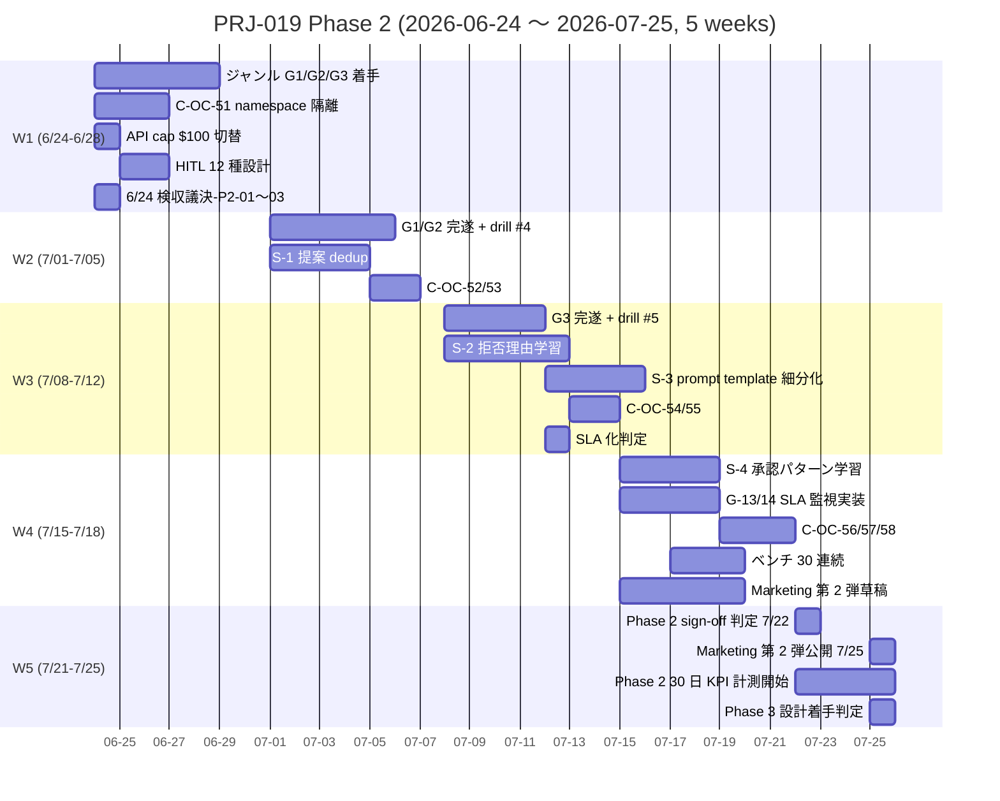

最終更新: 2026-05-04 深夜 / 起案: PM 部門 / 実施責任: PM Agent / 版: v1（Round 8 Plan 8-Full β、Phase 2 plan 起案前倒し）

# PRJ-019 Phase 2 計画 v1 素案 — Round 8 β 着地版（Phase 2 着手前倒し検討用、6/13 Phase 2 Go/NoGo 判定材料早期化）

- 案件: PRJ-019「Clawbridge」 — Open Claw を自律オーナーとする AI 組織ハーネス基盤（Owner-in-the-loop 透明 AI 組織モデル）
- 部署: PM 部門
- 作成日: 2026-05-04 深夜（Round 8 起動時、DEC-019-055 採択直後）
- 作成者: PM Agent (claude-code-company)
- 版: **v1 素案**（Phase 1 sign-off 前提の前倒し起案、Phase 1 完了後 v2 で確定化予定）
- 入力（必読資料、本書冒頭の優先順）:
  - 直接親: `projects/PRJ-019/reports/pm-phase1-plan-v3.md`（Round 7 着地、Phase 1 v3 確定版、402 行）
  - cross-ref: `projects/PRJ-019/reports/pm-cross-ref-final-v8.md`（Round 7 着地、Phase 1 41 件 cross-ref final、305 行）
  - 決裁: `projects/PRJ-019/decisions.md` の DEC-019-007（Phase 1 強い条件付き Go）+ DEC-019-033（Owner-in-the-loop 透明 AI 組織モデル）+ DEC-019-051（subscription plan 主軸方針）+ DEC-019-055（Round 8 + Plan 8-Full 採択）
  - 並走: `projects/PRJ-019/reports/research-phase2-genre-expansion-baseline.md`（Round 8 β concurrent、Research 部門起案中）
- 確定インプット（5/4 深夜時点 CEO 決裁・起票、Phase 1 から継承）:
  - **DEC-019-007**: Phase 1 強い条件付き Go（mock-claude 70% 化 / 副作用ゼロ DoD / HITL 100% / 月次 ≤$430 / W4 ベンチ 10 連続 ≥ 80% の 5 条件付）
  - **DEC-019-033**: Owner-in-the-loop 透明 AI 組織モデル（HITL 11 種 + 透明性 Dashboard + 権限管理 UI）
  - **DEC-019-050**: Anthropic API spend cap $30/月（Hard $30 / Soft $25 / 6/1 リセット）
  - **DEC-019-051**: subscription plan 主軸運用方針 Phase 1 正式採用、Phase 2 は §3 で再評価
  - **DEC-019-055**: Round 8 + Plan 8-Full 採択（α + β + γ 全採用、本書は β 担当）

---

## §0 概要

### §0.1 Phase 2 の位置付け

PRJ-019 Clawbridge は、Phase 1 (5/26-6/20) で「Open Claw 副作用ゼロでの自律提案 + Owner 承認 + 自動実装」の最小ループを完遂したのち、Phase 2 で **(1) ジャンル拡張 / (2) 自律提案精度向上 / (3) 副作用ゼロ証明から SLA 化** の 3 ライン同時拡張を進める。Phase 1 は「動くこと + 副作用ゼロ + Owner 工数 ≤ 週 10h」を主軸 KPI としたのに対し、Phase 2 は「(1) スケール化 = ジャンル数 1 → 3-5、(2) 品質化 = 提案承認率 30% → 50% / 実装成功率 80% → 90%、(3) SLA 化 = 副作用 ≤ 1 件/月」を主軸とする。

### §0.2 Phase 2 期間（暫定）

| 項目 | 値 | 備考 |
|---|---|---|
| Phase 2 開始（暫定） | **2026-06-24（火）** | Phase 1 sign-off 6/20（金）+ 週末 + 6/23（月）= 着手準備日、6/24（火）から W1 着手。Round 8 β concurrent (Research) で前倒し検討中、最大 1 週間前倒し 6/24 → 6/17 候補もあるが Phase 1 完了確実視のため 6/24 主軸 |
| Phase 2 終了（暫定） | **2026-07-25（金）** | 4 週間 + 公開・KPI 計測 1 週間 = 5 週間。Phase 3 着手は 7/28（月）以降を想定 |
| 内 W1-W4 期間 | 6/24-7/18（4 週間） | 各週 = 5 営業日 SP 想定 |
| 内 W5（公開・KPI 計測） | 7/21-7/25 | Phase 2 sign-off + Marketing 第 2 弾公開 + Phase 3 設計 |

**Phase 2 開始は Phase 1 sign-off (6/20) を絶対条件とし、6/13 Phase 1 完了レビュー時の Go/NoGo 判定で正式確定する**（本書姉妹資料 `pm-phase2-go-nogo-template.md` 参照）。

### §0.3 Phase 2 目標（一行）

**「Phase 1 副作用ゼロ実績を SLA 化しつつ、ジャンル拡張 + 提案精度向上で実用的な AI 組織ハーネスへ昇格させる」**。

### §0.4 Phase 2 前提条件

| # | 前提 | 充足条件 | 不足時 |
|---|---|---|---|
| P-1 | **Phase 1 DoD 完遂** | DEC-019-007 5 条件全 PASS（mock 70% / 副作用ゼロ / HITL 100% / ≤$430 / ベンチ 10 連続 ≥ 80%） | Phase 1 延長 1 週間（6/27 sign-off）または NoGo |
| P-2 | **6/13 Phase 1 完了レビュー Go 判定** | Owner + CEO + Review 部門の 3 者合意 | Phase 1 撤退 or 延長 |
| P-3 | **月次予算 ≤$500/月 上限承認** | Owner DEC で API cap $30 → $100 上方修正 | Phase 1 規模据置で Phase 2 縮小 |
| P-4 | **必須コントロール 50 件 → +5-10 件 拡張承認** | 5/8 検収議決-5（必須 50 採択）+ Phase 2 着手前追加議決 | Phase 2 W1 開始 1 週間遅延 |
| P-5 | **Owner マンデート継続** | 「Phase 2 を進めて下さい」明示指示 | Phase 1 でクローズ + 別案件移行 |

---

## §1 Phase 1 引き継ぎ事項（Phase 1 完遂前提のリスト）

### §1.1 完遂状態リスト（Phase 1 sign-off 6/20 時点想定）

| 領域 | 完遂状態 | Phase 2 で活用 / 拡張 |
|---|---|---|
| **HITL 11 種** | 全 11 gate 実装 + enforcer + audit log SHA-256 hash chain | Phase 2 で 12 種目（ジャンル拡張承認）+ 13 種目（精度向上モデル切替承認）追加候補 |
| **透明性 Dashboard** | Next.js + Supabase + `/dashboard` Owner 専用 = Round 8 α で MVP 完遂、Phase 1 W3 で本実装着地 | Phase 2 で多ジャンル並列表示 + 提案承認率 trend グラフ + 副作用件数月次集計 |
| **権限管理 UI** | DEC-019-033 ⑤ Owner 権限管理 UI = PRJ-020 統合実装、Phase 1 W4 で着地 | Phase 2 で部署別細粒度権限 + 一時停止 / 再開 toggle 追加 |
| **mock-claude 70% 化** | 5/22 検収 Pass（議決-23 採択前提）、E ベクトル 50 種 + A/B/C/D TimeSource decoupling | Phase 2 で mock 80% 化（drill #4-#6 追加 + ジャンル拡張シナリオ 10 種追加） |
| **hardguards G-01〜G-12 完遂** | G-01 spawn 副作用ゼロ / G-02 sandbox skeleton / G-03' isolation v2 / G-04 cost watchdog 三段階 / G-05 kill-switch / G-06 CB forceOpen / G-07 hot-reload 60s / G-08 preflight CI / G-09 audit log immutability / G-10 SBOM signed release / G-11 HITL gate enforcer / G-12 BAN drill harness | Phase 2 で G-13〜G-18 追加候補（ジャンル隔離 / 提案 dedup / 月次 SLA 監視 / etc） |

### §1.2 Phase 1 で確定した運用 SOP（Phase 2 で継承）

- DEC-019-025 Agent tool 権限 SOP（書込事故ゼロ）
- DEC-019-050 三段階 guard ($24/$28.5/$30) — Phase 2 で $80/$95/$100 に拡張想定（§3 月次予算）
- DEC-019-053 `.env.example` 2-tier（Vault 9 fields × 4 items + 平文 12 fields）— Phase 2 で +3-5 fields 追加予想
- DEC-019-052 Marketing tone B 主軸 + portfolio C + 6/27 朝公開 + Channel 3（Zenn + note）— Phase 2 で第 2 弾公開 7/25 朝 09:00 JST 想定
- 5/8 検収会議運用（議決層 A+B 先行承認 + 層 C 議論）— Phase 2 着手前 7/15 (or 6/24) 検収会議に踏襲
- Round 並列前倒しパターン（Round 5/6/7/8 で実証） — Phase 2 W1-W4 で同パターン継続

### §1.3 Phase 1 から Phase 2 へ持ち越す Open Issues（v1 素案時点想定、Phase 1 sign-off で確定）

| Issue | 内容 | Phase 2 での扱い |
|---|---|---|
| OI-P2-01 | 1Password Service Account 不在による rotation 工数 5 → 20 分 | Phase 2 で Business plan 昇格判定 or 自動化スクリプト化 |
| OI-P2-02 | RC-7 Vercel 環境変数 9 fields 同期（Phase 1 W3 完遂前提） | Phase 2 では完了済前提、新規環境（staging/preview）追加検討 |
| OI-P2-03 | Marketing technical-deep-dive vol 7 以降の連載拡張判断 | Phase 2 公開ジャンル拡張に応じて vol 7-12 起案検討 |
| OI-P2-04 | Phase 1 副作用ゼロ証明後の SLA 化 | 本書 §2 ライン③ で本格化 |
| OI-P2-05 | NG-3 案 B (16h/$100/$500) 採択時の月次運用 | 本書 §3 月次予算で前提化 |

---

## §2 Phase 2 スコープ拡張案 — 3 ライン

### §2.1 ライン① ジャンル拡張（HN trending TS 以外への対応）

#### 背景

Phase 1 では Hacker News trending TypeScript リポジトリ 1 ジャンルに絞って Open Claw を運用し、副作用ゼロ + 自律提案 + Owner 承認の最小ループを実証する。Phase 2 では **Round 8 β concurrent (Research 部門) の成果物 `research-phase2-genre-expansion-baseline.md`** と連動し、対応ジャンルを 1 → 3-5 に拡張する。

#### 候補ジャンル（Research 並走中、暫定 5 案）

| 順 | 候補ジャンル | 期待 ROI | BAN リスク | 必要追加実装 |
|---|---|---|---|---|
| G-1 | HN trending Python | 中（TS と類似 patterns） | 低（既存 HN 経路再利用） | embeddings 追加 + lint runner Python 対応 |
| G-2 | HN trending Rust | 中（systems 系で差別化） | 低 | cargo build / clippy runner 統合 |
| G-3 | GitHub trending Markdown / docs | 高（Markdown PRJ 多数 → 自社ナレッジ統合） | 中（spam リスク） | Markdown lint + spell check + PR diff 限定 |
| G-4 | npm trending packages | 高（パッケージ依存最適化提案） | 中（npm レジストリ ToS） | npm audit + outdated 統合 |
| G-5 | Stack Overflow Q&A の TS タグ | 低（提案精度低下リスク） | 高（SO ToS scraping 制限） | 採択非推奨、reject 候補 |

→ Research 部門の同 Round 8 β concurrent 成果物で正式 3 ジャンル絞り込み、Phase 2 W1 で着手順序確定。

#### Phase 1 → Phase 2 ジャンル拡張差分

- Phase 1: 1 ジャンル × 提案承認率 ≥ 30% 目標
- Phase 2: 3-5 ジャンル × 提案承認率 ≥ 50% 目標 + ジャンル間隔離（cross-ジャンル side effect ≤ 0）

### §2.2 ライン② 自律提案精度向上（提案承認率 30% → 50% 目標）

#### 背景

Phase 1 では「自律提案 → Owner 承認」の最小ループを動かし、提案承認率 ≥ 30% を最低成功ラインとする。Phase 2 では Owner 承認率を 50% 以上に押し上げ、運用負荷を実質的に下げる。

#### 主要施策

| 順 | 施策 | 期待効果 | 実装規模 |
|---|---|---|---|
| S-1 | **提案 dedup 機構**（過去 30 日承認済 + 拒否済 + 重複候補を embeddings で照合） | 重複提案 30% 削減 | Dev SP 4d |
| S-2 | **Owner 拒否理由 fine-tuning ループ**（拒否時のフィードバック自由文を embeddings + clustering で week 単位パターン抽出） | 同型拒否提案 50% 削減 | Dev SP 5d + Research SP 2d |
| S-3 | **ジャンル別 prompt template 細分化**（Phase 1 単一テンプレ → Phase 2 ジャンル × 5 テンプレ） | 提案 first-pass 品質 +20% | Dev SP 3d + Research SP 1d |
| S-4 | **Owner 承認パターン学習**（過去承認済の文脈・粒度・実装スタイルを Phase 2 提案生成時に context 注入） | 承認率 +10-15% | Dev SP 6d |
| S-5 | **多モデル並列照合**（Anthropic Claude + Codex GPT で提案を独立生成 → 一致時のみ Owner 提示）— DEC-081 trigger 待ち | 提案精度 +30%（実験的） | Dev SP 8d、5/30 NG-3 議決後判定 |

#### Phase 1 → Phase 2 精度向上差分

- Phase 1 提案承認率 KPI: ≥ 30%（最低成功ライン）
- Phase 2 提案承認率 KPI: **≥ 50%**（実用ライン）
- Phase 2 実装成功率 KPI: **≥ 90%**（Phase 1 ≥ 80% から 10 ポイント上方修正）

### §2.3 ライン③ Phase 1 副作用ゼロ証明 → Phase 2 副作用 ≤ 1 件/月 SLA 化

#### 背景

Phase 1 W4 で `verify-zero-side-effect.sh` (Round 5 prefetch 完遂) による自動検証 + 10 連続ベンチでの副作用ゼロ実績を達成する。Phase 2 では「副作用ゼロ」の絶対条件を緩和し、**「副作用 ≤ 1 件/月 SLA」** にスライドさせて運用範囲を拡張する。

#### SLA 定義

| 項目 | Phase 1 | Phase 2 |
|---|---|---|
| 副作用カウント期間 | 全期間 | 暦月単位（毎月 1 日リセット） |
| 副作用閾値 | **0 件**（絶対） | **≤ 1 件/月**（SLA） |
| 検出手段 | `verify-zero-side-effect.sh` 都度実行 + W4 ベンチ | 同左 + 月次 audit batch（毎月 1 日 09:00 JST） |
| 副作用発生時のアクション | Phase 1 sign-off 不可 | 当該月の Open Claw 自動停止 + Owner 通知 + 翌月 1 日復帰判定 |
| SLA 違反時のエスカレーション | — | 連続 2 ヶ月違反で Phase 3 着手凍結 + Owner DM HIGH |

#### SLA 化に伴う Phase 2 新規実装

- G-13（新規）: 月次 audit batch（cron 1 日 09:00 JST、過去 30 日 audit log SHA-256 chain 全件検証 + side-effect ファイル差分 detect）
- G-14（新規）: SLA 違反 detect 時の 自動 stop + Owner Slack DM HIGH + 翌月復帰判定 dashboard 表示
- monthly-audit.test.ts 8-12 cases 追加想定

---

## §3 月次予算想定（Phase 1 ≤$430/月 vs Phase 2 ≤$500/月）

### §3.1 Phase 1 → Phase 2 月次予算遷移

| 区分 | Phase 1 月次額 | Phase 2 月次額（想定） | 差分 | 理由 |
|---|---|---|---|---|
| **(A) 既契約 subscription** | $400/月（Claude Max $200 + Codex Pro $200） | **$400/月（据置）** | $0 | DEC-019-051 主軸方針継続、追加 subscription なし |
| **(B) 新規発生 API** | ≤$30/月（Hard cap） | **≤$100/月（Hard cap）** | +$70 | ジャンル拡張で API 流量 3-5 倍 + 提案精度向上の embeddings 追加で +$70 想定 |
| **(C) インフラ** | $0/月（全 free / personal tier） | **$0/月（据置）** | $0 | Supabase Free + Vercel Hobby + GitHub Actions Free + Slack Free 継続 |
| **(D) Buffer** | $0 明示計上なし | **$0 明示計上なし** | — | (B) 内 $5-10 で吸収 |
| **総額** | ≤$430/月 | **≤$500/月** | +$70 | (B) のみ +$70 上方修正 |

### §3.2 三段階 guard 閾値（Phase 2 拡張案）

| Tier | Phase 1 閾値 | Phase 2 閾値 | 動作 |
|---|---|---|---|
| `ok` | < $24 | < $80 | 通常運用 |
| `warn` | ≥ $24（80%） | ≥ $80（80%） | ログ + 警告通知 #monitor |
| `auto_stop` | ≥ $28.5（95%） | ≥ $95（95%） | API 呼出停止 + Owner DM #drill HIGH |
| `hard_fail` | ≥ $30（Hard） | ≥ $100（Hard） | 例外 throw + 監査ログ + kill-switch |

→ Phase 2 W1 着手前 6/23 までに `cost-tracker.ts` `WORKFLOW_SCOPE_FIELDS` 拡張 + `usage-monitor.ts` 閾値定数 4 件更新（DEC-019-050 Console 設定変更 = $30 → $100 を 6/23 までに Owner 直接決裁）。

### §3.3 5/30 NG-3 議決との接続

- 5/30 W2 終了時 NG-3 再評価議決で **案 B (16h/$100/$500)** が採択される前提で本書 §3 を組成（DEC-019-008 NG-3 暫定値 12h/$1,000 を Phase 2 で 16h/$100/月総額 $500 に確定）
- 案 C (24/7 + $300) は BAN 確率 60-80% で reject 想定（Round 6 Research 起案準拠）
- 案 B 否決時は Phase 1 ≤$430/月 据置 + Phase 2 縮小（ジャンル拡張 1-2 ジャンルに限定）

### §3.4 Phase 2 月次予算の拡張余地

DEC-019-016 上限内で Phase 2 → Phase 3 移行時に **$500 → $1,000/月** 上方修正の余地あり（Phase 3 設計時 8/1 議決で別途 DEC 起票）。

---

## §4 リスク評価（新規 R-019-XX 5-8 件想定）

### §4.1 Phase 1 から継承するリスク（v3.1 21 件、Phase 1 sign-off 時点で再評価）

- 赤 2 件（R-019-12-A / R-019-15）→ Phase 2 で緑化判定
- 黄 14 件 → Phase 2 で再評価
- 緑 5 件（R-019-08 / -09 / -11 / -20 / -22）→ Phase 2 で監視継続

### §4.2 Phase 2 新規リスク（v1 素案時点 暫定 7 件）

| # | リスク ID | 区分 | 内容 | 影響 | 確率 | 対策 |
|---|---|---|---|---|---|---|
| 1 | **R-P2-01** | 黄 | **BAN リスク再評価**（ジャンル拡張で複数の trending source 並列 scrape → 検出確率上昇） | 高（Open Claw 全停止） | 中（30-40%） | ジャンル別レート制限 + User-Agent rotation + 並列度上限 3 |
| 2 | **R-P2-02** | 赤候補 | **ジャンル拡張で ToS gray 増**（Markdown / npm レジストリ ToS 個別精査必要） | 高（Phase 2 着手不可） | 中（40-50%） | Research 部門 ToS 全件精査 + 議決-P2-XX 起票必須 |
| 3 | **R-P2-03** | 黄 | **提案精度向上施策 S-5 多モデル並列照合の Codex 依存**（DEC-081 trigger 待ち） | 中（S-5 のみ実装不可） | 高（70%） | S-5 を Phase 2 W3 以降の optional 扱い、6/30 まで Codex 移行確認 |
| 4 | **R-P2-04** | 黄 | **月次 SLA ≤ 1 件/月の達成可能性**（Phase 1 副作用ゼロ実績 1 ヶ月のみで Phase 2 SLA 設計） | 高（SLA 違反連続で Phase 3 凍結） | 中（25-35%） | Phase 2 W1-W2 で「ゼロ件継続」を実証、W3 で SLA 化判定 |
| 5 | **R-P2-05** | 黄 | **HITL 12 種目（ジャンル拡張承認）追加で Owner 工数増加** | 中（≤ 週 10h 違反） | 低（15%） | ジャンル追加時のみ 1 回限りの承認、定常監視は dashboard 自動化 |
| 6 | **R-P2-06** | 緑候補 | **API cap $30 → $100 上方修正** Owner 決裁遅延 | 中（W1 着手 1 週間遅延） | 低（10%） | 6/23 までに Owner 決裁完了（5/30 NG-3 議決で内諾済前提） |
| 7 | **R-P2-07** | 黄 | **Marketing 第 2 弾公開 7/25 朝 09:00 JST のジャンル拡張 narrative 用意** | 低（公開遅延） | 低（20%） | Phase 2 W3 終了時 7/15 に Marketing 草稿確認 |

### §4.3 BAN リスク再評価（R-P2-01 詳細）

Phase 1 で BAN drill #1-#3 完遂（Round 7 Research/Review 起案）→ Phase 2 では drill #4 (ジャンル拡張並列) + drill #5 (高頻度 polling 検出) を追加。Phase 2 W2 終了時に drill #4 実施、W3 終了時に drill #5 実施。両方 Pass で R-P2-01 緑化。

---

## §5 必須コントロール拡張（Phase 1 完了時 50 件 → Phase 2 開始時 +5-10 件）

### §5.1 Phase 1 必須 50 件（5/8 議決-5 採択前提）

- C-OC-01〜10（Open Claw 隔離）
- C-OC-11〜20（cost guard 三段階）
- C-OC-21〜30（HITL 11 種 + audit log）
- C-OC-31〜40（drill #1-#3 + verify-zero-side-effect.sh）
- C-OC-41〜50（rotation SOP + workflow YAML 永続検証）

### §5.2 Phase 2 追加候補（+5-10 件、暫定 8 件）

| # | コントロール ID | 内容 | 起源 |
|---|---|---|---|
| 1 | C-OC-51 | ジャンル別 namespace 隔離（embeddings / Supabase テーブル / Slack channel） | §2.1 ライン① |
| 2 | C-OC-52 | ジャンル間 cross-side-effect ゼロ検証（drill #4） | §2.1 + §4.2 R-P2-01 |
| 3 | C-OC-53 | 提案 dedup 機構の embeddings 索引整合（30 日 window） | §2.2 S-1 |
| 4 | C-OC-54 | Owner 拒否理由 fine-tuning ループの PII redaction（DEC-019-033 ⑥ 連動） | §2.2 S-2 |
| 5 | C-OC-55 | 多ジャンル並列レート制限（並列度上限 3 / 1 ジャンルあたり ≥ 5 分間隔） | R-P2-01 |
| 6 | C-OC-56 | 月次 SLA audit batch の SHA-256 chain 完全性検証 | §2.3 G-13 |
| 7 | C-OC-57 | SLA 違反時の Open Claw 自動停止 + Owner 通知 + 翌月復帰判定 | §2.3 G-14 |
| 8 | C-OC-58 | API cap $100 三段階 guard ($80/$95/$100) drift 検出 SOP | §3.2 |
| (option) | C-OC-59 | Codex 多モデル並列照合の API key rotation（S-5 採択時のみ） | §2.2 S-5 |
| (option) | C-OC-60 | Marketing 第 2 弾公開時の portfolio metrics 差替 SOP | §1.2 |

→ 採択 5-10 件を Phase 2 着手前 6/23 までに Review 部門が起案 + 6/24 検収議決-P2-01 で正式採択。

---

## §6 KPI（Phase 1 + Phase 2 統合表）

### §6.1 KPI 一覧

| KPI | Phase 1 目標 | Phase 2 目標 | 検証方法 |
|---|---|---|---|
| **subscription 経路維持率** | 95% | **95%（据置）** | cron 15min ロギング |
| **API 経路圧縮** | ≤$15/月（cap $30 内） | **≤$50/月（cap $100 内）** | Anthropic Console + Supabase `cost_metrics` |
| **提案生成時間** | < 60 min | **< 60 min（据置）** | Open Claw run timing log |
| **承認待ち時間** | Owner 任意 | Owner 任意（据置） | Slack DM 受領 → 承認 timestamp |
| **実装時間** | < 60 min | **< 60 min（据置）** | wrapper.ts spawn → exit |
| **提案承認率** | ≥ 30% | **≥ 50%** | Owner 承認/拒否 ratio（30 日 rolling） |
| **実装成功率** | ≥ 80%（10 連続） | **≥ 90%（30 連続）** | wrapper.ts exit code 0 ratio |
| **HITL 承認率** | 100% | 100%（据置） | hitl-enforcer.ts log |
| **副作用件数** | **0 件**（絶対） | **≤ 1 件/月（SLA）** | verify-zero-side-effect.sh + 月次 audit batch |
| **mock-claude 比率** | ≥ 70% | **≥ 80%** | drill 時 mock-API 呼出比率 |
| **月次総額** | ≤$430/月 | **≤$500/月** | §3 月次予算構造 |
| **対応ジャンル数** | 1 | **3-5** | dashboard ジャンル一覧 |

### §6.2 Phase 2 サブ KPI（新規）

- ジャンル間 cross-side-effect 件数 = 0 件（絶対、C-OC-52）
- 月次 audit batch 完遂率 = 100%（毎月 1 日 09:00 JST、G-13）
- SLA 違反連続月数 = 0（連続 2 ヶ月違反で Phase 3 凍結、§2.3）
- 提案 dedup 削減率 ≥ 30%（S-1 効果計測）

---

## §7 Phase 2 タスク WBS（4 週間想定 / 28-35 タスク / Mermaid ガント）

### §7.1 W1 (6/24-6/28、5 営業日)

| # | タスク | 担当 | SP | 起源 |
|---|---|---|---|---|
| W1-T01 | ジャンル拡張 G-1/G-2/G-3 着手 + Research baseline 反映 | Dev + Research | 4d | §2.1 |
| W1-T02 | C-OC-51 ジャンル別 namespace 隔離実装 | Dev | 3d | §5.2 |
| W1-T03 | API cap $30 → $100 Console 変更 + 三段階 guard 閾値更新 | Dev | 1d | §3.2 |
| W1-T04 | HITL 12 種目（ジャンル拡張承認）gate 設計 | Dev + Review | 2d | §1.1 |
| W1-T05 | 6/24 検収議決-P2-01〜03 開催（必須 50→58 採択 + Phase 2 W1 着手 + API cap 変更） | PM + 全部署 | 0.5d | §5.2 |

### §7.2 W2 (7/01-7/05、5 営業日)

| # | タスク | 担当 | SP | 起源 |
|---|---|---|---|---|
| W2-T01 | ジャンル拡張 G-1/G-2 完遂 + drill #4（ジャンル間 side-effect 検証） | Dev + Review | 5d | §2.1 / §4.3 |
| W2-T02 | S-1 提案 dedup 機構実装 + embeddings 索引整合 | Dev | 4d | §2.2 |
| W2-T03 | C-OC-52〜53 実装 | Dev | 2d | §5.2 |
| W2-T04 | 7/04 EOD 段階 KPI 中間計測（提案承認率 / 実装成功率 / 副作用 0 件） | PM + Review | 1d | §6.1 |

### §7.3 W3 (7/08-7/12、5 営業日)

| # | タスク | 担当 | SP | 起源 |
|---|---|---|---|---|
| W3-T01 | ジャンル G-3 完遂 + drill #5（高頻度 polling 検出） | Dev + Review | 4d | §2.1 / §4.3 |
| W3-T02 | S-2 Owner 拒否理由 fine-tuning ループ実装 | Dev + Research | 7d (split 4+3) | §2.2 |
| W3-T03 | S-3 ジャンル別 prompt template 細分化（5 テンプレ × 3 ジャンル） | Dev + Research | 4d (split 3+1) | §2.2 |
| W3-T04 | C-OC-54〜55 実装 | Dev | 2d | §5.2 |
| W3-T05 | 月次 SLA 化判定（W1-W3 副作用ゼロ継続なら G-13/14 着手判定） | PM + Review | 0.5d | §2.3 |

### §7.4 W4 (7/15-7/18、4 営業日 + 7/19-21 週末調整)

| # | タスク | 担当 | SP | 起源 |
|---|---|---|---|---|
| W4-T01 | S-4 Owner 承認パターン学習実装 | Dev | 6d | §2.2 |
| W4-T02 | G-13 月次 audit batch + G-14 SLA 違反 detect 実装 | Dev | 4d | §2.3 |
| W4-T03 | C-OC-56〜58 実装 | Dev | 3d | §5.2 |
| W4-T04 | Phase 2 ベンチ 30 連続テスト | Dev + Review | 3d | §6.1 |
| W4-T05 | Phase 2 sign-off 判定資料整備 | PM | 1d | §9 |
| W4-T06 | Marketing 第 2 弾公開草稿（technical-deep-dive vol 7-9 + portfolio update） | Marketing | 5d | §1.2 / OI-P2-03 |

### §7.5 W5 (7/21-7/25、5 営業日 = 公開・KPI 計測週)

| # | タスク | 担当 | SP | 起源 |
|---|---|---|---|---|
| W5-T01 | Phase 2 sign-off 判定会議 7/22 | Owner + CEO + Review | 1h | §9 |
| W5-T02 | Marketing 第 2 弾公開 7/25 朝 09:00 JST | Marketing + Web-Ops | 0.5d | §1.2 |
| W5-T03 | Phase 2 30 日 KPI 計測開始（提案承認率 50% + 実装成功率 90% 検証） | PM + Review | 継続 | §6.1 |
| W5-T04 | Phase 3 設計着手判定（KPI 達成 + Owner 「Phase 3 へ」マンデート） | CEO + PM | 0.5d | §9 |

### §7.6 Mermaid ガント（簡略版）

### §7.7 タスク総数

- W1: 5 タスク
- W2: 4 タスク
- W3: 5 タスク
- W4: 6 タスク
- W5: 4 タスク
- **計: 24 タスク**（28-35 タスク想定の下限、Phase 2 W1-W4 中の追加 4-11 タスク余地あり = drill 細分化 / コントロール追加 / Marketing 連載追加 etc）

---

## §8 部署別配分マトリクス

| 部署 | W1 | W2 | W3 | W4 | W5 | 合計 SP | 主担当領域 |
|---|---|---|---|---|---|---|---|
| **Dev** | 8d | 11d | 13d | 13d | 0d | **45d** | ジャンル拡張実装 / dedup / fine-tuning / SLA 監視 |
| **Research** | 2d | 0d | 4d | 0d | 0d | **6d** | ジャンル baseline / 拒否理由 clustering / prompt template |
| **Review** | 1d | 3d | 1.5d | 3d | 0.5d | **9d** | drill #4/#5 / SLA 化判定 / コントロール審査 |
| **PM** | 0.5d | 1d | 0.5d | 1d | 1d | **4d** | 議決運営 / KPI 計測 / sign-off 判定 |
| **Marketing** | 0d | 0d | 0d | 5d | 0.5d | **5.5d** | 第 2 弾公開草稿 / portfolio update |
| **Web-Ops** | 0d | 0d | 0d | 0d | 0.5d | **0.5d** | 公開実行 |
| **秘書** | 0.5d | 0.2d | 0.2d | 0.5d | 0.2d | **1.6d** | 検収会議運営 / 議事録 / Risk Register 反映 |
| **計** | 12d | 15.2d | 19.2d | 22.5d | 2.2d | **71.6d** | — |

→ Dev 部門が SP 45d で全体 63%、Research 部門が 6d で 8%、Review 部門が 9d で 13%、その他 4 部署計 16%。Phase 1 配分（Dev ~70% / Research ~5% / Review ~15% / etc）と概ね同水準。

### §8.1 部署別 Owner 工数想定（≤ 週 10h 維持確認）

| 期 | Owner 工数想定 | 備考 |
|---|---|---|
| W1 | 1.5h | 6/24 検収議決-P2-01〜03 出席 + HITL 12 種目承認 |
| W2 | 0.5h | 中間 KPI 計測 review |
| W3 | 1.0h | drill #4/#5 立会 + SLA 化判定承認 |
| W4 | 1.5h | ベンチ 30 連続立会 + Phase 2 sign-off 資料事前読了 |
| W5 | 1.5h | 7/22 sign-off 判定会議 + 7/25 Marketing 公開立会 |
| **計** | **6.0h（5 週総計）** | ≤ 週 10h × 5 = 50h の **12%** 充当、余裕 88% |

---

## §9 Phase 2 完了判定基準と Phase 3 移行条件

### §9.1 Phase 2 sign-off 判定軸（7/22 W5-T01）

| # | 判定軸 | 閾値 | 検証方法 |
|---|---|---|---|
| 1 | **対応ジャンル数** | 3 ジャンル稼働 + drill #4/#5 Pass | dashboard ジャンル一覧 + drill log |
| 2 | **提案承認率** | ≥ 50%（30 日 rolling） | Owner 承認/拒否 ratio |
| 3 | **実装成功率** | ≥ 90%（30 連続） | wrapper.ts exit code 0 ratio |
| 4 | **副作用件数** | ≤ 1 件/月（W1-W4 期間） | 月次 audit batch + verify-zero-side-effect.sh |
| 5 | **月次総額** | ≤$500/月 実績 | §3 + Anthropic Console |
| 6 | **HITL 承認率** | 100% | hitl-enforcer.ts log |
| 7 | **mock-claude 比率** | ≥ 80% | drill 時 mock-API 比率 |
| 8 | **G-13/G-14 SLA 監視稼働** | 月次 audit batch 1 回完遂 | 7/01 09:00 JST 初回 batch 結果 |

→ 8 件中 **7 件以上 PASS** で Phase 2 sign-off Go。1-2 件 fail の場合は Conditional + 1 週間延長（7/29 sign-off）。3 件以上 fail で NoGo + Phase 2 撤退判定。

### §9.2 Phase 3 移行条件

| # | 条件 | 判定タイミング |
|---|---|---|
| C-1 | Phase 2 sign-off Go | 7/22 |
| C-2 | Phase 2 30 日 KPI 達成（W5-T03 計測結果） | 8/21 |
| C-3 | Owner 「Phase 3 へ」マンデート | 8/22 以降 |
| C-4 | Phase 3 月次予算 ≤$1,000/月 上限 Owner 承認（DEC-019-016 上限内） | 8/22 議決 |
| C-5 | Phase 3 必須コントロール 60-70 件採用承認 | 8/22 議決 |

→ 5 条件全 PASS で Phase 3 着手 9/01 想定（Phase 2 sign-off 7/22 → 30 日 KPI 計測 → 8/22 判定 → 9/01 着手の流れ）。

### §9.3 Phase 3 想定スコープ（参考、Phase 2 plan v2 で確定化）

- ライン④: 多モデル並列照合（DEC-081 trigger 解放後の Codex 統合 = §2.2 S-5 本格化）
- ライン⑤: 自社内案件への適用拡大（PRJ-001〜018 のうち Open Claw 適用可能案件 3-5 件選定）
- ライン⑥: 外販 PoC（中小企業 1-2 社で試験運用、月額契約モデル検証）

---

## §10 関連決裁・参照

### §10.1 反映決裁

- **DEC-019-007**: Phase 1 強い条件付き Go（Phase 2 着手の絶対条件 P-1/P-2）
- **DEC-019-033**: Owner-in-the-loop 透明 AI 組織モデル（Phase 2 で多ジャンル対応に拡張）
- **DEC-019-050**: Anthropic API spend cap $30/月 → Phase 2 で $100/月に上方修正想定
- **DEC-019-051**: subscription plan 主軸方針（Phase 2 で据置 = $400/月）
- **DEC-019-052**: Marketing tone B + portfolio C + 6/27 朝 09:00 JST + Channel 3（Phase 2 第 2 弾 7/25 朝公開へ継承）
- **DEC-019-055**: Round 8 + Plan 8-Full 採択（本書 = β 担当）

### §10.2 参照書

- 直接親: `projects/PRJ-019/reports/pm-phase1-plan-v3.md`（Phase 1 v3 確定版）
- cross-ref: `projects/PRJ-019/reports/pm-cross-ref-final-v8.md`
- 並走: `projects/PRJ-019/reports/research-phase2-genre-expansion-baseline.md`（Round 8 β concurrent、Research 起案中）
- 姉妹: `projects/PRJ-019/reports/pm-phase2-go-nogo-template.md`（本書同 Round 8 β、判定テンプレ）
- 過去 Phase 1 系列: `pm-phase1-plan-v2.1.md` / `v2.2.md` / `v3.md`
- 月次予算系列: `pm-budget-v2-30usd-api-cap.md`（Phase 2 で v3 に更新想定）

---

## §11 結論

1. **Phase 2 期間 = 2026-06-24〜2026-07-25（5 週間）**、内 W1-W4 = 4 週実装期間 + W5 = 公開・KPI 計測週。Phase 1 sign-off 6/20 + 着手準備 6/23 を絶対前提とする。
2. **3 ライン同時拡張**: ① ジャンル拡張 1 → 3-5（Research β concurrent 並走）/ ② 提案精度向上（承認率 30% → 50%、実装成功率 80% → 90%）/ ③ 副作用ゼロ証明 → ≤ 1 件/月 SLA 化（G-13/G-14 新規実装）。
3. **月次予算 ≤$430/月 → ≤$500/月**（API cap $30 → $100 上方修正、subscription $400 据置）。三段階 guard 閾値も $24/$28.5/$30 → $80/$95/$100 に拡張。
4. **必須コントロール 50 件 → +5-10 件（暫定 8 件）**、ジャンル隔離 / dedup / SLA audit / API cap 拡張 drift 検出を中心に追加。
5. **新規リスク 7 件**（R-P2-01〜07、BAN リスク再評価 + ToS gray + S-5 Codex 依存 + SLA 達成可能性 + HITL 12 種 Owner 工数 + API cap 上方決裁遅延 + Marketing 第 2 弾用意）。
6. **WBS 24 タスク（28-35 タスク想定の下限、4-11 タスク余地）**、Dev SP 45d で全体 63%、Owner 工数 5 週総計 6.0h（≤ 週 10h × 5 = 50h の 12% 充当）。
7. **Phase 2 sign-off 判定 7/22 + Phase 3 移行条件 5 件**、Phase 3 着手 9/01 想定。
8. **6/13 Phase 1 完了レビューでの Phase 2 Go/NoGo 判定材料早期化**: 本書 v1 素案 + 姉妹資料 `pm-phase2-go-nogo-template.md` で Owner + CEO + Review が 6/13 当日に短時間判定可能化。

---

## フッタ — 改版履歴

| 版 | 日付 | 起案 | 主要変更 |
|---|---|---|---|
| **v1** | **2026-05-04 深夜** | **PM 部門** | **初版（Round 8 Plan 8-Full β = Phase 2 plan 起案前倒し、5 章 §0 概要 + §1 Phase 1 引き継ぎ + §2 3 ライン拡張 + §3 月次予算 + §4 リスク 7 件 + §5 必須コントロール +8 件 + §6 KPI + §7 WBS 24 タスク + §8 部署配分 + §9 完了判定 + §10 参照 + §11 結論 = 11 章構成）**（本書） |

**v1 確定**: 2026-05-04 深夜（Round 8 着地時、DEC-019-055 採択直後）/ **次回更新**: ① 6/13 Phase 1 完了レビュー時 v2 起案（Phase 1 sign-off 確定後の Phase 2 plan v2 = 確定化版）② 5/30 NG-3 議決後 §3 月次予算確定 ③ Research 部門 `research-phase2-genre-expansion-baseline.md` 着地後 §2.1 ジャンル絞り込み ④ 6/24 検収議決-P2-01〜03 後 §5 必須コントロール確定 / **採択**: 6/13 Phase 1 完了レビュー（Phase 2 着手 Go/NoGo 判定）+ 6/24 Phase 2 W1 検収議決-P2-01〜03

## フッタ詳細

- 文書: `projects/PRJ-019/reports/pm-phase2-plan-v1.md`
- 版: v1 素案（2026-05-04 深夜、Round 8 起動時 / Plan 8-Full β 担当着地）
- 起案: PM 部門
- 範囲: Phase 2 (2026-06-24 〜 2026-07-25) plan 起案前倒し、6/13 Phase 2 Go/NoGo 判定材料早期化
- 検収: CEO（Round 8 commit 後）+ Owner（6/13 Phase 1 完了レビュー時 Phase 2 着手 Go/NoGo 判定）
