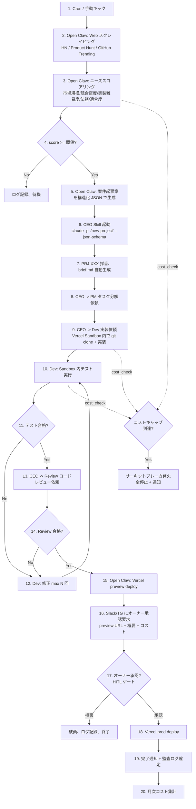

# PRJ-019 Phase 0 要件定義 & アーキテクチャ設計書

- 案件: PRJ-019「Clawbridge（仮）」 — Open Claw を自律オーナーとする AI 組織ハーネス基盤
- 部署: PM 部門
- 起案日: 2026-05-02
- 起案者: PM Agent (claude-code-company)
- 入力: `brief.md` v1 / `research-openclaw-harness-investigation.md`（リサーチ部門徹底調査） / `risks.md` v1 / `organization/rules/*`
- 想定読者: CEO（最終受領）、オーナー（最終決裁）、レビュー部門（セキュリティ評価入力）、Phase 1 着手時の Dev 部門
- 性質: **実装着手前の要件・設計書**。本書の内容で「実装可能な状態まで」確定させ、不明点は §9 オープン論点に逃がす

---

## 0. 文書概要と読み方

本書はリサーチ部門の徹底調査（`research-openclaw-harness-investigation.md`、以下「リサーチ報告書」）で確定した制約条件を**全面的に踏襲**し、PM 部門として「Phase 1 PoC に踏み込める粒度」まで要件・設計を落とし込んだものである。

**確定済の制約条件（リサーチ報告書より、本書では再議論しない）**:

1. Open Claw は Peter Steinberger 作 MIT OSS（github.com/openclaw/openclaw）。clawbro.ai はマネージドホスト業者で OSS 自体とは別法人
2. **Anthropic Pro/Max OAuth の第三者ツール駆動は ToS 違反**。Claude Code は **Anthropic API キー（従量課金）駆動が必須**
3. OpenAI ToS は 24/7 自律稼働について灰色 → **人間最終承認ゲート前提**で設計
4. 推奨構成: Codex サブスク（Open Claw 駆動） + Anthropic API キー（Claude Code 駆動） + Vercel Sandbox（生成コード隔離）
5. 月額コスト現実レンジ: PoC $80〜$280 / 中運用 $600〜$1,720 / 重運用 $2,300〜$5,800+

本書の構成は brief.md `§ 必須要件` および CEO/PM への要件定義依頼書の「必須セクション」に 1:1 対応する。

---

## 1. プロジェクト目的とスコープ

### 1.1 プロジェクト目的（Vision）

claude-code-company 組織の「オーナー位置」に Open Claw を据え、人間オーナーが手元で逐次承認しなくても **「Web 情報からニーズ抽出 → 案件起票 → 開発 → テスト → デプロイ準備 → 通知」** までを自律実行する AI 組織ハーネス基盤を確立する。最終的に「人間が見ていない時間に、勝手に Web アプリの草案が積み上がっている」状態を Full Win とする。

### 1.2 スコープ（IN）

| # | スコープ項目 |
|---|---|
| IN-01 | Open Claw（OSS、ローカル/自前 VPS 自前ホスト）を制御主体とするハーネス基盤の **設計・PoC 実装** |
| IN-02 | claude-code-company 組織の各部署スキル（CEO / PM / Dev / Research / Review / Secretary / Marketing / Web-Ops）を、Open Claw から非対話で起動できるように改修 |
| IN-03 | Web ニーズ判定ループの最小実装（HN / Product Hunt / GitHub Trending を主データソースに） |
| IN-04 | 生成コードの**隔離実行**（Vercel Sandbox など Firecracker microVM） |
| IN-05 | 公開・課金・force push・prod deploy・外部 API 連携の 5 ゲートでの **人間承認 (HITL)** 必須化 |
| IN-06 | 監査ログ・コスト監視・キルスイッチ・サーキットブレーカーの実装 |
| IN-07 | オーナー個人 dogfooding を前提とする運用形態 |

### 1.3 スコープ外（OUT）

| # | 非スコープ項目 | 理由 |
|---|---|---|
| OUT-01 | **完全な人間不在運用**（公開・課金・本番 deploy の自動化） | リサーチ報告書 §10、日本法・ToS リスクで「最終承認ゲート前提」と確定 |
| OUT-02 | Anthropic Pro/Max OAuth 経由での Claude Code 駆動 | ToS 違反、API キー駆動に置換 |
| OUT-03 | ChatGPT Codex x5 アカウントの並列濫用利用 | リサーチ §3.2、Pro $200 1 アカウントへの統合を推奨 |
| OUT-04 | 第三者への配布・SaaS 化・商用提供 | brief.md §1.2、本案件は dogfooding 限定 |
| OUT-05 | 既存運用中プロダクト（PRJ-005/009/015/017 等）への自動書込 | risks.md R-019-04、暴走連鎖防止 |
| OUT-06 | 個人情報・商用取引・SaaS 認証・メディア機能を含む Web アプリの自動公開 | リサーチ §10.3、日本国内法リスク |
| OUT-07 | Reddit Data API / X Enterprise API を主データソースとするニーズ判定 | リサーチ §6.1、商用ライセンス費用および GummySearch 倒産事例 |
| OUT-08 | clawbro.ai（マネージドホスト）への依存 | OSS を自前ホストすることでベンダーロックイン回避（リサーチ §2.2） |

### 1.4 成功定義（Phase ごとの KPI）

| Phase | KPI（定量） | KPI（定性） |
|---|---|---|
| **Phase 0**（本フェーズ） | 要件定義書 + セキュリティ評価レポート完成、§10 Go/NoGo 基準を全項目評価 | CEO が DEC-019-XXX で Phase 1 Go/NoGo を**判断可能な情報**が揃う |
| **Phase 1**（PoC） | Open Claw → claude-code-company の **1 タスク自動化成功**（例: 既存 PRJ の進捗 status 取得を Open Claw 経由で実行）、月額コスト < $300 | ハーネスが設計通りに権限を制限していることをレビュー部門が承認 |
| **Phase 2**（最小ループ） | **1 アプリの草案完成までを自律ループで再現**（ニーズ判定 → 起票 → 草案コード生成 → サンドボックス内テスト → オーナー通知）、月額コスト < $1,000 | 5 ゲート HITL が全て期待通りに機能、誤起動 0 件 |
| **Phase 3**（並列・最適化） | 並列 3 案件同時進行、モデル階層化と prompt caching でコスト 50% 削減 | 24h 自律稼働で人間介入回数が 1 アプリあたり < 5 回 |
| **Phase 4**（公開・運用） | （要再検討）SaaS 化 or 法人運用への拡張可否を別案件として起案 | — |

---

## 2. ペルソナとユースケース

### 2.1 ステークホルダー一覧

| アクター | 種別 | 関与点 |
|---|---|---|
| **オーナー（人間、ai-lab@improver.jp）** | Human | 最終承認、停止、レポート確認、月次コストレビュー、ガードレール変更決裁 |
| **Open Claw（自律オーナー、OSS ランタイム）** | Autonomous AI | Web ニーズ判定 / 案件起票 / CEO への指示 / 進捗チェック / テスト指示 / 通知 |
| **claude-code-company CEO（既存）** | AI Skill | Open Claw からの指示を受領、各部署へ分配、ボトムアップサマリ作成 |
| **claude-code-company 各部署（PM/Dev/Research/Review/Secretary/Marketing/Web-Ops）** | AI Skill | 既存ロールに従い専門業務を遂行 |
| **Vercel Sandbox（実行環境）** | External Service | 生成コードの隔離実行、ビルド、テスト |
| **GitHub** | External Service | リポジトリ管理、CI |
| **Vercel（デプロイ）** | External Service | preview deploy（自動）、prod deploy（HITL） |
| **通知系（Slack / Telegram / Email）** | External Service | オーナーへの承認要求、コスト警報、エラー通知 |
| **監査ログ（Supabase）** | External Service | 全操作 trace 保存、コスト集計 |

### 2.2 主要ユースケース

#### UC-01: 自律的な案件起票
- **トリガ**: 定期スケジュール（例: 1 日 1 回） or オーナー手動キック
- **アクター**: Open Claw → CEO（claude-code-company）
- **フロー**:
  1. Open Claw が HN / Product Hunt / GitHub Trending を取得
  2. Open Claw 内蔵 LLM（Codex サブスク）で各アイテムをスコアリング
  3. Top-N を選定し、`/new-project` 相当の構造化 JSON を生成
  4. CEO スキルを非対話モードで起動し、案件登録を依頼
  5. 結果（PRJ-XXX 採番、brief.md パス）を Open Claw が受領
- **HITL ゲート**: 起票時点では発生しない（書込先が `projects/PRJ-XXX/` に限定されるため）

#### UC-02: 開発タスクの実行と進捗確認
- **トリガ**: UC-01 で起票された案件の `tasks.md` 進行
- **アクター**: Open Claw → CEO → Dev → Review
- **フロー**:
  1. Open Claw が CEO に「PRJ-XXX の Phase 1 着手」を指示
  2. CEO が PM/Dev に分配、Dev が Vercel Sandbox 内でコード生成
  3. Dev が Sandbox 内でテスト実行、結果を CEO 経由で Open Claw に報告
  4. Open Claw が Review にコードレビュー依頼
- **HITL ゲート**: なし（Sandbox 内のため副作用なし）

#### UC-03: デプロイと公開（HITL ゲート発火）
- **トリガ**: UC-02 で Review が「公開可能」判定
- **アクター**: Open Claw → 通知 → オーナー → Open Claw
- **フロー**:
  1. Open Claw が Vercel preview deploy を実行（HITL なし、preview なので副作用限定）
  2. Open Claw が Slack/Telegram にオーナー承認要求送信（preview URL + 概要 + コスト見積）
  3. **オーナーが承認ボタン押下** → Open Claw が prod deploy 実行
  4. オーナーが拒否ボタン押下 → Open Claw が破棄、ログ記録
- **HITL ゲート**: **必須**（リサーチ §10、本案件の最重要ガードレール）

#### UC-04: 緊急停止
- **トリガ**: オーナーが Slack/Telegram のキルスイッチ押下、またはサーキットブレーカ自動発火
- **アクター**: オーナー or System → Open Claw → 全エージェント
- **フロー**:
  1. Slack コマンド `/clawbridge stop` または異常検知
  2. Open Claw が全 child process（claude-code-company セッション、Sandbox）に SIGTERM
  3. 状態を `STOPPED` にし、新規タスク受付を遮断
  4. オーナーに停止完了通知
- **HITL ゲート**: 停止解除時はオーナー承認必須

#### UC-05: 月次コストレビュー
- **トリガ**: 月初 or 予算閾値到達
- **アクター**: Open Claw → 通知 → オーナー
- **フロー**:
  1. Open Claw が Anthropic Console / OpenAI Platform / Vercel から請求情報を取得（API）
  2. 監査ログと突合し、案件別コスト割当を算出
  3. オーナーに月次レポート送信
- **HITL ゲート**: 予算超過時は **次月 budget 自動凍結**（オーナー承認で解除）

---

## 3. システムアーキテクチャ（C4 風）

### 3.1 コンテキスト図（System Context）

本案件のシステムが外部世界と何をやり取りするかをロジカルに表現する。

```
                          ┌──────────────────┐
                          │  オーナー（人間） │
                          │  ai-lab@         │
                          └────────┬─────────┘
                                   │ 承認/停止/閲覧
                                   │ (Slack/Telegram/Email)
                                   ▼
┌─────────────────────────────────────────────────────────────────┐
│                                                                 │
│              Clawbridge ハーネス基盤（PRJ-019）                 │
│                                                                 │
│  ┌──────────────┐    ┌──────────────────┐    ┌──────────────┐ │
│  │  Open Claw   │───▶│ claude-code-     │───▶│  Vercel      │ │
│  │ (自律オーナー)│    │ company 組織     │    │  Sandbox     │ │
│  │              │◀───│ (CEO/Dev/Review) │◀───│ (隔離実行)   │ │
│  └──────┬───────┘    └────────┬─────────┘    └──────────────┘ │
│         │                     │                                 │
│         └────────┬────────────┘                                 │
│                  │ (audit log, cost, status)                    │
│                  ▼                                              │
│         ┌──────────────────┐                                    │
│         │ Supabase 監査基盤 │                                    │
│         └──────────────────┘                                    │
└────────┬───────────────────────────────────────┬──────────────┘
         │                                       │
         ▼                                       ▼
┌──────────────┐  ┌──────────────┐  ┌──────────────┐  ┌──────────────┐
│ Anthropic    │  │ OpenAI       │  │ GitHub       │  │ Vercel       │
│ API Console  │  │ Codex Subsc. │  │ (リポジトリ) │  │ (deploy)     │
│ (API key)    │  │ (Open Claw   │  │              │  │              │
│              │  │  駆動)       │  │              │  │              │
└──────────────┘  └──────────────┘  └──────────────┘  └──────────────┘
         │                                       │
         ▼                                       │
┌──────────────────────────┐                    │
│ ニーズ判定ソース           │                    │
│  HN / Product Hunt /      │                    │
│  GitHub Trending          │                    │
└──────────────────────────┘                    │
                                                ▼
                                        ┌──────────────┐
                                        │ 通知系        │
                                        │ Slack/TG/Mail│
                                        └──────────────┘
```

### 3.2 コンテナ図（Container Diagram）

各サービスのデプロイ単位と API 境界。

```
┌──────────────────────────────────────────────────────────────────┐
│ オーナー実機（Windows 11 + WSL2） or 自前 VPS（Phase 2 以降）   │
│                                                                  │
│  ┌─────────────────────────────────────────────────────────┐    │
│  │ Open Claw Container （ハーネス層）                       │    │
│  │  - Codex プロバイダ経由で LLM 推論                       │    │
│  │  - Skills: cost_check, emergency_stop, needs_scout       │    │
│  │  - Memory: SQLite + 別 OPENAI_API_KEY for embeddings     │    │
│  │  - 認証: ChatGPT Codex Pro $200 OAuth (device-code)      │    │
│  └────────────┬────────────────────────────────────────────┘    │
│               │ (subprocess / MCP / HTTP)                        │
│  ┌────────────▼────────────────────────────────────────────┐    │
│  │ Claude Code Headless （実装層、claude-code-company）    │    │
│  │  - claude -p "..." --bare --json-schema                  │    │
│  │  - --allowedTools で permission scoping                  │    │
│  │  - 認証: ANTHROPIC_API_KEY （Console 従量課金、必須）   │    │
│  │  - Skills: ceo, pm, dev, research, review, secretary 等  │    │
│  └────────────┬────────────────────────────────────────────┘    │
│               │ (file IO, git, MCP)                              │
│  ┌────────────▼────────────────────────────────────────────┐    │
│  │ ローカル workspace                                       │    │
│  │  - projects/PRJ-XXX/  （書込許可、ホワイトリスト）       │    │
│  │  - organization/      （読込のみ）                       │    │
│  │  - .env, ~/.ssh, 他PRJ/  （完全遮断）                   │    │
│  └─────────────────────────────────────────────────────────┘    │
└──────────────────────────────────────────────────────────────────┘
              │
              │ HTTPS（allowlist のみ）
              ▼
┌──────────────────────────────────────────────────────────────────┐
│ 外部 microVM（生成コード実行）                                    │
│                                                                  │
│  Vercel Sandbox (Firecracker microVM, iad1)                      │
│   - 生成された Web アプリのビルド・テスト                        │
│   - ハーネス層の secret には到達不可（権限分離設計）            │
│   - 上限: 5h/session, 5,000 sandbox/月（Pro）                   │
└──────────────────────────────────────────────────────────────────┘
              │
              ▼
┌──────────────────────────────────────────────────────────────────┐
│ クラウドサービス層（allowlist 通信先）                           │
│  - api.anthropic.com         （Claude Code 推論）                │
│  - api.openai.com            （Open Claw 推論 + embeddings）     │
│  - chatgpt.com               （Codex OAuth）                     │
│  - api.github.com            （リポジトリ操作、PAT）             │
│  - api.vercel.com            （deploy、Personal Token）         │
│  - <project>.supabase.co     （監査ログ書込専用キー）            │
│  - hooks.slack.com / api.telegram.org （通知）                  │
│  - news.ycombinator.com / api.producthunt.com / api.github.com   │
│    （ニーズ判定データソース）                                    │
└──────────────────────────────────────────────────────────────────┘
```

### 3.3 データフロー図（自律ループ）

「Web 情報 → ニーズ判定 → 案件起票 → 開発 → テスト → デプロイ → 通知」の全体像。



### 3.4 技術スタック表（claude-code-company 標準との整合）

| カテゴリ | 採用技術 | 標準スタック整合 | 出典 |
|---|---|---|---|
| ハーネス層 LLM 駆動 | OpenClaw（OSS） + Codex Pro $200 | 新規（PRJ-018 で Codex 知見蓄積済） | リサーチ §2 |
| 実装層 LLM 駆動 | Claude Code Headless + Anthropic API キー | claude-code-company 既存 | リサーチ §4.1 |
| 隔離実行 | Vercel Sandbox（iad1） | 標準（Vercel 採用済） | リサーチ §5.3 |
| 認証 | Codex device-code OAuth + ANTHROPIC_API_KEY | 既存 + 新規 | リサーチ §3.3, §4.2 |
| 監査ログ | Supabase（監査専用プロジェクト、書込専用キー） | 標準（Supabase 採用済） | 標準スタック |
| 通知 | Slack Incoming Webhook + Telegram Bot API + Resend（Email） | 新規（Slack/TG）、Resend は標準 | リサーチ §8 |
| ニーズ判定 | HN Firebase API（無料） + Product Hunt API（無料） + GitHub Trending（無料） | 新規 | リサーチ §6 |
| ニーズ判定補助 MCP | mnemox-ai/idea-reality-mcp（OSS、290+ stars） | 新規（評価採用） | リサーチ §6.2 |
| デプロイ | Vercel（既存） | 標準 | 標準スタック |
| シークレット管理 | 1Password CLI（`op run`） | 新規（§4.4 で確定） | §4.4 で論議 |
| 監視・観測 | Sentry + Supabase ログ + 日次 Slack レポート | 標準（Sentry 採用済） | リサーチ §8 |

**重要**: 既存標準スタック（Next.js / Supabase / Vercel）と整合。新規導入は OpenClaw / Codex Pro / Vercel Sandbox / 1Password CLI / idea-reality-mcp の 5 点のみ。

---

## 4. ハーネス（権限）設計マトリクス

本セクションが本案件の最重要 deliverable（risks.md R-019-02）。「Open Claw に何を許可し、何を許可しないか」を MUST / MUST-NOT で網羅する。

### 4.1 ファイルシステム権限

| パス | 読込 | 書込 | 実行 | 備考 |
|---|---|---|---|---|
| `projects/PRJ-019/app/` | OK | OK | OK | 本案件の作業領域 |
| `projects/PRJ-019/reports/` | OK | OK | NG | 報告書生成用 |
| `projects/PRJ-019/{brief,decisions,progress,tasks,risks}.md` | OK | OK（追記のみ） | NG | 案件メタ情報 |
| `projects/PRJ-XXX/`（PRJ-019 が起票した新規案件） | OK | OK | OK | 新規 PRJ のみ書込許可 |
| `projects/PRJ-001〜PRJ-018`（既存案件） | OK | **NG** | NG | risks.md R-019-04、暴走連鎖防止 |
| `organization/` | OK | **NG**（Phase 1 のみ） | NG | ロール定義は Phase 2 以降に Open Claw からの改修許可検討 |
| `.git/`, `.github/` | OK | **NG**（直接書込） | NG | git 経由のみ書込（コミット作成のみ） |
| `.env*`, `.mcp.json`, `~/.ssh/`, `~/.aws/`, `~/.config/` | **NG** | **NG** | **NG** | シークレット完全遮断 |
| `dashboard/` | OK | OK（active-projects.md のみ） | NG | 起票時の更新 |
| ワークスペース外（`C:\Users\hiron\` 配下の他ディレクトリ） | **NG** | **NG** | **NG** | スコープ越境禁止 |

### 4.2 シェルコマンド権限（ホワイトリスト方式）

| コマンド分類 | 許可 | 例 |
|---|---|---|
| 読込系 git | OK（無条件） | `git status`, `git log`, `git diff`, `git show`, `git branch -l` |
| 書込系 git（ローカル） | OK（許可域内のみ） | `git add <whitelist>`, `git commit -m`, `git checkout -b` |
| **書込系 git（リモート）** | **HITL ゲート必須** | `git push`（要承認）, `git push --force`（**完全禁止**） |
| Node 系 | OK（許可域内のみ） | `npm install`, `npm test`, `npm run build`, `pnpm i`, `bun install` |
| Vercel CLI | 条件付き | `vercel deploy`（preview のみ自動）/ `vercel deploy --prod`（**HITL ゲート必須**） |
| GitHub CLI | 条件付き | `gh pr create`, `gh issue create`（OK）/ `gh release create`（HITL）/ `gh repo delete`（**完全禁止**） |
| 削除系 | **完全禁止** | `rm -rf`, `del /s`, `Remove-Item -Recurse` は ALL ホワイトリストから除外 |
| 任意コマンド | **完全禁止** | `curl POST`, `wget POST`, `bash <(curl ...)`, `iex (irm ...)` |
| Sandbox 内任意コマンド | OK | Vercel Sandbox 内では制限緩和（隔離されているため） |

**実装方針**: Claude Code の `--allowedTools "Bash(git status:*) Bash(git diff:*) ..."` で prefix 一致でホワイトリスト化。Open Claw 側でも `denylist` を二重に設定。

### 4.3 ネットワーク allowlist

| ドメイン | 用途 | 通信種別 |
|---|---|---|
| `api.anthropic.com` | Claude Code 推論 | HTTPS 必須 |
| `api.openai.com` | Codex API（embeddings 等） | HTTPS 必須 |
| `chatgpt.com`, `auth.openai.com` | Codex OAuth | HTTPS 必須 |
| `api.github.com`, `github.com` | リポジトリ操作 | HTTPS + PAT |
| `api.vercel.com`, `vercel.com` | deploy | HTTPS + Personal Token |
| `<project>.supabase.co` | 監査ログ | HTTPS + 書込専用キー |
| `hooks.slack.com`, `slack.com/api` | 通知 | HTTPS |
| `api.telegram.org` | 通知 | HTTPS |
| `api.resend.com` | Email 通知 | HTTPS |
| `news.ycombinator.com`, `hacker-news.firebaseio.com` | ニーズ判定 | HTTPS |
| `api.producthunt.com` | ニーズ判定 | HTTPS |
| `npmjs.com`, `registry.npmjs.org` | パッケージインストール | HTTPS |
| `*.sentry.io` | エラー監視 | HTTPS |
| **上記以外** | — | **完全遮断**（DNS レベルで block 推奨、Phase 2 で実装） |

### 4.4 シークレット管理

| 階層 | 採用方式 | 保管場所 | 注入方法 |
|---|---|---|---|
| Tier 1: 開発用（個人） | 1Password CLI（`op run`） | 1Password Vault `Clawbridge-Dev` | `op run --env-file=.env.tpl -- node bin/clawbridge` |
| Tier 2: ハーネス層 | 環境変数（プロセススコープ） | `op` 経由で起動時に注入 | `process.env.ANTHROPIC_API_KEY` 等 |
| Tier 3: Sandbox 層 | **Sandbox にはハーネス secrets を渡さない** | Vercel Sandbox 環境変数（最小権限の別キー） | Vercel API で sandbox 起動時に inject |
| Tier 4: 生成コード層 | **生成コードは secrets に到達不可** | — | リサーチ §5.3 のパターン適用 |

**判断**: Vault / 1Password / Doppler のうち **1Password CLI を採用**（オーナーが既存ユーザの可能性高、CLI が GitHub Actions と相性良）。Phase 1 開始前にオーナー確認（→ §9 OQ-04）。

### 4.5 危険操作 HITL ゲート（5 ゲート）

| ゲート ID | 操作 | 承認方式 | 承認者 |
|---|---|---|---|
| **G-01: 公開ゲート** | `vercel --prod`、ドメイン公開、SaaS 立ち上げ | Slack/TG クイックボタン | オーナー |
| **G-02: 課金ゲート** | 月次予算 80% 超過、新規有償 API 契約、ドメイン購入 | Slack/TG + Email 確認 | オーナー |
| **G-03: 強制 push ゲート** | `git push --force` 系 | **完全禁止**（ゲート不可） | — |
| **G-04: 本番デプロイゲート** | 本番 Vercel デプロイ、本番 Supabase migration | Slack/TG クイックボタン | オーナー |
| **G-05: 外部 API 連携ゲート** | 新規 OAuth scope 拡張、Webhook 登録、API キー発行 | Slack/TG クイックボタン | オーナー |

**実装**: Claude Code hooks（`PreToolUse`）で各ゲート操作を hook → Slack/TG 通知 → 承認応答受領まで pause → 承認後に execute。タイムアウト 24h で自動拒否。

### 4.6 コスト上限（ハードキャップ）

| 単位 | 上限（推奨初期値） | 到達時の挙動 |
|---|---|---|
| **1 セッション** | $5 | 警告通知、強制終了 |
| **1 案件（PRJ-XXX）** | $50 | G-02 課金ゲート発動、オーナー承認なしでは継続不可 |
| **1 日** | $30 | 全 Open Claw 動作停止、翌日 00:00 まで再開不可 |
| **1 月** | **$500（Phase 1）/ $1,500（Phase 2）/ $3,000（Phase 3）** | サーキットブレーカ発火、全停止、月初までオーナー承認なしで再開不可 |

**実装**: Anthropic Console / OpenAI Platform のハードリミット + 自前監視。`cost_check` skill が 1 分毎に集計、閾値到達でキルスイッチ発火。

### 4.7 Wall-clock 上限とサーキットブレーカ

| 監視項目 | 閾値 | 発火時挙動 |
|---|---|---|
| 1 タスクあたり実行時間 | 30 分 | 強制終了、人間通知 |
| 1 案件累積実行時間 | 8 時間 | G-02 課金ゲート相当の承認要求 |
| 失敗 retry 回数 | 5 回連続 | サーキットブレーカ発火、当該案件の自律進行停止 |
| API 4xx/5xx エラー率 | 10% / 5 分 | 当該 API 利用一時停止 |
| ToS-suspicious パターン検知 | 1 回 | 全停止、オーナーに緊急通知 |

---

## 5. 自律ループ設計

### 5.1 ニーズ判定のソースと評価関数

リサーチ §6 で確定した制約（Reddit Data API は商用ライセンス必須、X Enterprise は個人取得困難）を踏まえ、以下を採用:

| ソース | API | コスト | 取得頻度（初期） |
|---|---|---|---|
| Hacker News | `hacker-news.firebaseio.com`（公式 Firebase API） | 無料 | 1 日 1 回（top + new） |
| Product Hunt | `api.producthunt.com/v2/api/graphql` | 無料 | 1 日 1 回（today's launches） |
| GitHub Trending | `api.github.com`（trending は API 不在のため、`stars >= N` で代替） | 無料 | 1 日 1 回 |
| 補助: idea-reality-mcp | OpenClaw MCP として組込（リサーチ §6.2） | 無料（OSS） | オンデマンド |

**評価関数**（リサーチ §6.3 を初期値として採用）:

```
score(item) = 0.30 * normalize(market_size_signal)
            + 0.20 * (1 - normalize(competitor_density))
            + 0.20 * (1 - normalize(implementation_difficulty))
            + 0.15 * (1 - legal_risk_flag)         # 0 or 1, 0=safe
            + 0.15 * normalize(self_fit_score)     # Next.js + Supabase で実現可能か

採用閾値: score >= 0.70 かつ legal_risk_flag == 0
```

**重み**は Phase 2 以降にオーナーフィードバックで調整可能とする。

### 5.2 アイデア → 案件起票フロー

1. Open Claw が選定アイテムを `/new-project` 用構造化 JSON に変換（schema は §6.1 で定義）
2. claude-code-company の `secretary` スキルを `claude -p '/new-project' --json-schema --bare` で起動
3. secretary が PRJ-XXX 採番（既存採番ロジック踏襲）+ `projects/PRJ-XXX/` 配下に 5 点ドキュメント生成
4. 生成結果を Open Claw が `result.json` で受領（`--output-format stream-json`）

### 5.3 開発進捗チェック手順

Open Claw が以下を **5 分間隔（Phase 1）/ 30 分間隔（Phase 2 以降）** で実行:

1. `claude -p '/status PRJ-XXX' --bare --output-format json` で構造化進捗取得
2. `progress.md` の最終更新時刻チェック（90 分以上更新なし → 警告）
3. cost_check skill でセッション累積コスト確認
4. 異常検知時は CEO スキル経由で原因調査依頼

### 5.4 テスト実行・結果評価

- **Sandbox 内**: `vitest run --reporter=json` / `playwright test --reporter=json`
- **品質ゲート**: `organization/rules/quality-gates.md` 既存ルールに準拠
- **合格基準**: テスト合格 + `npm run lint` + `tsc --noEmit` 全て pass
- **不合格時**: 修正 max 5 回まで → 超過時は Review に Escalate

### 5.5 デプロイ条件と最終通知

1. **preview deploy（自動）**: Review 合格 → `vercel deploy`（preview）
2. **prod deploy（HITL G-01 + G-04）**: オーナー承認 → `vercel --prod`
3. **完了通知**: Slack（必須） + Telegram（オプション） + Email（必須、監査用）
4. 通知内容: PRJ-XXX、URL、概要、コスト、所要時間、関連 commit

---

## 6. claude-code-company 組織側の改修要件

Open Claw が組織を駆動するために、現状の skill / role / template に必要な改修。

### 6.1 既存 skill の非対話モード化（必須）

| skill | 現状 | 改修内容 | 優先度 |
|---|---|---|---|
| `/new-project` | 対話前提（オーナーから自然言語） | **構造化 JSON 入力モード**追加。`--json-schema` 互換 | High |
| `/ceo` | 対話前提 | 構造化 JSON 入力モード追加。サマリも JSON 出力可能に | High |
| `/status` | 既に半構造化 | JSON 出力フォーマット明示化 | Mid |
| `/secretary` | 対話前提 | 案件登録の構造化 JSON 入力 | High |
| `/pm` | 対話前提 | タスク分解結果を JSON で返却可能に | Mid |
| `/dev`, `/research`, `/review` | 対話前提 | 入力 JSON / 出力 JSON 対応 | Mid（Phase 2） |

**実装方針**: 各 skill の Markdown 定義に「JSON モード入力スキーマ」セクションを追加。Claude Code Agent SDK の `--json-schema` で schema 適合出力を強制。

### 6.2 新規 skill / 設定の追加

| 名称 | 種別 | 役割 |
|---|---|---|
| `cost_check` | Open Claw skill | Anthropic / OpenAI / Vercel から課金 API で取得、Supabase に書込 |
| `emergency_stop` | Open Claw skill | 全 child process kill、Supabase に状態記録 |
| `needs_scout` | Open Claw skill | §5.1 のソースを定期取得、スコアリング |
| `clawbridge_audit` | claude-code-company hook | 各 tool call 前後で監査ログ書込 |
| `permissions/clawbridge.json` | Claude Code 設定 | `--allowedTools` の集約定義 |

### 6.3 ロール定義の見直し（CEO 配下に「自律オーナー受信窓口」を追加）

`organization/roles/ceo.md` に追記:
- 「Open Claw 由来の指示」と「人間オーナー由来の指示」を明確に区別
- Open Claw 由来指示は **G-01〜G-05 の 5 ゲート判定を必ず CEO レイヤで通す**
- ボトムアップ報告先を「Open Claw（一次）+ オーナー（二次、サマリのみ）」に拡張

`organization/rules/` に新規追加:
- `clawbridge-policy.md`: 本書 §4 のハーネスポリシーを正式ルール化
- `autonomous-loop-guardrails.md`: §5 自律ループのガードレール

### 6.4 テンプレート追加

- `organization/templates/clawbridge-task-input.json`: Open Claw → CEO 入力の JSON schema
- `organization/templates/clawbridge-result-output.json`: CEO → Open Claw 結果の JSON schema
- `organization/templates/audit-log-entry.json`: 監査ログ 1 行の schema

---

## 7. フェーズ計画（Phase 0 → Phase 4）

| Phase | 期間 | 目標 | 主成果物 | 撤退条件 |
|---|---|---|---|---|
| **Phase 0**（本フェーズ） | 2026-05-02〜2026-05-16（2 週間） | 徹底調査・要件整理 | リサーチ報告書 / 本書 / セキュリティ評価レポート / DEC-019-XXX | Open Claw が ToS 違反確定、Anthropic API キー予算未確保、レビュー部門 NoGo |
| **Phase 1**（PoC） | 2026-05-19〜2026-06-13（4 週間） | Open Claw 単体 + claude-code-company の 1 タスク自動化 | PoC コード（`projects/PRJ-019/app/`） / 動作デモ / コスト実測値 / Phase 2 設計 | 月次コスト > $300、HITL ゲートが想定通り動かない、暴走事故 1 件 |
| **Phase 2**（最小ループ） | 2026-06-16〜2026-08-08（8 週間） | ニーズ判定 → 1 アプリ草案完成までを自律実行 | 自律ループ実装 / 1 アプリ草案完成事例 / コスト最適化レポート | 月次コスト > $1,500、誤起動 3 件以上、ToS 警告受信 |
| **Phase 3**（並列・最適化） | 2026-08-11〜2026-10-31（12 週間） | 並列 3 案件 + コスト 50% 削減 | モデル階層化 / prompt caching / 監視ダッシュボード | 月次コスト > $3,000、レビュー部門が品質劣化と判定 |
| **Phase 4**（公開・運用） | 2026-11 以降 | （要再検討）SaaS 化 or 法人運用への拡張 | （別案件として再起案） | 商用化判断は別決裁 |

### Phase ごとの撤退条件（共通）

- Anthropic / OpenAI からアカウント警告 → 即時凍結、24h 以内に CEO 報告
- 月次コスト上限の 1.5 倍超過 → 即時停止、原因究明完了まで再開不可
- 既存運用中プロダクト（PRJ-005/009/015/017 等）への意図せぬ書込 → 即時凍結、ロールバック

---

## 8. 既存案件との関係整理

### 8.1 PRJ-012 Sumi（Claude Code 特化 IDE）

- **関係性**: 本件で Claude Code は **Anthropic API キー直叩き** が前提（Pro/Max OAuth 不可）。一方 Sumi は **人間が UI で Claude Code を使う** IDE。**駆動経路が完全に異なる**
- **競合・統合可能性**: なし。Sumi は人間操作、Clawbridge は人間不在
- **メモリ参照**: `feedback_sumi_claude_only.md` により Sumi の方針変更は本件で発生させない

### 8.2 PRJ-018 Asagi（Codex GUI）

- **関係性**: Asagi は **人間が Codex を操作する GUI**。Clawbridge は Codex を **Open Claw 経由で自律駆動**。UI 統合は当面しない
- **共通資産**: PRJ-018 の Codex CLI 統合知見（device-code 認証等）は本件で再利用可能（リサーチ §3 参照済）
- **並走可能性**: 可能。ただしリソース食合いに注意（risks.md R-019-05）

### 8.3 リソース食合いリスクと緩和

| 案件 | 現状 Phase | 想定稼働 | 衝突懸念 |
|---|---|---|---|
| PRJ-012 Sumi | v3.4 完了直後、dogfood 中 | 軽負荷 | 低 |
| PRJ-018 Asagi | M1 Real impl 着手承認直後 | 中負荷（Critical Path 10.5h） | 中 |
| **PRJ-019 Clawbridge**（本件） | Phase 0 | Phase 0 軽負荷、Phase 1 以降は重負荷 | 高（Phase 1 着手時） |

**緩和策**:
- Phase 0 は調査主体で並列実行可能（既に進行中）
- Phase 1 着手は **PRJ-018 M1 Real impl 完遂後**を推奨（→ §9 OQ-09）
- 週次で CEO がリソース配分レビュー

---

## 9. オープン論点（Phase 1 着手前にオーナー判断が必要なもの）

各論点は「誰が／いつまでに／どう判断するか」を明示する。**推測で埋めず、ここに逃がす**。

| OQ ID | 論点 | 判断者 | 期限 | 判断方法 |
|---|---|---|---|---|
| **OQ-01** | ChatGPT Codex「x5」契約の正確な意味（Pro $100×5 / Pro $200×5 / Pro $200 の 5x usage / 5 アカウント のいずれか） | オーナー | Phase 1 開始前 | OpenAI 請求書を確認、リサーチ §3.1 と突合 |
| **OQ-02** | Anthropic API キー予算の月次上限決裁（Phase 1 推奨 $500、Phase 2 $1,500、Phase 3 $3,000） | オーナー | Phase 1 開始前 | 個人開発予算と照合、Anthropic Console でハードキャップ設定 |
| **OQ-03** | OpenAI Service Terms（自動化エージェント条項）の最終確認 — リサーチ §3.2 で WebFetch 403 のため未取得 | オーナー（直接ブラウザ確認） | Phase 1 開始前 | `openai.com/policies/service-terms/` をブラウザで直接読み、グレー判定の最終確認 |
| **OQ-04** | シークレット管理の方式確定（1Password CLI / Doppler / HashiCorp Vault のいずれか） | オーナー | Phase 1 設計フェーズ | 既存契約・利用習熟度で選択 |
| **OQ-05** | Vercel Sandbox vs E2B の最終選択（リサーチ §5.3 比較表） — Vercel Sandbox は iad1 のみ、E2B はマルチリージョン | オーナー + Dev 部門 | Phase 1 設計フェーズ | レイテンシ要件・コスト・既存 Vercel 契約で判断 |
| **OQ-06** | 自前ハーネス vs Devin / OpenHands / Replit Agent 3 の TCO 比較結論 — リサーチ §11.3 推奨 | CEO + オーナー | Phase 1 開始前 | リサーチが追加 TCO 計算、本書 §1 の Vision に照らし判断 |
| **OQ-07** | Open Claw を **自前ホスト**（オーナー PC / VPS）か **clawbro.ai マネージド**かの選択 — 本書は自前ホスト前提だがコスト/手間の Trade-off | オーナー | Phase 1 開始前 | clawbro.ai $33/月の効用 vs 自前 VPS の管理コストで判断 |
| **OQ-08** | ニーズ判定の「公開可能アプリ allowlist」の確定 — 個人情報なし、商用取引なし、SaaS 認証なし、メディア機能なし、を明文化 | オーナー + レビュー部門 | Phase 1 設計フェーズ | リサーチ §10.3 を踏まえ、最終 allowlist を `clawbridge-policy.md` に明記 |
| **OQ-09** | Phase 1 着手時期 — PRJ-018 M1 Real impl 完遂を待つか、並走するか | CEO | Phase 0 完了時 | リソース状況とレビュー部門 OK が揃った時点で判断 |
| **OQ-10** | プロジェクト正式名称（仮称「Clawbridge」のまま正式採用するか別名にするか） | オーナー | Phase 1 開始時 | 最終ブランディング判断 |

---

## 10. Go/NoGo 基準（Phase 0 → Phase 1 移行）

### 10.1 Go 基準（**全項目満たす**ことが Phase 1 着手の必須条件）

| # | 基準 | 評価方法 | 担当 |
|---|---|---|---|
| GO-01 | リサーチ報告書 完成 + CEO 受領 | 報告書ファイル存在 + DEC-019 確認 | リサーチ → CEO |
| GO-02 | 本書（PM 要件定義書） 完成 + CEO 受領 | 報告書ファイル存在 + DEC-019 確認 | PM → CEO |
| GO-03 | レビュー部門セキュリティ評価レポート完成 + Phase 1 推奨 Go | `security-evaluation-v1.md` 内の最終判定 | レビュー部門 |
| GO-04 | §9 OQ-01〜OQ-03 がオーナー判断完了 | DEC-019-XXX への記載 | オーナー |
| GO-05 | リサーチ §11.2 最大障壁 Top 3 の対処方針が本書 §4-§5 で明示されている | 本書再読時のクロスチェック | CEO |
| GO-06 | Phase 1 月次予算（OQ-02）の確保 | Anthropic Console / OpenAI Platform でハードキャップ設定済 | オーナー |
| GO-07 | キルスイッチ・コストキャップの実装方針が確定 | 本書 §4.6 / §4.7 + Phase 1 タスク化 | PM |

### 10.2 NoGo 基準（**1 つでも該当**すれば Phase 1 着手不可）

| # | 基準 | 対応 |
|---|---|---|
| NG-01 | OpenAI ToS（OQ-03）でグレー判定が「黒寄り」確定 | 即時撤退 or API キー直接購入の plan B 検討 |
| NG-02 | Anthropic API キー予算（OQ-02）が確保不可 | Phase 1 凍結、Devin 等の商用 SaaS 利用に切替検討 |
| NG-03 | レビュー部門評価で「ハーネスでブロック不能な最悪シナリオ」が 1 件以上残る | 設計再検討、解消まで凍結 |
| NG-04 | リソース食合い（OQ-09）で PRJ-018 が遅延 | Phase 1 着手延期 |
| NG-05 | 兄弟案件で重大インシデント発生 | 全停止、原因究明後に再評価 |

### 10.3 リサーチ §11.2 最大障壁 Top 3 への対処方針（明示）

| 障壁 | 本書での対処 |
|---|---|
| **#1 Anthropic ToS（OAuth 第三者駆動禁止）** | §3.4 / §4.4 で **Anthropic API キー（Console 従量課金）必須** を明文化。OAuth ルートは設計から完全排除 |
| **#2 責任主体の不明確さ（日本法・自動公開）** | §4.5 G-01 公開ゲート + §6.3 公開可能アプリ allowlist で **人間最終承認なしの公開を物理的に不可能化**。OUT-06 で自動公開対象アプリを限定 |
| **#3 ニーズ判定のソースとスコアリング** | §5.1 で **HN / Product Hunt / GitHub Trending** に絞り、Reddit / X は採用しない。スコアリング関数を §5.1 で初期定義、Phase 2 で重み調整 |

---

## 11. まとめと次アクション

### 11.1 本書の要約

Open Claw を自律オーナーとして claude-code-company を駆動する Clawbridge ハーネス基盤は、**リサーチ確定の制約条件下で実装可能**。鍵は (1) Codex サブスク + Anthropic API キーのハイブリッド構成、(2) Vercel Sandbox による生成コード隔離、(3) 5 ゲート HITL 必須化、(4) コスト/wall-clock ハードキャップ。

### 11.2 CEO 提出時の次アクション

1. CEO が本書を受領し、レビュー部門に CB-S-01〜CB-S-05 の入力として渡す
2. レビュー部門のセキュリティ評価完了 → CB-GATE-01 で DEC-019-XXX 発行
3. オーナーは §9 OQ-01〜OQ-03 を Phase 1 開始前に判断
4. Go の場合、Phase 1 タスクを PM が再起案（CB-1-01 の placeholder を具体化）

### 11.3 関連ドキュメント

- リサーチ報告書: `projects/PRJ-019/reports/research-openclaw-harness-investigation.md`
- 起案: `projects/PRJ-019/brief.md`
- 意思決定: `projects/PRJ-019/decisions.md`（DEC-019-001 起案、DEC-019-XXX が次決裁）
- リスク: `projects/PRJ-019/risks.md`
- タスク: `projects/PRJ-019/tasks.md`（CB-P-01〜CB-P-06 を本書で実質完遂）

---

**v1 作成**: 2026-05-02 ／ **次回更新**: レビュー部門評価フィードバック反映時 / DEC-019-XXX 発行時 ／ **作成**: PM 部門
