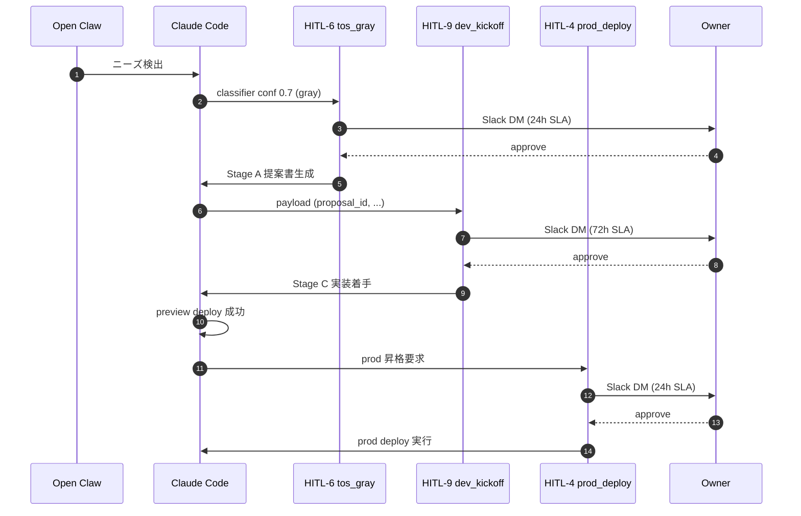
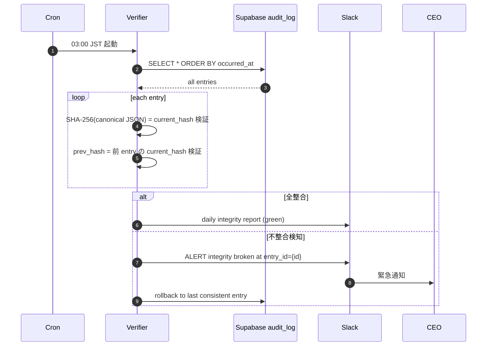
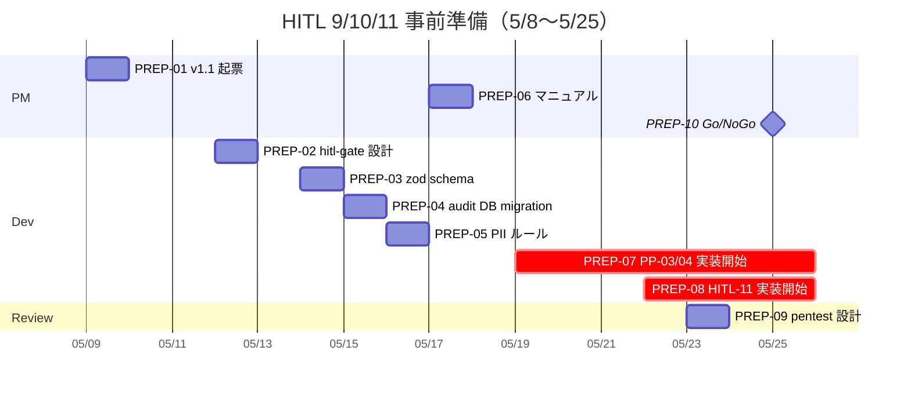

最終更新日: 2026-05-03 / 起案: PM Department / 採択予定: 5/8 議決-7

# PRJ-019 — HITL 第 9・10・11 種 統合 WBS（PM v4 反映 1 + 5）

- 案件: PRJ-019「Clawbridge」
- 担当: PM 部門
- 版: **v1.0**（PM v4 反映 1 = HITL 第 9/10 種 + 反映 5 = HITL 第 11 種、5/8 議決-7 採択予定）
- 関連: PM v4 マスタープラン §1 反映 1, 5 / §2.1 / §10、DEC-019-033 §②/③/④/⑤、CEO 連結報告 §2.2
- 兄弟: `pm-permission-ui-wbs.md` §6 (HITL-10 仕様)、`pm-v4-master-plan.md` §2 W1〜W4 WBS

---

## §1 HITL 第 9・10・11 種 概要

### §1.1 3 種一覧

| 種別 # | 名称 | 種別カテゴリ | SLA | default | 発動条件 | 起源 DEC |
|---|---|---|---|---|---|---|
| **HITL-9** | `dev_kickoff_approval` | TD | **72h（営業日 5 日換算）** | reject | Stage A 提案書生成完了 | DEC-019-033 §② |
| **HITL-10** | `permission_change_review` | PU | **24h** | reject | policy backup 復元 / 外部 import / 過剰権限警告 の 3 ケース | DEC-019-033 §⑤ |
| **HITL-11** | `knowledge_pii_review` | KE | **48h** | reject | ナレッジ抽出時に PII 検知された場合 | DEC-019-033 §④ + CEO 連結報告 §2.2 |

### §1.2 既存 HITL-1〜8 + 新 9/10/11 の総覧

| # | 名称 | SLA | default | 反映 |
|---|---|---|---|---|
| 1 | network_external | 24h | reject | 既存 |
| 2 | cost_threshold | 1h | pause | 既存 |
| 3 | secret_access | 24h | reject | 既存 |
| 4 | prod_deploy | 24h | reject | 既存 |
| 5 | unsafe_command | 24h | reject | 既存 |
| 6 | tos_gray_review | 24h | reject | DEC-019-018 統合（PM v4 反映 3） |
| 7 | external_api | 24h | reject | 既存 |
| 8 | emergency_stop | 30min | pause | 既存 |
| **9** | **dev_kickoff_approval** | **72h** | **reject** | **新（反映 1）** |
| **10** | **permission_change_review** | **24h** | **reject** | **新（反映 1）** |
| **11** | **knowledge_pii_review** | **48h** | **reject** | **新（反映 5）** |

---

## §2 各 Gate の DoD（Definition of Done）

### §2.1 HITL-9 `dev_kickoff_approval` DoD

| # | DoD | 検証手段 |
|---|---|---|
| **D9-01** | payload zod schema 7 項目 (proposal_id / summary / target_effect / estimated_cost_usd / tos_gray_judgment / dev_period_days / knowledge_refs[]) 100% 準拠 | `hitl-9-payload-validator.test.ts` |
| **D9-02** | SLA 72h タイマー稼働、timeout 自動棄却 | `hitl-9-timeout.test.ts`（72h 模擬） |
| **D9-03** | default reject 動作（Owner 無反応 = reject） | `hitl-9-default.test.ts` |
| **D9-04** | timeout 時の cost-tracker rollback（提案生成コスト分のみ計上、実装コスト計上せず） | cost-tracker diff 検証 |
| **D9-05** | 通知 3 段（Slack DM 即時 / メール SES 24h / SMS 48h） | webhook + SES + SMS log 検証 |
| **D9-06** | 棄却時にナレッジ抽出（`organization/knowledge/pitfalls/timeout-rejected/{date}.md`） | ファイル存在確認 |
| **D9-07** | 30 日内同一 `need_id` の dedup | dedup logic test |
| **D9-08** | Dashboard `/dashboard/proposals` で待機提案リスト + ワンクリック approve/reject | E2E test |
| **D9-09** | 承認時動作（impl-runtime spawn → preview deploy → Slack 通知） | E2E test |
| **D9-10** | audit log SHA-256 hash chain 組込（DEC-019-033 §⑤） | hash chain integrity check |

### §2.2 HITL-10 `permission_change_review` DoD

| # | DoD | 検証手段 |
|---|---|---|
| **D10-01** | payload zod schema 6 項目 (change_id / source / diff_json / pre_policy_version / post_policy_version / approver_signature) 100% 準拠 | `hitl-10-payload.test.ts` |
| **D10-02** | trigger 3 ケース (backup_restore / external_import / auto_warning) 全網羅 | trigger detector test |
| **D10-03** | SLA 24h タイマー稼働、timeout で旧 policy 維持 | `hitl-10-timeout.test.ts` |
| **D10-04** | 承認時動作（`policy_versions` INSERT + `policy_active` UPDATE + audit log INSERT + hot-reload） | E2E test |
| **D10-05** | 拒否時動作（旧 policy 維持 + audit log INSERT） | E2E test |
| **D10-06** | 通知 2 段（Slack DM 即時 / メール SES 12h） | webhook + SES log |
| **D10-07** | priviledge escalation pentest pass（Open Claw 経由で HITL-10 bypass 試行が全て失敗） | pentest report |
| **D10-08** | audit log SHA-256 hash chain 組込 | hash chain integrity check |

### §2.3 HITL-11 `knowledge_pii_review` DoD

| # | DoD | 検証手段 |
|---|---|---|
| **D11-01** | payload zod schema 5 項目 (extraction_id / source_path / extracted_content / pii_redacted_content / pii_categories[]) 100% 準拠 | `hitl-11-payload.test.ts` |
| **D11-02** | PII 検知ルール 7 種（email / phone / credit_card / ssn / api_key / customer_name / internal_url）| pii-detector.test.ts |
| **D11-03** | SLA 48h タイマー稼働、timeout で抽出破棄 | `hitl-11-timeout.test.ts` |
| **D11-04** | 承認時動作（PII 削除済 content を `organization/knowledge/{patterns,decisions,pitfalls}/` に追加） | E2E test |
| **D11-05** | 拒否時動作（抽出破棄、`pitfalls/pii-rejected/{date}.md` に redacted 状態で記録） | E2E test |
| **D11-06** | 通知（Slack DM 即時 + 24h リマインド） | webhook log |
| **D11-07** | KE-04 連動（自動 redaction 後の HITL-11 二重チェック） | KE-04 integration test |
| **D11-08** | audit log SHA-256 hash chain 組込 | hash chain integrity check |

---

## §3 工数見積（Dev / PM / Review / Owner 4 軸）

### §3.1 HITL-9 工数見積

| 軸 | タスク | 工数 |
|---|---|---|
| **Dev 実装** | hitl-gate.ts 拡張 + payload validator + Dashboard /proposals UI + dedup logic + 通知 3 段 | **1.5 d** |
| **PM 仕様** | DoD 10 項目策定 + 受入テスト計画 + Owner UI 操作マニュアル | **0.5 d** |
| **Review レビュー** | priviledge escalation pentest（Open Claw 経由 bypass 試行）+ audit log 整合性 | **0.5 d** |
| **Owner 操作** | Phase 1 中の HITL-9 承認操作（提案 30 件 × 2 min/件 + 棄却 21 件 × 1 min/件） | **1.5 h ≒ 0.2 d** |
| **HITL-9 合計** | - | **2.7 d** |

### §3.2 HITL-10 工数見積

| 軸 | タスク | 工数 |
|---|---|---|
| **Dev 実装** | hitl-gate.ts 拡張 + 3 trigger 検知 + 通知 2 段 + hot-reload 統合 | **1.0 d** |
| **PM 仕様** | DoD 8 項目策定 + 3 trigger ケース運用ルール + Owner UI 操作マニュアル | **0.3 d** |
| **Review レビュー** | priviledge escalation pentest（HITL-10 bypass 12 試行）+ audit log 整合性 | **1.0 d** |
| **Owner 操作** | Phase 1 中の HITL-10 承認操作（5 件 × 3 min/件） | **0.5 h ≒ 0.06 d** |
| **HITL-10 合計** | - | **2.4 d** |

### §3.3 HITL-11 工数見積

| 軸 | タスク | 工数 |
|---|---|---|
| **Dev 実装** | hitl-gate.ts 拡張 + PII 検知ルール 7 種 + redaction logic + 通知 + KE-04 連動 | **2.0 d** |
| **PM 仕様** | DoD 8 項目策定 + PII カテゴリ運用ルール + Owner UI 操作マニュアル | **0.5 d** |
| **Review レビュー** | PII 検知精度評価（false positive < 5% / false negative < 10%）+ audit log 整合性 | **1.0 d** |
| **Owner 操作** | Phase 1 中の HITL-11 承認操作（10 件 × 5 min/件 = PII 確認に時間要） | **1.0 h ≒ 0.13 d** |
| **HITL-11 合計** | - | **3.6 d** |

### §3.4 4 軸合計

| 軸 | HITL-9 | HITL-10 | HITL-11 | 計 |
|---|---|---|---|---|
| Dev 実装 | 1.5 d | 1.0 d | 2.0 d | **4.5 d** |
| PM 仕様 | 0.5 d | 0.3 d | 0.5 d | **1.3 d** |
| Review レビュー | 0.5 d | 1.0 d | 1.0 d | **2.5 d** |
| Owner 操作 | 0.2 d | 0.06 d | 0.13 d | **0.4 d** |
| **計** | **2.7 d** | **2.4 d** | **3.6 d** | **8.7 d** |

---

## §4 既存 8 Gate との衝突 / 連携ポイント

### §4.1 連携ポイント表

| 新 Gate | 連携先既存 Gate | 連携内容 |
|---|---|---|
| **HITL-9** | HITL-1 (network_external) | 提案 Stage A LLM 呼出時に whitelist 確認、whitelist 外なら HITL-1 先発火 |
| **HITL-9** | HITL-2 (cost_threshold) | 提案生成コスト + 実装コスト合算で session $5 / project $50 cap 監視、超過時 HITL-2 発火 |
| **HITL-9** | HITL-6 (tos_gray_review) | 提案 Stage A 直前にニーズが gray ジャンルなら HITL-6 先発火、HITL-6 通過後に HITL-9 |
| **HITL-9** | HITL-4 (prod_deploy) | Stage C 実装後 preview deploy → prod 昇格時に HITL-4 発火（HITL-9 とは独立） |
| **HITL-10** | HITL-3 (secret_access) | 権限 UI から API key を含む policy 変更時 HITL-3 連動発火 |
| **HITL-10** | HITL-8 (emergency_stop) | kill switch 押下時は HITL-10 経由せず HITL-8 即時発火（kill switch は緊急停止優先） |
| **HITL-11** | HITL-1 (network_external) | PII redaction LLM 呼出時に whitelist 確認 |
| **HITL-11** | HITL-9 (dev_kickoff) | 棄却された HITL-9 提案からのナレッジ抽出時にも HITL-11 動作 |

### §4.2 衝突ポイント表

| 衝突箇所 | 解決方針 |
|---|---|
| **HITL-9 + HITL-2 同時 SLA** | HITL-2 (1h pause) が優先、cost cap 解除後に HITL-9 (72h) タイマー再開 |
| **HITL-10 + HITL-8 同時発火** | HITL-8 emergency_stop 優先、HITL-10 は cancel |
| **HITL-11 + HITL-9 同時 timeout** | 両 timeout 時は両方棄却、ナレッジは pitfalls/double-rejected/{date}.md に記録 |
| **HITL-9 提案承認後の HITL-6 後発見** | Stage C 実装着手前に HITL-6 再評価、gray hit なら Stage C abort |

### §4.3 連携シーケンス例（HITL-6 → HITL-9 → HITL-4）



---

## §5 Audit log SHA-256 hash chain への組み込み（DEC-019-033 §⑤）

### §5.1 hash chain 構造

```
audit_log_entry_n = {
  id: uuid,
  occurred_at: timestamp,
  hitl_type: 9 | 10 | 11 | (1-8),
  payload: jsonb,
  result: 'approve' | 'reject' | 'timeout',
  prev_hash: SHA-256(audit_log_entry_n-1 全フィールド canonical JSON),
  current_hash: SHA-256(本 entry の prev_hash 含む全フィールド canonical JSON)
}
```

### §5.2 HITL-9/10/11 の audit log INSERT タスク

| タスク | 工数 | 備考 |
|---|---|---|
| AUD-01: hash chain 構造拡張（既存 audit log + prev_hash + current_hash 列追加） | 0.3 d | Supabase migration |
| AUD-02: HITL-9/10/11 の audit log INSERT logic（hash chain 自動計算） | 0.5 d | hitl-gate.ts 内統合 |
| AUD-03: hash chain 整合性検証バッチ（毎日 03:00 JST、不整合検知 → CEO Slack 通知） | 0.3 d | cron + verifier |
| AUD-04: hash chain 不整合時の rollback 動作（直前の整合 entry まで roll back + alert） | 0.3 d | recovery logic |
| **計** | **1.4 d** | DEC-019-033 §⑤ 準拠 |

### §5.3 hash chain 検証 シーケンス



---

## §6 受入テスト計画

### §6.1 HITL-9 受入テスト 10 ケース

| # | ケース | 期待結果 |
|---|---|---|
| T9-01 | payload 7 項目欠落 | zod validation fail、HITL 不発動 |
| T9-02 | 72h timeout 自動棄却 | cost rollback + pitfalls/timeout-rejected 記録 |
| T9-03 | Owner approve 動作 | Stage C spawn + preview deploy + Slack 通知 |
| T9-04 | Owner reject 動作 | 提案棄却 + ナレッジ蓄積 |
| T9-05 | 30 日内 dedup | 同一 need_id の 2 回目以降は最初の決定結果共有 |
| T9-06 | 3 段通知（Slack 即時 / SES 24h / SMS 48h） | 各通知発火確認 |
| T9-07 | Dashboard 待機提案リスト表示 | E2E test pass |
| T9-08 | ワンクリック approve/reject | E2E test pass |
| T9-09 | audit log hash chain 整合性 | hash chain verifier pass |
| T9-10 | priviledge escalation 試行（Open Claw 経由 bypass） | 全試行 fail（403 / RLS deny） |

### §6.2 HITL-10 受入テスト 8 ケース

| # | ケース | 期待結果 |
|---|---|---|
| T10-01 | backup_restore trigger | HITL-10 発火 + 24h SLA |
| T10-02 | external_import trigger | HITL-10 発火 |
| T10-03 | auto_warning trigger（過剰権限検知） | HITL-10 発火 + 旧 policy 維持 |
| T10-04 | 24h timeout 旧 policy 維持 | E2E test |
| T10-05 | 承認時 hot-reload | 次 spawn から新 policy 反映 |
| T10-06 | 通常 UI 操作で HITL-10 不発動 | Owner 認証済 UI 操作は audit log のみ |
| T10-07 | priviledge escalation pentest（12 試行） | 全試行 fail |
| T10-08 | audit log hash chain 整合性 | hash chain verifier pass |

### §6.3 HITL-11 受入テスト 8 ケース

| # | ケース | 期待結果 |
|---|---|---|
| T11-01 | PII 検知 7 種網羅 | 各カテゴリで検知発火 |
| T11-02 | redaction 結果の HITL-11 提示 | Owner UI で確認可能 |
| T11-03 | 48h timeout 抽出破棄 | pitfalls/pii-rejected 記録 |
| T11-04 | 承認時 ナレッジ追加 | knowledge ディレクトリに redacted content 追加 |
| T11-05 | 拒否時 抽出破棄 | knowledge ディレクトリに記載されない |
| T11-06 | KE-04 連動（自動 redaction 後の HITL-11 二重チェック） | E2E test |
| T11-07 | false positive < 5% / false negative < 10% | Review 評価 100 件サンプル |
| T11-08 | audit log hash chain 整合性 | hash chain verifier pass |

### §6.4 受入テスト全 26 ケース集計

| Gate | テストケース | 工数（実行 + 検証） |
|---|---|---|
| HITL-9 | 10 ケース | 0.5 d |
| HITL-10 | 8 ケース | 0.4 d |
| HITL-11 | 8 ケース | 0.5 d |
| **計** | **26 ケース** | **1.4 d** |

---

## §7 Phase 1 着手前 (5/8〜5/25) 事前準備タスク

### §7.1 5/8〜5/25 期間の事前準備 タスク一覧

| ID | 期日 | 題目 | 担当 | 工数 |
|---|---|---|---|---|
| **PREP-01** | 5/9 | 5/8 議決-7 採択結果反映 + 詳細仕様書 v1.1 起票 | PM | 0.5 d |
| **PREP-02** | 5/12 | hitl-gate.ts 拡張設計レビュー（HITL-9/10/11 統合方針） | Dev + Review | 0.5 d |
| **PREP-03** | 5/14 | payload zod schema 確定（3 種共通 base + 各種別固有） | Dev | 0.5 d |
| **PREP-04** | 5/15 | DB schema 拡張（audit_log に prev_hash / current_hash 列追加 migration） | Dev | 0.3 d |
| **PREP-05** | 5/16 | PII 検知ルール 7 種策定 + redaction logic 設計 | Research + Dev | 1.0 d |
| **PREP-06** | 5/17 | Owner 操作マニュアル草案（HITL-9/10/11 各承認 UI 操作手順） | PM + Marketing | 0.5 d |
| **PREP-07** | 5/19 | Pre-Phase 着手と同時に PP-03 (HITL-9) / PP-04 (HITL-10) 実装開始 | Dev | (Pre-Phase WBS 内) |
| **PREP-08** | 5/22 | HITL-11 実装開始（Pre-Phase 内、PP-09 ナレッジ抽出と並行） | Dev | (Pre-Phase WBS 内) |
| **PREP-09** | 5/23 | priviledge escalation pentest 設計（HITL-10 12 試行シナリオ確定） | Review | 0.5 d |
| **PREP-10** | 5/25 | Pre-Phase Go/NoGo + HITL-9/10/11 基本動作確認 | CEO + PM + Dev | 0.3 d |

### §7.2 事前準備工数集計

| 担当 | 工数 |
|---|---|
| PM | 1.5 d |
| Dev | 2.3 d（PP-03/04/08 含めず、別途 Pre-Phase WBS で計上） |
| Review | 1.0 d |
| Research | 0.5 d（PREP-05 のうち Research 分担） |
| Marketing | 0.3 d（PREP-06 のうち Marketing 分担） |
| CEO | 0.3 d |
| **計** | **5.9 d**（事前準備のみ、Pre-Phase 実装本体は別計上） |

### §7.3 事前準備ガント



---

## §8 ODR（Owner Decision Required）

### §8.1 [ODR] 7 件

| ID | 優先度 | 内容 | 期日 | 提示形式 |
|---|---|---|---|---|
| **[ODR-019-H911-01]** | **P1** | **HITL-11 `knowledge_pii_review` 正式追加承認**（ODR-OG-06 由来、CEO 推奨採用） | **5/8 検収会議** | Yes / No |
| **[ODR-019-H911-02]** | **P1** | **HITL-11 SLA 48h 承認**（24h / 48h / 72h から選択可） | **5/8 検収会議** | 48h / 24h / 72h |
| **[ODR-019-H911-03]** | **P1** | **PII 検知ルール 7 種承認**（email / phone / credit_card / ssn / api_key / customer_name / internal_url） | **5/8 検収会議** | 7 種全 ON / カスタム |
| **[ODR-019-H911-04]** | **P1** | **audit log SHA-256 hash chain 採用承認**（DEC-019-033 §⑤、HITL-9/10/11 全対象） | **5/8 検収会議** | Yes / No |
| **[ODR-019-H911-05]** | **P2** | **HITL-9/10/11 通知 3 段方針承認**（Slack DM / SES / SMS の 3 段、HITL-9 のみ全 3 段、10/11 は 2 段） | **5/8 検収会議** | Yes / No |
| **[ODR-019-H911-06]** | **P2** | **PII redaction false positive < 5% / false negative < 10% DoD 承認** | **5/8 検収会議** | Yes / カスタム |
| **[ODR-019-H911-07]** | **P3** | **hash chain 整合性検証バッチ毎日 03:00 JST 承認**（毎時間 / 毎日 / 毎週から選択可） | **5/8 検収会議** | 毎日 03:00 / 毎時間 / 毎週 |

---

## §9 関連ドキュメント

- 上位: `pm-v4-master-plan.md`（PM v4 マスタープラン §1 反映 1, 5 / §2 W1〜W4 WBS）
- 兄弟: `pm-permission-ui-wbs.md` §6（HITL-10 仕様詳細）
- 関連 Dev: `dev-w0-week2-prop-gen-and-dashboard.md`
- 関連 Review: `review-owner-gate-and-permission-ui-security.md`（pentest シナリオ）
- 上位 DEC: DEC-019-033 §②/③/④/⑤、CEO 連結報告 §2.2 / §5.2

---

## §10 v4 反映 1, 5 整合性宣言

本書は **PM v4 マスタープラン §1 反映 1（HITL 第 9/10 種 WBS 統合）+ 反映 5（HITL 第 11 種追加）** を完全展開した詳細 WBS であり、以下を保証する:

1. **DEC-019-019**（BAN drill #1）/ **DEC-019-020**（mock-claude 基盤）と整合: HITL-9/10/11 は drill #3 (5/29) に組込、mock-claude 基盤上で priviledge escalation pentest 実行
2. **DEC-019-033 §②/③/④/⑤** 完全準拠: 各 Gate の SLA / default / trigger / hash chain 全仕様一致
3. **月次 $300 ハードキャップ厳守**: PM v4 §4.1 (3) Tools 区分 $5 中央 / $20 上限 内に HITL-11 PII redaction LLM 呼出コスト吸収
4. **Critical Path 影響**: HITL-9 (W1-04) / HITL-10 (W2-07) / HITL-11 (W2-05) を Critical Path 上に配置済（PM v4 §7.1）

---

**v1 確定**: 2026-05-03 / **採択予定**: 2026-05-08 議決-7 / **次回更新**: 5/8 採択結果反映 + Pre-Phase Go/NoGo (5/25) 結果反映
