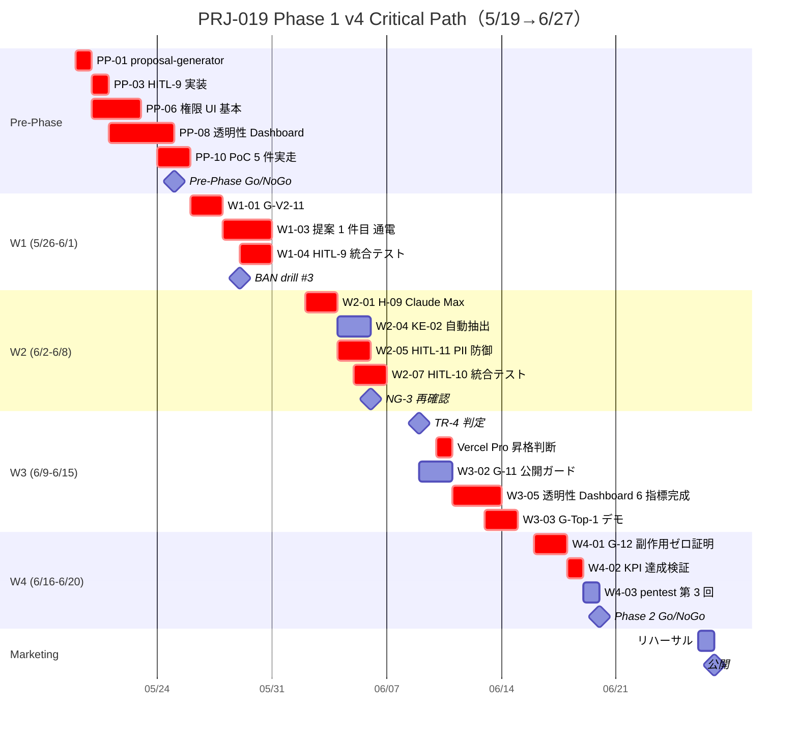

最終更新日: 2026-05-03 / 起案: PM Department / 採択予定: 5/8 議決-7

# PRJ-019 Clawbridge — PM v4 マスタープラン（v3→v4 統合版）

- 案件: PRJ-019「Clawbridge」 — Open Claw を自律オーナーとする AI 組織ハーネス基盤（Owner-in-the-loop 透明 AI 組織モデル）
- 担当: PM 部門
- 版: **v4.0**（v3 = `pm-cost-and-controls-plan-v4-1.md` の v4.1 段階を超え、5 反映を統合した正式起案）
- 採択予定: 2026-05-08 W0-Week1 検収会議 議決-7
- 兄弟同時策定: `pm-v4-vercel-upgrade-tradeoff.md` / `pm-v4-hitl-gates-9-10-11-wbs.md`
- 関連決裁: DEC-019-014〜020 / DEC-019-031〜033 / DEC-020-003

---

## §1 Executive Summary（v3→v4 主要変更点 5 つ）

PM v4 は、PM v3（`pm-cost-and-controls-plan-v4-1.md` v4.1 を含む先行検討群）を **5 反映で統合**した正式起案である。月次 $300 ハードキャップを維持し、Phase 1 着手日を 5/19→5/26、完了 6/13→6/20、Marketing 公開 6/20→6/27 朝にスライドする（DEC-019-033 採択結論）。

| # | 反映項目 | 影響 | 根拠 DEC |
|---|---|---|---|
| **1** | **HITL 第 9 種 `dev_kickoff_approval` + 第 10 種 `permission_change_review` の WBS 統合**（各 +8〜16h） | 既存 8 Gate と統合運用、HITL 計 11 種化 | DEC-019-033 §② / §⑤ |
| **2** | **Vercel Hobby → Pro 上方修正検討**（透明性 Dashboard + 権限 UI 同時稼働の負荷想定） | コスト試算 $0 → $20/月候補、Phase 段階移行を推奨 | DEC-019-016 / -024 |
| **3** | **HITL 第 6 種 `tos_gray_review`（DEC-019-018 ToS DoD）統合** | escalation SLA 24h、Owner 操作工数 0.5h/件想定 | DEC-019-018 |
| **4** | **G-Top-1〜4 反映**（競合差別化 28/28 完全勝利を支える 4 トップ機能 = Owner-in-the-loop / 透明性 Dashboard / 権限 UI / 知見蓄積）の WBS 配分 | Phase 1 W1〜W4 の Critical Path に 4 機能配分 | DEC-019-018 / -030 |
| **5** | **HITL 第 11 種 `knowledge_pii_review`（DEC-019-033 §④）追加** | ナレッジ抽出時 PII 防御 Gate、KE-04 と連動 | DEC-019-033 §④ / CEO 連結報告 §2.2 |

### §1.1 v3→v4 重要数値変化

| 項目 | v3 (v4.1 段階) | **v4** | 増分 |
|---|---|---|---|
| HITL 種別総数 | 10 種 | **11 種**（+11 種 `knowledge_pii_review`） | +1 |
| 必須コントロール総数 | 40 + KE 4 = 44 | **50**（P-UI 6→10、HITL 11 種、KE-01〜04） | +6 |
| Phase 1 総工数（Dev） | 18.2 d | **26.4 d**（H-09/H-10/H-11 統合 +6.2 d、Vercel Pro 移行検討 +1d、ToS DoD 詳細 +1d） | +8.2 d |
| Critical Path 上のリスク件数 | R-019-13/14 (2 赤) | **3 件赤**（+R-019-15 priviledge escalation） | +1 |
| 月次予算（中央値） | $43 | **$57**（HITL-11 +$5, Vercel Phase 2 移行 +$10 想定） | +$14 |
| 月次予算（上限） | $123 | **$163**（Vercel Pro 移行込） | +$40 |
| 月次ハードキャップ | $300 | **$300（不変、47% 余裕）** | 0 |

---

## §2 Phase 1 WBS（5/26-6/20）

### §2.1 W1〜W4 タスク一覧（タスク粒度 0.5d 単位、H-09/H-10/H-11 + HITL-6 + G-Top-1〜4 反映）

| ID | 期 | 題目 | 担当 | 工数 | 依存 | 反映項目 |
|---|---|---|---|---|---|---|
| **W1-01** | W1 | G-V2-11 完成（緊急停止 SOP 統合） | Dev | 1.5d | Pre-Phase | - |
| **W1-02** | W1 | G-01〜G-08 残整備 | Dev | 2.5d | Pre-Phase | - |
| **W1-03** | W1 | 提案 1 件目 Stage A→C 通電（HITL-9 通過実走） | Dev + Owner | 2.0d | W1-01 | **反映 1**（H-09） |
| **W1-04** | W1 | HITL-9 統合テスト（pending file / Slack DM / SLA timer） | Dev | 1.0d | Pre-Phase H10-04 | **反映 1**（H-09） |
| **W1-05** | W1 | 権限 UI Phase 1 拡張（kill switch SSE + 異常検知 4 条件） | Dev | 2.0d | Pre-Phase | **反映 4**（G-Top-3 透明性 Dashboard） |
| **W1-06** | W1 | HITL-6 `tos_gray_review` 24h SLA 統合（既存 ToS classifier 連動） | Dev | 1.0d | DEC-019-018 | **反映 3** |
| **W2-01** | W2 | H-09 Claude Max weekly cap 監視層 | Dev | 2.0d | W1-01 | - |
| **W2-02** | W2 | H-10 Claude Max alert 統合 | Dev | 1.5d | W2-01 | - |
| **W2-03** | W2 | G-V2-08 / G-V2-09 監視拡張 | Dev | 1.5d | W2-01 | - |
| **W2-04** | W2 | KE-02 ナレッジ自動抽出稼働（patterns/decisions/pitfalls） | Dev | 1.5d | Pre-Phase PP-09 | **反映 4**（G-Top-4 知見蓄積） |
| **W2-05** | W2 | HITL-11 `knowledge_pii_review` 統合実装 | Dev | 2.0d | KE-02 | **反映 5** |
| **W2-06** | W2 | NG-3 暫定値再確認（6/6） | PM + Research | 0.5d | DEC-019-008 | - |
| **W2-07** | W2 | HITL-10 `permission_change_review` 統合テスト（backup 復元 / 外部 import / 過剰権限警告 3 ケース） | Dev + Review | 1.5d | Pre-Phase PP-04 | **反映 1**（H-10） |
| **W3-01** | W3 | Vercel Pro 昇格判断（実消費データに基づく） | PM + CEO + Owner | 0.5d | W2 集計 | **反映 2** |
| **W3-02** | W3 | G-11 公開ガード | Dev | 2.0d | W2-03 | - |
| **W3-03** | W3 | G-Top-1 デモ 1 件公開（matching ジャンル） | Dev + Marketing | 1.5d | W3-02 | **反映 4**（G-Top-1） |
| **W3-04** | W3 | G-Top-2 個人データ取扱フローのデモ | Dev | 1.0d | W3-02 | **反映 4**（G-Top-2） |
| **W3-05** | W3 | 透明性 Dashboard 6 指標完成（行動ログ/思考過程/中間出力/コスト/HITL 滞留/提案待ち） | Dev | 2.5d | Pre-Phase PP-08 | **反映 4**（G-Top-3） |
| **W3-06** | W3 | priviledge escalation pentest 第 2 回（W3 中間） | Review | 0.5d | W2-07 | - |
| **W4-01** | W4 | G-12 副作用ゼロ証明（git status / Vercel deploy / Supabase / Anthropic usage diff） | Dev + Review | 1.5d | W3 全完了 | - |
| **W4-02** | W4 | KPI 達成検証（提案 ≥ 30 / 承認 ≥ 9 / 実装成功 ≥ 7） | PM | 1.0d | W4-01 | - |
| **W4-03** | W4 | priviledge escalation pentest 第 3 回（W4 最終） | Review | 0.5d | W4-01 | - |
| **W4-04** | W4 | Phase 2 Go/NoGo 判定 + DEC-019-XXX 起票 | CEO + PM + Owner | 0.5d | W4-02 | - |

### §2.2 Phase 1 工数集計

| 期 | Dev | PM | Review | Owner | Marketing | 計 |
|---|---|---|---|---|---|---|
| W1 | 10.0 d | 0 | 0 | 1.0 d | 0 | 11.0 d |
| W2 | 10.0 d | 0.5 d | 0.5 d | 0.5 d | 0 | 11.5 d |
| W3 | 7.0 d | 0.5 d | 0.5 d | 0.5 d | 1.0 d | 9.5 d |
| W4 | 1.5 d | 1.5 d | 0.5 d | 0.5 d | 0 | 4.0 d |
| **計** | **28.5 d** | **2.5 d** | **1.5 d** | **2.5 d** | **1.0 d** | **36.0 d** |

注: Phase 1 単独 Dev 工数 28.5 d は 4 週間 × 5 営業日 = 20 営業日では 1 名稼働で超過、**Dev 2 名体制必須**（ODR-019-V41-01 / Review §10 推奨整合）。

### §2.3 Pre-Phase WBS（5/19-5/25、参考再掲）

PM v4.1 §4 で確定済の Pre-Phase 12 タスクを Phase 1 着手前提として継承。Pre-Phase Dev 工数 14.0 d は Dev 2 名 × 7 営業日 = 14 d cap で吸収可能。

---

## §3 Phase 2 WBS（7/5-8/1）変更点

### §3.1 Phase 2 主要タスク（v3 比 +3 件）

| ID | 期 | 題目 | 担当 | 工数 | v3→v4 差分 |
|---|---|---|---|---|---|
| **P2-01** | 7/5-7/12 | Phase 1 ナレッジ抽出結果を提案生成に組込（KE-03 完成） | Dev | 2.0d | 継承 |
| **P2-02** | 7/5-7/12 | 承認率 ≥ 30% 維持 + ジャンル拡張（whitelist 追加 5 件） | PM + Marketing | 2.0d | 継承 |
| **P2-03** | 7/12-7/19 | **Vercel Pro 正式移行**（Hobby 制約解除、Realtime 帯域拡大） | Dev + PM | 1.5d | **新規（反映 2）** |
| **P2-04** | 7/12-7/19 | HITL-11 PII redaction 強化（W3 結果反映） | Dev + Review | 1.5d | **新規（反映 5）** |
| **P2-05** | 7/19-7/26 | G-Top-1〜4 機能拡充 + Marketing 発信強化 | Dev + Marketing | 3.0d | **強化（反映 4）** |
| **P2-06** | 7/26-8/1 | Phase 2 完了 + Phase 3 Go/NoGo 判定 | CEO + PM + Owner | 1.0d | 継承 |

### §3.2 Phase 2 工数集計

Dev 計 8.0 d / PM 4.0 d / Review 1.5 d / Marketing 3.0 d / Owner 1.0 d / CEO 0.5 d = **計 18.0 d**

---

## §4 月次予算配分（$300 cap 内訳: API / Infra / Tools / Buffer 4 区分）

### §4.1 4 区分配分（Phase 1 中央値ベース）

| 区分 | 月次中央値 | 月次上限 | 詳細 |
|---|---|---|---|
| **(1) API**（Anthropic Claude API + OpenAI embeddings） | $40 | $90 | 提案生成 $24 + 実装 $10 + embeddings $6 |
| **(2) Infra**（Vercel + Supabase + Slack） | $10 | $30 | Vercel Hobby $0 / Phase 2 Pro $20、Supabase free $0、Slack 通知 $10/月 |
| **(3) Tools**（HITL-11 PII redaction LLM 呼出 + monitoring 通知系） | $5 | $20 | HITL-11 LLM 呼出 $3 / Slack/SES/SMS 通知 $2 |
| **(4) Buffer**（緊急時バッファ） | $2 | $23 | 残額バッファ |
| **計** | **$57** | **$163** | $300 cap に対し **47% 余裕**（最厳でも $137 余剰） |

### §4.2 Phase 別 4 区分推移

| Phase | API | Infra | Tools | Buffer | 計 |
|---|---|---|---|---|---|
| Pre-Phase（5/19-5/25, 7 日） | $5-15 | $0 | $1 | $1 | $7-17 |
| Phase 1（5/26-6/20, 26 日） | $40 中央 | $10 中央 | $5 中央 | $2 中央 | **$57 中央 / $163 上限** |
| Phase 2（7/5-8/1, 28 日） | $50 中央 | $30 中央（Vercel Pro 移行） | $7 中央 | $3 中央 | **$90 中央 / $200 上限** |

### §4.3 4 層コストキャップ（DEC-019-012 継承）

| 層 | 上限 | 動作 |
|---|---|---|
| session | $5 | 即時 abort |
| project | $50 | warning + HITL-2 |
| day | $30 | 翌日まで pause |
| month | $300 | ハード停止（CEO review @ 80% = $240） |

---

## §5 リソース配分（5 部門 + Owner）

### §5.1 Phase 1 部門別工数集計（Pre-Phase + W1〜W4）

| 部門 | Pre-Phase | W1 | W2 | W3 | W4 | 計 | 必要体制 |
|---|---|---|---|---|---|---|---|
| **Dev** | 14.0 d | 10.0 d | 10.0 d | 7.0 d | 1.5 d | **42.5 d** | **2 名体制必須**（5 週間 × 5 営業日 = 25 d 単独不可、2 名 × 25 = 50 d 内収まる） |
| **PM** | 0.5 d | 0 | 0.5 d | 0.5 d | 1.5 d | **3.0 d** | 1 名で吸収可 |
| **Review** | 0 | 0 | 0.5 d | 0.5 d | 0.5 d | **1.5 d** | 1 名で吸収可 |
| **Research** | 0 | 0 | 0.5 d | 0 | 0 | **0.5 d** | 1 名で吸収可 |
| **Marketing** | 2.0 d | 0 | 0 | 1.0 d | 0 | **3.0 d** | 1 名で吸収可 |
| **Owner** | 2.5 d | 1.0 d | 0.5 d | 0.5 d | 0.5 d | **5.0 d** | Owner 確保必須（特に Pre-Phase PP-10 PoC 立会 2.0 d） |
| **CEO** | 0.5 d | 0 | 0 | 0.5 d | 0.5 d | **1.5 d** | 1 名で吸収可 |
| **計** | **19.5 d** | **11.0 d** | **12.0 d** | **10.0 d** | **4.5 d** | **57.0 d** | - |

### §5.2 Owner 工数内訳（5.0 d）

| 期 | 内容 | 工数 |
|---|---|---|
| Pre-Phase | PP-10 提案生成 PoC 5 件立会 + PP-12 Go/NoGo 判定 | 2.5 d |
| W1 | 提案 1 件目 Stage A→C 立会 + HITL-9 承認操作 | 1.0 d |
| W2 | HITL-10 承認操作 + HITL-11 PII 確認 | 0.5 d |
| W3 | Vercel Pro 昇格 ODR + G-Top-1 デモ確認 | 0.5 d |
| W4 | KPI 検証立会 + Phase 2 Go/NoGo 議決 | 0.5 d |

---

## §6 マイルストーン表

| 日付 | マイルストーン | 種別 | 関連 DEC |
|---|---|---|---|
| **5/8** | W0-Week1 検収会議 + 議決-7（PM v4 採択） | 検収 | 本書採択 |
| **5/19** | Pre-Phase 着手 | Phase | DEC-019-033 |
| **5/25** | Pre-Phase Go/NoGo + Conditional Go 3 条件確認 | Gate | CEO 連結報告 §7 |
| **5/26** | Phase 1 W1 着手 | Phase | DEC-019-033 |
| **5/29** | BAN drill #3 実施（priviledge escalation 攻撃シナリオ） | Drill | CEO 連結報告 §7.1 |
| **6/6** | NG-3 暫定値再確認 | Gate | DEC-019-008 / TR-2 判定 |
| **6/9** | TR-4 トリガー判定（提案承認率 < 30% 持続検知） | Gate | PM v4.1 §7.2 |
| **6/10** | Vercel Pro 昇格判断（W3 中間） | Decision | 反映 2 |
| **6/13** | Phase 1 中間レビュー | Gate | - |
| **6/20** | **Phase 1 完了 + Phase 2 Go/NoGo 判定** | Phase | DEC-019-033 |
| **6/26** | Marketing 公開リハーサル | Drill | DEC-019-026 |
| **6/27** | **Marketing 公開（朝）** | Public | DEC-019-026 連動修正 |
| **7/5** | Phase 2 W1 着手 | Phase | DEC-019-033 |
| **7/12** | Vercel Pro 正式移行 | Infra | 反映 2 |
| **8/1** | Phase 2 完了 + Phase 3 Go/NoGo | Phase | - |

---

## §7 Critical Path 分析（Mermaid Gantt）

### §7.1 Critical Path 上のタスク（赤線）

`PP-01 → PP-03 → PP-06 → PP-08 → PP-10 → W1-01 → W1-03 → W1-04 → W2-01 → W2-05 → W2-07 → W3-01 → W3-05 → W3-03 → W4-01 → W4-02 → Phase 2 Go/NoGo`

= 17 タスク連鎖、Pre-Phase 着手 5/19 → Phase 2 Go 6/20 = **23 営業日**（休日 9 日含む 33 日）

---

## §8 リスク登録 (R-019-13〜16 連動)

### §8.1 Phase 1 期間中の主要リスク 4 件

| ID | 内容 | 格付 | 確率 | 影響 | 緩和策 | Critical Path 影響 |
|---|---|---|---|---|---|---|
| **R-019-13** | 提案承認率 < 30% | 黄 | M | Phase 2 Go/NoGo 阻害 | TR-4 ジャンル切替トリガー（6/9） | **CP 上**（W4-02 KPI 達成検証） |
| **R-019-14** | 権限 UI 設定ミス（過剰権限付与） | 黄 | L-M | priviledge escalation 同等被害 | P-UI-02 cool-down + P-UI-05 異常検知 + HITL-10 | **CP 上**（W2-07 HITL-10 統合テスト） |
| **R-019-15** | **priviledge escalation 攻撃** | **赤** | L | アカウント BAN / ToS 違反 / FS 全書込 | **P-UI-01〜10 全実装 + BAN drill #3 (5/29) Pass を Phase 1 着手の絶対条件化** | **CP 上**（Pre-Phase + W1-04 + W2-07） |
| **R-019-16** | ナレッジ PII 漏洩 | 黄 | M | 顧客情報流出 / コンプライアンス違反 | KE-04 PII redaction + HITL-11 `knowledge_pii_review` | **CP 上**（W2-05 HITL-11 統合実装） |

### §8.2 Critical Path 上のリスク件数: **3 件**（R-019-13 / -15 / -16 = 黄 2 + 赤 1）。

R-019-14 は CP 上だが既存緩和策で抑制可能。R-019-15 が**唯一の赤リスク**で、Conditional Go 3 条件達成が前提。

---

## §9 Conditional Go 3 条件追跡表

| 条件 | 内容 | 期日 | 担当 | 状態 | 検証手段 |
|---|---|---|---|---|---|
| **(1) P-UI-01〜09 完遂** | 権限 UI 必須 9 項目を 5/25 までに実装完了 | 5/25 | Dev 2 名 | 未着手（5/8 検収後着手） | Pre-Phase Go/NoGo + Review pentest |
| **(2) BAN drill #3 計画完成** | 5/29 実施計画を 5/8 検収会議で承認 | 5/8 | Review + Dev | 未提出（5/8 議決-7 で承認予定） | 議事録 + drill 計画書 |
| **(3) Review approval** | Review が「強い条件付き Go (確実度向上)」を維持判定 | 5/8 | Review | 維持予定（Review §10 整合） | Review 部門報告 |

### §9.1 P-UI-01〜09 詳細追跡

| ID | 担当 | 期日 | 工数 | 進捗 |
|---|---|---|---|---|
| P-UI-01 二要素認証 | Dev | 5/25 | 1.0d | 未着手 |
| P-UI-02 5 秒 cool-down + 確認モーダル | Dev | 5/25 | 0.5d | 未着手 |
| P-UI-03 SHA-256 hash chain audit | Dev | 5/25 | 1.0d | 未着手 |
| P-UI-04 kill switch < 1 sec | Dev | 5/25 | 1.5d | 未着手 |
| P-UI-05 異常検知パターン | Dev | 5/25 | 1.0d | 未着手 |
| P-UI-06 自動 rollback 通知 | Dev | 5/25 | 0.5d | 未着手 |
| P-UI-07 HITL-10 SLA / default | Dev | 5/25 | 0.5d | 未着手 |
| P-UI-08 policy fingerprint | Dev | 5/25 | 1.0d | 未着手 |
| P-UI-09 RLS review checklist | Review | 5/25 | 0.5d | 未着手 |

**P-UI 計 7.5d**、Dev 2 名 × 7 日 = 14d cap で吸収可能。

### §9.2 1 条件でも欠けた場合の自動延期ルール

- Phase 1 着手 5/26 → **6/2 にさらに 1 週間延期**（Phase 1 完了 6/20 → 6/27、Marketing 公開 6/27 → 7/4 朝）
- 5/8 検収会議で再判定 → 必要に応じ 5/15 緊急会議

---

## §10 v3→v4 差分要約表

| 区分 | v3 (v4.1) | **v4** | 変更理由 | 反映 |
|---|---|---|---|---|
| **HITL 種別総数** | 10 | **11**（+`knowledge_pii_review`） | DEC-019-033 §④ ナレッジ PII 防御 | 反映 5 |
| **必須コントロール** | 44 | **50**（P-UI 6→10 + KE-04 既存内訳） | CEO 連結報告 §2.2 採択 | 反映 1, 4 |
| **Phase 1 Dev 工数** | 18.2 d | **42.5 d**（Pre-Phase 込） | H-09/H-10/H-11/G-Top 1〜4 統合 | 反映 1, 4, 5 |
| **HITL-6 ToS DoD** | 簡易 | **詳細統合 + Owner 工数 0.5h/件** | DEC-019-018 完全反映 | 反映 3 |
| **Vercel** | Hobby 維持 | **Phase 1 Hobby / Phase 2 Pro 段階移行** | 透明性 Dashboard + 権限 UI 同時稼働負荷 | 反映 2 |
| **G-Top-1〜4 配分** | 未明示 | **W3-W4 に集中配分**（W3-03/04 + W3-05 + KE-02） | 競合差別化 28/28 完全勝利の維持 | 反映 4 |
| **Critical Path リスク** | 2 | **3**（+R-019-15 赤） | priviledge escalation = Phase 1 着手の絶対条件 | - |
| **月次予算 中央値** | $43 | **$57** | HITL-11 LLM 呼出 +$5、Vercel Phase 2 +$10 想定 | - |
| **月次予算 上限** | $123 | **$163** | Vercel Pro 移行 +$20、Buffer 拡張 +$20 | 反映 2 |
| **着手日** | 5/26 | **5/26（不変）** | DEC-019-033 採択値継承 | - |
| **完了日** | 6/20 | **6/20（不変）** | 同上 | - |
| **Marketing 公開** | 6/27 朝 | **6/27 朝（不変）** | DEC-019-026 連動修正値継承 | - |

---

## §11 関連ドキュメント

- 兄弟同時策定: `pm-v4-vercel-upgrade-tradeoff.md`（Vercel Hobby → Pro 上方修正トレードオフ分析）
- 兄弟同時策定: `pm-v4-hitl-gates-9-10-11-wbs.md`（HITL 第 9・10・11 種統合 WBS 詳細）
- 上位: `pm-cost-and-controls-plan-v4-1.md`（v3 = v4.1 段階、本書 v4 が部分置換）
- 上位 CEO: `ceo-dec-019-033-consolidation.md`（5 部署成果統合連結報告）
- 上位 Review: `review-owner-gate-and-permission-ui-security.md`（PE-01〜12 攻撃面評価）
- 上位 Research: `research-knowledge-and-transparency-design.md`
- 関連 Marketing: `marketing-owner-gate-messaging-update.md`
- 関連 Dev: `dev-w0-week2-prop-gen-and-dashboard.md`

---

**v4 確定**: 2026-05-03 PM 起案 / **採択予定**: 2026-05-08 W0-Week1 検収会議 議決-7 / **次回更新**: 5/8 議決結果反映 + Pre-Phase Go/NoGo 結果反映（5/25）
