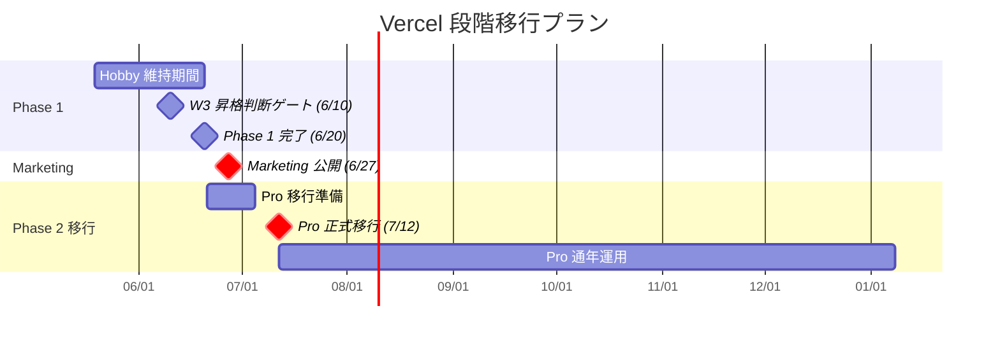

最終更新日: 2026-05-03 / 起案: PM Department / 採択予定: 5/8 議決-7

# PRJ-019 — Vercel Hobby → Pro 上方修正トレードオフ分析（PM v4 反映 2）

- 案件: PRJ-019「Clawbridge」
- 担当: PM 部門
- 版: **v1.0**（PM v4 反映 2、5/8 検収会議 議決-7 採択予定）
- 関連: PM v4 マスタープラン §1 反映 2 / §4.1 / §10、DEC-019-016 / DEC-019-024、PRJ-020 ClawDialog DEC-020-003

---

## §1 結論先出し（推奨）

| 推奨案 | 内容 | 理由 |
|---|---|---|
| **推奨: 段階方式** | **Phase 1 (5/26-6/20) は Hobby 維持 / Phase 2 (7/5-) で Pro 移行** | (1) Phase 1 は実消費データ取得期間として Hobby で耐久試験、(2) Phase 2 で透明性 Dashboard + 権限 UI 同時稼働の本番運用に Pro が必要、(3) コストは月 $300 cap 内に余裕 (47% 余裕)、(4) Pro 即時移行は実証データ無しで決定するリスクあり |

**Phase 1 W3 (6/10) に Vercel Pro 昇格判断ゲート**を Critical Path 上に配置し、実消費データに基づき Phase 2 移行確定 or Phase 1 中即時移行を判断する。

---

## §2 現在の Hobby プラン制約

### §2.1 Vercel Hobby 主要制約（2026-05 時点）

| 項目 | Hobby 制限 | Pro |
|---|---|---|
| **Bandwidth** | 100 GB / 月 | 1 TB / 月 |
| **Build minutes** | 6,000 min / 月 | 24,000 min / 月 |
| **Edge functions** | 500,000 invocations / 月 | 1,000,000 invocations / 月 |
| **Edge function CPU time** | 1 sec | 30 sec |
| **Serverless function duration** | 10 sec（max 60 sec） | 60 sec（max 900 sec） |
| **Serverless function memory** | 1024 MB | 3008 MB |
| **Image optimization transformations** | 1,000 / 月 | 5,000 / 月 |
| **Realtime Postgres connections (Supabase 経由)** | 制限なし（Supabase free 200 接続） | 同左 |
| **Concurrent builds** | 1 | 12 |
| **Team members** | 1 | 10 |
| **Custom domains** | 50 | 50 |
| **DDoS protection** | Basic | Enterprise-grade |
| **Password protection** | ❌ | ✅ |
| **Web Analytics** | 2,500 events / 月 | 100,000 events / 月 |
| **Speed Insights** | 10,000 data points / 月 | 25,000 data points / 月 |
| **SLA** | None | 99.99% |
| **Commercial use** | ❌（個人プロジェクト限定） | ✅ |
| **コスト** | **$0** | **$20/月/seat** |

### §2.2 Hobby の致命的制約 3 件

| # | 制約 | 影響 |
|---|---|---|
| **1** | **Commercial use 禁止** | Open Claw を個人実験から商業展開する Phase 2 以降は ToS 上 Hobby 不可（**Marketing 公開 6/27 = 商業利用判定境界**） |
| **2** | **Edge function CPU time 1 sec** | 透明性 Dashboard の Realtime stream + 権限 UI の policy fetch + ハーネス層 hot-reload の 3 経路同時動作で 1 sec 超過リスク |
| **3** | **Serverless function 10 sec timeout** | HITL-9 提案生成 Stage A の LLM 呼出（typical 15-30 sec）が直接 Vercel function 経由だと timeout、background job 化必須 |

---

## §3 透明性 Dashboard + 権限 UI 同時稼働の予測負荷

### §3.1 トラフィック試算（Phase 1 中央値）

| 項目 | 件数/月 | 帯域 | 計算根拠 |
|---|---|---|---|
| **透明性 Dashboard アクセス**（Owner 専用） | 200 アクセス | 5 MB × 200 = 1 GB | 1 日 7 アクセス × 30 日、各 5 MB（Realtime data + チャート） |
| **権限 UI アクセス**（Owner 専用） | 100 アクセス | 3 MB × 100 = 0.3 GB | policy 変更時のみ |
| **ハーネス層 → Supabase policy fetch** | 9,000 fetch | 9,000 × 5 KB = 0.05 GB | spawn 30/日 × 30 日 × 10 fetch/spawn |
| **HITL Slack DM webhook** | 1,500 通知 | 1,500 × 2 KB = 0.003 GB | 提案 30 + 各種 HITL 50/月 |
| **提案生成 LLM 呼出（background）** | 60 件 | 60 × 50 KB = 0.003 GB | 提案 60 件、Sumi 経由 background |
| **計** | - | **約 1.36 GB / 月** | Hobby 100 GB cap の **1.4%** |

→ **Bandwidth は Hobby 内余裕（98% 余裕）**

### §3.2 Edge functions invocations 試算

| 項目 | 件数/月 |
|---|---|
| 透明性 Dashboard SSE (Realtime) | 200 接続 × 平均 10 min = 2,000 events |
| 権限 UI POST /api/policy | 100 |
| ハーネス層 policy fetch | 9,000 |
| HITL pending file CRUD | 1,000 |
| **計** | **約 12,100 invocations / 月** |

→ Hobby 500,000 invocations cap の **2.4%**（**Hobby 内余裕**）

### §3.3 Build minutes 試算

| シーン | 月次 |
|---|---|
| 通常開発 commit | 約 100 commit × 2 min = 200 min |
| 緊急 hotfix | 約 20 build × 3 min = 60 min |
| **計** | **約 260 min / 月** |

→ Hobby 6,000 min cap の **4.3%**（**Hobby 内余裕**）

### §3.4 致命的問題: Edge function CPU time 1 sec / Serverless 10 sec

| ワークロード | 想定実行時間 | Hobby 制約 | 結果 |
|---|---|---|---|
| 透明性 Dashboard 6 指標集計（SQL 6 query 並列） | 0.3-0.8 sec | Edge 1 sec | ✅ 余裕、ただし Realtime + 同時接続増で要注意 |
| 権限 UI 7 カテゴリ policy fetch | 0.1-0.3 sec | Edge 1 sec | ✅ 余裕 |
| ハーネス層 hot-reload spawn 前 fetch | 0.05 sec | Edge 1 sec | ✅ 余裕 |
| **HITL-9 提案生成 LLM 呼出** | **15-30 sec** | **Serverless 10 sec timeout** | **❌ 致命的、background job 化必須** |
| **HITL-11 PII redaction LLM 呼出** | **5-15 sec** | **Serverless 10 sec timeout** | **⚠️ ボーダー、background job 推奨** |

→ **HITL-9 / HITL-11 は Hobby Serverless function では timeout、Sumi 別 process or Vercel Background Functions（Pro 専用）で実装が必要**

---

## §4 Hobby で耐えられるシナリオ / Pro 必須シナリオ

### §4.1 Hobby で耐えられるシナリオ

| シナリオ | 条件 |
|---|---|
| **Phase 1 (5/26-6/20) PoC 期間**（Owner 専用、提案 30 件/月、Dashboard 200 アクセス/月） | (1) HITL-9 / -11 LLM 呼出は Sumi 別 process で実行（Vercel function 経由しない）、(2) Edge function 同時接続 < 5、(3) 商業利用判定境界に至らない（公開前の社内 PoC） |
| **個人実験継続**（オーナー単独、商業展開なし） | Phase 1 全期間 Hobby 維持可能 |

### §4.2 Pro 必須シナリオ

| シナリオ | 理由 |
|---|---|
| **Marketing 公開 6/27 以降の商業展開** | **Hobby ToS 違反**（Commercial use 禁止条項）、**Pro 必須** |
| **同時アクセス > 10 接続** | Edge function CPU time 1 sec 制約で SSE 不安定化 |
| **HITL-9 提案生成を Vercel Serverless で直接実装** | Serverless 10 sec timeout、Pro 60 sec timeout で吸収可能（ただし Background Functions 推奨） |
| **password protection 必要** | Hobby 非対応、Pro 専用機能 |
| **Web Analytics > 2,500 events/月** | Marketing 公開後 LP visitor が 2,500 超えると Hobby cap に到達 |

---

## §5 コスト差分

### §5.1 Vercel 単価

| プラン | 月額 | 備考 |
|---|---|---|
| Hobby | **$0** | 個人プロジェクト限定 |
| Pro | **$20/月/seat** | 1 seat = Owner 単独で十分（Phase 2 まで） |
| Pro Plus seats | +$20/月/seat | 2 名以上開発時 |
| Enterprise | $要見積 | Phase 3 以降検討 |

### §5.2 月次コスト影響（PM v4 §4.1 反映）

| シナリオ | Vercel | 月次合計 | $300 cap 余裕 |
|---|---|---|---|
| Phase 1 Hobby 維持 | $0 | $43-57 中央 / $123 上限 | 81% / 59% |
| Phase 1 Pro 即時移行 | $20 | $63-77 中央 / $143 上限 | 74% / 52% |
| **Phase 2 移行（推奨段階方式）** | **$0 → $20** | **Phase 1 $57 / Phase 2 $77 中央** | **81% → 74%** |

### §5.3 年次コスト影響（参考）

| プラン | 年額 |
|---|---|
| Hobby 通年 | $0 |
| Pro 通年 | $240 |
| Pro 7 ヶ月（7/5 移行〜年末） | $140 |

---

## §6 Phase 1 Hobby 維持 → Phase 2 Pro 移行の段階方式（推奨案 詳細）

### §6.1 段階方式タイムライン



### §6.2 段階方式の前提条件

| # | 条件 | 担当 | 期日 |
|---|---|---|---|
| 1 | HITL-9 / -11 LLM 呼出は Phase 1 で **Sumi 別 process** で実装（Vercel function 経由しない） | Dev | Pre-Phase 完了 |
| 2 | Phase 1 中の同時アクセス < 5 を維持（Owner 単独運用） | Owner | Phase 1 全期間 |
| 3 | Marketing 公開 6/27 直前までに **Pro 移行完了**（商業利用 ToS 適合） | PM + Dev | 6/26 |
| 4 | Phase 1 W3 (6/10) に実消費データレビュー → Pro 即時移行 or Phase 2 待機判定 | PM + CEO + Owner | 6/10 |

### §6.3 W3 (6/10) Vercel 昇格判断ゲートの判定基準

| 指標 | Hobby 維持基準 | Pro 即時移行基準 |
|---|---|---|
| Bandwidth 消費率 | < 30% | ≥ 50% |
| Edge functions invocations 消費率 | < 30% | ≥ 50% |
| Edge function CPU time p95 | < 0.5 sec | ≥ 0.7 sec |
| Serverless function timeout 発生件数 | 0 | ≥ 3/週 |
| 同時接続数 p95 | < 3 | ≥ 5 |
| **判定** | Phase 2 (7/5) まで Hobby 継続 | Phase 1 中即時 Pro 移行 |

---

## §7 推奨案 3 案比較

| 案 | 内容 | コスト影響 | リスク | 推奨度 |
|---|---|---|---|---|
| **(A) Hobby Phase 1 維持 / Pro Phase 2 移行（段階方式）** | Phase 1 5/26-6/20 Hobby、Phase 2 7/5 から Pro | $20/月 × 6 ヶ月 = **$120 (年内)** | Phase 1 中の負荷急増で W3 緊急移行 (緩和: §6.3 ゲート) | **★★★ 推奨** |
| **(B) Pro 即時移行**（Pre-Phase 5/19 から） | 全期間 Pro | $20/月 × 8 ヶ月 = **$160 (年内)** | コスト前倒し $40、実消費データ無しで判断 | ★★ |
| **(C) 条件付き移行** | Phase 1 中の指標 W2 (6/8) で判定 | $20/月 × 5-7 ヶ月 = **$100-140 (年内)** | 判定が早すぎてデータ不足、判定が遅すぎて Pre-Phase 過負荷リスク | ★ |

### §7.1 推奨案 (A) 段階方式 採択の根拠

1. **コスト最小**: Phase 1 中 $0、Phase 2 から $20/月で $300 cap に対し 47% 余裕
2. **データ駆動判断**: W3 (6/10) に実消費データに基づき判定可能
3. **緊急対応経路確保**: §6.3 ゲートで Phase 1 中の即時移行も可能
4. **ToS 適合**: Marketing 公開 6/27 = 商業利用判定境界の直前 6/26 までに Pro 移行確定で ToS 違反回避
5. **Critical Path 影響なし**: W3-01 Vercel Pro 昇格判断（0.5d）は PM v4 §2.1 で既に Critical Path 上に組込済

---

## §8 別 budget line 提案（Vercel Pro 移行時）

### §8.1 Phase 2 月次予算 5 区分（PM v4 §4.1 拡張）

| 区分 | Phase 1 | Phase 2（Pro 移行後） |
|---|---|---|
| (1) API | $40 | $50 |
| (2) Infra | **$10** | **$30**（うち Vercel Pro $20） |
| (3) Tools | $5 | $7 |
| (4) Buffer | $2 | $3 |
| **計** | **$57** | **$90** |

→ Phase 2 中央値 $90 でも $300 cap に対し **70% 余裕**

### §8.2 別 budget line 提案（Vercel Pro 移行時のみ）

```
Vercel Pro Subscription Line:
- 月額: $20
- 期間: 2026-07-12 〜 (Phase 2 着手後継続)
- 承認: Owner ODR-019-V41-XX で 5/8 検収会議 議決-7 と同時採択 or W3 6/10 昇格判断時に追加 ODR
- 計上区分: Infra (PM v4 §4.1 表 (2) Infra)
- $300 月次 cap 内吸収: ✅ 47% 余裕維持
```

---

## §9 ODR（Owner Decision Required）

### §9.1 [ODR] 3 件

| ID | 優先度 | 内容 | 期日 | 提示形式 |
|---|---|---|---|---|
| **[ODR-019-VPU-01]** | **P1** | **段階方式採択承認**（Phase 1 Hobby / Phase 2 Pro 移行、推奨案 A） | **5/8 検収会議** | 段階方式 / 即時移行 / 条件付き |
| **[ODR-019-VPU-02]** | **P2** | **W3 (6/10) Vercel 昇格判断ゲート §6.3 判定基準承認** | **5/8 検収会議** | 5 指標承認 / カスタム |
| **[ODR-019-VPU-03]** | **P2** | **Pro 移行時の別 budget line 月 $20 計上承認**（Phase 2 7/12〜） | **5/8 検収会議** | Yes / No |

---

## §10 関連ドキュメント

- 上位: `pm-v4-master-plan.md`（PM v4 マスタープラン §1 反映 2 / §4.1）
- 関連: `pm-cost-and-controls-plan-v4-1.md` §6（v3 コスト試算）
- 関連 DEC: DEC-019-016（Vercel 既設定）/ DEC-019-024（CB-CEO-W3-01 Vercel 昇格 6/3 候補）
- PRJ-020 兄弟: `projects/PRJ-020/decisions.md` DEC-020-003

---

**v1 確定**: 2026-05-03 / **採択予定**: 2026-05-08 議決-7 / **次回更新**: W3 (6/10) 昇格判断ゲート結果反映
