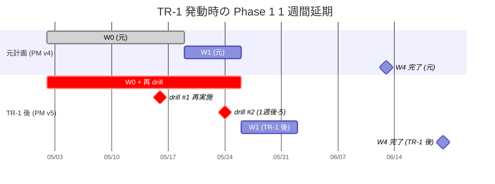
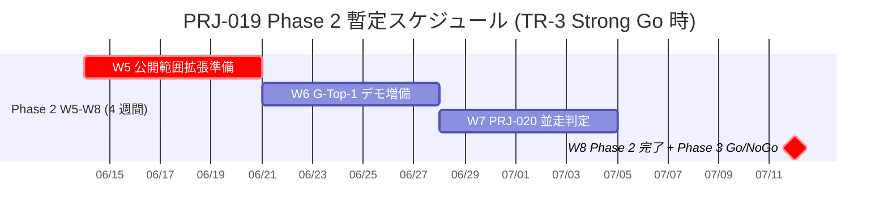
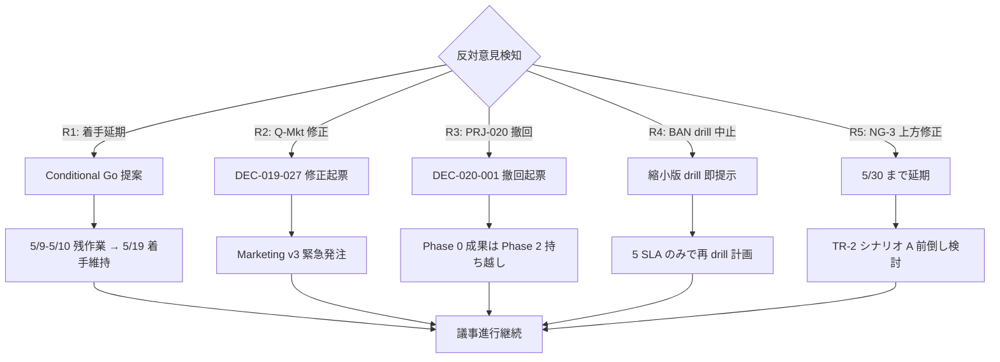
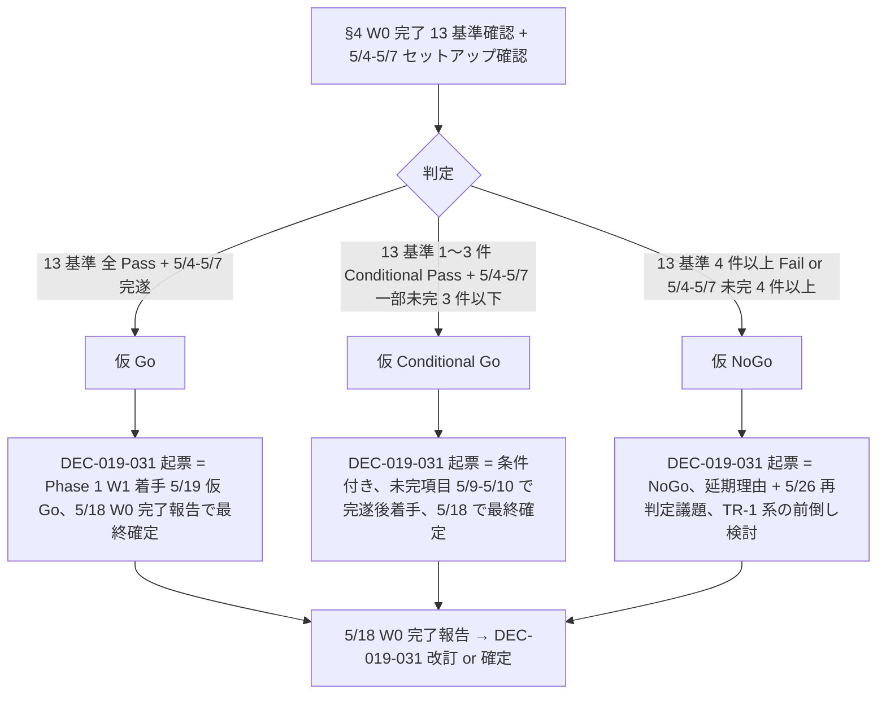

# PM v5 起案テンプレート集 + 5/8 検収会議 議事進行 Runbook

- **文書 ID**: pm-v5-template-and-meeting-runbook
- **制定日**: 2026-05-03
- **対象案件**: PRJ-019「Clawbridge」(主) + PRJ-020「ClawDialog」(連動報告)
- **担当部署**: PM 部門
- **作成者**: PM Agent (claude-code-company)
- **版**: v1.0 (FINAL、5/8 検収会議向け配布版)
- **関連決裁**:
  - DEC-019-007 (Phase 1 強い条件付き Go、5/19〜6/13)
  - DEC-019-008 (NG-3 暫定値: 12h/日 / API 換算 $1,000、5/30 再確認)
  - DEC-019-012 (月次予算 $300 ハードキャップ)
  - DEC-019-022 (PM v4 採用)
  - DEC-019-023 (PM v5 起案トリガー TR-1〜TR-3 確定)
  - DEC-019-024 (CB-CEO-W3-01 = Vercel Hobby→Pro 昇格判断 6/3)
  - DEC-019-025 (エージェント tool 権限 SOP、本書物理書込根拠)
  - DEC-019-026〜030 (Q-Mkt + G-Top-1 採択)
  - DEC-020-001〜003 (PRJ-020 起案)
- **上位レポート**:
  - PM v4 本体: `pm-cost-and-controls-plan-v4.md`
  - W0-Week2 実行計画: `pm-w0-week2-execution-plan.md`
  - 議題 v4: `secretary-w0-week1-meeting-agenda-v4.md`
  - CEO 発言原稿: `ceo-w0-week1-meeting-speech-and-qa-2026-05-08.md`
  - 議事録 template v2: `secretary-w0-week1-meeting-minutes-template-v2.md`

---

## §0. 200 字 サマリ

本書は 5/4-5/7 の先回り準備として PM 部門が整備する 2 大成果物の前半: (a) PM v5 起案テンプレ TR-1/TR-2/TR-3 + 議事録扱い (TR-0) の 4 種類 + (b) 5/8 検収会議 (120 分) の 6 議題分議事進行台本。各 TR テンプレは 7 章立て (起案理由/影響範囲/コスト計画修正/必須コントロール改訂/スケジュール/関連 DEC ID/オーナー判断要請事項) で v4 構造を破壊せず差分のみ明示。会議 Runbook は発言者・時間配分・想定議決 ID・反対意見 5 シナリオ分岐・タイムキーパー/議事録係/発言者の役割分担表・5/8 17:30 リハ段取りを完備。`[OWNER-DECISION-REQUIRED]` タグは PM v5 4 件 + 5/8 議事 8 件 = 計 12 件。

---

## §1. 本書の構成と運用方針

### §1.1 本書 = (a) + (b) 統合納品の根拠

| 章 | 内容 | 対応サブタスク |
|---|---|---|
| §2 | PM v5 起案テンプレ全体構造 (4 種類共通) | (a) |
| §3 | TR-1 テンプレ (BAN drill #1 5/13 Fail 時) | (a) |
| §4 | TR-2 テンプレ (5/30 NG-3 暫定値変更時) | (a) |
| §5 | TR-3 テンプレ (6/13 Phase 1 完了 + Phase 2 Go 時) | (a) |
| §6 | TR-0 議事録扱いテンプレ (TR 発動 0 時の自然移行) | (a) |
| §7 | 5/8 検収会議 議事進行 全体構造 | (b) |
| §8 | 議題 §1〜§5 各議題の詳細台本 | (b) |
| §9 | 反対意見 5 シナリオ × 議事進行分岐 | (b) |
| §10 | 役割分担表 + 5/8 17:30 リハ段取り | (b) |
| §11 | DEC-019-031 起票判断フロー (3 分岐) | (b) |
| §12 | オーナー判断要請事項一覧 + 関連ファイル | 統合 |

### §1.2 運用方針 (v4 構造非破壊)

- PM v4 (`pm-cost-and-controls-plan-v4.md`) は **そのまま継続使用**、本書はあくまで **v5 起案発火時の差分パッチテンプレ** + **5/8 議事進行台本**。
- 各 TR テンプレで PM v4 から変更しない箇所は **「v4 と同一、変更なし」と明示** し、変更箇所のみ差分表示。
- 5/8 議事進行台本は CEO 発言原稿 (`ceo-w0-week1-meeting-speech-and-qa-2026-05-08.md`) を母体とし、PM 視点で議事運営の細部を補完。

### §1.3 [OWNER-DECISION-REQUIRED] タグ運用

本書中に **[OWNER-DECISION-REQUIRED]** タグを付したものは、5/8 検収会議当日または 6/13 Phase 1 完了レビューでオーナー直接判断を要する事項。タグ件数の最終集計は §12 で行う。

---

## §2. PM v5 起案テンプレ全体構造 (4 種類共通骨格)

### §2.1 共通 7 章立て

すべての PM v5 起案 (TR-1/TR-2/TR-3) は以下 7 章立てを必ず採用する。TR-0 (議事録扱い) は 1 章 + 議事録 1 行のシンプル版。

| 章 | 章題 | 必須記載項目 |
|---|---|---|
| 1 | 起案理由 (Why) | 発火トリガー / 発火日時 / 検知者 / 検知経路 / 即時影響範囲 / PM v4 継続不能理由 |
| 2 | 影響範囲 (Scope) | 影響部署 (Dev/Research/Review/PM/秘書/Marketing/Owner) / 影響タスク ID 一覧 / 影響期間 / 影響案件 (PRJ-019 / PRJ-020) |
| 3 | コスト計画修正 (Cost Diff) | PM v4 §3 との差分表 / 月次予算 $300 ハードキャップ抵触有無 / Vercel/Anthropic/OpenAI/その他別 spend cap 修正 |
| 4 | 必須コントロール改訂 (Controls Diff) | PM v4 §2 との差分表 (34 → N 項目) / 新規 G-XX / H-XX / G-Top-X / HITL 第 X 種 / 撤回項目 |
| 5 | スケジュール (Schedule) | PM v4 §6 との差分 (W0-W4 / 着手日 / 完了日 / マイルストン) / Mermaid ガント (簡易版) |
| 6 | 関連 DEC ID (Decisions) | 既存 DEC 一覧 (撤回/維持/改訂) / 新規起票候補 DEC-019-XXX / 起票期日 |
| 7 | オーナー判断要請事項 (Owner-Decision) | [OWNER-DECISION-REQUIRED] タグ付き判断項目 N 件 / 即決 vs 持帰り運用 / 判断期日 |

### §2.2 共通フロントマター (全 v5 起案で必須)

```markdown
# PRJ-019 PM v5 計画書 — TR-X 発動版

- 文書 ID: pm-cost-plan-v5-tr-X
- 制定日: YYYY-MM-DD
- 対象案件: PRJ-019 + PRJ-020 (連動)
- 担当部署: PM 部門
- 起案者: PM Agent (claude-code-company)
- 版: v5.0 (TR-X 発動版、PM v4 を本書で全置換)
- 親文書: pm-cost-and-controls-plan-v4.md (本書 v5 で全置換)
- 関連決裁: DEC-019-023 (TR-X 発動条件) / DEC-019-XXX (TR-X 発動結果決裁)
- 発火トリガー: TR-X
- 発火日時: YYYY-MM-DD HH:MM JST
- 起票期日: YYYY-MM-DD 24:00 JST
```

### §2.3 共通末尾 (全 v5 起案で必須)

```markdown
---

**v5 (TR-X) 確定**: YYYY-MM-DD
**前版**: pm-cost-and-controls-plan-v4.md (本書で全置換)
**次回更新**: ① 5/8 検収会議承認後の修正反映 ② TR-Y 発火時の v6 起案検討
**承認経路**: PM v5 起案 → CEO 即決 or 緊急決裁会議 → 秘書 dashboard 反映 → 全部署共有
```

---

## §3. TR-1 起案テンプレ — BAN drill #1 5/13 Fail 時 (Phase 1 着手延期 5/19→5/26)

### §3.1 発火条件 (DEC-019-023 既決)

- **トリガー**: 2026-05-13 BAN drill #1 で 5 SLA (検知 1 分 / 通知 5 分 / 退避 30 分 / secret rotate 60 分 / P-E 4h) のうち **1 つでも違反** または **副作用検出 1 件以上**
- **起票期日**: 2026-05-14 24:00 JST (drill 結果判定 → CEO 即決 → PM v5 起票)
- **責任者**: PM Agent + Dev / Review 部門

### §3.2 第 1 章 起案理由 (Why) ひな形

```markdown
## §1. 起案理由

### §1.1 発火トリガー詳細
- 発火日時: 2026-05-13 [HH:MM] JST
- 検知者: [Dev Lead / Review Lead 名前]
- 検知経路: BAN drill #1 立会、 5 SLA 計測スプレッドシート / 副作用検出スクリプト verify-zero-side-effect.sh
- 違反項目: [SLA 種別と実測値、副作用検出件数]
- 即時影響範囲: Phase 1 着手 5/19 維持不可、再 drill 必要、必須コントロール一部再検証必要

### §1.2 PM v4 継続不能理由
- v4 §6.3 リスク分岐点で「BAN drill #1 Fail → TR-1 発火 → PM v5 起案」を既定
- v4 §2.4 C-A-03 BAN drill 5 SLA を根拠とする「強い条件付き Go」(DEC-019-007) の前提崩壊
- 再 drill 計画 + 着手延期の正式手順化が v5 で必要

### §1.3 起票責任者
- 主担当: PM Agent
- 共同責任: Dev (drill 実施報告) / Review (5 SLA 検証) / 秘書 (DEC 起票)
- 承認経路: CEO 即決 → Owner 24h 内承認
```

### §3.3 第 2 章 影響範囲 (Scope)

| 項目 | TR-1 影響内容 |
|---|---|
| 影響部署 | Dev / Review (drill 再実施) / PM (本書起案) / 秘書 (DEC 起票) / Owner (再 drill 立会再可否) |
| 影響タスク | W0-Week2 §1.1 W2-D-Drill / W2-CEO-02 / 全 Phase 1 W1 着手前タスク |
| 影響期間 | 5/14 〜 5/26 (着手延期 1 週間) |
| 影響案件 | PRJ-019 主、PRJ-020 (Phase 1 PoC 6/14 着手は維持) |
| 連鎖影響 | Phase 1 W1〜W4 全期間が 1 週間後ろ倒し (W4 = 6/13 → 6/20)、6/20 公開 (DEC-019-026) は別途影響評価必要 |

### §3.4 第 3 章 コスト計画修正 (Cost Diff)

| カテゴリ | PM v4 (5/19 着手前提) | TR-1 v5 (5/26 着手前提) | 差分 | 根拠 |
|---|---|---|---|---|
| Phase 1 月次追加発生 中央値 | $33/月 | $33/月 (変動なし) | ±0 | 期間 1 週間延長でも月次予算は維持 |
| Phase 1 月次追加発生 上限 | $93/月 | $93/月 | ±0 | 同上 |
| ハードキャップ $300 | 維持 | 維持 | ±0 | DEC-019-012 改訂なし |
| 再 drill コスト (mock-claude API 課金、Anthropic 警告メール監視拡張等) | - | +$5〜$15/月 (W2 期間内 1 回限り) | **+$5〜$15** | drill #1 再実施 (5/16 想定) + drill #2 計画変更 (5/24 想定) |
| Vercel Hobby→Pro 昇格判断時期 | 6/3 (W3 中盤) | **6/10 (W3 中盤、1 週間延期)** | +1 週間 | DEC-019-024 修正 |

**結論**: 月次予算 $300 ハードキャップ抵触なし、再 drill コスト $5〜$15 は §3 表 D「H-09 / H-10 監視枠」内で吸収可能。

### §3.5 第 4 章 必須コントロール改訂 (Controls Diff)

| 区分 | PM v4 | TR-1 v5 | 差分 | 備考 |
|---|---|---|---|---|
| 既存 G-01〜G-12 | 12 項目 | 12 項目 | ±0 | 変更なし |
| G-V2-01〜G-V2-11 | 11 項目 | 11 項目 | ±0 | 変更なし |
| C-A-01〜C-A-05 | 5 項目 | **5 + 1 = 6 項目** | **+1** | **C-A-06** (BAN drill 再実施手順 + drill #1/#2/#3 連続失敗時の Phase 2 計画再策定 trigger) を新規発令 |
| H-09 / H-10 | 2 項目 | 2 項目 | ±0 | 変更なし |
| HITL 第 6 種 + G-Top-1〜4 | 5 項目 | 5 項目 | ±0 | 変更なし |
| **合計** | **34 項目** | **35 項目** | **+1** | C-A-06 純増 |

**新規 C-A-06 詳細**:

| ID | 種別 | 着手期 | 担当 | DoD | 検証手段 |
|---|---|---|---|---|---|
| **C-A-06** | DR | W0-Week3 | Dev/Review | drill #1 再実施 (5/16) + drill #2 (5/24 = 元 5/17 の 1 週間後) + drill #3 5/27 (連続失敗時) のシナリオ手順書 + 立会者役割改訂 | 文書 + 5 SLA 全達成、副作用ゼロ |

### §3.6 第 5 章 スケジュール (Schedule)

| 期 | PM v4 期間 | TR-1 v5 期間 | 差分 |
|---|---|---|---|
| W0 | 5/2〜5/18 | 5/2〜5/25 (1 週間延長、再 drill 込み) | +7 日 |
| W1 | 5/19〜5/25 | 5/26〜6/1 | +7 日 |
| W2 | 5/26〜6/1 | 6/2〜6/8 | +7 日 |
| W3 | 6/2〜6/8 | 6/9〜6/15 | +7 日 |
| W4 | 6/9〜6/13 | 6/16〜6/20 | +7 日 |
| Phase 2 Go/NoGo | 6/13 | 6/20 | +7 日 |
| 6/20 公開 (DEC-019-026) | 6/20 | **要再評価** [OWNER-DECISION-REQUIRED] | 公開日維持 vs 6/27 後ろ倒し |



### §3.7 第 6 章 関連 DEC ID (Decisions)

| 種別 | DEC ID | 内容 | 状態 |
|---|---|---|---|
| 維持 | DEC-019-007 | Phase 1 強い条件付き Go (期間 6/13 → 6/20 修正、Go 条件は維持) | 改訂 |
| 維持 | DEC-019-012 | 月次予算 $300 ハードキャップ | 維持 |
| 改訂 | DEC-019-024 | Vercel Hobby→Pro 昇格判断 (6/3 → 6/10) | 改訂 |
| 改訂 | DEC-019-026 | Marketing 公開日 (6/20 維持 vs 6/27 後ろ倒し) | [OWNER-DECISION-REQUIRED] |
| 新規 | DEC-019-XXX (TR-1 発動 + C-A-06 発令) | TR-1 発動結果 + 1 週間延期 + C-A-06 発令 | 新規起票 |
| 新規 | DEC-019-XXX (drill 再実施計画) | drill #1 再実施 5/16 / drill #2 5/24 / drill #3 5/27 (連続失敗時) | 新規起票 |

### §3.8 第 7 章 オーナー判断要請事項 (Owner-Decision)

- **[OWNER-DECISION-REQUIRED] TR-1-1**: 6/20 Marketing 公開日を維持するか 6/27 に後ろ倒しするか (PM 推奨: 6/27 後ろ倒し、Phase 1 完遂後の発信を優先)
- **[OWNER-DECISION-REQUIRED] TR-1-2**: drill #1/#2 連続失敗時の Phase 2 計画再策定 (オプション A 撤回 = DEC-019-011 再評価) を発動するか
- **[OWNER-DECISION-REQUIRED] TR-1-3**: PRJ-020 Phase 1 PoC 6/14 着手を維持するか PRJ-019 Phase 1 完了後 (6/27〜) に押し出すか
- **[OWNER-DECISION-REQUIRED] TR-1-4**: 1 週間延期に伴う追加コスト $5〜$15 を月次予算 $300 内で吸収可とするか、別予算で計上するか

---

## §4. TR-2 起案テンプレ — 5/30 NG-3 暫定値変更時 (NG-3 改訂版コスト + 必須コントロール再構成)

### §4.1 発火条件 (DEC-019-023 既決)

- **トリガー**: 2026-05-30 (W2 終了時) に DEC-019-008 暫定値 (12h/日 / API 換算 $1,000) の運用実績がベースライン乖離 **±20% 超**
- **起票期日**: 2026-05-31 24:00 JST (W2-R-05 NG-3 ベースラインデータ収集結果 → CEO 確認 → PM v5 起票)
- **責任者**: PM Agent + Research 部門

### §4.2 第 1 章 起案理由 (Why) ひな形

```markdown
## §1. 起案理由

### §1.1 発火トリガー詳細
- 発火日時: 2026-05-30 [HH:MM] JST (W2-R-05 ベースライン報告)
- 検知者: Research Lead
- 検知経路: W2 全期間 (5/9〜5/30) の日次稼働時間・API 換算消費の全件記録、移動平均と暫定値の乖離率算出
- 違反項目: 12h/日 暫定値に対する実測平均 [N]h/日 (±20% 超範囲)、API 換算 $1,000/月 暫定値に対する実測 $[M]/月
- 即時影響範囲: Phase 1 着手 5/19 後の動作前提崩壊、必須コントロール H-09 / G-V2-09 閾値再策定必要

### §1.2 PM v4 継続不能理由
- v4 §6.3 リスク分岐点で「5/30 NG-3 暫定値再確認 NG → TR-2 発火 → PM v5 起案」を既定
- v4 §2.3 G-V2-09 (Boris Cherny 線、API 換算 $1,000 計算消費 80%/100%) の閾値が暫定値変動で無効化
- v4 §3.5 Spend Cap 上限の再策定が必要
```

### §4.3 第 2 章 影響範囲 (Scope)

| 項目 | TR-2 影響内容 |
|---|---|
| 影響部署 | Research (本トリガー検知) / Dev (G-V2-09 閾値再実装) / PM (本書起案) / Owner (上方/下方修正承認) |
| 影響タスク | G-V2-09 / H-09 / Spend Cap 設定 (W2-O-01/02) / W3 公式タスク 41 件中の cost-tracker 関連 |
| 影響期間 | 5/31 〜 6/13 (Phase 1 完了まで) |
| 影響案件 | PRJ-019 主、PRJ-020 (Spend Cap $30 連動するため軽微影響) |

### §4.4 第 3 章 コスト計画修正 (Cost Diff)

**シナリオ A (上方修正、12h/日 → 18h/日 / $1,000 → $1,500)**:

| カテゴリ | PM v4 | TR-2 v5 (上方) | 差分 |
|---|---|---|---|
| NG-3 暫定値 | 12h/日 / $1,000 | 18h/日 / $1,500 | +50% |
| Spend Cap Anthropic | $50/月 hard / $40 soft | **$75/月 hard / $60 soft** | +50% |
| 月次予算 $300 | 維持 | 維持 | ±0 (Claude Max $200 内で吸収可) |
| Phase 1 月次追加発生 中央値 | $33/月 | **$40/月** | +$7 |
| Phase 1 月次追加発生 上限 | $93/月 | **$120/月** | +$27 |

**シナリオ B (下方修正、12h/日 → 8h/日 / $1,000 → $700)**:

| カテゴリ | PM v4 | TR-2 v5 (下方) | 差分 |
|---|---|---|---|
| NG-3 暫定値 | 12h/日 / $1,000 | 8h/日 / $700 | -33% |
| Spend Cap Anthropic | $50/月 hard / $40 soft | **$35/月 hard / $30 soft** | -30% |
| Phase 1 月次追加発生 中央値 | $33/月 | **$26/月** | -$7 |
| Phase 1 月次追加発生 上限 | $93/月 | **$70/月** | -$23 |

### §4.5 第 4 章 必須コントロール改訂 (Controls Diff)

**シナリオ A (上方修正)**:

| 区分 | PM v4 | TR-2 v5 (上方) | 差分 |
|---|---|---|---|
| G-V2-09 (Boris Cherny 線、$1,000) | 80%/100% 警告 | **$1,500 基準で 80%/100% 警告に再構成** | 閾値修正 |
| H-09 (Claude Max weekly cap 監視) | 80%/95% | **75%/90% に厳格化** | 閾値修正 (上方修正に伴い消費速度上昇のため) |

**シナリオ B (下方修正)**:

| 区分 | PM v4 | TR-2 v5 (下方) | 差分 |
|---|---|---|---|
| G-V2-09 | $1,000 基準 | **$700 基準で 80%/100% 警告に再構成** | 閾値修正 |
| H-09 | 80%/95% | **85%/98% に緩和** | 閾値修正 (消費速度低下のため) |

### §4.6 第 5 章 スケジュール (Schedule)

- **6/3 Vercel Pro 昇格判断 (CB-CEO-W3-01)**: シナリオ A 上方修正なら昇格濃厚、シナリオ B 下方修正なら未昇格継続濃厚
- **W3〜W4 期間中の中間 review**: 6/8 (W3 末) に再度 NG-3 ベースライン確認、シナリオ A/B 維持判断

### §4.7 第 6 章 関連 DEC ID (Decisions)

| 種別 | DEC ID | 内容 | 状態 |
|---|---|---|---|
| 改訂 | DEC-019-008 | NG-3 暫定値 (12h/日 / $1,000 → A: 18h/$1,500 / B: 8h/$700) | 改訂 |
| 改訂 | DEC-019-012 | Spend Cap 修正 (シナリオ A/B 別) | 改訂 |
| 新規 | DEC-019-XXX (TR-2 発動結果) | TR-2 発動 + シナリオ A or B 採択 | 新規起票 |

### §4.8 第 7 章 オーナー判断要請事項

- **[OWNER-DECISION-REQUIRED] TR-2-1**: シナリオ A (上方修正) と シナリオ B (下方修正) のどちらを採択するか (PM 推奨はベースライン実測値次第、Research 報告に従う)
- **[OWNER-DECISION-REQUIRED] TR-2-2**: 上方修正時の月次予算 $300 ハードキャップ維持可否 (中央値 $40 / 上限 $120 でも 13%/40% 余裕)
- **[OWNER-DECISION-REQUIRED] TR-2-3**: G-V2-09 / H-09 閾値再構成承認 (シナリオ A 厳格化 vs シナリオ B 緩和)
- **[OWNER-DECISION-REQUIRED] TR-2-4**: PRJ-020 Spend Cap $30/月の連動修正可否 (シナリオ A: $45、シナリオ B: $20 候補)

---

## §5. TR-3 起案テンプレ — 6/13 Phase 1 完了 + Phase 2 Go 時 (Phase 2 計画書)

### §5.1 発火条件 (DEC-019-023 既決)

- **トリガー**: 2026-06-13 Phase 1 完了レビューで Phase 2 Go 判定 (Strong Go / Conditional Go / NoGo の 3 分岐)
- **起票期日**: 2026-06-14 24:00 JST
- **責任者**: PM Agent + CEO + Owner

### §5.2 第 1 章 起案理由 (Why) ひな形

```markdown
## §1. 起案理由

### §1.1 発火トリガー詳細
- 発火日時: 2026-06-13 [HH:MM] JST (Phase 1 完了レビュー会議)
- 検知者: CEO + Owner
- 検知経路: DoD 6 項目 (HN/IH trending → /new-project 起票 → 雛形 → Sandbox テスト → Review 合格 → preview deploy → Slack 通知 全自動 / <60min/件 / <$5/件 / 10 連続成功率 ≥80% / 副作用 0 行 / 必須コントロール 34/34) 全達成判定
- 判定種別: Strong Go (DoD 全達成 + Phase 2 拡張準備整備) / Conditional Go (DoD 一部条件付き達成) / NoGo (DoD 未達 → TR-1 系の延期検討)
- 即時影響範囲: Phase 2 (公開範囲拡張 / G-Top-1 デモ件数増 / 月次予算上方修正検討 / PRJ-020 Phase 2 並走判定)

### §1.2 PM v4 継続不能理由
- v4 は Phase 1 (5/19〜6/13) を対象、Phase 2 計画書は本書 v5 (TR-3) で初策定
- Phase 2 期間 (6/14〜??) のコスト計画 + 必須コントロール拡張は v4 範囲外
```

### §5.3 第 2 章 影響範囲 (Scope) — Phase 2 計画書骨格

| 項目 | TR-3 影響内容 |
|---|---|
| 影響部署 | 全 7 部署 (Phase 2 全期間) |
| 影響タスク | Phase 2 W5 以降の全タスク (新規策定) |
| 影響期間 | 6/14 〜 Phase 2 完了 (期間は §5 で別途決定) |
| 影響案件 | PRJ-019 主、PRJ-020 Phase 2 並走判定 (DEC-020-XXX 連動) |

### §5.4 第 3 章 コスト計画修正 (Phase 2 月次予算上方修正検討)

| カテゴリ | Phase 1 PM v4 | Phase 2 PM v5 (TR-3) 候補 | 差分 |
|---|---|---|---|
| 月次ハードキャップ | $300 | **$300 維持 vs $500 上方修正** [OWNER-DECISION-REQUIRED] | 0 or +$200 |
| Phase 2 月次追加発生 中央値 | $33 (Phase 1) | **$50〜$80** (公開範囲拡張で Vercel Sandbox 増加 / G-Top-1 デモ増 / Anthropic / OpenAI embeddings 増) | +$17〜$47 |
| Phase 2 月次追加発生 上限 | $93 (Phase 1) | **$150〜$200** | +$57〜$107 |
| Vercel Pro 確定 | 任意 (W3 中盤判断) | **必須** (公開範囲拡張で Hobby 限界突破) | +$20 確定 |
| Sentry 有償プラン | 検討 | **Team プラン $26/月** | +$26 |
| Supabase Pro | 検討 | **$25/月** | +$25 |

### §5.5 第 4 章 必須コントロール改訂 (Phase 2 拡張)

| 区分 | Phase 1 PM v4 | Phase 2 PM v5 (TR-3) 候補 | 差分 |
|---|---|---|---|
| 既存 G-01〜G-12 | 12 項目 | 12 項目 | ±0 |
| G-V2-01〜G-V2-11 | 11 項目 | 11 項目 | ±0 |
| C-A-01〜C-A-05 | 5 項目 | 5 項目 | ±0 |
| H-09 / H-10 | 2 項目 | 2 項目 | ±0 |
| HITL 第 6 種 + G-Top-1〜4 | 5 項目 | 5 項目 | ±0 |
| **新規 P2-01** (公開範囲拡張時の HITL 第 7 種 external_api 強化) | - | **新規** | +1 |
| **新規 P2-02** (G-Top-1 デモ件数増、月 5 件→10 件昇格時の追加 CEO 個別承認) | - | **新規** | +1 |
| **新規 P2-03** (PRJ-020 Phase 2 並走時の HITL 第 8 種 owner_input_review 共通基盤化) | - | **新規** | +1 |
| **新規 P2-04** (Phase 2 期間中の月次予算 80% 警告自動 spending_review CEO 個別承認) | - | **新規** | +1 |
| **合計** | **34 項目** | **38 項目** | **+4** |

### §5.6 第 5 章 スケジュール (Phase 2 期間)



### §5.7 第 6 章 関連 DEC ID (Decisions)

| 種別 | DEC ID | 内容 | 状態 |
|---|---|---|---|
| 維持 | DEC-019-007 | Phase 1 強い条件付き Go (Phase 1 完遂で目的達成) | 達成 |
| 改訂 | DEC-019-012 | 月次予算ハードキャップ ($300 → $500 上方修正候補) | [OWNER-DECISION-REQUIRED] |
| 改訂 | DEC-019-022 | PM v4 → v5 全置換 | 改訂 |
| 新規 | DEC-019-XXX (Phase 2 着手) | Phase 2 W5〜W8 計画承認 | 新規起票 |
| 新規 | DEC-020-XXX (PRJ-020 Phase 2 並走判定) | PRJ-020 Phase 2 を PRJ-019 Phase 2 と並走するか別フェーズ送りにするか | 新規起票 |

### §5.8 第 7 章 オーナー判断要請事項

- **[OWNER-DECISION-REQUIRED] TR-3-1**: Phase 2 Go 種別 (Strong Go / Conditional Go / NoGo) 判定 (CEO 推奨: DoD 全達成なら Strong Go)
- **[OWNER-DECISION-REQUIRED] TR-3-2**: 月次予算 $300 → $500 上方修正承認 (Phase 2 公開範囲拡張前提)
- **[OWNER-DECISION-REQUIRED] TR-3-3**: PRJ-020 Phase 2 を PRJ-019 Phase 2 と並走するか別フェーズ送りにするか
- **[OWNER-DECISION-REQUIRED] TR-3-4**: Phase 2 期間 (4 週間 / 6 週間 / 8 週間) と Phase 3 Go/NoGo 判定日

---

## §6. TR-0 議事録扱いテンプレ — TR 発動 0 時の自然移行版

### §6.1 発火条件

- **トリガー**: 2026-05-13 BAN drill #1 Pass + 2026-05-30 NG-3 暫定値乖離 ±20% 以内 + 2026-06-13 Phase 2 Strong Go = **TR-1/TR-2/TR-3 すべて未発火**
- **起票期日**: 不要 (議事録 1 行記録のみ)
- **責任者**: 秘書部門 (議事録記録)

### §6.2 議事録 1 行記録テンプレ

```markdown
# 2026-MM-DD PRJ-019 マイルストン記録

- TR-1 (BAN drill #1 5/13): [Pass / Fail = X SLA 違反]
- TR-2 (NG-3 暫定値再確認 5/30): [乖離 ±[N]% 以内、TR-2 発火なし / TR-2 発火 = シナリオ A or B]
- TR-3 (Phase 2 Go/NoGo 6/13): [Strong Go / Conditional Go / NoGo]
- 結論: PM v4 継続使用、PM v5 起案不要 (TR-X 発火 0 件)
```

### §6.3 自然移行版での PM 部門アクション

- PM v4 (`pm-cost-and-controls-plan-v4.md`) を **改訂なしで継続使用**
- 5/14 / 5/31 / 6/14 朝に秘書部門が議事録 1 行記録 → CEO 経由で Owner 共有
- DEC-019-XXX 新規起票なし (TR-X 発火結果記録のための DEC は議事録扱いで完結)
- W3 公式タスク 41 件は PM v2 §3.3 (`pm-architecture-v2-and-phase1-plan.md`) を継続使用

---

## §7. 5/8 検収会議 議事進行 全体構造

### §7.1 全体タイムライン (120 分、議題 v4 準拠)

| 時刻 | 議題 | 主担当 | 所要 | 想定議決 / アウトプット |
|---|---|---|---|---|
| 18:00–18:05 | 開会、3 大ハイリスク事前共有、Q-Mkt 事後承認モード説明 | CEO | 5 分 | — |
| 18:05–18:30 | §1 Dev エビデンス | Dev → Review 検収 | 25 分 | Pass/Fail 判定 (5 完全 + 2 条件付き Pass 着地予測) |
| 18:30–18:50 | §2 Research 補追検証 | Research | 20 分 | DEC-019-021/022 公式承認 (Owner 再確認済) |
| 18:50–19:15 | §3 Review 検収結果 | Review | 25 分 | 検収 Go / 条件付き Go 判定 |
| 19:15–19:35 | §4 W0 完了 13 基準 + Go/NoGo 仮判定 | CEO + Owner | 20 分 | 仮 Go / 仮 NoGo (最終は 5/18) |
| 19:35–20:05 | §5 PM 追加議題 + Q-Mkt 事後承認 + PRJ-020 報告 | PM + 秘書 | 30 分 | DEC-019-030 + DEC-019-031 起票判断 + PRJ-020 Phase 0 受領 |
| 20:05 | 閉会、決議内容の decisions.md 反映確認 | 秘書 | 5 分 (バッファ) | — |

### §7.2 議事進行 5 大原則 (PM 部門推奨)

1. **時間厳守 (タイムキーパー秘書 ±2 分)**: 25 分議題は 27 分超過時に CEO が即時切り上げ、持帰り扱い
2. **議事録同時起票 (秘書 1 名専任)**: 議題進行と並行して `secretary-w0-week1-meeting-minutes-template-v2.md` を埋める
3. **Owner 即決優先**: 軽微議決 (条件 1 つ確認のみ) は議題内即決、構造変更を伴う議決は持帰り (5/9 朝再協議)
4. **反対意見対応分岐は §9 シナリオに従う**: その場で議論せず、5 シナリオ別の対応を機械的に適用
5. **5/8 17:30 リハで全議題の発言順を一度通す (§10 リハ段取り)**

---

## §8. 議題 §1〜§5 各議題の詳細台本

### §8.1 議題 §1 Dev エビデンス (25 分、18:05〜18:30)

| 項目 | 内容 |
|---|---|
| **(1) 発言者順** | CEO 導入 (1 分) → Dev Lead 報告 (15 分) → Review Lead 一次検収 (5 分) → Q&A (4 分) |
| **(2) 時間配分** | 1 + 15 + 5 + 4 = 25 分 |
| **(3) 想定議決 ID** | (なし、§4 で統合判定) |
| **(4) 反対意見対応分岐** | Owner 質問が 4 分超過時、§9 シナリオ R1 (W0 セットアップ未完) との関連付けで打切り、持帰り |
| **(5) 議事録記録項目** | Dev 報告: 95 tests / 11 controls / mock-claude / TimeSource / W0-W2 prep ブートストラップ完遂 / Review 一次検収: Critical X / Major Y / Minor Z 件 |

**台本:**
```
CEO (18:05): 「議題 §1 Dev エビデンス検収を始めます。Dev Lead、報告お願いします」(1 分)
Dev Lead (18:06-18:21): W0-Week1 実装報告 + 11 controls evidence + mock-claude + TimeSource (15 分、添付 D-1〜D-5)
Review Lead (18:21-18:26): 一次検収結果報告 (5 分、Critical/Major/Minor 件数)
CEO (18:26-18:30): Owner 質問受付 (4 分、§9.2 必須コントロール 5 件のうち 1〜2 件対応想定)
```

### §8.2 議題 §2 Research 補追検証 (20 分、18:30〜18:50)

| 項目 | 内容 |
|---|---|
| **(1) 発言者順** | CEO 導入 (1 分) → Research Lead 報告 (12 分) → CEO 評価 (3 分) → Owner 再確認 (4 分) |
| **(2) 時間配分** | 1 + 12 + 3 + 4 = 20 分 |
| **(3) 想定議決 ID** | DEC-019-021 / DEC-019-022 (5/3 即決済の Owner 直接面前再確認) |
| **(4) 反対意見対応分岐** | Owner 「DEC-019-021 R-019-12 降格根拠が弱い」発言時、§9 シナリオ R3 (PRJ-020 起案撤回) と異なる単独議論 → 5/9 持帰り |
| **(5) 議事録記録項目** | OP-1〜OP-5 一次裏取り結果 / R-019-12 → R-019-12-A/B 分割結果 / 4 系統 changelog 監視 Runbook 内容 / DEC-019-021 / 022 Owner 再確認結果 (異議 / なし) |

**台本:**
```
CEO (18:30): 「議題 §2 Research 補追検証に移ります。Research Lead、報告お願いします」(1 分)
Research Lead (18:31-18:43): OP-1〜5 一次裏取り + P-D 改 resilient + R-019-12 再格付け + 4 系統 changelog Runbook (12 分、添付 R-1〜R-3)
CEO (18:43-18:46): 評価コメント (3 分、「Phase 1 月 30〜90 ループ実装可能性 YES (条件付き) を承認、4 系統 changelog 監視は 5/19〜5/25 秘書手動 fallback で対応」)
CEO (18:46-18:50): Owner 再確認 (4 分、「DEC-019-021 / 022 を Owner 直接面前で再確認します。異議ございますか」)
```

### §8.3 議題 §3 Review 検収結果 (25 分、18:50〜19:15)

| 項目 | 内容 |
|---|---|
| **(1) 発言者順** | CEO 導入 (1 分) → Review Lead 報告 (15 分) → CEO 評価 (5 分) → Q&A (4 分) |
| **(2) 時間配分** | 1 + 15 + 5 + 4 = 25 分 |
| **(3) 想定議決 ID** | (なし、§4 で統合判定) |
| **(4) 反対意見対応分岐** | Owner 「ペネトレ B1〜B6 で 1 件 Fail がある場合の判断」発言時、§9.3 BAN drill 関連 Q11 で対応 |
| **(5) 議事録記録項目** | チェックリスト 7 項目結果 / B1〜B6 ペネトレ 45 試行結果 / ToS allowlist DoD 統合 v1 / BAN drill #1 シナリオ承認 |

**台本:**
```
CEO (18:50): 「議題 §3 Review 検収結果に移ります。Review Lead、報告お願いします」(1 分)
Review Lead (18:51-19:06): 検収チェックリスト 7 項目 + ペネトレ B1〜B6 + ToS allowlist DoD + BAN drill #1 シナリオ (15 分、添付 V-1〜V-4)
CEO (19:06-19:11): 評価コメント (5 分、「検収 Go / 条件付き Go 判定。Critical 0 / Major 5 件以下なら Conditional Go」)
CEO (19:11-19:15): Q&A (4 分、§9.3 BAN drill 関連 5 件のうち 1〜2 件対応想定)
```

### §8.4 議題 §4 W0 完了 13 基準 + Go/NoGo 仮判定 (20 分、19:15〜19:35)

| 項目 | 内容 |
|---|---|
| **(1) 発言者順** | CEO 議事 (2 分) → Owner 5/4-5/7 セットアップ確認 (10 分) → Go/NoGo 議決 (8 分) |
| **(2) 時間配分** | 2 + 10 + 8 = 20 分 |
| **(3) 想定議決 ID** | **DEC-019-031 起票** (Phase 1 W1 着手 5/19 Go/NoGo 仮判定、最終は 5/18) |
| **(4) 反対意見対応分岐** | Owner 「Phase 1 W1 着手延期希望」 → §9.1 R1 シナリオ (Conditional Go 提案 → 5/9-5/10 残作業完了 → 5/19 着手維持) |
| **(5) 議事録記録項目** | 13 基準各項目 Pass/Fail / 5/4-5/7 進捗追跡シート結果 / 仮 Go / 仮 Conditional Go / 仮 NoGo の 3 分岐結果 / DEC-019-031 起票方式 |

**台本:**
```
CEO (19:15-19:17): 「議題 §4 W0 完了 13 基準確認 + Phase 1 W1 着手 5/19 Go/NoGo 仮判定に移ります」(2 分)
CEO (19:17-19:27): Owner 5/4-5/7 セットアップ確認 (10 分、`secretary-owner-daily-progress-tracker-2026-05-04-07.md` チェックリスト読み上げ)
CEO (19:27-19:33): Go/NoGo 仮議決 (6 分、CEO 推奨 = Go)
Owner (19:33-19:35): Owner 仮判定 (2 分、Go / Conditional Go / NoGo)
```

**DEC-019-031 起票判断フロー** (詳細は §11):
- 仮 Go → DEC-019-031 起票 (5/8 22:00 まで、5/18 W0 完了報告で最終確定)
- 仮 Conditional Go → DEC-019-031 起票 (条件付き、未完項目 5/9-5/10 で完遂後着手)
- 仮 NoGo → DEC-019-031 起票 (NoGo + 延期理由 + 5/26 再判定議題)

### §8.5 議題 §5 PM 追加議題 + Q-Mkt 事後承認 + PRJ-020 報告 (30 分、19:35〜20:05)

#### §8.5.1 §5.1 PM v4 公式承認 (5 分、19:35〜19:40)

| 項目 | 内容 |
|---|---|
| **(1) 発言者順** | PM 部門 1 分読み上げ → CEO 仮承認 → Owner 即決 |
| **(2) 時間配分** | 1 + 2 + 2 = 5 分 |
| **(3) 想定議決 ID** | DEC-019-022 (PM v4 採用) の Owner 直接面前再確認 |
| **(4) 反対意見対応分岐** | Owner 「v4 → v5 への転用条件が不明確」発言時、本書 §3〜§5 のテンプレ整備で対応済を 1 分で説明 |
| **(5) 議事録記録項目** | 必須コントロール 28→34 / Phase 1 月次中央値 $33 / 上限 $93 / 月次ハードキャップ $300 維持 / TR-1〜TR-3 公式組込 |

#### §8.5.2 §5.2 DEC-019-021〜024 公式承認 (5 分、19:40〜19:45)

| 項目 | 内容 |
|---|---|
| **(1) 発言者順** | 秘書部門読み上げ (3 分) → CEO 再確認 (1 分) → Owner 最終承認 (1 分) |
| **(2) 時間配分** | 3 + 1 + 1 = 5 分 |
| **(3) 想定議決 ID** | DEC-019-021〜024 (5/3 即決済の Owner 直接面前再確認) |
| **(4) 反対意見対応分岐** | DEC-019-024 (Vercel 6/3 昇格判断) 発言時、本書連動の `pm-cb-ceo-w3-01-decision-template.md` で対応済を 30 秒で説明 |
| **(5) 議事録記録項目** | DEC-019-021 R-019-12 分割 / DEC-019-022 4 系統 changelog / DEC-019-023 TR-1〜TR-3 / DEC-019-024 CB-CEO-W3-01 |

#### §8.5.3 §5.3 5/15 競合解消 + W0-W2 タスク台帳 29 件統合承認 (5 分、19:45〜19:50)

| 項目 | 内容 |
|---|---|
| **(1) 発言者順** | PM 部門読み上げ (1 分) → CEO 提案 (1 分) → 秘書部門 PRJ-018 PM 調整可否口頭確認 (1 分) → Owner 即決 (2 分) |
| **(2) 時間配分** | 1 + 1 + 1 + 2 = 5 分 |
| **(3) 想定議決 ID** | (なし、5/3 PM v4 §3.5 で即決済の正式承認) |
| **(4) 反対意見対応分岐** | AS-151 スライド失敗時の代替案 (W2-D-Docs を 5/14 に前倒し) を 30 秒で説明 |
| **(5) 議事録記録項目** | 5/15 → 5/16 AS-151 スライド承認 / W0-W2 台帳 29 件即決承認 |

#### §8.5.4 §5(c) G-Top-1 採用案 (a)+(e) ハイブリッド DEC-019-030 公式承認 (10 分、19:50〜20:00)

| 項目 | 内容 |
|---|---|
| **(1) 発言者順** | 秘書部門読み上げ (1 分) → CEO 採用根拠 6 点説明 (3 分) → Phase 1 デモ DoD 詳細確認 (3 分) → Dev FN-Black 補正計画確認 (2 分) → Owner 最終確認 (1 分) |
| **(2) 時間配分** | 1 + 3 + 3 + 2 + 1 = 10 分 |
| **(3) 想定議決 ID** | DEC-019-030 (5/3 即決済の Owner 直接面前正式承認) |
| **(4) 反対意見対応分岐** | §9.4 R2 (チームマネジメント PRJ で diversity 増やすべき) シナリオ対応 |
| **(5) 議事録記録項目** | DEC-019-030 (a) HN trending → 開発者向け CLI / (e) Indie Hackers → microSaaS / FN-Black ≤ 10% / 90 件アノテ / W3 中盤 + W4 終盤 2 回再評価 |

#### §8.5.5 §5(d) PRJ-020 ClawDialog Phase 0 結果報告 (5 分、20:00〜20:05)

| 項目 | 内容 |
|---|---|
| **(1) 発言者順** | 秘書部門 DEC-020-001〜003 読み上げ (1.5 分) → Phase 0 4 並列成果サマリ (2.5 分) → Phase 1 PoC Go/NoGo 議題追加予告 (1 分) |
| **(2) 時間配分** | 1.5 + 2.5 + 1 = 5 分 |
| **(3) 想定議決 ID** | (なし、6/13 Phase 1 PoC 議題追加同意のみ受領) |
| **(4) 反対意見対応分岐** | §9.5 シナリオ「PRJ-020 起案撤回希望」(R3) → DEC-020-001 撤回 DEC 起票 + Phase 0 4 件成果は Phase 2 持ち越し |
| **(5) 議事録記録項目** | Phase 0 4 件 (CEO スコープ定義 / Research 接続方式 / Dev skeleton / Review セキュリティ) 受領 / 6/13 Phase 1 PoC Go/NoGo 議題追加同意 / 異議 (なし) |

#### §8.5.6 §5 後半 Q-Mkt 8 件事後承認 (圧縮版、議事録 1 行記録のみ)

| 項目 | 内容 |
|---|---|
| **(1) 発言者順** | 秘書部門 1 分以内で議事録 1 行報告 (実時間ゼロ、§5(c) G-Top-1 議論の冒頭で吸収) |
| **(2) 時間配分** | 0 分実時間 + 議事録 1 行 |
| **(3) 想定議決 ID** | DEC-019-026〜029 + DEC-019-030 (5/3 即決済の議事録扱い、議事録 1 行記録のみ) |
| **(4) 反対意見対応分岐** | Owner 「Q-Mkt 既決 4 件のうち 1 件修正希望 (例 Heading C)」発言時、§9 R2 シナリオで対応 → DEC-019-027 修正 DEC 起票 + Marketing v3 緊急発注 |
| **(5) 議事録記録項目** | DEC-019-026 公開 6/20 朝 / DEC-019-027 Heading A / DEC-019-028 部分開示 / DEC-019-029 HP トップ + 事例 + Contact / 議事録扱い 4 件 (Q-Mkt-01/03/07/08) を 1 行ずつ |

---

## §9. 反対意見 5 シナリオ × 議事進行分岐

### §9.1 5 シナリオ整理 (CEO 発言原稿 §10 を母体に PM 視点で再構成)

| # | シナリオ | 発生想定議題 | 第 1 対応者 | 議事進行分岐 |
|---|---|---|---|---|
| **R1** | Phase 1 W1 着手延期希望 (Owner W0 セットアップ未完) | §4 W0 完了 + Go/NoGo | CEO | Conditional Go 提案 → DEC-019-031 起票 (条件付き) → 5/9-5/10 残作業完了 → 5/19 着手維持 |
| **R2** | Q-Mkt 既決の修正希望 (Heading C に変更) | §5 後半 Q-Mkt 事後承認 | CEO + Marketing | DEC-019-027 修正 DEC 起票 + Marketing v3 緊急発注 + 6/12 締切再評価 |
| **R3** | PRJ-020 起案撤回希望 | §5(d) PRJ-020 報告 | CEO | DEC-020-001 撤回 DEC 起票 + Phase 0 4 件成果は Phase 2 持ち越し |
| **R4** | BAN drill #1/#2 中止希望 | §3 Review 検収結果 / §4 議論中 | CEO + Review Lead | 推奨せず (Phase 1 W1 着手不可)、修正案 = drill 縮小版 (5 SLA のみ) を即提示 |
| **R5** | NG-3 12h/日上限を 24h に上方修正希望 (5/30 前) | §5.1 PM v4 公式承認 | CEO + Research | 5/30 再確認まで延期、暫定 18h/日まで段階的緩和 (TR-2 シナリオ A 前倒し提案) |

### §9.2 R1〜R5 議事進行分岐フロー



### §9.3 議事進行 共通対応原則

1. **第 1 対応者は CEO 単独 (R4 のみ Review Lead 同伴)**: PM 部門は議事録記録 + DEC 起票候補ドラフトに専念
2. **議論時間は 5 分上限**: 5 分超過時は 5/9 朝持ち越し対応 (`secretary-w0-week1-meeting-minutes-template-v2.md` §6 雛形)
3. **複数シナリオ同時発生時**: R1 (W0 セットアップ未完) を最優先対応、他は 5/9 朝再協議
4. **議事録記録**: 反対意見出た場合「Owner 異議 (シナリオ Rx)」を §5 議事録 §X に明記

---

## §10. 役割分担表 + 5/8 17:30 リハーサル段取り

### §10.1 5/8 当日役割分担表 (8 役 × 7 部署)

| 役割 | 担当者 (推奨) | 主要責務 | 補助 |
|---|---|---|---|
| **議長** | CEO | 議事進行、全議題タイムキーピング、議決宣言 | (なし) |
| **タイムキーパー** | 秘書部門 #1 | 各議題 ±2 分管理、25 分超過時 CEO 通知、終了時刻アラート | 議事進行と分離 |
| **議事録係** | 秘書部門 #2 | 議事録 template v2 同時起票、DEC-019-XXX ドラフト | 議事中の DEC ドラフト |
| **発言者 (Dev)** | Dev Lead | §1 報告 (15 分) + §1 Q&A 対応 | Dev サブメンバ 1 名 |
| **発言者 (Research)** | Research Lead | §2 報告 (12 分) + §2 Q&A 対応 | Research サブメンバ 1 名 |
| **発言者 (Review)** | Review Lead | §3 報告 (15 分) + §3 Q&A 対応 + §1 一次検収 (5 分) | Review サブメンバ 1 名 |
| **発言者 (PM)** | PM Agent | §5.1〜§5.3 説明 + §5(c) FN-Black 補正計画 (2 分) | PM サブメンバなし |
| **発言者 (Marketing)** | Marketing Lead | §5 後半 Q-Mkt 8 件事後承認 1 行報告 (1 分以内) | Marketing サブメンバなし |
| **決裁者** | Owner | 全議題 Go/NoGo / 即決 / 持帰り | (なし) |

### §10.2 5/8 17:30 リハーサル段取り (60 分、CEO + 主要部署リード 5 名)

| 時刻 | 内容 | 担当 | 所要 |
|---|---|---|---|
| 17:30〜17:35 | リハ開始、議題 v4 全体構造再確認 (本書 §7) | CEO | 5 分 |
| 17:35〜17:45 | §1 Dev 報告ドライラン (時間圧縮、3 分) + §2 Research (3 分) + §3 Review (4 分) | 各 Lead | 10 分 |
| 17:45〜17:50 | §4 Owner セットアップ確認シミュレーション (5 分、CEO + 秘書) | CEO + 秘書 | 5 分 |
| 17:50〜18:00 | §5 PM 追加議題 + §5(c) G-Top-1 + §5(d) PRJ-020 ドライラン (10 分) | PM + 秘書 | 10 分 |
| **18:00** | **本会議開始 (Owner 入室タイミング)** | 全員 | — |

### §10.3 リハ時の確認事項 (チェックリスト)

- [ ] 各 Lead の発言は時間内 (Dev 15 / Research 12 / Review 15 / PM 説明 5 / Marketing 1 分)
- [ ] §9 反対意見 5 シナリオ R1〜R5 を CEO が即座に分岐できるか口頭確認
- [ ] 秘書部門 #1 (タイムキーパー) と #2 (議事録係) の役割分離が機能するか確認
- [ ] DEC-019-031 起票判断フロー (§11) を CEO が口頭で説明できるか確認
- [ ] §7 5 大原則 (時間厳守 / 議事録同時起票 / Owner 即決優先 / 反対意見分岐 / リハ通し) を全員が把握済

### §10.4 リハ後 18:00 直前の最終確認 (5 分)

- 添付 20 件 (議題 v4 §4) の配布完了確認
- Owner 入室の動線確認 (Slack / Zoom 入室確認)
- 録画開始確認 (`projects/PRJ-019/reports/meetings/2026-05-08-w0-week1-review.mp4`)

---

## §11. DEC-019-031 起票判断フロー (Go / Conditional Go / NoGo の 3 分岐)

### §11.1 判定基準

5/8 議題 §4 で Owner が Phase 1 W1 着手 5/19 Go/NoGo 仮判定を行う際の 3 分岐基準。



### §11.2 各分岐の起票文言テンプレ

**仮 Go テンプレ (DEC-019-031)**:
```markdown
## DEC-019-031: Phase 1 W1 着手 5/19 仮 Go (5/8 検収会議仮判定)

- 起票日: 2026-05-08
- 起票者: 秘書部門 (CEO 経由)
- 決裁者: Owner
- 内容: W0 完了 13 基準 全 Pass + Owner 5/4-5/7 セットアップ完遂を確認、Phase 1 W1 着手 5/19 仮 Go 判定。最終 Go は 5/18 W0 完了報告で確定。
- 関連: DEC-019-007 (Phase 1 強い条件付き Go) / DEC-019-022 (PM v4)
```

**仮 Conditional Go テンプレ**:
```markdown
## DEC-019-031: Phase 1 W1 着手 5/19 仮 Conditional Go (5/8 検収会議仮判定)

- 起票日: 2026-05-08
- 起票者: 秘書部門 (CEO 経由)
- 決裁者: Owner
- 内容: W0 完了 13 基準 N 件 Conditional Pass + Owner 5/4-5/7 セットアップ M 件未完を確認、Phase 1 W1 着手 5/19 仮 Conditional Go 判定。未完項目 [項目名 1] [項目名 2] を 5/9-5/10 で完遂後、5/18 W0 完了報告で最終 Go 確定。
- 関連: DEC-019-007 / DEC-019-022 / TR-1 (発火しない場合)
```

**仮 NoGo テンプレ**:
```markdown
## DEC-019-031: Phase 1 W1 着手 5/19 仮 NoGo (5/8 検収会議仮判定)

- 起票日: 2026-05-08
- 起票者: 秘書部門 (CEO 経由)
- 決裁者: Owner
- 内容: W0 完了 13 基準 N 件 Fail + Owner 5/4-5/7 セットアップ M 件未完を確認、Phase 1 W1 着手 5/19 仮 NoGo 判定。延期日 = 2026-05-26、5/26 再判定議題を 5/22 に追加。TR-1 (BAN drill #1) 発火検討。
- 関連: DEC-019-007 改訂候補 / DEC-019-024 改訂候補
```

### §11.3 起票期日と承認経路

- **5/8 22:00 まで**: 秘書部門が DEC-019-031 起票 → CEO 承認 → `decisions.md` 反映
- **5/8 議事中起票推奨**: 議題 §4 終了時点で秘書 #2 (議事録係) が DEC ドラフトを画面共有、Owner 即決
- **5/9 朝までに**: 全部署 (CEO + 7 部署) に DEC-019-031 確定通知

---

## §12. オーナー判断要請事項 一覧 + 関連ファイル

### §12.1 [OWNER-DECISION-REQUIRED] タグ件数集計

| 章 | タグ件数 | 内訳 |
|---|---|---|
| §3 TR-1 起案テンプレ | 4 件 | TR-1-1〜TR-1-4 |
| §4 TR-2 起案テンプレ | 4 件 | TR-2-1〜TR-2-4 |
| §5 TR-3 起案テンプレ | 4 件 | TR-3-1〜TR-3-4 |
| §6 TR-0 議事録扱い | 0 件 | (Owner 判断不要、議事録 1 行記録のみ) |
| §7-§11 5/8 議事進行 | 0 件 (本書) | (議事中の Owner 即決事項は §8 で各議題内列挙、本書ではタグ付与せず) |
| **合計** | **12 件** | TR-1: 4 / TR-2: 4 / TR-3: 4 |

### §12.2 5/8 議事中の Owner 即決事項 (タグ付与なし、議事内即決対象)

5/8 議事進行中に Owner 判断を要する事項は本書 §8 各議題で列挙済 (発言者 / 時間配分 / 想定議決 ID 表内)。代表的なもの:
- §2 Research: DEC-019-021 / 022 Owner 直接面前再確認 (異議なき場合は議事録記録のみ)
- §4: DEC-019-031 起票 (Go / Conditional Go / NoGo の 3 分岐、§11 フロー適用)
- §5.2: DEC-019-021〜024 Owner 直接面前再確認
- §5(c): DEC-019-030 Owner 直接面前正式承認
- §5(d): PRJ-020 Phase 0 受領 + 6/13 Phase 1 PoC 議題追加同意
- §5 後半: Q-Mkt 既決 8 件議事録扱い

### §12.3 関連ファイル

- 親文書 (PM v4): `pm-cost-and-controls-plan-v4.md` (本書はその v5 起案テンプレ + 5/8 議事 Runbook)
- 連動 (Vercel 6/3 判断テンプレ): `pm-cb-ceo-w3-01-decision-template.md` (本タスク (c) 納品物、本書と同時納品)
- 連動 (W0-Week2 実行計画): `pm-w0-week2-execution-plan.md`
- 連動 (議題 v4): `secretary-w0-week1-meeting-agenda-v4.md`
- 連動 (議事録 template v2): `secretary-w0-week1-meeting-minutes-template-v2.md`
- 連動 (CEO 発言原稿): `ceo-w0-week1-meeting-speech-and-qa-2026-05-08.md`
- 連動 (W0-Week2 タスク台帳): `secretary-w0-week2-task-ledger.md`
- 連動 (BAN drill #1 シナリオ): `review-ban-drill-1-scenario.md` / `review-ban-drill-1-detailed-procedure.md`
- 連動 (Owner 進捗追跡): `secretary-owner-daily-progress-tracker-2026-05-04-07.md`
- 上流 SOP: `organization/rules/agent-tool-permission-sop.md` (DEC-019-025、本書物理書込根拠)
- 意思決定: `projects/PRJ-019/decisions.md`

### §12.4 配布履歴と承認

| 版 | 日付 | 状態 | 備考 |
|---|---|---|---|
| **v1.0 FINAL** | **2026-05-03** | **PM 部門制定 (CEO 経由配布、本書)** | **(a) PM v5 起案テンプレ TR-1〜TR-3 + TR-0 議事録扱い + (b) 5/8 検収会議 議事進行 Runbook、12 件 [OWNER-DECISION-REQUIRED] 含む** |

### §12.5 次回更新

- 5/4 CEO 即決後の修正反映
- 5/8 17:30 リハ実施結果の反映
- 5/8 検収会議終了後の議事録最終版反映
- 5/13 BAN drill #1 結果次第で TR-1 v5 本起案 (本書 §3 テンプレ適用)
- 5/30 NG-3 ベースライン結果次第で TR-2 v5 本起案 (本書 §4 テンプレ適用)
- 6/13 Phase 1 完了レビュー結果次第で TR-3 v5 本起案 (本書 §5 テンプレ適用)

---

**制定**: PM 部門 ／ **経由**: CEO ／ **宛**: Owner + 7 部署 (CEO / Dev / Research / Review / PM / 秘書 / Marketing)

**制定日**: 2026-05-03 ／ **対象会議実施日**: 2026-05-08 18:00〜20:00 JST ／ **TR-1〜TR-3 v5 起案発火期日**: 5/14 / 5/31 / 6/14
