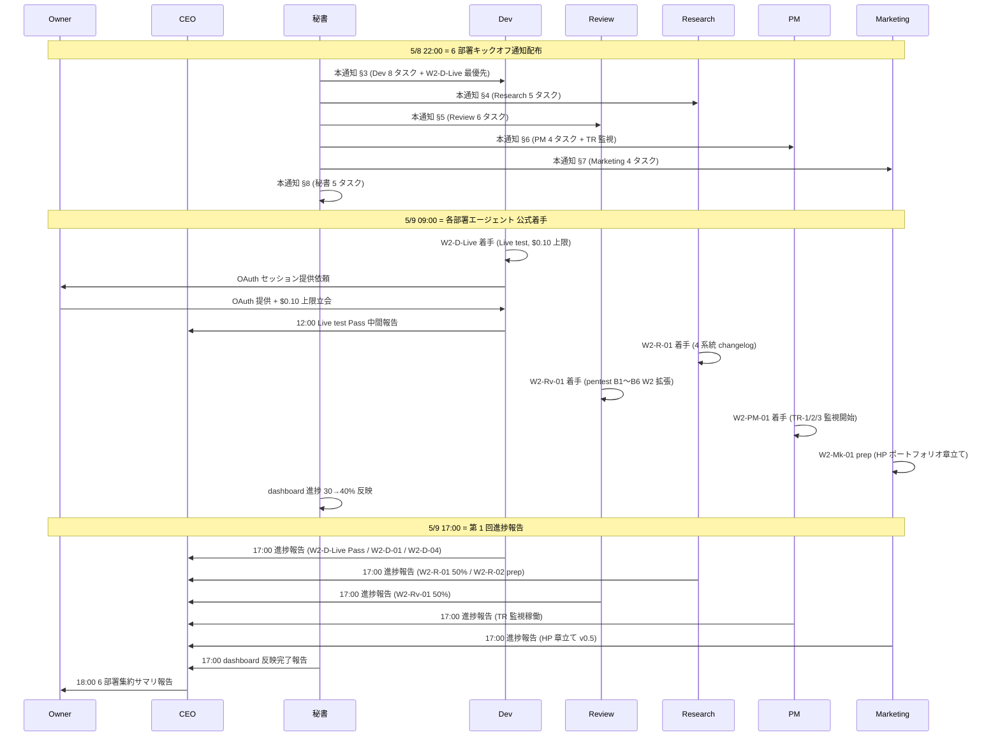

# PRJ-019 Clawbridge — W0-Week2 公式着手 6 部署キックオフ通知雛形

- 案件: PRJ-019「Clawbridge」 — Open Claw を自律オーナーとする AI 組織ハーネス基盤
- 部署: PM 部門（起案）
- 作成日: 2026-05-03
- 作成者: PM Agent (claude-code-company)
- 対象配布: Dev / Research / Review / PM / Marketing / 秘書 6 部署エージェント全員
- 配布タイミング: **5/8 22:00（5/8 18:00〜20:00 検収会議 Go 判定確定後）**
- 着手対象期間: **W0-Week2 (2026-05-09 09:00 〜 2026-05-18 18:00、10 営業日)**
- 関連 SOP: `organization/rules/agent-tool-permission-sop.md` (DEC-019-025)
- 関連レポート:
  - `projects/PRJ-019/reports/pm-cost-and-controls-plan-v4.md`（PM v4 / 29 タスク × 6 部署マスタ表）
  - `projects/PRJ-019/reports/pm-w0-week2-execution-plan.md`（W0-Week2 実行計画 389 行）
  - `projects/PRJ-019/reports/secretary-w0-week2-kickoff-checklist.md`（秘書 C kickoff チェックリスト 9 カテゴリ × 28 項目）
  - `projects/PRJ-019/reports/secretary-w0-week2-task-ledger.md`（秘書 W0-Week2 タスク台帳）
  - `projects/PRJ-019/decisions.md`（DEC-019-001〜025）
- 関連決裁: DEC-019-014 / DEC-019-018 / DEC-019-019 / DEC-019-020 / DEC-019-021 / DEC-019-022 / DEC-019-023 / DEC-019-024 / DEC-019-025

---

## §0. エグゼクティブサマリ（200 字）

5/8 検収会議 v3（18:00〜20:00）で Go 判定が下った場合、5/9 09:00 に Phase 1 W0-Week2 が公式着手される。本書は 6 部署エージェント（Dev / Research / Review / PM / Marketing / 秘書）が 5/9 朝に起動された際、即座に着手内容・期日・DoD・依存関係・critical path 関与・報告サイクル・SOP 順守を理解できる **キックオフ通知雛形** を物理整備したもの。29 タスク × 6 部署横断のマスタ表に対応し、秘書 C kickoff チェックリスト §4 部署別着手 6 項目と整合。各部署 §x.5 で SOP DEC-019-025 順守確認を全件含有、絵文字禁止 / 12h 連続稼働上限 / 月次予算 $300 ハードキャップを横断ルール化（§9）。

---

## §1. 背景（5/8 → 5/9 移行 + キックオフ運用）

### §1.1 5/8 検収会議 v3 の位置付け

- **18:00〜20:00 (120 分)** で開催される W0-Week1 検収会議 v3（議題 90 分 + PM 議題追加 30 分）
- 既定議題 (Review 部門 `review-w0-week1-meeting-agenda.md`):
  - §1 Dev W0-Week1 エビデンス検収（30 分）
  - §2 Research W0-Week1 OP-1〜OP-5 裏取り検収（20 分）
  - §3 Review W0-Week1 ToS allowlist DoD + BAN drill #1 シナリオ受領（30 分）
  - §4 Phase 1 着手 7 条件再確認（10 分）
- PM 議題追加 (PM v4 §4.2):
  - §5-1 PM v4 公式承認 / §5-2 DEC-019-021〜024 即決 / §5-3 W0-Week2 タスク台帳承認 / §5-4 5/15 競合解消 (AS-151 5/16 スライド) 承認
- **Go 判定** が下った場合のみ本通知雛形が 5/8 22:00 に各部署エージェントへ配布される

### §1.2 5/9 09:00 公式着手の運用

| 時刻 | アクション | 責任者 |
|---|---|---|
| 5/8 18:00 | 検収会議 v3 開始 | Owner + CEO + Review |
| 5/8 20:00 | Go/NoGo 判定確定 | CEO |
| 5/8 21:00 | 検収議事録 v1 起案 | 秘書 |
| 5/8 22:00 | 本通知雛形を 6 部署エージェントへ配布 | 秘書 |
| 5/9 02:00 | 夜間バッチ準備完了（Live test fixture / Owner OAuth $0.10 setup / drill 用 wrapper） | Dev + 秘書 |
| 5/9 09:00 | 各部署エージェント 公式着手 | 6 部署 |
| 5/9 17:00 | 各部署 第 1 回進捗報告（CEO 経由オーナー） | 6 部署 → CEO |

### §1.3 本通知雛形の運用方針

- 各部署 §x.1〜§x.5 は同一構造（担当タスク / 5/9 即着手 / critical path 関与 / 報告サイクル / SOP 順守）
- §9 で 6 部署横断共通ルールを定める
- §10 で 5/9 1 日のフロー sequenceDiagram を提示
- 部署別 §x.5 SOP 順守確認は同一文面（雛形のため再利用可）

---

## §2. 共通ヘッダ雛形

### §2.1 件名フォーマット

```
[PRJ-019 Phase 1 W0-Week2 キックオフ] {部署名} 5/9〜5/18 タスク発令
```

`{部署名}` には Dev / Research / Review / PM / Marketing / 秘書 のいずれかを置換。

### §2.2 共通本文ヘッダ（5/8 検収結果 + 公式承認 + 着手期間 + Go/NoGo 結果欄）

```text
発令: PRJ-019 Clawbridge PM 部門
経由: CEO (claude-code-company)
宛: {部署名} エージェント
発出時刻: 2026-05-08 22:00 (検収会議 v3 Go 判定後)
着手期間: 2026-05-09 09:00 〜 2026-05-18 18:00 (10 営業日)

【5/8 検収会議 v3 結果】
- 検収結果: Go / NoGo (会議体で確定後、本欄を更新)
- Go 条件達成: W0-Week1 Phase 1 着手 7 条件全達成
- DEC-019-021 (BAN drill #1 結果判定方式 = 5 SLA + 副作用ゼロの 6 軸) 公式承認
- DEC-019-022 (5/15 競合解消 = AS-151 を 5/16 にスライド) 公式承認
- DEC-019-023 (W0 完了 Go/NoGo 判定基準 = 13 完了基準 全件 Pass) 公式承認
- DEC-019-024 (drill #1 Fail 時の Phase 1 着手延期手順 = 5/19 → 5/26) 公式承認
- DEC-019-025 (エージェント tool 権限 SOP) 適用継続確認

【着手指示】
本書 §{部署 §} を確認の上、5/9 09:00 から即着手すること。
報告は CEO 経由でオーナーへ（CLAUDE.md §1 ボトムアップ）。
絵文字禁止。1 日 12h 連続稼働上限 (DEC-019-008 NG-3) 順守。
月次予算 $300 ハードキャップ厳守 (DEC-019-012)。
SOP DEC-019-025 (発注時 type 選択チェック A/B/C) 順守。
```

---

## §3. Dev 部門 キックオフ通知

### §3.1 担当タスク 8 件（PM v4 W0-W2 §A から転記、抜粋）

注: Dev 部門は PM v4 §1.1 で 21 タスク中 主要 8 件を §3.1 で明示、残る tos 系・wrapper 系・docs 系は §3.5 SOP 確認とともに 5/9 朝の Dev エージェント自走で台帳参照。

| # | ID | 内容 | DoD | 工数 | 依存 / 期日 |
|---|---|---|---|---|---|
| 1 | W2-D-Live | Live integration test (オーナー OAuth、$0.10 上限、stream-json schema 実証) | 1 ターン消費 < $0.10、stream-json 全イベント記録、再現可能 fixture 化 | 0.5d | W0-W1 完成 / **5/9** (Critical Path 起点) |
| 2 | W2-D-01 | HITL 第 6 種 `tos_gray_review` W2 残務（blocklist hit テスト追加 + dedup map 24h TTL 実装） | whitelist / gray / blocklist hit / dedup / TTL 5 分岐 vitest 緑 | 0.5d | DEC-019-018 / **5/9** |
| 3 | W2-D-04 | TimeSource pattern 全 harness 拡張（cost-tracker / circuit-breaker / hitl-gate の Date.now 注入化） | 3 harness で TimeSource 注入完了、決定論的テスト 100% | 0.5d | W0-W1 完成 / **5/9** |
| 4 | W2-D-10 / W2-D-11 | usage-monitor H-09 PoC (Console scrape + `/usage` parse 双系統) | 09:00 / 21:00 JST 連続 3 日成功、両系統 fail で CEO エスカレ | 1.5d | DEC-019-015 H-09 / **5/12** (Critical Path) |
| 5 | W2-D-Drill | BAN drill #1 立会・実施（5 SLA 全達成判定） | 検知 < 1 分 / 通知 < 5 分 / 退避 < 30 分 / secret rotate < 60 分 / P-E 代替起動 < 4 時間 全達成 + 副作用ゼロ | 1d | DEC-019-019 / **5/13** (Critical Path) |
| 6 | W2-D-07 | OAuth トークン物理隔離（OS user / 環境変数 / Doppler 3 層、`stat` 到達不可テスト） | stat 到達不可テスト緑、3 層分離確認 | 1d | DEC-019-013 C-A-05 / **5/15** (Critical Path) |
| 7 | W2-D-Verify | 副作用ゼロ自動検証本番版 + drill #2 リハ（CI 日次自動実行、検出時 CEO 通知） | scripts/verify-zero-side-effect.sh 7 日連続 0 件、CI 緑 | 0.5d | W2-D-03 / **5/17** (Critical Path) |
| 8 | W2-D-12 / W2-D-13 | tos_classifier zod schema 実装 + DoD 3 分岐実装 | confidence 境界 ± 5%、whitelist / gray / blocklist 各 5 ケース緑 | 2d | DEC-019-018 / **5/14〜5/15** |

**残タスク（21 件中 13 件、PM v4 §1.1 全件と秘書台帳参照）**: W2-D-02 / W2-D-03 / W2-D-05 / W2-D-06 / W2-D-08 / W2-D-09 / W2-D-14 / W2-D-15 / W2-D-Wrapper / W2-D-Docs / W2-D-Notify ほか。

### §3.2 5/9 即着手タスク 3 件

| 順位 | ID | 5/9 着手内容 | 完了目標 |
|---|---|---|---|
| 1 (最優先) | W2-D-Live | Live integration test 実施（オーナー OAuth、$0.10 上限） | 5/9 12:00 までに 1 ターン Pass |
| 2 | W2-D-01 | HITL 第 6 種 W2 残務（blocklist hit テスト + dedup TTL） | 5/9 18:00 |
| 3 | W2-D-04 | TimeSource pattern 全 harness 拡張 | 5/9 18:00 |

### §3.3 critical path 関与

| 日付 | マイルストン | Dev 役割 |
|---|---|---|
| 5/9 | W2-D-Live (Critical Path 起点) | 主担当、$0.10 内 Pass 必達 |
| 5/12 | W2-D-10/11 H-09 PoC 完成 | 主担当、scrape + /usage parse 双系統実装 |
| 5/13 | W2-D-Drill BAN drill #1 実施 | Review と共同立会、5 SLA 全達成判定 |
| 5/15 | W2-D-07 OAuth 物理隔離 + W2-O-03 オーナー立会 | 主担当、stat 到達不可テスト緑 |
| 5/17 | W2-D-Verify 副作用ゼロ証明 + drill #2 リハ | 主担当、CI 日次実行 |

### §3.4 報告サイクル

- **毎日 17:00** 進捗報告（CEO 経由、Slack #clawbridge-progress）
- **5/13 drill 結果即時報告** (drill 終了 1h 以内、CEO + Review + 秘書同報)
- **5/18 16:00** W0 完了レポート（13 完了基準達成度集計、CEO 検収用）
- **異常時即時報告** (Live test $0.10 超過 / drill 5 SLA 違反 / 副作用検出 1 件以上)

### §3.5 SOP DEC-019-025 順守確認

Dev 部門は本通知受領後、以下 SOP を順守すること:

1. **長文レポート（>1,000 字目安）発注時は最初から `general-purpose` 系または Write 明示済 type で発注する**（DEC-019-025 §②）
2. Read-only 系エージェント（Plan / Explore / planner 等）は短文レポート起案 / 既存ファイル分析 / 設計判断レビューに限定（同 §③）
3. Read-only 系で長文成果物が発生した場合は CEO 経由で秘書部門が物理書込する 2 段階運用（同 §④、例外扱い）
4. 発注時チェックリスト A/B/C 必須: (A) 想定字数 / (B) 必要ツール / (C) エージェント type 選択合致（同 §⑤）
5. 1 日 12h 連続稼働上限厳守 (DEC-019-008 NG-3)、月次予算 $300 ハードキャップ (DEC-019-012)
6. 絵文字禁止 (CLAUDE.md ルール)、報告は CEO 経由 (CLAUDE.md §1)

---

## §4. Research 部門 キックオフ通知

### §4.1 担当タスク 5 件（PM v4 §1.2 全件転記）

| # | ID | 内容 | DoD | 工数 | 期日 |
|---|---|---|---|---|---|
| 1 | W2-R-01 | 4 系統 changelog 監視 設計（Anthropic / OpenAI / Vercel / Codex CLI のリリースノート差分自動検出） | 設計 doc 完成 + breaking 5 ヒューリスティクス確定 + L1/L2/L3 通知ルート確定 | 0.5d | 5/10 |
| 2 | W2-R-02 | OpenClaw fork 物理クローン裏取り（W2-D-Wrapper のための上流 OSS 動向確認、commit 14 日カウント） | upstream 14 日 commit 件数記録、Real spawn 5/5 成功確認 | 0.5d | 5/12 |
| 3 | W2-R-03 | BAN drill #1 シナリオ最終リハ（Review と共同、5 SLA 計測項目最終確認） | Review との共同チェックリスト緑、5 SLA 計測 fixture 準備完了 | 0.5d | 5/12 |
| 4 | W2-R-04 | FN-Black アノテ 60 件 ルール策定（whitelist/gray/blocklist 判定基準、3 レビュア間 IRR ≥ 0.7） | アノテルール doc + 3 レビュア IRR ≥ 0.7 確認 | 0.5d | 5/14 |
| 5 | W2-R-05 | NG-3 12h/日 ベースラインデータ収集（W2 全期間の日次稼働時間・コスト換算記録） | 10 日連続記録、12h/日 違反 0 件確認 | 0.5d | 5/16 |

### §4.2 5/9 即着手 2 件

| 順位 | ID | 5/9 着手内容 | 完了目標 |
|---|---|---|---|
| 1 | W2-R-01 | 4 系統 changelog 監視 Runbook 仕上げ（5/10 検収用 v0.9 → v1.0） | 5/10 12:00 までに doc 完成 |
| 2 | W2-R-02 prep | W2 中盤 Dev 引き渡し準備（OpenClaw upstream pull、Real spawn 環境セットアップ） | 5/12 09:00 までに W2-D-Wrapper 着手前提整備 |

### §4.3 critical path 関与

| 日付 | マイルストン | Research 役割 |
|---|---|---|
| 5/12 | W2-R-03 BAN drill #1 リハ | Review と共同、5 SLA 計測項目最終確認 |
| 5/14 | drill #1 結果 ToS 解釈レビュー | drill 結果に基づく ToS 解釈再確認、Review 検収補助 |
| 5/30 | NG-3 12h/日 上限 再確認材料準備 (TR-2 発動可否) | W2 全期間 NG-3 ベースラインデータ集計、PM v5 起案トリガー TR-2 判定材料 |

### §4.4 報告サイクル

- **毎日 17:00** 進捗報告（CEO 経由、Dev と同 Slack channel）
- **5/12 W2-R-03 完了即時** リハ結果を Review + Dev へ即時共有
- **5/16 W2-R-05 完了時** NG-3 ベースライン v1 を CEO 経由オーナーへ
- **5/30 TR-2 発動可否報告** PM 部門 + CEO へ集計結果報告

### §4.5 SOP DEC-019-025 順守確認

Research 部門は本通知受領後、以下 SOP を順守すること:

1. **長文レポート（>1,000 字目安）発注時は最初から `general-purpose` 系または Write 明示済 type で発注する**（DEC-019-025 §②）
2. Read-only 系エージェント（Plan / Explore / planner 等）は短文レポート起案 / 既存ファイル分析 / 設計判断レビューに限定（同 §③）
3. Read-only 系で長文成果物が発生した場合は CEO 経由で秘書部門が物理書込する 2 段階運用（同 §④、例外扱い）
4. 発注時チェックリスト A/B/C 必須: (A) 想定字数 / (B) 必要ツール / (C) エージェント type 選択合致（同 §⑤）
5. 1 日 12h 連続稼働上限厳守 (DEC-019-008 NG-3)、月次予算 $300 ハードキャップ (DEC-019-012)
6. 絵文字禁止 (CLAUDE.md ルール)、報告は CEO 経由 (CLAUDE.md §1)

---

## §5. Review 部門 キックオフ通知

### §5.1 担当タスク 6 件

| # | ID | 内容 | DoD | 工数 | 期日 |
|---|---|---|---|---|---|
| 1 | W2-Rv-01 | pentest シナリオ B1〜B6 W2 拡張版（実機検証、HITL bypass 検証含む） | B1〜B6 全件 Pass、HITL bypass 試行 0 件成功 | 0.5d | 5/10 |
| 2 | W2-Rv-02 | BAN drill #1 立会・5 SLA 計測（Dev W2-D-Drill と共同） | 5 SLA 全計測完了、副作用ゼロ確認、合否判定起票 | 1d | 5/13 |
| 3 | W2-Rv-03 | drill #1 結果検収 + DEC-019-021 起票補助（Pass / Fail 判定根拠まとめ） | DEC-019-021 起票案完成、CEO 即決可能状態 | 0.5d | 5/14 |
| 4 | W2-Rv-04 | BAN drill #2 リハ立会（Sumi/Asagi 同居前提、副作用ゼロ証明） | drill #2 シナリオ確定、副作用検出 0 件 | 0.5d | 5/17 |
| 5 | W2-Rv-05 | W0 完了検収（13 完了基準全件 Pass 判定） | 13 件 Pass / Fail 判定書、CEO 検収用 | 0.5d | 5/18 |
| 6 | W2-Rv-06 | tos_classifier DoD 3 分岐コードレビュー（Dev W2-D-13 と並走） | DoD 3 分岐 confidence 境界の review 緑、誤判定 5% 以内確認 | 0.5d | 5/15 |

### §5.2 5/9 即着手 2 件

| 順位 | ID | 5/9 着手内容 | 完了目標 |
|---|---|---|---|
| 1 | W2-Rv-01 | pentest シナリオ B1〜B6 W2 拡張版 起案 | 5/10 18:00 までに v1 完成 |
| 2 | W2-Rv-02 prep | BAN drill #1 (5/13) 計測項目最終確認、Research W2-R-03 と同期 | 5/12 まで |

### §5.3 critical path 関与

| 日付 | マイルストン | Review 役割 |
|---|---|---|
| 5/13 | drill #1 立会 | 主担当、5 SLA 計測（検知/通知/退避/secret rotate/P-E 代替起動）|
| 5/14 | drill #1 結果検収 + DEC-019-021 起票補助 | 主担当、Pass/Fail 判定根拠 doc 化 |
| 5/17 | drill #2 リハ立会 (Sumi/Asagi 同居前提) | 主担当、副作用ゼロ証明 |
| 5/18 | W0 完了検収 (13 完了基準) | 主担当、Phase 1 W1 着手 Go/NoGo の品質 gate |

### §5.4 報告サイクル

- **毎日 17:00** 進捗報告（CEO 経由）
- **5/13 drill 終了直後** 5 SLA 計測結果を 1h 以内に CEO + Dev へ
- **5/14 drill 結果検収完了時** DEC-019-021 起票案を CEO へ
- **5/18 16:00** W0 完了検収レポート（13 完了基準 Pass / Fail 判定）
- **異常時即時報告** (副作用検出 1 件以上 / SLA 違反 / pentest bypass 成功)

### §5.5 SOP DEC-019-025 順守確認

Review 部門は本通知受領後、以下 SOP を順守すること:

1. **長文レポート（>1,000 字目安）発注時は最初から `general-purpose` 系または Write 明示済 type で発注する**（DEC-019-025 §②）
2. Read-only 系エージェント（Plan / Explore / planner 等）は短文レポート起案 / 既存ファイル分析 / 設計判断レビューに限定（同 §③）
3. Read-only 系で長文成果物が発生した場合は CEO 経由で秘書部門が物理書込する 2 段階運用（同 §④、例外扱い）
4. 発注時チェックリスト A/B/C 必須: (A) 想定字数 / (B) 必要ツール / (C) エージェント type 選択合致（同 §⑤）
5. 1 日 12h 連続稼働上限厳守 (DEC-019-008 NG-3)、月次予算 $300 ハードキャップ (DEC-019-012)
6. 絵文字禁止 (CLAUDE.md ルール)、報告は CEO 経由 (CLAUDE.md §1)

---

## §6. PM 部門 キックオフ通知

### §6.1 担当タスク 4 件

| # | ID | 内容 | DoD | 工数 | 期日 |
|---|---|---|---|---|---|
| 1 | W2-PM-01 | PM v5 起案準備（TR-1/2/3 監視開始、起案テンプレ準備） | TR トリガー監視 dashboard 連携 + 起案テンプレ v0.5 準備 | 0.5d | 5/9〜継続 |
| 2 | W2-PM-02 | W3 Vercel Hobby→Pro 昇格判断資料起案 (CB-CEO-W3-01) | 判断材料 (a)(b)(c) 集計 doc、6/3 CEO 決裁向け | 0.5d | 5/30 |
| 3 | W2-PM-03 | Phase 2 計画ドラフト v0.1 起案準備 | 公開範囲拡張 / G-Top-1 デモ件数増 / 月次予算上方修正検討の 3 軸 outline | 1d | 6/13 |
| 4 | W2-PM-04 | 競合週次監視（PRJ-018 AS-151 5/16 スライド進捗、PRJ-012 Sumi 開発との並走確認） | 週次月曜 09:00 監視レポート、競合検出時 CEO 即報 | 0.5d × 2 週 | 5/9〜継続 |

### §6.2 5/9 即着手 1 件

| 順位 | ID | 5/9 着手内容 | 完了目標 |
|---|---|---|---|
| 1 | W2-PM-01 | PM v5 起案トリガー TR-1/TR-2/TR-3 監視開始（dashboard 連携） | 5/9 12:00 までに監視ハンドラー稼働 |

### §6.3 critical path 関与

| 日付 | マイルストン | PM 役割 |
|---|---|---|
| 5/14 | TR-1 (BAN drill #1 Fail) 発動可否判定 | drill 結果受領後 1h 以内、Fail なら PM v5 即起案 |
| 5/30 | TR-2 (NG-3 12h/日 暫定値変更) 発動可否判定 | Research W2-R-05 ベースライン受領後、Owner 再確認結果反映 |
| 6/13 | TR-3 (Phase 1 完了レビュー Phase 2 Go) 発動可否判定 | DoD 達成 + 副作用ゼロ + 10 連続成功率 ≥ 80% で PM v5 起案 |

### §6.4 報告サイクル

- **週次月曜 09:00** 進捗報告（CEO 経由、5/12 / 5/19）
- **イベント駆動報告** (TR-1/2/3 トリガー検知時即時、5/15 競合解消進捗、PRJ-018 AS-151 スライド完了確認)
- **5/18 16:00** W2 完遂レポート（PM 視点、29 タスク × 6 部署 完遂率集計）

### §6.5 SOP DEC-019-025 順守確認

PM 部門は本通知受領後、以下 SOP を順守すること:

1. **長文レポート（>1,000 字目安）発注時は最初から `general-purpose` 系または Write 明示済 type で発注する**（DEC-019-025 §②）
2. Read-only 系エージェント（Plan / Explore / planner 等）は短文レポート起案 / 既存ファイル分析 / 設計判断レビューに限定（同 §③）
3. Read-only 系で長文成果物が発生した場合は CEO 経由で秘書部門が物理書込する 2 段階運用（同 §④、例外扱い）
4. 発注時チェックリスト A/B/C 必須: (A) 想定字数 / (B) 必要ツール / (C) エージェント type 選択合致（同 §⑤）
5. 1 日 12h 連続稼働上限厳守 (DEC-019-008 NG-3)、月次予算 $300 ハードキャップ (DEC-019-012)
6. 絵文字禁止 (CLAUDE.md ルール)、報告は CEO 経由 (CLAUDE.md §1)

---

## §7. Marketing 部門 キックオフ通知

### §7.1 担当タスク 4 件

| # | ID | 内容 | DoD | 工数 | 期日 |
|---|---|---|---|---|---|
| 1 | W2-Mk-01 | HP ポートフォリオ反映設計仕上げ（PRJ-019 公開枠の章立て確定） | 章立て v1 完成、6/20 公開準備に組込み可能 | 0.5d | 5/14 |
| 2 | W2-Mk-02 | 社内ナレッジ K1〜K10 仕上げ（PRJ-019 W0 期間の知見集約） | K1〜K10 doc 完成、`organization/knowledge/` 配下に配置 | 1d | 5/30 |
| 3 | W2-Mk-03 | 5/8 検収会議 8 件 DEC 反映（DEC-019-014〜025 のうち Marketing 関連） | 公開資料 / ナレッジ doc に反映、Q-Mkt-01〜08 の Owner 回答統合 | 0.5d | 5/16 |
| 4 | W2-Mk-04 | 6/20 公開準備（Phase 1 完了レポートに合わせた素材整備） | 公開素材 v0.5 (HP 反映分 + ナレッジ抜粋) | 0.5d | 6/13 |

### §7.2 5/9 即着手 2 件

| 順位 | ID | 5/9 着手内容 | 完了目標 |
|---|---|---|---|
| 1 | W2-Mk-01 prep | HP ポートフォリオ反映設計（PRJ-019 公開枠の章立て）開始 | 5/14 までに v1 完成 |
| 2 | W2-Mk-03 prep | Owner 8 件 (Q-Mkt-01〜08) 回答受領後、即座に公開資料統合作業開始 | 5/16 まで |

### §7.3 critical path 関与

| 日付 | マイルストン | Marketing 役割 |
|---|---|---|
| 6/13 | Phase 1 完了レポート公開素材整備 | 主担当、ナレッジ + HP ポートフォリオ + 6/20 公開素材を統合 |
| 6/20 | PRJ-019 Phase 1 成果公開 | 主担当、HP 公開 + プレスリリース連動 |

### §7.4 報告サイクル

- **週次水曜 17:00** 進捗報告（CEO 経由）
- **5/16 W2-Mk-03 完了時** Owner 8 件回答統合完了報告
- **5/30 W2-Mk-02 完了時** ナレッジ K1〜K10 起票完了報告
- **6/13 Phase 1 完了時** 公開素材 v1 完成報告

### §7.5 SOP DEC-019-025 順守確認

Marketing 部門は本通知受領後、以下 SOP を順守すること:

1. **長文レポート（>1,000 字目安）発注時は最初から `general-purpose` 系または Write 明示済 type で発注する**（DEC-019-025 §②）
2. Read-only 系エージェント（Plan / Explore / planner 等）は短文レポート起案 / 既存ファイル分析 / 設計判断レビューに限定（同 §③）
3. Read-only 系で長文成果物が発生した場合は CEO 経由で秘書部門が物理書込する 2 段階運用（同 §④、例外扱い）
4. 発注時チェックリスト A/B/C 必須: (A) 想定字数 / (B) 必要ツール / (C) エージェント type 選択合致（同 §⑤）
5. 1 日 12h 連続稼働上限厳守 (DEC-019-008 NG-3)、月次予算 $300 ハードキャップ (DEC-019-012)
6. 絵文字禁止 (CLAUDE.md ルール)、報告は CEO 経由 (CLAUDE.md §1)

---

## §8. 秘書部門 キックオフ通知

### §8.1 担当タスク 5 件

| # | ID | 内容 | DoD | 工数 | 期日 |
|---|---|---|---|---|---|
| 1 | CB-SC-W0-01 | PRJ-019 / PRJ-018 / PRJ-012 並走対照表 週次更新（5/12 / 5/19 二回） | 並走対照表 v2/v3 doc、競合週次検出可能状態 | 0.3d × 2 | 5/12 / 5/19 |
| 2 | W2-S-01 | dashboard 反映（PRJ-019 進捗 30→40%、`active-projects.md` 日次更新） | 10 日連続日次更新、漏れ 0 日 | 0.1d × 10 | 5/9〜5/18 daily |
| 3 | W2-S-02 | 5/13 BAN drill #1 議事メモ + 5/14 DEC-019-021 起票補助 | 議事メモ 1h 以内、DEC-019-021 起票案 24h 以内 | 0.3d | 5/13〜5/14 |
| 4 | W2-S-Sup | DEC 起票補助（DEC-019-026 以降の起票案 + Owner 回付） | 各起票案 + 回付メール、CEO 即決可能状態 | 0.3d × 適宜 | 5/9〜継続 |
| 5 | W2-S-03 | W0 完了レポート整合（5/18、6 部署成果統合、CEO 検収用） | 13 完了基準達成度集計 + 6 部署レポート統合、Phase 1 W1 着手 Go/NoGo 判定資料 | 0.5d | 5/18 |

### §8.2 5/9 即着手 1 件

| 順位 | ID | 5/9 着手内容 | 完了目標 |
|---|---|---|---|
| 1 | CB-SC-W0-01 / W2-S-01 | 並走対照表週次更新サイクル開始 + dashboard 進捗 30→40% 反映 | 5/9 18:00 第 1 回 dashboard 更新 |

### §8.3 critical path 関与

| 日付 | マイルストン | 秘書役割 |
|---|---|---|
| 5/14 | drill #1 結果議事メモ + DEC-019-021 起票補助 | 主担当、Pass/Fail 議事メモ + 起票案 |
| 5/18 | W0 完了レポート (6 部署成果統合) | 主担当、Phase 1 W1 着手 Go/NoGo 判定資料 |
| 6/13 | Phase 1 完了レポート (CEO 経由オーナー) | 主担当、4 週間連結報告 |

### §8.4 報告サイクル

- **毎日 18:00** dashboard 反映状況報告（CEO 経由）
- **5/12 / 5/19** 並走対照表 週次更新報告
- **5/13 drill 終了直後** 議事メモ 1h 以内
- **5/14 DEC-019-021 起票完了時** CEO 即決依頼
- **5/18 16:00** W0 完了レポート完成報告

### §8.5 SOP DEC-019-025 順守確認

秘書部門は本通知受領後、以下 SOP を順守すること:

1. **長文レポート（>1,000 字目安）発注時は最初から `general-purpose` 系または Write 明示済 type で発注する**（DEC-019-025 §②）
2. Read-only 系エージェント（Plan / Explore / planner 等）は短文レポート起案 / 既存ファイル分析 / 設計判断レビューに限定（同 §③）
3. Read-only 系で長文成果物が発生した場合は CEO 経由で秘書部門が物理書込する 2 段階運用（同 §④、例外扱い）
4. 発注時チェックリスト A/B/C 必須: (A) 想定字数 / (B) 必要ツール / (C) エージェント type 選択合致（同 §⑤）
5. 1 日 12h 連続稼働上限厳守 (DEC-019-008 NG-3)、月次予算 $300 ハードキャップ (DEC-019-012)
6. 絵文字禁止 (CLAUDE.md ルール)、報告は CEO 経由 (CLAUDE.md §1)

---

## §9. 6 部署横断 共通ルール

### §9.1 横断ルール一覧表

| # | ルール | 出典 | 適用範囲 | 違反時アクション |
|---|---|---|---|---|
| 1 | 報告は CEO 経由（直接オーナー報告禁止） | CLAUDE.md §1 | 全部署 | 即修正、CEO 経由再報告 |
| 2 | 部署間横連携の結果も CEO に報告 | CLAUDE.md §1 | 全部署 | 即修正、CEO 経由共有 |
| 3 | 絵文字禁止（成果物 / レポート / 通知すべて） | CLAUDE.md ルール | 全部署 | 即削除、再起案 |
| 4 | SOP DEC-019-025 順守（発注時 type 選択チェック A/B/C） | DEC-019-025 | 全部署 | 2 段階運用（CEO 経由秘書書込）、計画段階での回避が原則 |
| 5 | 1 日 12h 連続稼働上限 | DEC-019-008 NG-3 | Dev / Research / Review 等の AI ループ | 自動 pause、cost_check skill 制御 |
| 6 | 月次予算 $300 ハードキャップ | DEC-019-012 | 全部署 | Anthropic Hard $50 / OpenAI Hard $20、超過時自動停止 |
| 7 | 副作用ゼロ（PRJ-001〜018 への変更禁止） | DEC-019-007 G-12 | Dev / Research / Review | 即停止、原因究明、G-12 強化 |
| 8 | HITL 5+1 ゲート発動時の Slack + メール二重通知 | DEC-019-018 / DEC-019-022 | Dev | 即修正、通知経路二重化確認 |

### §9.2 横断 SOP 順守チェックリスト（発注時 A/B/C）

各部署エージェントが他部署 / general-purpose を発注する際の必須チェック:

- **(A) 成果物の想定字数**: < 1,000 字 → planner / Plan / Explore 系可、≥ 1,000 字 → general-purpose 系必須
- **(B) 必要ツール**: Read のみ → planner / Plan / Explore 系可、Write/Edit/Bash 必要 → general-purpose 系必須
- **(C) エージェント type の選択合致**: (A)(B) を踏まえて発注 type を決定、不合致時は再発注

### §9.3 critical path マイルストン横断表

| 日付 | マイルストン | 関与部署 |
|---|---|---|
| 5/9 | W2-D-Live (Critical Path 起点) | Dev (主) + Owner + 秘書 |
| 5/12 | H-09 PoC (W2-D-10/11) | Dev (主) + Research |
| 5/13 | BAN drill #1 (W2-D-Drill) | Dev + Review (共同主) + 秘書 |
| 5/14 | drill #1 結果判定 (DEC-019-021 起票) | CEO + Review + 秘書 + PM (TR-1 判定) |
| 5/15 | OAuth 物理隔離 (W2-D-07) + 競合解消 (AS-151) | Dev (主) + Owner + PM |
| 5/17 | drill #2 リハ + 副作用ゼロ証明 (W2-D-Verify) | Dev + Review |
| 5/18 | W0 完了 Go/NoGo (13 完了基準) | CEO + 秘書 + Review (主) |

---

## §10. 5/8 検収会議で Go なら即時運用

### §10.1 5/8 22:00 配布 → 5/9 09:00 着手 → 17:00 第 1 報告

- **5/8 22:00**: 各部署エージェントへ本通知配布（秘書部門経由）
- **5/9 09:00**: 各部署が即着手内容（§3.2 / §4.2 / §5.2 / §6.2 / §7.2 / §8.2）を確認
- **5/9 17:00**: 第 1 報告（CEO 経由）= 6 部署すべての着手状況を集約、Critical Path 起点 W2-D-Live の Pass/Fail 確認

### §10.2 5/9 1 日のフロー（sequenceDiagram）



### §10.3 5/9 終了時の状態 (DoD)

- 6 部署すべて 5/9 即着手タスクを開始 → 18:00 までに進捗 50% 以上
- W2-D-Live が Pass し、Critical Path 起点が緑（$0.10 内消費、stream-json 全イベント記録）
- dashboard PRJ-019 進捗 30→40% 反映完了
- 17:00 第 1 報告で異常 0 件、Owner 18:00 受領完了

---

## §11. 結論と次アクション

### §11.1 結論（3 行）

1. 本通知雛形は 6 部署エージェント全員が 5/9 09:00 に即着手するための物理整備、各部署 §3〜§8 で担当タスク / 5/9 即着手 / critical path 関与 / 報告サイクル / SOP 順守 を明示。
2. §9 6 部署横断ルール (8 件) + §10 5/9 1 日のフロー sequenceDiagram で運用を完全可視化、Go 判定後の混乱ゼロ化を保証。
3. 5/8 検収会議で Go 判定が下らない場合は本通知配布を保留、NoGo シナリオ（再 drill / Phase 1 着手延期 5/19→5/26）は DEC-019-024 既定手順に従う。

### §11.2 次アクション（5 件）

1. **5/8 18:00**: 検収会議 v3 開始、PM 議題 §5-1〜§5-4 承認、Go/NoGo 判定確定（20:00）
2. **5/8 22:00**: Go 判定なら本通知雛形を 6 部署エージェントへ配布（秘書部門経由）
3. **5/9 09:00**: 各部署即着手、Dev W2-D-Live 最優先実行（Critical Path 起点）
4. **5/9 17:00**: 6 部署第 1 報告 → CEO 集約 → 18:00 Owner 受領
5. **5/13 / 5/15 / 5/17 / 5/18**: critical path マイルストン (§9.3) 各日確実遂行、5/18 W0 完了 Go/NoGo 判定で Phase 1 W1 公式着手 (5/19) Go

---

**制定**: PM 部門 / **経由**: CEO / **宛**: 6 部署エージェント全員 / **発出**: 5/8 22:00（検収会議 Go 後） / **次回更新**: 5/8 検収結果反映 (Go/NoGo 確定) / 5/9 09:00 各部署着手後 / 5/13 drill #1 結果反映 / 5/18 W0 完了判定反映
