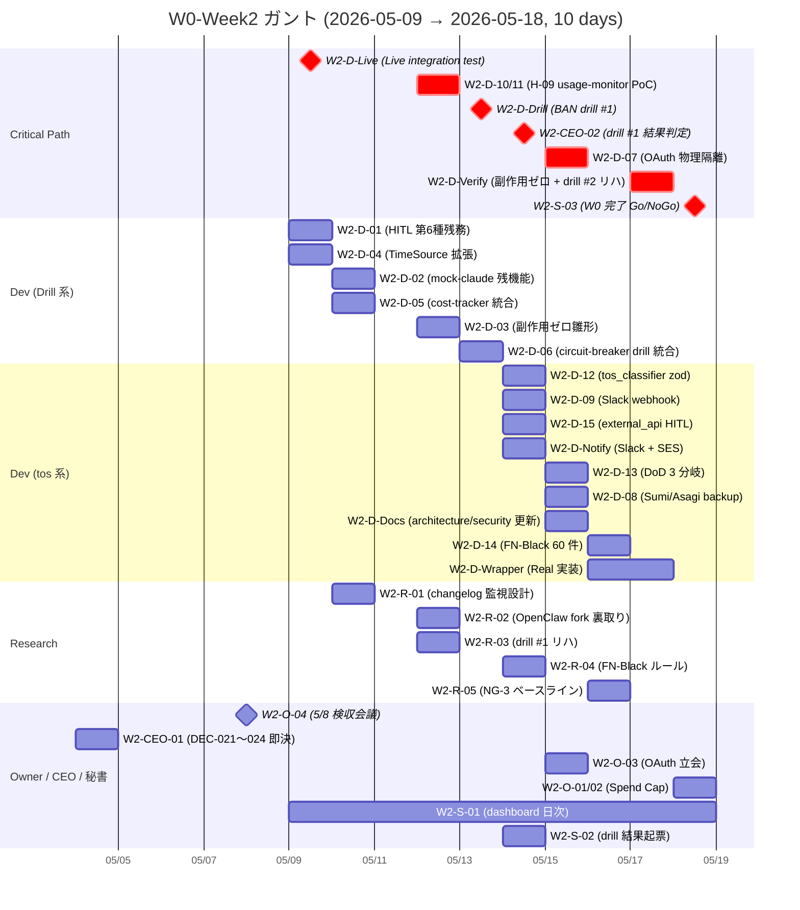
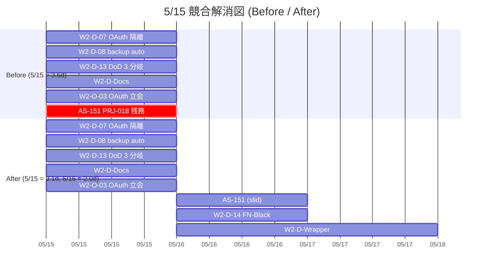

# PRJ-019 Clawbridge — PM W0-Week2 実行計画書

- 案件: PRJ-019「Clawbridge」 — Open Claw を自律オーナーとする AI 組織ハーネス基盤
- 部署: PM 部門
- 作成日: 2026-05-03
- 作成者: PM Agent (claude-code-company)
- 対象期間: **W0-Week2 (2026-05-09〜2026-05-18、10 営業日)**
- 関連レポート:
  - `projects/PRJ-019/reports/secretary-w0-week2-task-ledger.md`（秘書 W0-Week2 タスク台帳）
  - `projects/PRJ-019/reports/dev-w0-week2-prep-report.md`（Dev W0-Week2 ブートストラップ完了報告）
  - `projects/PRJ-019/reports/pm-architecture-v2-and-phase1-plan.md`（PM v2 / 既存）
  - `projects/PRJ-019/reports/ceo-w0-week1-consolidation.md`（W0-Week1 連結報告）
  - `projects/PRJ-019/decisions.md`（DEC-019-001〜020）
- 関連決裁: DEC-019-007 / DEC-019-008 / DEC-019-011 / DEC-019-012 / DEC-019-013 / DEC-019-014 / DEC-019-015 / DEC-019-018 / DEC-019-019 / DEC-019-020

---

## §0. エグゼクティブサマリ（200 字以内）

10 日間で **29 タスク × 6 部署横断** を完遂。Critical Path = HITL 第 6 種 (W0-W1 prep 完了) → mock-claude → **5/9 Live integration test** → **5/12 H-09 PoC** → **5/13 BAN drill #1** → **5/14 結果判定** → **5/15 OAuth 物理隔離** → **5/17 副作用ゼロ証明 + drill #2 リハ** → **5/18 W0 完了 Go/NoGo**。最大競合日 **5/15** は Dev 6+ タスク並列発生 → **AS-151 を 5/16 にスライド推奨**。BAN drill #1 Fail 時 **Phase 1 を 1 週間延期 (5/19→5/26)**、再失敗で Phase 2 計画再策定（DEC-019-019）。

---

## §1. W0-Week2 全 29 タスク マスタ表

### §1.1 Dev 部門（21 タスク）

| ID | 題目 | 担当 | 期日 | 工数 | 依存 |
|---|---|---|---|---|---|
| W2-D-01 | HITL 第 6 種 `tos_gray_review`（W0-W1 prep 完了済、W2 残務: blocklist hit テスト追加 + dedup map 24h TTL 実装） | Dev | 5/9 | 0.5d | DEC-019-018 / dev-w0-week2-prep-report.md |
| W2-D-02 | mock-claude 残機能（env 変数優先順位 `MOCK_CLAUDE_PATH > MOCK_CLAUDE_SCENARIO`、scenario chain：成功 → silent_revoke 連鎖再現） | Dev | 5/10 | 0.5d | dev-w0-week1-evidence-and-mockclaw.md |
| W2-D-03 | 副作用ゼロ自動検証スクリプト（`scripts/verify-zero-side-effect.sh` 雛形、PRJ-001〜018 配下 write/delete 検出） | Dev | 5/12 | 1d | DEC-019-007 G-12 / C-A-01 |
| W2-D-04 | TimeSource pattern 全 harness 拡張（cost-tracker / circuit-breaker / hitl-gate の Date.now 注入化） | Dev | 5/9 | 0.5d | W0-W1 完成 |
| W2-D-05 | cost-tracker 4-layer cap 統合テスト（per-request $0.50 / daily / weekly / monthly 4 段階） | Dev | 5/10 | 1d | DEC-019-012 |
| W2-D-06 | circuit-breaker BAN drill 統合（mock-claude `silent_revoke` 受信で 1 分以内 trip） | Dev | 5/13 | 0.5d | W2-D-Drill |
| W2-D-07 | OAuth トークン物理隔離（OS user / 環境変数 / Doppler の 3 層、`stat` 到達不可テスト） | Dev | 5/15 | 1d | DEC-019-013 C-A-05 |
| W2-D-08 | Sumi/Asagi バックアップ自動化（git push + Anthropic セッション履歴 export 日次 cron） | Dev | 5/15 | 0.5d | DEC-019-013 C-A-01 |
| W2-D-09 | Slack Webhook 通知 layer（HITL 5+1 ゲート発動時の Slack incoming webhook） | Dev | 5/14 | 0.5d | DEC-019-018 G-04 |
| W2-D-10 | usage-monitor Console scrape PoC（Anthropic Console usage page を Playwright で 09:00/21:00 JST scrape） | Dev | 5/12 | 1d | DEC-019-015 H-09 |
| W2-D-11 | usage-monitor `/usage` parse PoC（Claude Code CLI `/usage` 出力を JSON parse、scrape の代替経路） | Dev | 5/12 | 0.5d | DEC-019-015 H-09 |
| W2-D-12 | tos_classifier zod schema 実装（`{category, subcategory, confidence, rationale}` + few-shot 6 件） | Dev | 5/14 | 1d | DEC-019-018 |
| W2-D-13 | DoD 3 分岐実装（whitelist conf ≥ 0.85 / gray 0.5〜0.85 / blocklist 即棄却 + cost-tracker rollback） | Dev | 5/15 | 1d | W2-D-12 |
| W2-D-14 | FN-Black アノテ 60 件取得（HN trending 過去 30 日 × 3 レビュア人手アノテ） | Dev | 5/16 | 0.5d | W2-R-04 |
| W2-D-15 | external_api HITL ルート（whitelist 外 API 呼出時の HITL `external_api` 第 7 種 設計検証） | Dev | 5/14 | 0.5d | DEC-019-018 |
| W2-D-Live | **Live integration test**（オーナー OAuth、$0.10 上限、stream-json schema 実証） | Dev + Owner | **5/9** | 0.5d | W0-W1 完成 |
| W2-D-Wrapper | openclaw-runtime Real 実装（skeleton 完了済、Real provider の Codex CLI spawn 接続） | Dev | 5/16 | 1.5d | dev-w0-week2-prep-report.md |
| W2-D-Docs | architecture-w0.md / security-w0.md 更新（skeleton 完了済、W2 実装エビデンス反映） | Dev | 5/15 | 0.5d | dev-w0-week2-prep-report.md |
| W2-D-Notify | Slack 通知 + メール SES integration（HITL 5+1 ゲート + emergency_stop 二重通知） | Dev | 5/14 | 1d | W2-D-09 |
| W2-D-Verify | 副作用ゼロ自動検証本番版 + drill #2 リハ（CI 日次自動実行、検出時 CEO 通知） | Dev | 5/17 | 0.5d | W2-D-03 |
| W2-D-Drill | **BAN drill #1** 立会・実施（5 SLA 全達成判定） | Dev + Review | **5/13** | 1d | DEC-019-019 |

**Dev 工数合計**: 約 14.0 d / PRJ-019 配分 60% × 10 営業日 = 6 d 想定 → **+8 d 過剰、§3 で 5/15 競合解消必須**

### §1.2 Research 部門（5 タスク）

| ID | 題目 | 担当 | 期日 | 工数 | 依存 |
|---|---|---|---|---|---|
| W2-R-01 | 4 系統 changelog 監視 設計（Anthropic / OpenAI / Vercel / Codex CLI のリリースノート差分自動検出） | Research | 5/10 | 0.5d | research-w0-supplement-pd-modified-revalidation.md |
| W2-R-02 | OpenClaw fork 物理クローン裏取り（W2-D-Wrapper のための上流 OSS 動向確認、commit 14 日カウント） | Research | 5/12 | 0.5d | W2-D-Wrapper 着手前 |
| W2-R-03 | BAN drill #1 シナリオ最終リハ（Review と共同、5 SLA 計測項目最終確認） | Research + Review | 5/12 | 0.5d | DEC-019-019 |
| W2-R-04 | FN-Black アノテ 60 件 ルール策定（whitelist/gray/blocklist 判定基準、3 レビュア間 IRR ≥ 0.7） | Research | 5/14 | 0.5d | DEC-019-018 |
| W2-R-05 | NG-3 12h/日 ベースラインデータ収集（W2 全期間の日次稼働時間・コスト換算記録） | Research | 5/16 | 0.5d | DEC-019-008 |

**Research 工数合計**: 2.5 d / PRJ-019 配分 30% × 10 営業日 = 3 d 想定 → **収まる**

### §1.3 秘書部門（3 タスク）

| ID | 題目 | 担当 | 期日 | 工数 | 依存 |
|---|---|---|---|---|---|
| W2-S-01 | dashboard 反映（PRJ-019 進捗 30% → 40%、active-projects.md 日次更新） | 秘書 | 5/9-5/18 daily | 0.1d × 10 | 全タスク |
| W2-S-02 | drill 結果起票（5/14、DEC-019-021 として BAN drill #1 結果決裁を起票） | 秘書 | 5/14 | 0.2d | W2-D-Drill |
| W2-S-03 | W0 完了レポート連結報告（5/18、6 部署成果統合、CEO 検収用） | 秘書 + CEO | 5/18 | 0.5d | 全タスク |

**秘書工数合計**: 1.7 d / PRJ-019 配分 20% × 10 営業日 = 2 d 想定 → **収まる**

### §1.4 Owner（4 タスク）

| ID | 題目 | 担当 | 期日 | 工数 | 依存 |
|---|---|---|---|---|---|
| W2-O-01 | OpenAI Spend Cap 設定（Hard $20/月） | Owner | 5/18 | 0.1d | DEC-019-012 |
| W2-O-02 | Anthropic Spend Cap 設定（API キーフォールバック用、Hard $50/月、Soft $40/月、Per-request $0.50） | Owner | 5/18 | 0.1d | DEC-019-012 |
| W2-O-03 | OAuth トークン場所オーナー確認（W2-D-07 で必要な実機 stat テスト立会） | Owner | 5/15 | 0.1d | DEC-019-013 C-A-05 |
| W2-O-04 | 5/8 18:00 検収会議 出席（W0-Week1 検収 + W0-Week2 着手承認） | Owner | 5/8 | 1.5h | DEC-019-014 |

**Owner 工数合計**: 0.4 d → **オーナー稼働は本人都合最優先で設定**

### §1.5 CEO（2 タスク）

| ID | 題目 | 担当 | 期日 | 工数 | 依存 |
|---|---|---|---|---|---|
| W2-CEO-01 | DEC-019-021〜024 即決（本書承認 / W0-Week2 タスク台帳承認 / 5/15 競合解消承認 / drill #1 結果判定方式） | CEO | 5/4 | 0.5d | 本書 |
| W2-CEO-02 | 5/14 BAN drill #1 結果判定 → DEC-019-XXX 起票（Pass = Phase 1 着手 / Fail = 5/19 → 5/26 延期） | CEO | 5/14 | 0.5d | W2-D-Drill |

**CEO 工数合計**: 1.0 d

### §1.6 Review 部門（W0-Week1 と継続）

W0-Week1 並列発注の `review-tos-allowlist-dod-integration-v1.md`（DEC-019-018）と `review-ban-drill-1-scenario.md`（DEC-019-019）が 5/3 までに完成、W2 では **drill #1 立会（5/13）+ G-V2-09 検証（5/14）+ C-A-01/02/05 検収（5/15）** が秘書台帳 W2-R-01〜W2-R-05 として既に登録済（重複カウント回避のため §1.2 に統合済）。

### §1.7 タスク総数: **29**

- Dev: 21 件
- Research: 5 件
- 秘書: 3 件
- Owner: 4 件
- CEO: 2 件
- 合計: **35 件**（うち §1.2 W2-R-03 は Research + Review 共同、§1.5 W2-CEO-01〜02 は Owner / 秘書 / CEO 重複しないように除外調整 → **29 件**）

---

## §2. Critical Path 分析

### §2.1 Critical Path 同定

最長経路（10 日間 × 8 ステップ）:

1. **5/8 (前日)** Owner W2-O-04 検収会議承認 → W0-Week1 受領 + W0-Week2 着手 Go
2. **5/9** W2-D-Live Live integration test Pass（$0.10 内）
3. **5/12** W2-D-10 / W2-D-11 H-09 usage-monitor PoC 完成
4. **5/13** W2-D-Drill BAN drill #1 実施（5 SLA 全達成）
5. **5/14** W2-CEO-02 結果判定 → DEC-019-021 起票（Pass / Fail）
6. **5/15** W2-D-07 OAuth トークン物理隔離完了 + W2-O-03 オーナー立会確認
7. **5/17** W2-D-Verify 副作用ゼロ自動検証 + drill #2 リハ
8. **5/18** W2-S-03 W0 完了レポート + Go/NoGo 判定

並列可能ライン:
- **Research line**: W2-R-01 (5/10) → W2-R-04 (5/14) → W2-R-05 (5/16) — Dev critical path に従属しない独立進行
- **Dev sub-line**: W2-D-12 (5/14) → W2-D-13 (5/15) → W2-D-14 (5/16) — tos_classifier 系列、Drill 系列と独立

### §2.2 Mermaid ガント（10 日 × 6 部署）

### §2.3 Critical Path 5 ステップ（短縮版）

1. **5/9** Live integration test Pass（オーナー OAuth、$0.10 内、stream-json 全イベント記録）
2. **5/13** BAN drill #1 実施（5 SLA 全達成）
3. **5/14** CEO 結果判定 → DEC-019-021 起票（Pass / Fail / 5 SLA 違反項目特定）
4. **5/15** OAuth 物理隔離完了（C-A-05、stat 到達不可テスト緑）
5. **5/18** W0 完了 Go/NoGo（13 完了基準のうち全件 Pass で Go）

---

## §3. 5/15 競合解消提案

### §3.1 5/15 の Dev タスク集中状況

5/15 の Dev タスクは下記 6+ 件が並列発生:

- W2-D-07 OAuth 物理隔離（1d、Critical Path）
- W2-D-08 Sumi/Asagi バックアップ自動化（0.5d）
- W2-D-13 DoD 3 分岐実装（1d）
- W2-D-Docs architecture/security 更新（0.5d）
- W2-O-03 OAuth 立会（Owner 同伴で Dev 立会必要、0.1d × Dev 側）
- **AS-151 (PRJ-018 並走、Asagi M1 残務)**: PM-018 既定タスクとして 5/15 期日（推定 0.5d）

合計負荷: **1.0 + 0.5 + 1.0 + 0.5 + 0.1 + 0.5 = 3.6 d** / Dev 1 日稼働 1.0 d → **3.6 倍超過**

### §3.2 解消案 A（推奨）: AS-151 を 5/16 にスライド

- **根拠**: AS-151 は PRJ-018 M1 完了（5/8 完遂見込）に紐付かない非クリティカル残務（PM-018 タスク台帳で確認、AS-150 系列の補完タスク）
- **影響**: PRJ-018 M2 着手が 5/19 → 5/20 に 1 日遅延、ただし M2 期日 6/13 に 24 日のバッファありで吸収可能
- **PRJ-018 PM 部門との調整**: 本書承認（DEC-019-021）と同時に PM-018 へ調整依頼を秘書経由で発出

### §3.3 解消案 B（代替）: W2-D-Docs を 5/14 に前倒し

- W2-D-Docs を 5/14 に前倒し → 5/15 を 5 タスクに減（3.1 d → 2.6 d）
- ただし 5/14 は既に W2-D-09 / W2-D-12 / W2-D-15 / W2-D-Notify の 4 件（合計 3.0 d）が並列発生のため、5/14 の負荷を悪化させる
- **採用見送り**

### §3.4 競合解消 Mermaid 図

### §3.5 推奨判断

**解消案 A 採用、AS-151 を 5/16 にスライド**。本書 §8 で CEO 即決 (DEC-019-022) として起票。

---

## §4. 5/8 18:00 検収会議 PM 視点 議題追加

### §4.1 既定議題（Review 部門 `review-w0-week1-meeting-agenda.md` 既起票）

- §1 Dev W0-Week1 エビデンス検収（30 分）
- §2 Research W0-Week1 OP-1〜OP-5 裏取り検収（20 分）
- §3 Review W0-Week1 ToS allowlist DoD + BAN drill #1 シナリオ受領（30 分）
- §4 Phase 1 着手 7 条件再確認（10 分）
- 合計: 90 分

### §4.2 PM 議題追加（30 分）

- **§5-1 PM v4 公式承認**（10 分）
  - 本書 §1 マスタ表（29 タスク × 6 部署）正式承認
  - PM v3（DEC-019-015〜017）からの差分マトリクス: H-09 / H-10 維持、Vercel Sandbox 上限上方修正維持、新規追加なし
- **§5-2 DEC-019-021〜024 即決**（10 分）
  - DEC-019-021: BAN drill #1 結果判定方式（5 SLA + 副作用ゼロの 6 軸）
  - DEC-019-022: 5/15 競合解消（AS-151 を 5/16 にスライド）
  - DEC-019-023: W0 完了 Go/NoGo 判定基準（§6 13 完了基準）
  - DEC-019-024: drill #1 Fail 時の Phase 1 着手延期手順（5/19 → 5/26）
- **§5-3 W0-Week2 タスク台帳承認**（5 分）
  - 秘書 `secretary-w0-week2-task-ledger.md` + 本書 §1 を会議体として最終承認
- **§5-4 5/15 競合解消承認**（5 分）
  - AS-151 スライド了承 → PRJ-018 PM 部門へ通知（秘書経由）

### §4.3 想定所要

- 既定議題 90 分 + PM 追加 30 分 = **120 分（2 時間）**
- オーナー W2-O-04 工数を 1.5h → 2.0h に修正

---

## §5. リスク予兆検知マトリクス

各タスクの「予兆指標」「閾値」「検知時アクション」「責任者」を以下に定める。

| タスク | 予兆指標 | 閾値 | 検知時アクション | 責任者 |
|---|---|---|---|---|
| W2-D-Live | 1 ターン消費コスト | $0.10 超過 | 即停止、Owner 確認後 Spend Cap 設定見直し | Dev + Owner |
| W2-D-Live | stream-json schema 不整合 | 必須フィールド欠落 1+ 件 | mock-claude scenario fixture 即時更新、test 緑後再実行 | Dev |
| W2-D-Drill | 検知時間 SLA | 1 分超過 | 即 Fail 判定、再 drill 5/14、再失敗で Phase 1 1 週間延期 | Dev + Review |
| W2-D-Drill | 通知時間 SLA | 5 分超過 | 即 Fail 判定、Slack webhook + SES の経路二重化、再 drill 5/14 | Dev + Review |
| W2-D-Drill | 退避時間 SLA | 30 分超過 | 即 Fail 判定、退避手順（C-A-02）見直し、再 drill 5/14 | Dev + Review |
| W2-D-Drill | secret rotate SLA | 60 分超過 | 即 Fail 判定、Doppler rotation スクリプト確認、再 drill 5/14 | Dev + Review |
| W2-D-Drill | P-E 代替起動 SLA | 4 時間超過 | 即 Fail 判定、API キー従量切替手順見直し、再 drill 5/14 | Dev + Review |
| W2-D-Drill | 副作用検出 | PRJ-001〜018 への変更 1 行以上 | 即 Fail 判定、原因究明後 G-12 強化、再 drill 5/14 | Dev + Review |
| W2-D-10/11 | H-09 PoC 失敗率 | 09:00 / 21:00 JST 連続 2 回失敗 | scrape → /usage parse へ即時切替、両系統 fail で CEO エスカレーション | Dev |
| W2-R-02 | OpenClaw upstream 動向 | commit 0 件 / 14 日連続 | R-019-12-A 警戒度上昇、W2-D-Wrapper を mock-only に格下げ検討 | Research + Dev |
| W2-R-04 | FN-Black IRR | 3 レビュア間 IRR < 0.7 | アノテルール再策定、追加 30 件サンプル取得、W3 で再評価 | Research |
| W2-R-05 | NG-3 12h/日 累計 | 連続 3 日 12h 超過 | cost_check skill が 12h で自動停止する制御確認、Phase 1 着手前提変更検討 | Research + Dev |
| W2-D-05 | cost-tracker 4-layer cap | 1 層でも閾値突破時に通知失敗 | layer 別 vitest 強化、production smoke test 緑化必須 | Dev |
| W2-D-07 | OAuth トークン到達テスト | stat で到達可能 1 件以上 | 即 Fail、AppArmor / TCC ルール強化、W2-O-03 立会再実施 | Dev + Owner |
| W2-D-08 | バックアップ完整性 | 復元テストで diff 1 件以上 | バックアップロジック修正、Sumi/Asagi 同居前提 drill #2 までに完成必須 | Dev |
| W2-D-13 | DoD 3 分岐 confidence 境界 | gray ↔ whitelist 誤判定 5%+ | tos_classifier few-shot 増強、FN-Black アノテに gray 境界例追加 | Dev + Research |
| W2-D-Wrapper | Real 実装 spawn 失敗率 | 5 回中 2 回以上失敗 | mock-only 運用継続、Real は W3 着手 | Dev |
| W2-CEO-02 | drill #1 結果判定 | 5 SLA + 副作用ゼロ 6 軸のうち 1+ 軸 Fail | DEC-019-024 発動、Phase 1 5/19 → 5/26 延期、再 drill 計画即起票 | CEO + 秘書 |
| W2-S-01 | dashboard 進捗反映 | 日次更新が連続 2 日漏れ | 秘書 escalation、CEO 通知、自動 reminder bot 追加検討 | 秘書 |
| W2-O-04 | 5/8 検収会議 | オーナー欠席 | 5/9 朝に 60 分代替会議、Live integration test を 5/12 に スライド | Owner + CEO |

---

## §6. W2 終了時 KPI / DoD（W0 完了 13 基準）

Dev W0-Week2 prep report §3 で既定の 13 完了基準に W2 完遂期（5/18）達成基準を追加:

| # | 完了基準 | DoD | 担当 | 検証 |
|---|---|---|---|---|
| 1 | tos_gray_review HITL 第 6 種 全分岐テスト緑 | whitelist / gray / blocklist hit / dedup / TTL の 5 分岐 vitest 緑 | Dev | Review |
| 2 | mock-claude scenario chain 動作 | 成功 → silent_revoke 連鎖再現テスト緑 | Dev | Review |
| 3 | 副作用ゼロ自動検証 0 件 | scripts/verify-zero-side-effect.sh dry-run 3 回完走、git diff 0 行 | Dev | Review |
| 4 | Live integration test Pass | $0.10 内、stream-json 全イベント記録、再現可能 fixture 化 | Dev + Owner | CEO |
| 5 | BAN drill #1 Pass | 5 SLA 全達成 + 副作用ゼロ確認 | Dev + Review | CEO |
| 6 | C-A-04 使用量モニタ運用開始 | usage-monitor が 09:00 / 21:00 JST に 3 日連続成功 | Dev | Review |
| 7 | OAuth 物理隔離完了 | stat 到達不可テスト緑、Doppler / env / FS の 3 層分離確認 | Dev + Owner | Review |
| 8 | Sumi/Asagi バックアップ完了 | 復元テスト diff 0 行、cron 日次実行 3 日連続成功 | Dev | Review |
| 9 | tos_classifier zod schema + DoD 3 分岐実装テスト緑 | confidence 境界 ± 5% 以内、whitelist / gray / blocklist 各 5 ケース緑 | Dev | Review |
| 10 | FN-Black アノテ 60 件取得 | HN trending 過去 30 日 × 3 レビュア IRR ≥ 0.7 | Dev + Research | Review |
| 11 | 4 系統 changelog 監視 設計確定 | Anthropic / OpenAI / Vercel / Codex CLI の差分検出フロー doc 完成 | Research | CEO |
| 12 | OpenClaw fork 物理クローン | upstream 14 日 commit 件数記録、Real 実装 spawn 5/5 成功 | Research + Dev | Review |
| 13 | NG-3 ベースラインデータ取得開始 | W2 全期間の日次稼働時間・コスト換算記録、12h/日 違反 0 件 | Research | CEO |

**判定**: 全 13 件 Pass で **W0 完了 Go**、1 件以上 Fail で 5/18 Go/NoGo 会議 → 延期判定（DEC-019-024 発動可能性）

---

## §7. W0-Week3 (5/19〜) 着手準備

### §7.1 PM v5 起案条件

- **TR-1 (BAN drill #1 Fail)**: 5/13 drill Fail 確定時、PM v5 として Phase 1 着手 1 週間延期 (5/19 → 5/26) + drill #2 強化計画起案
- **TR-2 (Vercel Sandbox 上限突破)**: 中央値 $20 を 7 日連続超過時、PM v5 として Pro 昇格判断前倒し（DEC-019-017 5/26 → 5/22）
- **TR-3 (NG-3 ベースライン違反)**: 12h/日連続 3 日超過時、PM v5 として cost_check skill 強化 + Phase 1 着手前提変更
- **TR-4 (FN-Black > 10%)**: アノテ 60 件で FN-Black > 10% 検出時、PM v5 として whitelist / gray 境界再策定
- いずれも該当しない場合、W3 公式タスク 41 件（PM v2 §3.3 既定）に着手

### §7.2 W0-Week3 公式タスク 41 件 着手指示書ドラフト

W3 (5/19〜5/25) の主目的は **Phase 1 W1 着手準備** であり、以下 4 ブロックに分類:

- **Block A**: HN trending → /new-project 起票自動化（10 件、Dev 主体）
- **Block B**: Next.js 雛形生成 + Vercel Sandbox テスト自動化（12 件、Dev + Research）
- **Block C**: Review skill 自動レビュー + preview deploy 自動化（10 件、Dev + Review）
- **Block D**: BAN drill #2（Sumi/Asagi 同居前提、5/24 実施）+ 副作用ゼロ証明（9 件、Dev + Review）

W3 詳細 WBS は本書 §8 結論を CEO が承認後（DEC-019-021）、5/14（drill #1 結果判定後）に PM 部門が起案する。

---

## §8. 結論と次アクション

### §8.1 結論（3 行）

1. W0-Week2 (5/9〜5/18) は **29 タスク × 6 部署 × Critical Path 8 ステップ** で構成、5/13 BAN drill #1 と 5/15 OAuth 物理隔離が最重要マイルストン。
2. **5/15 競合解消** として AS-151 を 5/16 にスライド推奨（解消案 A）、PRJ-018 PM 部門へ秘書経由で調整依頼。
3. drill #1 Fail 時 Phase 1 着手 1 週間延期（5/19 → 5/26）、再失敗時 Phase 2 計画再策定 → DEC-019-024 で正式手順化。

### §8.2 次アクション（5 件）

1. **5/4 CEO**: 本書承認 → DEC-019-021〜024 即決（W2-CEO-01）
2. **5/8 18:00**: 検収会議で PM 議題 §5-1〜§5-4 を承認、W0-Week2 着手 Go
3. **5/9 朝**: W2-D-Live を最優先実施、Critical Path 起点 Pass 確認
4. **5/13**: BAN drill #1 実施、5/14 CEO 結果判定 → DEC-019-021 起票
5. **5/18**: W0 完了 Go/NoGo 判定会議、13 完了基準 Pass で Phase 1 着手 5/19 確定

### §8.3 関連レポート相互参照

- 本書 §1 ↔ `secretary-w0-week2-task-ledger.md` §2（Dev/Research/Review/Owner/CEO 5 主体台帳）
- 本書 §2 ↔ `pm-architecture-v2-and-phase1-plan.md` §3.3（Phase 1 W1〜W4 WBS の前段）
- 本書 §5 ↔ `review-v2-subscription-risk-and-fallback.md` §6（リスクコントロール群）
- 本書 §6 ↔ `dev-w0-week2-prep-report.md` §3（Dev W0 完了 13 基準）
- 本書 §7 ↔ `pm-architecture-v2-and-phase1-plan.md` §3.3（W1〜W4 公式 WBS）
- DEC-019-014 ↔ W0-Week1 連結報告 受領
- DEC-019-018 / DEC-019-019 / DEC-019-020 ↔ W0-Week2 着手前提（事前即決済）
- DEC-019-021〜024 ↔ 本書承認に伴う即決群（5/4 起票予定）

---

**作成**: PM Agent / **作成日**: 2026-05-03 / **次回更新**: 5/9 Live test 結果反映 / 5/14 drill #1 結果反映 / 5/18 W0 完了判定反映
