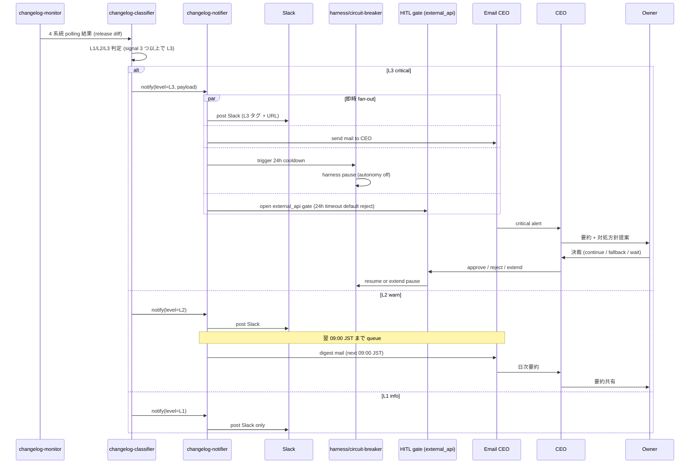

# PRJ-019 Phase 1 Changelog 監視運用 Runbook（4 系統 / Slack 通知 / CEO エスカレ / 自律 pause 連動）

- 案件: PRJ-019「Clawbridge」 — Open Claw を自律オーナーとする AI 組織ハーネス基盤
- 部署: リサーチ部門
- 文書種別: Phase 1 運用設計（Runbook）
- 作成日: 2026-05-03
- 作成者: Research Agent (claude-code-company)
- 対象期間: Phase 1（2026-05-19〜2026-06-13、4 週間）
- 前提インプット:
  - `projects/PRJ-019/decisions.md` DEC-019-001〜020（Phase 1 着手条件、コントロール群）
  - `projects/PRJ-019/reports/research-w0-supplement-op1-op5.md`（usage cap / Vercel pricing）
  - `projects/PRJ-019/reports/review-v2-subscription-risk-and-fallback.md`（必須コントロール 23 項目）
  - `projects/PRJ-019/reports/dev-w0-week1-implementation-report.md`（harness 実装基盤）
- 凡例（情報信頼度ラベル）:
  - 公式: ベンダー公式サイト・公式 docs
  - 半公式: 公式 GitHub リポ、社員公的発言
  - 二次: 第三者メディア（複数裏取り済）
  - 推測: 本書作成者の解釈（事実ではないことを明示）
- 関連 DEC: DEC-019-006（P-D 改）/ DEC-019-013（C-A-04 使用量モニタリング）/ DEC-019-015（H-09 Claude Max weekly 監視）/ DEC-019-018（HITL 第 6 種）

---

## 0. エグゼクティブサマリー（300 字 / Phase 1 計画への影響）

Clawbridge harness が依存する **4 系統の上流（Anthropic Claude Code CLI / OpenAI Codex CLI / OpenClaw OSS / Enderfga plugin）** に対し、5 分間隔の polling + 3 段階通知（L1 info / L2 warn / L3 critical）+ L3 検知時の 24h 自動 pause を一貫運用する Runbook を確立。監視手段は **GitHub releases atom feed（速報）+ GraphQL API（メタ取得）の併用**、通知ルートは **Slack `#clawbridge-changelog` + メール CEO 経由オーナー要約**、実装配置は **`app/harness/src/changelog-monitor.ts`** で cost-tracker と同パッケージ別 worker。Dev 着手期は **W2 中盤（2026-05-26 前後）**、CEO 即決推奨 DEC-019-022（4 系統 changelog 監視運用採用）。本書は §1 監視対象 / §2 監視手段比較 / §3 通知ルート / §4 実装計画 / §5 breaking 判定 / §6 SLA / §7 結論の 7 章構成。

---

## 1. 監視対象 4 系統（§1）

### 1.1 概要表

| # | 系統 | リポ / URL | 監視対象 | breaking 判定軸 |
|---|---|---|---|---|
| ① | Anthropic Claude Code CLI | `github.com/anthropics/claude-code`（npm: `@anthropic-ai/claude-code`） | release notes / CHANGELOG / `claude --version` 互換性 / npm dist-tags | stream-json schema / `--output-format` フラグ / `--allowedTools` 仕様 / `claude -p` subprocess 起動引数 |
| ② | OpenAI Codex CLI | `github.com/openai/codex`（**公式パスは要確認、本書では「2026-05-03 時点 placeholder、Phase 1 W1 で確定」**） | sub-command 仕様 / stdin/stdout 形式 / 認証フロー | API キー前提化、OAuth 必須化、`codex exec` rename、stdin/stdout JSON schema 変更 |
| ③ | OpenClaw OSS | `github.com/clawbro-ai/openclaw`（personal AI assistant 化判定済、DEC-019 系で確定） | README repositioning / API surface / dependency 強制 upgrade / ToS 文言 | wrapper interface 互換性 / personal assistant モード強制化 / 自律エージェント禁止条項追加 |
| ④ | Enderfga plugin | （Claude Code 用 OpenClaw ブリッジとして既知の場合 placeholder、Phase 1 W1 で URL 確定） | upstream pin / breaking change 連動 / メンテナ activity | OpenClaw 連動度 / Claude Code CLI 上限 version pin / リポ archived 化 |

### 1.2 監視優先度

- 最優先: ① Anthropic Claude Code CLI — P-D 改（DEC-019-006）の根幹、subprocess spawn 仕様変更は即 harness 停止
- 次点: ② OpenAI Codex CLI — Open Claw 側エージェントの実行基盤、認証変更で全自律ループ停止
- 中: ③ OpenClaw OSS — wrapper 経由のみ依存、breaking 影響は限定的
- 低: ④ Enderfga plugin — オプショナル統合層、archived 化でも代替可

### 1.3 placeholder 解消タスク（Phase 1 W1 必須）

- ② Codex CLI 公式リポ URL の最終確認（OpenAI 公式 docs から逆引き、5/22 まで Research 部門）
- ④ Enderfga plugin の正式リポ URL 確認（OpenClaw README から辿り、5/22 まで Research 部門）
- 確認後、本書 §1.1 表を更新 + DEC-019-022 の付帯資料として参照固定

---

## 2. 監視手段の比較表（§2）

### 2.1 案比較

| 案 | 手段 | メリット | デメリット | 採否 |
|---|---|---|---|---|
| A | GitHub releases atom feed (RSS) → 5 分 polling | 認証不要、構造化、rate limit 緩、速報性高い | PR / commit / issue は見えない、release 化されていない breaking は取り逃す | **採用（速報チャネル）** |
| B | GitHub GraphQL API + PAT | commits / issues / PRs / README diff まで取得可、メタ豊富 | PAT secret 管理、rate limit 5,000/h（read-only scope） | **採用（メタ取得チャネル）** |
| C | Web scraping（公式 docs / npm registry） | docs 専用 changelog をカバー | 脆い、HTML 変更で即破綻、保守コスト高 | 補助のみ（npm dist-tag 確認に限定） |
| D | Watchman / Repology / Dependabot 等の SaaS | 設定簡単、UI 整備 | 月額コスト発生、Phase 1 月予算 $300 ハードキャップに不適合 | 不採用 |

### 2.2 推奨構成

- **A + B 併用**: A で 5 分以内の release 速報、B で commits / PRs / issues の追加メタ取得（30 分間隔）
- **C 補助**: npm registry の `dist-tags.latest` を 30 分間隔で別 worker が確認（① のみ、@anthropic-ai/claude-code に対して）

### 2.3 secret 取扱

- PAT は **read-only scope のみ**: `secrets:read public_repo`（最小権限）
- 保管: **Doppler**（DEC-019-012 で確定済の secret manager）
- 注入: harness の env allow-list 経由でのみ injection（OAuth トークンと同じ TCC 隔離原則、G-V2-11 と整合）
- 漏洩時手順: Doppler で即 rotate → GitHub PAT settings で revoke → drill 結果を C-A-02 退避手順書に追記

### 2.4 rate limit 計算

- A: atom feed は anonymous で OK、IP 単位 60 req/h 制限 → 4 系統 × 5 分間隔 = 48 req/h、余裕
- B: PAT 認証で 5,000 req/h、4 系統 × 30 分間隔 + 詳細クエリ = 約 200 req/h、余裕
- C: npm registry は anonymous OK、軽量

---

## 3. 通知ルート設計（§3）

### 3.1 Slack channel 設計

- 専用 channel: **`#clawbridge-changelog`**（free plan 内、既存 Slack workspace 流用）
- Webhook: incoming webhook URL を Doppler に格納
- 投稿フォーマット: `[L1|L2|L3] {系統名} v{version} | {要約 80 字以内} | {URL}`
- thread 連鎖: 同一 release に対する続報は thread に紐付け（重複通知抑制）

### 3.2 3 段階通知レベル

| レベル | 名称 | 条件例 | Slack | メール CEO | オーナー要約 | 自律ループ |
|---|---|---|---|---|---|---|
| **L1** | info | minor release / patch / docs 更新 | 即時 | なし | なし | 継続 |
| **L2** | warn | minor breaking 候補（deprecation 警告 / 新フラグ推奨化 / peer dep major） | 即時 | なし | **翌朝 09:00 JST に CEO 経由でオーナー要約**（日次 digest） | 継続 |
| **L3** | critical | major breaking change（subprocess 仕様変更 / CLI rename / auth 流れ変更 / ToS 文言更新 / personal assistant 化強制） | **即時** | **即時** | 即時（CEO 経由） | **24h 自動 pause（H-09 と同じ pause メカニズム流用）+ HITL `external_api` 第 6 種類似ルートで 24h timeout default reject** |

### 3.3 シーケンス図（L3 検知時の通知ルート）

### 3.4 メール送信基盤

- 第 1 候補: **Resend**（無料 plan 100/日、SDK 軽量、Phase 1 用途十分）
- 第 2 候補: **AWS SES**（既存 AWS アカウントある場合のみ、$0.10/1000 mails）
- 配送先: CEO（`ai-lab@improver.jp` 既知、改めて Phase 1 W1 で送信先 allowlist 確定）

### 3.5 HITL 第 6 種との関係

- DEC-019-018 で発令済の HITL 第 6 種 `tos_gray_review` とは**別ゲート**: 本書では `external_api`（仮称、または `upstream_breaking`）として新規ゲート提案
- 24h timeout default reject の挙動は同じ（DEC-019-018 と整合）
- Dev W2 中盤実装時に既存 HITL gate と同じインフラ（Slack 通知 + 24h タイマ）を流用

---

## 4. 実装計画（§4）

### 4.1 配置先

- パッケージ: **`app/harness/src/changelog-monitor.ts`**（cost-tracker と同じ `app/harness` パッケージだが別 worker）
- cron トリガ: **Vercel Cron**（Hobby 内可、5 分間隔 = 月 8,640 起動、Hobby 上限 100 起動/日に抵触 → **手動 cron node プロセスに変更検討**、§4.5 参照）

### 4.2 実装ファイル想定

| ファイル | 役割 |
|---|---|
| `app/harness/src/changelog-monitor.ts` | 4 系統の poll loop メインエントリ |
| `app/harness/src/changelog-source.ts` | 各系統の adapter（GitHub releases / GraphQL / npm registry） |
| `app/harness/src/changelog-classifier.ts` | L1/L2/L3 判定ロジック（regex + heuristic、§5 と整合） |
| `app/harness/src/changelog-notifier.ts` | Slack Webhook 呼出 + メール送信（Resend / SES） |
| `app/harness/src/changelog-state.ts` | 直近通知済 release の状態保持（重複抑制、SQLite or JSON ファイル） |
| `app/harness/__tests__/changelog-monitor.test.ts` | 6+ ケース（4 系統 × 3 レベル モック、通知 fan-out 検証） |
| `app/harness/__tests__/changelog-classifier.test.ts` | 判定ヒューリスティクスの正/誤検知テスト |

### 4.3 Vercel Cron スケジュール

- 5 分間隔 polling: `*/5 * * * *`（Hobby 上限要確認、超過時は §4.5）
- 30 分間隔 detail fetch: `*/30 * * * *`
- 日次 digest（L2 warn まとめ）: `0 0 * * *`（00:00 UTC = 09:00 JST）

### 4.4 Vercel Cron 制限への対応

- Hobby plan は 100 cron invocations/日が上限の可能性あり（公式 docs 再確認 W1 タスク）
- 5 分間隔 = 288 invocations/日で抵触 → **対応案**:
  - (a) 10 分間隔に縮退（432→144 invocations/日、まだ抵触）
  - (b) **harness 常駐 node プロセスで内部 setInterval()**（オーナー本人 PC、Sumi/Asagi と同じ常駐枠）→ **第 1 候補**
  - (c) Pro 昇格時に Cron 制限緩和を期待（DEC-019-017 の W3 中盤判断と連動）

### 4.5 タスク台帳追加要請

- 秘書部門に以下の細目分割を依頼:
  - **W2-D-Notify-CL** （changelog 監視実装、Dev W2 中盤、5/26 着手 / 5/30 検収）
    - W2-D-Notify-CL-01: changelog-source 4 系統 adapter
    - W2-D-Notify-CL-02: classifier ヒューリスティクス（§5）
    - W2-D-Notify-CL-03: notifier（Slack + Resend）
    - W2-D-Notify-CL-04: state 永続化（SQLite or JSON）
    - W2-D-Notify-CL-05: テスト 6+ ケース緑
    - W2-D-Notify-CL-06: HITL `external_api` ゲート連動
    - W2-D-Notify-CL-07: Vercel Cron or 常駐プロセス選定
- **W2-O-PAT** （オーナータスク、PAT 取得 + Doppler 登録、5/22 まで）
- **W2-R-CL** （Research、② Codex CLI / ④ Enderfga plugin 公式 URL 確定、5/22 まで）

---

## 5. breaking change 判定ヒューリスティクス（§5）

### 5.1 判定順位（早期 reject 優先）

1. **semver major 上昇**（例: 1.x → 2.0.0）→ **自動 L3**
2. CHANGELOG / release notes 本文に `BREAKING` / `removed` / `deprecated` / `rename` 単語含有 → **L2 以上候補、1 つでも該当で L3**
3. 過去 30 日 commit messages 内に `feat!:` / `fix!:` / `BREAKING CHANGE:` （Conventional Commits の breaking 印）→ **L3**
4. README diff で `ToS` / `license` / `terms` / `policy` / `acceptable use` 変更 → **L3**
5. dependencies 変更で peer dep major 上昇（例: node 20 → 22 必須化）→ **L2**
6. リポ status: `archived: true` / メンテナ最終 commit 90 日以上空き → **L2**

### 5.2 false-positive 抑制

- regex 単独では L2 / L3 確定させず、**3 件以上のシグナル一致**で L3 昇格
- 例: 「semver major 上昇 + BREAKING 単語 + commit `feat!:` 検知」= 3 シグナル → L3
- 例: 「BREAKING 単語のみ（docs typo）」= 1 シグナル → L2 で stage、CEO 通知遅延より誤検知ノイズ抑制を優先
- これは **FN-Black ≤ 10% の精神を継承**（DEC-019-018、Review §4 と整合）— 過剰ブロック / 過剰 pause を避ける

### 5.3 判定表

| シグナル数 | レベル | 挙動 |
|---|---|---|
| 0 | （対象外） | release のみ通知（L1） |
| 1 | L1 / L2 境界 | デフォルト L1、ただし semver major 単独なら L3 例外 |
| 2 | L2 | warn、翌朝 digest |
| 3+ | L3 | critical、即時 pause + HITL |

### 5.4 学習・改善ループ

- 月次再評価（DEC-019-018 の FN-Black 評価と同じ周期）で false-positive / false-negative 件数集計
- 5 件以上の誤検知が続いた場合、ヒューリスティクスを Review 部門と協議の上更新
- 全更新は DEC として記録

---

## 6. Phase 1 期間の運用 SLA（§6）

### 6.1 通常時 SLA

| レベル | SLA |
|---|---|
| L1 | Slack 投稿のみ、CEO アクション不要 |
| L2 | **24h 以内に CEO 受領**（翌朝 09:00 JST digest）、対処方針 1 営業日以内 |
| L3 | **1h 以内に CEO 受領**（即時メール）、**6h 以内に対処方針決裁**、24h 以内に harness 復旧 or 延長 |

### 6.2 BAN drill 直前 24h（5/12 / 5/16）

- **L2 / L3 全て即時通知**（drill 期間中のノイズ無視オプションを無効化）
- drill 中に upstream breaking が発生した場合、drill を一時中断 → CEO 判断 → drill 仕切り直し

### 6.3 自律ループ pause 連動

- L3 検知時: harness の **circuit-breaker を 24h cooldown 強制発動**
- circuit-breaker は H-09（Claude Max weekly cap）と同じ実装機構を流用（DEC-019-015）
- 復旧条件:
  - HITL `external_api` ゲートで CEO が approve（明示続行判断）
  - または 24h timeout で default reject → 翌日 CEO 再判断
- pause 中: 既存ループは drain（実行中タスク完了まで継続、新規ループ開始なし）

### 6.4 オーナー在席帯との整合

- L3 通知が深夜（0:00〜09:00 JST）に発生した場合、Slack 即時 + メール即時だが、**オーナー要約は 09:00 JST 以降の最初の在席タイミングに繰下げ**（DEC-019-008 の 12h/日上限と整合）
- harness pause は時刻関係なく即時発動（自動）

### 6.5 副作用ゼロ確認

- changelog-monitor が PRJ-001〜018 のファイル / git history / Vercel deploy / Supabase 行に変更を起こさないこと（DEC-019-014 と整合）
- monitor は読み取り専用 worker、書込は `app/harness/` 配下の state ファイル + 通知のみ

---

## 7. 結論と次アクション（§7）

### 7.1 結論（3 行）

1. **4 系統（Anthropic Claude Code / OpenAI Codex CLI / OpenClaw / Enderfga plugin）の changelog 監視を W2 中盤に Dev 実装する**
2. **Slack `#clawbridge-changelog` + メール CEO の 3 段階通知（L1 info / L2 warn / L3 critical）で運用する**
3. **L3 検知時は H-09 流用の circuit-breaker で 24h pause 自動発動 + HITL `external_api` ゲートで 24h timeout default reject**

### 7.2 次アクション（4 件）

| # | アクション | 担当 | 期限 |
|---|---|---|---|
| 1 | Dev W2 中盤に `app/harness/src/changelog-monitor.ts` ほか 5 ファイル + テスト 6+ ケース実装 | Dev | 2026-05-30 |
| 2 | 秘書部門タスク台帳に W2-D-Notify-CL（7 細目）を追加 | 秘書 | 2026-05-22 |
| 3 | GitHub PAT (read-only scope) 取得 + Doppler 登録 | オーナー | 2026-05-22 |
| 4 | Phase 2 で監視対象 5 系統に拡張検討（Vercel CLI / Supabase CLI 追加候補） | Research | Phase 2 起案時 |

### 7.3 推奨 CEO 即決 DEC

- **DEC-019-022 候補**: 「PRJ-019 Phase 1 における 4 系統 changelog 監視運用を本 Runbook 通り採用、Dev W2 中盤着手、HITL `external_api` 第 7 種ゲートを追加発令」
- 即決理由: Dev W2 着手要件として 5/9 までの決裁が望ましい（W0-Week2 タスク発注の前提）
- 連動: DEC-019-015（H-09 weekly 監視）/ DEC-019-018（HITL 第 6 種）と同等の運用基盤

### 7.4 関連レポート相互参照

- `reports/research-w0-supplement-op1-op5.md`（usage cap、本書の上流監視と独立だが H-09 機構を共用）
- `reports/research-supplement-tos-and-subscription-paths.md`（ToS 解釈、L3 判定の「ToS 文言更新」検知と直結）
- `reports/review-v2-subscription-risk-and-fallback.md`（必須コントロール 23 項目、本書の通知ルートが G-V2-08 警告メール 1h 監視と並列補完）
- `reports/review-tos-allowlist-dod-integration-v1.md`（HITL 第 6 種、本書 HITL 第 7 種の同型実装）
- `reports/dev-w0-week1-implementation-report.md`（harness 実装基盤、changelog-monitor の同居先）
- `reports/dev-w0-week1-evidence-and-mockclaw.md`（mock-claude スタブ、changelog 監視のテスト基盤として流用可能）

---

## フッタ

- 文書: `projects/PRJ-019/reports/research-changelog-monitoring-runbook.md`
- 版: v1.0（2026-05-03）
- 次回レビュー: Phase 1 W2 終了時（2026-05-30）、実装完了後の運用初期データ反映
- 作成: Research 部門 / 検収予定: Review 部門 + CEO（DEC-019-022 即決判定）
- 改版履歴:
  - v1.0 2026-05-03: 初版（4 系統 / 3 段階通知 / 24h pause 連動 / W2 中盤 Dev 着手提案）
