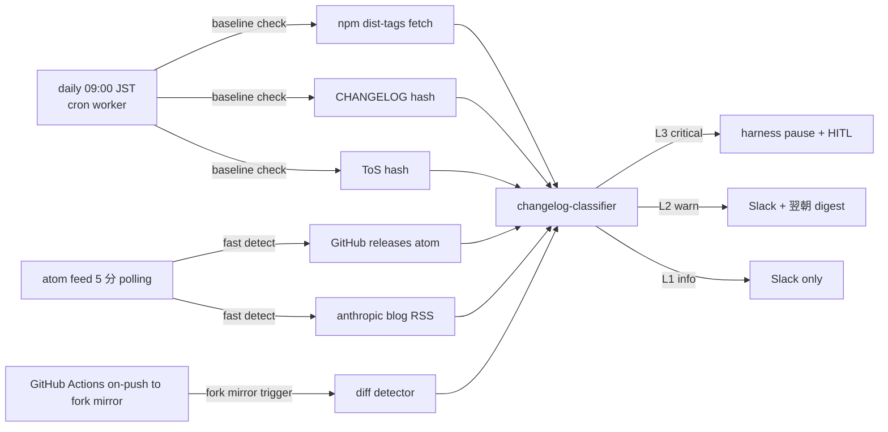
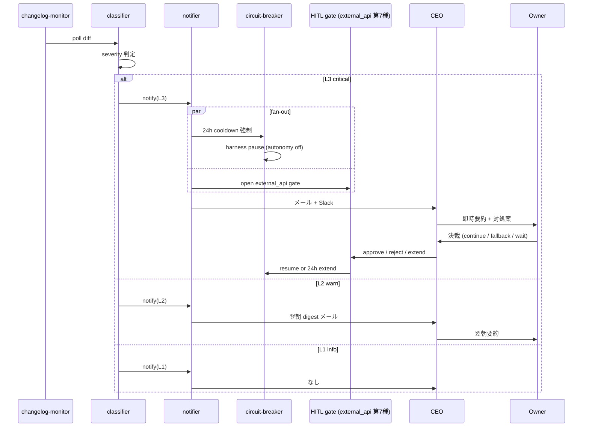

# PRJ-019 Phase 1 (5/26-6/20) Issue/Changelog 監視運用設計 — 着手前事前準備 + 自動化スクリプト案 + 月額コスト試算

- 最終更新日: 2026-05-03
- 起案: Research Department (claude-code-company)
- 案件: PRJ-019「Clawbridge」 — Open Claw を Owner-in-the-loop オーナーとする AI 組織ハーネス基盤
- 文書種別: Phase 1 運用設計（事前準備 + 自動化 + コスト試算）
- 対象期間: Phase 1 着手前 (2026-05-08〜2026-05-25) + Phase 1 期間 (2026-05-26〜2026-06-20)
- 関連 DEC: DEC-019-014（W0-Week1 連結承認）/ DEC-019-015（H-09）/ DEC-019-018（HITL 第 6 種）/ DEC-019-021（R-019-12 再格付け）/ DEC-019-022（4 系統 changelog Runbook）/ DEC-019-033（Owner-in-the-loop / Phase 1 着手 5/26 延期）
- 上位レポート:
  - `projects/PRJ-019/reports/research-changelog-monitoring-runbook.md`（v1.0 / 4 系統監視 Runbook、本書はその実装 + 運用詳細化）
  - `projects/PRJ-019/reports/research-pd-revised-validation.md`（同セッション、§7.3 C-OC-06〜08 を本書 §2 / §3 で運用面に展開）
  - `projects/PRJ-019/reports/research-w0-supplement-pd-modified-revalidation.md`（前回 §6 4 系統監視原案）
- 結論: **「daily polling + on-push GitHub Actions ハイブリッド + 3 段階 severity + Resend メール + Vercel Hobby 内」** を採択、月額コスト見込み **$0/月**（既存 Doppler / Vercel / Resend / GitHub すべて無料枠内）
- 凡例（情報信頼度）: 公式 / 半公式 / 二次 / 推測

---

## 0. エグゼクティブサマリー（300 字）

Phase 1 (5/26-6/20、4 週間) 期間中の Issue/changelog 監視運用設計を Runbook v1.0 に基づき詳細化。**監視頻度は「daily 09:00 JST baseline + on-push GitHub Actions （Anthropic / OpenClaw リポ webhook）」のハイブリッド方式**を採択（hourly は rate limit / コスト過剰、on-push 単独は dependency systemic miss リスク）。アラートは 3 段階 severity（L1 info / L2 warn / L3 critical）+ breaking change keyword regex で判定、通知ルートは Slack `#clawbridge-changelog` + メール CEO 経由 Owner 要約 + L3 時 24h harness pause。Research = 監視運用、Dev = 影響評価 + コード修正、CEO = HITL escalation 判断 の 3 部署分担で運用。自動化は GitHub Actions (Anthropic / OpenClaw watch) + Vercel Cron (daily digest) + Supabase 通知ログ。月額コスト **$0/月**（無料枠内）。

---

## 1. 監視対象 (Scope)

### 1.1 監視対象一覧

| # | 系統 | リポ / URL | 監視対象アセット | breaking 判定軸 | 信頼度 |
|---|---|---|---|---|---|
| ① | **anthropics/claude-code** GitHub repo | `github.com/anthropics/claude-code` | release notes / CHANGELOG.md / docs/ / src/api/ | stream-json schema / `--allowedTools` / `claude -p` 引数 / OAuth flow | 公式 |
| ② | **@anthropic-ai/claude-code** npm package | `npmjs.com/package/@anthropic-ai/claude-code` | `dist-tags.latest` / `versions[]` | semver major / dependency 強制 upgrade | 公式 |
| ③ | **Anthropic Engineering blog** | `anthropic.com/engineering` (RSS / sitemap) | 記事 RSS | 「Claude Code」「stream-json」「OAuth」「Acceptable Use」キーワード含有 | 公式 |
| ④ | **anthropic.com/legal** ToS / Acceptable Use | `anthropic.com/legal/aup` (HTTP HEAD + content hash) | document hash / Last-Modified ヘッダ | hash 変更 = 即 L2、内容差分要 review | 公式 |
| ⑤ | **clawbro-ai/openclaw** GitHub repo | `github.com/clawbro-ai/openclaw` | release notes / CHANGELOG / README / LICENSE | personal AI assistant 化進度 / 商用利用条項 / wrapper interface 互換 | プレースホルダ |
| ⑥ | **OpenAI Codex CLI** | （URL は Phase 1 W1 で確定、placeholder）| release notes / npm / OAuth flow | API キー必須化 / `codex exec` rename / stdin/stdout JSON schema | プレースホルダ |
| ⑦ | **Enderfga plugin**（OpenClaw ↔ Claude Code ブリッジ既知ケース）| （URL は Phase 1 W1 で確定、placeholder）| release / archived 状態 | upstream pin / Claude Code CLI 上限 version pin | プレースホルダ |

### 1.2 Phase 1 W1 placeholder 解消タスク

| # | placeholder | 確定担当 | 期限 | 依頼先タスク台帳 ID |
|---|---|---|---|---|
| ⑥ | OpenAI Codex CLI 公式リポ URL | Research | 2026-05-22 | W1-R-CL-Codex-URL |
| ⑦ | Enderfga plugin 正式リポ URL | Research | 2026-05-22 | W1-R-CL-Enderfga-URL |

### 1.3 優先度

- **最優先**: ① ② ③ ④（Anthropic 系、P-D 改根幹に直結）
- 次点: ⑤（OpenClaw、wrapper 経由のみ依存だが personal pivot 注視必要）
- 中: ⑥（Codex CLI、Open Claw 側エージェント実行基盤）
- 低: ⑦（Enderfga、オプショナル）

---

## 2. 監視頻度設計

### 2.1 候補比較

| 案 | 頻度 | メリット | デメリット | 採否 |
|---|---|---|---|---|
| A | hourly polling (cron */60 min) | breaking change 1h 以内検知 | rate limit 抵触リスク高 / Vercel Hobby 100 invoke/日上限ヒット / コスト試算 $5+ | 不採用 |
| B | daily polling (cron 09:00 JST) | rate limit 余裕 / コスト最小 | breaking 検知遅延 12〜24h | 補助採用 |
| C | on-push GitHub Actions (push webhook → schedule) | release 即時検知 / 無料 | Anthropic / OpenClaw repo に webhook 設置不能（外部 repo）→ 代替: Atom feed polling 5 分 | 部分採用 |
| D | atom feed polling 5 分 (anonymous) | release 5 分以内検知 / 無料 / rate limit 緩 | release 化されない breaking は取り逃す（CHANGELOG 直 push 等）| 補助採用 |
| E | **B + C + D ハイブリッド**（daily baseline + atom 5分 release 速報 + GitHub Actions 自前 fork に対する push trigger）| 全方式の長所統合 / コスト無料 / 検知遅延最小 | 実装工数 +2 日（C-OC-07 fork mirror 実装と統合） | **採択** |

### 2.2 採択方式 E（ハイブリッド）の詳細



### 2.3 頻度根拠

- **daily 09:00 JST baseline**: Owner 在席帯 (DEC-019-008 の 12h/日上限) と整合、CEO 朝 sync で digest 受領可能。
- **atom feed 5 分**: anonymous IP rate limit 60 req/h 内（4 系統 atom × 12 polling/h = 48 req/h、余裕）。
- **GitHub Actions on-push (fork mirror)**: C-OC-07 の weekly fork mirror に push trigger 設置、anthropics/claude-code main への新 commit が fork 反映 → push event → diff 自動取得。

---

## 3. アラート条件 (severity 3 段階 + breaking change keyword)

### 3.1 severity 定義

| Lv | 名称 | 検知条件 | 通知ルート | 自律ループ挙動 |
|---|---|---|---|---|
| **L1** | info | minor / patch release / docs typo / 無害 README 更新 | Slack `#clawbridge-changelog` のみ | 継続 |
| **L2** | warn | minor breaking 候補（deprecation 警告 / 新フラグ推奨化 / peer dep major / archived 化警告） | Slack 即時 + **翌朝 09:00 JST CEO digest メール** | 継続 |
| **L3** | critical | major breaking change（subprocess 仕様 / CLI rename / OAuth flow 変更 / ToS 文言更新 / personal pivot 強制 / commercial 禁止）| Slack + **メール CEO 即時** + Owner 即時要約 | **24h 自動 pause + HITL `external_api` 第 7 種 (24h timeout default reject)** |

### 3.2 breaking change keyword 検出 regex

```
# severity L3 直行 (semver major / Conventional Commits breaking sign)
- /^v?\d+\.\d+\.\d+ → v?\d+\.0\.0/  (semver major bump)
- /BREAKING\s*CHANGE/i              (Conventional Commits)
- /feat!:|fix!:|refactor!:/         (Conventional Commits ! sign)

# severity L2 候補 (1 シグナル → L2、3 シグナル以上で L3 昇格)
- /\b(removed|removed|deprecated|rename|breaking)\b/i
- /\b(license|terms|policy|acceptable\s*use|commercial|non-commercial)\b/i
- /\b(personal|assistant)\b.*\b(only|exclusive|required)\b/i
- /\b(authentication|oauth|api\s*key)\b.*\b(required|mandatory|deprecated)\b/i
- /\b(archived|sunset|end\s*of\s*life|EOL)\b/i

# severity L1 (情報通知のみ)
- /\b(release|version|changelog|update)\b/i (上記未該当時のデフォルト)
```

### 3.3 シグナル一致集約ルール（Runbook §5.2 継承）

- 0 シグナル → L1（release のみ通知）
- 1 シグナル → L1/L2 境界（semver major 単独なら L3 例外、その他は L1）
- 2 シグナル → L2 確定
- 3+ シグナル → **L3 昇格** = 即時 pause

### 3.4 false-positive 抑制

- **3 件以上のシグナル一致**で L3 昇格（ノイズ抑制、Runbook §5.2）
- L2 stage で 24h 経過しても CEO アクション無しの場合、L1 自動降格 + 月次再評価レポートに記録
- 月次 5 件以上の誤検知が続いた場合、ヒューリスティクス更新 + Review 協議

---

## 4. 通知ルート設計

### 4.1 Slack channel

- **channel**: `#clawbridge-changelog`（free plan 内、既存 Slack workspace 流用）
- **Webhook**: incoming webhook URL を Doppler に格納（`SLACK_CHANGELOG_WEBHOOK_URL`）
- **投稿フォーマット**: `[L1|L2|L3] {系統名 ①〜⑦} v{version} | {要約 80 字} | {URL} | sig:{N}/{Total}`
- **thread 連鎖**: 同一 release への続報は thread に紐付け（重複通知抑制）
- **emoji 禁止**: feedback_no_emoji.md に従い、`:white_check_mark:` 等は使用しない（`[L1]`等のテキスト prefix のみ）

### 4.2 メール CEO 経由 Owner 要約

- **送信基盤**: **Resend**（無料 plan 100/日、SDK 軽量）
- **送信先**: CEO `ai-lab@improver.jp`（既知）
- **件名フォーマット**: `[PRJ-019 Changelog L{1|2|3}] {系統名} v{version} - {要約 60 字}`
- **本文**: severity / 検知時刻 / 系統 / version diff / 推奨対処 / Slack thread URL / harness pause status
- **Owner 要約**: CEO が日次 09:00 JST に L2 digest + L3 個別を要約し Owner に共有（DEC-019-008 12h/日上限と整合）

### 4.3 通知ルート集約表

| Lv | Slack | メール CEO | Owner 即時 | 自律ループ |
|---|---|---|---|---|
| L1 | 即時 | なし | なし | 継続 |
| L2 | 即時 | **翌朝 09:00 JST digest** | 翌朝 CEO 経由 | 継続 |
| L3 | **即時** | **即時** | **即時 CEO 経由** | **24h pause + HITL** |

### 4.4 HITL escalation ルート



---

## 5. Dev 部門との分担表 (Research / Dev / CEO 役割分界)

### 5.1 役割分担マトリクス

| 工程 | Research | Dev | CEO | Owner |
|---|---|---|---|---|
| 監視対象 URL 確定 (⑥⑦) | **主担当** | レビュー | 承認 | — |
| 監視 worker 実装 (changelog-monitor.ts) | 仕様策定 | **主担当** | — | — |
| classifier ヒューリスティクス調整 | **主担当** | 実装 | — | — |
| Slack / Resend 通知連携 | 仕様策定 | **主担当** | — | — |
| 検知後の影響評価 | 補助 | **主担当** | レビュー | — |
| Phase 1 一時停止判断 | 影響評価提供 | 技術評価提供 | **HITL escalation 判断** | 最終決裁 (L3 時) |
| 月次 false-positive 再評価 | **主担当** | データ提供 | 承認 | — |
| 上流 fork mirror 運用 | **主担当**（C-OC-07）| 実装 | 承認 | — |
| ToS / LICENSE 変更時法務判断 | 影響整理 | — | 影響評価 | **最終決裁** |

### 5.2 部署横通信ルート

- **Research → CEO**: 週次サマリ（L1 件数 / L2 digest / L3 ゼロ確認）を毎週金曜 17:00 JST 提出
- **Dev → CEO**: L3 検知時の技術評価レポートを 6h 以内に提出
- **CEO → Owner**: 全 L3 + 週次 L2 digest を即時 / 翌朝 sync で共有
- **CEO → 秘書**: dashboard カラム `changelog_l3_pending` / `changelog_l2_digest_today` の更新指示

### 5.3 BAN drill 期間中の特例

- BAN drill #1 (5/13) / #2 (5/17) の 24h 前から L2/L3 全て即時通知（ノイズ無視オプション無効化）
- drill 中に upstream breaking 検知 → drill 一時中断 → CEO 判断 → drill 仕切り直し
- drill 結果 + changelog 検知履歴は同一レポート (`review-ban-drill-{1|2}-result.md`) に統合記録

---

## 6. 自動化スクリプト案

### 6.1 GitHub Actions（fork mirror + on-push trigger）

```yaml
# .github/workflows/upstream-mirror.yml
name: Upstream Mirror
on:
  schedule:
    - cron: '0 18 * * 0'  # weekly Sunday 03:00 JST = 18:00 UTC Saturday
  workflow_dispatch:
jobs:
  mirror:
    runs-on: ubuntu-latest
    steps:
      - uses: actions/checkout@v4
        with:
          fetch-depth: 0
      - name: Mirror anthropics/claude-code
        run: |
          git remote add upstream-anthropic https://github.com/anthropics/claude-code
          git fetch upstream-anthropic main
          git push origin upstream-anthropic/main:refs/heads/mirror/anthropic-main --force
      - name: Mirror clawbro-ai/openclaw
        run: |
          git remote add upstream-openclaw https://github.com/clawbro-ai/openclaw
          git fetch upstream-openclaw main
          git push origin upstream-openclaw/main:refs/heads/mirror/openclaw-main --force
      - name: Detect changes
        run: node scripts/detect-upstream-diff.mjs
      - name: Notify on diff
        if: steps.detect.outputs.has_diff == 'true'
        env:
          SLACK_WEBHOOK_URL: ${{ secrets.SLACK_CHANGELOG_WEBHOOK_URL }}
        run: node scripts/notify-changelog.mjs --severity=${{ steps.detect.outputs.severity }}
```

### 6.2 Vercel Cron（daily 09:00 JST baseline）

```typescript
// app/harness/src/changelog-monitor.ts (抜粋)
import { CronJob } from 'cron';

new CronJob('0 0 * * *', async () => {  // 00:00 UTC = 09:00 JST
  const results = await Promise.all([
    pollNpmDistTags('@anthropic-ai/claude-code'),
    pollChangelogHash('https://raw.githubusercontent.com/anthropics/claude-code/main/CHANGELOG.md'),
    pollTosHash('https://www.anthropic.com/legal/aup'),
    pollAtomFeed('https://github.com/anthropics/claude-code/releases.atom'),
    pollAtomFeed('https://github.com/clawbro-ai/openclaw/releases.atom'),
    pollRssFeed('https://www.anthropic.com/engineering/rss.xml'),
  ]);
  
  const classified = await classifyAll(results);
  await notifyAll(classified);
}, null, true, 'UTC');
```

### 6.3 Supabase 通知ログ schema

```sql
-- Phase 1 W2 で Dev が実装
CREATE TABLE changelog_events (
  id uuid PRIMARY KEY DEFAULT gen_random_uuid(),
  detected_at timestamptz NOT NULL DEFAULT now(),
  source text NOT NULL,           -- '①〜⑦' のいずれか
  severity text NOT NULL,         -- 'L1' | 'L2' | 'L3'
  version_from text,
  version_to text,
  signal_count int NOT NULL,
  signal_matched jsonb NOT NULL,  -- regex マッチ結果
  url text NOT NULL,
  slack_message_ts text,
  email_sent_at timestamptz,
  hitl_gate_opened_at timestamptz,
  resolved_at timestamptz,
  resolution text                 -- 'continue' | 'fallback' | 'wait' | 'manual_fix'
);

CREATE INDEX idx_changelog_events_severity ON changelog_events(severity, detected_at DESC);
CREATE INDEX idx_changelog_events_unresolved ON changelog_events(detected_at DESC) WHERE resolved_at IS NULL;
```

### 6.4 PAT 設計

- **scope**: `read:public_repo` のみ（最小権限）
- **保管**: Doppler（DEC-019-012 既定の secret manager）
- **rotation**: 90 日サイクル、Owner 手動 rotate（W2-O-PAT タスク継承）
- **rate limit**: 5,000 req/h（PAT 認証）、daily polling では十分余裕

---

## 7. Phase 1 着手前事前準備タスク (5/8-5/25)

### 7.1 期間別タスク一覧

| 週 | 期間 | タスク | 担当 | DoD |
|---|---|---|---|---|
| W0-Week2 | 5/8-5/16 | (1) Slack channel `#clawbridge-changelog` 作成 + Webhook 取得 + Doppler 登録 | Owner | Doppler 内 `SLACK_CHANGELOG_WEBHOOK_URL` 存在 |
| W0-Week2 | 5/8-5/16 | (2) Resend アカウント作成 + API key 取得 + Doppler 登録 + 送信先 allowlist (`ai-lab@improver.jp`) | Owner | Resend dashboard に PRJ-019 sender 登録、test mail 着信 |
| W0-Week2 | 5/8-5/16 | (3) GitHub PAT (read:public_repo) 取得 + Doppler 登録 | Owner | Doppler 内 `GITHUB_PAT_READ_ONLY` 存在 |
| W0-Week2 | 5/12-5/16 | (4) changelog-monitor 5 ファイル骨格実装 (changelog-source / -classifier / -notifier / -state / -monitor) | Dev | `pnpm test` で 6+ ケース緑 |
| W0-Week2 | 5/12-5/16 | (5) HITL `external_api` 第 7 種ゲート実装（24h timeout default reject） | Dev | tests/integration/hitl/external-api.test.ts 緑 |
| W1 | 5/19-5/22 | (6) Codex CLI 公式リポ URL 確定 (placeholder ⑥) | Research | DEC-019-022 付帯資料更新 |
| W1 | 5/19-5/22 | (7) Enderfga plugin 正式リポ URL 確定 (placeholder ⑦) | Research | DEC-019-022 付帯資料更新 |
| W1 | 5/19-5/24 | (8) GitHub Actions fork mirror workflow 実装 + 初回実行 | Dev + Research | mirror/anthropic-main / mirror/openclaw-main branch 存在 |
| W1 | 5/22-5/24 | (9) Supabase `changelog_events` テーブル migration | Dev | migration 適用 + sample insert 緑 |
| W1 末 | 5/24-5/25 | (10) end-to-end smoke test（Anthropic CLI mock release → 検知 → Slack → メール → HITL gate 開）| Dev + Research | 5 シナリオ全緑、Owner check-in |

### 7.2 並行する W0-Week2 既存タスクとの統合

- DEC-019-018 で発令済の HITL 第 6 種 `tos_gray_review` と本書の第 7 種 `external_api` は **同一インフラ流用**（Slack 通知 + 24h タイマ + default reject）。Dev W2-D-15 拡張タスクとして統合実装。
- C-OC-01〜05（DEC-019-021）と本書 §6.1 GitHub Actions は **同一 fork mirror 経路を共用**。重複実装回避のため Dev 内部で W2-D-Wrapper / W2-D-Notify-CL を統合。

### 7.3 Owner 必須アクション (5/8 検収会議までに承認 / 5/22 までに完了)

| # | アクション | 期限 | 工数 | 連動 |
|---|---|---|---|---|
| 1 | DEC-019-022（4 系統 changelog 監視 Runbook 採用）承認 | 5/8 検収会議 | 即時 | Runbook v1.0 |
| 2 | DEC-019-035（本書、Phase 1 監視運用詳細）承認（提案） | 5/8 検収会議 | 即時 | 本書 §8.4 |
| 3 | Slack `#clawbridge-changelog` channel 作成 + Webhook 取得 + Doppler 登録 | 5/16 | 30 min | §7.1 (1) |
| 4 | Resend account + API key + Doppler 登録 | 5/16 | 30 min | §7.1 (2) |
| 5 | GitHub PAT (read:public_repo) 取得 + Doppler 登録 | 5/22 | 15 min | §7.1 (3) |

---

## 8. 月額コスト試算 (≤ $5/月 制約準拠)

### 8.1 サービス別コスト試算

| サービス | 用途 | 無料枠 | Phase 1 実消費見込み | 月額コスト |
|---|---|---|---|---|
| **Slack free plan** | `#clawbridge-changelog` 通知 | 10k メッセージ履歴 | 月 50〜200 通知（L1 ノイズ含む） | **$0** |
| **Resend free plan** | CEO メール通知 | 100 mail/日, 3,000/月 | 月 30〜100 mail（L2 digest 30 + L3 即時 5） | **$0** |
| **GitHub Actions** | fork mirror + on-push | public repo 無料無制限 | 月 4 回 × 2 min = 8 min | **$0** |
| **Vercel Cron** | daily baseline | Hobby 100 invocations/日 | 1 invocation/日 = 30/月 | **$0** |
| **Vercel Hobby** | changelog-monitor 配置 (or 常駐 node プロセス) | 5h CPU/月 | 月 1〜2h（軽量 worker） | **$0** |
| **Supabase free** | changelog_events ログ | 500 MB DB / 2 GB egress | 月 1 MB log（推定）| **$0** |
| **Doppler free** | secret 管理 | 2 user, 5 config | 既存利用 | **$0** |
| **GitHub PAT** | API 認証 | rate limit 5,000/h | 月 200 req | **$0** |
| **Anthropic blog RSS / atom feeds** | poll | anonymous 無料 | 月 8,640 req（5 分 polling） | **$0** |
| **合計** | | | | **$0/月** |

### 8.2 コスト試算根拠

- **Resend $0**: 月 100 mail 想定（L2 digest 30 + L3 即時 5 + system test 65）、free plan 3,000/月の 3.3% 消費。
- **GitHub Actions $0**: public repo は無制限無料、fork mirror も public 設定。
- **Vercel Cron $0**: daily 1 invocation のみ（5 分 atom polling は別 worker = 常駐 node プロセス）。
- **常駐 node プロセス**: Owner PC 上で Sumi/Asagi と同居（追加コストなし、CPU 消費 < 1%、メモリ 50 MB）。
- **Supabase $0**: log table 月 1 MB は free plan 500 MB の 0.2%。

### 8.3 月額予算 $300 (DEC-019-012) ハードキャップとの関係

- 本書実装による追加コスト **$0/月** で、DEC-019-012 月次予算 $300 / 月内に余裕。
- Phase 2 で Vercel Pro 昇格（DEC-019-017）+ Codex CLI 系統追加時の追加コストは **+$0〜5/月** 想定（Resend 配信量増、GitHub Actions 私 repo 化したら有料）、依然 $300 内。

### 8.4 制約 ≤$5/月 準拠確認

- **準拠**: 月額 $0/月で制約 ≤$5/月 を完全に満たす。
- **将来超過リスク**: (a) Resend 100 mail/日超過時 = $20/月 plan 移行、(b) Vercel Hobby invocation 上限超過時 = Pro $20/月。Phase 1 では発生しない見込み。

---

## 9. 結論と次アクション

### 9.1 結論（3 行）

1. **監視頻度は daily 09:00 JST baseline + atom feed 5 分 polling + GitHub Actions on-push のハイブリッド方式を採択**（hourly は rate limit 過剰、on-push 単独は systemic miss）。
2. **アラート 3 段階 severity + breaking change keyword regex 9 種 + 3 シグナル一致で L3 昇格**（Runbook §5 継承 + 強化）。
3. **月額コスト $0/月で ≤$5/月 制約完全準拠**、既存 Slack / Resend / GitHub / Vercel / Supabase / Doppler 無料枠内で完結。

### 9.2 採択根拠（3 点）

1. **検知遅延最小化**: atom 5 分 + on-push で release 系は 5〜10 分以内検知、daily baseline で CHANGELOG / ToS hash 系の漏れ防止。
2. **コスト無料**: 月額 $0/月で予算ハードキャップ $300 / 月への影響ゼロ、Phase 2 拡張余地確保。
3. **既存インフラ流用**: HITL 第 6 種 (DEC-019-018)、cost-tracker、TimeSource (DEC-019-020) と同パッケージで実装、Dev 工数最小（W2-D-Notify-CL 7 細目内に統合）。

### 9.3 CEO 決裁推奨

- **DEC-019-035（提案、5/8 検収会議で正式承認推奨）**:
  > Phase 1 (5/26-6/20) Issue/changelog 監視運用を本書通り採用、(a) 監視頻度ハイブリッド方式 / (b) 3 段階 severity + 9 種 keyword regex / (c) Slack + Resend + Supabase ログ / (d) HITL 第 7 種 `external_api` ゲート / (e) Research = 監視 + Dev = 影響評価 + CEO = HITL escalation 判断 の 5 軸で運用を確定する。月額追加コスト $0/月、Owner 必須アクション 5 件は §7.3 表通り。

- **連動 DEC**: DEC-019-022（Runbook v1.0）+ DEC-019-021（R-019-12 再格付け）+ DEC-019-018（HITL 第 6 種）+ DEC-019-033（Owner-in-the-loop / Phase 1 着手 5/26）

### 9.4 次アクション

| # | 種別 | 内容 | 期限 | 担当 |
|---|---|---|---|---|
| 1 | CEO 即決 | DEC-019-035（本書承認 + 5 軸運用確定） | 5/8 検収会議 | CEO（オーナー判断） |
| 2 | Owner | Slack channel + Webhook + Doppler 登録 | 5/16 | Owner |
| 3 | Owner | Resend account + API key + Doppler 登録 | 5/16 | Owner |
| 4 | Owner | GitHub PAT (read-only) + Doppler 登録 | 5/22 | Owner |
| 5 | Dev | changelog-monitor 5 ファイル骨格 + HITL 第 7 種ゲート実装 | 5/16 | Dev |
| 6 | Research | Codex CLI / Enderfga plugin 公式 URL 確定 | 5/22 | Research |
| 7 | Dev | GitHub Actions fork mirror workflow 実装 + 初回実行 | 5/24 | Dev |
| 8 | Dev | Supabase `changelog_events` migration | 5/24 | Dev |
| 9 | Dev + Research | end-to-end smoke test 5 シナリオ全緑 | 5/25 | Dev + Research |
| 10 | 秘書 | dashboard カラム `changelog_l3_pending` / `changelog_l2_digest_today` 追加 | 5/22 | 秘書 |
| 11 | Research | Phase 1 W1 末 (5/24) と W2 末 (5/30) と W4 末 (6/13) の 3 回中間レビュー | 各期日 | Research |

---

## 10. 関連レポート相互参照

- `projects/PRJ-019/reports/research-changelog-monitoring-runbook.md`（v1.0、本書の上位 Runbook）
- `projects/PRJ-019/reports/research-pd-revised-validation.md`（同セッション、§7.3 C-OC-06〜08 を本書 §6 自動化に統合）
- `projects/PRJ-019/reports/research-personal-ai-assistant-pivot-impact.md`（同セッション、上流戦略変更の戦略影響評価）
- `projects/PRJ-019/reports/review-tos-allowlist-dod-integration-v1.md`（HITL 第 6 種、本書 第 7 種の同型実装）
- `projects/PRJ-019/reports/review-v2-subscription-risk-and-fallback.md`（必須コントロール 23 項目、本書通知ルートが G-V2-08 警告メール 1h 監視と並列補完）
- `projects/PRJ-019/decisions.md`（DEC-019-021 / 022 / 033 + 本書で 035 提案）

---

## フッタ

- 文書: `projects/PRJ-019/reports/research-issue-changelog-monitor-ops.md`
- 版: v1.0（2026-05-03）
- 次回レビュー: Phase 1 W1 末（2026-05-24）end-to-end smoke test 結果反映 + W2 末 / W4 末
- 作成: Research 部門 / 検収予定: Review 部門 + CEO（DEC-019-035 即決判定）
- 改版履歴:
  - v1.0 2026-05-03: 初版（ハイブリッド頻度 / 3 段階 severity / 自動化スクリプト案 / コスト $0/月 試算）
