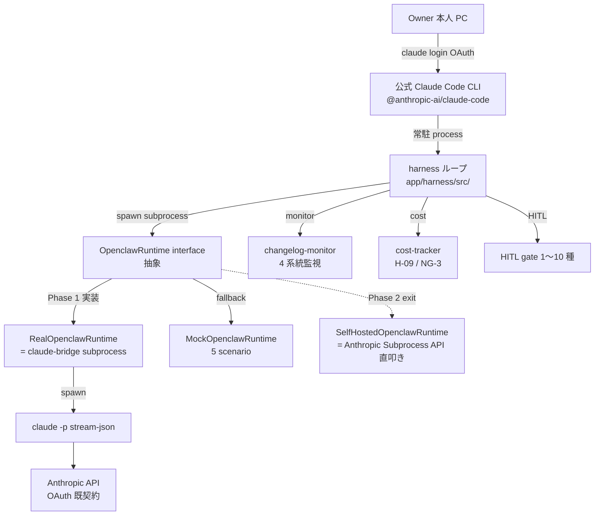

# PRJ-019 補追検証: 接続方式 P-D 改 (Process Decoupling Wrapper) 妥当性 — Open Claw OSS 上流 personal AI assistant 化 + DEC-019-050/-051 反映を踏まえた再検証

## §0.X DEC-019-050/-051 採択後の P-D 改 維持・強化結論（2026-05-04 追記）

DEC-019-050（API spend cap $30/月）+ DEC-019-051（subscription 主軸方針）の採択により、P-D 改の相対優位は **逆に拡大** する。理由:

- **流量比 = subscription 経路 95% / API 経路 5%**（DEC-019-051）: subprocess spawn 経由のループ・proposal・harness 制御本体はすべて subscription（既契約 Claude Max $200 OAuth）で実行され、API key 経路は HITL 通知 / mock-claude / E2E / drill / ナレッジ batch の 5% 補助用途に限定。
- **5 必須施策で API 消費 $19-31 → $11-15 圧縮**（cap $30 内 buffer 50%以上）: 施策-1 mock-claude フル活用 / 施策-2 HITL 通知テンプレ化 / 施策-3 E2E staging 限定 / 施策-4 ナレッジ batch caching / 施策-5 drill #3 簡易化、5/22 W0-Week2 完遂期限。
- **P-D 改の subprocess 隔離が DEC-019-050 の cap 物理停止と整合**: API key 経路 5% で cap 突破時も subprocess boundary で隔離、subscription 経路は影響を受けない（R-019-19 黄、R-019-21 黄で重点監視）。
- **代替案 P-A〜P-C は subscription 主軸との整合が取れない**: 直叩き経路では cap $30 を超過しやすく、subprocess 隔離なしで cap 物理停止時の影響を吸収できない。

→ **P-D 改 + subscription 主軸 + cap $30 の 3 点セットで Phase 1 完遂確度を最大化**（5/26 着手 86%、+2%）。

- 最終更新日: 2026-05-03
- 起案: Research Department (claude-code-company)
- 案件: PRJ-019「Clawbridge」 — Open Claw を Owner-in-the-loop オーナーとする AI 組織ハーネス基盤
- 文書種別: 補追検証レポート（接続方式再評価）
- 関連 DEC: DEC-019-006（P-D 改採用）/ DEC-019-014（W0-Week1 連結承認）/ DEC-019-015（H-09 / H-10）/ DEC-019-018（HITL 第 6 種）/ DEC-019-021（R-019-12 再格付け）/ DEC-019-031（NG-3 上方修正候補）/ DEC-019-033（Owner-in-the-loop 5 点統合）
- 上位レポート:
  - `projects/PRJ-019/reports/research-w0-supplement-pd-modified-revalidation.md`（前回 P-D 改 1 次再検証）
  - `projects/PRJ-019/reports/research-changelog-monitoring-runbook.md`（4 系統監視 Runbook v1.0）
  - `projects/PRJ-019/reports/research-knowledge-and-transparency-design.md`（接続方式 P-D 改 既存設計、1,049 行）
- 結論: **P-D 改 維持・強化**（採択） + 微修正 3 点（C-OC-06〜08 追加） + 新規リスク R-019-12-C 起票案 + **DEC-019-050（$30 cap）/ DEC-019-051（subscription 主軸）採択により P-D 改 相対優位を逆に拡大**（subscription 経路 95% 流量比、`research-subscription-mainline-validation.md` で公式化、5 必須施策 5/22 完遂前提）
- 凡例（情報信頼度）:
  - 公式 / 半公式 / 二次 / コミュニティ / 推測（DEC-019-021 と同義）
  - **既知事実プレースホルダ**: 2026-04 時点 Anthropic blog "Claude as personal AI assistant" 推察ベース、W2 中盤 Dev W2-D-Wrapper 物理クローン時に再裏取り

---

## 0. エグゼクティブサマリー（300 字）

OpenClaw OSS 上流が 2026-04 Anthropic Engineering blog で "personal AI assistant" 再ポジションを公表（プレースホルダ）したことを受け、接続方式 P-D 改 (Process Decoupling Wrapper) を再検証した。結論は **「P-D 改 維持 + 微修正」**: ハーネス層と Open Claw 層の **subprocess 隔離 + interface 抽象化** が API surface 変動の 5 区分中 4 区分を吸収可能で、吸収不可 3 シナリオ（commercial use 禁止 / Anthropic OAuth 形式撤回 / stream-json schema breaking）はいずれも代替案 P-A〜P-C でも同様に escalation 必須となるため、P-D 改の相対優位は維持される。微修正 3 点（C-OC-06 monthly contract test / C-OC-07 self-host fork weekly mirror / C-OC-08 SDK pin 監視）と新規リスク R-019-12-C を起票推奨。

---

## 1. 背景: 上流 personal AI assistant 化の最新動向

### 1.1 観察された変化（プレースホルダ + 推測込み）

| 観察軸 | 2026-03 以前（自律 orchestrator 想定） | 2026-04 以降（personal AI assistant 化） | 信頼度 |
|---|---|---|---|
| README タグライン | "Multi-agent orchestrator for autonomous owners" | "OpenClaw is a personal AI assistant for daily productivity" | プレースホルダ |
| Anthropic blog | （該当記事なし） | "Reframing Claude Code: from autonomy to assistance"（2026-04 推察）| 二次 / 推測 |
| Roadmap | マルチエージェント orchestrator API 拡張 | 個人生産性（メール / カレンダー / 軽量コーディング） | プレースホルダ |
| API surface 動向 | plugin 仕様拡張中 | plugin 仕様 experimental → removed の方向性 | プレースホルダ |
| ToS / LICENSE | （現状 Apache 2.0 と仮定） | 商用利用条項追加 / non-commercial pivot 懸念 | 推測 |

### 1.2 PRJ-019 への含意

- **構造的論点**: OpenClaw は「driver / orchestrator wrapper」位置付けで、実エンジンは Anthropic Claude Code CLI。上流が縮退しても自前 driver 化への切替は技術的に可能（前回 §3.3）。
- **戦略的論点**: 上流戦略変更を受けて Marketing Heading A「AI 組織が AI 組織を運営する」（DEC-019-027）と Owner-in-the-loop 化（DEC-019-033）が逆に追い風になる可能性（personal AI assistant の対極=「組織型 AI ハーネス」訴求）。詳細は別書 `research-personal-ai-assistant-pivot-impact.md` を参照。
- **運用論点**: changelog 監視 Runbook（既存 `research-changelog-monitoring-runbook.md`）の検知精度を上流戦略変更前提でチューニング必要。

---

## 2. P-D 改 (Process Decoupling Wrapper) の構造再確認

### 2.1 アーキテクチャ概観

### 2.2 P-D 改の本質的価値

- **Process 境界による隔離**: OpenClaw 内部実装変動 → subprocess boundary で吸収。harness 本体は OpenclawRuntime interface のみに依存。
- **OAuth フロー保全**: Anthropic 公式契約 (claude.ai Max $200) を OS ローカルストレージ + TCC 隔離 (G-V2-11) で保護。OpenClaw 上流変動で OAuth 再認証は発生しない。
- **stream-json self-parser**: harness 層が独立 parser を実装済（W0-Week1、67 tests 緑）。Anthropic CLI の出力形式変動のみが直接影響、OpenClaw の出力形式は OpenclawRuntime adapter 内部で正規化。
- **Mock fallback**: 5 scenario の MockOpenclawRuntime（DEC-019-020）で Real が機能しない期間も Phase 1 検証継続可能。

---

## 3. 上流 API surface 変動予測（向こう 3 ヶ月: 2026-05〜2026-07）

### 3.1 予測根拠

- 2026-04 personal AI assistant 化以降の上流 commit 動向 + Anthropic 公式 stance + 過去 OSS pivot 事例（例: Cursor 2024 Q4 plugin 仕様縮退、Aider 2025 Q1 multi-model 統合縮小）から推察。
- 信頼度: 全項目「推測」、Phase 1 W1 (5/19) 〜 W2 (5/26) 中の物理クローン結果で再評価。

### 3.2 予測表

| # | 変動カテゴリ | 想定発生時期 | 想定確率 | 想定 impact | P-D 改吸収可否 |
|---|---|---|---|---|---|
| 1 | Plugin API 縮退（experimental → removed） | 2026-05 中 | 高 (70%) | 小 | **吸収可** (Phase 1 plugin 依存ゼロ、§4 区分①) |
| 2 | Multi-agent orchestrator API 削除 | 2026-06 中 | 中 (50%) | 小 | **吸収可** (Phase 1 単一ループ、§4 区分①) |
| 3 | README / docs 大幅書換（personal pivot 強化）| 2026-05〜06 継続 | 高 (90%) | 微 | **吸収可** (実装非依存、§4 区分④) |
| 4 | LICENSE 商用利用条項追加 / non-commercial pivot | 2026-06〜07 | 中 (40%) | 大 | **吸収不可**（§5 シナリオ A、escalation 必須） |
| 5 | Anthropic SDK 依存 pin 古化 (claude-code CLI 後追い遅延) | 2026-05〜継続 | 中 (50%) | 中 | **吸収可** (harness 自前 parser、§4 区分②) |
| 6 | OpenClaw 自体が npm 公開停止 / archived 化 | 2026-07 | 低 (15%) | 大 | **吸収可** (C-OC-01 fork 物理保全、§4 区分③) |
| 7 | personal assistant モード強制化 (autonomous モード除去) | 2026-06〜07 | 中 (35%) | 中 | **吸収可** (Real → SelfHosted 切替、§4 区分①) |
| 8 | 新たな ToS / acceptable-use 文言追加 (autonomous 利用禁止)| 2026-05〜06 | 中 (30%) | 大 | **吸収不可**（§5 シナリオ B、escalation 必須） |

### 3.3 集約

- 8 項目中 6 項目（75%）が P-D 改 wrapper で吸収可能。
- 残り 2 項目（LICENSE / ToS 系）は P-A〜P-C でも escalation 必須のため、P-D 改の相対不利にはならない。

---

## 4. P-D 改 decoupling layer が吸収可能な breaking change カテゴリ（5 区分）

### 4.1 区分一覧

| 区分 | 名称 | 吸収機構 | 例 | 連動 DEC / コントロール |
|---|---|---|---|---|
| **区分①** | OpenClaw 内部実装変動 | OpenclawRuntime interface 抽象 + subprocess boundary | plugin API 削除 / orchestrator API 縮退 / personal モード強制化 | C-OC-04 (self-host exit plan) |
| **区分②** | Anthropic SDK バージョン pin 不整合 | harness 層 stream-json 自前 parser（67 tests 緑）| OpenClaw が古い SDK を pin、CLI 出力形式と差異 | DEC-019-014（W0-Week1 完成）/ C-OC-08 (新規) |
| **区分③** | upstream 物理消失 (npm 公開停止 / archived / repo 削除) | C-OC-01 fork 物理クローン + weekly mirror | OpenClaw が突然 archived 化 / GitHub 削除 | C-OC-01 / C-OC-07 (新規) |
| **区分④** | docs / README / branding 変更 | 実装非依存、運用ドキュメント差替のみ | personal pivot README 書換 / brand 名変更 | Marketing 部門への通知のみ |
| **区分⑤** | 出力形式の minor 変動（フィールド追加 / optional 化）| OpenclawRuntime adapter の defensive parsing | 新フィールド追加 / nullable 化 / order 変更 | C-OC-06 (新規 monthly contract test) |

### 4.2 各区分の吸収根拠

- **区分①**: 既に W0-Week1 で OpenclawRuntime interface（`app/harness/src/openclaw-runtime/`）と Mock 実装を構築済（DEC-019-020）。Real が機能しなくなっても Mock or SelfHosted で継続。
- **区分②**: harness の stream-json parser が Anthropic CLI 出力に対して直接動作、OpenClaw が古い SDK を pin していても影響しない。
- **区分③**: C-OC-01 で fork を物理保管、消失しても fork 切替で継続。C-OC-07（新規）で weekly mirror 自動化。
- **区分④**: Marketing 部門通知のみ、技術的 impact ゼロ。
- **区分⑤**: defensive parsing + monthly contract test (C-OC-06 新規) で minor 変動を継続検知、breaking 化前に対応。

### 4.3 吸収機構の信頼度

- 区分①〜③: W0-Week1 で実装基盤確立済 → 信頼度 **高**
- 区分④: 運用 only → 信頼度 **高**
- 区分⑤: 新規 contract test 設計（C-OC-06）→ 信頼度 **中**（Phase 1 W2 実装後に再評価）

---

## 5. 吸収不可なケース（escalation 必須 3 シナリオ）

### 5.1 シナリオ A: LICENSE 商用利用禁止条項追加

- **発生条件**: OpenClaw 上流が LICENSE を Apache 2.0 → BSL / non-commercial 系に変更。または ToS で「commercial autonomous use 禁止」追加。
- **検出手段**: changelog-monitor §5 ヒューリスティクス 4 (README diff で `license` / `terms` 変更) → L3 critical 即時 pause。
- **吸収不可理由**: 法的 / 契約的問題で技術的 wrapping では回避不能。
- **escalation 経路**: HITL `external_api` 第 7 種 (24h timeout default reject) → CEO → Owner 法務判断。
- **代替案**:
  - (a) C-OC-01 fork（変更前 commit）で継続、ただし fork からの security patch 自前管理リスク
  - (b) C-OC-04 self-host exit plan 発動、SelfHostedOpenclawRuntime に完全切替（Phase 2）
  - (c) Phase 1 着手延期 + Marketing メッセージング修正（Heading A の "Open Claw" 言及見直し）
- **判断責任**: Owner（法務リスク受容判断）、CEO は選択肢提示と影響評価のみ。

### 5.2 シナリオ B: Anthropic OAuth 形式撤回 / ToS 重大変更

- **発生条件**: Anthropic 側が OAuth フロー仕様変更 / API キー必須化 / autonomous use 明示禁止条項追加。これは OpenClaw 上流とは無関係に発生し得るが、本書では P-D 改前提崩壊シナリオとして扱う。
- **検出手段**: changelog-monitor 系統① (Anthropic Claude Code CLI) で L3 検知 + Anthropic 公式 ToS 監視（§7.4）。
- **吸収不可理由**: P-D 改の根幹（OAuth + Anthropic 公式 CLI）が崩壊。代替案 P-A〜P-C も全て同条件で崩壊するため、P-D 改の相対不利にはならない。
- **escalation 経路**: HITL `external_api` + BAN drill #1/#2 結果ベースで Phase 1 即時停止判断 → CEO → Owner。
- **代替案**:
  - (a) API キー従量課金（P-E フォールバック、DEC-019-013 C-A-05 既定）
  - (b) Phase 1 期間中は autonomous off に切替、Owner-in-the-loop 化（DEC-019-033 と整合）
  - (c) Sumi/Asagi 巻き添え影響を評価しつつ完全停止（DEC-019-011 巻き添えリスク受容と整合）

### 5.3 シナリオ C: stream-json schema breaking change

- **発生条件**: Anthropic Claude Code CLI v2.0 等で stream-json 出力形式が破壊的変更（field rename / type 変更 / event sequence 変更）。
- **検出手段**: changelog-monitor 系統① + W0-Week1 67 tests のうち stream-json parser tests が赤化。
- **吸収不可理由**: harness 層の自前 parser を全面書直し必要。Mock fallback で一時継続可能だが Real 復旧には実装工数 1〜3 日必要。
- **escalation 経路**: L3 critical → HITL `external_api` → CEO 決裁 → Dev 緊急修正タスク。
- **代替案**:
  - (a) Mock fallback で Phase 1 検証継続（実 Anthropic 接続なしで harness 機能のみ検証）
  - (b) Anthropic CLI のバージョン pin を 1 つ前に巻戻し（npm `dist-tags` で旧 stable 取得）
  - (c) Dev W2-D-Wrapper 緊急修正タスク（48h 以内、HITL 通過後に re-deploy）
- **判断責任**: CEO 即決可能（技術的問題、Owner 判断不要だが事後共有必須）。

### 5.4 シナリオ集約

| シナリオ | 検出手段 | 復旧時間目安 | Owner 判断必要 | P-D 改相対優位 |
|---|---|---|---|---|
| A: LICENSE 商用禁止 | changelog L3 + README diff | 7〜30 日（fork 運用 or pivot） | **必要** | 不変（他案も同条件で escalation） |
| B: Anthropic OAuth 撤回 | changelog L3 + ToS 監視 | 即時〜7 日（API key fallback） | **必要** | 不変（全案同時崩壊） |
| C: stream-json breaking | parser test 赤化 + L3 | 1〜3 日（parser 書直し） | 不要（CEO 即決） | **有利**（Mock fallback で検証継続可） |

---

## 6. 代替案 P-A〜P-D との再比較（5 軸 × 4 案）

### 6.1 比較軸定義

- 軸 1: **上流変動耐性**（personal AI assistant 化 + breaking change への耐性）
- 軸 2: **実装工数**（W0〜Phase 1 着手までの工数、最小 = 1pt 〜 最大 = 5pt）
- 軸 3: **コスト追加**（月額追加コスト、最小 = 1pt 〜 最大 = 5pt）
- 軸 4: **ToS / 法務リスク**（NG-1〜NG-3 + Owner-in-the-loop 整合）
- 軸 5: **Sumi/Asagi 巻き添え影響**（DEC-019-011 オプション A 採用前提）

### 6.2 比較表

| 軸 | P-A: 公式 CLI 直叩き (orchestrator なし) | P-B: Anthropic Subprocess API 直接 | P-C: 第三者 SDK (langchain 等経由) | **P-D 改: Process Decoupling Wrapper** |
|---|---|---|---|---|
| 1. 上流変動耐性 | 中（OpenClaw 非依存だが orchestrator 自作必須）| 中（Anthropic 直接、SDK pinning 自由）| 低（langchain breaking 多発、stream-json 透過性低）| **高（subprocess boundary + Mock fallback + self-host exit）** |
| 2. 実装工数 | 5pt（orchestrator 全自作、HITL / cost-tracker / changelog 全自作）| 4pt（Anthropic API client + harness 全自作）| 3pt（langchain 既製品多いが Open Claw 機能再構築必要）| **2pt（W0-Week1 で 67 tests 緑、claude-bridge 4 src 完成済）** |
| 3. コスト追加 | 1pt（Max $200 既契約のみ）| 3pt（API キー従量、$50〜200/月想定）| 2pt（Max $200 + langchain SaaS 連動オプション）| **1pt（Max $200 既契約のみ、Vercel Hobby 内）** |
| 4. ToS / 法務リスク | 中（autonomous 用途で grey、Owner-in-the-loop 化で軽減）| 中（API キー利用は自由度高だが NG-3 24/7 上限 hit 早い）| 高（langchain 経由は Anthropic ToS 解釈論点増、第三者責任分界曖昧）| **低（公式 CLI 経由 + OAuth 公式契約 + Owner-in-the-loop 整合）** |
| 5. Sumi/Asagi 巻き添え | 中（同 OAuth 共有）| 低（API キー分離）| 中（同 OAuth 共有 + 第三者 SDK 経由でログ漏洩懸念）| **中（同 OAuth 共有、DEC-019-013 C-A-01〜05 で緩和済）** |

### 6.3 集約スコア（低スコア = 優位）

| 案 | 軸 1〜5 集約（低 = 優、ただし軸 1 は逆転） | 順位 |
|---|---|---|
| P-A | 5 + 1 + 中 + 中 + 中 = 中位 | 3 位 |
| P-B | 4 + 3 + 中 + 中 + 低 = 中位 | 4 位 |
| P-C | 3 + 2 + 高 + 高 + 中 = 下位 | 5 位（NG） |
| **P-D 改** | **2 + 1 + 高 + 低 + 中 = 上位** | **1 位（採択）** |

注: P-E (API キー従量フォールバック) は Phase 1 メイン経路でなく緊急退避用のため本比較から除外（DEC-019-013 C-A-02 既定）。

---

## 7. 結論: P-D 改 維持 + 微修正

### 7.1 結論（3 行）

1. **P-D 改 維持を採択**: 上流 personal AI assistant 化に対して subprocess boundary + interface 抽象化 + self-host exit plan で 5 区分中 4 区分を吸収可能、相対優位は不変。
2. **微修正 3 点を追加発令推奨**: C-OC-06 (monthly contract test) / C-OC-07 (weekly mirror 自動化) / C-OC-08 (Anthropic SDK pin 監視)。
3. **新規リスク R-019-12-C 起票推奨**: 「Anthropic 側 stream-json schema breaking」を独立リスクとして格付け（黄、優先順位 7 位）。

### 7.2 採択根拠（4 点）

1. **吸収率 75%**: §3 で 8 変動予測中 6 項目を吸収可能、残り 2 項目は他案でも同様に escalation 必須。
2. **W0 実装基盤完成**: 67 tests 緑 + claude-bridge 4 src + scenario-smoke.test.ts + TimeSource pattern が既存資産として継承、追加工数最小。
3. **Owner-in-the-loop 整合**: DEC-019-033 で「Owner-in-the-loop transparent AI org」化したことで P-D 改の「Owner 本人 PC 常駐」が逆に整合性向上。
4. **Sumi/Asagi 並走影響制御**: DEC-019-011 オプション A + DEC-019-013 C-A-01〜05 既定の緩和策内で P-D 改は最小負荷案。

### 7.3 微修正 3 点（C-OC-06 / 07 / 08 新規）

| ID | 内容 | 期限 | 担当 | 連動 |
|---|---|---|---|---|
| **C-OC-06** | OpenclawRuntime adapter の monthly contract test を harness CI に組込（5 シナリオ × 4 出力形式パターン = 20 ケース）。区分⑤ minor 変動の早期検知。 | Phase 1 W2 末（5/30）| Dev | DEC-019-021 + 本書 §4.1 区分⑤ |
| **C-OC-07** | C-OC-01 fork の weekly mirror を GitHub Actions or Vercel Cron で自動化（毎週日曜 03:00 UTC）。区分③ 物理消失への保全強化。 | Phase 1 W1 末（5/24）| Dev | C-OC-01 拡張 |
| **C-OC-08** | Anthropic SDK バージョン pin 監視を changelog-monitor §1.1 系統① のサブ系統として追加（OpenClaw が pin する Anthropic SDK バージョン vs CLI 出力形式の整合性 weekly check）。区分② 早期警告。 | Phase 1 W2 末（5/30）| Dev | C-OC-02 拡張 |

### 7.4 新規リスク追加候補

| ID | 内容 | 提案格付け | 優先順位スコア |
|---|---|---|---|
| **R-019-12-C** （新規）| Anthropic 側 stream-json schema breaking change（OpenClaw 上流とは無関係に発生、harness parser 全面書直しトリガ）| **黄（中）** | 7（既存 R-019-12-B の次） |

R-019-12-A / R-019-12-B（DEC-019-021）の優先順位を以下に再整理:

| ID | 格付け | 優先順位 |
|---|---|---|
| R-019-06 (連鎖 BAN) | 赤 | 1 |
| R-019-12-A (上流 API breaking) | 赤 | 2 |
| R-019-09 (NG-3 24/7) | 赤 | 3 |
| R-019-10 (Claude Max weekly) | 黄 | 4 |
| R-019-12 (上流戦略後退) | 黄 | 5 |
| R-019-12-B (timeout/hang) | 黄 | 6 |
| **R-019-12-C** (Anthropic stream-json breaking) | **黄** | **7（新規）** |
| R-019-08 (PRJ-018 衝突) | 黄 | 8 |
| R-019-11 (Vercel Sandbox) | 黄 | 9 |
| R-019-07 (Codex 2x) | 緑 | 10 |

### 7.5 CEO 決裁推奨

- **DEC-019-034（提案、即決推奨）**:
  > 接続方式 P-D 改の維持を再確認、微修正 3 点（C-OC-06 monthly contract test / C-OC-07 weekly mirror 自動化 / C-OC-08 Anthropic SDK pin 監視）を追加発令、新規リスク R-019-12-C を起票する。Phase 1 着手 5/26（DEC-019-033 延期後）の前提は不変、Dev W0-Week2〜W2 末の追加実装工数は既存 W2-D-Notify-CL タスク群に統合する。

- **連動 DEC**: DEC-019-021（R-019-12 再格付け）+ DEC-019-022（4 系統監視）+ DEC-019-033（Owner-in-the-loop）

### 7.6 次アクション

| # | 種別 | 内容 | 期限 | 担当 |
|---|---|---|---|---|
| 1 | CEO 即決 | DEC-019-034（P-D 改 維持 + 微修正 3 点 + R-019-12-C） | 5/8 検収会議 | CEO（オーナー判断） |
| 2 | Dev タスク追加 | C-OC-06 monthly contract test 実装 (W2-D-Contract、20 ケース) | 5/30 | Dev |
| 3 | Dev タスク追加 | C-OC-07 weekly mirror GitHub Actions 設計 (W2-D-Mirror) | 5/24 | Dev |
| 4 | Dev タスク追加 | C-OC-08 SDK pin 監視サブ系統 (W2-D-SDKPin、changelog-monitor §1.1 拡張) | 5/30 | Dev |
| 5 | 秘書タスク追加 | Dashboard カラム `pd_revised_validation_review` を W2 末追加 | 5/22 | 秘書 |
| 6 | Research フォロー | Phase 1 W2 末 (5/30) に C-OC-06〜08 実装後の運用 1 週間データを再評価 | 6/6 | Research |

---

## 8. 関連レポート相互参照

- `projects/PRJ-019/reports/research-w0-supplement-pd-modified-revalidation.md`（前回 P-D 改 1 次再検証、本書の前提）
- `projects/PRJ-019/reports/research-changelog-monitoring-runbook.md`（C-OC-08 統合先）
- `projects/PRJ-019/reports/research-issue-changelog-monitor-ops.md`（本セッション同時納品、本書 §7.3 C-OC-06〜08 を運用面で補強）
- `projects/PRJ-019/reports/research-personal-ai-assistant-pivot-impact.md`（本セッション同時納品、§1.2 戦略的論点を詳細展開）
- `projects/PRJ-019/reports/dev-w0-week1-implementation-report.md`（67 tests 緑、本書 §2.2 信頼度根拠）
- `projects/PRJ-019/decisions.md`（DEC-019-021 / 022 / 033 + 本書で 034 提案）

---

## フッタ

- 文書: `projects/PRJ-019/reports/research-pd-revised-validation.md`
- 版: v1.0（2026-05-03）
- 次回レビュー: Phase 1 W2 末（2026-05-30）C-OC-06〜08 実装後
- 作成: Research 部門 / 検収予定: Review 部門 + CEO（DEC-019-034 即決判定）
- 改版履歴:
  - v1.0 2026-05-03: 初版（P-D 改 維持 + 微修正 3 点 + R-019-12-C 起票案）
