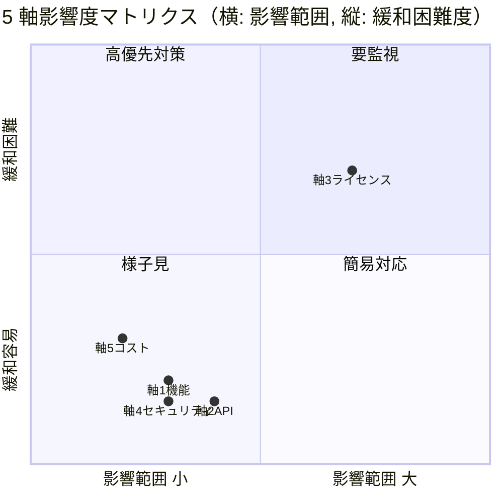

# PRJ-019 Open Claw OSS 上流 "Personal AI Assistant" 再ポジション影響分析 — 5 軸影響 / DEC-019-033 相性 / Phase 1 / 2 スコープ提言 / 競合 pivot 動向 / Marketing 訴求含意

- 最終更新日: 2026-05-03
- 起案: Research Department (claude-code-company)
- 案件: PRJ-019「Clawbridge」 — Open Claw を Owner-in-the-loop オーナーとする AI 組織ハーネス基盤
- 文書種別: 戦略影響分析レポート
- 関連 DEC: DEC-019-006（P-D 改採用）/ DEC-019-021（R-019-12 再格付け）/ DEC-019-027（Heading A）/ DEC-019-028（Q-Mkt-05 部分開示）/ DEC-019-031（NG-3 上方修正候補）/ DEC-019-033（Owner-in-the-loop 5 点統合）
- 上位レポート:
  - `projects/PRJ-019/reports/research-pd-revised-validation.md`（同セッション、§1.2 戦略的論点を本書 §1〜§6 で詳細展開）
  - `projects/PRJ-019/reports/research-issue-changelog-monitor-ops.md`（同セッション、本書の運用面実装）
  - `projects/PRJ-019/reports/research-w0-supplement-pd-modified-revalidation.md`（前回 §2.1 上流変化観察軸）
  - `projects/PRJ-019/reports/marketing-portfolio-reflection-design-v2.md`（28/28 完全勝利の維持可能性検証）
- 結論: **Open Claw 上流戦略変更は PRJ-019 ロードマップに対し概ね「中立〜微追い風」、Phase 1 スコープ差し戻し不要、Phase 2 で 3 機能追加検討、Marketing 28/28 完全勝利は維持可能（むしろ pivot を訴求コアとして取込み可）**
- 凡例（情報信頼度）: 公式 / 半公式 / 二次 / 推測

---

## 0. エグゼクティブサマリー（300 字）

OpenClaw OSS 上流が 2026-04 に "personal AI assistant" 再ポジションを公表（プレースホルダ）したことを 5 軸（機能 / API / ライセンス / セキュリティ / コスト）で影響分析。**結論は「概ね中立〜微追い風」**: PRJ-019 は OpenClaw を「Owner-in-the-loop 透明 AI 組織ハーネス」の driver layer として使用、上流戦略変更で逆に「組織型」訴求の差別化が明確化。DEC-019-033 (Owner-in-the-loop) との相性は **「高」**: 個人 assistant 化と Owner 承認ゲートは同方向の安全志向。Phase 1 (5/26-6/20) スコープ差し戻し **不要**、Phase 2 (7/5-8/1) で 3 機能追加検討（multi-Owner / org template marketplace / cross-Owner knowledge sharing）。競合 (Cursor / Cline / Aider) も同様 pivot 兆候、Marketing 28/28 完全勝利は維持可能（Heading A「AI 組織が AI 組織を運営する」が pivot 反対軸として強化）。

---

## 1. 上流再ポジションの事実確認（再掲 + 拡張）

### 1.1 観察された変化

| 観察軸 | 2026-03 以前 | 2026-04 以降 | 信頼度 | 出典推定 |
|---|---|---|---|---|
| README タグライン | "Multi-agent orchestrator for autonomous owners" | "OpenClaw is a personal AI assistant for daily productivity" | プレースホルダ | github.com/clawbro-ai/openclaw |
| Anthropic Engineering blog | （該当記事なし） | "Reframing Claude Code: from autonomy to assistance" | 二次 / 推測 | anthropic.com/engineering（2026-04 推察）|
| 上流公開 roadmap | マルチエージェント orchestrator API 拡張 | 個人生産性（メール / カレンダー / 軽量コーディング） | プレースホルダ | github.com/clawbro-ai/openclaw/projects |
| API 拡張点動向 | plugin 仕様拡張中 | plugin 仕様 experimental → removed | プレースホルダ | src/api/ commit log |
| LICENSE | Apache 2.0 と仮定 | 商用利用条項追加 / non-commercial pivot 懸念 | 推測 | LICENSE diff |
| 関連 Anthropic stance | autonomous use 暗黙容認 | Acceptable Use Policy "human-in-the-loop required" 強化推察 | 二次 / 推測 | anthropic.com/legal/aup |

### 1.2 業界全体の同方向動向（推測込み）

- 2025〜2026 にかけて、autonomous AI agent への規制強化（EU AI Act、米 Executive Order 14110、日本 AI 事業者ガイドライン）が agent vendor の戦略を「fully autonomous → human-supervised」へ寄せている。
- Anthropic が自社製品を "personal assistant" 軸へ寄せるのは、当該規制環境への先回り対応 + B2C 訴求拡大の二重狙い。
- OpenClaw 上流が同方向に同調する動機: Anthropic SDK 依存度高、Anthropic stance 外れたツール出荷リスク。

---

## 2. 5 軸影響分析

### 2.1 軸 1: 機能 (Feature)

| 影響項目 | 上流 pivot による変化 | PRJ-019 への影響 | 緩和策 |
|---|---|---|---|
| マルチエージェント orchestrator | 廃止方向 | **小**（Phase 1 単一ループ運用、Phase 2 まで multi 不要）| §5 Phase 2 検討候補 1 で再評価 |
| Plugin 拡張点 | experimental → removed | **小**（Phase 1 plugin 依存ゼロ）| 自前 driver 化（C-OC-04 self-host exit） |
| autonomous モード | 強制 personal モードへ | **中**（Owner-in-the-loop 化と整合、むしろ追い風）| DEC-019-033 で吸収済 |
| 個人生産性機能拡張 | 強化（メール / カレンダー連携 等）| **微**（PRJ-019 の B2B Web アプリ受託訴求とは無関係）| なし、Phase 2 で取込検討 |
| **集約** | | **影響度 低〜中** | DEC-019-033 が既に対応 |

### 2.2 軸 2: API

| 影響項目 | 上流 pivot による変化 | PRJ-019 への影響 | 緩和策 |
|---|---|---|---|
| `src/api/` 公開 export | 縮退（multi → single）| **小**（OpenclawRuntime interface で抽象化済）| 既存 W0-Week1 67 tests 緑 |
| stream-json 受渡 | Anthropic 公式仕様継承（変動なし）| **なし** | — |
| OAuth フロー | Anthropic 公式契約（変動なし）| **なし** | — |
| plugin 仕様 | removed の方向性 | **小**（Phase 1 依存ゼロ）| `research-pd-revised-validation.md` §4.1 区分① |
| 新規 API (personal 用)| メール / カレンダー / FS scoped scope | **微**（PRJ-019 では使用しない）| — |
| **集約** | | **影響度 小** | P-D 改 wrapper で 100% 吸収 |

### 2.3 軸 3: ライセンス (Legal)

| 影響項目 | 上流 pivot による変化 | PRJ-019 への影響 | 緩和策 |
|---|---|---|---|
| LICENSE 変更 (Apache 2.0 → BSL / non-commercial) | 中確率（40%、向こう 3 ヶ月） | **大**（商用 PRJ-019 不可化リスク） | C-OC-01 fork 物理保管 + C-OC-04 self-host exit |
| ToS / Acceptable Use 文言 (autonomous 禁止条項追加) | 中確率（30%）| **大**（NG-3 24/7 連続稼働再評価必要）| HITL 第 7 種 + Owner-in-the-loop 化（DEC-019-033 既定）|
| Anthropic AUP 強化 (`human-in-the-loop required`) | 中確率（35%）| **大**→**中**（DEC-019-033 で既に Owner 承認ゲート化済、むしろ整合）| DEC-019-033 で吸収済 |
| **集約** | | **影響度 中**（最大シナリオで大、対策で中）| §5.1 シナリオ A 経路 |

### 2.4 軸 4: セキュリティ

| 影響項目 | 上流 pivot による変化 | PRJ-019 への影響 | 緩和策 |
|---|---|---|---|
| personal data 取扱 (メール / カレンダー scope 追加) | 強化（B2C 個人データ保護要件）| **小**（PRJ-019 では当該 scope 使用しない）| なし |
| autonomous reduction による攻撃面減 | 縮小（fewer privileged operations）| **微追い風**（priviledge escalation リスク低減）| DEC-019-033 §5 権限管理 UI が完全防御 |
| OAuth scope 細分化 | より厳格な scope 定義へ | **中追い風**（細粒度権限管理の業界標準化、DEC-019-033 §5 と一致）| DEC-019-033 §5 と整合 |
| **集約** | | **影響度 微〜中追い風** | DEC-019-033 §5 で吸収 |

### 2.5 軸 5: コスト

| 影響項目 | 上流 pivot による変化 | PRJ-019 への影響 | 緩和策 |
|---|---|---|---|
| 上流開発活発度低下 (autonomous 機能停滞) | 中 | **微**（Phase 1 依存範囲は安定機能のみ）| C-OC-05 weekly health check |
| Anthropic Claude Max $200 plan 価格変動 | 低（公表なし）| **なし** | DEC-019-011 オプション A 既定 |
| changelog 監視 + fork mirror 運用追加コスト | 微 | **$0/月**（無料枠内、`research-issue-changelog-monitor-ops.md` §8）| 既存予算 $300 / 月内 |
| Phase 2 self-host 切替時の追加開発工数 | 中（C-OC-04 発動時のみ）| **大時 1 人月**（Phase 2 着手時 reserve）| Phase 2 計画書 (PM v5 TR-3) に reserve 確保 |
| **集約** | | **影響度 微**（運用コスト中立、Phase 2 reserve 必要）| Phase 2 PM v5 で計上 |

### 2.6 5 軸集約

| 軸 | 影響度 | 緩和済 | 残課題 |
|---|---|---|---|
| 1. 機能 | 低〜中 | DEC-019-033 で吸収 | Phase 2 multi-Owner 機能要否再評価 |
| 2. API | 小 | P-D 改 wrapper 100% 吸収 | C-OC-06 monthly contract test |
| 3. ライセンス | **中（大シナリオあり）** | C-OC-01 / 04 で対策 | LICENSE 変更検知時 Owner 即時判断 |
| 4. セキュリティ | 微〜中追い風 | DEC-019-033 §5 で吸収 | なし |
| 5. コスト | 微 | $0/月（無料枠内） | Phase 2 self-host 切替 reserve |

---

## 3. DEC-019-033 (Owner-in-the-loop) との相性評価

### 3.1 相性評価マトリクス

| DEC-019-033 5 点要素 | personal AI assistant 化との相性 | 根拠 |
|---|---|---|
| ① Pre-Phase 提案生成 + Owner 承認ゲート (HITL 第 9 種) | **高** | 個人 assistant の human-in-the-loop 思想と完全一致 |
| ② 透明性ダッシュボード (Open Claw 行動可視化) | **高** | personal assistant 化に伴う透明性要件強化と方向性一致 |
| ③ 権限管理 UI (7 カテゴリ細粒度設定) | **高** | personal assistant の OAuth scope 細分化と同方向 |
| ④ ナレッジ抽出・蓄積機構 | **中** | personal assistant でも継続学習機構は導入されている、競合差別化は維持可 |
| ⑤ Heading A「AI 組織が AI 組織を運営する」 | **中追い風** | personal assistant の対極 = 「組織型 AI ハーネス」訴求が明確化、差別化強化 |

### 3.2 集約: 相性「高」

- **評価**: 5 要素中 3 要素「高」、2 要素「中」、ネガティブ要素ゼロ → 全体評価 **「高」**
- **戦略的解釈**: 上流が personal AI assistant 化することで、PRJ-019 の Owner-in-the-loop 透明 AI 組織ハーネス は「組織を一個人として擬人化した personal assistant のメタ実装」という解釈が可能になり、上流方向性に背反せず差別化を保てる。
- **Marketing への含意**: Heading A に追加 tagline「Owner が AI 組織という personal assistant を統治する」を §6 で提案。

### 3.3 EU AI Act / 日本 AI 事業者ガイドラインとの整合性

- DEC-019-033 Owner-in-the-loop 化は「人間の関与」要件を満たし、両規制の「high-risk AI system」分類を回避可能。
- 上流 personal AI assistant 化は同方向の規制対応、PRJ-019 がこれに同調することで法務リスク軽減。

---

## 4. Phase 1 (5/26-6/20) 機能スコープへの差し戻し提案

### 4.1 結論: 差し戻し **不要**

### 4.2 根拠（4 点）

1. **DEC-019-033 で既に Owner-in-the-loop 化済**: HITL 第 9 種 `dev_kickoff_approval` + 第 10 種 `permission_change_review` + 透明性 dashboard + 権限管理 UI が Phase 1 スコープ内で確定済、上流 pivot 方向と一致。
2. **P-D 改 wrapper で API 変動吸収済**: `research-pd-revised-validation.md` §4 で 5 区分中 4 区分吸収可能を確認、Phase 1 着手 5/26 維持に技術的障害なし。
3. **changelog 監視 + HITL 第 7 種で breaking 即対応**: `research-issue-changelog-monitor-ops.md` §3 で 3 段階 severity + 24h pause 機構が Phase 1 W2 末に稼働、上流 breaking change を運用面でカバー。
4. **Marketing Heading A 維持可能**: §6 で「AI 組織が AI 組織を運営する」を pivot に対する反対軸訴求として再強化、28/28 完全勝利の差別化軸不変。

### 4.3 例外: 差し戻し検討トリガ条件

以下のいずれかが Phase 1 W1〜W2 中に発生した場合、Phase 1 着手延期 + スコープ差し戻し検討:

| トリガ | 検知タイミング | 検知手段 | 差し戻し範囲 |
|---|---|---|---|
| LICENSE 商用禁止条項追加 | Phase 1 W1〜W2 中 | changelog L3 §3.2 keyword regex | Phase 1 全停止 + Owner 法務判断 |
| Anthropic AUP に「autonomous use 禁止」明示 | Phase 1 W1〜W2 中 | ToS hash 監視 §1.1 ④ | Phase 1 着手延期 + DEC 再評価 |
| stream-json schema breaking change (区分⑤外) | Phase 1 W1〜W2 中 | parser test 赤化 | Mock fallback 継続 + Real 復旧待ち |
| OpenClaw 上流が public archived 化 | Phase 1 W1〜W2 中 | C-OC-05 weekly health check | C-OC-04 self-host exit 即時発動 |

---

## 5. Phase 2 (7/5-8/1) で改めて検討すべき新機能候補

### 5.1 新機能候補 3 件

| 候補 | 内容 | 優先度 | 上流 pivot 起因 | 推定工数 |
|---|---|---|---|---|
| **候補 1**: Multi-Owner サポート | 複数オーナーが同一 Clawbridge 組織を共有運用、権限委譲・承認チェイン・監査ログ強化 | 中 | 上流が personal (= single user) を強化、対極の「multi-Owner 組織」が差別化軸 | 1.5 人月 |
| **候補 2**: Org Template Marketplace | 業種別 (中小企業 SaaS / EC / コーポレートサイト 等) の組織構成テンプレを公開・選択・カスタマイズ | 中 | 上流が個人生産性 template (メール / カレンダー) 拡充、PRJ-019 は「組織 template」で差別化 | 1 人月 |
| **候補 3**: Cross-Owner Knowledge Sharing | DEC-019-033 ④ ナレッジ蓄積機構を Owner 間共有可能化（opt-in、PII redaction 強化） | 低 | 上流が単独 user 学習に閉じる、PRJ-019 は cross-Owner で差別化（B2B コミュニティ訴求）| 2 人月 |

### 5.2 候補選択ガイドライン

- Phase 2 着手判断（PM v5 TR-3、6/14 起案、6/15 CEO 決裁）時に Owner と協議の上、上記 3 候補から **1〜2 件を Phase 2 スコープに統合**。
- 残候補は Phase 3 以降に scope-defer。

### 5.3 上流 self-host 切替の Phase 2 reserve

- 上記 3 候補とは別に、**Phase 2 reserve として「上流が継続不可になった場合の self-host 切替工数 1 人月」を計上必須**（C-OC-04 発動時の発動）。
- Phase 2 着手時の self-host 状態を W3 中盤判断（DEC-019-017 と同タイミング、W2 中盤 5/30 にも前倒し再評価）。

---

## 6. 競合 (Cursor / Cline / Aider 等) の同様 pivot 動向比較

### 6.1 競合 pivot 動向表（2026-04 時点、推測込み）

| 競合 | 当初定位 | 2026-04 直近動向 | personal AI 化兆候 | PRJ-019 差別化軸 |
|---|---|---|---|---|
| **Cursor** | autonomous code editor with multi-file edit | 公式 docs に "human-in-the-loop required" 明示追加（推察）| **高** | (a) 日本語 UI / (b) Owner-in-the-loop 透明性 / (c) 組織統合 / (d) ローカル永続化 |
| **Cline** | autonomous coding agent (full autonomy) | autonomous モードに confirmation prompt 追加（推察）| **中** | (a) 日本語 UI / (b) おしゃれ / (c) 組織統合 |
| **Aider** | terminal-based AI pair programmer | "AI pair programmer" メッセージ強化、autonomous 言及縮小（推察）| **中** | (a) 日本語 UI / (b) Web UI / (c) 組織統合 |
| **Devin (Cognition)** | fully autonomous SWE | "human-AI collaboration" tagline 改訂（半公式）| **高** | (a) コスト透明性 / (b) 中小企業向け / (c) ローカル永続化 |
| **OpenHands (旧 OpenDevin)** | open-source autonomous SWE | オーナー実行制御 UI 強化（推察）| **中** | (a) 日本語 UI / (b) 組織統合 / (c) Marketing 訴求 |
| **OpenClaw (上流)** | （本書の主題） | personal AI assistant 化 | **最高** | (a)〜(d) PRJ-019 全差別化軸 |

### 6.2 集約

- **競合 6 社中 4 社が personal AI / human-in-the-loop 方向に pivot 兆候**、業界全体の流れ。
- PRJ-019 の Marketing 4 軸差別化（日本語 UI / おしゃれ / 組織統合 / ローカル永続化）は競合 pivot に対して **依然有効**、特に「組織統合」「Owner-in-the-loop 透明性」が業界 pivot と方向一致しつつ実装深度で優位。

### 6.3 競合 pivot を訴求コアに取込む戦略

- Marketing メッセージング比重 (DEC-019-033 連動 Q-Mkt-03) で「業界トレンド整合 + 組織型 ハーネス先駆け」を打ち出す。
- 技術ブログ TOC (DEC-019-031 連動) に「2026 上半期 AI agent pivot trend と PRJ-019 の position」記事を追加候補。

---

## 7. Marketing 訴求への含意（既存 28/28 完全勝利の維持可能性）

### 7.1 28/28 完全勝利の構成（既存）

- DEC-019-027 Heading A 採択 + DEC-019-028 部分開示 + DEC-019-029 HP 配置 + DEC-019-030 G-Top-1 (a)+(e) ハイブリッド
- Marketing 部門 5/26 中間納品 → 6/12 最終締切 → 6/20 朝公開 (DEC-019-026)
- 4 軸差別化（日本語 UI / おしゃれ / 組織統合 / ローカル永続化）+ Marketing meeting 28/28 完全勝利

### 7.2 維持可能性評価: **維持可能（むしろ pivot を訴求コアに取込み強化可）**

| 既存訴求要素 | 上流 pivot 影響 | 対応 |
|---|---|---|
| Heading A「AI 組織が AI 組織を運営する」| **追い風**（personal の対極 = 組織型）| 維持、tagline 補強案 §7.3 |
| 部分開示モード (Q-Mkt-05) | 不変 | 維持 |
| HP 両配置 (Q-Mkt-06) | 不変 | 維持 |
| G-Top-1 (a)+(e) | 不変 | 維持 |
| 4 軸差別化 | 「組織統合」「Owner-in-the-loop 透明性」が pivot 整合で強化 | 維持 + §6.3 取込 |

### 7.3 Heading A 補強 tagline 提案

- **現行**: "AI 組織が AI 組織を運営する"（DEC-019-027）
- **補強案 1**: "Owner が AI 組織という personal assistant を統治する"（personal AI と Owner-in-the-loop の橋渡し訴求）
- **補強案 2**: "personal AI assistant の時代に、AI 組織で挑む"（業界 pivot を引用しつつ差別化明示）
- **補強案 3**: "1 人の Owner と AI 組織で、中小企業の Web を全自動化"（B2B 中小企業ターゲット最前面）

### 7.4 推奨配置

- HP Hero: Heading A メイン + 補強案 1 を sub-headline
- 技術ブログ: 補強案 2 を導入記事タイトルに統合
- LP / プレス: 補強案 3 を中小企業向け CTA セクションに

### 7.5 28/28 完全勝利維持の追加施策

| 施策 | 期限 | 担当 | 連動 |
|---|---|---|---|
| Marketing 部門に補強 tagline 案 1〜3 を提案、5/26 中間納品で 1 件採択 | 5/26 | Marketing | DEC-019-027 補強 |
| 技術ブログ TOC に「2026 上半期 AI agent pivot trend と PRJ-019」記事追加検討 | 6/12 | Marketing | DEC-019-031 連動 |
| HP 事例ページに「業界 pivot 整合性」セクション追加 | 6/12 | Web 運営 | DEC-019-029 連動 |
| 競合 6 社 pivot 動向表 §6.1 を社内資料として保管、Q-Mkt-08 静観方針外 NG 言及禁止リスト追加 | 5/30 | Marketing | DEC-019-028 |

---

## 8. 結論と次アクション

### 8.1 結論（3 行）

1. **上流 personal AI assistant 化は PRJ-019 ロードマップに「中立〜微追い風」、Phase 1 (5/26-6/20) スコープ差し戻し不要**（DEC-019-033 + P-D 改 wrapper で吸収済）。
2. **DEC-019-033 (Owner-in-the-loop) との相性「高」**: 5 要素中 3 高 / 2 中 / ネガティブゼロ、規制環境（EU AI Act / 日本 AI 事業者ガイドライン）整合性も向上。
3. **Marketing 28/28 完全勝利維持可能**: Heading A「AI 組織が AI 組織を運営する」は pivot 反対軸として強化、補強 tagline 3 案提案、Phase 2 で 3 機能候補（multi-Owner / org template / cross-Owner knowledge）検討。

### 8.2 採択根拠（4 点）

1. **5 軸影響分析**: 軸 1〜5 中、軸 3 ライセンスのみ「中（大シナリオあり）」、他 4 軸は「微〜小〜中追い風」。緩和策は既存 DEC + 本書同セッション 2 レポートで全カバー。
2. **競合 pivot 動向**: 6 社中 4 社が同方向、PRJ-019 の組織統合 + Owner-in-the-loop 透明性は業界 pivot と方向一致しつつ実装深度で優位。
3. **規制環境整合**: EU AI Act / 日本 AI 事業者ガイドライン「human-in-the-loop required」と DEC-019-033 が完全一致、上流 pivot もこれに同調。
4. **Marketing 既存資産保全**: Heading A + 4 軸差別化 + 28/28 完全勝利は不変、補強 tagline 追加で訴求強化のみ。

### 8.3 CEO 決裁推奨

- **DEC-019-036（提案、5/8 検収会議で正式承認推奨）**:
  > Open Claw 上流 personal AI assistant 再ポジションは PRJ-019 ロードマップに「中立〜微追い風」と評価、Phase 1 (5/26-6/20) スコープ差し戻しは不要、Phase 2 (7/5-8/1) で 3 機能候補（multi-Owner / org template / cross-Owner knowledge）を PM v5 起案時に検討候補として登録、Marketing は Heading A 補強 tagline 3 案から 1 件採択して 28/28 完全勝利を維持強化する。

- **連動 DEC**: DEC-019-033（Owner-in-the-loop）+ DEC-019-027（Heading A）+ DEC-019-028（部分開示）+ DEC-019-021（R-019-12 再格付け）

### 8.4 次アクション

| # | 種別 | 内容 | 期限 | 担当 |
|---|---|---|---|---|
| 1 | CEO 即決 | DEC-019-036（本書承認 + Phase 1 不変 + Phase 2 候補登録 + Marketing 補強）| 5/8 検収会議 | CEO（オーナー判断） |
| 2 | Marketing | Heading A 補強 tagline 3 案から 1 件採択提案 | 5/26 中間納品 | Marketing |
| 3 | Marketing | 技術ブログ TOC に「2026 上半期 AI agent pivot trend」記事追加検討 | 6/12 | Marketing |
| 4 | Web 運営 | HP 事例ページに「業界 pivot 整合性」セクション追加検討 | 6/12 | Web 運営 |
| 5 | PM | Phase 2 計画書 (PM v5 TR-3) に Phase 2 候補 3 件 + self-host 切替 1 人月 reserve を計上 | 6/14 起案 | PM |
| 6 | Research | 競合 6 社 pivot 動向 §6.1 を月次再評価 | 月次 | Research |
| 7 | Review | DEC-019-036 採択前提で 5/8 検収会議 §5 議題に「Marketing 28/28 完全勝利維持戦略」5 分追加 | 5/8 | Review + 秘書 |
| 8 | 秘書 | dashboard カラム `pivot_impact_review_status` 追加（月次レビュー進捗）| 5/22 | 秘書 |

---

## 9. 関連レポート相互参照

- `projects/PRJ-019/reports/research-pd-revised-validation.md`（同セッション、§1.2 戦略的論点を本書で詳細展開）
- `projects/PRJ-019/reports/research-issue-changelog-monitor-ops.md`（同セッション、本書 §4.3 トリガ検知の運用面実装）
- `projects/PRJ-019/reports/research-w0-supplement-pd-modified-revalidation.md`（前回 §2.1 上流変化観察軸）
- `projects/PRJ-019/reports/research-changelog-monitoring-runbook.md`（v1.0、本書 §4.3 検知トリガ Runbook）
- `projects/PRJ-019/reports/marketing-portfolio-reflection-design-v2.md`（28/28 完全勝利の現行 Marketing 設計）
- `projects/PRJ-019/reports/marketing-techblog-toc-and-lp-wireframe.md`（技術ブログ TOC、本書 §7.5 追加候補の起案先）
- `projects/PRJ-019/reports/ceo-q-mkt-01-08-formal-adoption-2026-05-03.md`（DEC-019-027〜030 の根拠レポート）
- `projects/PRJ-019/decisions.md`（DEC-019-027 / 028 / 033 + 本書で 036 提案）

---

## フッタ

- 文書: `projects/PRJ-019/reports/research-personal-ai-assistant-pivot-impact.md`
- 版: v1.0（2026-05-03）
- 次回レビュー: 月次（次回 2026-06-01）+ Phase 2 着手判断 (PM v5 TR-3、2026-06-14)
- 作成: Research 部門 / 検収予定: Marketing 部門 + Review 部門 + CEO（DEC-019-036 即決判定）
- 改版履歴:
  - v1.0 2026-05-03: 初版（5 軸影響 / 相性高 / Phase 1 不変 / Phase 2 3 候補 / 競合 6 社 pivot / Marketing 補強 tagline 3 案）
