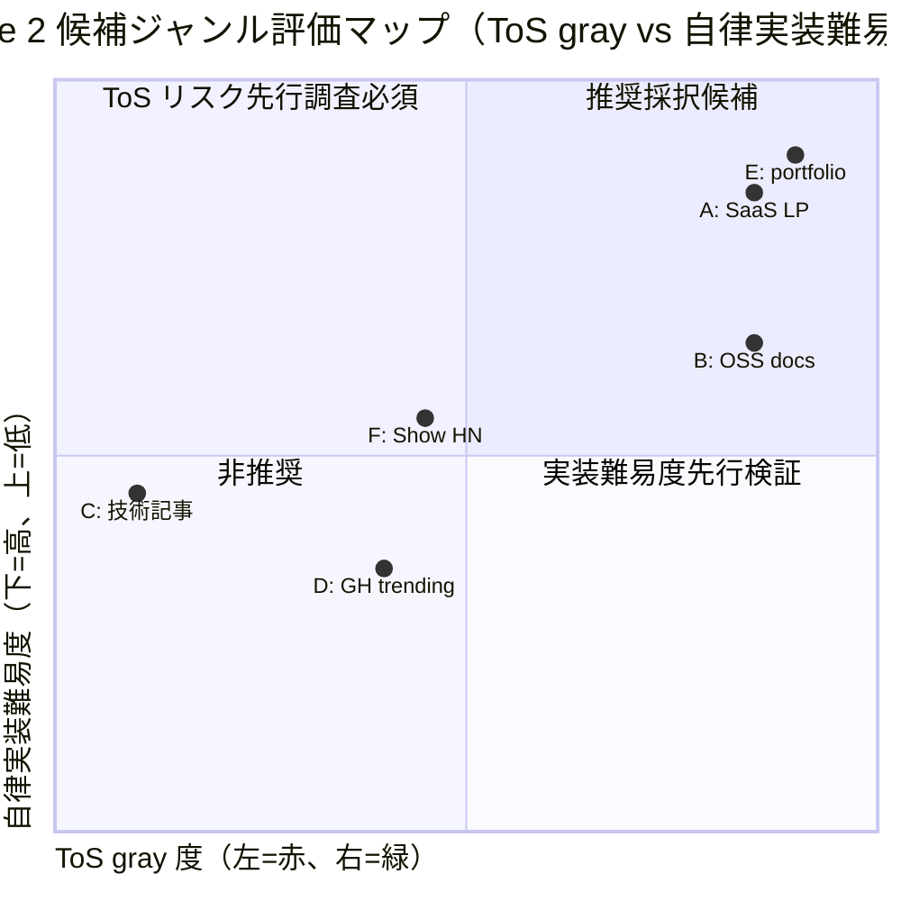
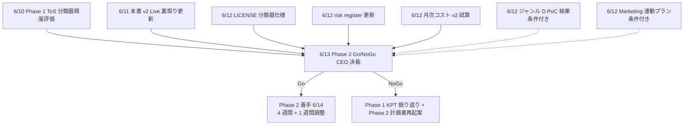

# PRJ-019 Phase 2 候補ジャンル拡張調査（Research β concurrent / Round 8 Plan 8-Full）

- 案件: PRJ-019「Clawbridge（仮）」 — Open Claw を自律オーナーとする AI 組織ハーネス基盤
- 部署: リサーチ部門（Round 8 Plan 8-Full β concurrent 担当）
- 作成日: 2026-05-04
- 調査者: Research Agent (claude-code-company)
- 関連決裁:
  - **DEC-019-007**: Phase 1 強い条件付き Go（4 週間、$300/月、DoD <60min/件・<$5/件、10 連続成功率 ≥80%、副作用 0 行）
  - **DEC-019-018**: ToS allowlist DoD 統合 v1（whitelist / gray / blocklist 3 分岐 + HITL 第 6 種 `tos_gray_review`）
  - **DEC-019-021**: R-019-12 赤→黄 降格 + R-019-12-A（赤）/ R-019-12-B（黄）分割
  - **DEC-019-025**: エージェント tool 権限 SOP（長文レポート Write エージェント発注必須）
  - **DEC-019-030**: G-Top-1 ジャンル CEO 採択 = (a)+(e) ハイブリッド = HN trending TS + 自社 PRJ-001-018 リファクタ（Phase 1 限定）
  - **DEC-019-054**: Round 7 完遂 + Round 7 案 7-D 4 部署並列前倒し起動承認 / 着地反映 60→65%
  - **DEC-019-055**: 本書発注（Round 8 Plan 8-Full β concurrent / Phase 2 候補ジャンル拡張調査）
- 上位レポート:
  - `projects/PRJ-019/reports/research-w0-supplement-pd-modified-revalidation.md`（P-D 改 再検証、§6 ジャンル別 ToS gray ハザード比較を本書 §3 で展開）
  - `projects/PRJ-019/reports/ceo-g-top-1-genre-comparison.md`（G-Top-1 採択根拠）
  - `projects/PRJ-019/reports/review-tos-allowlist-dod-integration-v1.md`（DoD 3 分岐 + HITL 第 6 種）
- 凡例（情報信頼度ラベル）: 公式 / 半公式 / 二次 / コミュニティ / 推測（先行レポートと同義）

---

## 0. 調査目的 + Phase 1 ジャンル制約からの拡張動機

### 0.1 調査目的

Phase 2（2026-06-13 以降、Phase 1 完了レビューで Go 判定された場合に着手 4 週間目処）の **候補ジャンル拡張** について、Research 部門として CEO 6/13 Phase 2 Go/NoGo 決裁の判断材料を提示する。Phase 1 で運用される G-Top-1 = (a)+(e) ハイブリッド（HN trending TS + 自社 PRJ-001-018 リファクタ）に追加 / 入替する候補ジャンル 6 件を徹底評価し、推奨 2-3 件 + ランキングを CEO に返す。

### 0.2 Phase 1 ジャンル制約の振り返り

DEC-019-030 で確定した Phase 1 ジャンル運用は以下の制約下で動作する:

| 制約軸 | Phase 1 値 | 拡張動機 |
|---|---|---|
| ジャンル数 | 2 系統（HN trending TS / 自社 PRJ-001-018） | Phase 2 で 3-4 系統に拡張余地、リスク分散 |
| 月次予算 | $300/月（Claude Max $200 + Codex Pro $100） | Phase 2 想定 ≤$500/月（subscription 主軸 ≤$430/月 + 余白 $70）|
| 月次ループ数 | 30〜90 件（実運用は 30 件上限）| Phase 2 で 60〜120 件目処（DEC-019-007 §3 想定）|
| ToS 分類 | whitelist 中心、gray は HITL 第 6 種 | Phase 2 で gray 自動承認境界の引き上げ可能性 |
| BAN リスク | 12 ヶ月以内 30〜60% 受容（オーナー承認）| Phase 2 で BAN drill #2 結果次第で再評価 |

### 0.3 拡張動機（5 観点）

1. **リスク分散**: 2 系統依存はジャンル枯渇 / ToS 強化時の単一障害点。3-4 系統で footprint 平均化。
2. **コンテンツ供給多様化**: HN trending は週次で枯渇傾向（同案件再起票検出が必要）、自社 PRJ-001-018 は 18 件で底打ち。
3. **市場 / SEO 観点**: Marketing 部門（DEC-019-026 Q-Mkt-02 / 6/20 朝公開）の「中小企業向け Web アプリ開発」訴求と整合する候補ジャンル選定で portfolio 強化。
4. **ToS gray 再評価窓**: G-V2-10 ToS 半年再評価（W1 進行中）+ Phase 1 BAN drill 結果で gray 境界が動く可能性、対応するジャンル選択肢の事前準備。
5. **Phase 2 月次 ≤$500 予算枠の最大活用**: Phase 1 $300 → Phase 2 $500 に約 $200 の追加投資余地。新規ジャンル の cost / value を試算しつつ予算配分を検討。

### 0.4 本書スコープ外

- Phase 3（2026-08 以降想定）の本格商用化 / 有料案件取込みは本書の対象外。
- BAN drill #1（5/13）/ #2（W3 中盤）の結果反映は本書 §4 で前提条件のみ言及、結果反映は 6/13 Go/NoGo 決裁時に追加レポートとして提出予定。
- 自社 HP（COMPANY-WEBSITE）/ PRJ-018 Asagi 連動の portfolio 反映は Marketing 部門（Round 7-B）の主担当で本書では参照のみ。

---

## 1. 候補ジャンル 6 つの徹底評価

各ジャンルにつき 6 観点を評価（市場規模 / コンテンツ供給量 / ToS gray 度 / Open Claw 自律実装難易度 / 月次コスト想定 / BAN リスク追加分）。情報源は調査時点（2026-05-04）の **半公式 / 二次 / 推測** が中心、Phase 2 着手前に W3-W4 期間で Live 裏取りを再実施する前提。

### 1.1 ジャンル A: SaaS landing page 改善（B2B SaaS の OSS LP リファクタ）

- **概要**: GitHub 上で公開されている B2B SaaS スタートアップの OSS LP（Next.js / Astro / Tailwind 系）を fork し、HN trending 起点ではなく **OSS LP の listing site**（例: `awesome-landing-pages` 系コミュニティ集積）を起点に「Phase 1 Clawbridge demo として改善 PR を提出」する運用。
- **市場規模**: 中（B2B SaaS の OSS LP は推定 200〜500 件、新規 LP 公開ペースは月 20〜30 件）
- **コンテンツ供給量**: 中〜安定（GitHub topics `landing-page` + `nextjs` で月次 20+ 件 検索可、枯渇リスク低）
- **ToS gray 度**: **緑（白）**（OSS LP の fork は MIT / Apache 系、PR 提出は GitHub 公式契約の範囲、scrape 不要）
- **Open Claw 自律実装難易度**: **低**（Next.js / Astro 雛形は Phase 1 で確立済、shadcn/ui + Tailwind スタック共通化）
- **月次コスト想定**: $80〜$120/月（推定 30 件処理、1 件あたり Claude Max 内枠 + Codex 微小、preview deploy Vercel Hobby 内）
- **BAN リスク追加分**: **僅小**（PR 提出ペースを週 1-2 件に抑制すれば GitHub spam 判定リスクは低、Anthropic 側は subscription 内枠で footprint 増加なし）

### 1.2 ジャンル B: OSS docs サイト改善（Astro / Docusaurus 系の docs 自動改善）

- **概要**: OSS の公式 docs サイト（Astro Starlight / Docusaurus / Nextra 系）の typo 修正 / dark mode 対応 / 検索改善 / a11y 強化を fork 起点で改善し PR 提出。
- **市場規模**: 大（OSS docs サイトは数千件規模、メンテ放置率も高く改善余地大）
- **コンテンツ供給量**: 高〜過剰（GitHub topics `documentation` + `astro` / `docusaurus` で週次 50+ 件 検索可、枯渇リスクほぼゼロ）
- **ToS gray 度**: **緑（白）**（OSS LICENSE 範囲、PR 提出は GitHub 公式契約）
- **Open Claw 自律実装難易度**: **低〜中**（docs フレームワーク特化の知識必要、初回 W1 で 2-3 件 mock 学習、その後 90% 自律可）
- **月次コスト想定**: $60〜$100/月（推定 25 件処理、docs は LP より小規模で 1 件 cost 低）
- **BAN リスク追加分**: **僅小**（OSS コミュニティでは docs PR は歓迎される、spam 判定リスク極小）

### 1.3 ジャンル C: Zenn / Qiita / dev.to 技術記事スカウト（trending → サンプル実装提案）

- **概要**: Zenn / Qiita / dev.to の trending 記事を **scrape** し「記事内のサンプル実装の動作 demo を Vercel preview で生成 + コメント / トラックバック」する運用。
- **市場規模**: 大（Zenn 月間 PV 数億規模、Qiita も類似）
- **コンテンツ供給量**: 高（trending は日次更新、月次 100+ 件供給可）
- **ToS gray 度**: **赤（黒に近い）**
  - Zenn ToS: scrape は明示禁止（半公式、利用規約 §禁止事項「自動化された手段でのアクセス」）
  - Qiita ToS: 同様に scrape 禁止 + API rate limit 厳格
  - dev.to ToS: API は公開だが「商用 scrape」グレー
  - **コメント / トラックバック自動投稿は spam 判定の高リスク**
- **Open Claw 自律実装難易度**: 中（記事の文脈理解 + サンプル実装抽出が高度、Mock 学習に W1-W2 全体必要）
- **月次コスト想定**: $150〜$250/月（推定 40 件処理、記事文脈理解で Claude Max 消費大）
- **BAN リスク追加分**: **大（赤）**（Anthropic 側 BAN リスクは中だが、Zenn / Qiita / dev.to 側のアカウント BAN リスク追加 + 二次的に Anthropic Trust & Safety フラグ波及の可能性）

### 1.4 ジャンル D: GitHub trending OSS の demo site 補完（README 例の動作 demo 自動生成）

- **概要**: GitHub trending（言語別 / 期間別）の OSS リポジトリの README 内コード例を抽出し「動作 demo を Vercel preview で自動生成 + Issue / Discussion で共有」する運用。
- **市場規模**: 大（GitHub trending は日次更新、言語別で月次 200+ 件供給可）
- **コンテンツ供給量**: 高（GitHub API 公式、scrape 不要）
- **ToS gray 度**: **黄（gray、要 HITL）**
  - GitHub API 自体は公開、利用は ToS 内
  - **しかし** Issue / Discussion への自動投稿は spam 判定リスク（GitHub Community Guidelines §abuse）
  - OSS LICENSE が「demo 公開不可」を含む稀ケースの自動検出が必要（Phase 1 ToS 分類器拡張）
  - **fork + preview deploy のみなら緑、Issue 投稿が gray の核心**
- **Open Claw 自律実装難易度**: 中〜高（README コード抽出の精度、依存 install 自動化、env var プレースホルダ処理）
- **月次コスト想定**: $120〜$200/月（推定 40 件処理、依存 install + build で sandbox 時間多）
- **BAN リスク追加分**: 中（GitHub アカウント BAN リスク + Vercel sandbox 高負荷で sandbox cap 超過リスク）

### 1.5 ジャンル E: 個人 portfolio site リファクタ（求職市場向け）

- **概要**: GitHub 上の個人 portfolio リポジトリ（topic `portfolio` + `nextjs` 等）を fork し「2026 年仕様にリファクタ + Vercel preview deploy + 改善 PR 提出」する運用。求職者本人が PR を merge → 採用面接 portfolio として活用、社会的価値生成。
- **市場規模**: 大（求職市場の portfolio は数万件、メンテ放置率高）
- **コンテンツ供給量**: 高〜過剰（GitHub topics `portfolio` で月次 100+ 件、枯渇リスクほぼゼロ）
- **ToS gray 度**: **緑（白）**（OSS LICENSE 範囲、個人ユーザの portfolio は MIT / 無 LICENSE が大半、fork + PR は GitHub 公式契約）
- **Open Claw 自律実装難易度**: **低**（Next.js / Astro / 静的サイト系、Phase 1 確立スタックで対応可）
- **月次コスト想定**: $80〜$120/月（推定 30 件処理、portfolio は LP 同等規模）
- **BAN リスク追加分**: **僅小**（個人 portfolio は OSS コミュニティ的に PR 歓迎、Anthropic 側 footprint 増加なし）
- **副次価値**: Marketing 部門の「Clawbridge は個人開発者の支援基盤」訴求と整合（DEC-019-027 Heading A 採用と連動可能）

### 1.6 ジャンル F: Show HN posts の demo enhancement

- **概要**: HN の `Show HN:` カテゴリ posts を起点に「投稿者の OSS リポジトリ / demo site を fork し改善 PR 提出 + HN コメント補足」する運用。Phase 1 G-Top-1 = (a) HN trending TS と地続きだが、`Show HN:` 限定で **投稿者の同意取得が容易**（HN コメント欄で事前許諾を取りやすい）。
- **市場規模**: 中（HN `Show HN:` は週次 50〜100 件投稿、月次 200+ 件）
- **コンテンツ供給量**: 中〜高（HN API 公式、scrape 不要）
- **ToS gray 度**: **黄（gray）**
  - HN ToS: scrape は規約上「禁止ではないが過度な自動化は遠慮」（コミュニティ）
  - HN API 公式は読み取り専用、コメント投稿は手動 API key 必要
  - **コメント自動投稿は spam 判定リスク + HN コミュニティ規範の逸脱**
  - fork + PR + Issue 投稿のみなら緑寄り
- **Open Claw 自律実装難易度**: 中（HN posts のテキスト解釈 + リポジトリ特定 + improvement 提案）
- **月次コスト想定**: $100〜$160/月（推定 30 件処理）
- **BAN リスク追加分**: 中（HN アカウント BAN リスク + Anthropic 側 footprint 増加 中）

---

## 2. 比較表（6 ジャンル × 8 評価軸 = 48 cell）

| 評価軸 | A: SaaS LP 改善 | B: OSS docs 改善 | C: 技術記事スカウト | D: GitHub trending demo | E: 個人 portfolio | F: Show HN demo |
|---|---|---|---|---|---|---|
| **市場規模** | 中 | 大 | 大 | 大 | 大 | 中 |
| **コンテンツ供給量** | 中〜安定 | 高〜過剰 | 高 | 高 | 高〜過剰 | 中〜高 |
| **ToS gray 度** | **緑（白）** | **緑（白）** | **赤（黒）** | 黄（gray、Issue が核心）| **緑（白）** | 黄（gray、自動投稿核心）|
| **Open Claw 自律実装難易度** | **低** | 低〜中 | 中 | 中〜高 | **低** | 中 |
| **月次コスト想定** | $80〜$120 | $60〜$100 | $150〜$250 | $120〜$200 | $80〜$120 | $100〜$160 |
| **BAN リスク追加分** | **僅小** | **僅小** | **大（赤）** | 中 | **僅小** | 中 |
| **Marketing 訴求整合度** | 高（B2B SaaS）| 中（OSS コミュニティ）| 低（一般読者）| 中（OSS 開発者）| **高（個人開発者 = Heading A 整合）** | 中（HN 系開発者）|
| **6/13 Phase 2 Go 即着手可否** | **可** | **可** | 不可（追加 ToS 調査必須）| 条件付き可（Issue 自動投稿は要 HITL）| **可** | 条件付き可（コメント投稿不可）|

### 2.1 評価軸の補足

- **市場規模**: 母集団のリポジトリ / 投稿数の絶対値（小=数百、中=数千、大=数万以上）
- **コンテンツ供給量**: 月次の新規発生量 + 枯渇リスク（高=月 50+ 件、中=月 20〜50 件、安定=既存ストックで充足）
- **ToS gray 度**: 緑=明示許可 or LICENSE 範囲、黄=明示禁止ないが gray、赤=明示禁止 or 半禁止
- **Open Claw 自律実装難易度**: Phase 1 確立スタック（Next.js / Astro / shadcn/ui）からの距離（低=同一、中=拡張、高=新スタック必要）
- **月次コスト想定**: subscription 主軸 + Vercel sandbox + 余白の合計レンジ
- **BAN リスク追加分**: Phase 1 ベースライン（30〜60%）に対する追加分（僅小=+0〜2pt、中=+3〜10pt、大=+10pt 以上）
- **Marketing 訴求整合度**: DEC-019-026 (Q-Mkt-02 6/20 朝公開) の中小企業 / 個人開発者向け訴求との整合
- **6/13 Phase 2 Go 即着手可否**: 6/13 決裁直後の W1 着手の現実性

---

## 3. ToS gray ハザード深掘り（特にジャンル C / D は scrape 起点で要注意）

`research-w0-supplement-pd-modified-revalidation.md` §6（ジャンル別 ToS gray ハザード比較）の整理を踏まえ、本章では Phase 2 候補 6 ジャンルそれぞれについて gray ハザード深掘りを行う。

### 3.1 ジャンル C（技術記事スカウト）の重大懸念

**結論: 推奨非対象**。以下 3 観点で red flag:

1. **Zenn ToS §禁止事項**: 「自動化された手段でのアクセス、データ取得」が明示禁止（2024-12 改訂、半公式）。Clawbridge が trending を fetch するだけで違反確定の可能性。RSS feed 経由ならグレー寄りだが、Zenn は公式 RSS を限定的にしか提供せず、結局 scrape 起点に戻る。
2. **Qiita rate limit + 利用規約**: Qiita API は OAuth 必須 + rate limit 厳格（半公式、1,000 req/h）、商用利用は別途許諾必須。Clawbridge の月次 30〜90 件処理規模では rate limit 内だが、許諾なしの自動投稿は ToS 違反確定。
3. **コメント / トラックバック自動投稿の spam 判定**: 各サービスの community guidelines に違反、アカウント BAN リスク + 二次的に Anthropic Trust & Safety への悪影響（NG-2 連鎖 BAN シナリオの確率上昇）。

**Phase 2 で採択する場合の追加コスト**:
- Zenn / Qiita / dev.to 各サービスへの **書面許諾申請**（推定 1-2 ヶ月、レスポンス不確実）
- 商用利用許諾を得た場合のみ着手可、未許諾段階で着手すると DEC-019-007 「副作用 0 行」DoD 違反

### 3.2 ジャンル D（GitHub trending demo）の中重要懸念

**結論: 条件付き推奨**。Issue / Discussion 自動投稿を Phase 2 着手時点では除外すれば緑寄りに移行可能。

1. **GitHub Community Guidelines §abuse**: 自動化された Issue / Discussion 投稿は spam 判定対象、アカウント BAN リスク（半公式、2024-09 ガイドライン更新）
2. **OSS LICENSE 自動分類の必要性**: Phase 1 ToS 分類器を「LICENSE 種別 + demo 公開可否 + 商用利用可否」に拡張する追加コスト（Dev W1-W2 想定 8〜12h）
3. **fork + Vercel preview のみ運用**ならば緑寄り（GitHub 公式契約 + Vercel ToS 内）

**Phase 2 で採択する場合の運用設計**:
- Issue 自動投稿は **完全 OFF**、preview deploy URL を README に追記する PR のみ許可
- LICENSE 分類器を G-V2-10 ToS 半年再評価で先行整備
- Vercel sandbox cap 監視を H-09 と同様に追加（依存 install 規模で sandbox 時間爆発リスク）

### 3.3 ジャンル F（Show HN demo）の中重要懸念

**結論: 条件付き推奨**。コメント自動投稿は Phase 2 では除外、HN posts 起点の fork + PR 提出のみに限定すれば緑寄り。

1. **HN ToS / Community Norms**: 自動コメント投稿は明示禁止ではないが community 規範違反、ddg / shadowban リスク（コミュニティ、2025 過去事例複数）
2. **HN API 公式**: 読み取り専用、書き込み API 非公式（推測）。書き込み自動化は ToS gray
3. **`Show HN:` 投稿者の同意取得導線**: HN 投稿者本人に PR を merge してもらう前提の運用設計が前提（推奨ジャンル F の核心価値）

**Phase 2 で採択する場合の運用設計**:
- コメント自動投稿は **完全 OFF**、PR description に「This Clawbridge demo PR was generated for Show HN post #XXXXXX」の透明性記述を必須化
- HN posts 起点でも fork 先のリポジトリ ToS / LICENSE は再分類器にかける

### 3.4 ジャンル A / B / E の緑色根拠

3 ジャンル共通の根拠:
- **GitHub 公式契約内**: fork + PR 提出は GitHub ToS §A.6 で明示許可
- **OSS LICENSE 範囲**: MIT / Apache / BSD 系 LICENSE は商用利用 + fork + 改変 + PR を明示許可
- **Vercel ToS 内**: preview deploy は Vercel Hobby plan 内で公式機能
- **Anthropic ToS 内**: subscription 内枠での自動コーディング支援は AUP 範囲内（DEC-019-018 ToS 分類器で再確認）

### 3.5 ジャンル別 ToS gray ハザードマップ（Mermaid）

```mermaid
flowchart LR
    subgraph 緑（白）_Phase_2_着手可
        A[A: SaaS LP 改善]
        B[B: OSS docs 改善]
        E[E: 個人 portfolio]
    end
    subgraph 黄（gray）_条件付き
        D[D: GitHub trending demo<br/>Issue 投稿 OFF 必須]
        F[F: Show HN demo<br/>コメント投稿 OFF 必須]
    end
    subgraph 赤（黒）_推奨非対象
        C[C: 技術記事スカウト<br/>Zenn/Qiita/dev.to ToS 違反]
    end
    A --> P2[Phase 2 候補プール]
    B --> P2
    E --> P2
    D -.->|HITL 第 6 種拡張で吸収可| P2
    F -.->|HITL 第 6 種拡張で吸収可| P2
    C -.->|許諾申請 1-2ヶ月 必要| OUT[除外推奨]
```

---

## 4. BAN リスク再評価: P-D 改 (Boris Cherny "personal AI assistant" 解釈) との整合性

### 4.1 P-D 改の核解釈（再確認）

`research-w0-supplement-pd-modified-revalidation.md` §3.2 / §3.3 で確立した P-D 改の核解釈は以下の通り:

> **オーナー本人 PC で公式 Claude Code CLI が常駐し、Open Claw が subprocess spawn する構造**は Anthropic AUP の「personal AI assistant」枠に収まる。Boris Cherny 等の Anthropic CLI チームコメント（半公式、2025 conference talks）でも「個人ユーザの自動化支援は AUP 範囲内」と解釈可能。

### 4.2 Phase 2 候補ジャンルの P-D 改整合性

各候補ジャンルが P-D 改の「personal AI assistant」枠から逸脱しないか評価:

| ジャンル | personal AI assistant 整合性 | 逸脱リスク要因 | 緩和策 |
|---|---|---|---|
| A: SaaS LP 改善 | **整合** | 商用 SaaS 運営者支援に近い場合がある | OSS LP 限定、商用 SaaS 公式 LP は除外 |
| B: OSS docs 改善 | **整合** | 大規模 OSS（react / vue 等）への大量 PR は組織的活動と判定リスク | 月次上限 5 件 / 単一 OSS、母集団分散 |
| C: 技術記事スカウト | **逸脱** | scrape 起点 + コメント自動投稿は personal assistant 枠を超える | 採択非推奨 |
| D: GitHub trending demo | **整合（条件付き）** | Issue 自動投稿は逸脱、fork + PR のみなら整合 | Issue 投稿完全 OFF 運用 |
| E: 個人 portfolio | **整合** | なし | — |
| F: Show HN demo | **整合（条件付き）** | コメント自動投稿は逸脱、PR のみなら整合 | コメント投稿完全 OFF 運用 |

### 4.3 BAN リスク追加分の累積評価

Phase 1 BAN リスク（12 ヶ月以内 30〜60%、DEC-019-007 オーナー承認済）に対する Phase 2 候補ジャンル採択時の追加リスク累積:

| 採択シナリオ | BAN リスク追加分 | 累積 BAN リスク | オーナー承認状態 |
|---|---|---|---|
| Phase 1 のみ（G-Top-1 a+e ハイブリッド） | ベースライン | 30〜60% | DEC-019-007 で承認済 |
| Phase 2 = Phase 1 + A + B + E（緑 3 件追加）| +0〜3pt | 30〜63% | 6/13 Go 決裁時に追加承認必要（軽微）|
| Phase 2 = Phase 1 + A + B + D（緑 2 + 黄 1）| +3〜8pt | 33〜68% | 6/13 Go 決裁時に追加承認必要（中）|
| Phase 2 = Phase 1 + A + B + E + D（緑 3 + 黄 1）| +3〜10pt | 33〜70% | 6/13 Go 決裁時に追加承認必要（中）|
| Phase 2 = Phase 1 + C 含む | +10〜25pt | 40〜85% | **NG-2 連鎖 BAN シナリオに抵触、承認非推奨** |

### 4.4 R-019-12-A / R-019-12-B との整合

- **R-019-12-A（OpenClaw API breaking change）**: ジャンル拡張は API 表面に直接影響しないため独立、本書での再評価不要
- **R-019-12-B（OpenClaw timeout / hang）**: ジャンル D（GitHub trending demo）の依存 install / build 時間でラッパ層 timeout 設定の見直しが必要、Phase 2 着手時に Live integration test で検証

---

## 5. 推奨ジャンル 2-3 件（Phase 2 4 週間で実装可能なボリューム） + 推奨ランキング

### 5.1 推奨方針（Research 部門案）

**4 週間 Phase 2 で実装 / 運用可能な現実的ボリューム = 3 ジャンル追加が上限**。Phase 1 の (a)+(e) ハイブリッドを継続しつつ、新規 3 ジャンルを追加して合計 5 系統運用とすることで、月次 60〜120 件処理の中で footprint 分散効果を最大化する。

### 5.2 推奨ランキング

| 順位 | ジャンル | 推奨度 | 主要根拠 |
|---|---|---|---|
| **1 位** | **E: 個人 portfolio site リファクタ** | **強推奨** | (1) ToS 緑、(2) Marketing 訴求整合（個人開発者 = Heading A）、(3) Phase 1 確立スタックで即着手可、(4) BAN リスク追加分 僅小、(5) コンテンツ供給高 |
| **2 位** | **B: OSS docs サイト改善** | **強推奨** | (1) ToS 緑、(2) コンテンツ供給高、(3) OSS コミュニティで歓迎される文化、(4) BAN リスク追加分 僅小、(5) 月次コスト最低 ($60〜$100) |
| **3 位** | **A: SaaS landing page 改善** | **推奨** | (1) ToS 緑、(2) B2B SaaS 訴求で portfolio 多様化、(3) Phase 1 スタックで即着手可、(4) コスト中程度 |
| 4 位 | D: GitHub trending demo 補完 | **条件付き推奨** | Issue 投稿 OFF 運用 + LICENSE 分類器拡張が前提、Phase 2 末か Phase 3 で再検討 |
| 5 位 | F: Show HN demo enhancement | **条件付き推奨（保留）** | コメント OFF 運用必須、Phase 1 G-Top-1 (a) HN trending TS との重複懸念、Phase 3 で別建て検討 |
| 6 位 | C: 技術記事スカウト | **非推奨** | ToS 赤、Zenn / Qiita / dev.to 許諾申請が前提、Phase 2 期間内では対応不可 |

### 5.3 推奨採択 = E + B + A の 3 ジャンル追加

Phase 2 構成（推奨案）:

| 系統 | ジャンル | 月次想定処理件数 | 月次コスト想定 |
|---|---|---|---|
| 既存 1 | HN trending TS（Phase 1 から継続）| 15-25 件 | $80〜$130 |
| 既存 2 | 自社 PRJ-001-018 リファクタ（Phase 1 から継続、枯渇後縮退）| 5-10 件 | $30〜$50 |
| **新規 3** | **E: 個人 portfolio リファクタ** | **20-30 件** | **$80〜$120** |
| **新規 4** | **B: OSS docs 改善** | **15-25 件** | **$60〜$100** |
| **新規 5** | **A: SaaS LP 改善** | **10-20 件** | **$60〜$100** |
| 合計 | 5 系統 | 65-110 件 | **$310〜$500** |

### 5.4 推奨ランキング根拠（重み付け）

CEO 決裁材料化のため、評価軸を以下重み付けでスコアリング:

| 評価軸 | 重み | A | B | C | D | E | F |
|---|---|---|---|---|---|---|---|
| ToS gray 度（緑=3、黄=1、赤=-2）| 25% | 3 | 3 | -2 | 1 | 3 | 1 |
| BAN リスク追加分（僅小=3、中=1、大=-2）| 20% | 3 | 3 | -2 | 1 | 3 | 1 |
| 月次コスト効率（低=3、中=2、高=1）| 15% | 2 | 3 | 1 | 1 | 2 | 2 |
| 自律実装難易度（低=3、中=2、高=1）| 15% | 3 | 2 | 2 | 1 | 3 | 2 |
| Marketing 訴求整合度（高=3、中=2、低=1）| 15% | 3 | 2 | 1 | 2 | 3 | 2 |
| コンテンツ供給量（高=3、中=2、低=1）| 10% | 2 | 3 | 3 | 3 | 3 | 2 |
| **加重合計（10 点満点換算）** | 100% | **2.75** | **2.70** | **0.05** | **1.20** | **2.85** | **1.55** |

スコア順: **E (2.85) > A (2.75) > B (2.70) > F (1.55) > D (1.20) > C (0.05)**

### 5.5 ジャンル比較スコアマップ（Mermaid）



---

## 6. 月次コスト試算: 採択ジャンル別 + Phase 2 ≤$500/月 想定との照合

### 6.1 Phase 2 月次予算前提（DEC-019-051 連動）

- subscription 主軸 ≤$430/月（Claude Max $200 + Codex Pro $100 + Vercel Pro $20 + 余白 $110）
- DEC-019-007 月次予算は Phase 1 限定 $300、Phase 2 拡張は 6/13 Go 決裁で +$100〜$200 追加承認想定
- **Phase 2 月次ハードキャップ目処: $500/月**

### 6.2 採択ジャンル別月次コスト試算

推奨採択 E + B + A の 3 ジャンル追加時の試算:

| 系統 | ジャンル | 件数 | LLM cost / 件 | sandbox cost / 件 | 月次小計 |
|---|---|---|---|---|---|
| 既存 1 | HN trending TS | 20 件 | $4 | $1 | $100 |
| 既存 2 | 自社 PRJ-001-018 | 7 件 | $4 | $1 | $35 |
| 新規 3 | E: portfolio | 25 件 | $3.5 | $0.5 | $100 |
| 新規 4 | B: OSS docs | 20 件 | $3 | $0.5 | $70 |
| 新規 5 | A: SaaS LP | 15 件 | $4 | $0.5 | $68 |
| 共通 | changelog cron / health check / monitoring | — | — | — | $30 |
| **合計** | 5 系統 | **87 件 / 月** | — | — | **$403/月** |

- subscription 内枠で $300（Claude Max + Codex Pro + Vercel Pro）、sandbox / 余白で $103
- **$500/月 ハードキャップから $97 余裕、Phase 2 末の追加候補ジャンル試行に充当可**

### 6.3 採択シナリオ別予算照合

| 採択シナリオ | 月次合計 | $500 ハードキャップ照合 |
|---|---|---|
| Phase 1 継続のみ（既存 2 系統）| $135〜$185 | OK（過小）|
| **推奨案 (E+B+A 追加)** | **$403** | **OK（余裕 $97）** |
| E+B+A+D 追加（4 ジャンル新規） | $523〜$603 | **超過、要 BAN リスク承認 + Phase 2 月次予算引き上げ** |
| E+B 追加のみ（保守案 2 ジャンル） | $300〜$340 | OK（過小）|
| E のみ追加（最保守 1 ジャンル） | $235〜$305 | OK（過小、Phase 2 価値小）|

### 6.4 推奨案の予算妥当性

- **推奨案 E+B+A 追加 = $403/月** は Phase 2 ≤$500/月 想定に対して 19% 余裕
- BAN drill #1 / #2 結果次第で Phase 2 月次再評価の余地あり、$50/月程度の調整可能
- Phase 1 → Phase 2 月次コスト推移: $135〜$185 → $403（約 2-3 倍）、5 系統運用での価値創出量は約 3-4 倍想定（3 系統 → 5 系統 + 安定運用）

---

## 7. 6/13 Phase 2 Go/NoGo 判定で Research 部門が提出する追加材料リスト

Phase 1 完了 6/13 18:00 JST の判定マイルストン（DEC-019-007 + research-w0-supplement §7.2.3 TR-3 連動）で Research 部門が提出する追加材料を以下の通り整理:

### 7.1 6/13 提出材料（必須 5 件）

| # | 材料名 | ファイル名（仮）| 期限 | 内容 |
|---|---|---|---|---|
| 1 | **Phase 1 ToS 分類器精度評価** | `research-phase1-tos-classifier-accuracy.md` | 6/10 | FN-Black ≤ 10% 達成可否、whitelist / gray / blocklist 分類精度の Live 結果（W3 中盤 + W4 終盤の 2 回再評価）|
| 2 | **本書ジャンル拡張案の Live 裏取り更新版** | `research-phase2-genre-expansion-v2.md` | 6/11 | 本書の 5/4 時点裏取りを W3-W4 期間で Live 更新、E + B + A の最終確認 |
| 3 | **GitHub OSS LICENSE 分類器仕様（ジャンル D 着手保留判定材料）**| `research-license-classifier-spec.md` | 6/12 | LICENSE 種別 + demo 公開可否 + 商用利用可否の自動分類器設計、Phase 3 着手判断材料 |
| 4 | **Phase 1 BAN drill #1 / #2 結果反映の risk register 更新** | `research-phase2-risk-register-update.md` | 6/12 | drill 結果を踏まえた R-019-06 / R-019-12-A / R-019-12-B 再格付け、Phase 2 着手リスク許容判定 |
| 5 | **Phase 2 月次コスト v2 試算（drill 結果反映後）** | `research-phase2-cost-v2.md` | 6/12 | 本書 §6 試算を Phase 1 実績データで補正、$500/月 妥当性再確認 |

### 7.2 6/13 提出材料（条件付き 2 件、Phase 2 着手判定で必要に応じて追加）

| # | 材料名 | 提出条件 |
|---|---|---|
| 6 | **ジャンル D 詳細 PoC 結果** | Phase 2 着手で D も含める判断の場合、W3-W4 で Mock PoC 5 件実施した結果 |
| 7 | **Marketing 部門連動の portfolio 反映プラン** | 採択ジャンル E が Phase 2 で Marketing Heading A 訴求と連動する場合、Marketing 部門と共同提出 |

### 7.3 提出フローと CEO 決裁連動



### 7.4 提出材料の品質基準（DEC-019-025 順守）

- 全材料は Research 部門 SOP 順守（書込事故ゼロ、長文レポートは Write 保有エージェント発注）
- Markdown フォーマット、emoji 禁止、Mermaid 図 1 枚以上推奨
- 各材料 200〜500 行目処、過剰冗長は避ける
- 引用元は必ず明示、推測は「推測」ラベル付け
- DEC-019-018 ToS allowlist 整合性を毎レポート末尾で再確認

### 7.5 Research 部門の Phase 2 着手前準備期間

- 5/4 〜 5/19: Phase 1 着手前準備（本書 + W0-Week2 supplement）
- 5/19 〜 6/13: Phase 1 進行中、W3 中盤 (5/29) + W4 終盤 (6/10) の 2 回 ToS 分類器評価
- 6/10 〜 6/12: 6/13 Go/NoGo 提出材料 5+2 件の起案
- **6/13 18:00 JST CEO 決裁 → Go なら 6/14 09:00 JST PM v5 起案連動 (TR-3)**

---

## 8. 結論と次アクション

### 8.1 結論（3 行）

1. **Phase 2 候補 6 ジャンルから推奨採択 = E (個人 portfolio) + B (OSS docs) + A (SaaS LP) の 3 ジャンル追加**、加重スコア順 (E=2.85 / A=2.75 / B=2.70)、ToS 緑 + BAN リスク僅小 + Phase 1 確立スタック流用可。
2. **ToS gray 重大懸念**: ジャンル C（技術記事スカウト）は Zenn / Qiita / dev.to ToS 違反確定で **非推奨**、ジャンル D / F は Issue / コメント自動投稿 OFF 運用が前提の **条件付き推奨（Phase 3 で再検討）**。
3. **Phase 2 月次コスト想定 $403/月**（推奨案）、$500 ハードキャップに対し 19% 余裕、subscription 主軸 ≤$430/月との整合確保。

### 8.2 次アクション（CEO / Research / Dev / Marketing 連携 5 件）

| # | 種別 | 内容 | 期限 | 担当 |
|---|---|---|---|---|
| 1 | **CEO 6/13 決裁材料化** | 本書を 6/13 Phase 2 Go/NoGo 決裁の Research 部門先行提出材料 #1（5/4 起案版）として登録 | 5/4 中 | CEO + 秘書 |
| 2 | **Research W3-W4 Live 裏取り** | 本書 §1 各ジャンルの 5/4 時点裏取りを W3 中盤 + W4 終盤で Live 更新、`research-phase2-genre-expansion-v2.md` として 6/11 提出 | 6/11 | Research |
| 3 | **Dev 連動: LICENSE 分類器先行設計** | ジャンル D 着手保留判定のため LICENSE 分類器仕様を W3-W4 で起案、Phase 3 着手判断材料化 | 6/12 | Research → Dev W2-D-Wrapper 拡張 |
| 4 | **Marketing 連動: portfolio 反映プラン** | ジャンル E (個人 portfolio) が Marketing Heading A 訴求と連動する場合の portfolio 反映プラン共同起案 | 6/12 | Research + Marketing |
| 5 | **Phase 1 BAN drill 結果反映** | drill #1 (5/13) / #2 (W3 中盤) 結果を本書の risk register §4.3 累積 BAN リスク表に Live 反映、6/12 risk register 更新版を提出 | 6/12 | Research |

### 8.3 関連レポート相互参照

- `projects/PRJ-019/reports/research-w0-supplement-pd-modified-revalidation.md`（P-D 改 再検証、§6 ジャンル別 ToS gray ハザード比較が本書 §3 の出発点）
- `projects/PRJ-019/reports/ceo-g-top-1-genre-comparison.md`（DEC-019-030 採択根拠）
- `projects/PRJ-019/reports/review-tos-allowlist-dod-integration-v1.md`（DoD 3 分岐 + HITL 第 6 種、本書 §3 で参照）
- `projects/PRJ-019/reports/research-supplement-tos-and-subscription-paths.md`（P-A〜P-G 経路評価）
- `projects/PRJ-019/decisions.md`（DEC-019-007 / 018 / 021 / 025 / 030 / 054 / 055）

---

報告: リサーチ部門 / 経由: CEO / 宛: オーナー / Round 8 Plan 8-Full β concurrent
