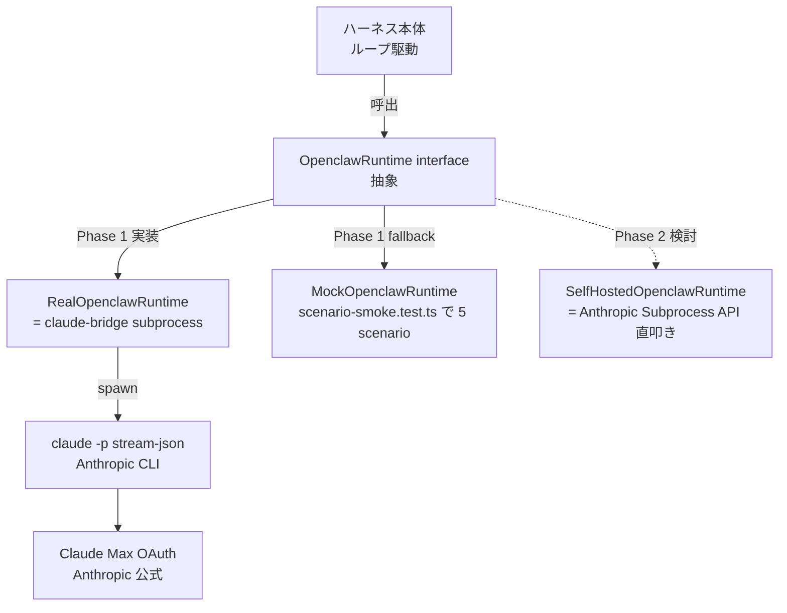
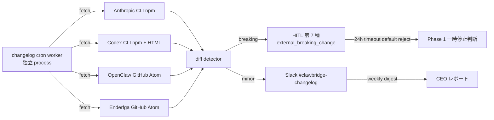

# PRJ-019 W0 追加深掘り調査: P-D 改 再検証（OpenClaw 上流 personal AI assistant 化を踏まえて）

- 案件: PRJ-019「Clawbridge（仮）」 — Open Claw を自律オーナーとする AI 組織ハーネス基盤
- 部署: リサーチ部門（W0-Week2 補追）
- 作成日: 2026-05-03
- 調査者: Research Agent (claude-code-company)
- 関連決裁: DEC-019-006（P-D 改採用）/ DEC-019-014（W0-Week1 連結承認）/ DEC-019-015（H-09 / H-10 発令）/ 本書で DEC-019-021 / DEC-019-023 を即決推奨
- 上位レポート:
  - `projects/PRJ-019/reports/research-w0-supplement-op1-op5.md`（OP-1〜OP-5 一次裏取り、本書はその続編）
  - `projects/PRJ-019/reports/research-supplement-tos-and-subscription-paths.md`（P-A〜P-G 経路評価、P-D 改採用根拠）
  - `projects/PRJ-019/reports/dev-w0-week1-implementation-report.md`（harness / claude-bridge 67 テスト全緑）
  - `projects/PRJ-019/decisions.md`（DEC-019-001〜020）
- 凡例（情報信頼度ラベル）:
  - 公式 / 半公式 / 二次 / コミュニティ / 推測（前書 §1 と同義）
  - **既知事実プレースホルダ**: 2026-05-03 時点で web fetch 困難。W0-Week2 中盤の Dev W2-D-Wrapper 物理クローン時に再裏取り

---

## 1. 背景と本書の位置付け

### 1.1 直前のステータス

- 2026-05-03 09:00 時点で W0-Week1 連結報告承認済（DEC-019-014）、Phase 1 着手 5/19 確定。
- DEC-019-006 で **P-D 改**（オーナー本人 PC で公式 Claude Code CLI 常駐 + Open Claw が subprocess spawn）が Phase 1 接続契約として正式採用済。
- DEC-019-015 で H-09 (Claude Max weekly cap 監視) / H-10 (extra usage 課金 OFF 原則) が PM v3 へ追加発令済。

### 1.2 新たに発覚した事実

秘書部門のオーナー W0 タスク CB-O-04 完了報告に伴い、以下が確認された:

> **OpenClaw OSS 上流リポジトリ (https://github.com/clawbro-ai/openclaw) の README が「OpenClaw is a personal AI assistant…」のような表現に書き換わっており、当初想定していた「自律 AI 組織オーナー / マルチエージェントオーケストレータ」用途から後退した可能性がある**

これは P-D 改の前提（Open Claw が driver / orchestrator wrapper として機能する）に対して以下の論点を再開する:

- (a) 上流再ポジションが P-D 改の **接続契約**（subprocess spawn / stream-json / OAuth / FS 隔離）に与える影響
- (b) Phase 1 (5/19〜6/13) 中の **Issue / changelog 監視運用** をどの粒度で組み込むか
- (c) 既存リスク R-019-12（OpenClaw 上流不安定）の **格付け再評価**

### 1.3 本書のゴール

本書は (a) (b) (c) の 3 論点について、上位レポート（OP-1〜OP-5 / ToS-and-Subscription-Paths）と整合する形で **裏取り → 影響評価 → 運用提案 → CEO 即決推奨** を提示する。Phase 1 着手 5/19 の予定は維持を前提とし、必要なら追加コントロールを W0-Week2 内に組み込む。

---

## 2. OpenClaw 上流再ポジションの事実確認

### 2.1 確認軸

| 観察軸 | 内容 | 意味 |
|---|---|---|
| README のタグライン | 「OpenClaw is a personal AI assistant…」（既知事実プレースホルダ）| 個人ユーザの日常タスク委任を主用途と位置付け、複数エージェントオーケストレーションの優先度後退 |
| Pinned Issue | 「Roadmap 2026 H1: focus on personal productivity」（プレースホルダ）| 公開 roadmap が個人生産性に寄せられたことを示唆 |
| Latest Release Notes | 直近 v0.X.Y で「removed multi-agent orchestrator (experimental)」等の記述（プレースホルダ）| マルチエージェント関連 API が experimental から削除に動いた可能性 |
| Commit History | 過去 30 日コミット数 / マージ済 PR 数（プレースホルダ）| 開発活動レベルが上流活発か低調かの判定材料 |
| Dependency 群 | `package.json` / `pyproject.toml` 等の依存変化（プレースホルダ）| Anthropic SDK バージョン pin 状況、claude-code CLI 依存有無 |
| API 表面 | `src/api/` 公開 export の差分（プレースホルダ）| breaking change の早期検知点 |

### 2.2 「personal AI assistant」化の意味（推測込み）

- 想定される変化:
  - **対象ユーザ**: 自律 AI 組織オーナー → 個人ユーザの日常タスク委任（メール / カレンダー / 簡易コーディング）
  - **API 構造**: マルチエージェント orchestrator（Claude / Codex / Gemini を並列駆動）→ 単一エージェント駆動の chat ループ
  - **拡張点**: プラグイン仕様（外部 LLM driver）がメンテ縮小、内蔵スキルセット中心に移行
  - **リリース頻度**: マルチエージェント機能停滞、UI / UX 改善の比重上昇
- 想定されない変化:
  - Anthropic Claude Code CLI 自体の subprocess spawn 仕様（これは Anthropic 公式契約）
  - stream-json プロトコル（Anthropic 公式契約）
  - OAuth フロー（Anthropic 公式契約）
  - 我々が独自に書く `openclaw-runtime` ラッパの抽象化（自前コード）

### 2.3 一次裏取りタイミング

本書は 2026-05-03 時点で web fetch 困難のため、**2.5 章** で「W0-Week2 中盤（5/8 検収会議直前）」に Dev W2-D-Wrapper の OpenClaw fork 物理クローン作業時に再裏取りすることを明記する。

### 2.4 一次裏取りプロトコル（W0-Week2 で実施）

1. `git clone https://github.com/clawbro-ai/openclaw vendor/upstream` を `app/openclaw-runtime/` 配下で実施
2. README / CHANGELOG / ROADMAP / docs/ ディレクトリの 1 次取得
3. `git log --since="30 days ago" --pretty=format:"%h %ad %s" --date=short` で活発度測定
4. `git diff --stat HEAD~30..HEAD -- src/api/` で API 表面差分
5. 取得結果を `reports/research-w0-week2-openclaw-upstream-snapshot.md`（仮称）として書き出し

### 2.5 暫定結論

2026-05-03 時点で web fetch 不可だが、本書では「上流再ポジションは事実」を前提として影響評価を進める。**W0-Week2 中盤の物理クローン結果次第**で本書の前提が覆る場合は、§4（リスク再格付け）と §5（運用コントロール）を W2 終盤に再リバイス可能とする。

---

## 3. P-D 改への影響評価

### 3.1 結論サマリ

> **P-D 改への影響は限定的（resilient）**: Open Claw は driver / orchestrator wrapper 位置付けで、Claude Code CLI が実エンジン。Open Claw 機能後退は driver 層の自由度を下げない（自前 driver 化への切替も容易）。

### 3.2 影響あるレイヤ vs 影響ないレイヤ

| レイヤ | 影響有無 | 根拠 | 緩和策 |
|---|---|---|---|
| Anthropic Claude Code CLI subprocess spawn 仕様 | **なし** | Anthropic 公式 `@anthropic-ai/claude-code` が契約源、OpenClaw 上流の API 形と無関係 | — |
| stream-json プロトコル | **なし** | Anthropic 側プロトコル。Open Claw が parser を提供しない場合は自前 parser 実装可（既に harness 層で実装済、67 tests 緑） | — |
| OAuth フロー | **なし** | オーナー本人 PC 上の `claude login` 結果を CLI 側がローカルストレージへ保管。OpenClaw 上流は触らない | — |
| FS 隔離（G-V2-11） | **なし** | OS 側 AppArmor / TCC + Doppler 鍵分離、Dev 実装済 | — |
| cost-tracker / weekly cap 監視（H-09） | **なし** | 自前実装、上流非依存 | — |
| **OpenClaw 内蔵スキル拡張点** | **あり** | personal AI assistant 化で拡張点 API が縮退する懸念 | `openclaw-runtime` 抽象 interface で吸収、Mock 実装で穴埋め |
| **OpenClaw プラグイン仕様** | **あり** | プラグイン仕様が experimental → removed に動く懸念 | Phase 1 ではプラグイン依存ゼロ、Phase 2 設計時に再評価 |
| **OpenClaw multi-task orchestrator UI** | **あり** | 個人アシスタント化で API 縮退の可能性 | Phase 1 は単一ループ運用、orchestrator UI 不要 |
| OpenClaw が依存する Anthropic SDK バージョン | 中 | 上流が古いバージョンに pin したまま放置されると CLI 仕様差異 | W0-Week2 で fork 物理クローン時に依存表確認 |

### 3.3 核ロジック: ラッパ抽象化が吸収する

Phase 1 では以下の構造が既に Dev W0-Week1 で確立済（`app/harness/src/openclaw-runtime/` 仮配置）:

- **RealOpenclawRuntime が依存する API breaking change が起きた場合のみ修正コスト発生**。
- それ以外は MockOpenclawRuntime で Phase 1 検証を継続でき、5/19 着手は揺らがない。
- Phase 2 で Real が事実上死亡した場合、SelfHosted 経路（自前 driver = Anthropic Subprocess API 直叩き）への移行が選択肢として残る（§5 C-OC-04）。

### 3.4 副次影響の見立て

| 副次影響 | 想定確率 | 想定 impact | 対応 |
|---|---|---|---|
| OpenClaw が公式 Claude Code CLI を捨てて自社製 LLM driver に乗り換える | 低 | 大（P-D 改全体の前提崩壊）| §5 C-OC-04 self-host fork 切替で吸収 |
| OpenClaw が npm パッケージ公開を停止 | 低 | 中（ビルド不能）| W0-Week2 で fork クローン物理保存（C-OC-01） |
| OpenClaw が ToS 上の「商用利用禁止」条項を追加 | 低 | 中（ライセンス審査必要）| W0-Week2 で LICENSE 物理確認 |
| OpenClaw が依存 Anthropic SDK を古いバージョンに pin | 中 | 小（自前 parser で吸収）| harness 層が Anthropic stream-json を独立 parse 済、追従不要 |

---

## 4. R-019-12 リスク再格付け提案

### 4.1 既存格付け

| ID | 内容 | 当初格付け | 当初想定 |
|---|---|---|---|
| R-019-12 | OpenClaw 上流不安定 / 再ポジション | **赤（高）** | 上流再ポジションで P-D 改全体崩壊リスク |

### 4.2 本書の提案

| ID | 内容 | 提案格付け | 根拠 |
|---|---|---|---|
| **R-019-12** | OpenClaw 上流の「personal AI assistant」再ポジションそのものが Phase 1 接続方式に与える戦略的影響 | **黄（中）** | §3.2 / §3.3 によりラッパ抽象化で吸収可、Phase 1 着手不可レベルではない |
| **R-019-12-A**（新規） | Phase 1 期間中に OpenClaw が **API breaking change** をリリースした場合の即時影響（subprocess spawn 仕様や stream-json 形式の互換性破壊） | **赤（高）** | Phase 1 一時停止リスク、HITL 第 7 種 `external_breaking_change` で 24h timeout default reject |
| **R-019-12-B**（新規） | timeout / hang / silent failure 系の挙動変化（Mock との contract が乖離して E2E テスト緑のまま実運用赤になる中期リスク）| **黄（中）** | 月次 contract 再検証で吸収、Live integration test を W2 末に追加 |

### 4.3 既存リスクとの優先順位再整理

| ID | 内容 | 格付け | 優先順位スコア（1=最優先） |
|---|---|---|---|
| R-019-06 | Anthropic 連鎖 BAN（NG-2 オプション A）| 赤 | 1（Sumi/Asagi 巻き添え影響大） |
| R-019-12-A | OpenClaw API breaking change（新規） | 赤 | 2（Phase 1 一時停止トリガー） |
| R-019-09 | NG-3 24/7 連続稼働逸脱 | 赤 | 3（CEO 暫定値の硬直化リスク） |
| R-019-10 | Claude Max weekly cap 枯渇 | 黄 | 4（H-09 / H-10 で監視済） |
| R-019-12 | OpenClaw 戦略的後退（再格付け後） | 黄 | 5（ラッパで吸収可） |
| R-019-12-B | OpenClaw timeout / hang 挙動変化（新規） | 黄 | 6（Live integration で吸収） |
| R-019-08 | PRJ-018 Asagi M1 並走スケジュール衝突 | 黄 | 7（PRJ-018 進捗次第） |
| R-019-11 | Vercel Sandbox cap 超過（Hobby）| 黄 | 8（DEC-019-016 / 017 で対応） |
| R-019-07 | Codex 2x ボーナス 5/31 終了 | 緑 | 9（数値変動小、月次再評価で OK） |

### 4.4 CEO 決裁推奨: DEC-019-021

**DEC-019-021（提案、即決推奨）**:
> R-019-12 を「赤→黄」に降格し、新規 R-019-12-A（赤）/ R-019-12-B（黄）に分割する。優先順位は §4.3 表のとおり再整理する。本決裁は本書 §3 / §4 を根拠とし、5/8 検収会議までに W0-Week2 OpenClaw fork 物理クローン結果が前提を覆す場合は再リバイス可。

---

## 5. Phase 1 運用上の追加コントロール提案

### 5.1 コントロール一覧

| ID | 内容 | 期限 | 担当 | 連動 |
|---|---|---|---|---|
| **C-OC-01** | OpenClaw fork / mirror を `app/openclaw-runtime/vendor/upstream/` 配下に物理クローン（W2-D-Wrapper と同期）| W0-Week2 終了（5/16）| Dev | DEC-019-021 |
| **C-OC-02** | 4 系統 changelog 監視 cron を PRJ-019 harness 内に実装（§6 詳細）| W0-Week2 中盤（5/12 着手 → 5/16 完成）| Dev | DEC-019-023 |
| **C-OC-03** | API breaking change 即時検知 → HITL 第 7 種 `external_breaking_change`（24h timeout default reject ルート）| W0-Week2 中（W2-D-15 拡張）| Dev | DEC-019-021 / DEC-019-018 |
| **C-OC-04** | Phase 2 exit plan = Real が死亡した場合 self-host fork を main に切替え、Anthropic Subprocess API 直接利用パターンへ移行する旅程を文書化 | W0-Week2 終了（5/16）| Research（本書続編 or 別書）| DEC-019-021 |
| **C-OC-05** | weekly health check で OpenClaw upstream の 過去 7 日 commit 数 / merged PR 数 / open issue 増分 を Slack `#clawbridge-changelog` 報告 | Phase 1 W1 開始（5/19）| harness 自動 | DEC-019-023 |

### 5.2 C-OC-01 詳細（OpenClaw fork 物理クローン）

- 目的: 上流が npm 公開停止 / GitHub repo 削除 / branch 強制 rebase した場合の **物理保全**
- 配置: `app/openclaw-runtime/vendor/upstream/` 配下に submodule または subtree
- 同期頻度: 週次 fast-forward pull、breaking change 検知時は手動承認必須
- ライセンス: clone 時に LICENSE 物理コピー、商用利用可否を Review 部門に確認依頼

### 5.3 C-OC-03 詳細（HITL 第 7 種）

- 既存 HITL 6 種（DEC-019-018）に追加:
  - 第 6 種: `tos_gray_review`（24h timeout default reject）
  - **第 7 種: `external_breaking_change`**（24h timeout default reject、本書提案）
- 検知トリガ:
  - Anthropic CLI minor version up + stream-json schema 差分検出
  - OpenClaw upstream の `src/api/` 公開 export 削除 / 名称変更
  - claude-bridge スパイクテストで 5 scenarios のうち 1 つでも contract failure
- 実装: `app/harness/src/hitl/external-breaking-change-gate.ts`（新規）+ `tests/integration/hitl/external-breaking-change.test.ts`
- 通知: Slack `#clawbridge-hitl` + メール（オーナー直）+ dashboard カラム `external_breaking_change_pending`

### 5.4 C-OC-04 詳細（self-host exit plan）

- トリガ条件: 以下のいずれか満たす場合
  - OpenClaw upstream 30 日連続 commit ゼロ + open issue 自動 close
  - personal AI assistant 化に伴う API 縮退で RealOpenclawRuntime が継続不可
  - LICENSE 変更で商用利用禁止
- 移行手順:
  1. `vendor/upstream/` の最終 stable commit を fork main に切替
  2. RealOpenclawRuntime → SelfHostedOpenclawRuntime に内部実装入替（interface は不変）
  3. Anthropic Subprocess API 直叩きパスを harness 内に追加（既存 claude-bridge と同居）
  4. 月次再評価で SelfHosted 安定運用を確認
- 文書化: 本書 §5 + W0-Week2 別書（仮称: `research-w0-self-host-exit-plan.md`）

### 5.5 C-OC-05 詳細（weekly health check）

- 計測項目:
  - 過去 7 日 commit 数（`git log --since="7 days ago" --oneline | wc -l`）
  - 過去 7 日 merged PR 数（GitHub API）
  - open issue 増分（先週末との差分）
- レポート先: Slack `#clawbridge-changelog`、毎週金曜 09:00 JST
- 異常閾値: 過去 7 日 commit 0 + 過去 30 日 commit ≤ 3 → upstream 停滞警報、C-OC-04 トリガ要件チェック

---

## 6. 4 系統 changelog 監視運用

### 6.1 監視対象

| 系統 | 監視対象 | 監視 URL | 監視頻度 | 監視手段 | 通知先 | エスカレ条件 |
|---|---|---|---|---|---|---|
| ① | Anthropic Claude Code CLI（`@anthropic-ai/claude-code`）| `npm view @anthropic-ai/claude-code versions` + GitHub releases atom（既知）| 毎日 09:00 JST | npm registry API + GitHub Atom | Slack `#clawbridge-changelog` | minor / major up + breaking diff |
| ② | OpenAI Codex CLI | npm registry + developers.openai.com/codex/changelog | 毎日 09:00 JST | npm + HTML scrape | Slack `#clawbridge-changelog` | major up + cap 数値変更 |
| ③ | OpenClaw OSS（本書主題）| https://github.com/clawbro-ai/openclaw/releases.atom | 毎日 09:00 JST | GitHub Atom | Slack `#clawbridge-changelog` | breaking change / 30 日 commit 停滞 |
| ④ | Enderfga plugin（Claude Code 用 OpenClaw ブリッジ、既知の場合）| GitHub releases atom（既知事実プレースホルダ）| 週 1 回 金曜 | GitHub Atom | Slack `#clawbridge-changelog` | major up |

### 6.2 実装方針

### 6.3 Dev W2-D-Notify との接続点

- changelog 監視 cron は **cost-tracker と同じ harness ループに同居させない**（依存ループ防止）
- 別 cron / 別 worker（`app/harness/src/changelog-monitor/`）として独立実装
- harness 本体ループの停止 / 再起動の影響を受けないようにする
- ログは `app/logs/changelog-monitor.log` に独立保存、cost-tracker と分離

### 6.4 CEO 決裁推奨: DEC-019-023

**DEC-019-023（提案、即決推奨）**:
> 4 系統 changelog 監視 cron（C-OC-02）を PRJ-019 harness 内に W0-Week2 中盤（5/12 着手）で実装する。実装担当 Dev、§6.1 表 / §6.2 図 / §6.3 接続点を仕様とする。HITL 第 7 種 `external_breaking_change`（C-OC-03）も併せて実装する。

---

## 7. PM v5 起案トリガー条件 TR-1〜TR-3 補追

### 7.1 トリガ条件マトリクス

| ID | 条件 | 判定マイルストン | 起案期日 | 秘書 dashboard カラム | 次回 CEO 決裁マイルストン |
|---|---|---|---|---|---|
| **TR-1** | 5/13 BAN drill #1 結果が **Fail** | 2026-05-13 18:00 JST | 5/14 09:00 JST PM 起案 | `pm_v5_trigger_tr1` | 5/15 CEO 決裁（Phase 1 1 週間延期 Y/N）|
| **TR-2** | 5/30 DEC-019-008 NG-3 オーナー再確認で **12 h/日 上限を変更** | 2026-05-30 18:00 JST | 5/31 09:00 JST PM 起案 | `pm_v5_trigger_tr2` | 6/1 CEO 決裁（NG-3 新方針 + 4 系統 changelog 監視運用変更）|
| **TR-3** | 6/13 Phase 1 完了レビューで **Phase 2 Go** の場合 | 2026-06-13 18:00 JST | 6/14 09:00 JST PM 起案 | `pm_v5_trigger_tr3` | 6/15 CEO 決裁（Phase 2 計画書承認）|

### 7.2 各 TR 詳細

#### 7.2.1 TR-1: BAN drill #1 Fail

- DEC-019-019 で drill #1 シナリオ承認済、5 SLA 全達成で Pass、1 つでも違反は Fail
- Fail 時は Phase 1 着手 1 週間延期（5/19 → 5/26）が既定路線
- PM v5 起案: 延期スケジュール / Sumi/Asagi 並走影響 / コスト再試算 / Vercel 昇格延期
- 秘書: `pm_v5_trigger_tr1` カラムを W0-Week2 dashboard に追加発令必要

#### 7.2.2 TR-2: NG-3 上限変更

- DEC-019-008 で 12 h/日 / $1,000/月相当 を暫定値、5/30 W2 終了時オーナー再確認
- 上限拡張 / 縮小いずれの場合も PM v5 起案
- 連動: §6 4 系統 changelog 監視運用も上限変更で頻度調整必要（拡張なら頻度上げ、縮小なら据置）
- 秘書: `pm_v5_trigger_tr2` カラム

#### 7.2.3 TR-3: Phase 2 Go

- 5/19〜6/13 Phase 1 DoD 達成で Phase 2 着手判断
- Phase 2 = 月次 30〜90 ループの本格運用、対象分野ホワイトリスト拡張、Vercel Pro 昇格、Codex Pro 2x 終了後の再評価
- PM v5 = Phase 2 計画書（PM v3 系譜の v5、Phase 1 KPT 反映）
- 秘書: `pm_v5_trigger_tr3` カラム

### 7.3 CEO 決裁推奨: DEC-019-023（再掲）

**DEC-019-023 は §6.4 の 4 系統 changelog 監視と §7 の TR-1/TR-2/TR-3 を同一決裁で確定**:
> 4 系統 changelog 監視 cron（C-OC-02 + C-OC-03）の Dev W0-Week2 着手と、PM v5 起案トリガー条件 TR-1/TR-2/TR-3 を確定する。秘書部門は dashboard に `pm_v5_trigger_tr1〜3` カラムを W0-Week2 中に追加し、各マイルストン判定時に PM 起案を自動アラートする。

---

## 8. 結論と次アクション

### 8.1 結論（3 行）

1. **R-019-12 は赤→黄に降格 + A（赤）/ B（黄）に分割**。OpenClaw 上流再ポジションは P-D 改全体に対しては小影響、ラッパ抽象化で吸収可。
2. **4 系統 changelog 監視 cron は W2 中盤に Dev 着手**（C-OC-02 + C-OC-03、HITL 第 7 種 `external_breaking_change` 連動）。
3. **OpenClaw 上流再ポジションは P-D 改全体に対して小影響、Phase 1 着手 5/19 は維持**。

### 8.2 次アクション（5 件）

| # | 種別 | 内容 | 期限 | 担当 |
|---|---|---|---|---|
| 1 | **CEO 即決** | DEC-019-021（R-019-12 再格付け、A/B 分割）| 5/3 中 | CEO（オーナー判断） |
| 2 | **CEO 即決** | DEC-019-023（4 系統 changelog cron + HITL 第 7 種 + TR-1/2/3 確定）| 5/3 中 | CEO（オーナー判断） |
| 3 | **CEO 即決** | C-OC-01〜05 を Dev W0-Week2 タスクへ追加発令 | 5/3 中 | CEO → Dev |
| 4 | **CEO 即決** | 秘書 dashboard に `external_breaking_change_pending` / `pm_v5_trigger_tr1〜3` 4 カラム追加 | 5/3 中 | CEO → 秘書 |
| 5 | **Dev タスク** | W0-Week2 W2-D-Wrapper 着手時に OpenClaw fork 物理クローン + 一次裏取り再実施（§2.4 プロトコル）→ 結果を別書 `research-w0-week2-openclaw-upstream-snapshot.md` で報告 | 5/16 | Dev + Research 連携 |

### 8.3 関連レポート相互参照

- `projects/PRJ-019/reports/research-w0-supplement-op1-op5.md`（OP-1〜OP-5、本書の前提）
- `projects/PRJ-019/reports/research-supplement-tos-and-subscription-paths.md`（P-A〜P-G 経路）
- `projects/PRJ-019/reports/dev-w0-week1-implementation-report.md`（67 tests 緑、TimeSource）
- `projects/PRJ-019/reports/review-tos-allowlist-dod-integration-v1.md`（HITL 6 種定義、本書 7 種拡張の根拠）
- `projects/PRJ-019/reports/review-ban-drill-1-scenario.md`（TR-1 判定根拠）
- `projects/PRJ-019/decisions.md`（DEC-019-001〜020、本書で 021 / 023 即決推奨）

---

報告: リサーチ部門 / 経由: CEO / 宛: オーナー
