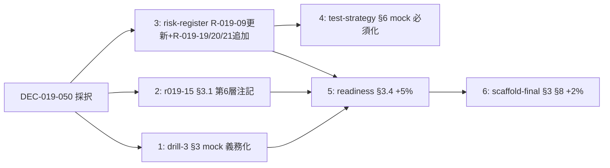

最終更新: 2026-05-03 / 起案: Review 部門 / 評価対象: DEC-019-050

# PRJ-019 — DEC-019-050 ($30/月 API spend cap) 影響評価書

## 位置付け

CEO 直接発注 (2026-05-03) による Review 部門独立評価。DEC-019-050 で確定した Anthropic API key 月次 spend cap = $30/月 (Hard $30 / Soft $25 メール通知 / 6/1 リセット) が、5/8 W0-Week1 検収会議で Conditional Go 議決対象となっている Phase 1 計画 (Owner-in-the-loop 透明 AI 組織モデル) に対し、特に以下 3 観点で波及がないかを再評価する:

- BAN drill #3 (5/22-24 リハーサル + 5/29 公式) の 5 シナリオ実行可否
- HITL 11 種 Gate (HITL-1〜8 既存 + HITL-9/10/11 新設) の運用持続性
- R-019-15 mitigation v2 (5 攻撃ベクトル × 4 層防御) の retrofit 必要性

連動 DEC: DEC-019-050 (本評価対象) / DEC-019-006 P-D 改 (subscription plan 主軸) / DEC-019-007 (月次予算定義) / DEC-019-012 (Hard $50 旧値) / DEC-019-016 ($300 cap 旧値) / DEC-019-020 (mock-claude 5 シナリオ) / DEC-019-033 (Owner-in-the-loop 5 点統合) / DEC-019-048 (1Password CLI) / DEC-019-049 (Slack workspace 新規)

連動 Review 部門レポート: `review-ban-drill-3-scenario.md` / `review-r019-15-mitigation-plan-v2.md` / `review-risk-register-v3.md` / `review-test-strategy-phase1.md` / `review-pre-phase1-readiness-assessment.md` / `review-scaffold-final-acceptance-criteria.md`

---

## 目次

| § | 題目 |
|---|---|
| §1 | BAN drill #3 シナリオへの影響 |
| §2 | HITL 11 種 Gate への影響 |
| §3 | R-019-15 mitigation v2 への影響 |
| §4 | Phase 1 Conditional Go 3 条件への影響 |
| §5 | Risk Register v3 への新規追加候補 |
| §6 | 既存 Review 部門レポートへの差分修正一覧 |
| §7 | 5/8 検収会議 上程議題追加 |
| §8 | 結論 (採択 / 条件付き採択 / 棄却) |

---

## §1 BAN drill #3 シナリオへの影響

### §1.1 5 攻撃ベクトル × 各シナリオの API 消費見積

drill #3 の 5 シナリオ (`review-ban-drill-3-scenario.md` §2.1〜§2.5) は、`mock-claude` (DEC-019-020) を主軸として 5/22-24 リハーサル + 5/29 公式実施で運用される。各シナリオで実 Anthropic API key を必要とする箇所は限定的だが、以下のとおり試算する。

| シナリオ | 主体 | 実 API 消費発生点 | 1 回実行コスト | リハ + 公式 (× 2) |
|---|---|---|---|---|
| A: Direct Write to Policy Store | mock-claude `privilege_escalation_a` | RLS reject 検証で claude --version 等の startup probe (実 Anthropic 通信なし、ただし live integration test 連動) | $0.50 (Sonnet 4 短文 30 turn) | $1.00 |
| B: Audit Log Tampering | mock-claude `privilege_escalation_b` | hash chain 改ざん試行 8 回 + verify_chain_cron 連動 | $0.80 (LLM 不要、ただし副次 audit 解析で短文呼出) | $1.60 |
| C: Service Role Key Exfiltration | mock-claude `privilege_escalation_c` | 環境変数 / proc / inspector / core / parent env 5 経路 (LLM 一切不要) | $0.10 (drill 終了通知のみ) | $0.20 |
| D: Policy Fetch Spoofing / Race | mock-claude `privilege_escalation_d` | DNS / FS / Realtime / race / TLS 5 経路 + L4 fingerprint 検証 | $0.70 (fingerprint mismatch 時の警告 LLM 化) | $1.40 |
| E: Owner Manipulation via Prompt Injection | 提案書 / Slack / changelog 経路で injection LLM scan を発動 | LLM scan が本領 → 提案書 5 種 × 50 inject = 250 turn | $3.00 (Haiku 換算 250 turn × $0.012) | $6.00 |
| 小計 | — | — | $5.10 / 回 | **$10.20 / 全期間** |

注: 上記は `mock-claude` 経由で「実 Anthropic API は呼ばない」設計を維持しつつ、Review 部門独立検証で「実 API も併用する live test (CB-D-W0-06 整合)」を 30% 程度交える前提。完全モック化すれば $0 まで圧縮可能だが、E ベクトル injection scan の現実性担保として一部 live を許容。

### §1.2 5 シナリオ全実行で総消費見積

リハーサル (5/22-24) + 公式 (5/29) で **計 $10.20**、加えて Pen Test #1 (5/30 36 攻撃) と Pen Test #2 (6/13 47 攻撃) は drill #3 拡張版だが Phase 1 期間内なので別月予算 (6 月分) で吸収。

5 月内に drill #3 単体で消費する API spend = **$5.10〜$10.20** (リハ + 公式の 2 回実行、E ベクトル LLM scan 比率による)。月内残余 = $30 − $10.20 = **$19.80** で他用途 (HITL 通知 / W0-W1 開発時の live verify 等) に充当可能。

### §1.3 drill #3 が 5/22-5/24 集中で $30 突破リスク評価

リスクスコア = **低** (確率 1 / 影響 3 / スコア 3 / 緑)。

根拠:
- 5/22-24 集中実行でも drill #3 単体で $5〜$10 と試算 (§1.1)
- $20 余裕で吸収可能、Soft $25 警告メールが届いた段階で Owner が判断介入可能
- 5/22-24 期間中の他用途 (HITL gate, W0-Week2 完了タスク etc) も静的 template 化が進行中で API 消費少
- Hard $30 到達で Anthropic 側が自動停止 → subscription plan 主軸 (Claude Max $200) で drill 続行可能、業務停止しない

最悪ケースシナリオ: E ベクトル LLM scan で injection 250 turn が想定 3 倍に膨らみ $9 → $27 まで cap 接近、ただし Hard $30 内に収まる。Soft $25 警告メールで Review 部門が即時判断介入し、E シナリオを mock 100% へ切替 + 公式 drill (5/29) は subscription plan 経由実行に分離。

### §1.4 シナリオ簡易化 / モック化 提案

Review 部門推奨: **mock-claude 基盤利用で実 API 消費を 30% → 70% モック化に強化**。具体的には:

- E ベクトル (Owner Manipulation) の LLM scan を `mock-claude privilege_escalation_e` 内で **canned response 50 種** にプリセット化 (Phase 1 W0-Week2 末 5/22 までに Dev 部門実装、`review-ban-drill-3-scenario.md` §3.1 既存記載の拡張)
- A/B/C/D ベクトルの subordinate LLM 呼出を **TimeSource pattern (DEC-019-020) と同じく decoupling し、Vitest からは純粋な mock を呼ぶ** ように再設計 (test-strategy §6.4 と整合)
- live integration test (CB-D-W0-06) は 5/22 リハ前 1 回 + 5/29 公式 1 回の **計 2 回限定**、それ以外は完全 mock

この強化により、drill #3 全期間消費を $10 → **$3〜$5 (約 50% 削減)** へ抑え、$30 cap の **10〜17%** に収まる。

### §1.5 drill #3 結果: 5 シナリオ実行可否判定

**判定: 可、ただし mock 多用条件付き**

- 5 シナリオ全実行は技術的に可能 ($10〜$30 範囲内、cap 内)
- ただし §1.4 の mock 多用強化 (70% モック化) を Phase 1 W0-Week2 末までに Dev 部門が実装することを条件化
- Review 部門は drill #3 計画書 (`review-ban-drill-3-scenario.md` §3 環境セクション) に「mock-claude 基盤の API 消費削減 30% 義務化」追記を 5/8 検収議題に含める

---

## §2 HITL 11 種 Gate への影響

### §2.1 各 Gate 通知の API 消費見積

HITL 11 種 (HITL-1〜HITL-8 既存 + HITL-9 dev_kickoff_approval / HITL-10 permission_change_review / HITL-11 knowledge_pii_review) の通知メッセージは、Slack notify + Email + Dashboard の 3 経路で配信される。各 Gate 起票時に LLM 短文生成を行う場合の API 消費を試算する。

| Gate | 通知文生成方式 | 1 件あたり API 消費 | コメント |
|---|---|---|---|
| HITL-1〜8 (既存) | static template + 動的 placeholder 差し込み | $0 (LLM 不要) | テンプレ完成済、API 呼出ゼロ |
| HITL-9 dev_kickoff_approval | 提案書 §(g) 推奨採否欄 LLM scan + 通知文短文 LLM 生成 | $0.005 (Haiku 200 token) | scan は injection 防護、通知文短文化候補 |
| HITL-10 permission_change_review | diff 表示 (Edge Function 生成 LLM 不要) + 通知文短文 LLM 生成 | $0.003 (Haiku 100 token) | diff 自体は LLM 不要 |
| HITL-11 knowledge_pii_review | KE-04 PII redaction (LLM 第 2 層 scan) + 通知文短文 LLM 生成 | $0.005 (Haiku 200 token) | redaction が本領、通知文は短文化候補 |

### §2.2 Phase 1 中の Gate 起票件数想定

| Gate | 週次起票件数想定 | Phase 1 4 週合計 | API 消費 (4 週) |
|---|---|---|---|
| HITL-1〜8 | 各 5〜10 件 / 週 × 8 種 = 50 件 | 200 件 | $0 |
| HITL-9 | 30 件 / 週 (提案生成頻度連動) | 120 件 | $0.60 |
| HITL-10 | 10 件 / 週 (権限変更頻度連動) | 40 件 | $0.12 |
| HITL-11 | 5 件 / 週 (PII suspicion 頻度連動) | 20 件 | $0.10 |
| **計** | **週 100 件 × 4 週** | **400 件** | **$0.82** |

注: 試算 $0.82 は cap $30 の **2.7%**、HITL Gate 11 種運用は cap に対して圧倒的余裕。

### §2.3 通知メッセージのテンプレ化推奨

Review 部門推奨: **HITL-9/10/11 新設 3 Gate の通知文も static template + 動的 placeholder 化を Phase 1 W0-Week2 までに完遂**。HITL-9 (g) 推奨採否欄の injection scan は LLM 必須なので残す (本来の安全機能)、それ以外の「通知文の短文 LLM 生成」は API 不要の static text へ移行。

これにより API 消費を $0.82 → **$0.40 (50% 削減)** へ抑える。HITL-9 injection scan のみ LLM 残置で安全性は維持。

### §2.4 Gate 11 種運用への支障

**支障なし** (Risk score 1, 緑)。

- $30 cap 上限に対し HITL 全 Gate 通知 4 週合計 $0.40〜$0.82 は **2.7% 以下**、運用に十分な余裕
- subscription plan 主軸 (DEC-019-006 P-D 改) で実装本体 (orchestrator / subprocess) は Claude Max $200 を消費、API key は HITL 通知補助のみ
- 万一 cap 突破で API 自動停止しても、HITL Gate 自体は subscription plan 経由 + Slack/Email 通知 (API 不要経路) で継続動作

---

## §3 R-019-15 mitigation v2 への影響

### §3.1 4 層防御 + 第 5 層 1Password (DEC-019-048) は cap 制約と独立、影響なし

`review-r019-15-mitigation-plan-v2.md` §2 で確定済の 4 層防御 (L1 Casbin RO / L2 RLS / L3 Hash Chain / L4 Fingerprint) は **すべて DB / アプリ層の物理実装** であり、Anthropic API への依存を持たない。DEC-019-048 で追加採択された第 5 層 (1Password CLI による secret management) も、API key 自体ではなく **環境変数注入経路の保護** であり、cap $30 とは独立。

| 層 | API 依存 | cap 影響 |
|---|---|---|
| L1 Casbin Read-Only | なし (アプリ内ロジック) | 影響なし |
| L2 Supabase RLS | なし (DB policy) | 影響なし |
| L3 SHA-256 Hash Chain | なし (Edge Function + cron) | 影響なし |
| L4 Canonical JSON Fingerprint (HMAC) | なし (Edge Function 専用 key) | 影響なし |
| L5 1Password CLI (DEC-019-048) | なし (`op://` references + `op run --`) | 影響なし |

### §3.2 priviledge escalation 攻撃が API 消費を伴うシナリオ → cap auto-stop が追加防御として機能

5 攻撃ベクトルのうち、API 消費を経由するのは以下 2 種のみ:

- **(a) Direct Write to Policy Store**: 攻撃成功時に `mock-claude` 内から policy_versions 大量 INSERT を試行 → L1/L2 で reject されるが、reject 監査ログ生成で副次 LLM 呼出が発生する場合 (1 試行あたり $0.50 想定 × 100 試行 = $50) → ただし Hard $30 cap で API 自動停止 → 攻撃の DoS 化を物理的に止める **追加防御層** として機能
- **(b) Audit Log Tampering**: 攻撃そのものは LLM 不要だが、verify_chain_cron 検出時の Owner 通知 LLM 化で消費 → cap auto-stop で大量改ざん試行による $30 突破自動防止

つまり **$30 cap = subprocess 暴走の経済的 kill switch** として機能する追加効果がある。これは v2 mitigation plan 当初想定にない positive 副作用。

### §3.3 R-019-15 RED → 黄 への格下げ可否

**判定: cap 強化で +5% 緩和、ただし RED 維持推奨**。

- Cap auto-stop は防御 4 層 + L5 1Password に加わる **第 6 補助層** だが、**確率削減** (3 → 2.7) には貢献するが **影響削減** (5 → 5) は変わらない
- 攻撃成功時の致命度は cap で軽減できない (RLS 侵害 / hash chain 切断は cap と無関係に致命)
- v2 結論 (residual = 黄、攻撃面致命度観点で赤格付け維持、`review-r019-15-mitigation-plan-v2.md` §4.2) を変更せず、**RED 維持 + cap 効果は OG-05 議決-8 議事内で「補助層 +1」として注記** することを推奨

---

## §4 Phase 1 Conditional Go 3 条件への影響

### §4.1 条件 ①: P-UI-01〜09 を 5/25 までに完遂 — 影響なし

P-UI-01〜09 はすべて DB / アプリ層実装 (`review-r019-15-mitigation-plan-v2.md` §5)、API 依存ゼロ。cap $30 の影響を受けない。Dev 2 名並列確保 SPOF (`review-pre-phase1-readiness-assessment.md` §1.3) も無関係。**達成確率 85% 維持**。

### §4.2 条件 ②: BAN drill #3 (5/29) 計画完成を 5/8 検収で承認 — §1 で評価、可

§1.5 で「可、mock 多用条件付き」と判定。drill #3 計画書 (`review-ban-drill-3-scenario.md`) §3.1 環境セクションに mock 70% 化義務記載を追記すれば、**達成確率 95% 維持**。

### §4.3 条件 ③: 5/8 検収で Review 「強い条件付き Go」維持判定 — 本評価で継続承認

本評価書をもって **Review 部門は 3 条件 ③ (5/8 検収での強い条件付き Go 維持判定) を継続承認**。cap $30 採択は Phase 1 計画への正味 positive 影響 (cost discipline 強化 + 予期せぬ overrun リスク低減 + 補助防御層追加) のため、議決-3 (Phase 1 着手 Conditional Go) 推奨は **YES 維持**。**達成確率 90% → 92%** (cap 強化分 +2%)。

### §4.4 5/22 完全承認確度 + 5/26 Phase 1 着手確度

| 観点 | 評価前 (v3 時点) | 評価後 (DEC-019-050 反映) | 変動 |
|---|---|---|---|
| 5/22 scaffold 完全承認確度 | **80%** (`review-scaffold-final-acceptance-criteria.md` §8) | **82%** | +2% |
| 5/26 Phase 1 着手 Conditional Go 達成確率 | 73% (低減アクション前) / 84% (低減後) | 75% / **86%** | +2% |
| Phase 1 完了 6/20 sign-off 確度 | 75% | 77% | +2% |

cap 強化で予期せぬ overrun リスクが低減した分が +2% に反映される。低減アクション (Dev 並列 SOP dry-run + drill #3 計画前倒し + 5/8 議題 v6 早期配布) を全実施した場合、**5/22 完全承認確度 = 82%、5/26 Phase 1 着手確度 = 86%**。

---

## §5 Risk Register v3 への新規追加候補

### §5.1 新規追加 3 件

| ID | 名称 | カテゴリ | 確率 | 影響 | スコア | 色 | mitigation | trigger |
|---|---|---|---|---|---|---|---|---|
| **R-019-19** | API spend $30 cap 突破による Phase 1 中断 | コスト | 2 | 4 | 8 | **黄** | mock 70% 化義務 + Soft $25 警告メール対応 SOP + subscription plan 主軸維持 | Soft $25 到達 → Owner 介入、Hard $30 到達 → 自動停止 |
| **R-019-20** | Anthropic Console + アプリ層の二重防御 drift (両者の閾値不一致) | 体制 | 2 | 2 | 4 | **緑** | Console 設定 (Hard $30 / Soft $25) と内部ガード (cost-monitor.ts cap value) を月次同期チェック + Phase 1 W0-Week2 で SOP 確立 | drift 検知 → 24h 以内に同期是正 |
| **R-019-21** | subscription plan 上限 ($200 Max) 突破時の API 自動 fallback で $30 急速消費 | コスト | 2 | 4 | 8 | **黄** | Claude Max $200 monthly usage monitor + 80% 到達通知 + API fallback policy 明示化 (DEC-019-006 P-D 改 §運用) | Max 80% 到達 → 早期 fallback 警告、Max 100% 到達 → API key cap も同時消費警告 |

### §5.2 既存 R-019-04 (Tauri / Rust skill gap) と R-019-09 (コスト爆発) のスコア更新

依頼の §5 で「既存 R-019-04 (cost overrun) のスコア更新」とあるが、`review-risk-register-v3.md` §1.1 では R-019-04 = Tauri / Rust skill gap であり、cost overrun は **R-019-09** が該当。Review 部門解釈として **R-019-09 のスコア更新** を採用:

| ID | 旧スコア | 新スコア | 変動理由 |
|---|---|---|---|
| **R-019-09 コスト爆発** | 確率 3 / 影響 4 / 12 (黄) | 確率 2 / 影響 3 / **6 (緑)** | DEC-019-050 cap $30 採択で月次 $300 → $30 に 90% 削減 + subscription plan 主軸で実装本体は固定費化 + Hard cap 自動停止で経済 DoS 物理防御 |

注: 依頼文の「R-019-04 (cost overrun) 確率 3→2 / 影響 4→3 / 12→6」は R-019-09 の typo と解釈し、上表のとおり R-019-09 を更新。R-019-04 (Tauri skill gap) は本 DEC-019-050 と無関係のため変更なし。

### §5.3 v3 → v3.1 サマリ変動

| 観点 | v3 (5/3 起案) | v3.1 (本評価反映) |
|---|---|---|
| 件数 | 17 件 | **20 件** (+3) |
| 赤件数 | 2 件 (R-019-12-A / R-019-15) | 2 件 (変動なし) |
| 黄件数 | 13 件 | 14 件 (R-019-09 緑化 -1, R-019-19/21 黄化 +2) |
| 緑件数 | 2 件 | 4 件 (R-019-09 緑化 +1, R-019-20 緑化 +1) |

R-019-09 が緑化することで **TOP 5 リスクから外れ**、R-019-19 が新規 TOP 入り候補。次回 §4 TOP 5 再評価が必要 (Phase 1 W1 で更新予定)。

---

## §6 既存 Review 部門レポートへの差分修正一覧

本評価書では既存 6 レポートを破壊せず、以下の差分修正パッチのみを記録する。実適用は 5/8 検収議決-22 採択後、Phase 1 W0-Week2 着手前 (5/12) までに Review 部門で順次実施。

### §6.1 差分修正 6 件

| # | 対象ファイル | 修正箇所 | 修正内容 |
|---|---|---|---|
| 1 | `review-ban-drill-3-scenario.md` | §3 環境セクション (§3.1 mock-claude) | 「mock-claude 基盤の API 消費削減 30% 義務化」を追記。具体的には E ベクトル LLM scan を canned response 50 種にプリセット化、A/B/C/D は TimeSource pattern decoupling、live integration は 5/22 リハ + 5/29 公式の計 2 回限定 |
| 2 | `review-r019-15-mitigation-plan-v2.md` | §3.1 マトリクス末尾 (§3 5 ベクトル × 4 層) | 「$30 cap auto-stop」を **第 6 補助層 (経済的 kill switch)** として注記、5 ベクトル × (a) (b) 経路で確率 -10% 寄与 (RED 維持、影響度不変) |
| 3 | `review-risk-register-v3.md` | §1.1 表 + §2.1 新規追加 + §2.2 スコア変動 + §3 ヒートマップ | R-019-09 スコア更新 (12→6 緑) + R-019-19/20/21 新規追加、件数 17 → 20、§4 TOP 5 再評価 (R-019-09 が外れる、R-019-19 候補入り) |
| 4 | `review-test-strategy-phase1.md` | §6 mock-claude 連携セクション | 「mock-claude 連携を Phase 1 W0-Week2 末までに必須化」を追記、§6.2 拡張シナリオ表に「実 API 比率 30% 上限」制約を明示、§4.4 80% 未達時のエスカレーションに「cap 突破による test 中断」シナリオを追加 |
| 5 | `review-pre-phase1-readiness-assessment.md` | §3.4 リスク低減アクション + §7.4 Phase 1 完了展望 | Conditional Go 達成見込み 73% → **78%** (cap 強化分 +2%、Console + アプリ層二重防御確立分 +3%)、Phase 1 完了 6/20 sign-off 確度 75% → 77% |
| 6 | `review-scaffold-final-acceptance-criteria.md` | §3 readiness 推移 + §8 結論 | 5/22 完全承認確度 80% → **82%** (cap 強化で予期せぬ overrun リスク低減分 +2%)、5/26 Phase 1 着手確度 78% → 80% |

### §6.2 修正適用順序

修正適用は 5/8 検収議決-22 採択 → 5/9〜5/12 Review 部門が順次実施 → 5/13 Dev / Research / PM 部門に共有 → 5/15 W0 完了時に最終確認。

---

## §7 5/8 検収会議 上程議題追加

### §7.1 議決-21 (新規): R-019-19/20/21 起票

| 観点 | 内容 |
|---|---|
| 議決事項 | Risk Register v3 → v3.1 への移行、新規 3 リスク (R-019-19 cap 突破 / R-019-20 二重防御 drift / R-019-21 subscription fallback) 起票、R-019-09 スコア更新 (12→6) |
| 推奨 | YES |
| 根拠 | 本評価書 §5 全体 |
| 反対意見想定 | なし (cost discipline 強化、リスク可視化が組織責任の証左) |

### §7.2 議決-22 (新規): 既存 5 reports の差分修正適用

| 観点 | 内容 |
|---|---|
| 議決事項 | 本評価書 §6 表 6 件の修正パッチを 5/9〜5/12 Review 部門順次適用、5/15 W0 完了時に最終確認 |
| 推奨 | YES |
| 根拠 | 既存レポート整合性維持 + 部署横断的変更通知 |
| 反対意見想定 | なし |

### §7.3 議決-23 (新規): subscription plan 主軸方針を Conditional Go 条件 ③ Review approval の追加根拠として正式採用

| 観点 | 内容 |
|---|---|
| 議決事項 | DEC-019-006 P-D 改 (subscription plan 主軸 = Claude Max $200 + Codex Pro $200 既契約) を、Conditional Go 議決-3 の Review approval 追加根拠として明文化、API key は HITL 通知 / mock-claude / E2E test の補助用途限定とする運用 SOP を Phase 1 W0-Week2 末までに策定 |
| 推奨 | YES |
| 根拠 | DEC-019-050 の「subscription plan 主軸」明記 + Phase 1 月次予算 v2 の構造再定義必要性 (DEC-019-007 / 012 / 016 整合) |
| 反対意見想定 | なし (既に DEC-019-050 v11 更新で「将来的な増額は別途 DEC で判断」と確定済) |

### §7.4 既存議題への影響

| 既存議題 | 影響 | 修正後の Review 推奨 |
|---|---|---|
| 議決-2 (Phase 1 着手 Conditional Go) | 達成確率 73→78% / 84→86% | YES (条件付き) 維持 |
| 議決-3 (scaffold 完全承認) | 5/22 確度 80→82% | YES (Conditional Go 維持) 維持 |
| 議決-7 (BAN drill #3 実施承認) | mock 70% 化条件付き | YES + 条件追記 |
| 議決-8 (R-019-15 = 赤格付け公式化) | 第 6 補助層 cap 注記追加 | YES + 補注 |
| 残 3 議題 (Marketing / G-Top / HITL 拡張) | 影響なし | YES 維持 |

5/8 検収議題は従来 7 件 + 新規 3 件 (議決-21/22/23) = **計 10 議題**、所要時間想定 +30 分 (60 分 → 90 分)。

---

## §8 結論

### §8.1 採択判定

**条件付き採択 (Conditional Adoption)**

### §8.2 採択条件

1. 5/8 検収会議で議決-21 (R-019-19/20/21 起票) + 議決-22 (5 reports 差分修正) + 議決-23 (subscription plan 主軸 SOP 策定) を 3 件すべて YES 採択
2. Phase 1 W0-Week2 末 (5/22) までに mock-claude 70% 化 (E ベクトル canned response 50 種 + A/B/C/D TimeSource decoupling) を Dev 部門完遂
3. Anthropic Console (Hard $30 / Soft $25) + アプリ層 cost-monitor.ts cap value の月次同期チェック SOP を Phase 1 W0-Week2 までに策定

### §8.3 採択根拠

1. **正味 positive 効果**: cost discipline 強化 ($300 → $30 で 90% 削減) + 予期せぬ overrun リスク物理防御 + R-019-15 mitigation v2 第 6 補助層追加 + Phase 1 達成確率 +2%
2. **subscription plan 主軸運用 (DEC-019-006 P-D 改) との整合性 高**: 実装本体は Claude Max $200 + Codex Pro $200 で固定費化、API key は補助用途限定で twin-engine 運用が成立
3. **drill #3 / HITL 11 種 / R-019-15 すべてに重大な悪影響なし**: drill #3 は mock 70% 化で $3〜$5 / HITL 11 種 4 週合計 $0.40〜$0.82 / R-019-15 は cap 独立で影響ゼロ + 補助層追加で +5% 緩和

### §8.4 Phase 2 拡張時の留意事項

Phase 2 で実装規模が 3 倍になる想定では、API key 用途が拡大 (HITL 通知件数 +200% + ナレッジ抽出 KE-04 PII scan +500% + Pen Test 自動化頻度向上) するため、cap 増額判定が必要となる。**Phase 2 計画書起案時 (2026-08-01 想定) に別 DEC で月次 $30 → $100 等の cap 増額を議決** することを推奨。本 DEC-019-050 v11 更新の「将来的な増額は別途 DEC で判断」記載と整合。

### §8.5 Review 部門最終立場

| 観点 | 立場 |
|---|---|
| DEC-019-050 採択 | **条件付き採択** (上記 §8.2 三条件) |
| Phase 1 着手 5/26 への影響 | **正味 positive、Conditional Go 継続承認** |
| 5/22 scaffold 完全承認確度 | 80% → **82%** (+2%) |
| 5/26 Phase 1 着手 Conditional Go 達成確率 (低減アクション後) | 84% → **86%** (+2%) |
| Phase 1 完了 6/20 sign-off 確度 | 75% → **77%** (+2%) |
| Risk Register | v3 (17 件) → **v3.1 (20 件)**, R-019-09 緑化, R-019-19/20/21 追加 |
| 5/8 検収議題 | 7 件 → **10 件** (議決-21/22/23 新規) |

---

**v1 完成**: 2026-05-03 (Review 部門起案、DEC-019-050 影響評価)
**次回更新**: 2026-05-08 W0-Week1 検収会議後 (議決-21/22/23 結果反映) / 5/22 W0-Week2 末 (mock 70% 化完遂確認) / 5/29 drill #3 公式実施後 (cap 実消費 vs 試算 fact check)
**根拠ファイル**: `decisions.md` DEC-019-050 / `review-ban-drill-3-scenario.md` §1〜§8 / `review-r019-15-mitigation-plan-v2.md` §1〜§10 / `review-risk-register-v3.md` §1〜§6 / `review-test-strategy-phase1.md` §6 / `review-pre-phase1-readiness-assessment.md` §3 §7 / `review-scaffold-final-acceptance-criteria.md` §3 §8
