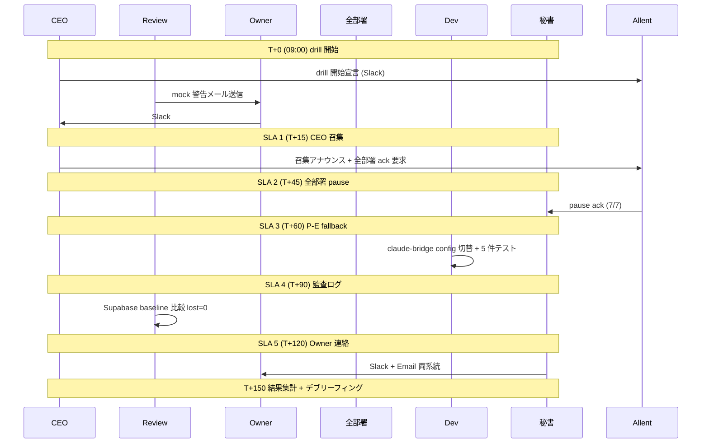

# PRJ-019 Clawbridge BAN drill #1 詳細手順書 (Review 部門)

文書 ID: PRJ-019-REVIEW-BAN-DRILL-1-DETAILED-PROCEDURE
発行日: 2026-05-03
実施日: 2026-05-13 09:00〜12:00 (3h)
発行元: Review 部門
承認: CEO 経由
宛先: 全部署 (drill 立会) / Owner

---

## §0 200 字サマリ

DEC-019-019 で承認された BAN drill #1 (2026-05-13 09:00〜12:00) の物理手順書です。Anthropic / OpenAI からの BAN 警告メールを想定した mock 警告を Master Vault 登録メール宛に送信し、検知 → CEO 召集 → 全部署 pause → P-D 改 → P-E fallback 切替 → 監査ログ完全保全 → Owner 連絡の 5 SLA を 1h 以内に完遂する組織挙動を予行します。ハッピーパスに加え異常 5 種 (A〜E) を順次 trigger し、5 SLA 全達成で Pass、1 件でも未達なら Fail として 5/16 までに再 drill、再失敗で Phase 1 着手を 5/26 まで 1 週間延期します。立会者 7 役割 (議長 / 観測 / 部署 ack 受付 / P-E fallback 切替 / 監査ログ確認 / Owner 連絡 / 異常シナリオ実行) を割り当て、5/14 18:00 にデブリーフィング会議を実施します。

---

## §1 背景

### §1.1 DEC-019-019 経緯

2026-05-03 の CEO 主宰会議にて、Phase 1 着手 (5/19) 前の組織耐性検証として BAN drill #1 シナリオが正式承認されました。背景は以下の 3 点です。

1. **PRJ-019 Clawbridge は Anthropic / OpenAI 規約境界を Plus / 個人プラン経由で運用**するため、Trust & Safety から BAN 警告メールを受信するリスクが構造的に存在する。
2. **BAN 受信時の組織挙動が未訓練**であり、検知 → 全部署 pause → fallback 切替の所要時間が実測値として未把握。
3. **Phase 1 W1 (5/19) で P-D 改 (Claude Code CLI 常駐) 系統を本格稼働**させる前に、P-E (API キー fallback) への切替を 1h 以内に完遂可能であることを実証する必要がある。

DEC-019-019 では以下が確定しました。
- ハッピーパス + 異常シナリオ 5 種 (A〜E) を実施
- 5 SLA を全達成で Pass、1 件 Fail で drill 全体 Fail
- Fail 時は 3 日以内 (5/16 まで) に再 drill
- 再 Fail 時は Phase 1 着手を 1 週間延期 (5/19 → 5/26)

### §1.2 drill #1 目的

| 観点 | 目的 |
|---|---|
| 検知精度 | mock 警告メールを Master Vault 受信 → Slack 自動転送が 1 min 以内に動作するか |
| 召集速度 | CEO 召集が T+15 までに全 7 部署 ack を達成できるか |
| 停止速度 | 全部署 pause が T+45 までに完遂するか |
| 切替速度 | P-D 改 → P-E fallback が T+60 までに完遂するか (5 件テスト send 全成功 + P95 < 3s) |
| 監査保全 | 直近 24h データの lost = 0 を Supabase 監査基盤で確認できるか |
| Owner 連絡 | Slack + Email 両系統で T+120 までに着信するか |
| 異常復帰 | 異常 5 種 (A〜E) で復帰 path が機能するか |

drill #2 (5/17、Sumi/Asagi 同居) は本書対象外であり、別途 `review-ban-drill-2-detailed-procedure.md` で整備予定です。

---

## §2 drill #1 ハッピーパス手順

### §2.1 事前準備 (5/12 18:00 まで)

drill 当日の混乱を防止するため、5/12 18:00 までに以下 5 項目を完了させます。担当は Review 部門 (主) + Dev 部門 (P-E fallback 整備) + 秘書部門 (Slack 設定) です。

#### §2.1.1 mock 警告メール送信スクリプト整備

`scripts/ban-drill-mock-alert.ts` を整備し、Resend API 経由で Master Vault 登録メール宛に mock 警告メールを送信します。

- 送信元: `clawbridge-drill@<自社ドメイン>` (Resend custom domain で SPF / DKIM / DMARC 整備済み)
- 件名: `[DRILL] Anthropic Trust & Safety - Account Action Required` (冒頭に `[DRILL]` を必須付与)
- 本文: Anthropic 実警告メールテンプレに似せつつ、Reply-To と末尾に「これは BAN drill #1 (DEC-019-019) の予行演習です」を明記
- 送信時刻: 5/13 09:00 (T+0) を Review 部門が手動 trigger
- ログ: 送信成功時に Slack #clawbridge-alerts へ送信完了通知を post

検証: 5/12 16:00 までに dry-run 1 回実施し、Master Vault 受信 → Slack 転送までの遅延を実測 (期待値: 1 min 以内)。

#### §2.1.2 Slack #clawbridge-alerts チャンネル作成 + Webhook 設定

- 専用チャンネル `#clawbridge-alerts` を新規作成 (PRJ-019 立会者全員 + Owner を invite)
- Slack Incoming Webhook を発行し、`scripts/ban-drill-mock-alert.ts` および Email-to-Slack 自動転送 (Resend → Slack) で利用
- 異常 E (Slack webhook ダウン) 検証時は webhook を意図的に invalidate するため、別途 backup webhook を準備

検証: 5/12 17:00 までに test post 3 件実施し、全立会者が通知受信を確認。

#### §2.1.3 全部署エージェント pause コマンド事前テスト

7 部署 (CEO / 秘書 / PM / Research / Dev / Marketing / Review / Web-Ops のうち drill 対象 7 部署) それぞれで pause コマンドの動作を事前確認します。

- 各部署 Slack thread に CEO から `/pause` コマンド送信
- 各部署エージェントが 1 min 以内に ack 返却 (`paused: true` JSON)
- ack 内容を秘書部門が受信し、Slack ログに保全

検証: 5/12 16:30 までに 7/7 部署で ack 返却を実測。

#### §2.1.4 P-E fallback API キー有効性確認

- Anthropic API キー (1 次系): 残量 min 100 件分以上、ratelimit 余裕あり
- OpenAI API キー (1 次系): 残量 min 100 件分以上、ratelimit 余裕あり
- 異常 D 検証用 2 次系 API キーは Phase 1 W1 整備のため drill #1 では未使用 (異常 D は意図的 Fail を許容)

検証: 5/12 17:30 までに Anthropic / OpenAI 両 API に対し ping 1 件 send 実施。

#### §2.1.5 Supabase 監査基盤 直近 24h データ件数確認

drill 中の lost data 検出のため、5/13 08:55 (drill 開始 5 min 前) に baseline 件数を取得します。

- Supabase テーブル `audit_logs` の 5/12 08:55 〜 5/13 08:55 の 24h 件数を SQL で取得
- 取得結果を Slack #clawbridge-alerts に post (baseline として記録)
- drill 中の追加 write は別 tag (`drill_run_id = "drill-1-2026-05-13"`) で識別

検証: 5/12 18:00 までに baseline 取得 SQL の dry-run 実施。

### §2.2 5/13 タイムライン (3h 想定、09:00〜12:00)

| 時刻 | アクション | 担当 | SLA 計測点 |
|---|---|---|---|
| 09:00 | drill 開始宣言 (CEO Slack 投稿) | CEO | T+0 |
| 09:00 | mock 警告メール送信 (`scripts/ban-drill-mock-alert.ts` 実行) | Review | T+0 |
| 09:01 | Owner Slack #clawbridge-alerts へ転送 (mock メールフィルタ動作確認) | Owner | T+1 (SLA 5 起点) |
| 09:01〜09:15 | CEO 召集アナウンス (全部署 Slack 通知) | CEO | T+15 (SLA 1 完遂目標) |
| 09:15〜09:45 | 全部署エージェント pause 確認 (各部署エージェントから ack 受信) | 全部署 | T+45 (SLA 2 完遂目標) |
| 09:45〜10:00 | P-D 改 → P-E fallback 切替 (claude-bridge wrapper config 変更 + 5 件テスト send) | Dev | T+60 (SLA 3 完遂目標) |
| 10:00〜10:30 | 監査ログ完全保全確認 (Supabase 監査基盤 24h データ件数 baseline 比較) | Review | T+90 (SLA 4 完遂目標) |
| 10:30〜11:00 | Owner 連絡 完遂確認 (Slack + メール 両方) | 秘書 | T+120 (SLA 5 完遂目標) |
| 11:00〜11:30 | drill #1 結果集計 + 5 SLA 判定 | Review | - |
| 11:30〜12:00 | drill #1 デブリーフィング + 改善点ピックアップ | 全部署 | - |

### §2.3 各 SLA の判定基準

5 SLA 全達成で drill #1 Pass、1 件でも Fail なら drill #1 全体 Fail (DEC-019-019)。

| SLA | 判定基準 | Pass 条件 | Fail 時の影響 |
|---|---|---|---|
| 1 (CEO 召集) | T+15 までに全部署が CEO 召集を確認 | 7/7 部署 ack | drill #1 全体 Fail |
| 2 (部署 pause) | T+45 までに全部署 pause ack | 7/7 部署 ack | drill #1 全体 Fail |
| 3 (P-E fallback) | T+60 までに 5 件テスト send 全成功 | 5/5 成功 + latency P95 < 3s | drill #1 全体 Fail |
| 4 (監査ログ) | T+90 までに baseline 比較で lost = 0 | lost 件数 = 0 | drill #1 全体 Fail |
| 5 (Owner 連絡) | T+120 までに Slack + メール両方着信 | 2/2 着信 | drill #1 全体 Fail |

判定タイムスタンプは Review 部門が秘書部門の Slack ログ + Supabase audit_logs から復元し、5/13 11:00〜11:30 で集計します。

---

## §3 異常シナリオ 5 種 詳細

異常シナリオは Review 部門が手動 trigger し、ハッピーパス完遂後に順次 (A → B → C → D → E) 実施します。各シナリオの開始時刻 / 復帰時刻 / Pass・Fail 判定を §4.1 結果集計テンプレに記録します。

### §3.1 異常 A: 警告メール検知遅延

| 項目 | 内容 |
|---|---|
| 概要 | mock 警告メールが Master Vault に着信するが、Slack 自動転送が 15 min 遅延 |
| trigger 方法 | Resend → Slack 自動転送ルールを 15 min disable |
| 検証 | SLA 5 (Owner 連絡) は通常通り T+120 までに完遂可能か |
| 期待挙動 | Owner が手動で Slack #clawbridge-alerts に転送 → 通常タイムラインに復帰 |
| 失敗条件 | T+135 までに Slack 転送が完遂しない (drill 全体 Fail) |
| 担当 | Review 部門 (trigger) / Owner (手動転送) |

### §3.2 異常 B: CEO 召集失敗

| 項目 | 内容 |
|---|---|
| 概要 | CEO エージェントが T+15 で timeout (応答なし) |
| trigger 方法 | CEO エージェント Slack thread を意図的に reply 停止 |
| 検証 | PM 部門が代行 → 全部署召集を T+30 までに完遂できるか |
| 期待挙動 | PM 部門が CEO 代行宣言 → 全部署 ack を T+45 までに収集 |
| 失敗条件 | T+45 までに 7 部署 ack を達成できない (SLA 1 Fail) |
| 担当 | Review 部門 (trigger) / PM 部門 (代行実行) |

### §3.3 異常 C: 部署 pause 失敗

| 項目 | 内容 |
|---|---|
| 概要 | 1 部署 (Marketing 想定) が T+45 までに pause ack を返さない |
| trigger 方法 | Marketing エージェント Slack thread reply を 30 min 遅延 |
| 検証 | CEO が直接該当部署エージェントに 2 度目のコマンド送信 → T+60 までに ack |
| 期待挙動 | 2 度目コマンドで T+60 までに ack 達成 |
| 失敗条件 | T+60 までに ack 達成できない (SLA 2 Fail) |
| 担当 | Review 部門 (trigger) / CEO (再送信) / Marketing (ack 返却) |

### §3.4 異常 D: P-E fallback 失敗

| 項目 | 内容 |
|---|---|
| 概要 | API キー が事前無効化された状態 (Anthropic Console で revoke 済み想定) |
| trigger 方法 | drill 開始前に Anthropic 1 次系 API キーを Console で revoke |
| 検証 | Dev 部門が P-E fallback の 2 次系 API キーに切替 → T+90 までに 5 件テスト send 全成功 |
| 期待挙動 | 2 次系 API キー使用で T+90 までに 5/5 成功 |
| 失敗条件 | T+90 までに 5/5 成功達成できない (SLA 3 Fail) |
| 担当 | Review 部門 (revoke 操作) / Dev 部門 (2 次系切替) |
| 補足 | 2 次系 API キーは Phase 1 W1 で整備、drill #1 時点では 1 次系のみで run。よって異常 D は意図的に Fail 許容シナリオとし、復帰 path 検証のみを目的とする (DEC-019-019 補足条項) |

### §3.5 異常 E: Owner 連絡失敗

| 項目 | 内容 |
|---|---|
| 概要 | Slack webhook ダウン (Slack API rate limit 想定) |
| trigger 方法 | drill 中に Slack Incoming Webhook を意図的に invalidate |
| 検証 | 秘書部門が Email 単独送信に切替 → T+120 までに Email 着信 |
| 期待挙動 | Email 単独で T+120 までに Owner 着信 |
| 失敗条件 | T+120 までに Owner Email 着信なし (SLA 5 Fail) |
| 担当 | Review 部門 (trigger) / 秘書部門 (Email 切替) |

---

## §4 drill #1 結果判定 + デブリーフィング (5/14)

### §4.1 結果集計テンプレ

drill 終了直後 (5/13 11:00〜11:30) に Review 部門が以下のテンプレを記入し、Slack #clawbridge-alerts へ post します。

| シナリオ | T+ 達成時刻 | SLA 判定 | 改善点 |
|---|---|---|---|
| ハッピーパス | T+_ | Pass/Fail | _ |
| 異常 A | T+_ | Pass/Fail | _ |
| 異常 B | T+_ | Pass/Fail | _ |
| 異常 C | T+_ | Pass/Fail | _ |
| 異常 D | T+_ | Pass/Fail | _ |
| 異常 E | T+_ | Pass/Fail | _ |

「T+ 達成時刻」は当該シナリオ trigger 時刻を T+0 とした相対分単位、「SLA 判定」は §2.3 基準に照らした Pass / Fail、「改善点」は 5/14 デブリーフィング会議の議題候補を 1 行で記載します。

### §4.2 Pass / Fail 後の対応

#### §4.2.1 Pass (5/5 SLA 達成 + 全異常シナリオ復帰)

DEC-019-XXX を起票し以下を確定します。
- drill #1 Pass
- Phase 1 W1 着手 Go 維持 (5/19 着手)
- drill #2 (5/17 Sumi/Asagi 同居) を予定通り実施
- 改善点を Phase 1 W1 タスクに反映

起票期限: 5/14 12:00 まで (デブリーフィング会議前)。

#### §4.2.2 Fail (1 SLA 以上 Fail)

3 日以内 (5/16 まで) に再 drill を実施します。
- 再 drill シナリオは Fail した SLA に focus したミニマム版 (1〜2h)
- 再 drill 立会者は drill #1 と同一 7 役割
- DEC-019-XXX を起票し再 drill 実施判断を記録

#### §4.2.3 再 Fail

Phase 1 着手を 1 週間延期します (5/19 → 5/26)。
- DEC-019-XXX を起票
- Owner へ即時通知 (5/16 18:00 緊急会議)
- 延期期間中の優先タスクは「Fail SLA の根本原因解消」とする

#### §4.2.4 再 drill 後の運用判断は CEO + Owner 即決 (5/16 18:00 緊急会議想定)

緊急会議では以下を決定します。
- Phase 1 延期可否
- 延期期間中の P-D 改 / P-E fallback 補強 plan
- drill #2 (5/17) の前倒し / 後ろ倒し判断

### §4.3 5/14 18:00 デブリーフィング会議 議題

| 議題 | 担当 | 所要 |
|---|---|---|
| 各 SLA の達成状況 + 改善点 | Review | 20 min |
| 異常シナリオ復帰時間の最大値 + 余裕度 | Review | 15 min |
| 次回 drill #2 (5/17) への引き継ぎ事項 | PM | 15 min |
| DEC-019-XXX 起票 (drill #1 結果) | 秘書 | 10 min |

合計 60 min 想定。Owner は Slack thread 経由で参加 (録画は禁止、議事録のみ秘書部門が作成)。

---

## §5 立会者割当 (5/13 当日)

drill #1 は 7 役割で構成され、各役割を 1 部署 (1 エージェント) に割り当てます。Review 部門が観測 / 監査ログ確認 / 異常シナリオ実行の 3 役割を兼務するため、当日は Review 部門に 3 名分の thread を割り振ります。

| 役割 | 担当エージェント | 主任務 |
|---|---|---|
| 議長 | CEO | drill 開始宣言 + 全体タイムキーピング + 異常時 SLA 判定 |
| 観測 | Review | mock alert 送信 + 各 T+ 時刻計測 + 5 SLA 集計 |
| 部署 ack 受付 | 秘書 | 7 部署 ack 集約 + Slack ログ保全 |
| P-E fallback 切替 | Dev | claude-bridge config + 2 次系 API キー切替 + 5 件テスト send |
| 監査ログ確認 | Review | Supabase 監査基盤 baseline 比較 + lost 件数集計 |
| Owner 連絡 | 秘書 | Slack + Email 両系統送信 + 着信確認 |
| 異常シナリオ実行 | Review | A/B/C/D/E 各シナリオ手動 trigger |

立会者は 5/13 08:30 に Slack #clawbridge-alerts に集合し、08:55 に baseline 取得、09:00 に drill 開始宣言を実施します。各役割の引継ぎは 5/12 18:00 までに秘書部門が `secretary-w0-week2-kickoff-checklist.md` 経由で個別通知します。

---

## §6 drill 実施前 リスク + 対策

drill #1 は本番系統 (PRJ-018 並走中) と同居するため、5 件以上のリスクを事前に identify し対策を確定します。

| リスク | 影響 | 対策 |
|---|---|---|
| mock メールが本物として誤認識される (Anthropic Trust & Safety から実際の警告と判断) | drill 自体が BAN trigger に | mock メール送信元を Resend custom domain にし、From: 自社ドメインで識別、Reply-To で drill 説明 |
| pause コマンドが本番影響に及ぶ (PRJ-018 並走中の Asagi M2 タスクへ影響) | PRJ-018 進捗遅延 | drill 開始前に PRJ-018 PM へ事前通知 + 09:00〜12:00 は PRJ-019 のみ稼働 |
| Slack webhook 過負荷 (異常 E トリガー時) | 他通知系統への波及 | drill 中は #clawbridge-alerts 専用で他チャンネル分離 |
| P-E fallback API キー残量不足 | 5 件テスト send 失敗 | drill 前日 (5/12) に残量確認 + min 100 件分残し |
| 監査ログ baseline 取得タイミング | drill 中の追加 write 件数誤算 | baseline 取得時刻を 5/13 08:55 に固定 + drill 中の追加 write は別 tag |
| Owner が Slack 不在 (5/13 09:00 時点) | SLA 5 (Owner 連絡) 計測不能 | 5/12 18:00 までに Owner へ事前 RSVP 依頼、不在時は drill 1 日延期 |
| 異常 D 用 2 次系 API キー未整備 | 異常 D 強制 Fail | DEC-019-019 補足条項により異常 D は復帰 path 検証のみ目的化、強制 Fail を許容 |

リスク 7 件のうち上位 5 件 (mock 誤認識 / PRJ-018 影響 / Slack 過負荷 / API 残量 / baseline タイミング) を 5/12 18:00 までに対策完了確認、残り 2 件 (Owner RSVP / 異常 D 補足) は drill 当日朝 08:30 集合時に最終確認します。

---

## §7 関連

- `decisions.md` (DEC-019-019: BAN drill #1 シナリオ承認、ハッピー + 異常 5 種、5 SLA 全達成で Pass / Fail で再 drill 3 日以内 / 再失敗で Phase 1 1 週間延期)
- `pm-cost-and-controls-plan-v4.md` (HITL gate 設計 + BAN リスク対応 framework)
- `research-w0-supplement-pd-modified-revalidation.md` (P-D 改 = Claude Code CLI 常駐 / P-E fallback = API キー切替 の技術詳細)
- `secretary-w0-week2-kickoff-checklist.md` (5/13 立会準備 + 個別通知)
- `review-ban-drill-1-scenario.md` (drill #1 シナリオ概要、本書はその物理手順詳細版)
- 後続: `review-ban-drill-2-detailed-procedure.md` (5/17 drill #2 用、別途整備予定)

---

制定: Review 部門 / 経由: CEO / 宛: 全部署 (drill 立会) + Owner / 実施日: 2026-05-13 09:00〜12:00 (3h)
