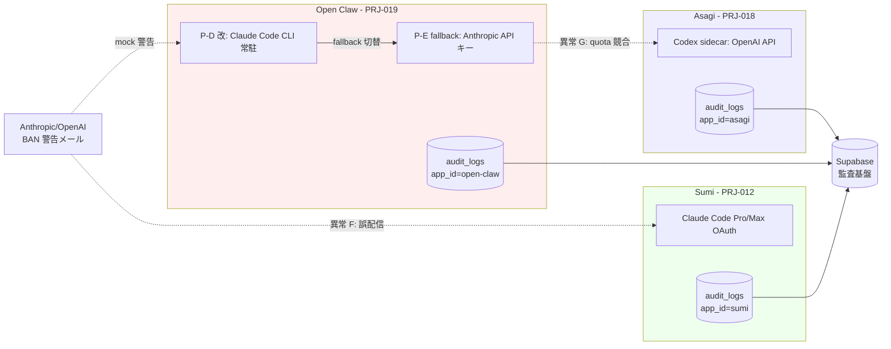
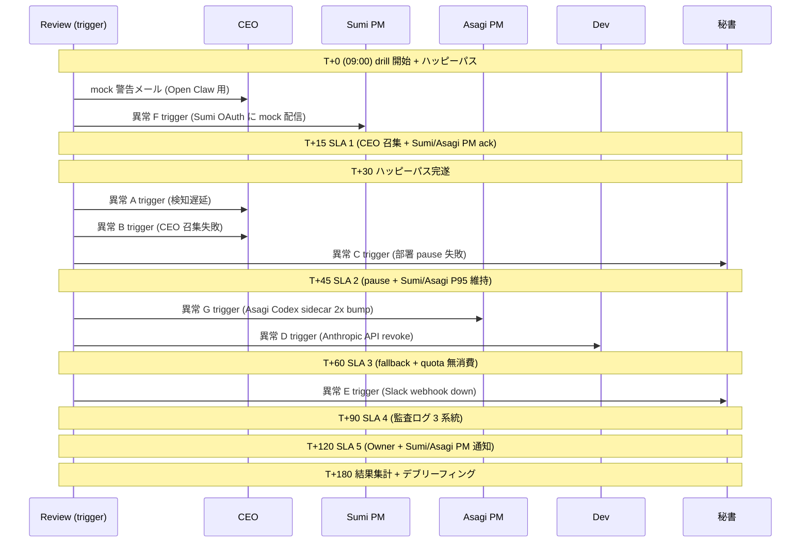

# PRJ-019 Clawbridge BAN drill #2 詳細手順書 (Sumi/Asagi 完全同居版)

文書 ID: PRJ-019-REVIEW-BAN-DRILL-2-SUMI-ASAGI-COEXISTENCE-PROCEDURE
発行日: 2026-05-03
実施日: 2026-05-17 09:00〜13:00 (4h、drill #1 比 +1h)
発行元: Review 部門
承認: CEO 経由
宛先: 全部署 (drill 立会) / Sumi (PRJ-012) PM / Asagi (PRJ-018) PM / Owner

---

## §0 200 字サマリ (drill #1 との差分明記)

DEC-019-019 で承認された BAN drill #2 (2026-05-17 09:00〜13:00、4h) の物理手順書です。drill #1 (5/13) は Open Claw 単体停止検証でしたが、本 drill #2 は **Sumi (PRJ-012) / Asagi (PRJ-018) と 3 アプリ完全同居稼働中** の BAN 隔離検証を行います。差分は (1) 異常 5 → 7 シナリオ拡張 (新規 F: Sumi 経路波及 / G: Asagi Codex sidecar 競合)、(2) 立会 7 → 9 役割 (Sumi 担当 / Asagi 担当 追加)、(3) 5 SLA を巻き添え影響範囲拡大シナリオで再評価、(4) drill 前提として 5/15 OAuth 隔離後実施 + Sumi/Asagi 完全バックアップ取得を追加、(5) drill 後 KPT に Phase 1 W1 着手 (5/19) 影響評価章を新設。3 アプリ同時稼働の巻き添え許容範囲を SLA 別に明記し、Open Claw BAN 時に Sumi/Asagi が無傷で生存することを最終目的とします。

---

## §1 drill #2 の追加目的

### §1.1 drill #1 との目的差分

drill #1 は Open Claw 単体停止 + P-E fallback 切替の 5 SLA 達成を検証する基礎演習でした。drill #2 は同居運用環境下での 3 アプリ独立性 + Open Claw 単独隔離可能性を検証します。

| 観点 | drill #1 (5/13) | drill #2 (5/17) | 差分 |
|---|---|---|---|
| 想定環境 | Open Claw 単体稼働 (PRJ-018 並走は別 Slack で待機) | Sumi / Asagi / Open Claw 3 アプリ同時稼働 | 完全同居 |
| 主目的 | 5 SLA 達成 + 異常 5 種復帰 | 5 SLA 達成 + 異常 7 種復帰 + Sumi/Asagi 無傷生存 | 巻き添え検証追加 |
| 異常シナリオ | 5 種 (A〜E) | 7 種 (A〜E + F + G) | +2 種 |
| 立会役割 | 7 役割 | 9 役割 | +2 役割 |
| 想定時間 | 3h (09:00〜12:00) | 4h (09:00〜13:00) | +1h |
| 巻き添え許容 | 規定なし | SLA 別に明記 | 新規 |
| 実施前提 | mock メール検知系統整備 | 5/15 OAuth 隔離後 + Sumi/Asagi 完全バックアップ | 強化 |

### §1.2 drill #2 固有の検証目的 (5 件)

1. **Open Claw BAN 時の Sumi 経路独立性**: Sumi (PRJ-012) は Claude Code Pro/Max OAuth 経由で稼働しており、Open Claw (P-D 改 = Claude Code CLI 常駐) と OAuth スコープを共有していないことを実測する。
2. **Open Claw BAN 時の Asagi 経路独立性**: Asagi (PRJ-018) は Codex sidecar (OpenAI Codex API) 経由で稼働しており、Open Claw の Anthropic API キー無効化が Asagi の OpenAI API キーへ波及しないことを実測する。
3. **3 アプリ同時 pause 時の Slack 通知混在防止**: Open Claw pause 通知が Sumi / Asagi の通常運用通知に混在せず、`#clawbridge-alerts` 単独チャンネルで完結することを実測する。
4. **Open Claw fallback 切替中の Sumi/Asagi 無停止**: P-D 改 → P-E fallback 切替操作 (claude-bridge config 変更 + 5 件テスト send) 中も Sumi/Asagi の稼働 P95 が SLA 内 (Sumi: < 200ms, Asagi: < 500ms) を維持することを実測する。
5. **3 アプリ監査ログ独立性**: Supabase 監査基盤に書き込まれる 3 アプリのログが drill 中の追加 write を含めて tag (`app_id`) で完全分離可能であることを実測する。

### §1.3 Phase 1 W1 (5/19) 着手判断への影響

drill #2 Pass で Phase 1 W1 (Open Claw 本格稼働) を 5/19 予定通り着手、Fail で 5/19 着手を 5/26 まで 1 週間延期します (DEC-019-019 既定)。Sumi/Asagi 巻き添え発生時の延期判断は §7 で別途定義します。

---

## §2 5 SLA 同居版 再評価

drill #1 の 5 SLA を Sumi/Asagi 巻き添え影響範囲拡大シナリオで再評価し、各 SLA に「巻き添え許容範囲」を追加します。

### §2.1 SLA 1 (CEO 召集) 同居版

| 項目 | drill #1 | drill #2 (同居) | 巻き添え許容 |
|---|---|---|---|
| 期限 | T+15 | T+15 (変更なし) | Sumi/Asagi PM への 通知遅延 max T+5 まで許容 |
| Pass 条件 | 7/7 部署 ack | 7/7 部署 ack + Sumi PM ack + Asagi PM ack = 9/9 | 9/9 必須 |
| Fail 影響 | drill #1 全体 Fail | drill #2 全体 Fail + Sumi/Asagi PM 個別エスカレ | 即時 |
| 巻き添え検出 | 規定なし | Sumi/Asagi 通常運用 Slack に Open Claw 召集通知が混入 = Major 指摘 | Critical 化条件 = Sumi/Asagi 顧客通知系統への漏洩 |

### §2.2 SLA 2 (部署 pause) 同居版

| 項目 | drill #1 | drill #2 (同居) | 巻き添え許容 |
|---|---|---|---|
| 期限 | T+45 | T+45 (変更なし) | Sumi/Asagi 部署 pause は対象外、稼働継続必須 |
| Pass 条件 | 7/7 部署 ack | 7/7 部署 ack (Open Claw 関連のみ) + Sumi/Asagi 稼働 P95 SLA 内維持 | Sumi: P95 < 200ms / Asagi: P95 < 500ms |
| Fail 影響 | drill #1 全体 Fail | drill #2 全体 Fail | Sumi/Asagi P95 違反は Major、稼働停止は Critical |
| 巻き添え検出 | 規定なし | Sumi/Asagi エージェントが pause コマンド誤受信 → 稼働停止 = Critical | Critical 化条件 = 顧客向け稼働 30s 以上停止 |

### §2.3 SLA 3 (P-E fallback) 同居版

| 項目 | drill #1 | drill #2 (同居) | 巻き添え許容 |
|---|---|---|---|
| 期限 | T+60 | T+60 (変更なし) | Sumi OAuth / Asagi OpenAI API キーへの波及禁止 |
| Pass 条件 | 5 件テスト send 全成功 + P95 < 3s | 5 件テスト send 全成功 + P95 < 3s + Sumi/Asagi API quota 無消費確認 | 完全分離 |
| Fail 影響 | drill #1 全体 Fail | drill #2 全体 Fail | Sumi/Asagi quota 消費 = Critical |
| 巻き添え検出 | 規定なし | Open Claw fallback 切替中に Sumi の Claude Code 応答 latency 悪化 = Major | Critical 化条件 = Sumi/Asagi 稼働 timeout |

### §2.4 SLA 4 (監査ログ) 同居版

| 項目 | drill #1 | drill #2 (同居) | 巻き添え許容 |
|---|---|---|---|
| 期限 | T+90 | T+90 (変更なし) | 3 アプリ別 tag (`app_id`) 完全分離 |
| Pass 条件 | lost = 0 (Open Claw のみ) | Open Claw lost = 0 + Sumi lost = 0 + Asagi lost = 0 = 3 系統全 lost = 0 | 3 系統全達成必須 |
| Fail 影響 | drill #1 全体 Fail | drill #2 全体 Fail + Sumi/Asagi データ復元手順起動 | 即時 |
| 巻き添え検出 | 規定なし | Sumi/Asagi の audit_logs に Open Claw drill_run_id が誤混入 = Major | Critical 化条件 = Sumi/Asagi 顧客データ消失 |

### §2.5 SLA 5 (Owner 連絡) 同居版

| 項目 | drill #1 | drill #2 (同居) | 巻き添え許容 |
|---|---|---|---|
| 期限 | T+120 | T+120 (変更なし) | Sumi/Asagi PM への並行通知必須 |
| Pass 条件 | Slack + Email 両系統着信 | Slack + Email 両系統着信 + Sumi PM 通知着信 + Asagi PM 通知着信 = 4/4 | 4/4 必須 |
| Fail 影響 | drill #1 全体 Fail | drill #2 全体 Fail | 即時 |
| 巻き添え検出 | 規定なし | Sumi/Asagi PM 通知が顧客向け Slack に誤送信 = Critical | Critical 化条件 = 顧客通知漏洩 |

### §2.6 3 アプリ同居稼働の隔離アーキテクチャ図

drill #2 は以下の 3 アプリ独立性を前提とします。Open Claw BAN 時に Sumi/Asagi が無傷生存することを実証するための隔離構造を示します。

異常 F は Sumi OAuth スコープへの mock 警告誤配信、異常 G は Open Claw P-E fallback と Asagi Codex sidecar の OpenAI quota 競合を表します。drill #2 の主目的は両点線矢印が遮断されること (silent drop / 専用 pool 分離) を実証することです。

### §2.7 SLA 集計サマリ表 (drill #1 vs drill #2)

| SLA | drill #1 期限 | drill #2 期限 | drill #1 Pass 件数 | drill #2 Pass 件数 | 差分 |
|---|---|---|---|---|---|
| 1 (CEO 召集) | T+15 | T+15 | 7/7 | 9/9 | +2 部署 |
| 2 (pause) | T+45 | T+45 | 7/7 | 7/7 + Sumi/Asagi P95 維持 | P95 監視追加 |
| 3 (fallback) | T+60 | T+60 | 5/5 | 5/5 + quota 無消費 | quota 監視追加 |
| 4 (監査) | T+90 | T+90 | lost=0 (1 系統) | lost=0 (3 系統) | +2 系統 |
| 5 (Owner) | T+120 | T+120 | 2/2 着信 | 4/4 着信 | +2 名 |

---

## §3 異常 7 シナリオ A〜G

drill #1 の 5 シナリオ A〜E に加え、新規 F (Sumi 経路波及) + G (Asagi Codex sidecar 競合) を追加します。シナリオ実行は Review 部門が手動 trigger し、ハッピーパス完遂後に A → B → C → D → E → F → G の順で順次実施します。

### §3.1 異常 A〜E (drill #1 と同一、概略のみ)

| 異常 | 概要 | drill #2 での差分 |
|---|---|---|
| A: 警告メール検知遅延 | Slack 自動転送 15 min 遅延 | Sumi/Asagi PM への遅延通知も同時 trigger、PM 経路独立性確認 |
| B: CEO 召集失敗 | CEO エージェント timeout | PM 代行時に Sumi/Asagi PM への通知漏れ防止確認 |
| C: 部署 pause 失敗 | 1 部署 ack 遅延 | 該当部署が pause 待ち中も Sumi/Asagi が無停止稼働確認 |
| D: P-E fallback 失敗 | Anthropic API キー revoke 状態 | 2 次系切替時に Sumi OAuth quota 無消費を実測 |
| E: Owner 連絡失敗 | Slack webhook ダウン | Email 単独切替時に Sumi/Asagi PM 通知が同時着信確認 |

詳細手順は drill #1 (`review-ban-drill-1-detailed-procedure.md` §3.1〜§3.5) を参照、本書では差分のみ展開。

### §3.2 異常 F: Sumi 経路から Open Claw への影響波及 (新規)

| 項目 | 内容 |
|---|---|
| 概要 | Sumi (PRJ-012) で稼働中の Claude Code OAuth セッションが mock 警告メールを誤検知し、Open Claw 召集通知を Sumi 顧客向け Slack へ誤送信する想定 |
| trigger 方法 | drill 開始時刻 (T+0) で Sumi OAuth セッション 1 つに mock 警告メールを intentionally 配信 (5/15 OAuth 隔離後の残留 cross-listening 検証) |
| 検証 | (1) Sumi OAuth スコープが Open Claw mock メールを silent drop するか、(2) drop しなかった場合に Sumi PM が T+10 までに自部署経路で隔離可能か |
| 期待挙動 | (1) Sumi OAuth スコープが mock メールを silent drop (理想) または (2) Sumi PM が T+10 までに Sumi 顧客向け Slack への漏洩を遮断 |
| 失敗条件 | T+10 までに Sumi 顧客向け Slack に Open Claw 召集通知が漏洩 (Critical = drill 全体 Fail + Phase 1 着手強制延期) |
| 担当 | Review 部門 (trigger) / Sumi PM (隔離実行) / 秘書部門 (Slack ログ保全) |
| 巻き添え影響範囲 | Sumi 顧客 (PRJ-012 ユーザー) への漏洩 = Critical / Sumi 内部 thread への混入 = Major |
| 復帰 path | (1) Sumi PM が漏洩 thread を即時削除 + Sumi 顧客へお詫び通知、(2) DEC-019-XXX 起票で 5/15 OAuth 隔離手順の不備として記録 |

### §3.3 異常 G: Asagi Codex sidecar との競合 (新規)

| 項目 | 内容 |
|---|---|
| 概要 | Open Claw P-E fallback 切替中に Asagi (PRJ-018) Codex sidecar が同一 OpenAI API キープールを参照し、quota 競合 / latency 悪化を引き起こす想定 |
| trigger 方法 | drill 開始時刻 (T+45 = SLA 2 完遂後) で Asagi Codex sidecar の通常 traffic を 2 倍に bump (mock load) し、同時刻に Open Claw P-E fallback 切替 (T+45〜T+60) を開始 |
| 検証 | (1) Open Claw P-E fallback が Asagi 用 OpenAI quota を消費しないか、(2) Asagi 稼働 P95 が SLA 内 (< 500ms) を維持できるか、(3) Asagi Codex sidecar の quota usage を Supabase 監査基盤で実測 |
| 期待挙動 | (1) Open Claw が独立 OpenAI API キー (Open Claw 専用 pool) を使用し、Asagi quota 無消費、(2) Asagi P95 < 500ms 維持 |
| 失敗条件 | (1) Open Claw P-E fallback が Asagi OpenAI quota を 5% 以上消費 (Critical) または (2) Asagi P95 > 1000ms (Major) |
| 担当 | Review 部門 (trigger) / Dev 部門 (P-E fallback 実行) / Asagi PM (quota 監視 + P95 計測) |
| 巻き添え影響範囲 | Asagi 顧客 (PRJ-018 ユーザー) への latency 悪化 = Major / Asagi quota 枯渇 = Critical |
| 復帰 path | (1) Open Claw P-E fallback を Asagi 用とは別 API キープール (Open Claw 専用 pool) に切替、(2) Asagi quota 消費分は Open Claw 予算から相殺、(3) DEC-019-XXX 起票で API キープール完全分離を Phase 1 W2 タスク化 |

### §3.4 異常シナリオ実行順序フロー

---

## §4 各シナリオ判定基準 + 期待行動 + Sumi/Asagi 巻き添え許容範囲

### §4.1 判定基準サマリ表

| シナリオ | Pass 条件 | Fail 条件 | Sumi 巻き添え許容 | Asagi 巻き添え許容 |
|---|---|---|---|---|
| ハッピーパス | 5 SLA 全達成 (9/9 + 5/5 + 3 系統 + 4/4) | 1 SLA Fail | P95 < 200ms 維持 | P95 < 500ms 維持 |
| 異常 A (検知遅延) | T+135 までに Slack 転送完遂 | T+135 超過 | 通常運用無影響 | 通常運用無影響 |
| 異常 B (CEO 失敗) | PM 代行で T+45 までに 9/9 ack | T+45 超過 | PM 代行通知遅延 max 5 min | PM 代行通知遅延 max 5 min |
| 異常 C (pause 失敗) | 2 度目コマンドで T+60 までに ack | T+60 超過 | Sumi 稼働継続 | Asagi 稼働継続 |
| 異常 D (fallback 失敗) | 2 次系切替で T+90 までに 5/5 成功 | T+90 超過 | OAuth quota 無消費 | OpenAI quota 無消費 |
| 異常 E (Owner 失敗) | Email 単独で T+120 までに着信 | T+120 超過 | 顧客向け Slack 漏洩なし | 顧客向け Slack 漏洩なし |
| 異常 F (Sumi 波及) | T+10 までに Sumi 顧客向け Slack 漏洩遮断 | 漏洩発生 | 顧客漏洩 = Critical (drill 全体 Fail) | - |
| 異常 G (Asagi 競合) | Open Claw P-E が Asagi quota 5% 未満消費 | 5% 以上消費 | - | quota 5% 以上消費 = Critical |

### §4.2 期待行動 詳細 (新規 F / G のみ)

#### §4.2.1 異常 F 期待行動

1. **T+0**: Review 部門が Sumi OAuth セッション 1 つに mock 警告メールを intentionally 配信。
2. **T+0〜T+5**: Sumi OAuth スコープが mock メールを検知し、`silent drop` (理想) または `cross-listen warning` を出力。
3. **T+5〜T+10**: Sumi PM が cross-listen warning を受信した場合、Sumi 顧客向け Slack への漏洩を T+10 までに遮断 (該当 thread を read-only 化 + 削除権限行使)。
4. **T+10〜T+15**: Sumi PM が CEO に異常 F 結果を ack 報告 (silent drop 成功 / 漏洩遮断成功 / 漏洩発生 のいずれか)。
5. **T+30**: Review 部門が判定 (Pass / Fail)。

#### §4.2.2 異常 G 期待行動

1. **T+45**: Review 部門が Asagi Codex sidecar の通常 traffic を 2 倍に bump (mock load 開始)。
2. **T+45〜T+60**: Dev 部門が Open Claw P-E fallback 切替を実行 (claude-bridge config 変更 + 5 件テスト send)。
3. **T+45〜T+60**: Asagi PM が quota usage + P95 を 30s 間隔で実測し、Supabase 監査基盤に書き込み。
4. **T+60〜T+75**: Review 部門が Open Claw P-E fallback の OpenAI quota 消費先を確認 (Open Claw 専用 pool / Asagi 用 pool のどちらか)。
5. **T+75〜T+90**: Review 部門が判定 (Pass / Fail)。

### §4.3 Sumi/Asagi 巻き添え許容範囲 集計表

| 影響種別 | Major 化条件 | Critical 化条件 | drill 判定 |
|---|---|---|---|
| Sumi 内部 thread への通知混入 | 1 件以上混入 | - | Major (drill 継続) |
| Sumi 顧客向け Slack への漏洩 | - | 1 件以上漏洩 | Critical (drill 全体 Fail) |
| Sumi 稼働 P95 悪化 | 200〜500ms | > 500ms | Major (200〜500) / Critical (> 500) |
| Sumi OAuth quota 消費 | 1〜10 件分 | > 10 件分 | Major (1〜10) / Critical (> 10) |
| Asagi 内部 thread への通知混入 | 1 件以上混入 | - | Major (drill 継続) |
| Asagi 顧客向け Slack への漏洩 | - | 1 件以上漏洩 | Critical (drill 全体 Fail) |
| Asagi 稼働 P95 悪化 | 500〜1000ms | > 1000ms | Major (500〜1000) / Critical (> 1000) |
| Asagi OpenAI quota 消費 | 1〜5% | > 5% | Major (1〜5%) / Critical (> 5%) |

---

## §5 立会者 9 役割 (drill #1 7 役割 + Sumi 担当 + Asagi 担当)

drill #2 は Sumi/Asagi PM 2 名を加えた 9 役割で構成されます。Review 部門が引き続き 3 役割兼務 (観測 / 監査ログ / 異常シナリオ実行) を担当します。

| 役割 | 担当 | 主任務 | drill #1 比 差分 |
|---|---|---|---|
| 議長 | CEO | drill 開始宣言 + 全体タイムキーピング + SLA 判定 | 変更なし |
| 観測 | Review | mock alert 送信 + T+ 計測 + 5 SLA 集計 | 変更なし |
| 部署 ack 受付 | 秘書 | 9 部署 ack 集約 (7 部署 + Sumi/Asagi PM) + Slack ログ保全 | 7 → 9 ack |
| P-E fallback 切替 | Dev | claude-bridge config + 2 次系切替 + 5 件テスト send | API プール分離確認追加 |
| 監査ログ確認 | Review | Supabase 3 系統 (Open Claw/Sumi/Asagi) baseline 比較 | 1 → 3 系統 |
| Owner 連絡 | 秘書 | Slack + Email + Sumi PM + Asagi PM = 4/4 着信 | 2 → 4 着信 |
| 異常シナリオ実行 | Review | A〜G 7 シナリオ手動 trigger | 5 → 7 シナリオ |
| **Sumi 担当 (新規)** | Sumi PM | Sumi OAuth スコープ独立性確認 + 異常 F 隔離実行 + Sumi 稼働 P95 監視 | 新規 |
| **Asagi 担当 (新規)** | Asagi PM | Asagi Codex sidecar quota 監視 + 異常 G mock load 実行 + Asagi 稼働 P95 監視 | 新規 |

立会者は 5/17 08:30 に Slack #clawbridge-alerts に集合し、08:45 に 3 系統 baseline 取得 (Open Claw / Sumi / Asagi)、09:00 に drill 開始宣言を実施します。Sumi/Asagi PM は 5/15 OAuth 隔離後の最終動作確認 (5/16 18:00) で事前 briefing を受領済みであることが必須です。

---

## §6 drill 前リスク (Sumi/Asagi 完全バックアップ前提、5/15 OAuth 隔離後実施)

drill #2 は Sumi/Asagi 本番系統と 3 アプリ同居稼働するため、drill #1 比でリスク件数を 7 → 12 件に拡張します。5/15 までに 12 件全対策完了確認を必須とします。

### §6.1 drill #1 既存リスク 7 件 (再掲 + 同居化差分)

| リスク | drill #1 影響 | drill #2 同居化差分 | 対策 |
|---|---|---|---|
| mock メール本物誤認識 | drill 自体が BAN trigger | Sumi/Asagi 経由で誤認識リスク追加 | 5/15 OAuth 隔離 + From: 自社ドメイン |
| pause コマンド本番影響 | PRJ-018 進捗遅延 | Sumi/Asagi 本番影響 | drill 開始前に Sumi/Asagi PM へ事前通知 + 09:00〜13:00 専用 channel |
| Slack webhook 過負荷 | 他通知系統波及 | Sumi/Asagi 顧客通知系統への波及 | #clawbridge-alerts 専用 + Sumi/Asagi 顧客 channel と分離 |
| P-E fallback API 残量不足 | 5 件テスト失敗 | Asagi OpenAI quota 競合 | API プール完全分離 + 残量 min 200 件分 |
| 監査ログ baseline タイミング | 件数誤算 | 3 系統 baseline 同時取得失敗 | 3 系統 baseline 取得時刻を 5/17 08:45 に固定 |
| Owner 不在 | SLA 5 計測不能 | Sumi/Asagi PM 不在追加 | 5/16 18:00 までに 3 名 (Owner/Sumi/Asagi) RSVP 必須 |
| 異常 D 用 2 次系 API 未整備 | 強制 Fail | drill #2 では 2 次系整備済み前提 | drill #2 では異常 D 強制 Fail 許容なし、5/15 までに 2 次系整備完了 |

### §6.2 drill #2 新規リスク 5 件

| リスク | 影響 | 対策 |
|---|---|---|
| 5/15 OAuth 隔離手順不備 | 異常 F 強制 Fail (Sumi 顧客漏洩) | 5/14 までに OAuth 隔離手順を Sumi PM レビュー + 5/15 隔離後 24h 観察期間 |
| Sumi/Asagi バックアップ未取得 | drill 中障害時の復旧不可 | 5/16 18:00 までに Sumi/Asagi 完全バックアップ取得 (Supabase + Vercel deployment snapshot) |
| 3 アプリ同時稼働で Slack notification rate limit 抵触 | drill 通知遅延 | 5/16 までに Slack workspace の rate limit 上限確認 + 必要に応じて Slack Pro 一時アップグレード |
| Sumi 顧客が 5/17 09:00〜13:00 に大量問合せ | Sumi PM が drill 専念不可 | 5/16 18:00 までに Sumi 顧客向けに 5/17 09:00〜13:00 の low-priority window 告知 |
| Asagi Codex sidecar mock load の本番影響 | Asagi 顧客 latency 悪化 | mock load を Asagi 専用 staging pool に切替実行 (本番 pool 無影響) |

### §6.3 drill 前提 (5/15 OAuth 隔離 + バックアップ取得)

drill #2 は以下 3 件を 5/16 18:00 までに完了することが必須前提です。1 件でも未完なら drill 1 日延期 (5/18 09:00 開始) を即決します。

1. **5/15 OAuth 隔離完了**: Sumi (PRJ-012) Claude Code OAuth スコープと Open Claw (P-D 改) スコープを完全分離。隔離手順は `research-w0-supplement-pd-modified-revalidation.md` §X 参照。
2. **5/16 Sumi/Asagi 完全バックアップ取得**: Supabase テーブル全 dump + Vercel deployment snapshot + 環境変数バックアップ。3 系統独立保管。
3. **5/16 18:00 立会者 9 名 RSVP**: CEO / Review (3 役割兼務) / 秘書 / Dev / Sumi PM / Asagi PM / Owner の 9 名全員から RSVP 取得。

---

## §7 drill 後 KPT + Phase 1 W1 着手 (5/19) 影響評価

### §7.1 5/18 18:00 デブリーフィング会議 議題

drill #2 結果集計 + KPT 振り返り + Phase 1 W1 影響評価を 90 min で実施します。

| 議題 | 担当 | 所要 |
|---|---|---|
| 各 SLA 達成状況 (5 SLA × 同居版) + 改善点 | Review | 25 min |
| 異常 7 シナリオ復帰時間 + Sumi/Asagi 巻き添え集計 | Review | 20 min |
| KPT 振り返り (Keep / Problem / Try) | 全部署 | 25 min |
| Phase 1 W1 着手 (5/19) 影響評価 + Go/No-Go 判定 | CEO + Review | 15 min |
| DEC-019-XXX 起票 (drill #2 結果 + Phase 1 W1 判定) | 秘書 | 5 min |

### §7.2 KPT テンプレート (drill #2 専用)

| 区分 | drill #2 固有観点 |
|---|---|
| Keep | 9 役割体制 / 3 系統 baseline 同時取得 / Sumi/Asagi PM 事前 briefing / mock load の staging 分離 |
| Problem | 巻き添え発生 (発生時のみ) / Slack rate limit 接近 (発生時) / 異常 F/G 復帰時間超過 (発生時) |
| Try | API プール完全分離の Phase 1 W2 タスク化 / Sumi/Asagi 顧客向け事前告知の自動化 / 3 アプリ稼働 dashboard 統合 |

### §7.3 Phase 1 W1 着手 (5/19) Go/No-Go 判定基準

| drill #2 結果 | Phase 1 W1 着手判定 | 補足対応 |
|---|---|---|
| 5 SLA 全達成 + 異常 7 全 Pass + 巻き添え Critical なし | Go (5/19 着手予定通り) | 改善点を Phase 1 W1 タスクに反映 |
| 5 SLA 達成 + 異常 1〜2 件 Major + 巻き添え Critical なし | 条件付き Go (5/19 着手 + Major 修正タスク Phase 1 W1 内完了) | Major 修正担当を Dev に割当 |
| 1 SLA 以上 Fail or 異常 Critical 1 件 + 巻き添え Critical なし | No-Go (5/19 着手 1 週間延期 → 5/26) | 5/20 までに再 drill 実施 |
| 巻き添え Critical 1 件以上 (Sumi/Asagi 顧客漏洩 or 顧客データ消失) | No-Go (5/19 着手 2 週間延期 → 6/2) + 緊急対応 | Sumi/Asagi 顧客お詫び + DEC-019-XXX 起票 + 根本原因解消まで Phase 1 着手凍結 |

### §7.4 Phase 1 W1 着手 (5/19) 影響評価サマリ

drill #2 結果が Phase 1 W1 (Open Claw 本格稼働) の以下 5 タスクへ与える影響を評価します。

| Phase 1 W1 タスク | drill #2 結果が影響する観点 | drill #2 Pass 時 | drill #2 Fail 時 |
|---|---|---|---|
| Open Claw 本格稼働開始 | 5 SLA 体制が実証されているか | 5/19 開始 | 5/26 開始 |
| Claude Code CLI 常駐 production deploy | P-E fallback 切替時間が実証されているか | 5/19 deploy | 5/26 deploy |
| 監査ログ 3 系統独立性 | Sumi/Asagi 監査ログ独立性が実証されているか | 5/19 deploy | 再 drill 後 deploy |
| Sumi/Asagi 同居運用 SLA 開始 | 巻き添え許容範囲が実証されているか | 5/19 SLA 開始 | 巻き添え原因解消後開始 |
| API プール完全分離 (Open Claw / Asagi) | 異常 G で実証されているか | Phase 1 W2 へ送り | Phase 1 W1 で前倒し対応 |

---

## §8 関連ファイル

- `decisions.md` (DEC-019-019: BAN drill #1/#2 シナリオ承認、5 SLA 全達成で Pass / Fail で再 drill 3 日以内 / 再失敗で Phase 1 1 週間延期)
- `review-ban-drill-1-detailed-procedure.md` (drill #1 詳細手順、本書はその同居版差分展開)
- `review-ban-drill-1-scenario.md` (drill #1 シナリオ概要)
- `pm-cost-and-controls-plan-v4.md` (HITL gate 設計 + BAN リスク対応 framework)
- `research-w0-supplement-pd-modified-revalidation.md` (P-D 改 / P-E fallback 技術詳細 + OAuth 隔離手順)
- `secretary-w0-week2-kickoff-checklist.md` (5/13 + 5/17 立会準備 + 個別通知)
- 後続: `review-ban-drill-2-result-report.md` (5/18 デブリーフィング後に発行予定、drill #2 結果 + Phase 1 W1 着手判定)
- 関連プロジェクト: `projects/PRJ-012/` (Sumi 案件)、`projects/PRJ-018/` (Asagi 案件)

---

制定: Review 部門 / 経由: CEO / 宛: 全部署 (drill 立会) + Sumi PM + Asagi PM + Owner / 実施日: 2026-05-17 09:00〜13:00 (4h) / 前提: 5/15 OAuth 隔離 + 5/16 Sumi/Asagi 完全バックアップ完了
