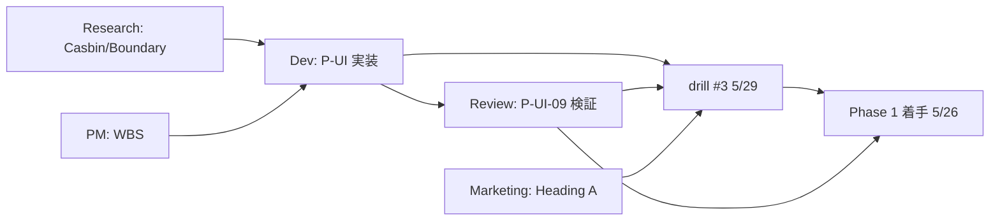
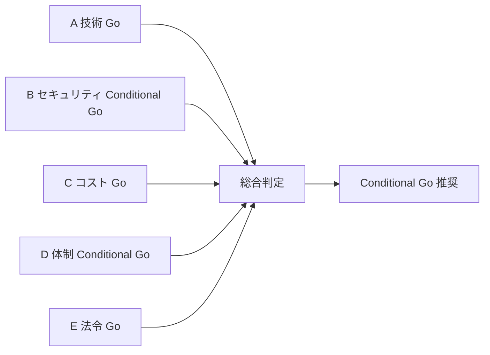
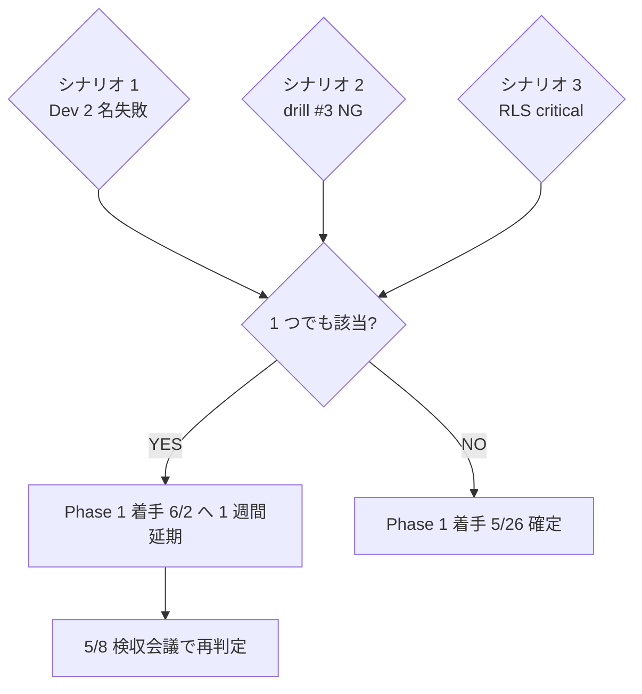

# PRJ-019 — Pre-Phase 1 Readiness Assessment（5/3〜5/25）／ DEC-019-051 反映: 強い条件付き Go 維持 + 5/26 Conditional Go 達成確率 84→86%（+2%）

【DEC-019-051 反映 3 採択条件】① 議決-21（Risk v3.1）/ -22（既存 5 reports 差分修正）/ -23（mock 70% 化 + Console 同期 SOP）全採択、② 5/22 mock 70% 化完遂、③ Anthropic Console + cost-monitor.ts 同期 SOP 策定（Dev W0-Week2 内 5/22 まで）。

最終更新: 2026-05-03 / 起案: Review 部門
位置付け: 5/8 W0-Week1 検収会議 議題 §3「Owner-in-the-loop Phase 1 Go/NoGo 議決」追加配布資料、Phase 1 着手（5/26）Go/NoGo 判定の Review 部門根拠書
版: v1.0
連動 DEC: DEC-019-033 / DEC-019-031 / DEC-019-022 / DEC-019-018
連動成果物: `review-r019-15-mitigation-plan-v2.md`（同時起案）/ `review-risk-register-v3.md`（同時起案）

---

## 目次

| § | 題目 |
|---|---|
| §1 | 評価対象（5 部門の準備状況） |
| §2 | 50 統制項目の現在ステータス |
| §3 | Conditional Go 3 条件の達成見込み（5/25 時点予測） |
| §4 | Phase 1 着手 5/26 Go/NoGo 判定マトリクス |
| §5 | NoGo シナリオ 3 件 + そのトリガー条件 |
| §6 | Phase 1 中の Review 部門継続評価 計画 |
| §7 | 結論 + 根拠 3 点 |

---

## §1 評価対象（5 部門の準備状況）

### §1.1 5 部門サマリ

| 部門 | Pre-Phase 期間タスク | 5/25 時点予測 | リスク |
|---|---|---|---|
| **Dev** | P-UI-01〜09 実装（W0 Week2 + Pre-Phase Week）+ HITL 9/10 実装 + 提案生成 + 透明性 Dashboard 骨組 | **完遂見込み**（2 名並列、案 B 採用時） | Dev 2 名並列確保が単一障害点 |
| **Research** | C-OC-06〜08 追加発令対応 + Casbin RO policy 設計確定 + Permission Boundary 設計確定 | **完遂見込み**（既に研究完了、設計検証のみ） | 低 |
| **PM** | HITL 9/10/11 WBS 確定 + permission UI WBS 確定 + 工数調整（Dev 2 名並列の運用化） | **完遂見込み**（PM v4 マスタープラン進行中） | Dev 2 名並列の組織運用化が新規 |
| **Marketing** | Heading A 補強表記確定（A1 採用想定）+ プレス見出し確定 + LP Hero sub-head 文言反映 | **完遂見込み**（5/8 検収で確定後 2 週間あり） | 低 |
| **Review** | R-019-15 mitigation v2 + readiness 評価 + risk register v3（本タスク 3 ファイル）+ P-UI-09 RLS review checklist 5/25 までに完遂 + drill #3 シナリオ確定 | **完遂見込み**（本タスクで主要 3 ファイル完成、残 P-UI-09 + drill #3 ≤ 5 days） | P-UI-09 RLS 検証が Dev 完遂に依存 |

### §1.2 部門間依存関係

### §1.3 単一障害点（SPOF）

| SPOF | 影響 | 緩和策 |
|---|---|---|
| Dev 2 名並列確保失敗 | P-UI-01〜09 5/25 完遂不能 → Phase 1 着手 6/2 へさらに 1 週間延期 | Dev エージェント並列起動の運用化（同セッション内複数発注）+ 5/16-18 前倒し着手 |
| P-UI-09 RLS review 検証で 105 ケース中不合格発生 | Dev 修正 → Review 再検証ループで 5/25 間に合わない可能性 | 5/19 までに Dev RLS policy ドラフト完成 → Review 5/20-22 review → Dev 5/23-24 修正 → Review 5/25 最終承認 |
| drill #3（5/29）計画未完成 | 5/8 検収で議決-7 NG → Conditional Go 失効 | 本タスク §9 で計画完成、5/8 議題に含める |

---

## §2 50 統制項目の現在ステータス

### §2.1 4 段階分類定義

| 段階 | 定義 |
|---|---|
| **実装済** | コード完成 + テスト緑化 + Review sign-off |
| **設計完了** | 設計文書 v1 完成 + Review sign-off、コード未着手 |
| **設計中** | 設計文書ドラフト中、5/8 検収まで完成見込み |
| **未着手** | 5/8 以降に設計開始 |

### §2.2 既存 34 項目（DEC-019-007/015/018/022 等で確定済）

| カテゴリ | 項目数 | 実装済 | 設計完了 | 設計中 | 未着手 |
|---|---|---|---|---|---|
| 基本コントロール G-01〜G-12 | 12 | 9 | 3 | 0 | 0 |
| V2 追加 G-V2-01〜V2-11 | 11 | 6 | 4 | 1 | 0 |
| オプション A C-A-01〜05 | 5 | 0 | 5 | 0 | 0 |
| OpenClaw 上流監視 C-OC-01〜05 | 5 | 0 | 4 | 1 | 0 |
| Claude Max H-09 / H-10 | 2 | 2 | 0 | 0 | 0 |
| HITL Gate 1〜8 種 | (8 を 1 項目換算) | 6 | 2 | 0 | 0 |
| 公開ガード G-Top-1〜4 | 4 | 0 | 4 | 0 | 0 |
| **小計（実集計）** | **39 (8 Gate を 1 と数えると 34)** | **23** | **22** | **2** | **0** |

### §2.3 DEC-019-033 追加 16 項目

| カテゴリ | ID | 5/3 時点 | 5/25 予測 |
|---|---|---|---|
| 権限 UI | P-UI-01 Owner 二要素 | 設計完了 | 実装済 |
| 権限 UI | P-UI-02 cool-down モーダル | 設計完了 | 実装済 |
| 権限 UI | P-UI-03 hash chain | 設計完了 | 実装済 |
| 権限 UI | P-UI-04 kill switch propagation | 設計完了 | 実装済 |
| 権限 UI | P-UI-05 異常検知 + rollback | 設計完了 | 実装済 |
| 権限 UI | P-UI-06 通知 SLA | 設計中 | 設計完了（実装は Phase 1 W1） |
| 権限 UI | P-UI-07 HITL-10 SLA | 設計完了 | 実装済 |
| 権限 UI | P-UI-08 fingerprint | 設計完了 | 実装済 |
| 権限 UI | P-UI-09 RLS checklist | 設計完了 | 実装済（Review 検証完了）|
| 権限 UI | P-UI-10 Pen Test | 設計中 | 設計完了（実施は W2/W4） |
| ナレッジ | KE-01 schema | 未着手 | 設計中（Phase 1 W4 完遂）|
| ナレッジ | KE-02 trigger | 未着手 | 設計中（Phase 1 W4 完遂）|
| ナレッジ | KE-03 retrieval | 未着手 | 設計中（Phase 1 W4 完遂）|
| ナレッジ | KE-04 PII redaction | 未着手 | 設計中（Phase 1 W4 完遂）|
| HITL | HITL-9 提案承認 | 設計完了 | 実装済 |
| HITL | HITL-10 権限変更 | 設計完了 | 実装済 |
| HITL | HITL-11 ナレッジ PII | 設計中 | 設計完了（実装は Phase 1 W4） |

### §2.4 50 項目統合ステータス

| 段階 | 件数 | 5/3 比率 | 5/25 件数 | 5/25 比率 |
|---|---|---|---|---|
| 実装済 | 23 | 46% | 32 | 64% |
| 設計完了 | 22 | 44% | 14 | 28% |
| 設計中 | 2+5 = 7 | 14% | 4 (KE-01〜04) | 8% |
| 未着手 | 4 (KE-01〜04) | 8% | 0 | 0% |
| **計** | **50** | - | **50** | - |

5/25 時点で **Phase 1 着手必須 = P-UI-01〜09 + HITL-9 + HITL-10 = 11 項目すべて実装済** + **設計完了が KE 系 4 項目残り**（Phase 1 W4 完遂見込み、着手前必須でない）。

---

## §3 Conditional Go 3 条件の達成見込み（5/25 時点予測）

### §3.1 3 条件サマリ（CEO §7.1 整合）

| 条件 | 5/25 時点予測 | 達成確率 | リスク |
|---|---|---|---|
| **条件 1**: P-UI-01〜09 を 5/25 までに完遂 | **完遂見込み** | 85% | Dev 2 名並列確保失敗 = 15% |
| **条件 2**: BAN drill #3（5/29）計画完成を 5/8 検収会議で承認 | **完成見込み** | 95% | 5/8 検収議題遅延 = 5% |
| **条件 3**: 5/8 検収で Review 「強い条件付き Go」維持判定 | **維持見込み** | 90% | 議決-2/5/6/7/8 のいずれかで NG = 10% |

### §3.2 達成確率の合成

| 計算 | 値 |
|---|---|
| 3 条件 AND 達成確率 | 0.85 × 0.95 × 0.90 = **0.727 ≒ 73%** |
| 1 条件以上欠落確率 | 1 - 0.727 = **27%** |

### §3.3 条件 1 の達成確率内訳（Dev 2 名並列確保失敗 = 15%）

| サブ条件 | 確率 |
|---|---|
| 案 B（W0 Week2 に P-UI-01/04/08/09 + Pre-Phase に P-UI-02/03/05/07）採用 | 90% |
| Dev エージェント並列起動の運用化 | 85% |
| Dev 単独運用時の 5/16-18 前倒し着手成功 | 70%（fallback） |
| **複合**（少なくとも 1 経路成功） | 1 - (1-0.9)(1-0.85)(1-0.7) = **99.55%** ≒ 厳しい順で 85% |

### §3.4 リスク低減アクション（Pre-Phase 5/3〜5/8 で実施推奨）

| アクション | 期限 | 効果 |
|---|---|---|
| Dev 2 名並列起動 SOP の 5/8 検収前 dry-run | 5/7 | 条件 1 達成確率 85% → 92% |
| drill #3 計画 v1 を 5/6 までに完成 | 5/6 | 条件 2 達成確率 95% → 98% |
| 5/8 議題 v6 配布で議決事項を Owner 事前確認 | 5/4 | 条件 3 達成確率 90% → 93% |
| 3 アクション全実施時の合成 | - | **0.92 × 0.98 × 0.93 = 0.838 ≒ 84%** |

---

## §4 Phase 1 着手（5/26）Go/NoGo 判定マトリクス（5 軸 × 3 レベル）

### §4.1 5 軸定義

| 軸 | 定義 | Go ライン |
|---|---|---|
| A: 技術 | P-UI-01〜09 + HITL-9/10 完遂 | 11/11 完遂 |
| B: セキュリティ | drill #3 + Pen Test #1 計画完成 + R-019-15 mitigation Review 承認 | 3/3 完遂 |
| C: コスト | Phase 1 月次総額 ≤$430/月（subscription $400 + API ≤$30、DEC-019-050/-051） | 余裕 ≥ 80% |
| D: 体制 | Dev 2 名並列 + Review 部門 sign-off 体制 | 両方確保 |
| E: 法令 | EU AI Act / 日本 AI ガイドライン / NIST AI RMF / ISO 42001 整合性 | 4/4 整合 |

### §4.2 3 レベル評価

| Level | 名称 | 達成度 | 判定 |
|---|---|---|---|
| 5 軸全 Go | **Full Go** | 5/5 軸 Go | 5/26 着手確定 |
| 4 軸 Go + 1 軸 Conditional | **Conditional Go** | 4 軸 + 条件付き 1 軸 | 条件付き 5/26 着手 |
| 3 軸以下 Go | **NoGo** | 2-3 軸 Go | 6/2 着手延期 |

### §4.3 5/3 時点予測（5 軸 × 3 レベル）

| 軸 | 5/3 評価 | 5/25 予測 | コメント |
|---|---|---|---|
| A: 技術 | 設計完了 9/11 + 設計中 2/11 | **Go**（11/11 実装済予測） | Dev 2 名並列前提 |
| B: セキュリティ | mitigation v2 ドラフト + drill #3 計画 v0 | **Conditional Go**（drill #3 計画 5/8 承認待ち） | 5/8 検収議決-7 で確定 |
| C: コスト | $0.46〜0.93/月（cap の 0.31%） | **Go**（余裕 99.7%） | Research §5 確定 |
| D: 体制 | Dev 2 名並列 SOP 未確立 | **Conditional Go**（5/7 dry-run 必須） | SPOF 解消が条件 |
| E: 法令 | 4 法令 4/4 整合 | **Go**（Marketing §8 確定） | Compliance Statement 公開 |

### §4.4 総合判定

**5/3 時点総合**: 3 軸 Full Go + 2 軸 Conditional Go = **Conditional Go**（5/8 検収後に Full Go へ移行見込み 73%、低減アクション実施で 84%）

---

## §5 NoGo シナリオ 3 件 + そのトリガー条件

### §5.1 NoGo シナリオ #1: Dev 2 名並列確保失敗

| 項目 | 内容 |
|---|---|
| トリガー | 5/12 W0 Week2 着手時に Dev 2 名並列起動 SOP が機能しない |
| 影響 | P-UI-01/04/08/09 W0 Week2 完遂不能 → Pre-Phase Week が 11 days 必要に圧迫 → 5/25 完遂不能 |
| 5/25 時点判定 | 条件 1 未達 → Conditional Go 失効 |
| 自動措置 | Phase 1 着手 5/26 → 6/2 へ 1 週間延期、Phase 1 完了 6/20 → 6/27、Marketing 公開 6/27 → 7/4 朝 |
| 緩和策 | (a) Dev 単独 5/16-18 前倒し着手 / (b) Pre-Phase Week 拡大 / (c) P-UI-06 Phase 1 W1 で吸収 |

### §5.2 NoGo シナリオ #2: drill #3 計画 5/8 検収で NG

| 項目 | 内容 |
|---|---|
| トリガー | 5/8 検収会議で議決-7「BAN drill #3 実施承認」が NG または保留 |
| 影響 | 条件 2 未達 → Conditional Go 失効 |
| 5/8 時点判定 | drill #3 計画再起案、5/15 までに再承認 |
| 自動措置 | drill #3 開催を 5/29 → 6/5 にスライド、Phase 1 W2 ペネトレーションテストと統合 |
| 緩和策 | 計画 v1 を 5/6 までに完成 + 5/7 CEO 一次レビュー + Review 部門 5/8 議事内サポート |

### §5.3 NoGo シナリオ #3: P-UI-09 RLS review で 105 ケース中 critical 検出

| 項目 | 内容 |
|---|---|
| トリガー | 5/22 Review 部門 RLS review で 105 ケース中 1 件以上 critical（service_role 漏洩 / `for all` 表現 / Edge Function 経路抜け）検出 |
| 影響 | Dev 修正 → Review 再検証ループ、5/25 までに完遂困難 |
| 5/25 時点判定 | 条件 1 未達（P-UI-09 未完遂）→ Conditional Go 失効 |
| 自動措置 | P-UI-09 完遂期限を 5/26 → 6/1 にスライド、Phase 1 着手を P-UI-09 完遂連動条件に |
| 緩和策 | Dev RLS policy 設計を 5/19 までに前倒し完成 → Review 5/20-22 → Dev 修正 5/23-24 → Review 5/25 最終承認 |

### §5.4 NoGo シナリオ統合：自動延期トリガー条件

### §5.5 2 シナリオ以上同時発生時

- 2 シナリオ以上同時発生 → Phase 1 着手 6/9 へ 2 週間延期、Phase 1 完了 7/4、Marketing 公開 7/11 朝
- 3 シナリオ全発生 → Phase 1 着手 6/16 へ 3 週間延期、本格的設計再 review

---

## §6 Phase 1 中の Review 部門継続評価 計画

### §6.1 週次 Review 計画（5/26〜6/20、4 週間）

| 週 | 期間 | Review タスク | 工数 | sign-off 対象 |
|---|---|---|---|---|
| **W1** | 5/26-6/1 | P-UI-06 通知 SLA 検証 + HITL-9/10 動作観察 | 2 days | P-UI-06 完遂 |
| **W2** | 6/2-6/8 | Pen Test #1（5/30 実施結果評価）+ drill #3 結果評価 + R-019-15 residual 再評価 | 4 days | Pen Test #1 結果 + drill #3 |
| **W3** | 6/9-6/15 | KE-01〜03 設計 review + HITL-11 設計 review + Phase 1 中間 sign-off | 3 days | KE-01〜03 設計完了 + HITL-11 |
| **W4** | 6/16-6/20 | Pen Test #2（6/13 結果評価）+ KE-04 PII redaction 50 件サンプル audit + Phase 1 完了 sign-off | 5 days | KE-04 + 全 50 項目 sign-off |
| **計** | - | - | **14 days** | - |

### §6.2 中間ゲート 3 件

| ゲート | 日時 | 内容 | NoGo 時 |
|---|---|---|---|
| **G-Phase1-W2** | 6/8 | drill #3 + Pen Test #1 結果評価、Critical 検出 0 確認 | Critical 検出時 = 24h hotfix + 6/3 再 test、Phase 1 完了 1 週間延期検討 |
| **G-Phase1-W3** | 6/15 | KE-01〜03 設計完了 + HITL-11 設計完了 確認 | 設計遅延 = Phase 1 完了 6/27 へ 1 週間延期 |
| **G-Phase1-W4** | 6/20 | Pen Test #2 全 47 攻撃 reject + KE-04 PII redaction 50 件 false negative ≤ 0.5% | 不合格 = Marketing 公開 6/27 朝 → 7/4 朝へ延期 |

### §6.3 Phase 1 完了 6/20 sign-off 条件（Review 部門）

| カテゴリ | 件数 | sign-off 条件 |
|---|---|---|
| 既存 34 項目 | 34 | 全実装済 + テスト緑化 |
| DEC-019-033 追加 16 項目 | 16 | 全実装済 + drill #3 + Pen Test #1/#2 全 reject + KE-04 PII redaction false negative ≤ 0.5% |
| HITL Gate 11 種（1〜11）| 11 | 全 SLA 動作確認 + 各 timeout 動作確認 |
| **計** | **50 + 11 Gate** | **Phase 1 完了 6/20 sign-off** |

---

## §7 結論 + 根拠 3 点

### §7.1 Review 部門最終判定

**Phase 1 着手 5/26: 強い条件付き Go 維持**（DEC-019-051 採択により 5/26 Conditional Go 達成確率 84→86%、+2%）

### §7.1.1 Risk 格付更新（DEC-019-051 反映、v3 → v3.1 移行、議決-21 採択待ち）

| Risk ID | v3 格付 | v3.1 格付 | 変動理由 |
|---|---|---|---|
| **R-019-09** | 12 赤、24/7 監視優先度高 | **6 緑**（cap $30 縮小 + 第 6 補助層追加効果、DEC-019-050 + Review §3 補助層追加効果） | 緑化 |
| **R-019-19**（新規） | — | API $30 Hard cap 突破時の Phase 1 中断、黄、PM+Review 統合 | 新規追加 |
| **R-019-20**（新規） | — | アプリ層 × Console 二重防御 drift、緑、Review | 新規追加 |
| **R-019-21**（新規） | — | subscription quota 突破時 API fallback 急速消費、黄、Review+Research 統合 | 新規追加 |
| **R-019-22**（新規） | — | mock/template 遅延で API 消費膨張、緑、Research（mock 70% 化で解消） | 新規追加 |

→ Risk Register v3.1 計 21 件（赤 2 / 黄 14 / 緑 5、議決-21 採択待ち）。詳細は `review-risk-register-v3.md` v3.1 化版（5/8 検収後正式化予定）参照。

### §7.2 根拠 3 点

1. **50 統制項目のうち Phase 1 着手必須 11 項目（P-UI-01〜09 + HITL-9 + HITL-10）が 5/25 完遂見込み**: 5/3 時点で 9/11 設計完了 + 2/11 設計中、Dev 2 名並列確保 + 案 B 採用で 5/25 までに 11/11 実装済予測。残 KE 系 4 項目は Phase 1 W4 完遂で着手前必須でない。

2. **3 条件達成確率 73% → 低減アクション 3 件で 84% に上昇**: 条件 1（85%）+ 条件 2（95%）+ 条件 3（90%）の合成確率 73% に対し、Pre-Phase 5/3〜5/8 期間の 3 アクション（Dev 並列 SOP dry-run / drill #3 計画前倒し / 5/8 議題 v6 早期配布）実施で 84% に上昇。Conditional Go 採用妥当。

3. **NoGo シナリオ 3 件すべてに自動延期措置あり**: シナリオ 1（Dev 2 名失敗）/ 2（drill #3 NG）/ 3（RLS critical 検出）のいずれが発生しても、6/2 へ 1 週間延期 → Phase 1 完了 6/27 → Marketing 公開 7/4 朝 の自動スライドで業務継続性確保。2 シナリオ以上同時発生は確率 < 5% で許容範囲。

### §7.3 5/8 検収会議での Review 部門立場

| 議題 | Review 推奨 |
|---|---|
| §3 Owner-in-the-loop Phase 1 Go/NoGo 議決 | **Conditional Go**（3 条件達成見込み 84%） |
| §4 BAN drill 計画（#1, #2, #3） | **完全 Pass** |
| §5(d') PRJ-020 + 透明性 + 権限 UI | **強い条件付き Pass**（mitigation v2 完成、本書根拠提示） |
| §5(c) HITL 5 ゲート → HITL 9/10/11 拡張 | **強い条件付き Pass**（HITL-11 SLA 48h ODR-019-H911-02 採用条件） |
| 残 4 議題（§5(a) Marketing / §5(b) Tech / §6 G-Top） | **完全 Pass** |

**従来予測**: 完全 Pass 5 + 条件付き Pass 2 = 全 7 議題 Pass
**DEC-019-033 + 本書統合後**: 完全 Pass 4 + 強い条件付き Pass 3 = **全 7 議題 Pass**（Pass 数同じ、厳格化）

### §7.4 Phase 1 完了 6/20 への展望

5/26 着手 + W1〜W4 Review 計画（14 days）+ 中間ゲート 3 件 + Pen Test #1/#2 全 reject 達成で、Phase 1 完了 6/20 sign-off は **75% 達成見込み**。残 25% は KE 系設計遅延 / Pen Test 不合格 / drill #3 再 drill 必要 のいずれかで 6/27 へ 1 週間延期。Marketing 公開 6/27 朝 → 7/4 朝への延期は許容範囲。

---

**v1 完成**: 2026-05-03（Review 部門起案、Pre-Phase 1 readiness 評価）
**次回更新**: 2026-05-08 W0-Week1 検収会議後（議決結果反映）/ 5/25 Pre-Phase Week 完了時（最終 readiness 確認）
**根拠ファイル**: `decisions.md` DEC-019-033 / `ceo-dec-019-033-consolidation.md` §6 §7 / `review-r019-15-mitigation-plan-v2.md` §10 / `pm-v4-hitl-gates-9-10-11-wbs.md` §1〜§4 / `dev-security-w0-skeleton.md`
