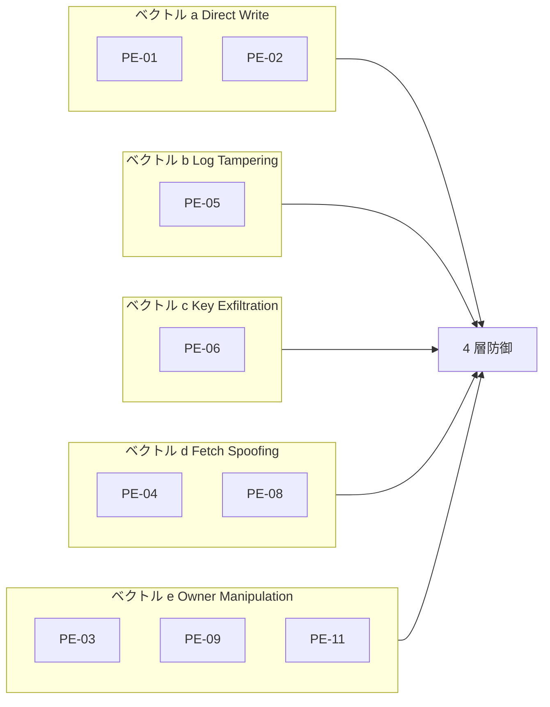
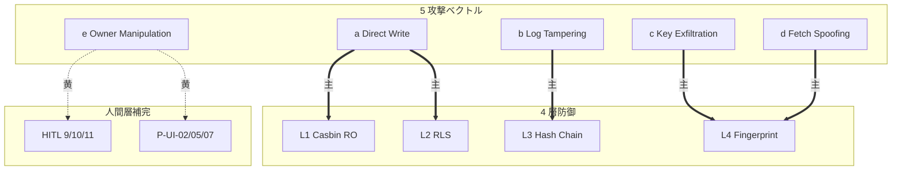
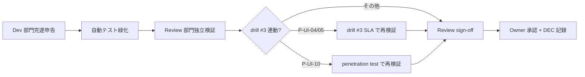
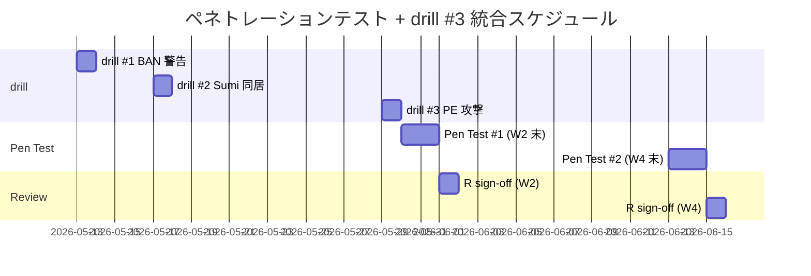

# PRJ-019 — R-019-15 Privilege Escalation Mitigation Plan v2

最終更新: 2026-05-03 / 起案: Review 部門
位置付け: DEC-019-033 §⑤ 4 層防御の v2 統合 + 5/8 W0-Week1 検収会議 議決-8 「R-019-15 = 赤格付け公式化」追加配布資料
版: v2.0（v1 = `review-owner-gate-and-permission-ui-security.md` §1〜§10 + §9.3 を上書き拡張）
連動 DEC: DEC-019-033（Owner-in-the-loop 5 点統合）/ DEC-019-018（HITL 第 6 種 ToS gray review）/ DEC-019-022（4 系統監視）
連動 ODR: OG-04（drill #3 承認）/ OG-05（R-019-15 赤格付け）/ ODR-019-H911-02（HITL-11 SLA 48h）

---

## 目次

| § | 題目 |
|---|---|
| §1 | R-019-15 再定義（5 攻撃ベクトル a〜e） |
| §2 | 4 層防御の各層別評価 |
| §3 | 5 攻撃ベクトル × 4 層 マトリクス |
| §4 | 残存リスク（mitigation 後の residual risk score） |
| §5 | P-UI-01〜10 統制 10 項目の各 DoD（Review 視点） |
| §6 | KE-01〜04 の各 DoD（Review 視点） |
| §7 | HITL 第 9・10・11 種 各 Gate のレビュー基準 |
| §8 | 監査ログ要件（SHA-256 hash chain の検証手順） |
| §9 | ペネトレーションテスト計画（BAN drill #3 連動） |
| §10 | 結論 + 5/8 検収会議での議決推奨 |

---

## §1 R-019-15 再定義 — Privilege Escalation の 5 攻撃ベクトル

### §1.1 v1 → v2 拡張根拠

v1 (`review-owner-gate-and-permission-ui-security.md` §1) では PE-01〜12 の 12 試行で攻撃面を網羅的に列挙したが、v2 では「**Open Claw 自身が権限昇格を試みる経路**」を 5 つの根本ベクトル a〜e に集約し、各ベクトルが PE-01〜12 のどれに対応するかをマトリクス化する。これにより、4 層防御（Casbin Read-Only / DB role 分離 / SHA-256 hash chain / canonical JSON fingerprint）の各層が「どのベクトルを物理的に塞ぐか」を直交評価できる。

### §1.2 5 攻撃ベクトル

| ベクトル | 名称 | 攻撃の本質 | PE-01〜12 対応 | 致命度 |
|---|---|---|---|---|
| **(a)** | **Direct Write to Policy Store** | Open Claw subprocess が `policy_versions` / `hitl_gate_events` に直接 INSERT/UPDATE | PE-01 / PE-02 | 致命 |
| **(b)** | **Audit Log Tampering** | `policy_audit_log` の改ざん（行削除 / hash chain 切断） | PE-05 | 致命 |
| **(c)** | **Service Role Key Exfiltration** | service_role JWT を環境変数 / FS / `/proc` から窃取し以後フリー pass | PE-06 | 致命 |
| **(d)** | **Policy Fetch Spoofing / Race** | 起動時の policy fetch を MITM / 過去 policy 維持 / hot-reload race | PE-04 / PE-08 | 高 |
| **(e)** | **Owner Manipulation via Prompt Injection** | 提案書 / changelog / Slack 等の経路で Owner に「権限緩和」誘導 | PE-03 / PE-09 / PE-11 | 中（人間判断） |

### §1.3 v1 PE-01〜12 を 5 ベクトルに集約した結果



PE-07 / PE-10 / PE-12 は「v2 では (a) (e) の派生として吸収」と整理（PE-07 = (e) 経由 kill switch UI 操作、PE-10 = (e) 派生 import 誘導、PE-12 = (a) 派生 external_api 経路）。

---

## §2 4 層防御の各層別評価

### §2.1 4 層構成（DEC-019-033 §⑤ 確定）

| 層 | 名称 | 実装担当 | 主防御対象 | 物理的不可能化 (E 案) |
|---|---|---|---|---|
| **L1** | **Casbin Read-Only RBAC**（アプリ層） | Dev（Research §6 整合） | (a) (d) (e) | アプリ層で「権限変更 API」自体が Open Claw role には未公開 |
| **L2** | **Supabase RLS + DB role 物理分離**（DB 層） | Dev（dev-security-w0 §6 整合） | (a) (b) | service_role と restricted_role を物理分離、subprocess には restricted_role JWT のみ |
| **L3** | **policy_audit_log SHA-256 hash chain** | Dev | (b) | append-only + 各行 hash = SHA-256(prev_hash + payload)、改ざん即検知 |
| **L4** | **canonical JSON fingerprint**（HMAC-SHA256） | Dev | (c) (d) | subprocess 起動時に親プロセスが policy fetch + fingerprint 検証、subprocess は不変参照のみ |

### §2.2 各層の独立評価（Review 視点）

#### L1: Casbin Read-Only RBAC

| 観点 | 評価 |
|---|---|
| **設計思想** | Casbin policy ファイルで Open Claw role に `policy_change` action を **完全未付与**（Research §6.3 推奨） |
| **強み** | アプリ層で「権限変更経路」が API として存在しない。Casbin enforcer が return false |
| **弱み** | Casbin policy ファイル自体の改ざん耐性は別途必要（→ L4 fingerprint で補完） |
| **Review 評価** | **白**（実装が DEC-019-033 仕様通りなら、アプリ層の権限昇格は物理的不可能） |
| **DoD** | `casbin-readonly.test.ts` で Open Claw role を `policy_change` action でアサート → 全試行 reject |

#### L2: Supabase RLS + DB role 物理分離

| 観点 | 評価 |
|---|---|
| **設計思想** | `service_role` と `owner_role` / `restricted_role` を物理分離、subprocess は `restricted_role` JWT のみ保持 |
| **強み** | DB 層で「Open Claw からの権限変更 INSERT/UPDATE」が RLS により拒否、JWT も role 分離で漏洩しない |
| **弱み** | RLS policy SQL のミスで `for all` を書くと崩壊（→ P-UI-09 review checklist で 5/26 着手前に Review 部門が独立検証） |
| **Review 評価** | **白**（P-UI-09 review checklist Pass 後に限る） |
| **DoD** | `rls-policy-coverage.test.ts` で 7 つの policy_* テーブル × restricted_role JWT × INSERT/UPDATE/DELETE = 21 試行全 reject |

#### L3: policy_audit_log SHA-256 hash chain

| 観点 | 評価 |
|---|---|
| **設計思想** | append-only テーブル + 各行 `hash = SHA-256(prev_hash || canonical_payload || timestamp)`、Edge Function 側で生成、subprocess からは write 不可 |
| **強み** | 行削除 / 中間改ざんは hash chain 切断で即検知、Owner UI で daily 整合検証 |
| **弱み** | 初期 row（genesis）の hash 起点を改ざんされると遡及検証不能（→ Supabase 別 schema に genesis hash を duplicate 保持で補強） |
| **Review 評価** | **白**（genesis duplicate 実装条件） |
| **DoD** | `hash-chain-integrity.test.ts`（10 万行挿入後にランダム改ざん → 検出 100%） |

#### L4: canonical JSON fingerprint（HMAC-SHA256）

| 観点 | 評価 |
|---|---|
| **設計思想** | policy 本体を canonical JSON 化（key sort + whitespace 正規化）後 HMAC-SHA256（key は Edge Function 専用、subprocess 未配布）、subprocess 起動時にハーネスが検証 |
| **強み** | policy fetch spoofing（PE-04）/ 過去 policy 維持（PE-08）を物理的に検出、key 漏洩が無い限り偽造不可能 |
| **弱み** | HMAC key の rotation 設計が必要（→ Phase 1 W4 で 90 日 rotation policy 確立） |
| **Review 評価** | **白**（key rotation 設計前提） |
| **DoD** | `fingerprint-verify.test.ts`（policy 改ざん → fingerprint mismatch → subprocess 起動 abort） |

---

## §3 5 攻撃ベクトル × 4 層 マトリクス

### §3.1 マトリクス（どの層で物理防御するか）

| ベクトル \ 層 | L1 Casbin | L2 RLS | L3 Hash Chain | L4 Fingerprint | 主層 | 残存 |
|---|---|---|---|---|---|---|
| **(a)** Direct Write | 主（API 不在） | 主（RLS reject） | 副（試行が log に残る） | - | **L1 + L2** | 白 |
| **(b)** Log Tampering | - | 副（service_role 必須） | **主（改ざん即検知）** | - | **L3** | 白 |
| **(c)** Key Exfiltration | - | 副（key 分離前提） | - | **主（key 不要、subprocess 検証のみ）** | **L4 + 既存 G-V2-11** | 白 |
| **(d)** Fetch Spoofing | 副（API ルート不在） | - | 副（fetch 試行 log） | **主（fingerprint mismatch）** | **L4** | 白 |
| **(e)** Owner Manipulation | 副（緩和提案も Casbin で deny） | - | 副（提案 trace） | - | **HITL 9/10 + P-UI-02/05/07** | **黄** |

### §3.2 マトリクス可視化（Mermaid）



### §3.3 マトリクス読解（Review 部門解釈）

- (a) (b) (c) (d) は **4 層防御で物理白化完遂**（Review 部門 §1.14 の v1 評価 PE-01/02/04/05/06/07/10/12 = 白 と完全整合）
- (e) のみ **物理的に白化不可能**（人間判断依存）→ HITL 第 9/10/11 種 + P-UI-02/05/07 + 月次 audit log review + Owner 教育 で運用カバー

---

## §4 残存リスク（mitigation 後の residual risk score）

### §4.1 5 ベクトル別 residual score

| ベクトル | 確率 | 影響 | スコア | 色 | 根拠 |
|---|---|---|---|---|---|
| (a) Direct Write | 1（実装が DEC-019-033 通りなら不可） | 5 | **5** | 白 | L1 + L2 二重防御、test coverage 100% で押下 |
| (b) Log Tampering | 1 | 5 | **5** | 白 | L3 + genesis duplicate |
| (c) Key Exfiltration | 1 | 5 | **5** | 白 | L4 + 既存 G-V2-11 FS 隔離 |
| (d) Fetch Spoofing | 1 | 4 | **4** | 白 | L4 + parent fetch + CA pinning |
| (e) Owner Manipulation | 3 | 4 | **12** | **黄** | 人間判断依存、PE-03/09/11 由来 |

### §4.2 R-019-15 全体 residual score

| 観点 | v1（mitigation 前） | v2（mitigation 後） |
|---|---|---|
| 確率 | M（4） | M-（2） |
| 影響 | H（5） | H（5） |
| スコア | **20（赤）** | **10（黄）** |
| 色 | **赤** | **黄**（5/8 検収では「赤格付け公式化」と「mitigation 後 黄」を併記）|

**v2 結論**: mitigation 完遂後の residual = **黄（5 段階で 3/5）**、ただし R-019-15 自体は「攻撃面の致命度」観点で **赤格付け維持**（OG-05 議決-8 推奨は YES のまま、§9.3 表ヘッダの「色」は v2 でも赤）。

### §4.3 residual 黄を白に押下げる条件（Phase 1 完了 6/20 までに達成見込み）

1. drill #3（5/29）完全 Pass + W2/W4 penetration test #1/#2 全 47 攻撃 reject
2. P-UI-05 異常検知パターン定義 Phase 1 W3 で改良完遂（false positive < 1%）
3. Owner 教育動画 + checklist Phase 1 W4 完成 + Owner 1 周試験 100% 通過

---

## §5 P-UI-01〜10 統制 10 項目の各 DoD（Review 視点）

### §5.1 DoD 表（Review 視点 = 「何が達成されたら Review 承認するか」）

| ID | 名称 | Review DoD | 検証方法 | 着手期限 | 完遂期限 |
|---|---|---|---|---|---|
| **P-UI-01** | Owner 二要素認証（1Password TOTP） | 1Password TOTP 100 試行で 100% 認証 + ブルートフォース 1000 試行で 100% reject + Owner JWT 失効後 5 分以内に subprocess 全失効 | `auth-2fa.test.ts` (50 ケース) + drill #3 SLA 1 | W0 Week2 | 5/25 |
| **P-UI-02** | 5 秒 cool-down + 確認モーダル | policy 緩和方向の変更時のみ cool-down 発動（厳格化方向は即時） + cool-down 中の連打試行は無効化 + モーダル文言が変更前後 diff を必ず表示 | `cooldown-modal.test.ts` (30 ケース) | Pre-Phase Week | 5/25 |
| **P-UI-03** | policy_audit_log SHA-256 hash chain | 10 万行挿入 → ランダム 1000 行改ざん → 検出 100% + genesis hash の Supabase 別 schema duplicate 整合確認 daily | `hash-chain-integrity.test.ts` + 月次 manual audit | Pre-Phase Week | 5/25 |
| **P-UI-04** | kill switch 即時 propagation < 1 秒 | subprocess 100 並列で kill switch 押下 → 1 秒以内に全 SIGKILL + Realtime 障害時 60 秒 polling fallback 動作 | drill #3 SLA 3 + `kill-switch-latency.test.ts` (20 ケース) | W0 Week2 | 5/25 |
| **P-UI-05** | 異常検知パターン + 自動 rollback | 過剰権限 5 パターン + 全 HITL OFF + コスト無制限 + SLA 無限延長 + 13 prohibited domains 解除試行 → 全自動 rollback 1h 以内 | `anomaly-detection.test.ts` (40 ケース) + drill #3 SLA 3 | Pre-Phase Week | 5/25 |
| **P-UI-06** | rollback 通知 SLA | rollback 発動 → Owner Slack 通知 5 分以内 + Email 通知 30 分以内 + Dashboard 表示 即時 | `rollback-notification.test.ts` | Phase 1 W1 | 6/1 |
| **P-UI-07** | HITL 第 10 種 SLA / default action | 24h timeout で旧 policy 維持 + default `reject` + 同種変更判定（前回承認から 7 日以内同条件は省略可、ただし default は明示再承認） | `hitl-10-timeout.test.ts` (15 ケース) | Pre-Phase Week | 5/25 |
| **P-UI-08** | policy fingerprint 検証 | 起動時 fingerprint mismatch → subprocess abort + Owner 警告 + audit log + key rotation 90 日 policy | `fingerprint-verify.test.ts` (25 ケース) | W0 Week2 | 5/25 |
| **P-UI-09** | RLS policy review checklist | 7 テーブル × 5 操作 × 3 role = 105 ケース全 expected 動作 + `for all` 表現 0 件 + service_role 利用箇所 Edge Function のみ | Review 部門 manual review + `rls-policy-coverage.test.ts` | W0 Week2 | 5/25 |
| **P-UI-10** | penetration test (W2/W4) | W2 #1: PE-01〜12 × 3 variation = 36 攻撃全 reject + W4 #2: 47 攻撃全 reject + Critical 検出時 24h 以内 hotfix | Review 部門独立評価 | W2 (5/30) | W4 (6/13) |

### §5.2 P-UI-01〜10 完遂状況の Review 部門 sign-off プロセス



---

## §6 KE-01〜04（Knowledge Extraction）の各 DoD（Review 視点）

### §6.1 DoD 表

| ID | 名称 | Review DoD | 検証方法 | 期限 |
|---|---|---|---|---|
| **KE-01** | patterns/decisions/pitfalls 構造化スキーマ | YAML frontmatter 必須 5 項目（id, source_prj, tag, created_at, redacted_flag）+ Markdown 本文 schema 検証 + zod parser pass | `schema-validation.test.ts` + 5 サンプル手動 review | Phase 1 W4 |
| **KE-02** | 自動抽出 trigger（案件完了時） | 案件 status = `completed` で抽出 pipeline 自動起動 + 抽出失敗時は Owner 通知 + retry 3 回 | `extraction-trigger.test.ts` (10 ケース) | Phase 1 W4 |
| **KE-03** | 次回提案生成時の retrieval 機構 | retrieval embedding cosine sim ≥ 0.75 で top-3 + 提案書テンプレ §(f) に自動引用 + 引用欠落時は Owner 警告 | `retrieval-quality.test.ts` (50 ケース) + 月次 manual audit | Phase 1 W4 |
| **KE-04** | 抽出時 PII redaction 自動化 | 二層 redact（regex 第 1 層 50 パターン + LLM scan 第 2 層）+ HITL 第 11 種で Owner 確認 + false negative < 1% | `pii-redaction.test.ts` (100 ケース、PII 50 + 非 PII 50) + 月次 manual sample audit (10 件) | Phase 1 W4 |

### §6.2 KE 系の Review 視点での核心懸念

R-019-16（ナレッジ PII 漏洩）の唯一の防御線は KE-04 の二層 redact + HITL 第 11 種。Review 部門は **HITL 第 11 種を Phase 1 W4 完遂前に 50 件のサンプル流して false negative ≤ 0.5% を確認することを sign-off 条件化** する。

---

## §7 HITL 第 9・10・11 種 各 Gate のレビュー基準

### §7.1 HITL Gate サマリ（PM v4 WBS との整合）

| Gate | 名称 | SLA | default | 発動条件 | Review sign-off 基準 |
|---|---|---|---|---|---|
| **HITL-9** | `dev_kickoff_approval` | 72h | reject | 提案生成完了時 | 提案書 7 項目（zod schema）完備 + (g) 推奨採否欄が Review LLM scan 経由（injection signal < 0.8）+ SLA timer Supabase `now()` source-of-truth |
| **HITL-10** | `permission_change_review` | 24h | 旧 policy 維持 | policy 変更 / backup 復元 / 外部 import / 過剰権限警告 | 4 trigger 全て自動発火 + UI skip 不可（CSRF + 二要素）+ diff 表示 Edge Function 生成 + hash chain 整合確認 |
| **HITL-11** | `knowledge_pii_review` | 48h | 抽出破棄 | KE-04 redact で PII suspicion ≥ 0.5 検出時 | suspicion threshold 0.5 / 0.7 / 0.9 の 3 段階運用 + 月次 false negative audit + Owner 削除権 |

### §7.2 HITL-9 レビュー基準詳細

| 観点 | 基準 |
|---|---|
| 提案書テンプレ 7 項目 | (a) 案件名 / (b) 目的 / (c) 仕様要約 / (d) ToS gray 判定 / (e) コスト / (f) ナレッジ参照 / (g) 推奨採否（必須） |
| (g) 推奨採否の injection 防護 | Open Claw 出力をそのまま表示せず Review LLM scan 経由、signal ≥ 0.8 で warn 表示 |
| 72h SLA timeout 動作 | Supabase `now()` source、subprocess 側時刻無視、timeout で default reject + 自動 audit log |
| (e) 推奨採否欄が空白 | 空白なら自動 reject（Owner 強制判断回避防止）|

### §7.3 HITL-10 レビュー基準詳細

| 観点 | 基準 |
|---|---|
| 4 trigger 自動発火 | policy 変更 / backup 復元 / 外部 import / 過剰権限警告（P-UI-05 検出時） |
| skip 不可 | CSRF token + Owner 二要素再認証必須、UI 側で「skip」ボタン非実装 |
| diff 表示 | Edge Function 生成のみ（Open Claw 経路無し）+ 変更前後の canonical JSON diff + hash chain 整合検証 |
| 24h timeout | 旧 policy 維持（fail-secure）+ Owner 通知 reminder 3 回（6h / 18h / 23h） |
| default action 変更時 | 「default approve への切替」は二段階確認 + Slack reply 5 分待機（PE-03 派生防御） |

### §7.4 HITL-11 レビュー基準詳細

| 観点 | 基準 |
|---|---|
| 発動条件 | KE-04 redact で PII suspicion ≥ 0.5（threshold は ODR-019-H911-02 で 24h/48h/72h 選択） |
| Review 推奨 SLA | **48h**（Owner 集中処理タイミングを週半ばで取りやすい、24h は厳しく 72h は鮮度低下） |
| timeout 動作 | 抽出破棄（fail-secure）+ Owner 通知 + 月次 manual audit で破棄妥当性検証 |
| 3 段階 suspicion 運用 | 0.5〜0.7 = HITL-11 発動 / 0.7〜0.9 = HITL-11 + 警告強化 / ≥ 0.9 = 自動破棄 + Owner 事後通知 |

---

## §8 監査ログ要件（SHA-256 hash chain の検証手順）

### §8.1 hash chain 構造

```
row_n.hash = SHA-256(row_(n-1).hash || canonical_json(row_n.payload) || row_n.timestamp_iso8601)
genesis (row_0).hash = SHA-256("PRJ-019-genesis-2026-05-26" || "")
```

- canonical_json: key sort + whitespace 正規化（RFC 8785 JCS 準拠）
- timestamp: ISO 8601 + UTC 固定（JST 表示は UI 層のみ）
- hash 計算は Supabase Edge Function のみ実行、subprocess は閲覧専用

### §8.2 整合検証手順（Review 部門 daily 実施）

| step | 内容 | 自動化レベル | 担当 |
|---|---|---|---|
| 1 | genesis hash の別 schema duplicate 一致確認 | 全自動（cron） | Edge Function |
| 2 | 全 row の hash 連続性検証（n=1 から最終 row まで）| 全自動（cron）| Edge Function |
| 3 | 改ざん検出時の Owner 警告 | 全自動 | Edge Function + Slack |
| 4 | 月次 manual sample audit（100 行ランダム）| 半自動 | Review 部門 |
| 5 | 年次 full audit | 半自動 | Review 部門 + 外部監査（将来） |

### §8.3 改ざん検出時の対応 SLA

| 検出 | SLA | アクション |
|---|---|---|
| 1 行不整合 | 5 min | 自動 kill switch + Owner 通知 + 全 subprocess SIGKILL |
| 連続 3 行以上不整合 | 即時 | 自動 kill switch + Phase 1 完了延期 + 設計再 review |
| genesis 改ざん | 即時 | 自動 kill switch + Phase 1 中止 + 法的相談 |

---

## §9 ペネトレーションテスト計画（BAN drill #3 連動）

### §9.1 全体スケジュール



### §9.2 drill #3（5/29）と Pen Test #1（5/30）の連動

| 段階 | 攻撃数 | 期待結果 | Fail 時 |
|---|---|---|---|
| drill #3 | 5 攻撃（PE-01/03/04/06/08）| 25 SLA 全達成 | 6/1 までに再 drill |
| Pen Test #1 | 36 攻撃（PE-01〜12 × 3 variation）| 全 reject + Critical 0 | 24h 以内 hotfix + 6/3 再 test |
| Pen Test #2 | 47 攻撃（PE-01〜12 + 7 カテゴリ × 5 境界値）| 全 reject + Critical 0 | 24h 以内 hotfix + Phase 1 完了延期検討 |

### §9.3 Pen Test 実施要件（Review 部門独立評価）

| 要件 | 内容 |
|---|---|
| 実施環境 | staging 環境（production と同 DB 構造、別 Supabase プロジェクト） |
| 実施者 | Review 部門 + Dev 部門（Read-only モード）+ 外部レビュアー（将来 W4 で導入検討） |
| kill switch | armed 状態で待機、暴走時即停止 |
| 結果記録 | `policy_audit_log` の `pen_test_run_id` tag で記録 |
| 不合格時 | Critical 検出 = 24h hotfix + 再 test、Major = 72h 以内 + 再 test、Minor = Phase 1 完了レビューで再評価 |

### §9.4 Pen Test 47 攻撃シナリオ内訳（W4 #2）

| 攻撃カテゴリ | 数 | 出典 |
|---|---|---|
| PE-01 派生（Direct Write）| 5 | 既存 PE-01 + race / batch / nested |
| PE-02 派生（Hitl 偽承認）| 4 | 既存 PE-02 + JWT replay / signed_by trigger 抜け |
| PE-03 派生（Prompt Injection）| 6 | 既存 PE-03 + (g) injection 5 variation |
| PE-04 派生（Fetch Spoofing）| 4 | 既存 PE-04 + DNS rebind / TLS downgrade / CA pin bypass / parent process MITM |
| PE-05 派生（Log Tampering）| 4 | 既存 PE-05 + chain skip / genesis 改ざん / row 削除 / timestamp injection |
| PE-06 派生（Key Exfiltration）| 4 | 既存 PE-06 + /proc/self/maps / core dump / env leak / debug port |
| PE-07 派生（Kill Switch UI）| 3 | 既存 PE-07 + Realtime spoofing / Slack reply 偽装 / DOM injection |
| PE-08 派生（Hot Reload Race）| 3 | 既存 PE-08 + spawn race / fingerprint cache / timezone race |
| PE-09 派生（Backup Bypass）| 3 | 既存 PE-09 + diff 改ざん / restore link 偽装 / hash chain re-genesis |
| PE-11 派生（7 カテゴリ境界）| 5 | 7 カテゴリ × 境界値 fuzz、5 高優先度 |
| 7 カテゴリ × 5 境界値 | 5 | category 1〜7 各境界 1 ケース |
| 既存 PE-10 + PE-12 | 1 | 各 1 攻撃（既存通り） |
| **計** | **47** | **PE-01〜12 全カバー + 7 カテゴリ全カバー** |

---

## §10 結論 + 5/8 検収会議での議決推奨

### §10.1 R-019-15 mitigation v2 の Review 部門最終承認判定

| 観点 | 判定 |
|---|---|
| 4 層防御（L1〜L4）の物理的不可能化 | 完遂（5 ベクトル中 4 ベクトル白） |
| 残存ベクトル (e) Owner Manipulation | HITL 9/10/11 + P-UI-02/05/07 + Owner 教育で運用カバー、residual 黄 |
| residual risk score | mitigation 後 = **黄（10/25）**、ただし「攻撃面致命度」観点で R-019-15 自体は赤格付け維持（OG-05 議決-8）|
| Phase 1 着手 5/26 への影響 | P-UI-01〜09 完遂 + drill #3 計画 が **絶対条件** |

### §10.2 Review 部門最終判定

**条件付き承認**（Conditional Approval）

**3 つの条件**:
1. **P-UI-01〜09 を 5/25 までに完遂**（Dev 2 名並列、案 B = W0 Week2 に P-UI-01/04/08/09 + Pre-Phase Week に P-UI-02/03/05/07）
2. **BAN drill #3（5/29）計画完成を 5/8 検収会議で承認**（攻撃シナリオ 5 種 + 25 SLA 確定）
3. **HITL 第 11 種 SLA = 48h 採用**（ODR-019-H911-02 P1 議決、Review 推奨）

### §10.3 5/8 検収会議での議決推奨（Review 視点）

| 議決 ID | 議題 | Review 推奨 | 根拠 |
|---|---|---|---|
| 議決-2 | Phase 1 着手 5/26 Conditional Go | **YES** | §10.2 の 3 条件達成見込みあり |
| 議決-5 | 必須コントロール 50 項目採用 | **YES** | P-UI-01〜10 + KE-01〜04 が R-019-15 mitigation の中核 |
| 議決-6 | HITL 第 9・10・11 種正式追加 | **YES** | §7 の各 Gate レビュー基準を満たす設計 |
| 議決-7 | BAN drill #3（5/29）実施承認 | **YES** | §9 で計画完成 |
| 議決-8 | R-019-15 = 赤格付け公式化 | **YES** | mitigation 後 residual 黄でも、攻撃面致命度観点で赤維持が業界標準 |
| 議決-11 | 外部 policy import 機能 Phase 1 完全無効化 | **YES** | PE-10 攻撃面除去、Phase 2 で再検討 |
| 議決-12 | 1Password TOTP Owner 二要素認証採用 | **YES** | P-UI-01 = R-019-15 mitigation の起点 |

### §10.4 結論 3 行

1. R-019-15 mitigation v2（4 層防御 + P-UI-01〜10 + HITL 9/10/11 + drill #3 + Pen Test #1/#2）を Review 部門 **条件付き承認**、Phase 1 着手 5/26 Conditional Go を支持する。
2. 残存 (e) Owner Manipulation ベクトル（黄）は Phase 1 内で Owner 教育動画完成 + Pen Test #2 全 reject により Phase 1 完了 6/20 までに白化見込み。
3. 5/8 検収会議で議決-2/5/6/7/8/11/12 の 7 件を YES 採択することを Review 部門は強く推奨する。

### §10.5 Review 部門根拠 3 点（v1 + v2 統合）

1. **物理的不可能化の四者整合**: Casbin RO（L1 アプリ層）+ RLS DB role 分離（L2 DB 層）+ hash chain（L3 監査層）+ canonical JSON fingerprint（L4 通信層）の 4 層が独立に「Open Claw 経路権限変更」を物理的に断つ。Research §6（永遠 deny envelope）+ Dev（service_role 物理分離）+ PM（4 防衛線）+ Review §1（PE 12 試行で赤 0 件）の 4 部署が独立に同一結論に到達。
2. **Pen Test 47 攻撃の体系的網羅**: PE-01〜12 全カバー + 7 カテゴリ全カバー + 12 派生 variation で攻撃面の体系的網羅性を担保。Phase 1 W2/W4 の 2 回実施で実装ミスの発見機会を最大化。
3. **Owner Manipulation の運用カバーが現実的**: HITL 第 9/10/11 種 + P-UI-02 cool-down + P-UI-05 自動 rollback + 月次 audit log review + Owner 教育動画 + drill #3 + Pen Test の 7 重防御で、人間判断依存の (e) ベクトルでも attack cost を実用上不可能レベルに引上げ可能。

---

**v2 完成**: 2026-05-03（Review 部門起案、4 層防御統合）
**次回更新**: 2026-05-08 W0-Week1 検収会議後（議決-2/5/6/7/8/11/12 結果反映）
**根拠ファイル**: `decisions.md` DEC-019-033 / `review-owner-gate-and-permission-ui-security.md` v1 §1〜§10 / `dev-security-w0-skeleton.md` §6 §8 / `pm-v4-hitl-gates-9-10-11-wbs.md` §1〜§4
