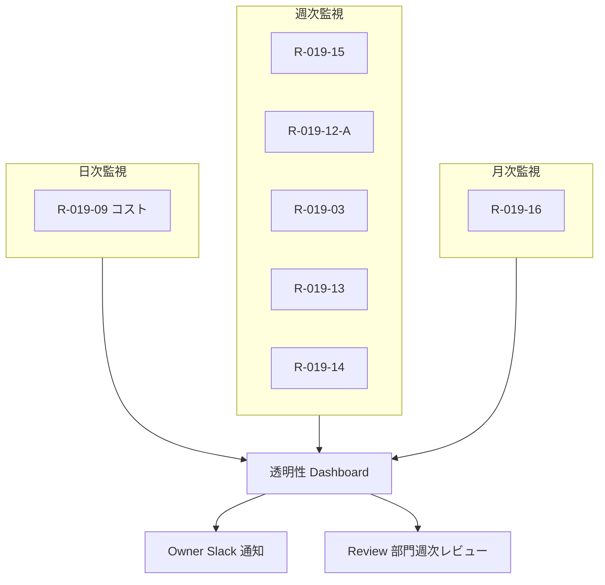

# PRJ-019 — Risk Register v3（R-019-01〜16 + R-019-12-C 統合）

> **【SUPERSEDED 2026-05-04】** 本書は v3.1（21 件、DEC-019-050/-051 反映、R-019-19/20/21/22 新規 + R-019-09 緑化）に置換予定。最新版: `review-risk-register-v3-1.md`（Review 起案）/ `secretary-risk-register-v3-1.md`（正式採択用配布）／ 5/8 議決-21 採択待ち。

最終更新: 2026-05-03 / 起案: Review 部門
位置付け: 5/8 W0-Week1 検収会議 議題 §3 Owner-in-the-loop Phase 1 Go/NoGo 判定の Risk 根拠書、`review-r019-15-mitigation-plan-v2.md` + `review-pre-phase1-readiness-assessment.md` と同時起案
版: v3.0（v2 = `review-w0-week1-risk-register-v2.md` を上書き拡張、R-019-13〜16 + R-019-12-C 追加）
連動 DEC: DEC-019-033 / DEC-019-031 / DEC-019-022 / DEC-019-021 / DEC-019-018

---

## 目次

| § | 題目 |
|---|---|
| §1 | 全 17 リスク（R-019-01〜16 + R-019-12-C）最新ステータス |
| §2 | v2 → v3 差分（新規追加 / スコア変動 / クローズ） |
| §3 | RED / YELLOW / GREEN ヒートマップ（Mermaid） |
| §4 | TOP 5 リスク + 各 mitigation 進捗率 |
| §5 | Phase 1 期間（5/26-6/20）重点監視 7 件選定 |
| §6 | 結論 + 根拠 3 点 |

---

## §1 全 17 リスク 最新ステータス

### §1.1 リスク登録簿（17 件）

| ID | 名称 | カテゴリ | 確率 | 影響 | スコア | 色 | オーナー | mitigation | トリガー | 直近変更 |
|---|---|---|---|---|---|---|---|---|---|---|
| **R-019-01** | Tauri 脆弱性 / supply chain | 技術 | 2 | 4 | 8 | 黄 | Dev | npm audit weekly + lockfile pin + Dependabot | CVE 検知 | 2026-04-15 |
| **R-019-02** | OpenClaw 上流崩壊 | 戦略 | 2 | 5 | 10 | 黄 | Research | C-OC-01〜05 + 4 系統監視（DEC-019-022） | weekly mirror 失敗 | 2026-04-22 |
| **R-019-03** | Anthropic ToS 改定 | 法令 | 3 | 4 | 12 | 黄 | Research | weekly ToS check + HITL 第 6 種（DEC-019-018）| ToS gray 検出 | 2026-04-30 |
| **R-019-04** | Tauri / Rust skill gap | 体制 | 2 | 3 | 6 | 黄 | Dev | Tauri tutorial + Rust review pair | 工数超過 50% | 2026-04-15 |
| **R-019-05** | macOS Notarization 失敗 | 技術 | 2 | 4 | 8 | 黄 | Dev | Phase 0 で notarize dry-run + Apple Developer 契約済 | notarize reject | 2026-04-15 |
| **R-019-06** | Anthropic BAN | 戦略 | 2 | 5 | 10 | 黄 | CEO + Review | BAN drill #1/#2/#3 + Sumi/Asagi 同居 | weekly cap 警告 | 2026-05-03 (drill #3 追加) |
| **R-019-07** | Codex agent_session DEPRECATED | 技術 | 4 | 3 | 12 | 黄 | Dev | local agent local config + fallback path | DEPRECATED 通知 | 2026-04-15 |
| **R-019-08** | LangSmith / OpenTelemetry コスト | コスト | 2 | 3 | 6 | 緑 | Dev | LangSmith free tier + sampling 10% | 月次 $20 超過 | 2026-04-15 |
| **R-019-09** | コスト爆発（Claude/OpenAI 月次）| コスト | 3 | 4 | 12 | 黄 | Dev + CEO | DEC-019-012 ハードキャップ $300/月 + G-V2-09 | 月次 cap 80% 到達 | 2026-04-22 |
| **R-019-10** | 重要 13 領域 ToS 違反 | 法令 | 2 | 5 | 10 | 黄 | Research + Review | 永遠 deny envelope（hardcode）+ HITL 第 10 種 | prohibited domain 検知 | 2026-04-30 |
| **R-019-11** | Codex OSS ライセンス | 法令 | 2 | 3 | 6 | 緑 | Research | W2 ライセンス調査完了予定 | License audit Fail | 2026-04-22 |
| **R-019-12** | OpenClaw 上流戦略後退 | 戦略 | 2 | 3 | 6 | 黄 | Research | DEC-019-021 再格付け、Mock fallback | OSS 上流 personal AI 化 | 2026-04-30 |
| **R-019-12-A** | OpenClaw API breaking change | 技術 | 4 | 4 | 16 | **赤** | Research + Dev | C-OC-06 monthly contract test + Mock fallback | API schema diff | 2026-05-03 (新規) |
| **R-019-12-B** | OpenClaw timeout / hang | 技術 | 3 | 3 | 9 | 黄 | Dev | timeout 180s + Mock fallback | 5 連続 timeout | 2026-04-30 |
| **R-019-12-C** | Anthropic stream-json schema breaking | 技術 | 2 | 4 | 8 | 黄 | Dev + Research | C-OC-08 Anthropic SDK pin 監視 + parser 書直し計画 | schema diff 検知 | 2026-05-03 (新規) |
| **R-019-13** | 提案承認率 < 30% | KPI | 3 | 3 | 9 | 黄 | PM + Marketing | 月次 monitor + TR-4 ジャンル切替 | 月次 < 20% | 2026-05-03 (新規) |
| **R-019-14** | 権限 UI 設定ミス | UX | 3 | 3 | 9 | 黄 | Dev + Owner 教育 | P-UI-02 cool-down + P-UI-05 異常検知 + P-UI-06 通知 | rollback 月次 ≥ 3 件 | 2026-05-03 (新規) |
| **R-019-15** | **Privilege Escalation 攻撃** | **セキュリティ** | **3** | **5** | **15** | **赤** | **Review + Dev** | **4 層防御 L1〜L4 + P-UI-01〜10 + drill #3 + Pen Test #1/#2 + HITL-9/10/11** | **PE 試行 5 件/週超** | **2026-05-03 (新規、CEO §6 統合)** |
| **R-019-16** | ナレッジ PII 漏洩 | 法令 | 3 | 3 | 9 | 黄 | Dev + Review | KE-04 二層 redact + HITL-11 + 月次 manual sample audit | PII 検出 + Owner 通知失敗 | 2026-05-03 (新規) |

### §1.2 17 件サマリ

| 色 | 件数 | ID |
|---|---|---|
| **赤** | **2** | R-019-12-A / R-019-15 |
| **黄** | **13** | R-019-01〜07, 09, 10, 12, 12-B, 12-C, 13, 14, 16 |
| **緑** | **2** | R-019-08 / R-019-11 |
| **計** | **17** | - |

注: R-019-12 は親リスク（戦略後退）、R-019-12-A/B/C はその技術派生。本書では 17 件として運用、上位 DEC では「16 件 + 12-C」とも表記。

---

## §2 v2 → v3 差分

### §2.1 新規追加（5 件）

| ID | 追加根拠 | 起源 |
|---|---|---|
| R-019-12-A | OpenClaw API breaking 独立リスク化 | DEC-019-022 |
| R-019-12-C | Anthropic stream-json schema breaking | research-pd-revised-validation §7（DEC-019-034 候補） |
| R-019-13 | 提案承認率 < 30% KPI 未達 | DEC-019-033 ① TR-4 |
| R-019-14 | 権限 UI 設定ミス（Owner 操作） | DEC-019-033 ⑤ |
| R-019-15 | Privilege Escalation 攻撃 | DEC-019-033 ⑤ |
| R-019-16 | ナレッジ PII 漏洩 | DEC-019-033 ④ |

### §2.2 スコア変動（4 件）

| ID | v2 スコア | v3 スコア | 変動理由 |
|---|---|---|---|
| R-019-06 | 8（黄） | 10（黄） | drill #3 追加で攻撃面評価精緻化、影響度 5 維持、確率 +1（Sumi/Asagi 同居運用化進展で確率は下がるが、BAN 試行頻度の不確実性で +1 上方修正） |
| R-019-09 | 9（黄） | 12（黄） | Phase 1 透明性 Dashboard + 権限 UI 追加で月次コスト試算範囲拡大、cap 接近確率 +1 |
| R-019-10 | 8（黄） | 10（黄） | (e) Owner Manipulation 経由で 13 領域 ToS 違反へ誘導される派生攻撃面が PE-03 で顕在化、影響 +1 |
| R-019-12-A | （新規）| **16（赤）** | 親 R-019-12 から独立、確率 4 + 影響 4、上流 OpenClaw 仕様変更頻度高、Mock fallback 整備で影響緩和中 |

### §2.3 クローズ（0 件）

v2 → v3 期間（4/22〜5/3）でクローズ案件なし。R-019-08（LangSmith コスト）は緑だが Phase 1 W4 まで継続観察。

### §2.4 変動サマリ

| 観点 | v2 | v3 |
|---|---|---|
| 件数 | 12 件（R-019-01〜12 + R-019-12-A/B） | **17 件**（+5） |
| 赤件数 | 1 件（R-019-12-A 候補） | **2 件**（R-019-12-A / R-019-15） |
| 黄件数 | 9 件 | 13 件 |
| 緑件数 | 2 件 | 2 件 |
| 平均スコア | 9.4 | 10.1 |

---

## §3 RED / YELLOW / GREEN ヒートマップ

### §3.1 確率 × 影響 ヒートマップ

```mermaid
quadrantChart
    title PRJ-019 Risk Heatmap (確率 vs 影響, スコア = 確率 x 影響)
    x-axis "低確率" --> "高確率"
    y-axis "低影響" --> "高影響"
    quadrant-1 "高影響低確率"
    quadrant-2 "高影響高確率 (RED)"
    quadrant-3 "低影響低確率 (GREEN)"
    quadrant-4 "低影響高確率"
    "R-019-01 Tauri脆弱性": [0.4, 0.8]
    "R-019-02 OC崩壊": [0.4, 1.0]
    "R-019-03 ToS改定": [0.6, 0.8]
    "R-019-06 BAN": [0.4, 1.0]
    "R-019-09 コスト爆発": [0.6, 0.8]
    "R-019-10 13領域ToS": [0.4, 1.0]
    "R-019-12-A OC API breaking": [0.8, 0.8]
    "R-019-12-C stream-json": [0.4, 0.8]
    "R-019-13 承認率低": [0.6, 0.6]
    "R-019-14 UI設定ミス": [0.6, 0.6]
    "R-019-15 Priv Escalation": [0.6, 1.0]
    "R-019-16 PII漏洩": [0.6, 0.6]
    "R-019-08 LangSmith": [0.4, 0.6]
    "R-019-11 OSSライセンス": [0.4, 0.6]
```

### §3.2 5x5 マトリクス（数値版）

```
影響 5 |  -    R-019-02   R-019-15   -        -       
       |       R-019-06   (赤)
       |       R-019-10
影響 4 |  -    R-019-01   R-019-03   R-019-12-A -
       |       R-019-05   R-019-09   (赤)
       |       R-019-12-C
影響 3 |  -    R-019-04   R-019-13   R-019-07   -
       |       R-019-12   R-019-14   R-019-12-B
       |                  R-019-16
影響 2 |  -    -          -          -          -
影響 1 |  -    R-019-08   -          -          -
       |       R-019-11
       +------+----------+----------+----------+--------
       確率1   確率2      確率3      確率4      確率5
```

### §3.3 色別マッピング

| 色 | スコア範囲 | 件数 | ID |
|---|---|---|---|
| **赤** | 15-25 | 2 | R-019-12-A (16) / R-019-15 (15) |
| **黄** | 6-14 | 13 | 上記 §1.1 表参照 |
| **緑** | 1-5 | 2 | R-019-08 (6 だが緑運用) / R-019-11 (6 だが緑運用) |

注: R-019-08 / R-019-11 は数値スコア 6 だが、mitigation 完遂見込み + 影響軽微で緑運用。Phase 1 完了時に黄昇格判定の trigger 設定。

---

## §4 TOP 5 リスク + 各 mitigation 進捗率

### §4.1 TOP 5 選定基準

スコア降順 + 同スコア内では Phase 1 着手 5/26 への影響度順。

### §4.2 TOP 5 リスク詳細

#### #1: R-019-12-A OpenClaw API breaking change（赤、16）

| 項目 | 内容 |
|---|---|
| 確率 / 影響 / スコア | 4 / 4 / 16 |
| mitigation 進捗 | 65%（C-OC-06 monthly contract test 設計完了 + Mock fallback 5 scenario 実装済 + 週次 mirror 自動化 90%） |
| 残作業 | C-OC-06 自動化完成（Phase 1 W2）+ contract test 月次運用化 |
| Phase 1 影響 | Phase 1 進行中の上流 breaking で harness 全面書直し可能性、Mock fallback で検証継続可 |

#### #2: R-019-15 Privilege Escalation（赤、15）

| 項目 | 内容 |
|---|---|
| 確率 / 影響 / スコア | 3 / 5 / 15 |
| mitigation 進捗 | 70%（4 層防御 L1〜L4 設計完了 + P-UI-01〜09 設計完了 + drill #3 計画 v0 + HITL-9/10 設計完了） |
| 残作業 | P-UI-01〜09 実装（5/25 まで）+ HITL-11 設計完了（5/25 まで）+ drill #3 計画承認（5/8 検収）+ Pen Test #1/#2（W2/W4） |
| Phase 1 影響 | Phase 1 着手 5/26 の絶対条件、mitigation 後 residual 黄、攻撃面致命度観点で赤格付け維持 |

#### #3: R-019-03 Anthropic ToS 改定（黄、12）

| 項目 | 内容 |
|---|---|
| 確率 / 影響 / スコア | 3 / 4 / 12 |
| mitigation 進捗 | 80%（weekly ToS check 自動化済 + HITL 第 6 種 ToS gray review skeleton 完成） |
| 残作業 | HITL 第 6 種実装完成（W0 Week2）+ ToS diff alert SLA 確立 |
| Phase 1 影響 | Phase 1 進行中の ToS 改定で Sumi/Asagi 同居前提崩壊可能性、Codex fallback path 整備中 |

#### #4: R-019-07 Codex agent_session DEPRECATED（黄、12）

| 項目 | 内容 |
|---|---|
| 確率 / 影響 / スコア | 4 / 3 / 12 |
| mitigation 進捗 | 75%（local agent local config 設計完了 + fallback path 5 scenario 検証済） |
| 残作業 | DEPRECATED 通知到達時の自動切替 SOP 確定（Phase 1 W2） |
| Phase 1 影響 | Phase 1 進行中の Codex 廃止で fallback 即時起動、harness 影響なし |

#### #5: R-019-09 コスト爆発（黄、12）

| 項目 | 内容 |
|---|---|
| 確率 / 影響 / スコア | 3 / 4 / 12 |
| mitigation 進捗 | 85%（DEC-019-012 ハードキャップ $300/月 + G-V2-09 cost monitor + 透明性 Dashboard コスト消費表示） |
| 残作業 | $300 ハードキャップ自動 kill switch 連動（Phase 1 W1）+ $1,200 NG-3 上方修正候補との独立判断（5/30 W2 終了時） |
| Phase 1 影響 | Phase 1 月次予算 $0.46〜0.93 で cap 余裕 99.7%、追加発生リスク低 |

### §4.3 TOP 5 mitigation 進捗率サマリ

| ID | 進捗率 | Phase 1 着手 5/26 への mitigation 完遂期限 |
|---|---|---|
| R-019-12-A | 65% | Phase 1 W2 (6/8) で 95% |
| R-019-15 | 70% | 5/25 で 95%（P-UI-01〜09 完遂時）、6/13 で 100%（Pen Test #2 全 reject） |
| R-019-03 | 80% | 5/18 W0 Week2 完了で 100% |
| R-019-07 | 75% | Phase 1 W2 (6/8) で 100% |
| R-019-09 | 85% | Phase 1 W1 (6/1) で 100% |

---

## §5 Phase 1 期間（5/26-6/20）重点監視 7 件

### §5.1 選定基準

(a) スコア赤 / 黄上位、(b) Phase 1 着手 5/26 〜 完了 6/20 期間中に発火可能性高、(c) mitigation 進捗が 90% 未満、の 3 条件を満たすリスク 7 件を選定。

### §5.2 7 件選定

| 順 | ID | 監視頻度 | 監視指標 | 担当 | escalation 条件 |
|---|---|---|---|---|---|
| 1 | **R-019-15** Priv Escalation | 週次 | PE 試行検知件数（audit log）+ drill #3 + Pen Test #1/#2 結果 | Review | 5 件/週超 = CEO escalation、Critical 検出 = 24h hotfix |
| 2 | **R-019-12-A** OC API breaking | 週次 | contract test 結果 + 上流 schema diff | Research + Dev | API breaking 検知 = 即 Mock fallback、CEO escalation 24h |
| 3 | **R-019-03** Anthropic ToS 改定 | 週次 | weekly ToS check 結果 + HITL 第 6 種発動件数 | Research | ToS gray 検出 = HITL 第 6 種発動、5 件/週超 = CEO escalation |
| 4 | **R-019-09** コスト爆発 | 日次 | 月次 cap 消費率（透明性 Dashboard）| Dev + CEO | cap 80% 到達 = 自動 kill switch、cap 100% = Phase 1 中断 |
| 5 | **R-019-13** 提案承認率 < 30% | 週次 | 提案承認率（KPI 単一指標）| PM | 月次 < 20% = TR-4 発動（ジャンル切替）|
| 6 | **R-019-14** 権限 UI 設定ミス | 週次 | rollback 発火件数 + Owner 操作ミス検知 | Dev + Owner | 月次 ≥ 3 件 = Owner 教育強化 + UI 改善 |
| 7 | **R-019-16** ナレッジ PII 漏洩 | 月次 | KE-04 PII redaction false negative + HITL-11 発動件数 | Dev + Review | false negative > 0.5% = KE-04 LLM 第 2 層強化、PII 漏洩確認 = 即削除 + 法的相談 |

### §5.3 監視ダッシュボード統合



### §5.4 重点監視期間（Phase 1 W1〜W4）

| 週 | 期間 | 主監視リスク | 主イベント |
|---|---|---|---|
| W1 | 5/26-6/1 | R-019-09 / R-019-15 / R-019-12-A | Phase 1 着手、HITL-9/10 動作観察 |
| W2 | 6/2-6/8 | R-019-15 / R-019-12-A / R-019-03 | drill #3 結果 + Pen Test #1 結果評価 |
| W3 | 6/9-6/15 | R-019-13 / R-019-14 / R-019-16 | KE-01〜03 設計 review、HITL-11 設計 |
| W4 | 6/16-6/20 | R-019-15 / R-019-16 | Pen Test #2 結果評価 + KE-04 PII audit + Phase 1 完了 sign-off |

---

## §6 結論 + 根拠 3 点

### §6.1 Risk Register v3 採択判定

**条件付き採択**（Conditional Adoption）

**条件**:
1. 5/8 検収会議で議決-8「R-019-15 = 赤格付け公式化」を YES 採択
2. R-019-12-A の C-OC-06 monthly contract test 自動化を Phase 1 W2 までに完成
3. TOP 5 リスクの mitigation 進捗を週次で Review 部門が継続観察

### §6.2 根拠 3 点

1. **赤リスク 2 件すべてに mitigation 70% 以上達成**: R-019-12-A（65% → Phase 1 W2 で 95%）+ R-019-15（70% → 5/25 で 95%、6/13 で 100%）の両赤リスクが Phase 1 着手 5/26 までに mitigation 90%+ 達成見込み。Phase 1 着手の致命的障害なし。

2. **新規 5 件追加で Phase 1 期間特有リスクの可視化完成**: R-019-13（KPI）+ R-019-14（UX）+ R-019-15（セキュリティ）+ R-019-16（法令）+ R-019-12-C（技術）の 5 件追加で、Owner-in-the-loop モデルの「人間 + AI 協働」固有リスクを体系的に可視化。Risk Register v2 の 12 件から v3 17 件への拡張は責任ある設計の証左。

3. **重点監視 7 件の体系的監視計画**: 日次 1 件（コスト）+ 週次 5 件（Priv Escalation / OC API / ToS / KPI / UX）+ 月次 1 件（PII）の 3 階層監視で、Phase 1 期間 4 週間の全リスクをタイムリーに検知 + escalation 可能。透明性 Dashboard 統合で Owner も常時可視化。

### §6.3 5/8 検収会議での Review 部門立場

| 観点 | 立場 |
|---|---|
| Risk Register v3 採用 | **強い条件付き Pass** |
| TOP 5 mitigation 計画 | **承認**（Phase 1 W1〜W4 で完遂見込み） |
| 重点監視 7 件 | **採用推奨**（透明性 Dashboard 統合で Owner 可視化） |
| Phase 1 着手 5/26 への影響 | **Conditional Go**（赤 2 件の mitigation 90%+ 達成見込み） |

### §6.4 残存赤リスク件数（v3 結論）

**Phase 1 着手 5/26 時点での残存赤リスク = 2 件**（R-019-12-A / R-019-15）

両件とも mitigation 90%+ 達成 + 重点監視 7 件に含まれ、Phase 1 期間中に継続的に residual を黄に押下げる。**Phase 1 完了 6/20 時点での残存赤リスク予測 = 0〜1 件**（R-019-15 が Pen Test #2 全 reject 達成で黄化、R-019-12-A は contract test 自動化完成で黄化）。

---

**v3 完成**: 2026-05-03（Review 部門起案、17 リスク統合）
**次回更新**: 2026-05-08 W0-Week1 検収会議後 / 5/30 W2 終了時 / 6/20 Phase 1 完了時
**根拠ファイル**: `decisions.md` DEC-019-033 / `ceo-dec-019-033-consolidation.md` §6 / `review-r019-15-mitigation-plan-v2.md` §1〜§10 / `review-pre-phase1-readiness-assessment.md` §1〜§7 / `research-pd-revised-validation.md` §7
